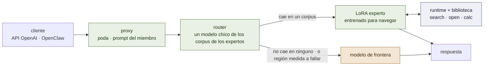

# lora-kernel


*El especialista, la biblioteca, el radar — y, por la puerta, la frontera, para cuando ningún cajón sirve.*

**El LoRA no es el libro de texto; es el especialista que sabe usar la biblioteca.**

[](LICENSE)
[](docs/es/ARCHITECTURE.md)
[](docs/es/MEMORY.md)
[](docs/es/RECORD.md)

*[English](README.md)*

lora-kernel es el runtime de un servicio: una **API compatible con OpenAI** que resuelve
localmente lo que cae dentro de una región medida y manda el resto a un modelo de frontera,
con **instancias de OpenClaw por tarea** encima. Una región es un experto QLoRA chico sobre
un modelo chico residente. Lo que un experto sabe *hacer* está en sus pesos; lo que necesita
*saber* está en una biblioteca de notas markdown que fue entrenado para navegar — así que
cuando un protocolo cambia se edita un archivo en git, y nada se reentrena.

Cada afirmación de abajo está marcada **[ran]** (observada en este repositorio, con la
corrida nombrada), **[read]** (de código fuente o de un paper) o **[spec]** (decidido,
todavía no construido). **Todo lo medido hasta ahora es sobre suites generadas; ningún
tráfico real pasó todavía por acá.** Eso es lo primero que hay que saber de los números, y el
núcleo de la 1.0 está *especificado*, no shippeado.

---

## El núcleo de la versión 1.0


*El núcleo de la 1.0: un router que puede abstenerse, un especialista y una biblioteca por subdominio, un árbitro debajo de todos.*

Cinco cosas, y cómo cambia cada una:

| | qué es | cambia con |
|---|---|---|
| **Un experto es su corpus** | un QLoRA por subdominio, entrenado con SFT común; servido bajo exactamente el prompt, el bloque de herramientas y el formato de resultado que le enseñó su corpus — o es otro modelo | una corrida de entrenamiento |
| **El router** | un modelo muy chico de esos mismos corpus: *¿de qué distribución es este pedido?* — y **se abstiene** cuando la respuesta es ninguna. Abstenerse es la frontera | re-indexar los corpus |
| **La memoria** | una biblioteca de notas que el experto navega — abajo | **editar markdown** |
| **El runtime** | un árbitro chico en Python dentro del proxy: ejecuta los comandos del experto, aplica las reglas de un sitio, hace cumplir el orden de los pasos | un cambio de código |
| **El contrato de release** | un manifiesto por miembro — corpus, adaptador, biblioteca, radar y gramática, cada uno con hash; admitido por un test pareado contra la base pelada | una compuerta que tiene que pasar |

Y una cosa que se agrega por subdominio donde se mide que paga, **no requerida por la 1.0**:
un segundo LoRA sobre un modelo grande de la misma familia, entrenado sobre el mismo corpus,
que verifica lo que el chico borradorea ([`docs/es/PLAN.md`](docs/es/PLAN.md) hitos 3–4).

### La memoria, en cinco piezas

Especificación completa: [`docs/es/MEMORY.md`](docs/es/MEMORY.md) **[spec]**.

1. **La biblioteca — dos estantes de markdown**, cada nota de menos de media página. El
   **arnés operativo** (*¿cómo se hace?*): notas tipo receta cuyos enlaces son el flujo de
   control — `requires` (antes de esto, aquello), `next` (el paso que sigue), `uses` (para
   este paso, consultar…). La **wiki enciclopédica** (*¿qué es, qué fórmula aplica?*): un
   árbol, de general a específico, que clasifica en qué caso estás antes de calcular.
2. **El radar — embeddings comprimidos a un subdominio.** No es un motor de búsqueda general.
   En un dominio cerrado el vocabulario tiene un significado funcional exacto, así que un
   vector chico alcanza para mapear las únicas dos intenciones que importan: *para qué
   situación es esta nota* (`when:`) y *qué define* (`what:`). Devuelve las dos o tres notas
   de exactamente el subdominio en el que trabaja el experto.
3. **El lenguaje — tres verbos.** `<search>una situación o una duda</search>` devuelve
   títulos e ids. `<open>id</open>` devuelve la nota y sus enlaces. `<calc>expresión</calc>` —
   para que el modelo nunca haga aritmética de memoria, donde siempre falla.
4. **El LoRA — entrenado en el hábito de navegación.** Sus casos de entrenamiento sortean sus
   constantes de nuevo cada vez — un líquido inventado para un ejercicio, un tiempo de
   permanencia local de 15 segundos en vez de 5 — así que la respuesta no se puede memorizar
   y el modelo queda *obligado a abrir la nota para ver el número*. Lo que termina en los
   pesos es una coreografía: leer, buscar en el arnés, abrir el protocolo, hacer una parada
   en la wiki cuando un paso necesita un dato, mandar los números a `<calc>`, seguir `next`.
5. **El runtime — el árbitro de software.** Pasa las páginas, escribiendo cada resultado justo
   después del tag. Aplica reglas locales automáticamente: una sala que desinfecta durante 20
   segundos tiene ese valor sustituido *antes* de que la nota llegue al experto, que lee la
   regla ya resuelta. Y vigila que no haga trampa: si el paso 4 `requires` el paso 1 y el
   experto nunca abrió el paso 1, el runtime corta la ejecución — sin necesitar saber si la
   respuesta final estaba bien.


*Una tarea, de punta a punta. El desvío del arnés a la wiki y de vuelta es el punto.*

**La ganancia.** Si el protocolo cambia mañana, se edita un archivo markdown en git. El LoRA
no se reentrena, porque lo que aprendió fue a obedecer los enlaces y leer las notas.

---

## Qué se mide

Sobre `Qwen2.5-3B-Instruct`, la base sobre la que se construyó el pool — y, desde el hito 1, sobre `Qwen3.5-4B`, donde los dos miembros liberados sostienen sus números.

| qué | el número | corrida |
|---|---|---|
| **Un vLLM, una base, varios adaptadores**, cada pedido servido por el suyo | identidad `applied` en cada miembro, herramientas alcanzables, stop honrado | **[ran]** P56 |
| **`email-full@v1`** — triage de inbox, herramientas y juicio en un solo adaptador | **0,989** en mensajes humanos contra **0,345** de la base; re-servido y re-entrenado, ambos empatan la corrida grabada | **[ran]** P36, P57 |
| **`desk-commitment@v1`** — un segundo miembro sobre el *mismo inbox*, otra pregunta | **240/240** contra **38/240** de la base, discordantes **202 : 0** | **[ran]** P64 |
| **El pool sobre la familia Qwen 3.x** — los dos miembros reentrenados sobre `Qwen3.5-4B`, mismos corpus, misma receta (`@v2`) | `email-full` **471/475**, exactamente su release de Qwen 2.5 (empate, 1 : 1); `desk-commitment` **240/240** (empate); identidad `applied` en los dos adaptadores de receta completa | **[ran]** M1 |
| **Un experto que razona, servido como le enseñó su corpus** — mecánica de fluidos, cadenas de 6 a 9 pasos con una calculadora y un manual por caso | **90/90**, donde el mismo adaptador sobre los mismos casos sacó **11/90** a través de mensajes `tool_calls` (79 : 0, pareado) — y **24 : 0** contra el 66/90 de la frontera. Ningún caso evaluado está en su corpus | **[ran]** M7 arm 0b |
| **En un 3B, un procedimiento simplemente pegado en el prompt no se sigue** | base + un procedimiento de 914 tokens: **0 llamadas a herramientas en 351/351**, debajo de la barra de mayoría; el experto entrenado le gana **137 : 1** | **[ran]** P61 |
| **La API rutea por pedido**; el cliente no nombra modelo | replay sobre 240 casos: 0,546 → 0,775, 0 mal-ruteados | **[ran]** P41, P62 |
| **OpenClaw, en vivo, desde una laptop** | 40/40 turnos locales, 0 llamadas inventadas, 19/32 turnos humanos llaman a una herramienta | **[ran]** P63 |
| **A un miembro hay que servirle su propia superficie de herramientas** | ofrecidas las 54 herramientas de OpenClaw copia tags del bloque: 225 de 227 llamadas rechazadas; podado, 8 de 1160 | **[ran]** P59 |
| **vLLM aplica un LoRA sobre un modelo grande cuantizado** | compuerta de logprobs 3/3, \|Δℓ\| medio 0,22–0,49 nats contra un base-vs-base de 0,000 | **[ran]** P60 §3b |
| **Los adaptadores de Qwen 3.5 son servibles** — "vLLM los ignora" era un desajuste de nombres | mismos pesos, 496 tensores renombrados, sin reentrenar: `not applied` → **`applied`** | **[ran]** D2 |

**La única lección debajo de la mitad de esa tabla: servir a un experto tal como le enseñó su
corpus.** Bajo un system prompt ajeno, 2 de 32 turnos en vivo llaman a una herramienta; bajo
el suyo, 19 de 32 (P63). A través de mensajes `tool_calls` un experto de inbox saca 0,808, con
los resultados escritos inline 0,992 (P55). Y la frase que más citó este repositorio —
*"el experto que decide funciona, el experto que razona falla"* — se leyó de un harness que
nunca le mostró al experto sus resultados de la forma en que había sido entrenado para
leerlos: 11 de 90 se convirtieron en 90 de 90 (M7 arm 0b). La memoria está construida
exactamente sobre ese canal.

## Qué no está medido, o no funciona

- **No hay datos reales.** Cada suite hasta ahora se genera acá, y una suite generada no puede
  contener una dificultad que su autor no pensó **[ran]** P50. La primera región real ya tiene
  nombre — **procedimientos de enfermería** (*Nursing Skills* de Open RN, CC BY 4.0) — y sólo está
  medido su margen: un 4B sin entrenar pasa de 29/48 a libro cerrado a 45/48 con la nota correcta
  abierta, y de 0/12 a 12/12 en un valor que cambió el protocolo de una unidad **[ran]** M5. Todavía
  no hay nada entrenado sobre ella, y la recuperación no está probada.
- **La afirmación central de la memoria se midió una vez y no pasó.** Que una biblioteca extiende a un
  experto a un *procedimiento sobre el que nunca entrenó*: en 56 recorridos retenidos el brazo con
  biblioteca saca 35, el mismo experto sin la biblioteca 2, el base sin entrenar navegando solo 0 — y el
  base sin entrenar *con las notas correctas delante* 45 (6 : 16 pareado, $p=0{,}052$) **[ran]** M7-W5.
  La navegación se transfirió; leer una nota que da dos valores, una forma que el corpus nunca mostró, no
  (0 de 11) — y un segundo corpus que *sí* mostró esa forma, sobre ocho notas, tampoco la enseñó: 4 de 15 en
  una nota nueva, 17 de 18 en las entrenadas, el par sigue en empate con 12 : 16 **[ran]** M7-W5c. La biblioteca, el árbitro y el corpus están construidos (W1–W4); el radar llega a recall@3
  0,64 contra una vara de 0,80 (W3). Sin
  ella, un especialista apenas fuera de su región está confiadamente equivocado — 30/30
  adentro, 1/20 en familias hermanas **[ran]** P14.
- **El router sigue siendo un diccionario de palabras clave.** Su primer reemplazo aprendido,
  un modelo de n-gramas de cada corpus, es más seguro sobre texto ajeno (0 de 128 servidos
  localmente contra el 59 del diccionario) y pierde **todos** los pedidos legítimos de un
  remitente que el generador nunca sacó, 120 de 120 **[ran]** M2.
  Un modelo de embeddings hace lo mismo, y no por falta de un umbral mejor: un pedido de un remitente
  no visto y *el listado propio de un miembro seguido de otra tarea* quedan a la misma distancia del
  corpus **[ran]** M2 brazo 2. Lo que queda es una representación que separe la tarea de su
  contenido — la proyección aprendida del radar, alcanzada desde el lado del router.
- **Sobre la base nueva un adaptador tiene menos que agregar.** El `Qwen3.5-4B` pelado saca 0,632 en
  email humano donde el 3B sacaba 0,345 **[ran]** M1. Los miembros igual empatan a sus releases
  viejos; cuánto margen deja un 4B es una pregunta que toda región nueva ahora tiene que hacerse primero.
- **Fuera de su profundidad de entrenamiento, el experto que razona está de nuevo sin medir.**
  El resultado de que resuelve de más los problemas más cortos (P45) llegó por el camino de
  `tool_calls`, y sigue abierto.
- **El ahorro en plata nunca se midió**, y ninguna señal ve todavía una respuesta que sea
  coherente y equivocada.

El registro completo, con todo lo que falló y los instrumentos que mintieron, es
[`docs/es/RECORD.md`](docs/es/RECORD.md).

---

## El camino del pedido


*El camino de un pedido. Abstenerse hacia la frontera es un carril, no un error.*



## Dónde se ubica en una organización

Una organización que funciona con agentes suele dibujar el mismo esquema: arriba, personas en unos
pocos roles; un runtime de agentes con **un agente por rol**; las aplicaciones que esos agentes operan;
los canales que la gente ya usa; y abajo, una sola base de datos con identidad, pagos y monitoreo al
lado. En ese esquema cada agente es un system prompt sobre el mismo modelo remoto.

lora-kernel es la capa debajo de la columna de agentes. **Cada rol pasa a ser un experto** — un
adaptador entrenado en cómo *esta* organización hace ese trabajo — **con dos cajones de notas**: cómo
lo hacemos acá, y lo que sabemos. El rol del que llega un mensaje es la ruta, así que rutear bien no
cuesta nada. Lo que un experto está medido para resolver se responde en la máquina de la organización;
el resto va a la frontera, o a una persona donde la política dice que nada sale del edificio. Los
sistemas de registro quedan donde están: **los registros quedan en la base, los hábitos van en el
adaptador, el conocimiento queda en notas que una persona puede leer y corregir.**


*Dónde se ubica en una organización: los registros quedan en la base, los hábitos van en el adaptador, el conocimiento queda en notas que una persona puede leer.*

La misma forma, en otros ámbitos — ninguno está medido, es hacia donde apunta el diseño:

| organización | roles que pasan a ser expertos | qué va en los dos cajones |
|---|---|---|
| **una distribuidora** | atención al cliente, recepción, despacho, compras, reclamos | los procedimientos de manejo del lugar · catálogo, transportistas, niveles de servicio |
| **un estudio contable o jurídico** | ingreso de casos, revisión de documentos, vencimientos, facturación | las listas de control y plantillas del estudio · las reglas de su jurisdicción, cliente por cliente |
| **una escuela o centro de formación** | inscripciones, apoyo docente, comunicaciones, compras | cómo resuelve esta escuela cada caso · programa, calendario, reglamento |
| **un taller o servicio técnico** | recepción de equipos, diagnóstico, repuestos, garantías | el procedimiento de cada tipo de reparación · manuales, listas de repuestos, condiciones de garantía |
| **un club o centro comunitario** | socios, inscripciones a actividades, instalaciones, cobranzas | cómo resuelve este club cada caso · actividades, cuotas, reglamento interno |
| **una administración de propiedades** | pedidos de inquilinos, mantenimiento, cobranzas, proveedores | el procedimiento de escalamiento por edificio · contratos, reglamentos, condiciones de proveedores |

Lo que comparten es lo que hace que una región merezca un experto: **los mismos pocos procedimientos,
repetidos a diario, con reglas locales que difieren del manual, sobre datos que no deberían salir.**
La primera biblioteca de este repositorio está armada con los procedimientos paso a paso de un manual
abierto ([`knowledge/nursing-iv/`](knowledge/nursing-iv/)). Lo que *no* está
establecido está en la sección de arriba, y vale acá entero: todavía no hay datos reales, y la
afirmación de que una biblioteca extiende a un experto a un procedimiento que nunca entrenó no está
probada.

## Del runtime a un framework

Lo que este repositorio es hoy es un **runtime medido**: un pool de expertos detrás de una API, una
biblioteca con su árbitro, y las compuertas que deciden qué se libera. Lo que necesita el dibujo de
arriba es un **framework** — algo que un tercero completa sin leer nuestro código. La distancia entre
los dos está escrita en [`docs/es/FRAMEWORK.md`](docs/es/FRAMEWORK.md); en resumen:

| | |
|---|---|
| **funciona [ran]** | varios adaptadores sobre un modelo residente · dos expertos liberados a través de una compuerta pareada · la API que poda, pone el prompt y rutea · OpenClaw en vivo · el formato de la biblioteca, el lint, el árbitro · **navegación que se transfiere a un procedimiento nunca entrenado** |
| **todavía no** | la afirmación central de la memoria (tres corridas, no pasa: el adaptador navega, el base *sin entrenar* lee mejor) · la búsqueda de notas (0,64 contra 0,80) · un router aprendido · mover un experto que razona entre bases |
| **no existe** | el **paquete de rol** (un directorio por rol: herramientas, prompt, corpus, biblioteca, suites, política de respuesta, política de salida) · la **capa de herramientas** hacia los sistemas de registro, actuando como la persona que pregunta · aislamiento por usuario · mediciones de concurrencia, latencia y costo · un instalador · cualquier idioma que no sea inglés · cualquier *escritura* medida |
| **sigue, lo más barato primero** | decidir quién lee (una sesión, sin entrenar) · rol como ruta (cero GPU) · el paquete de rol (cero GPU) · una organización de referencia sobre un dominio neutral y generado — tres roles, una base de datos de juguete, una biblioteca con la forma condicional sobre muchas notas |

## Adónde va

Cada hito tiene una compuerta y el brazo que puede matarlo, escritos antes de correr
([`docs/es/PLAN.md`](docs/es/PLAN.md)). Los brazos se compran en secuencia, nunca como grilla.

| # | hito | estado · el brazo que lo mata primero |
|---|---|---|
| **1** | el pool sobre Qwen 3.x chico (`Qwen3.5-4B`) | ✅ **[ran] — movido.** Los dos miembros empatan a sus releases de Qwen 2.5; manifiestos `@v2` |
| **2** | el router como un modelo chico de los corpus | brazos 1 y 2 **[ran]**, ninguno pasa: los dos pierden todo pedido de un remitente no visto · sigue una proyección que factorice la tarea del contenido, sobre conjuntos nuevos |
| **7** | **la memoria** — el núcleo de la 1.0 | brazo 0 y 0b **[ran]**: el canal funciona · bajo una trayectoria **oráculo** — exactamente las notas correctas abiertas — el experto igual saca ~1/20 en un procedimiento de una familia hermana que nunca entrenó · **W1–W4 construidos; W5 [ran], no pasa:** 35/56 contra el base sin entrenar que lee, 45/56 — la navegación se transfirió, una nota de dos valores no se leyó (atribuido **[ran]** W5b: con el base escribiendo la línea quedan 0 de esas 12 — una forma que el corpus nunca mostró) · **W5c [ran], falsado:** mostrada la forma sobre ocho notas, el adaptador aprende las notas, no la lectura — 4/15 |
| **5** | la primera región real: procedimientos de enfermería | margen **[ran]**: 29/48 a libro cerrado → 45/48 con la nota abierta, 0/12 → 12/12 en un valor del sitio · sigue: el mismo contenido como *recorridos*, contra la base sin entrenar leyendo las mismas notas |
| **3–4** | la mitad grande de un par, y la aceptación entre las mitades | no empezado · grande + LoRA no le gana a chico + LoRA; después: aceptación no mayor que bajo el modelo grande pelado |
| **6** | la política del servicio, con la factura | no empezado · la parte local cuesta más de lo que ahorra |

**Restricciones de ingeniería que esto carga — hechos, no objeciones.** Todo lo que corre un
modelo corre en Colab, en sesiones de menos de una hora; nada corre en la máquina del
usuario. Un drafter adaptado con LoRA es un RFC de vLLM, no una feature **[read]**, así que
la aceptación se mide por teacher forcing y no afirma ninguna aceleración. Un 27B es trabajo
de A100 en 4 bits. El canal `<think>` de la línea 3.x está apagado para los miembros. Gemma 4
(2B / 12B) es la familia alternativa nombrada y está bloqueada en PEFT **[ran]** P29.

---

## Correrlo

```bash
# las compuertas que no necesitan GPU
python -m pytest tests -q
python scripts/check-mirrors.py

# el replay de ruteo — por pedido contra por región, cero GPU
python -m training.harness.route

# todo lo que corre un modelo corre en Colab a través de un chain — streameado, reanudable, en menos de una hora
GPU=L4 BRANCH=main MODULE=training.harness.verify_substrate \
  RUN_DIR=results/mi-corrida training/harness/chain_serve.sh
```

Servir el pool a un agente, los flags del proxy y la compuerta del sustrato:
[`docs/es/SERVING.md`](docs/es/SERVING.md). OpenClaw, paso a paso, tal como corrió en vivo:
[`docs/es/OPENCLAW.md`](docs/es/OPENCLAW.md). A un miembro se lo sirve con tres flags, cada
uno default por una razón: `--prune` (su propia superficie de herramientas),
`--member-prompt` (el prompt que le enseñó su corpus), `--auto` (el cliente no nombra
modelo).

## Qué hay en la caja

| ruta | qué |
|---|---|
| `training/harness/openai_proxy.py`, `route.py` | la API: poda, el prompt del miembro, ruteo por pedido |
| `training/harness/train_pool.py`, `contract.py` | el registro del pool — cada miembro un registro leído de su corpus |
| `training/harness/release_gate.py`, `pool_second.py`, `pool_base.py`, `verify_substrate.py` | la puerta por la que entra un miembro, sobre esta base o sobre otra |
| `training/harness/accept_rank.py` | el loop en modo corpus — parar en el tag de cierre, escribir el resultado inline, continuar — sobre el que está construido el runtime de la memoria; y la aceptación por teacher forcing |
| `training/harness/corpus_mode_arm.py`, `training/physics/result_use.py` | un experto re-servido como le enseñó su corpus; una falla leída donde ocurre — *¿se usó el resultado?* |
| `training/harness/corpus_router.py`, `embed_router.py`, `router_sets.py` | los dos brazos aprendidos del router, y los ocho conjuntos sobre los que se puntúa cualquier router |
| `training/nursing/` | el primer texto acá que nadie generó: tres checklists de terapia IV, 72 preguntas verificables |
| `training/harness/lora_matrix.py`, `rekey.py`, `awq_lora_gate.py` | si esta base — chica o grande — sirve un LoRA o no |
| `training/harness/chain_serve.sh` | el chain de Colab: aprovisionar, correr desacoplado, streamear, traer los pesos a medida que aparecen, reanudar |
| `releases/`, `results/` | los manifiestos, y las corridas que citan los documentos |

## Documentos

| | |
|---|---|
| [`docs/es/MEMORY.md`](docs/es/MEMORY.md) | **la memoria, tal como se va a construir** — biblioteca, radar, tres verbos, el hábito del LoRA, el árbitro; orden de construcción para la 1.0 |
| [`docs/es/KNOWLEDGE-TRAJECTORIES.md`](docs/es/KNOWLEDGE-TRAJECTORIES.md) | el *por qué* detrás de todo esto, autocontenido, escrito para que lo revisen otros modelos: diez hallazgos, cinco estrategias, diez preguntas |
| [`docs/es/FRAMEWORK.md`](docs/es/FRAMEWORK.md) | **estado y brechas, autocontenido, escrito para que lo revisen otros modelos** — qué funciona, qué no, y qué falta para que esto sea un framework genérico para una organización con un agente por rol: trece brechas, ocho interfaces, siete pasos |
| [`docs/es/ARCHITECTURE.md`](docs/es/ARCHITECTURE.md) | el sistema: expertos, router, memoria, runtime, el par, la frontera — y dónde se ubica dentro de una organización (§9) |
| [`docs/es/PLAN.md`](docs/es/PLAN.md) | el plan vivo — hitos, compuertas, brazos que matan |
| [`docs/es/RECORD.md`](docs/es/RECORD.md) | todo lo medido, incluido lo que falló; cada línea nombra su corrida |
| [`docs/es/FOUNDATIONS.md`](docs/es/FOUNDATIONS.md) | la matemática, atada a las corridas que la instancian |
| [`docs/es/SERVING.md`](docs/es/SERVING.md) · [`docs/es/OPENCLAW.md`](docs/es/OPENCLAW.md) · [`docs/es/SUBSTRATE-GATE.md`](docs/es/SUBSTRATE-GATE.md) | correrlo |
| [`docs/articles/`](docs/articles/2026-09-era-el-arnes.es.md) | *Una organización que funciona con agentes, sobre una sola GPU: la arquitectura* — primero la arquitectura de la solución, después lo que ya está medido (el hallazgo del arnés incluido), lo que no, la hoja de ruta |
| [`CLAUDE.md`](CLAUDE.md) | instrucciones para agentes de código, y las reglas de medición que ya se pagaron |

**El registro anterior a la reescritura de 2026-09-19** — setenta y cuatro directorios de
corridas, los expertos retirados, los análisis, un plan de 2.800 líneas — es el tag
[`v0.1-foundations`](https://github.com/EvolvingAgentsLabs/lora-kernel/tree/v0.1-foundations).
Un número P citado acá sin directorio en `main` vive ahí.

## Alcance

Open source: el runtime, el runtime y los formatos de la memoria, el contrato de release,
las compuertas. **No son parte de este runtime ni de la versión open source:** el servicio de
personalización y sus herramientas — los corpus y bibliotecas de un cliente, adaptadores
entrenados como servicio, la automatización de trazas → corpus → compuerta → release. Este
repositorio construye el instrumento que mide una personalización, no las herramientas que
la producen a escala. El material de terceros mantiene su licencia: *Nursing Skills* es CC BY
4.0 y está atribuido donde se usa; las publicaciones de la OMS por defecto son CC BY-NC-SA y
no se shippean.

Apache 2.0. La idea empezó en una conversación con Ismael Faro.
