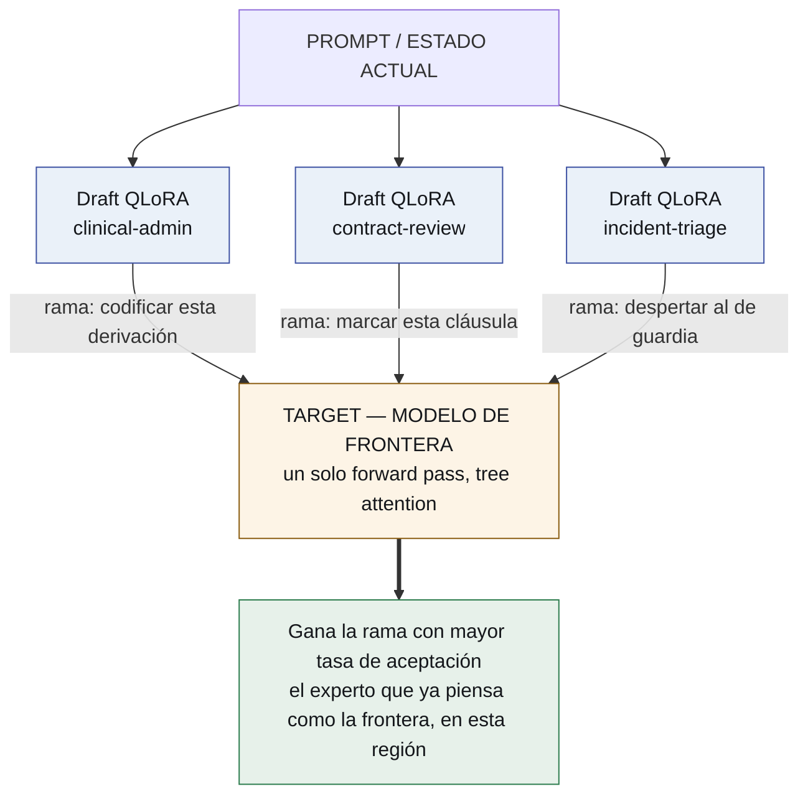
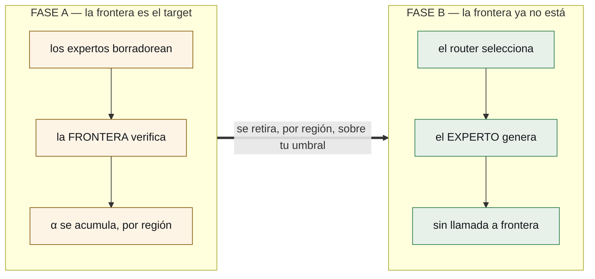

# lora-kernel

**Todo el sistema agéntico es un conjunto de adaptadores QLoRA sobre un modelo
base.** Nada más es neuronal.

*[Read this in English](README.md)*

> **Estado: especificado, nada construido.** Toda afirmación sobre un sistema
> externo va marcada **[read]** y citada. Todavía no hay ningún **[ran]**.

---

## La tesis

Hoy un sistema multi-agente es Python orquestando llamadas a APIs: un modelo
router, un modelo planificador, una pila de esquemas JSON en cada system prompt,
y un parser adivinando si el modelo quiso llamar una herramienta.

Reemplazá todo eso por **deltas de pesos sobre un único modelo base residente**.

| lo que es hoy | en qué se convierte |
|---|---|
| el harness — esquemas, parsers, reintentos | **`harness.lora`** — un adaptador que *emite* action tokens de forma nativa |
| un agente | **un QLoRA de dominio**, unos cientos de MB, intercambiable en caliente |
| el router — una llamada extra a un modelo | **la tasa de aceptación**, que cae de un pase que ya estabas pagando |
| el bucle de evolución | **un torneo de adaptadores**, puntuados y promovidos |
| la memoria | markdown + git — **deliberadamente no neuronal** |
| el entorno de ejecución | un sandbox — **deliberadamente no neuronal** |

Una GPU. Un modelo base residente. Un pool de deltas chicos que vLLM intercambia
por request. El sistema agéntico deja de ser software que llama a un modelo y
pasa a ser **un modelo poniéndose distintos adaptadores**.

## El mecanismo, y por qué funciona

La decodificación especulativa tiene una propiedad que no es una nota al pie:
**los tokens emitidos se distribuyen exactamente como los habría emitido el
modelo target.** El muestreo por rechazo lo garantiza. **[read]**

Esa propiedad es lo que hace funcionar a esta arquitectura, y por eso **la
elección del target es todo el diseño**:

> **El target es un modelo de frontera.** Los expertos son sus drafters.

Como el target es de frontera, una tasa de aceptación alta significa algo preciso
y valioso: *este experto chico ya produce lo que la frontera habría producido, en
esta región del problema*. La aceptación deja de ser un estadístico de velocidad
y pasa a ser **una puntuación continua de destilación por región, medida gratis
dentro de una inferencia que igual ibas a pagar.**



El enrutamiento no cuesta nada extra. Los tokens ya se generaron. El pase de
verificación ya iba a ocurrir. El ganador es un subproducto.

## Retiro de la frontera

El modelo de frontera es **andamio**, y el diseño dice cuándo sacarlo.

**Fase A — la frontera es el target.** Pagás costo de frontera y obtenés calidad
de frontera. Lo que *además* obtenés, a costo marginal cero, es un mapa que se va
llenando: para cada región del problema, con qué experto chico la frontera
coincide, y cuánto. Es destilación con su propia evaluación adentro del camino de
servicio.

**Fase B — retirás la frontera.** Los expertos cuya aceptación cruzó el umbral en
una región se promueven de *drafter* a *generador*. La frontera sale. Lo que la
reemplaza es **sólo un router**, ajustado sobre la superficie de aceptación que
produjo la Fase A.



|  | Fase A | Fase B |
|---|---|---|
| **costo** | frontera | local |
| **calidad** | frontera | al umbral de α que exigiste |
| **y además** | una destilación gratis | — |

El umbral es la decisión de producto: cuánta coincidencia con la frontera exigís
antes de dejar que un experto conteste solo, por región. Y es reversible.

**El número que decide toda la arquitectura** es la **brecha de retiro**: el
puntaje verificado después de sacar la frontera, menos el que tenía con ella.
Hacer chica esa brecha *es* el proyecto.

## Los cuatro adaptadores

**1 · `harness.lora` — el kernel.** Entrenado en nada más que el protocolo de
ejecución: sintaxis de tools, **action tokens** (`<invoke_tool name="sql">`,
`<eval_state>`, `<observe>`), formas de error, transiciones de estado. El esquema
sale del system prompt; el formato se *emite* en vez de recuperarse con un
parser. Siempre cargado: el adaptador de dominio piensa, el kernel actúa. **Y se puede
versionar, puntuar y evolucionar como cualquier otro adaptador**: hoy el harness
es código, así que no podés correr dos baratos contra el mismo tráfico y quedarte
con el mejor. Como adaptador entra en el mismo torneo, y la capa de orquestación
deja de ser la única parte del sistema que no puede mejorar sola.

El número a batir es **nuestro**: `gemma4nanoloop` ya llevó el schema pico de
**5.548 → 817 tokens (−85%)** atando tools por fase, sin entrenar nada. **[read]**
Y en sintaxis el titular es *constrained decoding* (`token-trie`), que vuelve la
salida inválida **imposible**, no improbable.

**2 · QLoRAs de dominio — user space.** Unos cientos de MB de delta cada uno,
intercambiados por request, versionados como código.

**3 · El router.** Fase A: aceptación. Fase B: un router ajustado a la superficie.

**4 · El torneo.** Por tarea ejecutada:

```
score = w₁ · éxito verificado de la tarea
      + w₂ · α  (aceptación contra el target de frontera)
      − w₃ · tokens consumidos
```

**`w₁` tiene que venir de un verificador que el bucle no pueda ver**, o el bucle
cría adaptadores que adulan a su propio evaluador. La medición más fuerte que
tenemos: el mismo procedimiento fue *compensación de interfaz* en un 4B y
*ganancia persistente* en un 12B. **Que un experto sea real no es propiedad del
experto.** **[read]**

## Lo que deliberadamente NO es un LoRA

1. **La memoria** — markdown bajo git. Un delta de pesos no se puede leer,
   diffear, citar ni corregir.
2. **La ejecución** — el sandbox donde las herramientas corren.

## Estado de ingeniería, con honestidad

| capacidad | estado |
|---|---|
| muchos LoRA sobre un target, en batch | **shippea en vLLM** **[read]** |
| verificación de drafts en árbol | **shippea** (familia EAGLE/Medusa) **[read]** |
| **LoRA como draft model** | **RFC abierto** el 2026-08-12 — [vllm#52038](https://github.com/vllm-project/vllm/issues/52038) **[read]** |

Los números del RFC son la parte alentadora: un adaptador **r=64 es ~28× más
chico** que el drafter de 0,8B que reemplaza, con calidad de borrador dentro del
**~2%** de un drafter entrenado por dominio. **[read]** Hasta que aterrice, la
Fase A corre con adaptadores fuera del camino especulativo de vLLM, o con
drafters chicos por dominio: más memoria, mismo experimento.

**La parte genuinamente difícil es el KV cache.** Las ramas de *adaptadores
distintos* no comparten una representación cacheable como sí lo hacen las ramas
de un mismo drafter, porque el LoRA cambia las proyecciones que producen K y V.

## Qué se corre primero — superado, se deja como registro

Esta sección nombraba cuatro pasos E0–E3 antes de que corriera ninguno. Los
cuatro se compraron y tres reportaron; **Lo que realmente corrió**, más abajo,
trae los números. El plan en que se convirtieron vive en
[`docs/EXPERIMENT_PLAN.md`](docs/EXPERIMENT_PLAN.md), que es el estado del
trabajo y se actualiza en la misma sesión en que un paso reporta.

## Lo que realmente corrió

Todo lo de abajo es **[ran]** en este repositorio, con el directorio de corrida
nombrado. Nada de esta sección se infiere de un paper ni de un README.

| afirmación | medición | dónde |
|---|---|---|
| **Existe una brecha de frontera** — la premisa que la arquitectura necesita | `gemini-3.8-flash` **40/40** contra un 4B local **1/40** en mecánica de fluidos con oráculo calculado: **+0,975**. En una suite clínica el mismo test falló tres veces — ninguna frontera estuvo nunca adelante | `results/P5-physics-headroom-20260908/` |
| La destilación transfiere el **procedimiento pero no la aritmética** | el experto reproduce la cadena del maestro paso por paso y calcula pi/4·0,22² como 0,037006 en vez de 0,038013 | `results/P6-withdrawal-20260908/` |
| **La brecha de retiro se cierra** | adaptador + calculadora **40/40** = el maestro. Brecha de retiro **0,000** | `results/P7-calculator-20260908/` |
| …y hacen falta **las dos mitades** | base + calculadora **0/40** con 53 llamadas; adaptador solo **4/40** | ídem |
| **El protocolo se puede aprender solo** | un adaptador kernel **sin física en su corpus** llama a la herramienta en **30/30** casos de fluidos, **0 malformadas**, bajo un prompt que nunca menciona una herramienta | `results/P8-…`, `results/P9-…` |
| **La física del experto es exacta; sólo falla su aritmética** | exactitud de la cadena reparada **30/30** contra un crudo **1/30**, con **0** llamadas | `results/P9-shared-contract-20260909/` |
| **Un pool se puede servir** | vLLM 0.28.0 multi-LoRA sobre `Qwen2.5-3B-Instruct`: el adaptador cambia la salida, y la exactitud servida coincide con `transformers` para la misma receta | `results/P3-vllm-20260908/` |
| La aceptación por caracteres mide **formato, no acuerdo** | respuestas idénticas sacan 0,00 entre formatos; respuestas distintas sacan 0,44 dentro de uno. El criterio de promoción es **acuerdo semántico de respuesta** | `results/S0*/` |

## Lo que no corrió, y no se afirma

- **Componer el kernel con un experto en tiempo de servicio.** Lo único sobre lo
  que se apoya la arquitectura. Los brazos de P8 estaban confundidos y P9 es la
  corrida que saca el confound; hasta que reporte, la única configuración con
  evidencia es el adaptador *fusionado* — que es el costo que el diseño existe
  para evitar.
- **Activación secuencial** ([`TECHNICAL-REFERENCE.md` §5](docs/TECHNICAL-REFERENCE.md)
  opción 1), que ese documento declara como su propia default. Nunca se midió.
- **Generalización fuera de una región.** El experto sacó 0 de 10 en familias
  held-out, en un brazo que nunca terminó. Por eso promoción y retiro se
  especifican por región y no globalmente.
- **El precio de sostener un pool.** El brazo de lote mixto midió el bucle de este
  repositorio y no el planificador de vLLM: está anulado.
- **KV cache entre adaptadores**, el torneo, el router, y el retiro de la frontera
  a cualquier escala mayor que una región.

## Cómo se libera

Open-core. **Abierto:** el runtime multi-LoRA sobre vLLM, el router especulativo,
la maquinaria de retiro, la especificación de `harness.lora` y el protocolo de
action tokens, el conector de memoria markdown+git. **No abierto:** los packs de
adaptadores verticales entrenados, el pipeline gestionado de evolución, el
control plane empresarial.

## Documentos

- [`docs/es/ARCHITECTURE.md`](docs/es/ARCHITECTURE.md) — las siete capas, por qué
  el target tiene que ser de frontera, y la condición de retiro.
- [`docs/es/TECHNICAL-REFERENCE.md`](docs/es/TECHNICAL-REFERENCE.md) — mecanismos,
  α y su superficie, KV cache, action tokens, composición de adaptadores.
- [`docs/es/the-frontier-is-scaffolding.md`](docs/es/the-frontier-is-scaffolding.md) —
  el artículo.

## Reconocimiento

Esta línea empezó con una conversación con
**[Ismael Faro](https://github.com/ismaelfaro)**, que sugirió estudiar la
decodificación especulativa y para qué podría servir.

---

<sub>Apache 2.0 · [Evolving Agents Labs](https://github.com/EvolvingAgentsLabs)</sub>
