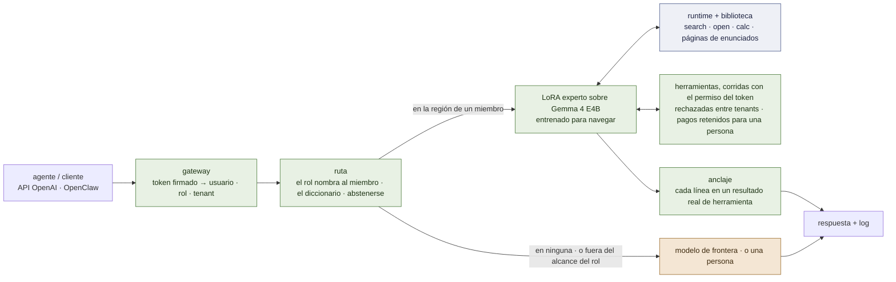

# lora-kernel


*El especialista, la biblioteca, el radar — y, por la puerta, la frontera, para cuando ningún cajón sirve.*

**El LoRA no es el libro de texto; es el especialista que sabe usar la biblioteca.**

[](LICENSE)
[](docs/es/ARCHITECTURE.md)
[](docs/es/MEMORY.md)
[](docs/es/RECORD.md)

*[English](README.md)*

## El problema

Una organización que funciona con agentes sigue mandando el mismo puñado de trabajos que se repiten
— dar curso a un inbox, registrar un pedido de mantenimiento, responder desde una lista de control —
a un modelo de frontera en la nube, a precio de frontera, sobre datos que muchas veces no deberían
salir del edificio. La respuesta habitual, entrenar (fine-tuning) un modelo sobre los resultados,
cambia eso por un problema peor: los hechos terminan **horneados en los pesos**, así que el día que
un procedimiento cambia no hay un archivo para editar — sólo un reentrenamiento, y hasta que eso pasa
el modelo responde con total confianza lo viejo.

lora-kernel guarda los hechos en una biblioteca de notas markdown que una persona puede leer y
corregir, y entrena a un modelo chico sólo para que encuentre el camino hasta la correcta. Lo que un
experto sabe *hacer* — qué herramientas usar, en qué orden, bajo las reglas propias de esta
organización — vive en los pesos de un adaptador chico, entrenado con SFT común. Lo que necesita
*saber* — el valor vigente, el procedimiento vigente — queda afuera de los pesos, en un archivo. Un
router muy chico decide en qué territorio de qué experto cae un pedido, y se abstiene hacia un
modelo de frontera para todo lo demás, así que nada se responde fuera de su terreno entrenado.

Se entrega como una **API compatible con OpenAI** — un modelo residente, varios adaptadores, cada
pedido servido por el suyo — con **instancias de OpenClaw por tarea** encima.

Cada afirmación de abajo está marcada **[ran]** (observada en este repositorio, con la corrida
nombrada), **[read]** (de código fuente o de un paper) o **[spec]** (decidido, todavía no
construido) — y todo lo medido hasta ahora es sobre suites generadas, todavía no sobre tráfico real.
Los números vivos, incluido lo que no pasó, están en [`docs/es/PLAN.md`](docs/es/PLAN.md) y
[`docs/es/RECORD.md`](docs/es/RECORD.md); lo que sigue es lo que no cambia cada vez que alguno de
ellos se mueve.

---

## El núcleo de la versión 1.0


*El núcleo de la 1.0: un router que puede abstenerse, un especialista y una biblioteca por subdominio, un árbitro debajo de todos.*

Cinco cosas, y cómo cambia cada una:

| | qué es | cambia con |
|---|---|---|
| **Un experto es su corpus** | un QLoRA por subdominio, entrenado con SFT común; servido bajo exactamente el prompt, el bloque de herramientas y el formato de resultado que le enseñó su corpus — o es otro modelo | una corrida de entrenamiento |
| **El router** | un modelo muy chico de esos mismos corpus: *¿de qué distribución es este pedido?* — y **se abstiene** cuando la respuesta es ninguna. Abstenerse es la frontera | re-indexar los corpus |
| **La memoria** | una biblioteca de notas que el experto navega — abajo | **editar markdown** |
| **El runtime** | un árbitro chico en Python dentro del proxy: ejecuta los comandos del experto, aplica las reglas de un sitio, hace cumplir el orden de los pasos | un cambio de código |
| **El contrato de release** | un manifiesto por miembro — corpus, adaptador, biblioteca, radar y gramática, cada uno con hash; admitido por un test pareado contra la base pelada | una compuerta que tiene que pasar |

Y una cosa que se agrega por subdominio donde se mide que paga, **no requerida por la 1.0**:
un segundo LoRA sobre un modelo grande de la misma familia, entrenado sobre el mismo corpus,
que verifica lo que el chico borradorea ([`docs/es/PLAN.md`](docs/es/PLAN.md) hitos 3–4).

### La memoria, en cinco piezas

Especificación completa: [`docs/es/MEMORY.md`](docs/es/MEMORY.md) **[spec]**.

1. **La biblioteca — dos estantes de markdown**, cada nota de menos de media página. El
   **arnés operativo** (*¿cómo se hace?*): notas tipo receta cuyos enlaces son el flujo de
   control — `requires` (antes de esto, aquello), `next` (el paso que sigue), `uses` (para
   este paso, consultar…). La **wiki enciclopédica** (*¿qué es, qué fórmula aplica?*): un
   árbol, de general a específico, que clasifica en qué caso estás antes de calcular. **Con forma
   de Wikipedia, su unidad es el enunciado atómico:** una página es una lista de enunciados de
   una oración, verificables, bajo anclas (`§supplier`, `§if-damaged`), los enlaces viven dentro
   del enunciado que los nombra, y una respuesta cita el enunciado en el que se apoya — así la
   memoria es verificable, no sólo buscable ([`docs/es/MEMORY.md`](docs/es/MEMORY.md) §1.6 —
   **[ran]** W9: un LoRA de trayectoria la camina 35/40 donde la base sin entrenar camina 0/40,
   3-hop 16/16).
2. **El radar — embeddings comprimidos a un subdominio.** No es un motor de búsqueda general.
   En un dominio cerrado el vocabulario tiene un significado funcional exacto, así que un
   vector chico alcanza para mapear las únicas dos intenciones que importan: *para qué
   situación es esta nota* (`when:`) y *qué define* (`what:`). Devuelve las dos o tres notas
   de exactamente el subdominio en el que trabaja el experto.
3. **El lenguaje — tres verbos.** `<search>una situación o una duda</search>` devuelve
   títulos e ids. `<open>id</open>` devuelve la nota y sus enlaces. `<calc>expresión</calc>` —
   para que el modelo nunca haga aritmética de memoria, donde siempre falla.
4. **El LoRA — entrenado en el hábito de navegación.** Sus casos de entrenamiento sortean sus
   constantes de nuevo cada vez — un líquido inventado para un ejercicio, un tiempo de
   permanencia local de 15 segundos en vez de 5 — así que la respuesta no se puede memorizar
   y el modelo queda *obligado a abrir la nota para ver el número*. Lo que termina en los
   pesos es una coreografía: leer, buscar en el arnés, abrir el protocolo, hacer una parada
   en la wiki cuando un paso necesita un dato, mandar los números a `<calc>`, seguir `next`.
5. **El runtime — el árbitro de software.** Pasa las páginas, escribiendo cada resultado justo
   después del tag. Aplica reglas locales automáticamente: una sala que desinfecta durante 20
   segundos tiene ese valor sustituido *antes* de que la nota llegue al experto, que lee la
   regla ya resuelta. Y vigila que no haga trampa: si el paso 4 `requires` el paso 1 y el
   experto nunca abrió el paso 1, el runtime corta la ejecución — sin necesitar saber si la
   respuesta final estaba bien. **Y decide qué puede afirmar una respuesta:** cada respuesta cita
   el enunciado en el que se apoya, y el árbitro chequea la cita; frente a las herramientas, el
   gateway no muestra ninguna línea que no esté en un resultado real de una herramienta
   (`examples/common/grounding.py`).

> **[ILLUSTRATION PLACEHOLDER — `docs/img/memory-walkthrough.png`]**
> *Siendo redibujada para páginas de enunciados atómicos; el brief está en [`docs/img/README.md`](docs/img/README.md). Seis
> paneles en una línea: un pedido, una búsqueda que ilumina tres fichas de página, una página que se abre como su
> tabla de secciones, una oración cuyo nombre subrayado es el enlace a la próxima página, la sección de una tercera
> página, y la respuesta con su cita estampada — el chequeo del árbitro debajo del último panel.*

**La ganancia.** Si el protocolo cambia mañana, se edita un archivo markdown en git. El LoRA
no se reentrena, porque lo que aprendió fue a obedecer los enlaces y leer las notas.

---

## El camino del pedido

> **[ILLUSTRATION PLACEHOLDER — `docs/img/request-path.png`]**
> *Siendo redibujada para el gateway; el brief está en [`docs/img/README.md`](docs/img/README.md). Una línea: un
> agente → el gateway lee el token firmado (usuario · rol · tenant) → el experto local del rol → las herramientas
> corren con ese permiso (un registro rechazado, un pago retenido para un director) → cada línea de la respuesta
> chequeada contra un resultado real de herramienta → la respuesta; una rama punteada para lo que está fuera de
> alcance, hacia la frontera o hacia una persona; un log debajo de todo.*



## Dónde se ubica en una organización

Una organización que funciona con agentes suele dibujar el mismo esquema: arriba, personas en unos
pocos roles; un runtime de agentes con **un agente por rol**; las aplicaciones que esos agentes operan;
los canales que la gente ya usa; y abajo, una sola base de datos con identidad, pagos y monitoreo al
lado. En ese esquema cada agente es un system prompt sobre el mismo modelo remoto.

lora-kernel es la capa debajo de la columna de agentes. **Cada rol pasa a ser un experto** — un
adaptador entrenado en cómo *esta* organización hace ese trabajo — **con dos cajones de notas**: cómo
lo hacemos acá, y lo que sabemos. El rol del que llega un mensaje dice *cuál* experto — gratis, y medido como seguro **[ran]** F2; *si* el
pedido está dentro de la región de ese experto sigue siendo trabajo del router. Lo que un experto está medido para resolver se responde en la máquina de la organización;
el resto va a la frontera, o a una persona donde la política dice que nada sale del edificio. Los
sistemas de registro quedan donde están: **los registros quedan en la base, los hábitos van en el
adaptador, el conocimiento queda en notas que una persona puede leer y corregir.**


*Dónde se ubica en una organización: los registros quedan en la base, los hábitos van en el adaptador, el conocimiento queda en notas que una persona puede leer.*

La misma forma, en otros ámbitos — ninguno está medido, es hacia donde apunta el diseño:

| organización | roles que pasan a ser expertos | qué va en los dos cajones |
|---|---|---|
| **una distribuidora** | atención al cliente, recepción, despacho, compras, reclamos | los procedimientos de manejo del lugar · catálogo, transportistas, niveles de servicio |
| **un estudio contable o jurídico** | ingreso de casos, revisión de documentos, vencimientos, facturación | las listas de control y plantillas del estudio · las reglas de su jurisdicción, cliente por cliente |
| **una escuela o centro de formación** | inscripciones, apoyo docente, comunicaciones, compras | cómo resuelve esta escuela cada caso · programa, calendario, reglamento |
| **un taller o servicio técnico** | recepción de equipos, diagnóstico, repuestos, garantías | el procedimiento de cada tipo de reparación · manuales, listas de repuestos, condiciones de garantía |
| **un club o centro comunitario** | socios, inscripciones a actividades, instalaciones, cobranzas | cómo resuelve este club cada caso · actividades, cuotas, reglamento interno |
| **una administración de propiedades** | pedidos de inquilinos, mantenimiento, cobranzas, proveedores | el procedimiento de escalamiento por edificio · contratos, reglamentos, condiciones de proveedores |

Lo que comparten es lo que hace que una región merezca un experto: **los mismos pocos procedimientos,
repetidos a diario, con reglas locales que difieren del manual, sobre datos que no deberían salir.**
La primera biblioteca de este repositorio está armada con los procedimientos paso a paso de un manual
abierto ([`knowledge/nursing-iv/`](knowledge/nursing-iv/)). Lo que *no* está
establecido está más abajo, y vale acá entero: todavía no hay datos reales, y la
afirmación de que una biblioteca extiende a un experto a un procedimiento que nunca entrenó no está
probada.

## Cómo está parado

**Ya corriendo.** Una instancia de vLLM sirve varios adaptadores LoRA sobre una sola base residente,
cada pedido ruteado a su propio adaptador, en vivo a través de la API compatible con OpenAI y a
través de OpenClaw **[ran]** — el mecanismo de arriba no es un diagrama, responde turnos reales hoy.
Un experto entrenado, servido exactamente como le enseñó su corpus, llega a precisión de nivel
humano en el trabajo para el que se entrenó (triage de inbox, 0,989 contra 0,345 de una base pelada)
**[ran]**.

**La memoria funciona en su primer banco de pruebas [ran].** En una wiki de enunciados atómicos
cuyos hechos ningún modelo puede saber, la base sin entrenar no camina las preguntas de dos y tres
saltos (0 de 40); un LoRA de trayectoria entrenado sobre otros 32 mundos las camina 35 de 40 con la
cita de cada respuesta verificada, 16 de 16 a tres saltos — y sobre Gemma 4 E4B, 38 de 40
(`docs/PLAN.md` hito 7, W9 y B1).

**Una organización de referencia, funcionando de punta a punta [ran].** La demo de la escuela:
identidad desde un token firmado, los registros de otra escuela rechazados por la capa de
herramientas, un pago retenido hasta que un director lo aprueba, pedidos fuera de alcance derivados
a la frontera o a una persona, un log y un dashboard — y **cada respuesta chequeada contra los
resultados reales de las herramientas por el gateway, fuera del modelo**. 8 de 8 escenas sobre
Gemma 4 E4B con un adaptador del personal de la escuela, contra 3 de 8 con un modelo pelado
([`docs/es/DEMO.md`](docs/es/DEMO.md)).

**La familia es Gemma 4** desde 2026-09-25: medida contra Qwen3.5-4B sobre la misma wiki, un
empate, y la pila de desarrollo del usuario apunta a Gemma; los miembros publicados pasan por la
compuerta de release uno por uno (hito 1b).

**Todavía sin resolver.** El router sigue siendo un diccionario de palabras clave — sus dos
reemplazos aprendidos ya están medidos y ninguno pasa **[ran]** hito 2. Los modelos chicos todavía
inventan: en la demo de la escuela el gateway reemplazó 2 de 5 respuestas locales por el texto
propio de las herramientas — atrapado, contado, nunca mostrado, pero no curado. El par especulativo
todavía no arrancó. Todavía no se midió tráfico real en ningún lugar de este repositorio.

**Todo lo demás — cada hito, cada brazo, cada corrida — se mueve con el proyecto y no se repite
acá, a propósito.** [`docs/es/PLAN.md`](docs/es/PLAN.md) es el estado vivo, con una compuerta y una
condición de falsificación escritas antes de que corra cada hito. [`docs/es/RECORD.md`](docs/es/RECORD.md)
es el registro completo, incluido lo que falló y los instrumentos que mintieron.
[`docs/es/FRAMEWORK.md`](docs/es/FRAMEWORK.md) es el análisis de brechas contra ser un framework
genérico, autocontenido y escrito para que lo revise otro modelo.

**Restricciones de ingeniería, decididas y no en discusión.** La familia es **Gemma 4** desde 2026-09-25 —
chico `gemma-4-E4B-it`, grande `gemma-4-31B-it` (todavía no medido) — elegida en un empate medido con
Qwen3.5-4B, cuyos miembros publicados quedan hasta que se los vuelva a publicar ([`docs/es/ARCHITECTURE.md`](docs/es/ARCHITECTURE.md) §6).
Entrenada y servida en Colab, en sesiones de menos de una hora, nunca en la máquina de un usuario.

---

## Correrlo

```bash
# las compuertas que no necesitan GPU
python -m pytest tests -q
python scripts/check-mirrors.py

# el replay de ruteo — por pedido contra por región, cero GPU
python -m training.harness.route

# todo lo que corre un modelo corre en Colab a través de un chain — streameado, reanudable, en menos de una hora
GPU=L4 BRANCH=main MODULE=training.harness.verify_substrate \
  RUN_DIR=results/mi-corrida training/harness/chain_serve.sh
```

Servir el pool a un agente, los flags del proxy y la compuerta del sustrato:
[`docs/es/SERVING.md`](docs/es/SERVING.md). OpenClaw, paso a paso, tal como corrió en vivo:
[`docs/es/OPENCLAW.md`](docs/es/OPENCLAW.md). A un miembro se lo sirve con tres flags, cada
uno default por una razón: `--prune` (su propia superficie de herramientas),
`--member-prompt` (el prompt que le enseñó su corpus), `--auto` (el cliente no nombra
modelo).

## Qué hay en la caja

| ruta | qué |
|---|---|
| `training/harness/openai_proxy.py`, `route.py` | la API: poda, el prompt del miembro, ruteo por pedido |
| `training/harness/train_pool.py`, `contract.py` | el registro del pool — cada miembro un registro leído de su corpus |
| `roles/`, `rolepack/` | **un directorio declarado por rol** — miembro, corpus, prompt y bloque de herramientas por referencia y hash, ruta, política de respuesta, salida, loop, biblioteca — y el lint que chequea cada línea contra su artefacto (`python -m rolepack.lint roles/`) |
| `training/harness/release_gate.py`, `pool_second.py`, `pool_base.py`, `verify_substrate.py` | la puerta por la que entra un miembro, sobre esta base o sobre otra |
| `training/harness/accept_rank.py` | el loop en modo corpus — parar en el tag de cierre, escribir el resultado inline, continuar — sobre el que está construido el runtime de la memoria; y la aceptación por teacher forcing |
| `training/harness/corpus_mode_arm.py`, `training/physics/result_use.py` | un experto re-servido como le enseñó su corpus; una falla leída donde ocurre — *¿se usó el resultado?* |
| `training/harness/corpus_router.py`, `embed_router.py`, `router_sets.py` | los brazos aprendidos del router, y los ocho conjuntos sobre los que se puntúa cualquier router |
| `training/nursing/` | el primer texto acá que nadie generó: tres checklists de terapia IV, 72 preguntas verificables |
| `training/harness/lora_matrix.py`, `rekey.py`, `awq_lora_gate.py` | si esta base — chica o grande — sirve un LoRA o no |
| `training/harness/chain_serve.sh` | el chain de Colab: aprovisionar, correr desacoplado, streamear, traer los pesos a medida que aparecen, reanudar |
| `training/harness/bill.py` | tasa un replay existente a tarifas reales de frontera — cero GPU, nada se re-corre (`results/M6-bill-20260921/`) |
| `examples/` | **la organización de referencia, sólo código, antes de que exista ningún adaptador** — `school/` y `distributor/`, los dos con dos inquilinos; un almacén de juguete, una capa de herramientas que refuerza el permiso fuera del modelo, un servidor MCP por dominio, una suite adversarial a 0 fugas; `examples/README.md` dice cómo apuntar tu propio OpenClaw |
| `training/wiki/` | **W9, la wiki de enunciados atómicos**: un mundo de distribuidora por semilla, preguntas de 1 a 3 saltos, el grader de citas, el runner de trayectorias y su corpus |
| `examples/school/gateway.py`, `demo_run.py`, `school_arm.py` | **la demo de la escuela, como sistema funcionando**: identidad firmada, escrituras retenidas y la aprobación de un director, salida por rol, anclaje, un log y un dashboard; el LoRA de trayectoria del personal de la escuela y su medición |
| `training/harness/fake_vllm.py` | un `vllm serve` falso para los tests de integración del camino de serving — los bugs que modela se pagaron una vez con una tarjeta |
| `training/harness/family.py` | la familia de modelos en un solo lugar: Gemma 4 E4B para miembros nuevos, Qwen3.5-4B para los publicados hasta que se los vuelva a publicar |
| `releases/`, `results/` | los manifiestos, y las corridas que citan los documentos |

## Documentos

| | |
|---|---|
| [`docs/es/MEMORY.md`](docs/es/MEMORY.md) | **la memoria, tal como se va a construir** — biblioteca, radar, tres verbos, el hábito del LoRA, el árbitro; orden de construcción para la 1.0 |
| [`docs/es/KNOWLEDGE-TRAJECTORIES.md`](docs/es/KNOWLEDGE-TRAJECTORIES.md) | el *por qué* detrás de todo esto, autocontenido, escrito para que lo revisen otros modelos: diez hallazgos, cinco estrategias, diez preguntas |
| [`docs/es/FRAMEWORK.md`](docs/es/FRAMEWORK.md) | **estado y brechas, autocontenido, escrito para que lo revisen otros modelos** — qué funciona, qué no, y qué falta para que esto sea un framework genérico para una organización con un agente por rol |
| [`docs/es/ARCHITECTURE.md`](docs/es/ARCHITECTURE.md) | el sistema: expertos, router, memoria, runtime, el par, la frontera — y dónde se ubica dentro de una organización (§9) |
| [`docs/es/DEMO.md`](docs/es/DEMO.md) | **la demo de cinco minutos** — una organización de referencia sobre un modelo chico local, qué está medido y qué no, y la medición que debería terminar pidiendo |
| [`docs/es/PLAN.md`](docs/es/PLAN.md) | el plan vivo — hitos, compuertas, brazos que matan |
| [`docs/es/RECORD.md`](docs/es/RECORD.md) | todo lo medido, incluido lo que falló; cada línea nombra su corrida |
| [`docs/es/FOUNDATIONS.md`](docs/es/FOUNDATIONS.md) | la matemática, atada a las corridas que la instancian |
| [`docs/es/SERVING.md`](docs/es/SERVING.md) · [`docs/es/OPENCLAW.md`](docs/es/OPENCLAW.md) · [`docs/es/SUBSTRATE-GATE.md`](docs/es/SUBSTRATE-GATE.md) | correrlo |
| [`docs/articles/`](docs/articles/2026-09-era-el-arnes.es.md) | *Una organización que funciona con agentes, sobre una sola GPU: la arquitectura* — primero la arquitectura de la solución, después lo que ya está medido (el hallazgo del arnés incluido), lo que no, la hoja de ruta |
| [`CLAUDE.md`](CLAUDE.md) | instrucciones para agentes de código, y las reglas de medición que ya se pagaron |

**El registro anterior a la reescritura de 2026-09-19** — setenta y cuatro directorios de
corridas, los expertos retirados, los análisis, un plan de 2.800 líneas — es el tag
[`v0.1-foundations`](https://github.com/EvolvingAgentsLabs/lora-kernel/tree/v0.1-foundations).
Un número P citado acá sin directorio en `main` vive ahí.

## Alcance

Open source: el runtime, el runtime y los formatos de la memoria, el contrato de release,
las compuertas. **No son parte de este runtime ni de la versión open source:** el servicio de
personalización y sus herramientas — los corpus y bibliotecas de un cliente, adaptadores
entrenados como servicio, la automatización de trazas → corpus → compuerta → release. Este
repositorio construye el instrumento que mide una personalización, no las herramientas que
la producen a escala. El material de terceros mantiene su licencia: *Nursing Skills* es CC BY
4.0 y está atribuido donde se usa; las publicaciones de la OMS por defecto son CC BY-NC-SA y
no se shippean.

Apache 2.0. La idea empezó en una conversación con Ismael Faro.
