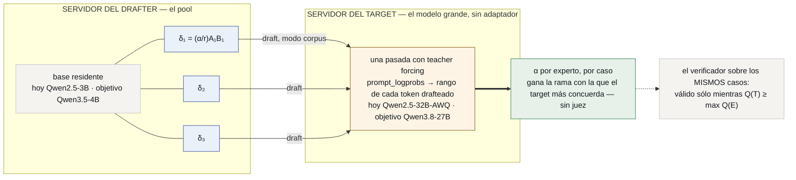
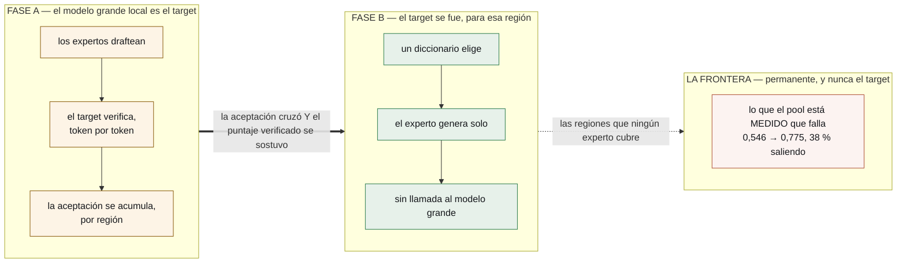

# lora-kernel

**Todo el sistema agéntico es un pool de deltas QLoRA sobre un modelo base residente,
rankeado por un modelo más grande de la misma familia que verifica sus tokens.** Nada
más es neuronal.

*[Read me in English](README.md)*

**Corre dentro de un agente real.** [OpenClaw](https://docs.openclaw.ai/cli) en una
laptop → un proxy local → un túnel → vLLM en una placa alquilada → un QLoRA nuestro →
de vuelta, con las herramientas del inbox entregadas al agente por MCP y **cero
pedidos saliendo de la máquina** para todo lo que sirve el pool **[ran]** P43. Paso a
paso: [`docs/es/OPENCLAW.md`](docs/es/OPENCLAW.md).

> **Estado, 2026-09-17.** Cada afirmación sobre este repositorio es **[ran]** con su
> directorio de corrida; cada afirmación sobre cualquier otra cosa es **[read]** y
> citada; lo que no se pudo verificar desde acá es **[unverified]** y nunca sostiene
> nada.
>
> - **El sustrato está medido, tres veces:** una base residente, deltas conmutados
>   por el campo `model`, servidos por vLLM, alcanzables desde un agente real.
> - **Un experto es genuinamente bueno.** Servido como enseña su corpus, `email-full`
>   da **0,992** (mensajes humanos **0,989**), contra **0,808** vía `tool_calls`
>   **[ran]** P55 A — la ruta de serving, no los pesos, costaba 18 puntos.
> - **La afirmación central tiene instrumento y todavía no tiene veredicto.** La
>   aceptación en tokens contra un target de la misma familia está construida y con
>   preflights; en la suite de triage el 32B sin entrenar dio **0,746 < 0,989**, así
>   que la compuerta se negó a comprar un ranking contra un target más débil
>   **[ran]** P55 A. La próxima corrida es en una suite donde el target está medido
>   más fuerte (P55b).
> - **El objetivo es `Qwen3.8-27B` como modelo grande**, y la ruta es una lista corta
>   de mecanismos, uno de los cuales está bloqueado y nombrado abajo.

---

## La tesis

Un sistema multi-agente hoy es Python orquestando llamadas a APIs: un modelo router,
un modelo planificador, esquemas JSON en cada prompt, un parser adivinando si el
modelo quiso llamar a una herramienta. Reemplazar todo eso por **deltas de pesos
sobre una base residente**:

| lo que es hoy | en qué se convierte | la matemática |
|---|---|---|
| un agente | **un QLoRA de dominio**, ~114 MB, conmutado en caliente por pedido | $W' = W + \tfrac{\alpha}{r}AB$ sobre siete proyecciones por bloque — **29.933.568** parámetros a $r=16$, **119.801.528** bytes en disco, la derivación y el artefacto coinciden **[ran]** |
| el router — una llamada extra a un modelo | **un diccionario** para la ruta gruesa (1,000 con doce palabras clave **[ran]**) y **la aceptación** para rankear expertos que se parecen | $\arg\max_i \alpha_T(E_i, c)$, válido sii $Q(T) \ge \max_i Q(E_i)$ |
| el harness — esquemas, parsers, reintentos | **serving en modo corpus**: parar en `</tag>`, inyectar el resultado real, seguir | $s_j = s_{j-1}\,\|\,\tilde s_j\,\|\,\texttt{= tool}(\tilde s_j)$ |
| el loop de evolución | **un torneo sobre adaptadores**, promovidos por un test pareado | $p = \min(1, 2\Pr[\mathrm{Bin}(n_d,\tfrac12)\ge\max(u,n_d-u)])$ |
| memoria, ejecución | markdown + git; un sandbox — **deliberadamente no neuronal** | — |

Cada fórmula está derivada, paso a paso y atada a su corrida, en
[`docs/es/FOUNDATIONS.md`](docs/es/FOUNDATIONS.md). **La regla que este proyecto
mantiene: cada documento lleva su matemática, y cada corrida en Colab actualiza la
fórmula que instancia.**

---

## El objetivo: `Qwen3.8-27B` como modelo grande, y la ruta hasta ahí

La decodificación especulativa necesita dos modelos con **el mismo espacio de ids**
(FOUNDATIONS §3.2): un id drafteado tiene que nombrar la misma cadena para los dos. Si
un par es usable es un hecho sobre el *par*, nunca sobre un modelo — y la tabla está
indexada así, porque una versión anterior se leía como un veredicto sobre el 27B y
estaba equivocada:

| drafter → target | ids del tokenizer | mapa de ids | ids sólo del target | usable |
|---|---:|---|---:|---|
| **Qwen2.5-3B → Qwen2.5-32B** *(hoy)* | 151.643 | archivo byte-idéntico | 0 | **sí** **[ran]** P48 |
| Qwen2.5-3B → Qwen3-32B | 151.643 | mapa idéntico | 4 (`<think>`, …) | sí **[ran]** P48 |
| Qwen2.5-3B → Qwen3.5 / 3.6 / 3.8-27B | 151.643 vs **248.044** | distinto | — | **no** **[ran]** P48 — *los drafters 2.5 no llegan* |
| **Qwen3.5-2B / 4B → Qwen3.8-27B** *(el objetivo)* | 248.044 | mapa idéntico | 7, todos especiales de audio/TTS; `<think>` compartido | **sí** **[ran]** D0 |

Así que el 27B es alcanzable, y lo que se mueve es el drafter: el pool migra de una
base `Qwen2.5-3B` a una base `Qwen3.5-4B`. **El target no necesita LoRA** — verifica,
nunca lleva un adaptador — así que nada sobre servir adaptadores lo restringe. Lo que
restringe al *drafter* es un hecho medido, C18: vLLM 0.29.0 carga un LoRA sobre
`Qwen3.5-4B`, loguea que lo hizo, y sirve la base igual, mientras el mismo
procedimiento sobre `Qwen2.5-3B` vuelve `applied` **[ran]** P33. La ruta, como
mecanismos:

| # | mecanismo | estado | compuerta |
|---|---|---|---|
| **D0** | un drafter 3.x que comparta espacio de ids con el 27B | ✅ **[ran]** | mapa de ids idéntico, sin colisiones |
| **D1** | C18 bajo un vLLM más nuevo | vacío — la cadena instala el último y es **0.29.0**, la versión de P33 **[ran]** | — |
| **D2** | **el mecanismo de C18**, leído con el log en la mano: G3 merge-and-serve; el mapeo clave PEFT ↔ módulo vLLM | **siguiente** | `applied` en la compuerta de identidad |
| **D3** | pensamiento apagado en el 27B | dentro de D4 | ids `<think>` emitidos sobre la suite: **0** |
| **D4** | el instrumento de P55, `--base Qwen/Qwen3.5-4B --target Qwen/Qwen3.8-27B`, pool graduado reentrenado sobre el 3.5-4B | bloqueado por D2 | la misma tabla de veredictos que M2 |

**Por qué el objetivo no es el primer paso.** Cada mecanismo de abajo es independiente
del target dado el espacio de ids; el instrumento construido sobre Qwen 2.5 es el que
corre D4. Si la aceptación resulta no rankear sobre 2.5 (M2), D4 habría comprado una
versión más rápida de un mecanismo que no funciona. Nada de M depende de D; D4 depende
de todo M.

---

## Cómo funciona, bloque por bloque

### El drafter: una base, un pool de deltas

Un bloque decoder mapea $h \in \mathbb{R}^{T\times d}$ a través de siete mapas lineales
— $W_q, W_k, W_v, W_o$ alrededor de la atención causal con RoPE y cabezas agrupadas, y
$W_{gate}, W_{up}, W_{down}$ en una MLP SwiGLU (FOUNDATIONS §1.2). Un experto parchea
exactamente esas siete en cada bloque:

$$
xW' \;=\; xW \;+\; \tfrac{\alpha}{r}\,(xA)B,
\qquad A\in\mathbb{R}^{d_{in}\times r},\ B\in\mathbb{R}^{r\times d_{out}},\ r=16.
$$

$W$ nunca se toca, así que la base queda residente y un batch de pedidos en el que el
pedido $j$ nombra al adaptador $i(j)$ es un GEMM compartido más un par de GEMMs
delgados recolectados,

$$
y_j = x_j W + s\,(x_j A_{i(j)})\,B_{i(j)},
$$

que es lo que calculan los kernels Punica / `bgmv` de vLLM **[read]** y lo que activa
`--enable-lora --max-loras k --lora-modules nombre=ruta` **[ran]**. **C18 es el test de
que el segundo término está presente**: el mismo prompt por la base y por el
adaptador, los textos tienen que diferir.

En la línea 3.5/3.8 el bloque es distinto — tres capas de atención lineal **Gated
DeltaNet** por cada una de atención completa **[read]** `config.json`, la recurrencia

$$
S_t = \alpha_t\,(I - \beta_t k_t k_t^\top)\,S_{t-1} + \beta_t\,k_t v_t^\top,\qquad o_t = S_t^\top q_t,
$$

con un estado fijo $d_k\times d_v$ por capa en vez de una caché KV que crece. **Sus
proyecciones siguen siendo mapas lineales** $\tilde hW$, así que el delta de arriba se
les aplica sin cambios; si el *motor* lo aplica es C18, una propiedad del camino de
kernels y no del álgebra.

### El target: una pasada con teacher forcing verifica un draft entero

Generar es la recursión $x_t \sim p(\cdot\mid x_{<t})$; el decode lee cada peso una vez
por token, así que su piso es $t_{\text{step}} \gtrsim B_W/\mathcal B$ — **~13 ms/token
para un target de 19,3 GB en una A100** — y un 27B con 48 capas recurrentes es lento
por token por la misma razón. Una pasada de verificación sobre un prefijo y $k$ ids
drafteados cuesta **una** lectura así para las $k+1$ posiciones (FOUNDATIONS
§2.3–2.4). A temperatura 0 el target es one-hot, así que el test de aceptación de la
decodificación especulativa $\min(1, p_T/q)$ colapsa a

$$
\text{aceptar } \tilde x_i \iff \tilde x_i = \arg\max_v\, p_T(v \mid \text{prefijo}, \tilde x_{<i}),
$$

leído acá como *rango = 1* en los `prompt_logprobs` del target — la distribución
completa con teacher forcing a lo largo de un texto dado, devuelta por un prefill, sin
generar nada **[ran]** P55 A. La secuencia emitida se distribuye exactamente como la
del target sea cual sea el drafter (FOUNDATIONS §6.2), y por eso la aceptación es una
afirmación *sobre el drafter*. Con tasa por token $\alpha$ y $k$ drafts,

$$
\mathbb{E}[\tau] = \frac{1-\alpha^{k+1}}{1-\alpha},
\qquad
\text{aceleración} = \frac{\mathbb{E}[\tau]}{k\,c + 1},\quad c = \frac{t_{\text{draft}}}{t_{\text{target}}},
$$

y la ganancia crece cuando $c \to 0$ — un 4B drafteando para un 27B lento es
exactamente el régimen donde un target grande y recursivo justifica la maquinaria.
**Todavía no se midió ninguna α; el instrumento está construido.**

Sobre un target híbrido la pasada de verificación corre los tokens drafteados por la
recurrencia de arriba dentro del kernel de prefill GDN por chunks de vLLM y por las
capas de atención completa con su KV paginada; los siete ids sólo del target son
especiales de modalidad que la tarea de texto nunca alcanza, y `<think>` — compartido
por los dos modelos — es un flag de serving (D3).

### Dentro de vLLM: qué parte hace qué

| componente | trabajo acá | evidencia |
|---|---|---|
| motor + scheduler (batching continuo) | $n$ secuencias comparten una lectura de pesos por paso; 475 cadenas por el 3B en **31 s**, por el 32B en **230 s** a concurrencia 8 | **[ran]** P55 A |
| caché KV PagedAttention | $\text{bytes}_{KV}(t) = 2LH_{kv}d_h\,t\,b$ — 36 KB/token en el 3B, 256 KB/token en el 32B | **[read]** config |
| caché de estado GDN (`Mamba cache mode … align`) | el $S_t$ fijo por capa lineal en los modelos 3.5/3.8 | **[ran]** log de P33 |
| `LoRAModelManager` + `PunicaWrapper` (`bgmv` shrink/expand) | el término delta recolectado sobre los módulos `Linear` del **drafter**; el log nombra cuáles saltea — en `Qwen3.5-4B` todos los salteados eran `visual.*` | **[ran]** log de P33 |
| servidor OpenAI: `/v1/completions` con `stop`, `include_stop_str_in_output` | el loop de modo corpus: generar hasta `</tag>`, inyectar, seguir | **[ran]** P55 A |
| servidor OpenAI: `prompt_logprobs` | el rango del target para cada token drafteado en un prefill | **[ran]** P55 A |
| worker especulativo nativo (`speculative_config`) | **no se usa**: ata un drafter al arranque; el reenvío de adaptador por pedido hacia él es **[unverified]** | — |

**Dos instancias, entonces.** El servidor del drafter tiene la base y el pool; el del
target tiene el modelo grande solo. El drafter escribe toda la cadena en modo corpus;
el target la puntúa por `prompt_logprobs`. Bajo la identidad del argmax los veredictos
por token son exactamente los que calcularía un loop fusionado — un prefill por span
en vez de por ronda, más caro por token e igual de informativo, y no necesita nada del
camino especulativo de vLLM. Tampoco da aceleración de reloj, que este proyecto no
compra: **la latencia es de EAGLE** — una cabeza por target entrenada sobre los estados
ocultos del target draftea mejor que cualquier experto separado **[read]** — y lo que
una cabeza atada no puede hacer es comparar $k$ expertos distintos. **El ranking es
nuestro.**

### Por qué la aceptación rankea — y cuándo no puede

Para expertos $E_1,\dots,E_m$ sobre una suite con verificador mecánico, la calidad
verificada es $Q(E)$ y la aceptación es $\alpha_T(E) = $ la fracción de los tokens de
decisión de $E$ que el target habría escrito. **La afirmación:**

$$
Q(E_a) > Q(E_b) \;\Rightarrow\; \alpha_T(E_a) > \alpha_T(E_b),
$$

un orden de expertos sin juez en tiempo de serving. Es sobre *calidad* sólo cuando
$Q(T) \ge \max_a Q(E_a)$: por debajo, $\alpha$ premia al experto que comparte los
errores del target. Esa desigualdad es una compuerta, probada como test de signos
pareado antes de comprar ninguna aceptación, y **disparó en la suite de triage**: el
32B sin entrenar consiguió todos los hechos y aplicó mal la regla, $0,746 < 0,989$, el
experto bien donde el target mal en 87 casos contra 2 **[ran]** P55 A. El instrumento
estaba listo y correctamente no corrió. La región `commitment` del desk es donde el
mismo 32B está medido en **1,000 en cada profundidad** **[ran]** P51 — P55b corre ahí.

---

## El retiro — del target local, por región; la frontera se queda

El target grande es andamio *por región*. Mientras verifica, cada token aceptado o
rechazado es un dato gratis: para cada región del espacio de problemas, con qué
experto el target sigue concordando. Cuando la aceptación de un experto cruza el umbral
que elegiste **y el puntaje verificado se sostiene sin el target** — $Q_R(E) \ge
Q_R(E\mid T) - \varepsilon$ en un test pareado — el target sale de esa región y el
experto genera solo. Una API de frontera nunca es el target — sin logprobs forzados
(C2), sin ids compartidos (C3) — es el **fallback** permanente para lo que el pool está
*medido* que falla: rutear una región que falla hacia ella llevó la exactitud entregada
de **0,546 → 0,775** con el 38 % de los casos saliendo **[ran]** P41.

---

## Dónde está el plan — mecanismos, de a uno

Cada fila es algo que este proyecto nunca tuvo, con la compuerta que dice si ahora lo
tiene. Una compuerta que falla detiene la corrida antes de comprar el mecanismo
siguiente.

| # | mecanismo | estado | compuerta |
|---|---|---|---|
| **M0** | el drafter servido **en modo corpus** — vía `tool_calls` *inventa* el resultado que no puede recibir | ✅ **[ran]** 0,808 → **0,992** | stop honrado; adaptador ≠ base en 8 sondas (C18) |
| **M-target** | un target que valga la pena **en esta tarea** | ❌ triage: **0,746 < 0,989**, 2 : 87 **[ran]**; ✅ desk `commitment`: 32B **1,000** en cada profundidad **[ran]** P51 | le gana al mejor experto, pareado, $p\le0,05$ |
| **M-α** | aceptación en **tokens** por `prompt_logprobs` forzados | ✅ preflights pasan **[ran]**; todavía no corrió | templates idénticos; una entrada por token con `rank` |
| **M1** | **expertos que difieren en calidad** — corpus anidados graduados | `NEXT` P55b: desk `commitment`, `g25 ⊂ g75 ⊂ 600`; riesgo nombrado: una tarea de una llamada puede saturar todos los grados | el verificador resuelve ≥ 1 par, o el target no se sirve |
| **M2** | **la prueba de orden** — la tesis | `NEXT` con M1 | SUPPORTED / FALSIFIED / UNRESOLVED-como-fracaso, escrito antes de correr |
| **D0–D4** | la ruta a `Qwen3.8-27B` | D0 ✅, D1 vacío, **D2 siguiente**, D4 bloqueado por D2 | ver arriba |

Los pasos que llegaron hasta acá, cada uno con su número, están en
[`docs/es/EXPERIMENT_PLAN.md`](docs/es/EXPERIMENT_PLAN.md); el registro compacto:

| | objetivo | estado |
|:--:|---|---|
| **S1** | una brecha real contra la frontera | ✅ **+0,533** una vez que el prompt dejó de decirle a la base que no pensara |
| **S4** | el experto se especializa por región | ✅ **+63,3** |
| **S5** | la brecha de retiro se cierra, con una calculadora en lugar del target | ✅ **0,000** en región |
| **S9** | una región que es la mañana de alguien, de punta a punta dentro de un agente real | ✅ **0,741** vía `tool_calls` (P43) → **0,989** en modo corpus (P55 A), cero pedidos saliendo |
| **S10** | la base sobre la que corre el pool | ✅ **Qwen 2.5, decidido contra un control** — C18 sobre `Qwen3.5-4B` |
| **S8** | el pool detrás de un endpoint OpenAI | 🟢 tags→`tool_calls` sin dominio, 604/604; la superficie podada a lo que cada miembro declara (#190) |
| **S3** | el router le gana a una tabla | 🟡 empata con un diccionario de doce palabras en **1,000** — los miembros están demasiado lejos para encontrarse en un problema |
| **S6** | `harness.lora` — el protocolo aparte del experto | 🟡 estacionado: pierde contra veinte líneas de `re` donde la llamada es una copia; viaja donde una regla no (27 de 63 contra 0) |
| **S7** | el torneo | 🟢 fitness fijado: los dos jueces tienen que aceptar |

---

## Lo que realmente corrió

Todo lo de acá es **[ran]** con su directorio; nada se infiere de un paper.

| afirmación | medición | dónde |
|---|---|---|
| **La ruta de serving costaba 18 puntos** | el mismo adaptador de 598 ejemplos: 0,808 vía `tool_calls`, **0,992** en modo corpus, reproducido en dos sesiones a 31 s | `results/P55-graded-ranking-20260916/` |
| **Un 32B sin entrenar no es un target válido en triage** | humanos 0,746 contra 0,989 del experto, pareado **2 : 87**, $p=0$; consigue los hechos y aplica mal la regla | ídem |
| **Los espacios de ids, por par** | 2.5 → 2.5-32B byte-idéntico; 2.5 → 3.x-27B imposible; **3.5-2B/4B → 3.8-27B idéntico, 7 especiales de audio/TTS** | `results/P48-…/`, `results/P55-…/D0-tokenizers.txt` |
| **C18** | vLLM carga un LoRA sobre `Qwen3.5-4B` y sirve la base; el control sobre `Qwen2.5-3B` aplica; los módulos salteados son todos `visual.*` | `results/P33-lora-matrix-20260914/` |
| **El desk tiene target y gradiente** | `commitment`: 32B **1,000** en cada profundidad, una llamada `message` cada uno; base 1,000 → 0,000 | `results/P51-desk-profile-20260916/` |
| **Un experto despeja su compuerta dentro de un agente real** | 260/351 = 0,741, $p=0,00036$ exacto; OpenClaw → proxy → túnel → vLLM → QLoRA, cero pedidos saliendo | `results/P43-openclaw-e2e-20260915/` |
| **Rutear por región paga; por caso no** | 0,546 → **0,775** con 38 % saliendo; reglas por caso 0,378 y 0,689 | `results/P41-routing-20260915/` |
| **Un experto está atado a la profundidad de su corpus** | bajo su banda sobre-resuelve **18 de 18**; a tres pasos la base pelada le gana 0,167 : 0,000 | `results/P45-ladder-sweep-20260915/` |
| **El 69–82 % de un margen de calibración era la suite** | agrupando por lo que un predictor puede ver, el techo deja margen 0,030 y 0,007 | `results/P46-ranking-ceiling-20260916/` |
| **La ruta gruesa no necesita modelo** | doce palabras clave, **1,000** sobre 200 casos; la ruta fina cae a 0,845 | `tests/test_router_baseline.py` |
| **La aceptación por caracteres mide formato** | respuestas idénticas 0,00 entre formatos, distintas 0,44 dentro de uno — por eso α está ahora en tokens sobre un espacio de ids compartido | `results/S0*/` |
| **La brecha de retiro se cierra, con una calculadora** | adaptador + calculadora **40/40** = el maestro; base + calculadora 0/40 | `results/P7-calculator-20260908/` |

---

## Lo que no corrió, y no se afirma

- **α contra ningún target**, y **el veredicto de orden** — las dos filas de
  FOUNDATIONS §11 marcadas *todavía no medido*. P55b es la corrida.
- **Un pool de más de dos** en una placa; la caché KV entre adaptadores (ramas de
  adaptadores distintos no comparten $K, V$ — el problema de ingeniería abierto,
  nombrado y no esquivado); el torneo; el retiro más allá de una región.
- **Nada de D2–D4** — el drafter 3.x está bloqueado por un mecanismo medido y no
  entendido; la regla después de dos diagnósticos retirados es leerlo con el log en
  la mano.
- **`harness.lora` ganándose sus pesos** donde la llamada no es una copia; varios
  expertos cercanos sobre un problema seleccionados por aceptación
  ([`docs/analysis/close-experts.md`](docs/analysis/close-experts.md)); una cabeza
  tipada.

## Lo que deliberadamente NO es un LoRA

**Memoria** — markdown bajo git, porque un delta de pesos no se puede leer, diffear ni
corregir por una persona. **Ejecución** — el sandbox donde corren las herramientas.

## Cómo se libera

Open-core. **Abierto:** el runtime — multi-LoRA sobre vLLM, el instrumento de
aceptación, la maquinaria de retiro; la especificación del protocolo; el conector de
memoria markdown + git. **No abierto:** packs de adaptadores verticales entrenados; el
pipeline gestionado de dream/evolución; el plano de control enterprise.

## Linaje

| | |
|---|---|
| [`evolving-agents`](https://github.com/EvolvingAgentsLabs/evolving-agents) | El repositorio activo — flujos, memoria en cuatro niveles, agentes como markdown |
| [`gemma4nanoloop`](https://github.com/EvolvingAgentsLabs/gemma4nanoloop) | El caso medido de que un modelo local chico corre un loop cerrado |
| `agentvcs` | Versiona código, skills, objetivos, modelos y trazas juntos — el sustrato sobre el que puntúa el torneo |

## Documentos

- [`docs/es/FOUNDATIONS.md`](docs/es/FOUNDATIONS.md) — **la matemática, paso a paso y
  atada a lo que corrió**: el modelo como función, por qué el decode está limitado por
  memoria, BPE y mapas de ids, LoRA con su cuenta reconciliada con el artefacto, el
  motor, la decodificación especulativa con su exactitud y aceleración, la aceptación
  como ranking con su precondición, las tareas como funciones, la estadística, por qué
  la familia Qwen 3 y `Qwen3.8-27B` son el objetivo · [en](docs/FOUNDATIONS.md)
- [`docs/es/EXPERIMENT_PLAN.md`](docs/es/EXPERIMENT_PLAN.md) — cada paso con su
  compuerta, su falsación y su número · [en](docs/EXPERIMENT_PLAN.md)
- [`docs/es/STACK.md`](docs/es/STACK.md) — el inventario: cada id de modelo,
  hiperparámetro de adaptador y flag de vLLM, con su corrida · [en](docs/STACK.md)
- [`docs/es/ARCHITECTURE.md`](docs/es/ARCHITECTURE.md) — las siete capas, la matemática
  de cada una y la condición de retiro · [en](docs/ARCHITECTURE.md)
- [`docs/es/TECHNICAL-REFERENCE.md`](docs/es/TECHNICAL-REFERENCE.md) — los mecanismos y
  la fórmula detrás de cada uno · [en](docs/TECHNICAL-REFERENCE.md)
- [`docs/es/REPORT.md`](docs/es/REPORT.md) — el plan original contra lo que pasó, y qué
  dan y qué no los módulos especulativos de NVIDIA · [en](docs/REPORT.md)
- [`docs/es/OPEN-PROBLEMS.md`](docs/es/OPEN-PROBLEMS.md) — los problemas abiertos, sin
  jerga · [en](docs/OPEN-PROBLEMS.md)
- [`docs/es/OPENCLAW.md`](docs/es/OPENCLAW.md) — apuntar un agente real al pool, paso a
  paso · [en](docs/OPENCLAW.md)
- [`docs/es/CASE-TRIAGE.md`](docs/es/CASE-TRIAGE.md),
  [`docs/es/CASE-TEAM.md`](docs/es/CASE-TEAM.md) — la mañana de una persona; muchos
  grupos en una GPU
- [`tests/README.md`](tests/README.md) — cada archivo de test y la identidad que protege
- [`docs/es/the-frontier-is-scaffolding.md`](docs/es/the-frontier-is-scaffolding.md) —
  el artículo · [en](docs/the-frontier-is-scaffolding.md)

## Reconocimiento

Esta línea empezó con una conversación con
**[Ismael Faro](https://github.com/ismaelfaro)**, que sugirió estudiar la
decodificación especulativa y para qué podría servir.

---

Apache 2.0 · [Evolving Agents Labs](https://github.com/EvolvingAgentsLabs)
