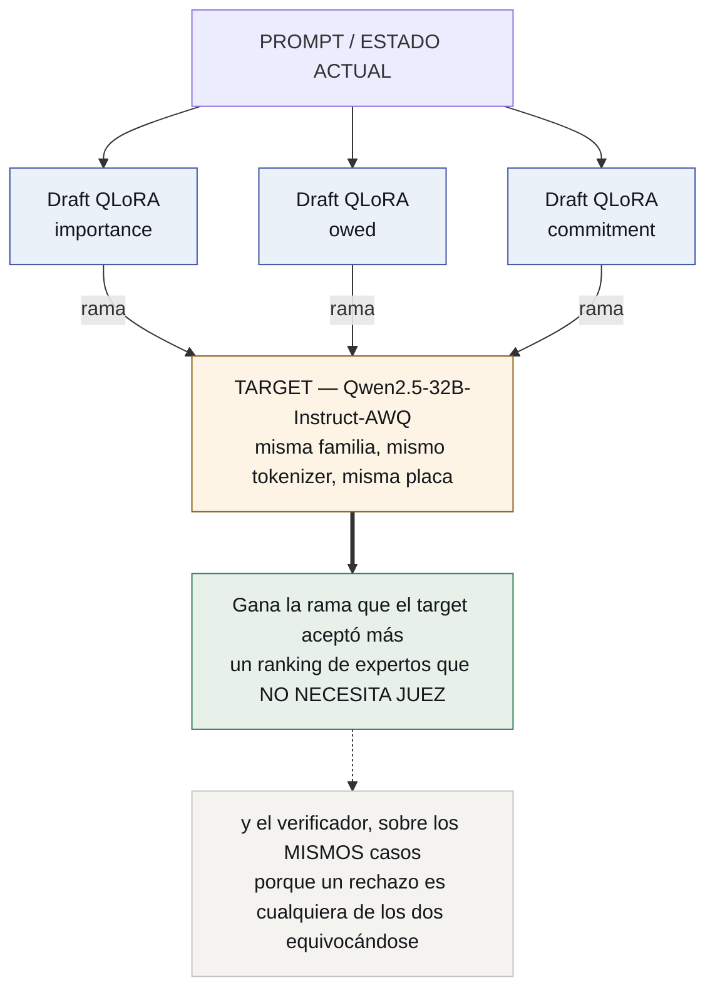
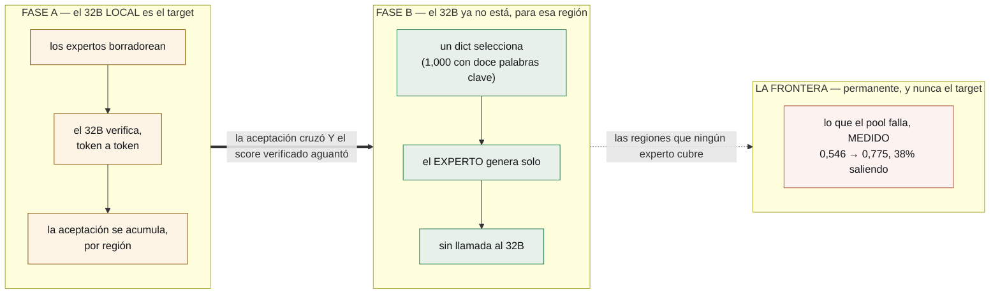

# lora-kernel

**Todo el sistema agéntico es un conjunto de adaptadores QLoRA sobre un modelo
base.** Nada más es neuronal.

*[Read this in English](README.md)*

[](https://docs.openclaw.ai/cli)
[](https://huggingface.co/Qwen/Qwen2.5-3B-Instruct)
[](https://docs.vllm.ai)

**Corre dentro de un agente real.** [OpenClaw](https://docs.openclaw.ai/cli) en una
laptop → un proxy local → un túnel → vLLM en una tarjeta alquilada → un QLoRA nuestro
→ vuelta, con las herramientas del inbox entregadas al agente por MCP y **cero
requests saliendo de la máquina** para lo que el pool sirve. Paso a paso:
[`docs/es/OPENCLAW.md`](docs/es/OPENCLAW.md).

> **Estado: construido y midiendo.** ~~especificado, nada construido; todavía no
> hay ningún [ran]~~ — desactualizado desde el 2026-09-08 y corregido el
> 2026-09-15. Toda afirmación sobre un sistema externo sigue marcada **[read]** y
> citada; las que son sobre éste van marcadas **[ran]** con el directorio de la
> corrida que las produjo.
>
> **Dónde está:** dos adaptadores se sirven desde una base residente, elegidos por
> el campo `model` de un request HTTP. **Uno es bueno** — le gana a la base 8 : 51
> sobre los mismos casos. **El otro no** — sigue el protocolo a la perfección y se
> equivoca en la física 78 veces de 90. Mandar ése a un modelo de frontera lleva la
> entrega de **0,546 a 0,775**, con el 38% de los casos saliendo de la máquina.
> *Un pool con dos miembros útiles es lo que todavía no tiene.*
>
> **Y cuatro cosas medidas el 2026-09-15/16 cambiaron qué construir después, tres de
> ellas cancelando algo:**
>
> - **Un experto queda encerrado en la profundidad que le enseñó su corpus.** Por
>   debajo de su banda, `fluids-full` **sobre-resuelve en 18 de 18** casos —
>   inventando un área para contestar algo que nadie preguntó — y a tres pasos **la
>   base pelada le gana, 0,167 contra 0,000**. Un corpus con una sola dificultad
>   enseña un piso, no sólo una habilidad.
> - **Casi todo un margen de calibración puede ser de la suite.** El 69–82% del
>   margen AURC reportado para la confianza del experto era el techo de información
>   de la entrada, no el modelo. Un head tipado que lee sólo el listado quedó
>   cancelado antes de la GPU.
> - **La ruta gruesa no necesita modelo — y eso es una crítica, no un logro.** Doce
>   líneas de palabras clave eligen la superficie correcta el **1,000** de las veces.
>   Un problema de discriminación que se resuelve con doce palabras clave no es una
>   prueba de selección de expertos: **los dos miembros están demasiado lejos para
>   encontrarse en un mismo problema.** La ruta fina, donde las familias difieren sólo
>   por una conversión de unidades, cae a **0,845** — ahí es donde la selección se
>   pone difícil de verdad.
> - **El target especulativo lo decide un hash.** Todos los tamaños de
>   `Qwen2.5-Instruct` comparten un tokenizer byte-idéntico con nuestra base; la
>   línea `Qwen3.x` cambió su vocabulario en la 3.5, así que sus modelos de 27B
>   **no pueden verificar a nuestros drafters**.

---

## La tesis

Hoy un sistema multi-agente es Python orquestando llamadas a APIs: un modelo
router, un modelo planificador, una pila de esquemas JSON en cada system prompt,
y un parser adivinando si el modelo quiso llamar una herramienta.

Reemplazá todo eso por **deltas de pesos sobre un único modelo base residente**.

| lo que es hoy | en qué se convierte |
|---|---|
| el harness — esquemas, parsers, reintentos | **`harness.lora`** — un adaptador que *emite* action tokens de forma nativa |
| un agente | **un QLoRA de dominio**, unos cientos de MB, intercambiable en caliente |
| el router — una llamada extra a un modelo | **un dict** para la ruta gruesa (1,000 con doce palabras clave **[ran]**) y **aceptación** para rankear expertos que se parecen — la mitad que un dict no puede |
| el bucle de evolución | **un torneo de adaptadores**, puntuados y promovidos |
| la memoria | markdown + git — **deliberadamente no neuronal** |
| el entorno de ejecución | un sandbox — **deliberadamente no neuronal** |

Una GPU. Un modelo base residente. Un pool de deltas chicos que vLLM intercambia
por request. El sistema agéntico deja de ser software que llama a un modelo y
pasa a ser **un modelo poniéndose distintos adaptadores**.

## El mecanismo, y por qué funciona

La decodificación especulativa tiene una propiedad que no es una nota al pie:
**los tokens emitidos se distribuyen exactamente como los habría emitido el
modelo target.** El muestreo por rechazo lo garantiza. **[read]**

Esa propiedad es lo que hace funcionar a esta arquitectura, y por eso **la
elección del target es todo el diseño**:

> ~~**El target es un modelo de frontera.** Los expertos son sus drafters.~~
> **El target es un modelo más grande de la misma familia, servido en la misma placa.**

**Reformulado el 2026-09-15.** La frontera era andamio, a retirar cuando los
expertos la igualaran. No se está retirando: es **el fallback para lo que los
expertos fallan, medido**, y la pregunta de diseño se movió con ella — de *¿podemos
sacar el target?* a **¿podemos decir, caso por caso, cuándo la respuesta local
alcanza?**. La aceptación era criterio de promoción para entrenar; su trabajo
abierto es ahora esa decisión de confianza **[ran]**
`results/P41-routing-20260915/`.

*2026-09-16:* una API de frontera no puede ser target especulativo: no devuelve los
logprobs de una continuación forzada ni comparte el tokenizer (C2, C3). **Un modelo
grande local sí puede**, y ahora la elección está medida en vez de asumida **[ran]**
`results/P48-tokenizer-compat-20260916/`:

| target | vocab | ¿sirve como target especulativo? |
|---|---:|---|
| **Qwen2.5-7B / 14B / 32B / 72B** | 151.643 | **sí — `tokenizer.json` byte-idéntico** |
| Qwen3-14B / Qwen3-32B | 151.643 | sí, con 4 ids que sólo el target tiene (`<think>`, …) |
| Qwen3.5 / 3.6 / 3.8-27B | **248.044** | **no — otro vocabulario** |

**Y el target nunca necesitó LoRA** — C18 restringe al *drafter*, que es donde vive el
pool. Así que un target Qwen 3 está disponible hoy sin costo de ingeniería, mientras
`Qwen3.8-27B` sigue bloqueado: obligaría a mover el drafter a la familia para la que
está medido que vLLM no sirve adaptadores. Por qué esa migración va tercera y no
primera: [`docs/analysis/qwen3-migration.md`](docs/analysis/qwen3-migration.md).

Así que el diseño tiene **tres niveles, no dos**, y cada uno está por una razón
distinta:

    expertos chicos  ——  draftean, un adaptador por subdominio, ~100 MB cada uno
          ↓ la aceptación dice qué subdominios ya cubren
    un grande local  ——  verifica token a token; retirable POR SUBDOMINIO
          ↓ el ruteo por región dice qué subdominios no cubren
    la frontera      ——  contesta lo que los expertos fallan, medido (0,546 → 0,775)

**Lo que eso compra, y es lo que el torneo de S7 nunca tuvo:** con todos los expertos
drafteando contra el mismo target, **la aceptación es un ranking de expertos que no
necesita juez ni verificador** — mismo target, mismo prefijo, mismas condiciones.

**Lo que no compra por sí solo:** un rechazo es el chico equivocándose o el grande
equivocándose, y sólo el verificador al lado los separa. La aceptación sola nunca
puede autorizar un retiro; el score verificado tiene que aguantar donde se saca el
target. **Nada de esta estructura de niveles se corrió** — ver *Lo que no corrió*.


Como el target es de frontera, una tasa de aceptación alta significa algo preciso
y valioso: *este experto chico ya produce lo que la frontera habría producido, en
esta región del problema*. La aceptación deja de ser un estadístico de velocidad
y pasa a ser **una puntuación continua de destilación por región, medida gratis
dentro de una inferencia que igual ibas a pagar.**



El enrutamiento no cuesta nada extra. Los tokens ya se generaron. El pase de
verificación ya iba a ocurrir. El ganador es un subproducto.

## El retiro — del target local, por región; la frontera se queda

El modelo de frontera es **andamio**, y el diseño dice cuándo sacarlo.

**Fase A — la frontera es el target.** Pagás costo de frontera y obtenés calidad
de frontera. Lo que *además* obtenés, a costo marginal cero, es un mapa que se va
llenando: para cada región del problema, con qué experto chico la frontera
coincide, y cuánto. Es destilación con su propia evaluación adentro del camino de
servicio.

**Fase B — retirás la frontera.** Los expertos cuya aceptación cruzó el umbral en
una región se promueven de *drafter* a *generador*. La frontera sale. Lo que la
reemplaza es **sólo un router**, ajustado sobre la superficie de aceptación que
produjo la Fase A.



|  | Fase A | Fase B |
|---|---|---|
| **costo** | frontera | local |
| **calidad** | frontera | al umbral de α que exigiste |
| **y además** | una destilación gratis | — |

El umbral es la decisión de producto: cuánta coincidencia con la frontera exigís
antes de dejar que un experto conteste solo, por región. Y es reversible.

**El número que decide toda la arquitectura** es la **brecha de retiro**: el
puntaje verificado después de sacar la frontera, menos el que tenía con ella.
Hacer chica esa brecha *es* el proyecto.

## Los cuatro adaptadores


> **Aparcado el 2026-09-15, y queda escrito porque las razones son el registro.** En
> la suite que lo midió, un protocolo aprendido sacó **9/30** donde veinte líneas de
> `re` sacaron **23/30** — esa suite tenía una sola herramienta, así que pedirla era
> copiar una expresión ya escrita **[ran]** P13. Y partir la capacidad costó la
> disposición: pedir cayó de **123 de 150 casos a 22** **[ran]** P35. **Los expertos
> son autocontenidos ahora**, cada uno declarando la banda que le enseñó su corpus
> (`training/harness/contract.py`).

**1 · `harness.lora` — el kernel.** Entrenado en nada más que el protocolo de
ejecución: sintaxis de tools, **action tokens** (`<invoke_tool name="sql">`,
`<eval_state>`, `<observe>`), formas de error, transiciones de estado. El esquema
sale del system prompt; el formato se *emite* en vez de recuperarse con un
parser. Siempre cargado: el adaptador de dominio piensa, el kernel actúa. **Y se puede
versionar, puntuar y evolucionar como cualquier otro adaptador**: hoy el harness
es código, así que no podés correr dos baratos contra el mismo tráfico y quedarte
con el mejor. Como adaptador entra en el mismo torneo, y la capa de orquestación
deja de ser la única parte del sistema que no puede mejorar sola.

El número a batir es **nuestro**: `gemma4nanoloop` ya llevó el schema pico de
**5.548 → 817 tokens (−85%)** atando tools por fase, sin entrenar nada. **[read]**
Y en sintaxis el titular es *constrained decoding* (`token-trie`), que vuelve la
salida inválida **imposible**, no improbable.

**2 · QLoRAs de dominio — user space.** Unos cientos de MB de delta cada uno,
intercambiados por request, versionados como código.

**3 · El router.** Fase A: aceptación. Fase B: un router ajustado a la superficie.

**4 · El torneo.** Por tarea ejecutada:

```
score = w₁ · éxito verificado de la tarea
      + w₂ · α  (aceptación contra el target de frontera)
      − w₃ · tokens consumidos
```

**`w₁` tiene que venir de un verificador que el bucle no pueda ver**, o el bucle
cría adaptadores que adulan a su propio evaluador. La medición más fuerte que
tenemos: el mismo procedimiento fue *compensación de interfaz* en un 4B y
*ganancia persistente* en un 12B. **Que un experto sea real no es propiedad del
experto.** **[read]**

## Lo que deliberadamente NO es un LoRA

1. **La memoria** — markdown bajo git. Un delta de pesos no se puede leer,
   diffear, citar ni corregir.
2. **La ejecución** — el sandbox donde las herramientas corren.

## Estado de ingeniería, con honestidad

| capacidad | estado |
|---|---|
| muchos LoRA sobre un target, en batch | **shippea en vLLM** **[read]** |
| verificación de drafts en árbol | **shippea** (familia EAGLE/Medusa) **[read]** |
| **LoRA como draft model** | **RFC abierto** el 2026-08-12 — [vllm#52038](https://github.com/vllm-project/vllm/issues/52038) **[read]** |

Los números del RFC son la parte alentadora: un adaptador **r=64 es ~28× más
chico** que el drafter de 0,8B que reemplaza, con calidad de borrador dentro del
**~2%** de un drafter entrenado por dominio. **[read]** Hasta que aterrice, la
Fase A corre con adaptadores fuera del camino especulativo de vLLM, o con
drafters chicos por dominio: más memoria, mismo experimento.

**La parte genuinamente difícil es el KV cache.** Las ramas de *adaptadores
distintos* no comparten una representación cacheable como sí lo hacen las ramas
de un mismo drafter, porque el LoRA cambia las proyecciones que producen K y V.

## Qué se corre primero — superado, se deja como registro

Esta sección nombraba cuatro pasos E0–E3 antes de que corriera ninguno. Los
cuatro se compraron y tres reportaron; **Lo que realmente corrió**, más abajo,
trae los números. El plan en que se convirtieron vive en
[`docs/EXPERIMENT_PLAN.md`](docs/EXPERIMENT_PLAN.md), que es el estado del
trabajo y se actualiza en la misma sesión en que un paso reporta.
- [**CASE-TRIAGE.md**](docs/es/CASE-TRIAGE.md) — el correo de una mañana, de punta a punta: cuáles de los doce mecanismos medidos ejercita, cuáles dos no puede, y la compuerta de cada fase.
- [**CASE-TEAM.md**](docs/es/CASE-TEAM.md) — muchos grupos sobre una GPU: el caso donde un grupo estable **es** la región, el problema del router no aparece, y el pool por fin se ejercita como pool.

## Dónde está el plan

### Estado y hoja de ruta, 2026-09-17

**El estado, en un párrafo.** El sustrato funciona y se midió tres veces: un
`Qwen2.5-3B-Instruct` residente, miembros QLoRA conmutados por el campo `model`,
servidos por vLLM detrás de un endpoint OpenAI, alcanzables desde un runtime de
agentes real con cero pedidos saliendo de la máquina. **Un miembro es útil**
(`email-full`, 0,741 en mensajes humanos, p = 0,00036 **[ran]** P43); el segundo
(`fluids-full`) sigue el protocolo y se equivoca en la física. La superficie de
herramientas que ofrece un agente ahora se **poda a lo que cada miembro declara**
(#190), lo que quita el motivo por el que el turno de agente de P43 no llamó nada. Y
**la afirmación central — la aceptación rankea expertos como los rankea la calidad —
se está midiendo por primera vez, ahora mismo**: la sesión A de P55 está en un A100
mientras se escribe esto (lanzada el 2026-09-17, brief en
[`results/P55-graded-ranking-20260916/BRIEF.md`](results/P55-graded-ranking-20260916/BRIEF.md)).

**La hoja de ruta es una lista de mecanismos, desbloqueados de a uno.** Cada fila es
algo que este proyecto nunca tuvo, con la compuerta que dice si ahora lo tiene. Una
compuerta que falla detiene la corrida antes de comprar el mecanismo siguiente.

| # | mecanismo | estado | compuerta |
|---|---|---|---|
| **M0** | el drafter servido **en modo corpus** — parar en `</tag>`, inyectar el resultado real, seguir. Vía `tool_calls` *inventa* el resultado que no puede recibir **[ran]** P43 | ✅ **[ran]** `email-full` **0,992** en modo corpus contra 0,808 vía `tool_calls` | stop string honrado; el adaptador difiere de la base en 8 casos sonda (C18) |
| **M-target** | un target que valga la pena **en esta tarea** (P49 compró el 32B en drafting, no en triage) | ❌ **UNBOUGHT [ran]** — el 32B da **0,746** en casos humanos contra 0,989 del experto, pareado 2 : 87; consigue los hechos y aplica mal la regla. En esta suite el target es más débil que el experto | le gana a `email-full` sobre los mismos casos humanos, pareado, p ≤ 0,05 |
| **M-α** | aceptación en **tokens** por `prompt_logprobs` forzados — la primera α con espacio de ids compartido | ✅ preflights pasan **[ran]**; **todavía no corrió** — la compuerta anterior rechazó | templates idénticos; una entrada por token con `rank` |
| **M1** | **expertos que difieren en calidad**: `g75 ⊂ g200 ⊂ email-full` | `BLOCKED` hasta una suite con un target más fuerte — candidato a rediseño: la región `commitment` del desk, 32B en 1,000 en toda la profundidad **[ran]** P51 | el verificador resuelve ≥ 1 de 3 pares, o el target no se sirve |
| **M2** | **la prueba de orden** — la tesis | `BLOCKED` con M1 | SUPPORTED / FALSIFIED / UNRESOLVED-como-fracaso, escrito antes de correr |
| **D0** | un drafter Qwen 3.x que comparta espacio de ids con **`Qwen3.8-27B`** | ✅ **[ran]** `Qwen3.5-2B` y `-4B`, 7 ids sólo del target, todos de audio/TTS | — |
| **D1** | vLLM aplicando un LoRA sobre una base 3.x (C18) | `BLOCKED` — la cadena instala el último vLLM y **sigue siendo 0.29.0** **[ran]** 2026-09-17, así que no hay nada más nuevo que re-verificar todavía | `applied` sobre el adaptador diminuto de P33 |
| **D2** | el mecanismo de C18, leído con el log en la mano (G3 merge; mapeo clave PEFT ↔ módulo vLLM) | `NEXT` después de A | — |
| **D4** | **este instrumento apuntado a `Qwen3.8-27B`**, pool graduado reentrenado sobre `Qwen3.5-4B` | `BLOCKED` por D1/D2 | la misma tabla de veredictos que M2 |

**Por qué en este orden.** Un target más nuevo y más lento no acerca la medición del
ranking; α nunca se había medido contra ningún target, y `Qwen2.5-32B` alcanza para
medirla. Si M2 dice que la aceptación no rankea, D4 habría comprado una versión más
rápida de un mecanismo que no funciona. Nada de M depende de D; D4 depende de todo M.

**Qué cambiaría la hoja de ruta.** M-target UNBOUGHT → no hay target que valga la
pena en triage; la prueba de orden no se compra y el próximo diseño es una suite más
dura, no un modelo más grande. M1 no desbloqueado → los grados no son grados;
ensancharlos o graduar por pasos (contador de rediseños: 1). M2 FALSIFIED → el router
gratis desaparece y la arquitectura sobrevive sin él, como el §1 del plan siempre dijo.

| | objetivo | estado |
|:--:|---|---|
| **S0** | que el instrumento mida lo que dice | ✅ |
| **S1** | que haya brecha contra la frontera | ✅ **+0,533** |
| **S2** | que el acuerdo ordene expertos | ✅ **6/6 pares** contra un target que está adelante |
| **S3** | que el router valga más que una tabla | 🟡 empata |
| **S4** | que el experto se especialice por región | ✅ **+63,3** |
| **S5** | cerrar la brecha de retiro | ✅ **0,000** en región |
| **S9** | una región que es la mañana de alguien | ✅ **el experto clarea su compuerta, y el end-to-end corre dentro de un agente real.** 260/351 mensajes humanos = **0,741** contra una barra de 0,655, **p exacta = 0,00036** — y OpenClaw en una laptop contesta a través de un proxy local, un túnel y un QLoRA servido en una tarjeta alquilada, con **cero requests saliendo de la máquina**. Corridas anteriores dieron 84/81/82 contra un umbral de 83; eso era una suite demasiado chica para el efecto (**47% de potencia**), no un modelo titubeando. **Dos expertos, una base residente, elegidos por el campo `model` — y sólo uno es bueno.** El miembro de email le gana a la base **8 : 51 discordante, p ≈ 0**; la co-residencia no le cuesta nada (84/81/82 en tres corridas, los tres pares empatados). El de fluidos sigue el protocolo a la perfección — 0 rechazos, 0 turnos agotados, 6–8 llamadas — y se equivoca en la física **78 veces de 90**, perdiendo contra una regla escrita a mano, pareado, con p = 0,022. **Funciona el que decide; falla el que razona.**|
| **S10** | la base sobre la que el pool puede correr | ✅ **Qwen 2.5, decidido contra un control** — vLLM 0.29.0 carga un LoRA sobre `Qwen3.5-4B`, registra que lo hizo, y **sirve la base igual**. El adaptador era real: `lora_B` se movió en las doce proyecciones y la salida cambió en proceso. Leído al lado de un control sobre `Qwen2.5-3B` que volvió `applied` en la misma sesión, así que es un hecho sobre el stack de serving y no sobre el instrumento |
| **S8** | el pool detrás de un endpoint OpenAI | 🟢 **servible, y la mayor parte del costo del puente se recupera** — cada adaptador es su propio nombre de modelo y se aplica. Etiquetas→`tool_calls` **no tiene dominio**, 604/604 idas y vueltas. Esquema→etiquetas costaba 0,188; **una convención basada en contar parámetros recupera el 55%** y baja los rechazos de 88 a 17, el número exacto del brazo entrenado. Declarar los valores permitidos **lo empeoró** |
| **S6** | `harness.lora` — kernel separado del experto | 🟡 **empate en fluidos, no empate en especie** — 94/96 contra 93/96 de una regla donde los valores no se memorizan. En un **segundo tema** para el que no se editó ninguno, la regla escribe **0 de 63** llamadas y el adaptador **27 de 63**: un harness escrito a mano no transfiere nada, uno aprendido transfiere parte de sí. Pero 0,429 no llegó al 0,979 que el brief pedía, y los brazos siguen empatando en respuesta final |
| **S7** | el torneo que evoluciona los expertos | 🟢 **la nota quedó fijada** — ningún juez solo ordena de forma confiable (1 de 2 pares cada uno); **exigir que ambos acepten acierta 2 de 2** |

**Lo que funciona.** El protocolo se aprende solo y viaja a un dominio que nunca
vio. La física del experto es exacta dentro de su región, 30/30. **Los dos parches
componen si se turnan** — la delegación pasa de 0,6 a 4,7 llamadas por caso. La
brecha de retiro cierra: 1,000 contra una base justa de 0,467. Y el pool se sirve
con vLLM multi-LoRA.

**Lo que no, y qué se está haciendo.**

| | qué falla | plan |
|:--:|---|---|
| 1 | ~~Una suite donde las herramientas hagan falta.~~ ~~Falta la comparación.~~ **Las dos hechas, y la comparación empata**: el control sin herramientas se derrumba 27/30 → 6/30 con manuales por caso, y sobre ese material el kernel llega a **94/96** contra el **93/96** de la regla | lo que los separa es el carácter, no el puntaje: la regla hace 96 llamadas sin **ninguna rechazada**, el kernel hace 116 con **20 rechazadas** y recupera todas menos una. Si un 17,2% de rechazo importa contra una herramienta paga o lenta está sin medir |
| 2 | **Un guardia en el borde de la región** — las fórmulas del experto caen 30/30 → 1/20 afuera. Toda señal *de comportamiento* quedó falsificada: en familias nuevas la capa de herramientas da 0,18 contra 0,15 adentro, que es el azar | sobrevive una señal **estructural** donde no sobrevivió el comportamiento. El álgebra dimensional sobre (kg, m, s) detecta el **0,80** del trabajo fuera de región en familias selladas antes de que el instrumento existiera. Sola da 0,22 de falsa alarma; escalar sólo cuando fallan la dimensional **y** la mecánica **no se dispara nunca en región — 0 de 60 — y aun así atrapa el 0,35 del trabajo de afuera**. Está cableado como `escalate.has_left_its_region`. Falta cuánto cuesta escalar, que es lo que lo decide contra la regla más ancha, que frena 60 de 67 respuestas erróneas mandando afuera la mitad del trabajo en región |
| 3 | ~~No hay juez sin oráculo.~~ **Medido: existe un juez.** La frontera corrige a **0,89** balanceado y un par a **0,82** — mientras ese mismo par *resuelve* el material a 0,467 | queda el caso donde nada disponible pueda resolver el trabajo, del que esta corrida no habla |
| 4 | **El router empata con una tabla de búsqueda** | necesita expertos por familia y material donde superficie y sustancia se separen |
| 5 | **El torneo está sin construir** — el único objetivo que nunca se tocó | la nota puede venir de un par, que es lo que deja una frontera retirada. Se está construyendo |

## Lo que realmente corrió

Todo lo de abajo es **[ran]** en este repositorio, con el directorio de corrida
nombrado. Nada de esta sección se infiere de un paper ni de un README.

| afirmación | medición | dónde |
|---|---|---|
| **Existe una brecha de frontera**, y es **+0,533**, no +0,975 | `gemini-3.8-flash` **30/30** contra `qwen3.5:4b` **14/30**, mismos 30 casos, un contrato compartido, 6000 tokens. El mismo modelo local saca **0/30** con el prompt que P5–P8 usó para todas sus líneas de base — así que **0,467 del 0,975 original era el prompt diciéndole a la base que no pensara** **[ran]**. En una suite clínica el mismo test falló tres veces — ninguna frontera estuvo nunca adelante | `results/P5-physics-headroom-20260908/` |
| **Un pool se sirve, con el adaptador de un tercero al lado** | dos adaptadores residentes sobre una base, cada uno distinto de la base *y entre sí*; la compuerta rechaza un pool cuyos miembros sean el mismo modelo | `results/P40-…`, `results/P42-third-party-20260915/` |
| **Un experto es genuinamente bueno** | `email-full` con herramientas: **260/351 = 0,741**, p exacta de una cola **0,00036** contra la barra de clase mayoritaria | `results/P43-openclaw-e2e-20260915/` |
| **Rutear por región paga; rutear por caso no** | todo local **0,546**; fluidos → frontera **0,775** con 38% saliendo; tripwire por caso **0,378**, compuerta de calidad por caso **0,689** | `results/P41-routing-20260915/` |
| **La suite no tenía eje de dificultad, y el experto está encerrado en la profundidad de su corpus** | las soluciones del oráculo eran de 6, 7 o 9 pasos, **sin un solo caso por debajo de seis**. Con escalones de 1 a 4, el experto **sobre-resuelve en 18 de 18** por debajo de su banda y **0 de 17** en ella o por encima; a tres pasos la base pelada le gana **0,167 a 0,000** | `results/P45-ladder-sweep-20260915/` |
| **El 69-82% de un margen de calibración medido era la suite** | agrupar los casos por lo que un predictor puede ver da el techo: en el inbox completo los dos brazos ya están en él, margen **0,030** y **0,007**; en el subconjunto humano el mejor predictor que sólo lee el listado es una **constante** | `results/P46-ranking-ceiling-20260916/` |
| **La ruta gruesa no necesita modelo** | doce líneas de palabras clave eligen la superficie correcta el **1,000** de las veces sobre 200 casos; el baseline de la ruta fina es **0,845** | `tests/test_router_baseline.py` |
| **El target especulativo lo decide un hash** | todos los tamaños de `Qwen2.5-Instruct` comparten tokenizer byte-idéntico con la base; `Qwen3-14B/32B` son compatibles en ids con 4 ids extra; **`Qwen3.5/3.6/3.8-27B` tienen 248.044 entradas y no pueden verificar a nuestros drafters** | `results/P48-tokenizer-compat-20260916/` |
| La destilación transfiere el **procedimiento pero no la aritmética** | el experto reproduce la cadena del maestro paso por paso y calcula pi/4·0,22² como 0,037006 en vez de 0,038013 | `results/P6-withdrawal-20260908/` |
| **La brecha de retiro se cierra** | adaptador + calculadora **40/40** = el maestro. Brecha de retiro **0,000** | `results/P7-calculator-20260908/` |
| …y hacen falta **las dos mitades** | base + calculadora **0/40** con 53 llamadas; adaptador solo **4/40** | ídem |
| **El protocolo se puede aprender solo** | un adaptador kernel **sin física en su corpus** llama a la herramienta en **30/30** casos de fluidos, **0 malformadas**, bajo un prompt que nunca menciona una herramienta | `results/P8-…`, `results/P9-…` |
| **La física del experto es exacta; sólo falla su aritmética** | exactitud de la cadena reparada **30/30** contra un crudo **1/30**, con **0** llamadas | `results/P9-shared-contract-20260909/` |
| **Dos parches componen si se turnan** | la activación secuencial mueve la delegación de **0,6** llamadas por caso a **4,7**, y la exactitud de 4/30 a 9/30. Apilarlos los hace pelear; alternarlos no | `results/P13-sequential-20260910/` |
| **El mejor resultado modular no necesita pesos de kernel** | el experto escribiendo su cadena con un harness delgado ejecutando la aritmética exacta: **23/30 crudo, 30/30 reparado** — sin adaptador fusionado, sin protocolo en los pesos del experto | ídem |
| **Un pool se puede servir** | vLLM 0.28.0 multi-LoRA sobre `Qwen2.5-3B-Instruct`: el adaptador cambia la salida, y la exactitud servida coincide con `transformers` para la misma receta | `results/P3-vllm-20260908/` |
| La aceptación por caracteres mide **formato, no acuerdo** | respuestas idénticas sacan 0,00 entre formatos; respuestas distintas sacan 0,44 dentro de uno. El criterio de promoción es **acuerdo semántico de respuesta** | `results/S0*/` |

## Lo que no corrió, y no se afirma

- **Mostrar que un protocolo aprendido vale sus pesos.** La composición está
  resuelta: turnarse restaura la delegación. Pero en esta suite el adaptador kernel
  **pierde contra veinte líneas de `re`** — 9/30 contra 23/30 de un harness delgado
  — porque hay una sola herramienta y la llamada es copia de una expresión ya
  escrita. Tiene que ganarse el lugar donde la llamada **no** sea una copia: varias
  herramientas, argumentos que formatear, una elección de cuál usar. Ese
  experimento todavía no existe.
- ~~Activación secuencial, que §5 declara como su propia default y nunca se
  midió.~~ **Medida en P13 y funciona**: la delegación pasa de 0,6 a 4,7 llamadas
  por caso. Ya no es un pendiente.
- **Un guardia en el borde de la región.** Ya medido, y es peor de lo que se
  suponía: las fórmulas del experto caen de **30/30 dentro de su región a 1/20
  afuera**, en el mismo dominio y el mismo estilo de consigna, y **nada en su
  salida marca la diferencia** — misma estructura, misma seguridad, física
  inventada. La promoción por región necesita un guardia que no existe.
- **El precio de sostener un pool.** El brazo de lote mixto midió el bucle de este
  repositorio y no el planificador de vLLM: está anulado.
- **KV cache entre adaptadores**, el torneo, el router, y el retiro de la frontera
  a cualquier escala mayor que una región.

- **Los tres niveles, y cada capa del diseño por capas.** Expertos chicos drafteando
  contra un target grande local, la aceptación como ranking de torneo, el retiro por
  subdominio, una capa de subespecialidad que además elige la superficie de
  herramientas, marcadores estructurales en el prompt — **todo eso es análisis**
  (`docs/analysis/`) y **nada se corrió**. Lo medido son las *entradas* de esas
  decisiones: la compatibilidad de tokenizers, el baseline de ruteo, el piso de
  profundidad y el techo de calibración.
  **P55 es la primera corrida de la aceptación como ranking** — sobre expertos
  graduados por construcción, pre-registrada en
  [`results/P55-graded-ranking-20260916/BRIEF.md`](results/P55-graded-ranking-20260916/BRIEF.md).
  Todavía no corrió.
- **Un pool más grande que dos.** `--max-loras` sólo fue 1 o 2 acá. S-LoRA reporta
  miles en una máquina **[read]**; lo nuestro no se probó arriba de dos, y el diseño
  por capas es lo primero que necesitaría más.
- **Varios expertos cercanos sobre un mismo problema.** Lo próximo a construir, y la
  razón es una corrección de la línea de arriba: dos miembros útiles es necesario y
  no suficiente — **tienen que estar lo bastante cerca para coexistir**. Tres expertos
  de redacción sobre una bandeja, un set de herramientas, una base, **cambiando sólo
  la política**, elegidos por **aceptación** y no por un router — porque cuando los
  candidatos se parecen, *qué experto parece relevante* y *qué experto escribió lo que
  el grande hubiera escrito* dejan de ser la misma pregunta. Redactar además **no
  tiene verificador mecánico**, que es donde el torneo de S7 siempre se trabó, y la
  aceptación no necesita ninguno. Diseño y compuertas:
  [`docs/analysis/close-experts.md`](docs/analysis/close-experts.md). **No construido.**
- **Que un adaptador tipado ayude.** La versión que lee sólo el listado quedó
  cancelada por su propio chequeo de headroom; la que va después de la cadena de
  herramientas está especificada y su primera medición todavía corría cuando se
  escribió esto.

## Cómo se libera

Open-core. **Abierto:** el runtime multi-LoRA sobre vLLM, el router especulativo,
la maquinaria de retiro, la especificación de `harness.lora` y el protocolo de
action tokens, el conector de memoria markdown+git. **No abierto:** los packs de
adaptadores verticales entrenados, el pipeline gestionado de evolución, el
control plane empresarial.

## Documentos

- [`docs/es/REPORT.md`](docs/es/REPORT.md) — **el plan original contra lo que pasó**,
  el patrón de las fallas (casi todo resultado negativo es la suite, no la
  arquitectura), qué está genuinamente bloqueado, y qué nos dan y qué no los
  módulos de decodificación especulativa de NVIDIA
- [`docs/es/STACK.md`](docs/es/STACK.md) — **el inventario: cada id de modelo, cada
  hiperparámetro de adaptador, cada flag de vLLM**, con la corrida que lo estableció
  — la base y por qué está resuelta por medición, los dos targets y la tabla de
  tokenizers, los cinco adaptadores con sus bandas y puntajes, la receta de
  entrenamiento, el comando de serving flag por flag, y qué se rechaza y con qué
- [`docs/es/ARCHITECTURE.md`](docs/es/ARCHITECTURE.md) — las siete capas, por qué
  el target tiene que ser de frontera, y la condición de retiro.
- [`docs/es/TECHNICAL-REFERENCE.md`](docs/es/TECHNICAL-REFERENCE.md) — mecanismos,
  α y su superficie, KV cache, action tokens, composición de adaptadores.
- [`docs/es/OPEN-PROBLEMS.md`](docs/es/OPEN-PROBLEMS.md) — **los problemas
  abiertos, escritos sin jerga**, con el **Problema 3 enunciado completo para
  entregárselo a alguien sin ningún otro contexto** — es el que bloquea el producto: qué es cada problema, qué probamos, qué
  descartó cada intento, y cómo se vería resolverlo.
- [`docs/es/the-frontier-is-scaffolding.md`](docs/es/the-frontier-is-scaffolding.md) —
  el artículo.

## Reconocimiento

Esta línea empezó con una conversación con
**[Ismael Faro](https://github.com/ismaelfaro)**, que sugirió estudiar la
decodificación especulativa y para qué podría servir.

---

<sub>Apache 2.0 · [Evolving Agents Labs](https://github.com/EvolvingAgentsLabs)</sub>
