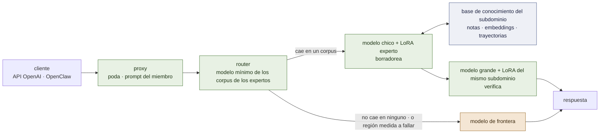

# lora-kernel

**Los expertos son corpus. Un pedido va al experto a cuyo corpus se parece, y a un modelo
de frontera cuando no se parece a ninguno.**

[](LICENSE)
[](docs/es/ARCHITECTURE.md)
[](docs/es/RECORD.md)

*[English](README.md)*

lora-kernel es el runtime de un servicio: una **API compatible con OpenAI** que resuelve
localmente lo que cae dentro de una región medida y manda el resto a un modelo de frontera,
e **instancias de OpenClaw por tarea** encima de ella. Una región es un experto QLoRA chico,
entrenado con fine-tuning supervisado común sobre un corpus, liberado a través de una
compuerta, y servido junto a los demás sobre una base residente.

Cada afirmación de abajo está marcada **[ran]** (observada en este repositorio, con el
directorio de la corrida nombrado) o **[read]** (inferida de código fuente o de un paper).
Todo lo medido hasta ahora es sobre **suites generadas** — ningún tráfico real pasó todavía
por acá. Eso es lo primero que hay que saber de los números.

---

## La idea, en cuatro decisiones

Doce días de medición redujeron el diseño a una observación: **lo que hace funcionar a un
experto, y lo que hace funcionar al ruteo, es la distribución del corpus del experto.** Un
experto llamó a una herramienta en 2 de 32 turnos en vivo bajo el prompt del runtime y en
19 de 32 bajo el prompt que su corpus le enseñó **[ran]** P63. Un router por palabras clave
mal-ruteó 15 de 60 pedidos con claves sobre lo que comparten las entradas de dos expertos,
y ninguno con claves sobre lo que preguntan sus corpus **[ran]** P64. El mismo hecho, visto
dos veces. El diseño sale de ahí.

1. **Un experto es su corpus** — el bloque de herramientas, las claves de los argumentos y
   su orden, el system prompt, la banda de profundidad. Se sirve exactamente bajo eso, o es
   otro modelo. El contrato de release lo registra todo.
2. **El router es un modelo muy chico de esos mismos corpus.** Decide en la distribución de
   qué experto cae un pedido, y **se abstiene** cuando no cae en ninguna. Abstenerse es la
   frontera. El router nunca decide que una región es *buena* — eso lo decide una tabla
   medida.
3. **Cada subdominio tiene un par: un LoRA sobre un modelo chico y un LoRA sobre uno
   grande, entrenados sobre el mismo corpus.** El chico borradorea, el grande verifica —
   decodificación especulativa dentro del subdominio. El par es la respuesta local a "esta
   región es demasiado difícil para el experto chico", antes de que nada salga de la
   máquina.
4. **Cada subdominio tiene su propia base de conocimiento, y lo que el experto aprende es la
   trayectoria por ella.** Notas de dos tipos — enciclopédicas (qué vale, y cuándo) y
   operacionales (cómo se hace este tipo de tarea, en orden) — embebidas en el mismo espacio que
   lee el router. Los pesos llevan la navegación; la base lleva el contenido, donde se puede
   leer, versionar y editar sin entrenar. Una trayectoria por notas operacionales *es* un
   harness — por subdominio, y fuera de los pesos.



**La familia es Qwen 3.x, chico y grande**: `Qwen3.5-4B` (o `2B`) y `Qwen3.8-27B`, que
comparten un espacio de ids — 248.044 ids **[ran]** D0 — así que el grande puede verificar
lo que el chico borradorea. El diseño es agnóstico a la familia por construcción: un par
`Gemma 4 2B` / `Gemma 4 12B` es la alternativa nombrada, detrás de un bloqueo conocido
(abajo).

---

## Qué funciona — medido

Todo sobre `Qwen2.5-3B-Instruct`, la base sobre la que se entrenó todo lo liberado hasta hoy.

| qué | el número | corrida |
|---|---|---|
| **Un vLLM, una base, varios adaptadores**, cada pedido servido por el suyo | identidad `applied` en cada miembro, herramientas alcanzables, stop honrado | **[ran]** P56 |
| **`email-full@v1`** — triage de inbox, herramientas y juicio en un adaptador | **0,989** en mensajes humanos contra **0,345** de la base; re-servido y re-entrenado, ambos empatan la corrida grabada | **[ran]** P36, P57 |
| **`desk-commitment@v1`** — un segundo miembro sobre el *mismo inbox*, otra pregunta | **240/240** contra **38/240** de la base, discordantes **202 : 0**; empata su corrida grabada | **[ran]** P64 |
| **En un 3B el procedimiento tiene que estar en los pesos** | base + un documento de procedimiento de 914 tokens: **0 llamadas a herramientas en 351/351**, 0,601, debajo de la barra de mayoría; el experto le gana **137 : 1** | **[ran]** P61 |
| **La API rutea por pedido**; el cliente no nombra modelo | replay sobre 240 casos: **0,546 → 0,775**, 0 mal-ruteados, 37,5 % sale hacia la frontera | **[ran]** P41, P62 |
| **OpenClaw, en vivo, desde una laptop** | 40/40 turnos locales, 0 llamadas inventadas, 19/32 turnos humanos llaman a una herramienta, 0,688 contra una barra de 0,655 | **[ran]** P63 |
| **A un miembro hay que servirle su propia superficie de herramientas** | con las 54 herramientas de OpenClaw copia tags del bloque: 225 de 227 llamadas rechazadas; podado, 8 de 1160 | **[ran]** P59 |
| **vLLM aplica un LoRA sobre un modelo grande cuantizado** (`Qwen2.5-32B-AWQ`) | compuerta de logprobs 3/3, \|Δℓ\| medio 0,22–0,49 nats contra un base-vs-base de 0,000 | **[ran]** P60 §3b |
| **Los adaptadores de Qwen 3.5 son servibles** — "vLLM los ignora" era un desajuste de nombres | mismos pesos, 496 tensores renombrados, sin reentrenar: `not applied` → **`applied`**, 0 → 152 de 178 módulos | **[ran]** D2 |

El experto que **decide** — buscar algo, juzgar, responder — funciona. El experto que tiene
que **razonar** a lo largo de una cadena larga no: el miembro de mecánica de fluidos siguió
su protocolo a la perfección y erró la física en 78 de 90 **[ran]** P40. Esa región la sirve
la frontera, y la tabla del router lo dice.

## Qué no funciona, o no está medido

- **No hay datos reales.** Cada suite la genera este repositorio. Una suite generada no
  puede contener una dificultad que su autor no pensó **[ran]** P50.
- **El ahorro en plata nunca se midió.** "37,5 % sale" es una fracción de casos generados,
  no una factura.
- **El router sigue siendo un diccionario de palabras clave.** Su primer reemplazo aprendido —
  un modelo de n-gramas de cada corpus — es más seguro sobre texto ajeno (**0 de 128** servidos
  localmente contra **59** del diccionario) y pierde **todos** los pedidos legítimos de un
  remitente que el generador nunca sacó, 120 de 120 **[ran]** M2. Aprendió la uniformidad del
  generador. El brazo siguiente es un modelo de embeddings.
- **Todavía no existe ninguna mitad grande.** Ningún LoRA se entrenó sobre un 27B, y un
  modelo grande *sin entrenar* sacó **menos** que el experto chico en su propia región —
  0,967 contra 1,000 en el desk, 0,746 contra 0,989 en triage **[ran]** P55, P55b. Ese
  resultado es la razón por la que el modelo grande lleva un LoRA del mismo subdominio en
  vez de usarse pelado.
- **Todavía no existe ninguna base de conocimiento**, y dos resultados dicen cómo no construirla:
  un modelo chico no sigue un procedimiento que sólo lee **[ran]** P61, y el conocimiento que
  queda fijo en un corpus se memoriza y después no mide nada **[ran]** P21.
- **Ninguna señal ve "coherente y equivocado".** Las reglas escritas a mano no lo vieron; el
  acuerdo con una frontera lo ve pero compra calidad, no ahorro **[ran]** P41.
- **Nada de lo liberado está todavía sobre Qwen 3.x.** D2 sacó el obstáculo; el
  reentrenamiento es el hito 1.

El registro completo, con todo lo que falló y por qué, es [`docs/es/RECORD.md`](docs/es/RECORD.md).

---

## Adónde va — los hitos

Cada uno tiene una compuerta y el brazo que puede matarlo, escritos antes de correr
([`docs/es/PLAN.md`](docs/es/PLAN.md)). Los brazos se compran en secuencia, nunca como grilla.

| # | hito | el brazo que lo mata primero |
|---|---|---|
| **1** | **El pool sobre Qwen 3.x chico.** Reentrenar `email-full` y `desk-commitment` sobre `Qwen3.5-4B`, con los tensores nombrados para la clase que vLLM sirve | la compuerta de identidad sobre un adaptador *real* (el de D2 era un juguete de 60 pasos); después: pierde, pareado, contra su release de Qwen 2.5 |
| **2** | **El router como un modelo mínimo de los corpus**, absteniéndose hacia la frontera | brazo 1 **[ran]**, no pasa: seguro sobre texto ajeno, pierde todo pedido de un remitente no visto. El brazo 2 — un modelo de embeddings — muere sobre los mismos cuatro conjuntos |
| **3** | **La mitad grande**: un LoRA sobre `Qwen3.8-27B` desde el mismo corpus, en la banda profunda donde el experto chico tiene margen | vLLM no lo aplica (compuerta de logprobs); después: grande + LoRA no le gana a chico + LoRA, pareado |
| **4** | **El par especulativo**: aceptación de los borradores del LoRA chico bajo la verificación del LoRA grande | aceptación no mayor que contra el modelo grande pelado — el LoRA emparejado no compra nada |
| **5** | **La primera región real: procedimientos de enfermería y material de educación en salud** (nombrada por el usuario; *Nursing Skills* de Open RN, CC BY 4.0, primero — los textos de la OMS son CC BY-NC-SA y sólo sirven para medir). A mano, por la misma compuerta de release | la base pelada ya ordena los pasos de un procedimiento que nunca se le mostró — sin margen, como la suite clínica |
| **6** | **La política del servicio**: router → chico → par → frontera, con la factura medida | la parte local cuesta más de lo que ahorra |
| **7** | **Una base de conocimiento por subdominio, la trayectoria por ella como harness** — sobre mecánica de fluidos, partida en subdominios. *Corre a continuación.* | bajo una trayectoria **oráculo** — exactamente las notas correctas abiertas — el experto sigue sacando ~1/20 en una familia hermana que nunca entrenó |

**Restricciones de ingeniería que esto carga** — hechos, no objeciones:

- vLLM trae multi-LoRA y decodificación especulativa, pero **un drafter adaptado con LoRA es
  un RFC, no una feature [read]**. Por eso el hito 4 mide la aceptación como este
  repositorio ya la mide — una pasada teacher-forced del modelo grande sobre el borrador del
  chico (`prompt_logprobs`) — y reporta α con su `k` al lado del puntaje verificado. La
  aceleración es una afirmación aparte y necesita la feature del runtime.
- Un 27B no entra en la L4 sobre la que corre el pool. La mitad grande es trabajo de A100,
  en 4 bits.
- El canal `<think>` de la línea 3.x queda apagado para los miembros; sus corpus nunca lo
  enseñaron.
- **Gemma 4** como familia alternativa: `Gemma4ClippableLinear` no es un `nn.Linear`, así
  que PEFT no puede engancharse tal como está **[ran]** P29. `lora_matrix` es la compuerta
  que la reabriría.

---

## Correrlo

```bash
# las compuertas que no necesitan GPU
python -m pytest tests -q
python scripts/check-mirrors.py

# el replay de ruteo — por pedido contra por región, cero GPU
python -m training.harness.route

# todo lo que necesita GPU corre en Colab por un solo chain, streameado y reanudable
GPU=L4 BRANCH=main MODULE=training.harness.verify_substrate \
  RUN_DIR=results/mi-corrida training/harness/chain_serve.sh
```

Servir el pool a un agente, los flags del proxy y la compuerta del sustrato:
[`docs/es/SERVING.md`](docs/es/SERVING.md). OpenClaw, paso a paso, tal como corrió en vivo:
[`docs/es/OPENCLAW.md`](docs/es/OPENCLAW.md).

A un miembro se lo sirve con tres flags, y cada uno es default por una razón:
`--prune` (su propia superficie de herramientas), `--member-prompt` (el prompt que su corpus
enseñó), `--auto` (el cliente no nombra modelo).

## El contrato de release

Una región entra por una sola puerta: una suite con verificador, la base como brazo de
margen, un test de signos exacto sobre pares discordantes. Lo que sale es un manifiesto —
[`releases/email-full@v1.json`](releases/email-full@v1.json),
[`releases/desk-commitment@v1.json`](releases/desk-commitment@v1.json) — con la base, la
receta, el hash del corpus, el hash del adaptador, el hash del prompt y las comparaciones
pareadas que lo admitieron. **El corpus nombrado ahí es también sobre lo que se entrena el
router.** Un solo artefacto define al experto y a su región.

## Qué hay en la caja

| ruta | qué |
|---|---|
| `training/harness/openai_proxy.py`, `route.py` | la API: poda, prompt del miembro, ruteo por pedido |
| `training/harness/train_pool.py`, `contract.py` | el registro del pool — cada miembro un registro leído de su corpus |
| `training/harness/release_gate.py`, `pool_second.py`, `verify_substrate.py` | la puerta por la que entra un miembro |
| `training/harness/accept_rank.py`, `awq_lora_gate.py` | la aceptación, y un LoRA sobre un modelo grande cuantizado — las dos mitades de los hitos 3–4 |
| `training/harness/pool_base.py`, `train_one.py` | cada miembro liberado reentrenado y re-liberado sobre otra base (hito 1) |
| `training/harness/corpus_router.py`, `router_sets.py` | el brazo medido del hito 2, y los cinco + tres conjuntos sobre los que se puntúa cualquier router |
| `training/harness/lora_matrix.py`, `rekey.py` | si esta base sirve un LoRA o no — con control, y el renombrado de D2 |
| `training/harness/knowledge_arm.py`, `null_arm.py`, `training/suite_gates.py` | margen antes de entrenar nada |
| `training/email/`, `training/mcp/` | las suites de inbox y desk, y las herramientas del inbox como servidor MCP |
| `training/harness/chain_serve.sh` | el chain de Colab: aprovisionar, correr desacoplado, streamear, traer, detener |
| `releases/`, `results/` | los manifiestos, y las corridas que los documentos citan |

## Documentos

| | |
|---|---|
| [`docs/es/PLAN.md`](docs/es/PLAN.md) | el plan vivo — hitos, compuertas, brazos que matan |
| [`docs/es/RECORD.md`](docs/es/RECORD.md) | todo lo medido, incluido lo que falló; cada línea nombra su corrida |
| [`docs/es/ARCHITECTURE.md`](docs/es/ARCHITECTURE.md) | el sistema: expertos, router, el par, la frontera |
| [`docs/es/KNOWLEDGE-TRAJECTORIES.md`](docs/es/KNOWLEDGE-TRAJECTORIES.md) | el diseño de la memoria por experto — notas, enlaces, una trayectoria aprendida, y por qué eso es un harness. Autocontenido, escrito para que lo revisen otros modelos |
| [`docs/es/FOUNDATIONS.md`](docs/es/FOUNDATIONS.md) | la matemática, atada a las corridas que la instancian |
| [`docs/es/SERVING.md`](docs/es/SERVING.md) · [`docs/es/OPENCLAW.md`](docs/es/OPENCLAW.md) · [`docs/es/SUBSTRATE-GATE.md`](docs/es/SUBSTRATE-GATE.md) | correrlo |
| [`CLAUDE.md`](CLAUDE.md) | instrucciones para agentes de código, y las reglas de medición que ya se pagaron |

**El registro anterior a esta reescritura** — setenta y cuatro directorios de corridas, los
expertos retirados, los análisis y el plan de 2.800 líneas — es el tag
[`v0.1-foundations`](https://github.com/EvolvingAgentsLabs/lora-kernel/tree/v0.1-foundations).
Un número P citado acá sin directorio en `main` vive ahí.

## Alcance

Open source: el runtime, el contrato de release, las compuertas. **No son parte de este
runtime ni de la versión open source:** el servicio de personalización y sus herramientas —
los corpus de un cliente, adaptadores entrenados como servicio, la automatización de trazas
→ corpus → compuerta → release. Este repositorio construye el instrumento que mide una
personalización, no las herramientas que la producen a escala.

Apache 2.0. La idea empezó en una conversación con Ismael Faro.
