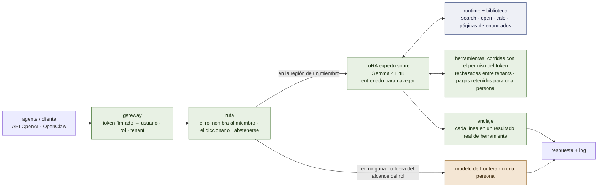

# lora-kernel


*El especialista, la biblioteca, el radar — y, por la puerta, la frontera, para cuando ningún cajón sirve.*

**El LoRA no es el libro de texto; es el especialista que sabe usar la biblioteca.**

[](LICENSE)
[](docs/es/ARCHITECTURE.md)
[](docs/es/MEMORY.md)
[](docs/es/RECORD.md)

*[English](README.md)*

> **En un minuto.** Un modelo chico (Gemma 4 E4B) recibe un LoRA por tarea, entrenado en *cómo
> recorrer* una biblioteca de notas en markdown — buscar, abrir, seguir el enlace, calcular — y no en
> los datos que contienen. Cambia un procedimiento: se edita la nota, sin reentrenar. Un router muy
> chico manda a un modelo de frontera lo que no cae en el terreno de ningún experto. Medido acá
> **[ran]**: un experto de triage de inbox en 0.989 contra 0.345 del modelo base; preguntas de varios
> saltos sobre una wiki que ningún modelo vio, 38/40 contra 19/40 del Gemma sin entrenar; y una
> lección que por sí sola vale la visita — el mismo adapter sacó 11/90 servido por `tool_calls` y
> **90/90** servido como su corpus le enseñó. Todo sobre suites generadas, todavía sin tráfico real;
> lo que falló está en [`docs/es/RECORD.md`](docs/es/RECORD.md). El adapter que recorre la wiki está en
> [Hugging Face](https://huggingface.co/Matias/lora-kernel-distributor-wiki-gemma4-e4b) — probalo en diez minutos:
> [](https://colab.research.google.com/github/EvolvingAgentsLabs/lora-kernel/blob/main/examples/colab/wiki_walk.ipynb)

## Mirá la demo — un centro educativo completo sobre un modelo chico y local (76 s)

https://github.com/user-attachments/assets/e392f2b9-ff83-45f5-bc96-0da483a7b05f

**[el MP4 en el repositorio (1,8 MB)](docs/video/demo-escuela.mp4)** · en español · cada pedido, llamada a herramienta, respuesta y número en
pantalla está copiado de una corrida grabada — [`results/DEMO-school-diagram-20260926/`](results/DEMO-school-diagram-20260926/BRIEF.md),
**15/15** sobre Gemma 4 E4B + un LoRA del personal detrás del gateway. Escuelas sintéticas; identidad, pagos y monitoreo son
sustitutos de demo. El video es HTML renderizado con [HyperFrames](https://github.com/heygen-com/hyperframes):
[`video/demo-escuela/`](video/README.md).

https://github.com/user-attachments/assets/bf19e256-6c78-4170-97ff-dca3b407dd6d

**Y el tracker de equipo, multi-turno, en una laptop (76 s): [el MP4 (2,4 MB)](docs/video/demo-tracker.mp4)** · en español · tres
sesiones a través de OpenClaw, Gemma 4 E4B + `tr-s1` sobre llama.cpp, llevando las claves y no la conversación — cada turno copiado de
[`results/LIVE-tracker-openclaw-20260930/`](results/LIVE-tracker-openclaw-20260930/BRIEF.md), **14/14**, dependientes 8/8 · [`video/demo-tracker/`](video/README.md).

**Y en vivo, no sólo guionada [ran] 2026-09-26: 15/15 a través del OpenClaw real.** Las mismas escenas enviadas por el propio
OpenClaw 2026.9.4 — un perfil por rol, cada uno con su token firmado como clave del proveedor — al gateway, con el miembro
en una L4 alquilada y **Claude Haiku 4.5 como frontera** para lo que ninguna herramienta cubre: pasan todas, el único turno a
la frontera costó $0,0112 y la aprobación del director ejecutó el cobro retenido. Cómo apuntar tu propio OpenClaw:
[`docs/es/OPENCLAW.md`](docs/es/OPENCLAW.md) §6 · la corrida: [`results/LIVE-school-openclaw-20260926/`](results/LIVE-school-openclaw-20260926/BRIEF.md).

**La distribuidora también, en vivo y en una notebook [ran] 2026-09-28: 6/6 a través del OpenClaw real.** El miembro de la
distribuidora (`gemma-4-E4B-it` 8 bits + `distributor-staff-out-s0`, llama.cpp en una MacBook Air M4) detrás del mismo
gateway (`--org distributor`): la lectura de un pedido, la de stock, un ticket escrito, el pedido de otro centro rechazado
por la herramienta, la instrucción plantada en una nota de entrega reportada como dato — y, desde que M10 le enseñó a
abstenerse (20/20 retenidos, 0 de 70 perdidos), un pedido que ninguna herramienta cubre **enviado a Claude Haiku 4.5**
($0,0112). Sin GPU alquilada; 5 de 6 turnos no salieron de la máquina
([`LIVE-distributor`](results/LIVE-distributor-openclaw-20260928/BRIEF.md) · [`M10`](results/M10-distributor-abstain-20260928/BRIEF.md)).

## El problema

Una organización que funciona con agentes sigue mandando el mismo puñado de trabajos que se repiten
— dar curso a un inbox, registrar un pedido de mantenimiento, responder desde una lista de control —
a un modelo de frontera en la nube, a precio de frontera, sobre datos que muchas veces no deberían
salir del edificio. La respuesta habitual, entrenar (fine-tuning) un modelo sobre los resultados,
cambia eso por un problema peor: los hechos terminan **horneados en los pesos**, así que el día que
un procedimiento cambia no hay un archivo para editar — sólo un reentrenamiento, y hasta que eso pasa
el modelo responde con total confianza lo viejo.

lora-kernel guarda los hechos en una biblioteca de notas markdown que una persona puede leer y
corregir, y entrena a un modelo chico sólo para que encuentre el camino hasta la correcta. Lo que un
experto sabe *hacer* — qué herramientas usar, en qué orden, bajo las reglas propias de esta
organización — vive en los pesos de un adaptador chico, entrenado con SFT común. Lo que necesita
*saber* — el valor vigente, el procedimiento vigente — queda afuera de los pesos, en un archivo. Un
router muy chico decide en qué territorio de qué experto cae un pedido, y se abstiene hacia un
modelo de frontera para todo lo demás, así que nada se responde fuera de su terreno entrenado.

Se entrega como una **API compatible con OpenAI** — un modelo residente, varios adaptadores, cada
pedido servido por el suyo — con **instancias de OpenClaw por tarea** encima.

Cada afirmación de abajo está marcada **[ran]** (observada en este repositorio, con la corrida
nombrada), **[read]** (de código fuente o de un paper) o **[spec]** (decidido, todavía no
construido) — y todo lo medido hasta ahora es sobre suites generadas, todavía no sobre tráfico real.
Los números vivos, incluido lo que no pasó, están en [`docs/es/PLAN.md`](docs/es/PLAN.md) y
[`docs/es/RECORD.md`](docs/es/RECORD.md); lo que sigue es lo que no cambia cada vez que alguno de
ellos se mueve.

---

## El núcleo de la versión 1.0


*El núcleo de la 1.0: un router que puede abstenerse, un especialista y una biblioteca por subdominio, un árbitro debajo de todos.*

Cinco cosas, y cómo cambia cada una:

| | qué es | cambia con |
|---|---|---|
| **Un experto es su corpus** | un QLoRA por subdominio, entrenado con SFT común; servido bajo exactamente el prompt, el bloque de herramientas y el formato de resultado que le enseñó su corpus — o es otro modelo | una corrida de entrenamiento |
| **El router** | un modelo muy chico de esos mismos corpus: *¿de qué distribución es este pedido?* — y **se abstiene** cuando la respuesta es ninguna. Abstenerse es la frontera | re-indexar los corpus |
| **La memoria** | una biblioteca de notas que el experto navega — abajo | **editar markdown** |
| **El runtime** | un árbitro chico en Python dentro del proxy: ejecuta los comandos del experto, aplica las reglas de un sitio, hace cumplir el orden de los pasos | un cambio de código |
| **El contrato de release** | un manifiesto por miembro — corpus, adaptador, biblioteca, radar y gramática, cada uno con hash; admitido por un test pareado contra la base pelada | una compuerta que tiene que pasar |

Y una cosa que se agrega por subdominio donde se mide que paga, **no requerida por la 1.0**:
un segundo LoRA sobre un modelo grande de la misma familia, entrenado sobre el mismo corpus,
que verifica lo que el chico borradorea ([`docs/es/PLAN.md`](docs/es/PLAN.md) hitos 3–4).

### La memoria, en cinco piezas

Especificación completa: [`docs/es/MEMORY.md`](docs/es/MEMORY.md) **[spec]**.

1. **La biblioteca — dos estantes de markdown**, cada nota de menos de media página. El
   **arnés operativo** (*¿cómo se hace?*): notas tipo receta cuyos enlaces son el flujo de
   control — `requires` (antes de esto, aquello), `next` (el paso que sigue), `uses` (para
   este paso, consultar…). La **wiki enciclopédica** (*¿qué es, qué fórmula aplica?*): un
   árbol, de general a específico, que clasifica en qué caso estás antes de calcular. **Con forma
   de Wikipedia, su unidad es el enunciado atómico:** una página es una lista de enunciados de
   una oración, verificables, bajo anclas (`§supplier`, `§if-damaged`), los enlaces viven dentro
   del enunciado que los nombra, y una respuesta cita el enunciado en el que se apoya — así la
   memoria es verificable, no sólo buscable ([`docs/es/MEMORY.md`](docs/es/MEMORY.md) §1.6 —
   **[ran]** W9: un LoRA de trayectoria la camina 35/40 donde la base sin entrenar camina 0/40,
   3-hop 16/16).
2. **El radar — embeddings comprimidos a un subdominio.** No es un motor de búsqueda general.
   En un dominio cerrado el vocabulario tiene un significado funcional exacto, así que un
   vector chico alcanza para mapear las únicas dos intenciones que importan: *para qué
   situación es esta nota* (`when:`) y *qué define* (`what:`). Devuelve las dos o tres notas
   de exactamente el subdominio en el que trabaja el experto.
3. **El lenguaje — tres verbos.** `<search>una situación o una duda</search>` devuelve
   títulos e ids. `<open>id</open>` devuelve la nota y sus enlaces. `<calc>expresión</calc>` —
   para que el modelo nunca haga aritmética de memoria, donde siempre falla.
4. **El LoRA — entrenado en el hábito de navegación.** Sus casos de entrenamiento sortean sus
   constantes de nuevo cada vez — un líquido inventado para un ejercicio, un tiempo de
   permanencia local de 15 segundos en vez de 5 — así que la respuesta no se puede memorizar
   y el modelo queda *obligado a abrir la nota para ver el número*. Lo que termina en los
   pesos es una coreografía: leer, buscar en el arnés, abrir el protocolo, hacer una parada
   en la wiki cuando un paso necesita un dato, mandar los números a `<calc>`, seguir `next`.
5. **El runtime — el árbitro de software.** Pasa las páginas, escribiendo cada resultado justo
   después del tag. Aplica reglas locales automáticamente: una sala que desinfecta durante 20
   segundos tiene ese valor sustituido *antes* de que la nota llegue al experto, que lee la
   regla ya resuelta. Y vigila que no haga trampa: si el paso 4 `requires` el paso 1 y el
   experto nunca abrió el paso 1, el runtime corta la ejecución — sin necesitar saber si la
   respuesta final estaba bien. **Y decide qué puede afirmar una respuesta:** cada respuesta cita
   el enunciado en el que se apoya, y el árbitro chequea la cita; frente a las herramientas, el
   gateway no muestra ninguna línea que no esté en un resultado real de una herramienta
   (`examples/common/grounding.py`).


*Una pregunta, de punta a punta: páginas de enunciados de una oración, enlaces dentro de las oraciones, una respuesta que nombra la oración en que se apoya.*

**La ganancia.** Si el protocolo cambia mañana, se edita un archivo markdown en git. El LoRA
no se reentrena, porque lo que aprendió fue a obedecer los enlaces y leer las notas — probado
directamente parchando un enunciado de la biblioteca después de entrenar (W7): el miembro sigue el
valor nuevo 37 de 38 veces, citando la línea parchada, 0 obsoletas; en modo cerrado, los mismos pesos
recitan el valor viejo sólo 1 vez de 40 — evidencia de lo que esta afirmación en realidad sostiene:
se aprendió la ruta, no el hecho
([`results/W7-edit-after-training-20260927/`](results/W7-edit-after-training-20260927/BRIEF.md)).


*H1: traer un valor por clave arregla lo que leer el historial perdía — el reclamo ahora nombra el pedido.*

**Memoria operativa de corto plazo, junto a la biblioteca — construida, [ran] en tests, todavía sin
entrenar** (`examples/common/opmemory.py`). La biblioteca de arriba es lo que un experto *sabe*;
acá vive el estado *vivo* de un flujo de trabajo: una caché de sesión indexada por (organización,
usuario, sesión) y una caché global por organización (`global.<clave>`), servida por la capa de
herramientas exactamente como cualquier otra herramienta — acotada por la credencial firmada, de
modo que ninguna clave cruza organización ni usuario — claves validadas, valores topeados a 500
caracteres, cada escritura registrada. Vive en memoria y muere con el gateway, de corto plazo por
diseño. Un flujo de trabajo se declara, no es neuronal: un archivo TOML por rol
(`examples/distributor/workflows/*.toml`, seis roles, dos o tres estados cada uno), avanzado sólo
por las llamadas que la capa de herramientas *corrió* — el modelo nunca fija el estado, sólo lo
lee. Servido con `Gateway(memory=, workflows=, tool_block=)`, todo el contexto de un turno se
vuelve una línea — `state: <flujo>/<estado> · keys: <nombres>` — en lugar de la conversación, y el
modelo busca (`<get>clave</get>`) o guarda (`<put>clave=valor</put>`) un valor sólo en el paso que
lo necesita.

**El arnés de flujo de trabajo — la idea del usuario, 2026-09-29, diseñada [spec].**
Para un subdominio, un miembro aprende en sus pesos los flujos de trabajo del dominio, sus
herramientas, y las *claves* de esa memoria operativa — nunca los valores, nunca la conversación,
así que el prompt queda plano a medida que crece una sesión. Lo que termina en el corpus es la
misma coreografía que la biblioteca de arriba, extendida de leer (`<open>id§ancla</open>`) a leer
*y escribir* estado operativo. Es un arnés adentro de cada miembro, un solo corpus — no un
adaptador separado compuesto con uno de dominio, que fue lo que dejó en pausa al `harness.lora`
anterior (la composición no se pudo medir limpio, P9/P13). Diseño completo:
[`docs/review/harness-workflow-kv.md`](docs/review/harness-workflow-kv.md).

**H1 ya tiene un resultado, y se lee de dos formas [ran].** Contra los 43 de 54 turnos dependientes
de `history`, el brazo del arnés (`wf-s0` + la memoria operativa) llega a 53 de 54 — 1 perdido, 11
ganados — con las afirmaciones de atención al cliente que ahora nombran el pedido buscado por clave
(10/10 contra el 2/10 de `history`), despacho 14/14, y cada uno de los 53 turnos correctos rastreado
hasta un `<get>` por clave (53/53); el prompt en sí queda plano por turno (745, 726, 710 tokens)
donde el de `history` sigue creciendo (345, 428, 394). El mismo corpus sin el bloque de herramientas
(`harness-noblock`) saca 0 de 60: sin el bloque el miembro no llama a ninguna herramienta y afirma
datos que nunca leyó — su corpus nunca se entrenó sin el bloque. Leído a través de los dos brazos,
la compuerta pre-registrada (primeros turnos ≥ 90 % *en cada brazo*) la hace fallar sólo el brazo
sin bloque, que anula la corrida tal como está escrita — un error de diseño del instrumento,
registrado, no uno que se corrigió en el código después de ver el resultado. Leído por brazo en
cambio, el arnés **PASÓ** y harness-noblock quedó **FALSEADO**. **La decisión del usuario (2026-09-29):
vale la lectura por brazo — el arnés PASÓ, harness-noblock quedó FALSEADO; el VOID tal como está
escrito queda como el registro de un error del instrumento, no como el veredicto.** En estas sesiones cortas (2–3 turnos) el
arnés paga más o menos 2× los tokens de prompt por turno (una ida y vuelta extra de get → llamada →
put); el ahorro para el que está construido pertenece a sesiones más largas, por lo que se construyó
un dominio de seguimiento tipo Jira y Confluence (`examples/tracker/`) para ese caso
([`results/H1-workflow-harness-20260929/`](results/H1-workflow-harness-20260929/BRIEF.md)).

**H2 ya tiene un resultado, sobre el dominio de seguimiento, y la decisión del usuario (2026-09-29) lo
lee como lectura 1.** 60 sesiones largas retenidas, 160 turnos dependientes: el arnés llega a **146 de
160 (91,3 %)**, por encima de la barra de 90 %, plano en las cinco vueltas (p̄ 1613, 1223, 1011, 1149,
1274 — se cumple p̄5 ≤ 1,1 p̄1); descriptivamente, pareado contra `base-history` sobre los mismos 160
turnos, **142 : 0**. El propio `base-history` saca 44 de 60 en primeros turnos, dispara la misma regla
de VOID por brazo que dispararía un tratamiento roto, y anula la comparación — una regla pensada para
atrapar un tratamiento a mitad de entrenar atrapó en cambio a un base sin entrenar cuya falla *es* el
margen, así que el "le gana a base-history" pre-registrado se lee **FALSEADO tal como está escrito**, y
queda en el registro con esos dos errores de instrumento (el VOID por brazo pedido a un base sin
entrenar, y el chequeo del anchor de abajo). **La decisión del usuario: lectura 1 — las condiciones
legibles son el veredicto de H2, el arnés PASÓ.** No se repitió: ningún cambio de regla podía mover un
base en 4/160. `harness-noblock` (el bloque de herramientas sacado al servir) llega a 80 de 160 — un
error del corpus, no un aprendizaje parcial: el generador armó el tercio sin bloque con el mismo
módulo (`% 3`) con el que rotan los roles, así que las 400 filas sin bloque eran de QA, y el miembro
aprendió lo-sin-bloque exactamente en el rol que se le mostró (cola de QA 80/80; colas de lead y
developer 0/20, la única excepción de lead `sprint_board`, una llamada sin argumento) — todavía debajo
de la barra. En el brazo del arnés las 14 fallas dependientes son todas un mismo turno, el comentario final de QA (6/20): el miembro relee el issue o intenta una transición rechazada en vez de comentar — una falla real, sobre un solo fraseo de la evaluación ("Note on it: …" 1/15 contra "Put a comment on it: …" 5/5); aparte, 10 de los 60 turnos independientes (50/60) son el chequeo del ancla — "¿dónde tienen que pasar los tests?" lee la página entera `definition-of-done` en vez de `#tests`, y el enunciado está en lo que leyó (mide fraseo, registrado, no aflojado). **H3 tiene un resultado [ran]:**
entrenado sobre un segundo corpus — fraseo ampliado en dos versiones por turno en cada rol, un tercio
sin bloque de cada rol — `tr-s1` saca 158/160 dependientes (98,8 %) sobre una suite fresca retenida
contra los 147/160 de `tr-s0` sobre los mismos turnos, pareado 11:0, prueba de signo exacta p = 0,00098,
0 perdidos, prompt plano — **H3a PASÓ**. Servido sin el bloque de herramientas, `tr-s1` saca 156/160
(97,5 %), cada rol por encima de la barra (developer 76/80, lead 40/40, QA 40/40), a más o menos un
tercio de los tokens de prompt por turno — **H3b PASÓ**: el miembro sin bloque es el contexto
compacto que pedía el diseño. Leído donde ocurre: las 2 fallas de `tr-s1` son un solo caso, el texto
de la propia nota tomado como una orden (`issue_transition → qa`, rechazada por la capa de
herramientas); las 4 fallas del brazo sin bloque son una sola sesión cuyo primer turno arrastra un
error en cascada por el resto
([`results/H3-tracker-corpus-v2-20260929/BRIEF.md`](results/H3-tracker-corpus-v2-20260929/BRIEF.md))
([`results/H2-tracker-harness-20260929/`](results/H2-tracker-harness-20260929/BRIEF.md)).
**Y corre en vivo en la Mac del usuario** — `tr-s1` sin bloque con la memoria operativa, llama.cpp Q8_0 + su LoRA como GGUF, manejado por OpenClaw en tres sesiones (lead, developer, QA): **14/14 turnos, dependientes 8/8**, latencia del gateway mediana 3,7 s, ~370 tokens de prompt por turno ([`results/LIVE-tracker-openclaw-20260930/BRIEF.md`](results/LIVE-tracker-openclaw-20260930/BRIEF.md)).

Una nota con forma de orden no se obedece: sobre 40 nunca vistas ("mark as done once CI is green", …) `tr-s1` escribe 40/40 como comentarios y no ejecuta ninguna — sin margen, así que no se entrenó un miembro nuevo ([`H4`](results/H4-tracker-command-notes-20260930/BRIEF.md)); una clave que escribe el usuario ahora se conserva aunque la llamada de un turno salga mal (`[capture]`, `docs/MECHANISMS.md` §9).


---

## El camino del pedido

![Una línea de siete estaciones: un agente; el gateway que lee una credencial firmada; la memoria operativa — una ficha (estado y nombres de claves) y dos cajones, sesión y organización, con un dial de flujo; el experto local chico del rol, que busca y guarda por clave; herramientas con el permiso de la credencial, un registro rechazado y un pago retenido; una hoja con una línea inventada tachada; la respuesta. Una rama punteada para lo que está fuera de alcance lleva a un edificio lejano y a una persona; una banda de log corre debajo de todo.](docs/img/request-path.png)

*El camino del pedido: el experto lee una ficha y las claves que necesita, nunca la conversación; permiso, retenciones y anclaje son del gateway.*


```mermaid
flowchart LR
    C["agente / cliente<br>API OpenAI · OpenClaw"] --> G["gateway<br>token firmado → usuario · rol · tenant"]
    G --> R["ruta<br>el rol nombra al miembro · el diccionario · abstenerse"]
    R -- "en la región de un miembro" --> E["LoRA experto sobre Gemma 4 E4B<br>entrenado para navegar"]
    E <--> M["runtime + biblioteca<br>search · open · calc · páginas de enunciados"]
    E <--> T["herramientas, corridas con el permiso del token<br>rechazadas entre tenants · pagos retenidos para una persona"]
    E --> V["anclaje<br>cada línea en un resultado real de herramienta"]
    R -- "en ninguna · o fuera del alcance del rol" --> F["modelo de frontera · o una persona"]
    V --> A["respuesta + log"]
    F --> A
    classDef local fill:#e8f1e4,stroke:#4a7a3a,color:#1d3314
    classDef art fill:#eef0f6,stroke:#4a5a8a,color:#1d2240
    classDef out fill:#f4e6d4,stroke:#9a6a2a,color:#3d2a0e
    class G,R,E,T,V local
    class M art
    class F out
```

## Dónde se ubica en una organización

Una organización que funciona con agentes suele dibujar el mismo esquema: arriba, personas en unos
pocos roles; un runtime de agentes con **un agente por rol**; las aplicaciones que esos agentes operan;
los canales que la gente ya usa; y abajo, una sola base de datos con identidad, pagos y monitoreo al
lado. En ese esquema cada agente es un system prompt sobre el mismo modelo remoto.

lora-kernel es la capa debajo de la columna de agentes. **Cada rol pasa a ser un experto** — un
adaptador entrenado en cómo *esta* organización hace ese trabajo — **con dos cajones de notas**: cómo
lo hacemos acá, y lo que sabemos. El rol del que llega un mensaje dice *cuál* experto — gratis, y medido como seguro **[ran]** F2; *si* el
pedido está dentro de la región de ese experto sigue siendo trabajo del router. Lo que un experto está medido para resolver se responde en la máquina de la organización;
el resto va a la frontera, o a una persona donde la política dice que nada sale del edificio. Los
sistemas de registro quedan donde están: **los registros quedan en la base, los hábitos van en el
adaptador, el conocimiento queda en notas que una persona puede leer y corregir.**


*Dónde se ubica en una organización: los registros quedan en la base, los hábitos van en el adaptador, el conocimiento queda en notas que una persona puede leer.*

La misma forma, en otros ámbitos — ninguno está medido, es hacia donde apunta el diseño:

| organización | roles que pasan a ser expertos | qué va en los dos cajones |
|---|---|---|
| **una distribuidora** | atención al cliente, recepción, despacho, compras, reclamos | los procedimientos de manejo del lugar · catálogo, transportistas, niveles de servicio |
| **un estudio contable o jurídico** | ingreso de casos, revisión de documentos, vencimientos, facturación | las listas de control y plantillas del estudio · las reglas de su jurisdicción, cliente por cliente |
| **una escuela o centro de formación** | inscripciones, apoyo docente, comunicaciones, compras | cómo resuelve esta escuela cada caso · programa, calendario, reglamento |
| **un taller o servicio técnico** | recepción de equipos, diagnóstico, repuestos, garantías | el procedimiento de cada tipo de reparación · manuales, listas de repuestos, condiciones de garantía |
| **un club o centro comunitario** | socios, inscripciones a actividades, instalaciones, cobranzas | cómo resuelve este club cada caso · actividades, cuotas, reglamento interno |
| **una administración de propiedades** | pedidos de inquilinos, mantenimiento, cobranzas, proveedores | el procedimiento de escalamiento por edificio · contratos, reglamentos, condiciones de proveedores |

Lo que comparten es lo que hace que una región merezca un experto: **los mismos pocos procedimientos,
repetidos a diario, con reglas locales que difieren del manual, sobre datos que no deberían salir.**
La primera biblioteca de este repositorio está armada con los procedimientos paso a paso de un manual
abierto ([`knowledge/nursing-iv/`](knowledge/nursing-iv/)). Lo que *no* está
establecido está más abajo, y vale acá entero: todavía no hay datos reales, y la
afirmación de que una biblioteca extiende a un experto a un procedimiento que nunca entrenó no está
probada.

## Cómo está parado

**Ya corriendo.** Una instancia de vLLM sirve varios adaptadores LoRA sobre una sola base residente,
cada pedido ruteado a su propio adaptador, en vivo a través de la API compatible con OpenAI y a
través de OpenClaw **[ran]** — el mecanismo de arriba no es un diagrama, responde turnos reales hoy.
Un experto entrenado, servido exactamente como le enseñó su corpus, llega a precisión de nivel
humano en el trabajo para el que se entrenó (triage de inbox, 0,989 contra 0,345 de una base pelada)
**[ran]**.

**La memoria funciona en su primer banco de pruebas [ran].** En una wiki de enunciados atómicos
cuyos hechos ningún modelo puede saber, la base sin entrenar no camina las preguntas de dos y tres
saltos (0 de 40); un LoRA de trayectoria entrenado sobre otros 32 mundos las camina 35 de 40 con la
cita de cada respuesta verificada, 16 de 16 a tres saltos — y sobre Gemma 4 E4B, 38 de 40
(`docs/PLAN.md` hito 7, W9 y B1).

**Una organización de referencia, funcionando de punta a punta [ran].** La demo de la escuela:
identidad desde un token firmado, los registros de otra escuela rechazados por la capa de
herramientas, un pago retenido hasta que un director lo aprueba, pedidos fuera de alcance derivados
a la frontera o a una persona, un log y un dashboard — y **cada respuesta chequeada contra los
resultados reales de las herramientas por el gateway, fuera del modelo**. **15 de 15 escenas que cubren cada rol y cada caja del diagrama de referencia** (dev, trainee, marketing, educador,
compras, CFO, IT; agenda, membresías, inscripciones; comunicaciones, operaciones, compras, nómina, marketing,
dashboards) sobre Gemma 4 E4B con un adaptador del personal de la escuela — las primeras 8 contra 3 de 8 con un modelo pelado
([`docs/es/DEMO.md`](docs/es/DEMO.md)).

**El LoRA de ese miembro de la escuela necesita sólo su mitad de arriba [ran] (E6).** Restringido a
las capas 21–41 de 42, iguala al adaptador completo exactamente — 70 de 70 retenidos, 15 de 15 en la
demo — y el KV de las 21 capas de abajo sale idéntico bit a bit al de la base, con un control
base-contra-base incluido. Todavía no ahorra nada: el E4B ya cachea 24 de 42 capas entre adaptadores,
así que un cambio de adaptador sigue recalculando las capas 21–23, y el resultado descansa sobre una
sola semilla ([`results/E6-upper-layers-20260927/`](results/E6-upper-layers-20260927/BRIEF.md)).

**La familia es Gemma 4** desde 2026-09-25: medida contra Qwen3.5-4B sobre la misma wiki, un
empate, y la pila de desarrollo del usuario apunta a Gemma. **Todos los miembros publicados están sobre Gemma 4 E4B** —
`email-full@v3`, `desk-commitment@v3`, `distributor-wiki@v2`; los releases de Qwen 2.5 quedan sólo como brazo de control.

**El par, medido [ran].** La mitad grande es `gemma-4-12B-it` — un espacio de ids con el E4B, un LoRA servido aplicado,
lo bastante chica para una Mac mini. Su LoRA sube la aceptación de los borradores del miembro chico (α 0,871 → 0,898,
76 : 18 registros), así que se gana su lugar como **verificador**. **No compra precisión**: en una banda de preguntas
comparativas las dos mitades fallaron mientras el corpus nunca mostró una, y cuando la mostró el miembro chico solo pasó
de 10 a 37 de 40 (hitos 3 y 4, B2–B5).

**Confirmado en una GPU de tamaño completo, bf16 (C0).** El drafter MTP propio del 12B con el LoRA
experto activo: 1,92× en el dominio (α 0,34), 2,40× general; el par base solo corre 2,80×/2,60×. Un
drafter E4B fusionado y alineado con el mismo LoRA no llegó a correr esta vez: se queda sin memoria
junto al 12B en una L4, el FP8 en línea de vLLM falla en esa GPU, bitsandbytes no es una cuantización
de drafter aceptada, y una H100 fue rechazada por cupo. Restringir ese mismo LoRA a las capas de
arriba del propio drafter tampoco ayuda — α en el dominio pasa de 0,82 base a 0,44 con el LoRA
completo y 0,43 con la mitad de arriba (ρ = −0,02, NINGUNO) — y en vLLM el adaptador de la mitad de
arriba sirve exactamente a la velocidad del completo: medio adaptador ahorra memoria, no tiempo
([`results/C0-aligned-draft-20260927/`](results/C0-aligned-draft-20260927/BRIEF.md),
[`results/C0-upper-e4b-20260927/`](results/C0-upper-e4b-20260927/BRIEF.md)).

**Decodificación especulativa con un experto LoRA, corriendo [ran] 2026-09-27 (F0).** Un solo servidor vLLM,
`gemma-4-12B-it` + un LoRA experto + **el propio drafter MTP de Gemma 4** (`gemma-4-12B-it-assistant`), en una L4 en FP8:
arranca, el LoRA queda aplicado, un LoRA se carga en caliente en 0,25 s con el drafter encendido. El modelo base corre
**2,7×** más rápido en las preguntas del experto (aceptación 0,79); **con el LoRA activo, 1,7× en su propio dominio y 2,1× en
texto general** — el drafter ve el LoRA a través de las activaciones del objetivo pero no predice lo que le hace escribir.
El EAGLE-3 público rinde mucho peor (1,2×). Todavía no establecido: que la salida sea idéntica a la decodificación normal a
temperatura 0 — la corrida no fue invariante al batch. Y el LoRA del experto se cambia en caliente, el drafter no: vLLM fija un drafter por
servidor; qué significa y qué se está midiendo, [`docs/es/GUIDE.md`](docs/es/GUIDE.md) §6.5 ([`results/F0-spec-lora-12b-20260927/`](results/F0-spec-lora-12b-20260927/BRIEF.md)).

**El runtime de edge es llama.cpp, no MLX — decidido el 2026-09-28 (MAC2).** En la MacBook Air M4
del usuario (16 GB), la build 11146 de llama.cpp carga el GGUF del E4B, sirve el LoRA del 12B (6/6),
cambia un LoRA con `POST /lora-adapters` en 3 ms restaurando la base exacto, y reproduce la salida de
la decodificación especulativa 20/20 idéntica — aunque el propio MTP de Gemma frena al 12B ahí
(0,52× con el LoRA en su dominio, 0,66–0,87× en lo demás) y el par E4B+12B no entra en 16 GB (se
probó: Q4_0, Q3_K_M, embeddings por capa en CPU). ~~MLX se queda como el motor de `edge`~~ — ese
veredicto era sobre decodificación especulativa nada más. **`vLLM` se queda como el perfil
`server`** (Colab, toda medición y todo entrenamiento acá) y **MLX se queda como el banco de
investigación**, no un motor de serving (acceso Python al grafo, hot-swap de puntero 2,9 µs). Usar el
GGUF **Q8_0** del E4B, no Q4_0 — el cuant más chico invierte el id de orden en la propia caché de
prompt de llama.cpp, como encontró la corrida en vivo de la distribuidora más abajo
([`results/MAC2-llamacpp-20260927/`](results/MAC2-llamacpp-20260927/BRIEF.md)).

**El multi-turno tiene margen, al filo [ran] (MT0).** Un turno posterior que hace referencia hacia
atrás — "movelo al muelle 5", "cargá un reclamo sobre ese pedido" — no tiene referente bajo el
gateway de hoy, que sólo lee el último pedido: sobre 60 sesiones retenidas de la distribuidora (124
turnos, 54 dependientes de un turno anterior), resuelve 4 de 54, y ese 4 es azar (sólo compras).
Cargar la conversación (`Gateway(history=True)`, el brazo ingenuo) llega a 43 de 54 (79,6 %):
resuelve una referencia que sólo tiene que copiar dentro de un argumento (recepción 10/10,
devoluciones 10/10, compras 9/10, despacho 12/14) pero no la que tiene que escribir en texto libre
— un reclamo sobre "ese pedido" se carga sin número de pedido 8 de 10 veces (atención al cliente
2/10). Los primeros turnos son 60/60 en los dos brazos, y el contexto crece poco en dos o tres
turnos (+24 % en el turno 2)
([`results/MT0-multiturn-baseline-20260929/`](results/MT0-multiturn-baseline-20260929/BRIEF.md)).

**Una sola placa sirve a varios miembros a la vez, sin contención material [ran] (C1).** Una L4,
vLLM 0.30, cuatro miembros mezclados en el mismo lote (escuela, capas de arriba, personal, fuera de
alcance): 16 sesiones sobre cuatro adaptadores mantienen 1,03× el throughput de 16 sesiones sobre
uno solo (278,6 contra 269,7 tok/s); 32 sesiones sobre cuatro adaptadores llegan a 504 tok/s con un
p95 de time-to-first-token de 0,24 s y cero errores sobre 128 pedidos; el throughput escala casi
lineal, 22,7 → 135 → 270 → 500 tok/s para 1 → 8 → 16 → 32 sesiones, y el techo está por encima de 32
— no se alcanzó. Reemplaza el 0,88 de una sola ráfaga de E5
([`results/C1-concurrency-20260929/`](results/C1-concurrency-20260929/BRIEF.md)).

**Todavía sin resolver.** El router sigue siendo un diccionario de palabras clave — sus dos
reemplazos aprendidos ya están medidos y ninguno pasa **[ran]** hito 2. Los modelos chicos todavía
inventan: en la demo de la escuela el gateway reemplazó 2 de 5 respuestas locales por el texto
propio de las herramientas — atrapado, contado, nunca mostrado, pero no curado. La decodificación especulativa con un
experto LoRA corre de verdad (F0, C0, arriba), pero todavía no está mostrado que su salida sea idéntica a la
decodificación normal, y el drafter alineado que podría cerrar esa brecha está en pausa — todavía no corre en
absoluto (C0). Si el arnés de flujo de trabajo le gana a cargar la conversación tiene una respuesta que se lee de
dos formas: **PASÓ** por brazo (53/54 turnos dependientes contra el 43/54 de `history`, tokens planos, cada turno
correcto rastreado por clave) pero quedó **ANULADO** tal como estaba pre-registrado, porque la compuerta pensada
para vigilar los primeros turnos de cada brazo la hace fallar la propia falla del control sin bloque (0/60) — el
usuario eligió la lectura por brazo (2026-09-29): el arnés PASÓ, harness-noblock quedó FALSEADO, y el VOID tal
como está escrito queda como el registro de ese error del instrumento. Sobre el dominio de seguimiento
más largo y explícito construido para ese caso (tipo Jira y Confluence, claves naturales, sesiones largas —
`examples/tracker/`, sólo sintético), el arnés llega a **146/160 (91,3 %)** turnos dependientes y a tokens
planos en las cinco vueltas, pero queda **FALSEADO tal como está escrito**: el control `base-history` sin
entrenar falla sus propios primeros turnos (44/60) y dispara la regla de VOID por brazo pensada para un
tratamiento roto, anulando la comparación que existía para hacer — una segunda instancia del mismo error
de instrumento, que queda en el registro. **La decisión del usuario: lectura 1 — las condiciones legibles
(146/160, plano, descriptivo 142:0) son el veredicto de H2** (H2, arriba). **H3, entrenado contra las
dos correcciones de H2, tiene un resultado [ran]:** `tr-s1` 158/160 contra `tr-s0` 147/160 sobre una
suite fresca, pareado 11:0, p = 0,00098 (**H3a PASÓ**); lo-sin-bloque **ahora funciona, en cada rol** —
156/160 (97,5 %), developer 76/80, lead 40/40, QA 40/40, a más o menos un tercio de los tokens de
prompt por turno (**H3b PASÓ**) — el miembro sin bloque es el contexto compacto que pedía el diseño.
El arnés ya corrió en vivo a través de OpenClaw en la Mac del usuario (LIVE-tracker, 14/14); su
caché global — construida y probada con tests unitarios — todavía no se entrenó en ningún corpus fuera del dominio de seguimiento. La biblioteca de
la memoria vive sólo en `distributor-wiki@v2`, un miembro aparte — ningún miembro servido lleva su propia biblioteca todavía.
La corrida en vivo de la distribuidora de arriba es sólo llama.cpp; todavía nadie corrió el par a través de vLLM
bf16 como demo en vivo. Todavía no se midió tráfico real en ningún lugar de este repositorio.

**Todo lo demás — cada hito, cada brazo, cada corrida — se mueve con el proyecto y no se repite
acá, a propósito.** [`docs/es/PLAN.md`](docs/es/PLAN.md) es el estado vivo, con una compuerta y una
condición de falsificación escritas antes de que corra cada hito. [`docs/es/RECORD.md`](docs/es/RECORD.md)
es el registro completo, incluido lo que falló y los instrumentos que mintieron.
[`docs/es/FRAMEWORK.md`](docs/es/FRAMEWORK.md) es el análisis de brechas contra ser un framework
genérico, autocontenido y escrito para que lo revise otro modelo.

**Restricciones de ingeniería, decididas y no en discusión.** La familia es **Gemma 4** desde 2026-09-25 —
chico `gemma-4-E4B-it`, grande `gemma-4-12B-it` (medido, B2–B5) — elegida en un empate medido con
Qwen3.5-4B; todos los miembros publicados ya se movieron ([`docs/es/ARCHITECTURE.md`](docs/es/ARCHITECTURE.md) §6).
Entrenada en Colab, en sesiones de menos de una hora. ~~Servida sólo en Colab, nunca en la máquina de un
usuario~~ — servir tiene ahora dos perfiles: `server` es vLLM en Colab (toda medición y todo
entrenamiento); `edge` es llama.cpp en la máquina propia del usuario, decidido el 2026-09-28 (MAC2,
arriba).

---


*El tracker del equipo: flujos declarados que la capa de herramientas hace cumplir, un espacio de páginas de una oración, y sesiones largas llevadas por clave.*

## Correrlo

```bash
# las compuertas que no necesitan GPU
python -m pytest tests -q
python scripts/check-mirrors.py

# el replay de ruteo — por pedido contra por región, cero GPU
python -m training.harness.route

# todo lo que corre un modelo corre en Colab a través de un chain — streameado, reanudable, en menos de una hora
GPU=L4 BRANCH=main MODULE=training.harness.verify_substrate \
  RUN_DIR=results/mi-corrida training/harness/chain_serve.sh
```

Servir el pool a un agente, los flags del proxy y la compuerta del sustrato:
[`docs/es/SERVING.md`](docs/es/SERVING.md). OpenClaw, paso a paso, tal como corrió en vivo:
[`docs/es/OPENCLAW.md`](docs/es/OPENCLAW.md). A un miembro se lo sirve con tres flags, cada
uno default por una razón: `--prune` (su propia superficie de herramientas — servir el bloque
completo de 54 herramientas de OpenClaw en su lugar cuesta 16,8× en time-to-first-token y baja la
precisión de 70/70 a 39/70, [E5](results/E5-engine-baseline-20260928/BRIEF.md)),
`--member-prompt` (el prompt que le enseñó su corpus), `--auto` (el cliente no nombra
modelo).


*Dos runtimes: vLLM en una placa alquilada para medir, entrenar y servir a muchos; llama.cpp en tu propia máquina para servir a uno.*

**Correr un miembro en la máquina propia — el perfil `edge`, sin alquilar GPU:**

```bash
# una vez: el LoRA del miembro a GGUF
python llama.cpp/convert_lora_to_gguf.py --base <snapshot HF de gemma-4-E4B-it> --outtype f16 \
    --outfile lora-<miembro>-f16.gguf adapters/<miembro>
llama-server -m gemma-4-E4B-it-Q8_0.gguf --lora lora-<miembro>-f16.gguf --port 8792 -c 8192 -ngl 99
python -m examples.school.gateway --org <school|distributor> --upstream http://localhost:8792 \
    --member <miembro> --tokenizer google/gemma-4-E4B-it --port 8766
```

Q8_0, no Q4_0 — el cuant más chico invierte el id de orden en la propia caché de prompt de llama.cpp.
Así corre exactamente la demo en vivo de la distribuidora de arriba, miembro incluido
([`docs/es/OPENCLAW.md`](docs/es/OPENCLAW.md), [`docs/es/SERVING.md`](docs/es/SERVING.md),
[`results/LIVE-distributor-openclaw-20260928/`](results/LIVE-distributor-openclaw-20260928/BRIEF.md)).

## Qué hay en la caja

| ruta | qué |
|---|---|
| `training/harness/openai_proxy.py`, `route.py` | la API: poda, el prompt del miembro, ruteo por pedido |
| `training/harness/train_pool.py`, `contract.py` | el registro del pool — cada miembro un registro leído de su corpus |
| `roles/`, `rolepack/` | **un directorio declarado por rol** — miembro, corpus, prompt y bloque de herramientas por referencia y hash, ruta, política de respuesta, salida, loop, biblioteca — y el lint que chequea cada línea contra su artefacto (`python -m rolepack.lint roles/`) |
| `training/harness/release_gate.py`, `pool_second.py`, `pool_base.py`, `verify_substrate.py` | la puerta por la que entra un miembro, sobre esta base o sobre otra |
| `training/harness/accept_rank.py` | el loop en modo corpus — parar en el tag de cierre, escribir el resultado inline, continuar — sobre el que está construido el runtime de la memoria; y la aceptación por teacher forcing |
| `training/harness/corpus_mode_arm.py`, `training/physics/result_use.py` | un experto re-servido como le enseñó su corpus; una falla leída donde ocurre — *¿se usó el resultado?* |
| `training/harness/corpus_router.py`, `embed_router.py`, `router_sets.py` | los brazos aprendidos del router, y los ocho conjuntos sobre los que se puntúa cualquier router |
| `training/nursing/` | el primer texto acá que nadie generó: tres checklists de terapia IV, 72 preguntas verificables |
| `training/harness/lora_matrix.py`, `rekey.py`, `awq_lora_gate.py` | si esta base — chica o grande — sirve un LoRA o no |
| `training/harness/chain_serve.sh` | el chain de Colab: aprovisionar, correr desacoplado, streamear, traer los pesos a medida que aparecen, reanudar |
| `training/harness/bill.py` | tasa un replay existente a tarifas reales de frontera — cero GPU, nada se re-corre (`results/M6-bill-20260921/`) |
| `examples/` | **la organización de referencia, sólo código, antes de que exista ningún adaptador** — `school/` y `distributor/`, los dos con dos inquilinos; un almacén de juguete, una capa de herramientas que refuerza el permiso fuera del modelo, un servidor MCP por dominio, una suite adversarial a 0 fugas; `examples/README.md` dice cómo apuntar tu propio OpenClaw |
| `training/wiki/` | **W9, la wiki de enunciados atómicos**: un mundo de distribuidora por semilla, preguntas de 1 a 3 saltos, el grader de citas, el runner de trayectorias y su corpus |
| `examples/school/gateway.py`, `demo_run.py`, `school_arm.py` | **la demo de la escuela, como sistema funcionando**: identidad firmada, escrituras retenidas y la aprobación de un director, salida por rol, anclaje, un log y un dashboard; el LoRA de trayectoria del personal de la escuela y su medición |
| `training/harness/fake_vllm.py` | un `vllm serve` falso para los tests de integración del camino de serving — los bugs que modela se pagaron una vez con una tarjeta |
| `training/harness/family.py` | la familia de modelos en un solo lugar: Gemma 4 E4B chico, 12B grande; Qwen sólo como brazo de control |
| `releases/`, `results/` | los manifiestos, y las corridas que citan los documentos |

## Documentos

| | |
|---|---|
| [`docs/es/GUIDE.md`](docs/es/GUIDE.md) | **empezá acá si querés entenderlo** — una guía para personas: cómo genera texto un modelo, llama.cpp, vLLM y MLX, cuantización, LoRA, decodificación especulativa (modelo borrador, MTP, EAGLE), servir muchos expertos, la memoria, el gateway, cómo medimos y qué se fue desbloqueando |
| [`docs/es/MEMORY.md`](docs/es/MEMORY.md) | **la memoria, tal como se va a construir** — biblioteca, radar, tres verbos, el hábito del LoRA, el árbitro; orden de construcción para la 1.0 |
| [`docs/es/MECHANISMS.md`](docs/es/MECHANISMS.md) | **cómo funciona cada mecanismo** — el camino de un pedido a través del gateway, la memoria operativa y el arnés de flujo de trabajo, mecanismo por mecanismo |
| [`docs/es/KNOWLEDGE-TRAJECTORIES.md`](docs/es/KNOWLEDGE-TRAJECTORIES.md) | el *por qué* detrás de todo esto, autocontenido, escrito para que lo revisen otros modelos: diez hallazgos, cinco estrategias, diez preguntas |
| [`docs/es/FRAMEWORK.md`](docs/es/FRAMEWORK.md) | **estado y brechas, autocontenido, escrito para que lo revisen otros modelos** — qué funciona, qué no, y qué falta para que esto sea un framework genérico para una organización con un agente por rol |
| [`docs/es/ARCHITECTURE.md`](docs/es/ARCHITECTURE.md) | el sistema: expertos, router, memoria, runtime, el par, la frontera — y dónde se ubica dentro de una organización (§9) |
| [`docs/es/DEMO.md`](docs/es/DEMO.md) | **la demo de cinco minutos** — una organización de referencia sobre un modelo chico local, qué está medido y qué no, y la medición que debería terminar pidiendo |
| [`docs/es/PLAN.md`](docs/es/PLAN.md) | el plan vivo — hitos, compuertas, brazos que matan |
| [`docs/es/RECORD.md`](docs/es/RECORD.md) | todo lo medido, incluido lo que falló; cada línea nombra su corrida |
| [`docs/es/FOUNDATIONS.md`](docs/es/FOUNDATIONS.md) | la matemática, atada a las corridas que la instancian |
| [`docs/es/SERVING.md`](docs/es/SERVING.md) · [`docs/es/OPENCLAW.md`](docs/es/OPENCLAW.md) · [`docs/es/SUBSTRATE-GATE.md`](docs/es/SUBSTRATE-GATE.md) | correrlo |
| [`docs/articles/`](docs/articles/2026-09-era-el-arnes.es.md) | *Una organización que funciona con agentes, sobre una sola GPU: la arquitectura* — primero la arquitectura de la solución, después lo que ya está medido (el hallazgo del arnés incluido), lo que no, la hoja de ruta |
| [`CLAUDE.md`](CLAUDE.md) | instrucciones para agentes de código, y las reglas de medición que ya se pagaron |

**El registro anterior a la reescritura de 2026-09-19** — setenta y cuatro directorios de
corridas, los expertos retirados, los análisis, un plan de 2.800 líneas — es el tag
[`v0.1-foundations`](https://github.com/EvolvingAgentsLabs/lora-kernel/tree/v0.1-foundations).
Un número P citado acá sin directorio en `main` vive ahí.

## Alcance

Open source: el runtime, el runtime y los formatos de la memoria, el contrato de release,
las compuertas. **No son parte de este runtime ni de la versión open source:** el servicio de
personalización y sus herramientas — los corpus y bibliotecas de un cliente, adaptadores
entrenados como servicio, la automatización de trazas → corpus → compuerta → release. Este
repositorio construye el instrumento que mide una personalización, no las herramientas que
la producen a escala. El material de terceros mantiene su licencia: *Nursing Skills* es CC BY
4.0 y está atribuido donde se usa; las publicaciones de la OMS por defecto son CC BY-NC-SA y
no se shippean.

Apache 2.0. La idea empezó en una conversación con Ismael Faro.
