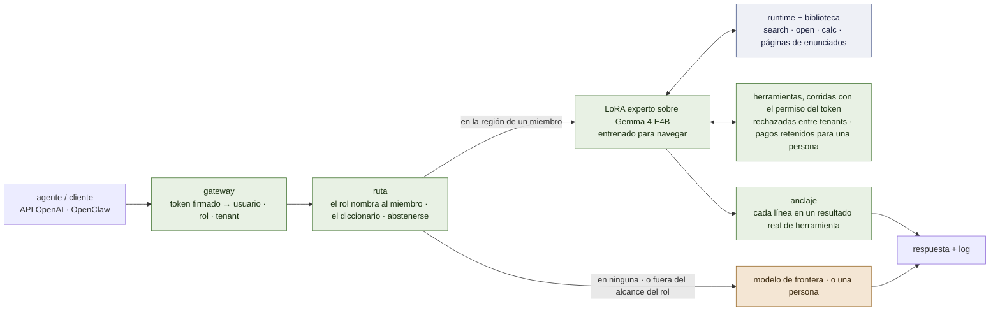

# lora-kernel


*El especialista, la biblioteca, el radar — y, por la puerta, la frontera, para cuando ningún cajón sirve.*

**El LoRA no es el libro de texto; es el especialista que sabe usar la biblioteca.**

[](LICENSE)
[](docs/es/ARCHITECTURE.md)
[](docs/es/MEMORY.md)
[](docs/es/RECORD.md)

*[English](README.md)*

**Una capa operativa para agentes de IA locales especializados** — no una librería de inferencia de LoRA.

```
                       un modelo local chico (residente)
                                      │
                                 lora-kernel
                router: qué especialista, o abstenerse hacia el frontier
      ┌──────────────┬───────────────┼───────────────┬──────────────┐
   triage de      compromisos     distribuidora   personal de    normativa
   correo         de escritorio                   escuela
   LoRA + tools   LoRA + tools    LoRA + tools    LoRA + tools   LoRA + biblioteca
                                  + biblioteca    + biblioteca   + compuerta de citas
```

El ruteo se está volviendo una función de todos. Lo que este repositorio construye y mide es todo lo que
está **debajo del router**: la **especialización** de cada agente (un LoRA entrenado en cómo hacer el
trabajo, no en los datos), su **composición** (varios especialistas sobre una base residente, cada uno con
su superficie de herramientas acotada), su **memoria** (datos en notas que se editan sin reentrenar), sus
**habilidades** (las herramientas y procedimientos que cada uno aprendió a usar) y su **evolución** (cada
versión nueva pasa una compuerta contra la base sola y contra la versión que reemplaza). De propósito
general y open source (Apache-2.0): cualquier trabajo con documentos, procedimientos y herramientas. Los
especialistas del diagrama son los medidos acá; lo que sacó cada uno, y lo que falló, está en
[`docs/es/RECORD.md`](docs/es/RECORD.md).

> **En un minuto.** Un modelo chico (Gemma 4 E4B) recibe un LoRA por tarea, entrenado en *cómo
> recorrer* una biblioteca de notas en markdown — buscar, abrir, seguir el enlace, calcular — y no en
> los datos que contienen. Cambia un procedimiento: se edita la nota, sin reentrenar. Un router muy
> chico manda a un modelo de frontera lo que no cae en el terreno de ningún experto. Medido acá
> **[ran]**: un experto de triage de inbox en 0.989 contra 0.345 del modelo base; preguntas de varios
> saltos sobre una wiki que ningún modelo vio, 38/40 contra 19/40 del Gemma sin entrenar; y una
> lección que por sí sola vale la visita — el mismo adapter sacó 11/90 servido por `tool_calls` y
> **90/90** servido como su corpus le enseñó. Casi todo sobre suites generadas y sobre regulaciones reales ingeridas textualmente, todavía sin tráfico real;
> lo que falló está en [`docs/es/RECORD.md`](docs/es/RECORD.md). El adapter que recorre la wiki está en
> [Hugging Face](https://huggingface.co/Matias/lora-kernel-distributor-wiki-gemma4-e4b) — probalo en diez minutos:
> [](https://colab.research.google.com/github/EvolvingAgentsLabs/lora-kernel/blob/main/examples/colab/wiki_walk.ipynb)

## Mirá la demo — un centro educativo completo sobre un modelo chico y local (76 s)

https://github.com/user-attachments/assets/e392f2b9-ff83-45f5-bc96-0da483a7b05f

**[el MP4 en el repositorio (1,8 MB)](docs/video/demo-escuela.mp4)** · en español · cada pedido, llamada a herramienta, respuesta y número en
pantalla está copiado de una corrida grabada — [`results/DEMO-school-diagram-20260926/`](results/DEMO-school-diagram-20260926/BRIEF.md),
**15/15** sobre Gemma 4 E4B + un LoRA del personal detrás del gateway. Escuelas sintéticas; identidad, pagos y monitoreo son
sustitutos de demo. El video es HTML renderizado con [HyperFrames](https://github.com/heygen-com/hyperframes):
[`video/demo-escuela/`](video/README.md).

https://github.com/user-attachments/assets/bf19e256-6c78-4170-97ff-dca3b407dd6d

**Y el tracker de equipo, multi-turno, en una laptop (76 s): [el MP4 (2,4 MB)](docs/video/demo-tracker.mp4)** · en español · tres
sesiones a través de OpenClaw, Gemma 4 E4B + `tr-s1` sobre llama.cpp, llevando las claves y no la conversación — cada turno copiado de
[`results/LIVE-tracker-openclaw-20260930/`](results/LIVE-tracker-openclaw-20260930/BRIEF.md), **14/14**, dependientes 8/8 · [`video/demo-tracker/`](video/README.md).

**Y en vivo, no sólo guionada [ran] 2026-09-26: 15/15 a través del OpenClaw real.** Las mismas escenas enviadas por el propio
OpenClaw 2026.9.4 — un perfil por rol, cada uno con su token firmado como clave del proveedor — al gateway, con el miembro
en una L4 alquilada y **Claude Haiku 4.5 como frontera** para lo que ninguna herramienta cubre: pasan todas, el único turno a
la frontera costó $0,0112 y la aprobación del director ejecutó el cobro retenido. Cómo apuntar tu propio OpenClaw:
[`docs/es/OPENCLAW.md`](docs/es/OPENCLAW.md) §6 · la corrida: [`results/LIVE-school-openclaw-20260926/`](results/LIVE-school-openclaw-20260926/BRIEF.md).

**La distribuidora también, en vivo y en una notebook [ran] 2026-09-28: 6/6 a través del OpenClaw real.** El miembro de la
distribuidora (`gemma-4-E4B-it` 8 bits + `distributor-staff-out-s0`, llama.cpp en una MacBook Air M4) detrás del mismo
gateway (`--org distributor`): la lectura de un pedido, la de stock, un ticket escrito, el pedido de otro centro rechazado
por la herramienta, la instrucción plantada en una nota de entrega reportada como dato — y, desde que M10 le enseñó a
abstenerse (20/20 retenidos, 0 de 70 perdidos), un pedido que ninguna herramienta cubre **enviado a Claude Haiku 4.5**
($0,0112). Sin GPU alquilada; 5 de 6 turnos no salieron de la máquina
([`LIVE-distributor`](results/LIVE-distributor-openclaw-20260928/BRIEF.md) · [`M10`](results/M10-distributor-abstain-20260928/BRIEF.md)).

## El problema

Una organización que funciona con agentes sigue mandando el mismo puñado de trabajos que se repiten
— dar curso a un inbox, registrar un pedido de mantenimiento, responder desde una lista de control —
a un modelo de frontera en la nube, a precio de frontera, sobre datos que muchas veces no deberían
salir del edificio. La respuesta habitual, entrenar (fine-tuning) un modelo sobre los resultados,
cambia eso por un problema peor: los hechos terminan **horneados en los pesos**, así que el día que
un procedimiento cambia no hay un archivo para editar — sólo un reentrenamiento, y hasta que eso pasa
el modelo responde con total confianza lo viejo.

lora-kernel guarda los hechos en una biblioteca de notas markdown que una persona puede leer y
corregir, y entrena a un modelo chico sólo para que encuentre el camino hasta la correcta. Lo que un
experto sabe *hacer* — qué herramientas usar, en qué orden, bajo las reglas propias de esta
organización — vive en los pesos de un adaptador chico, entrenado con SFT común. Lo que necesita
*saber* — el valor vigente, el procedimiento vigente — queda afuera de los pesos, en un archivo. Un
router muy chico decide en qué territorio de qué experto cae un pedido, y se abstiene hacia un
modelo de frontera para todo lo demás, así que nada se responde fuera de su terreno entrenado.

Se entrega como una **API compatible con OpenAI** — un modelo residente, varios adaptadores, cada
pedido servido por el suyo — con **instancias de OpenClaw por tarea** encima.

Cada afirmación de abajo está marcada **[ran]** (observada en este repositorio, con la corrida
nombrada), **[read]** (de código fuente o de un paper) o **[spec]** (decidido, todavía no
construido) — y todo lo medido hasta ahora es sobre suites generadas o sobre documentos reales ingeridos textualmente, nunca sobre tráfico real.
Los números vivos, incluido lo que no pasó, están en [`docs/es/PLAN.md`](docs/es/PLAN.md) y
[`docs/es/RECORD.md`](docs/es/RECORD.md); lo que sigue es lo que no cambia cada vez que alguno de
ellos se mueve.

---

## El núcleo de la versión 1.0


*El núcleo de la 1.0: un router que puede abstenerse, un especialista y una biblioteca por subdominio, un árbitro debajo de todos.*

Cinco cosas, y cómo cambia cada una. **Estado, 2026-10-05: las cinco están construidas y medidas** — de ahí la insignia, "núcleo 1.0 construido, medido" — con lo que no pasó nombrado: la compuerta del radar (recall@3 0,638 contra 0,80, W3 **[ran]**), un verificador que nadie de acá escribió (τ²-bench, abajo: instalado, todavía sin miembro puntuado) y el tráfico real:

| | qué es | cambia con |
|---|---|---|
| **Un experto es su corpus** | un QLoRA por subdominio, entrenado con SFT común; servido bajo exactamente el prompt, el bloque de herramientas y el formato de resultado que le enseñó su corpus — o es otro modelo | una corrida de entrenamiento |
| **El router** | un modelo muy chico de esos mismos corpus: *¿de qué distribución es este pedido?* — y **se abstiene** cuando la respuesta es ninguna. Abstenerse es la frontera | re-indexar los corpus |
| **La memoria** | una biblioteca de notas que el experto navega — abajo | **editar markdown** |
| **El runtime** | un árbitro chico en Python dentro del proxy: ejecuta los comandos del experto, aplica las reglas de un sitio, hace cumplir el orden de los pasos | un cambio de código |
| **El contrato de release** | un manifiesto por miembro — corpus, adaptador, biblioteca, radar y gramática, cada uno con hash; admitido por un test pareado contra la base pelada | una compuerta que tiene que pasar |

Y una cosa que se agrega por subdominio donde se mide que paga, **no requerida por la 1.0**:
un segundo LoRA sobre un modelo grande de la misma familia, entrenado sobre el mismo corpus,
que verifica lo que el chico borradorea ([`docs/es/PLAN.md`](docs/es/PLAN.md) hitos 3–4).

## Principios de diseño

- **Un miembro es un procedimiento aprendido, no un depósito.** Lo que guarda un LoRA es una
  dinámica — estado → transformación → estado siguiente: buscar, abrir, seguir un enlace, citar —
  y la biblioteca guarda el contenido. Entrenado sobre recorridos de una familia real de
  regulaciones, `real-spans-s0` cita sobre una familia que nunca vio, 18/23 contra el 9/23 del base
  sin entrenar, dos semillas — pero sólo porque la dinámica se aprendió sobre texto real: entrenado
  sobre un mundo generado en cambio, el miembro aprendió el generador y sacó 0/25 sobre uno real
  ([`REAL3`](results/REAL3-real-corpus-20260930/BRIEF.md) **[ran]**,
  [`REAL0`](results/REAL0-real-library-20260930/BRIEF.md) **[ran]**). La prueba directa es editar la
  biblioteca sin tocar los pesos: un miembro que nunca vio esa biblioteca contesta 17 de 17 preguntas
  con un número cambiado después de entrenar, cada una citada al enunciado editado, 0 obsoletas
  ([`EDIT0`](results/EDIT0-edit-without-retraining-20261004/BRIEF.md) **[ran]**).
- **La división del trabajo ya está en la arquitectura.** El router decide a qué corpus cae un
  pedido y se abstiene hacia la frontera; los miembros guardan el procedimiento aprendido por
  subdominio; la biblioteca guarda el contenido; el árbitro y el runtime chequean lo que se puede
  chequear sin la clave de respuestas; la frontera se queda con lo que no cae en ningún corpus — un
  mapeo de lo que el núcleo de arriba ya es, nada nuevo.
- **Una evaluación actúa sobre el sistema; le aconseja a un miembro sólo si su corpus le enseñó a
  seguir ese consejo.** Devuelto como pista, el chequeo de citación reparó 0 de 6 respuestas
  incorrectas — un modelo chico no sigue lo que sólo lee
  ([`CITE0`](results/CITE0-runtime-check-20261002/BRIEF.md) **[ran]**). Como compuerta delante del
  runtime en cambio, el mismo chequeo retiene 86 de 165 respuestas no correctas y 0 de 275
  correctas, con un costo declarado (43 de 347 valores correctos retenidos bajo una cita que falla)
  — prendida por defecto desde la decisión del usuario del 2026-10-02
  ([`GATE0`](results/GATE0-cite-gate-20261002/BRIEF.md) **[ran]**).
- **Cómputo en tiempo de inferencia, bajo la compuerta — AYUDA, no alcanza para prenderlo.** Recorrer
  una vez, greedy — el brazo servido. Donde la compuerta retendría esa respuesta, recorrer de nuevo y
  entregar el primer recorrido que la compuerta pasa: pareado sobre los conjuntos de 52 filas de
  CITE0 y de REAL4, 16 filas remuestreadas, ganancia 4 (recorrido 1 incorrecto, el remuestreo
  correcto) contra 3 nuevas incorrectas (recorrido 1 retenido, el remuestreo sigue incorrecto) —
  ganancia > nuevas incorrectas pero test de signos exacto $p = 1,0$, por debajo de BOK WORKS (ganancia
  ≥ 5). Lectura: un recorrido 1 que pasa la compuerta es correcto 72/88 (82 %), uno remuestreado que la
  pasa sólo 4/7 (57 %) — muestrear hasta que la compuerta pase encuentra una cita que ella acepta, no
  necesariamente la que la pregunta pide, que es exactamente lo que hace cada fila nueva incorrecta.
  **No se prende** ([`BOK0`](results/BOK0-best-of-k-20261002/BRIEF.md) **[ran]**).
- **Una página puede abrirse chica en vez de sólo acotada — AYUDA.** Mostrar sólo las 8 mejores
  afirmaciones de la pregunta en una página (`page_top`, el default servido desde la decisión del
  usuario del 2026-10-02) contesta 34 de 44 contra el 30 de la página sin cambios, pareado 6:2
  ($p = 0,29$), a un tercio del texto del recorrido, sobre una cuarta familia real nunca vista antes
  ([`PAGE0`](results/PAGE0-page-top-20261002/BRIEF.md) **[ran]**). Entrenar un corpus bajo esa forma
  servida, con el modo `recover` de la guarda del árbitro medido por primera vez, no repara nada en
  el mismo conjunto — la línea de corpus de formato se detiene ahí
  ([`FMT0`](results/FMT0-format-corpus-20261002/BRIEF.md) **[ran]**).

### La memoria, en cinco piezas

Especificación completa y su registro: [`docs/es/MEMORY.md`](docs/es/MEMORY.md) (~~**[spec]**~~ construida hasta W9 **[ran]**).

1. **La biblioteca — dos estantes de markdown**, cada nota de menos de media página. El
   **arnés operativo** (*¿cómo se hace?*): notas tipo receta cuyos enlaces son el flujo de
   control — `requires` (antes de esto, aquello), `next` (el paso que sigue), `uses` (para
   este paso, consultar…). La **wiki enciclopédica** (*¿qué es, qué fórmula aplica?*): un
   árbol, de general a específico, que clasifica en qué caso estás antes de calcular. **Con forma
   de Wikipedia, su unidad es el enunciado atómico:** una página es una lista de enunciados de
   una oración, verificables, bajo anclas (`§supplier`, `§if-damaged`), los enlaces viven dentro
   del enunciado que los nombra, y una respuesta cita el enunciado en el que se apoya — así la
   memoria es verificable, no sólo buscable ([`docs/es/MEMORY.md`](docs/es/MEMORY.md) §1.6 —
   **[ran]** W9: un LoRA de trayectoria la camina 35/40 donde la base sin entrenar camina 0/40,
   3-hop 16/16).
2. **El radar — embeddings comprimidos a un subdominio.** No es un motor de búsqueda general.
   En un dominio cerrado el vocabulario tiene un significado funcional exacto, así que un
   vector chico alcanza para mapear las únicas dos intenciones que importan: *para qué
   situación es esta nota* (`when:`) y *qué define* (`what:`). Devuelve las dos o tres notas
   de exactamente el subdominio en el que trabaja el experto.
3. **El lenguaje — tres verbos.** `<search>una situación o una duda</search>` devuelve
   títulos e ids. `<open>id</open>` devuelve la nota y sus enlaces. `<calc>expresión</calc>` —
   para que el modelo nunca haga aritmética de memoria, donde siempre falla.
4. **El LoRA — entrenado en el hábito de navegación.** Sus casos de entrenamiento sortean sus
   constantes de nuevo cada vez — un líquido inventado para un ejercicio, un tiempo de
   permanencia local de 15 segundos en vez de 5 — así que la respuesta no se puede memorizar
   y el modelo queda *obligado a abrir la nota para ver el número*. Lo que termina en los
   pesos es una coreografía: leer, buscar en el arnés, abrir el protocolo, hacer una parada
   en la wiki cuando un paso necesita un dato, mandar los números a `<calc>`, seguir `next`.
5. **El runtime — el árbitro de software.** Pasa las páginas, escribiendo cada resultado justo
   después del tag. Aplica reglas locales automáticamente: una sala que desinfecta durante 20
   segundos tiene ese valor sustituido *antes* de que la nota llegue al experto, que lee la
   regla ya resuelta. Y vigila que no haga trampa: si el paso 4 `requires` el paso 1 y el
   experto nunca abrió el paso 1, el runtime corta la ejecución — sin necesitar saber si la
   respuesta final estaba bien. **Y decide qué puede afirmar una respuesta:** cada respuesta cita
   el enunciado en el que se apoya, y el árbitro chequea la cita; frente a las herramientas, el
   gateway no muestra ninguna línea que no esté en un resultado real de una herramienta
   (`examples/common/grounding.py`).


*Una pregunta, de punta a punta: páginas de enunciados de una oración, enlaces dentro de las oraciones, una respuesta que nombra la oración en que se apoya.*

**La ganancia.** Si el protocolo cambia mañana, se edita un archivo markdown en git. El LoRA
no se reentrena, porque lo que aprendió fue a obedecer los enlaces y leer las notas — probado
directamente parchando un enunciado de la biblioteca después de entrenar (W7): el miembro sigue el
valor nuevo 37 de 38 veces, citando la línea parchada, 0 obsoletas; en modo cerrado, los mismos pesos
recitan el valor viejo sólo 1 vez de 40 — evidencia de lo que esta afirmación en realidad sostiene:
se aprendió la ruta, no el hecho
([`results/W7-edit-after-training-20260927/`](results/W7-edit-after-training-20260927/BRIEF.md)).


*H1: traer un valor por clave arregla lo que leer el historial perdía — el reclamo ahora nombra el pedido.*

**Memoria operativa de corto plazo, junto a la biblioteca — construida, [ran] en tests, todavía sin
entrenar** (`examples/common/opmemory.py`). La biblioteca de arriba es lo que un experto *sabe*;
acá vive el estado *vivo* de un flujo de trabajo: una caché de sesión indexada por (organización,
usuario, sesión) y una caché global por organización (`global.<clave>`), servida por la capa de
herramientas exactamente como cualquier otra herramienta — acotada por la credencial firmada, de
modo que ninguna clave cruza organización ni usuario — claves validadas, valores topeados a 500
caracteres, cada escritura registrada. Vive en memoria y muere con el gateway, de corto plazo por
diseño. Un flujo de trabajo se declara, no es neuronal: un archivo TOML por rol
(`examples/distributor/workflows/*.toml`, seis roles, dos o tres estados cada uno), avanzado sólo
por las llamadas que la capa de herramientas *corrió* — el modelo nunca fija el estado, sólo lo
lee. Servido con `Gateway(memory=, workflows=, tool_block=)`, todo el contexto de un turno se
vuelve una línea — `state: <flujo>/<estado> · keys: <nombres>` — en lugar de la conversación, y el
modelo busca (`<get>clave</get>`) o guarda (`<put>clave=valor</put>`) un valor sólo en el paso que
lo necesita.

**El arnés de flujo de trabajo — la idea del usuario, 2026-09-29, diseñada [spec].**
Para un subdominio, un miembro aprende en sus pesos los flujos de trabajo del dominio, sus
herramientas, y las *claves* de esa memoria operativa — nunca los valores, nunca la conversación,
así que el prompt queda plano a medida que crece una sesión. Lo que termina en el corpus es la
misma coreografía que la biblioteca de arriba, extendida de leer (`<open>id§ancla</open>`) a leer
*y escribir* estado operativo. Es un arnés adentro de cada miembro, un solo corpus — no un
adaptador separado compuesto con uno de dominio, que fue lo que dejó en pausa al `harness.lora`
anterior (la composición no se pudo medir limpio, P9/P13). Diseño completo:
[`docs/review/harness-workflow-kv.md`](docs/review/harness-workflow-kv.md).

**H1 ya tiene un resultado, y se lee de dos formas [ran].** Contra los 43 de 54 turnos dependientes
de `history`, el brazo del arnés (`wf-s0` + la memoria operativa) llega a 53 de 54 — 1 perdido, 11
ganados — con las afirmaciones de atención al cliente que ahora nombran el pedido buscado por clave
(10/10 contra el 2/10 de `history`), despacho 14/14, y cada uno de los 53 turnos correctos rastreado
hasta un `<get>` por clave (53/53); el prompt en sí queda plano por turno (745, 726, 710 tokens)
donde el de `history` sigue creciendo (345, 428, 394). El mismo corpus sin el bloque de herramientas
(`harness-noblock`) saca 0 de 60: sin el bloque el miembro no llama a ninguna herramienta y afirma
datos que nunca leyó — su corpus nunca se entrenó sin el bloque. Leído a través de los dos brazos,
la compuerta pre-registrada (primeros turnos ≥ 90 % *en cada brazo*) la hace fallar sólo el brazo
sin bloque, que anula la corrida tal como está escrita — un error de diseño del instrumento,
registrado, no uno que se corrigió en el código después de ver el resultado. Leído por brazo en
cambio, el arnés **PASÓ** y harness-noblock quedó **FALSEADO**. **La decisión del usuario (2026-09-29):
vale la lectura por brazo — el arnés PASÓ, harness-noblock quedó FALSEADO; el VOID tal como está
escrito queda como el registro de un error del instrumento, no como el veredicto.** En estas sesiones cortas (2–3 turnos) el
arnés paga más o menos 2× los tokens de prompt por turno (una ida y vuelta extra de get → llamada →
put); el ahorro para el que está construido pertenece a sesiones más largas, por lo que se construyó
un dominio de seguimiento tipo Jira y Confluence (`examples/tracker/`) para ese caso
([`results/H1-workflow-harness-20260929/`](results/H1-workflow-harness-20260929/BRIEF.md)).

**H2 ya tiene un resultado, sobre el dominio de seguimiento, y la decisión del usuario (2026-09-29) lo
lee como lectura 1.** 60 sesiones largas retenidas, 160 turnos dependientes: el arnés llega a **146 de
160 (91,3 %)**, por encima de la barra de 90 %, plano en las cinco vueltas (p̄ 1613, 1223, 1011, 1149,
1274 — se cumple p̄5 ≤ 1,1 p̄1); descriptivamente, pareado contra `base-history` sobre los mismos 160
turnos, **142 : 0**. El propio `base-history` saca 44 de 60 en primeros turnos, dispara la misma regla
de VOID por brazo que dispararía un tratamiento roto, y anula la comparación — una regla pensada para
atrapar un tratamiento a mitad de entrenar atrapó en cambio a un base sin entrenar cuya falla *es* el
margen, así que el "le gana a base-history" pre-registrado se lee **FALSEADO tal como está escrito**, y
queda en el registro con esos dos errores de instrumento (el VOID por brazo pedido a un base sin
entrenar, y el chequeo del anchor de abajo). **La decisión del usuario: lectura 1 — las condiciones
legibles son el veredicto de H2, el arnés PASÓ.** No se repitió: ningún cambio de regla podía mover un
base en 4/160. `harness-noblock` (el bloque de herramientas sacado al servir) llega a 80 de 160 — un
error del corpus, no un aprendizaje parcial: el generador armó el tercio sin bloque con el mismo
módulo (`% 3`) con el que rotan los roles, así que las 400 filas sin bloque eran de QA, y el miembro
aprendió lo-sin-bloque exactamente en el rol que se le mostró (cola de QA 80/80; colas de lead y
developer 0/20, la única excepción de lead `sprint_board`, una llamada sin argumento) — todavía debajo
de la barra. En el brazo del arnés las 14 fallas dependientes son todas un mismo turno, el comentario final de QA (6/20): el miembro relee el issue o intenta una transición rechazada en vez de comentar — una falla real, sobre un solo fraseo de la evaluación ("Note on it: …" 1/15 contra "Put a comment on it: …" 5/5); aparte, 10 de los 60 turnos independientes (50/60) son el chequeo del ancla — "¿dónde tienen que pasar los tests?" lee la página entera `definition-of-done` en vez de `#tests`, y el enunciado está en lo que leyó (mide fraseo, registrado, no aflojado). **H3 tiene un resultado [ran]:**
entrenado sobre un segundo corpus — fraseo ampliado en dos versiones por turno en cada rol, un tercio
sin bloque de cada rol — `tr-s1` saca 158/160 dependientes (98,8 %) sobre una suite fresca retenida
contra los 147/160 de `tr-s0` sobre los mismos turnos, pareado 11:0, prueba de signo exacta p = 0,00098,
0 perdidos, prompt plano — **H3a PASÓ**. Servido sin el bloque de herramientas, `tr-s1` saca 156/160
(97,5 %), cada rol por encima de la barra (developer 76/80, lead 40/40, QA 40/40), a más o menos un
tercio de los tokens de prompt por turno — **H3b PASÓ**: el miembro sin bloque es el contexto
compacto que pedía el diseño. Leído donde ocurre: las 2 fallas de `tr-s1` son un solo caso, el texto
de la propia nota tomado como una orden (`issue_transition → qa`, rechazada por la capa de
herramientas); las 4 fallas del brazo sin bloque son una sola sesión cuyo primer turno arrastra un
error en cascada por el resto
([`results/H3-tracker-corpus-v2-20260929/BRIEF.md`](results/H3-tracker-corpus-v2-20260929/BRIEF.md))
([`results/H2-tracker-harness-20260929/`](results/H2-tracker-harness-20260929/BRIEF.md)).
**Y corre en vivo en la Mac del usuario** — `tr-s1` sin bloque con la memoria operativa, llama.cpp Q8_0 + su LoRA como GGUF, manejado por OpenClaw en tres sesiones (lead, developer, QA): **14/14 turnos, dependientes 8/8**, latencia del gateway mediana 3,7 s, ~370 tokens de prompt por turno ([`results/LIVE-tracker-openclaw-20260930/BRIEF.md`](results/LIVE-tracker-openclaw-20260930/BRIEF.md)).

Una nota con forma de orden no se obedece: sobre 40 nunca vistas ("mark as done once CI is green", …) `tr-s1` escribe 40/40 como comentarios y no ejecuta ninguna — sin margen, así que no se entrenó un miembro nuevo ([`H4`](results/H4-tracker-command-notes-20260930/BRIEF.md)); una clave que escribe el usuario ahora se conserva aunque la llamada de un turno salga mal (`[capture]`, `docs/MECHANISMS.md` §9). La pérdida enmascarada por tramos que arregló el entrenamiento sobre documentos reales (abajo) no es un nuevo default: comprobada por costo sobre este miembro del tracker, cerca de su propio techo, retrocede una frase 0 de 20 contra la pérdida de texto completo que reemplazaría — los miembros de resultado corto conservan la pérdida de texto completo, la enmascarada por tramos queda donde los resultados son largos ([`H5`](results/H5-span-loss-tracker-20261001/BRIEF.md)).

**El gateway queda reforzado contra un reinicio y contra alcanzar fuera de sus propios hosts [ran] (#310).** Lo que un workflow deja esperando a una persona sobrevive a un reinicio del proceso: las aprobaciones y las derivaciones quedan en un diario (`approvals.jsonl`, `handoffs.jsonl`) y se releen al arrancar, así que un cobro que ya estaba `executing` cuando el proceso murió vuelve como `interrupted` — listado para quien aprueba, nunca reejecutado por sí solo — y una escritura retenida se ejecuta a lo sumo una vez, con el alcance de quien la pidió. La salida de red del propio proceso queda cerrada a sus hosts configurados (`examples/common/egress.py`): el servidor del miembro, el host del frontier y loopback, incluida la resolución DNS — todo lo demás se niega antes de siquiera resolverse — y el gateway ahora fija `HF_HUB_OFFLINE` para dejar de pedirle nada al hub de modelos por red al arrancar. Margen comprobado antes de construir nada más: cada turno grabado en tres dominios y los dos motores, repasado — 70 expuestos a una instrucción plantada en un resultado de herramienta, 0 actuaron — ninguna escritura no pedida, ningún alcance a otra organización — así que el próximo paso propuesto, envolver material ajeno en su propia cerca, no está construido; no hay nada en estas suites para que lo arregle ([`INJ0`](results/INJ0-planted-headroom-20260930/BRIEF.md)).

**El recorrido de la memoria no se transfería a documentos reales, y ahora lo hace.** Sobre una biblioteca ingerida textual de regulaciones de EE. UU., `distributor-wiki@v2` sacaba 0/25 de varios saltos: buscaba con consultas memorizadas de su mundo de entrenamiento generado y nunca abría una página ([`REAL0`](results/REAL0-real-library-20260930/BRIEF.md)). Las propias mitigaciones del runtime — el texto de la pregunta como primera búsqueda en todos los estantes, un fallback a su texto literal, una página abierta con sus enunciados adjuntos — cerraron la mayor parte de la brecha sin reentrenar, a 24/25 ([`REAL1`](results/REAL1-entry-20260930/BRIEF.md)–[`REAL2`](results/REAL2-page-text-20260930/BRIEF.md)). Entrenada en cambio sobre recorridos de documentos **reales** de otra familia, con la pérdida enmascarada a los propios tramos del modelo para que aprenda a contestar en vez de copiar las páginas que se le muestran, la misma línea llega a **18/25 sobre estas mismas filas** — contra el 7/25 del base sin entrenar, desde el 0/25 de `distributor-wiki@v2` — y a **18/23 (78 %)** sobre un set fresco y más difícil de varios saltos, las dos semillas, contra el 9/23 del base ([`REAL3`](results/REAL3-real-corpus-20260930/BRIEF.md)). La negativa — el miembro entrenado contestaba toda pregunta sin respuesta, 0/4 — se arregla después del mismo modo, agregando 27 recorridos sin respuesta al corpus: 15/16 se niegan, 0 negativas falsas de 36 contestables; tal como está escrito esto es FALSIFIED en el costo del titular por una fila (pierde 3 donde la barra es ≤ 2), y si ese costo es real o es la propia dispersión de corrida a corrida de vLLM es ruido — la lectura que **el usuario aceptó el 2026-10-01**: `real-none-s0` es el miembro de documentos reales ([`REAL4`](results/REAL4-refusal-20260930/BRIEF.md)). Sin cambios otra vez, el mismo miembro recorre una **tercera** familia elegida por la propiedad opuesta — EPA 40 CFR 112, 15 páginas, 146 enlaces (9,7 por página) contra los 22 totales de la segunda familia — en **15/25 (60 %)**, bajo la barra de 70 % pero a 7× el base sin entrenar (13 : 0, $p = 0{,}00024$) y negativas 5/5; la mayoría de las filas perdidas cita un enunciado que tiene el mismo número que el preguntado, no la página equivocada — la citación estricta sobre valores repetidos, no el recorrido, es el ítem abierto ([`REAL5`](results/REAL5-third-family-20261001/BRIEF.md)).

**La citación sobre valores repetidos queda donde la dejó REAL5 — dos cambios de corpus ya no lograron moverla, y la línea se detiene acá.** Un corpus de recorridos de un solo salto cuyo valor se repite en las regulaciones de entrenamiento dejó la citación de REAL5 exactamente donde estaba — `real-cite-s0` empata con `real-none-s0` 15/25 — porque las fallas son filas de varios saltos citadas en el extremo equivocado de un enlace, no una elección de un salto entre repetidos; una de las filas de REAL5 descansa en un enunciado con un gemelo palabra por palabra en otra parte de la biblioteca, que ninguna lectura puede separar ([`REAL6`](results/REAL6-citation-20261001/BRIEF.md), FALSIFIED). REAL7 entrenó en cambio recorridos con señuelo entre enlaces — la respuesta en el extremo de un enlace, el mismo número sentado como señuelo en su inicio — sobre una familia de entrenamiento extendida con cuatro partes más del 49 CFR, y leyó el veredicto sobre el titular sin gemelos de REAL5: `real-link-s0` empata con `real-none-s0` 13/21 (4:4 pareado, $p=1,0$), bajo la barra de ≥ 15/21 — aunque el valor es correcto más seguido (22 contra 20 de 25) y las negativas se sostienen 5/5 en ambos — **FALSEADO**. Dos cambios de corpus apuntados a esta citación (REAL6, REAL7) ya no cambiaron nada; por la regla de contar rediseños, esta línea de corpus sobre esta pregunta de citación se detiene acá. Lo que queda en pie: `real-none-s0` con el runtime cita el enunciado de soporte en 13/21 filas de varios saltos sin gemelos de una tercera familia (valor correcto 20/25), negativas 5/5 — lo que podría moverlo no es otro corpus sino un chequeo de citación en el runtime que rechace una cita cuya página el recorrido no terminó, medido sobre un conjunto fresco ([`REAL7`](results/REAL7-crosslink-20261001/BRIEF.md)).

**El miembro de documentos reales se sirve como lo haría el producto, y la corrida en vivo terminó y PASÓ.** `examples/library/serve.py` pone a `real-none-s0` detrás de un endpoint compatible con OpenAI sobre llama.cpp (la E4B en Q8_0 + el LoRA como GGUF f16, contexto **12.288** — 16.384 se quedó sin memoria en la Mac de 16 GB del usuario, `-b 512 -ub 512`) corriendo el propio runtime de REAL4 — entrada de texto completo en todos los estantes, fallback, páginas abiertas con sus enunciados — con la salida de red cerrada al servidor del modelo; `live_library.py` lo maneja por **OpenClaw 2026.9.4**, una sesión fresca por pregunta, y califica la respuesta como lo hacía REAL4, sobre el propio registro del recorrido del endpoint. Las 52 preguntas de REAL4, 22,5 minutos: **36/52** — titular 16/23, negativas 15/16, un salto 5/13 — contra el 38/52 de REAL4 sobre vLLM bf16 (16/23, 15/16, 7/13): **PASÓ** (barra ≥ 34, negativas ≥ 13, titular ≥ 14); el titular y las negativas empatan exactamente con el brazo medido, las dos filas perdidas son de un salto. Cada pérdida se lee donde ocurre, y es del borde, no del miembro: 4 recorridos desbordaron el contexto de 12.288 tokens tras abrir entera una página de ~7k tokens, una pregunta de OpenClaw hizo timeout sin recorrido grabado, y tres preguntas lentas se reenviaron envueltas en el propio sobre de mensaje encolado de OpenClaw; un recorrido sin línea final ya no se muestra como `Not in my library.` (`serve.NO_ANSWER`). Pendiente: quitar ese sobre antes de que el runtime lea la pregunta, y un presupuesto de página para que una página larga entre en un contexto de 12k ([`LIVE-library`](results/LIVE-library-20261001/BRIEF.md)).

**Los dos ítems pendientes del borde ya están construidos, y las pérdidas propias del borde se miden en cero — el puntaje igual se queda uno corto.** `examples/school/gateway.runtime_request` ahora quita el sobre de mensaje encolado de OpenClaw antes de que el runtime lea la pregunta, y `memory.runtime.Conversation.page_budget` (servido en **2.500** tokens por `examples/library/serve.py`) abre una página que supera ese presupuesto con sus enunciados en orden BM25 contra la pregunta hasta el presupuesto, dejando el resto como anclas abribles — en esta biblioteca sólo 29 CFR 1910.178 lo supera. Las mismas 52 preguntas, corridas de nuevo: **37/52** — titular 16/23, negativas 14/16, un salto 7/13 — contra el 36/52 de esta corrida y el 38/52 de REAL4 sobre vLLM; **0** desbordes de contexto (4 antes) y **0** sobres (3 antes), pareado contra LIVE-library **3 : 2** ($p = 1,0$). Veredicto tal como está escrito: **SIN CAMBIO** — 0 desbordes pero 37 < 38, no REGRESADO (el titular y las negativas despejan sus barras, sin pérdida pareada). Las tres ganancias son exactamente las filas que le costaba el borde; la única pérdida nueva, `none-9`, es el presupuesto mostrando el enunciado que mejor empareja con la pregunta a una pregunta que la biblioteca no puede contestar. ~~Pendiente: por qué OpenClaw retiene un turno terminado en 3 filas~~ — encontrado: node quedaba retenido adentro de su propia salida después de una corrida exitosa; el driver ahora termina el grupo de procesos del turno poco después de la propia línea de fin de corrida de OpenClaw en vez de esperar una salida que podría no llegar, y el endpoint mismo siempre responde a un recorrido que lanza una excepción en vez de dejar que OpenClaw lo reenvíe ([`LIVE-library2`](results/LIVE-library2-20261002/BRIEF.md)).

**Un chequeo del runtime que rechaza una mala cita antes de que salga dispara limpio y aun así no se puede reparar: FALSEADO.** `cite_check` lee sólo el propio registro del referí — nunca la respuesta — y sobre un conjunto fresco de 52 filas de una tercera familia dispara en 6 filas con **convertidas 0, rotas 0**: que le digan por qué falla su cita no hace que el miembro escriba una mejor. Lo que es, medido: un detector sin falsa alarma, 15 disparos y 0 sobre una respuesta correcta entre este conjunto y el de LIVE-library2; el próximo paso es el chequeo como **compuerta**, no como pista — una línea que no la pasa no se entrega ([`CITE0`](results/CITE0-runtime-check-20261002/BRIEF.md)).

**Esa compuerta ya tiene su propio resultado, y funciona.** Repetida exacta sobre 532 recorridos grabados `+page`, `--cite-gate` bloquea 0 de 275 respuestas correctas y 86 de 165 incorrectas (52,1 %), subiendo la precisión de lo entregado 0,625 → 0,777 — con un costo real leído entero, no escondido: 43 de las 86 filas bloqueadas tienen un valor correcto bajo una cita que falla (43 de 347 valores correctos retenidos, 12,4 %). **Sale prendida por defecto en el endpoint servido — decisión del usuario, 2026-10-02, aceptando ese costo; `--no-cite-gate` la apaga** ([`GATE0`](results/GATE0-cite-gate-20261002/BRIEF.md)).

---

## El camino del pedido

![Una línea de siete estaciones: un agente; el gateway que lee una credencial firmada; la memoria operativa — una ficha (estado y nombres de claves) y dos cajones, sesión y organización, con un dial de flujo; el experto local chico del rol, que busca y guarda por clave; herramientas con el permiso de la credencial, un registro rechazado y un pago retenido; una hoja con una línea inventada tachada; la respuesta. Una rama punteada para lo que está fuera de alcance lleva a un edificio lejano y a una persona; una banda de log corre debajo de todo.](docs/img/request-path.png)

*El camino del pedido: el experto lee una ficha y las claves que necesita, nunca la conversación; permiso, retenciones y anclaje son del gateway.*


```mermaid
flowchart LR
    C["agente / cliente<br>API OpenAI · OpenClaw"] --> G["gateway<br>token firmado → usuario · rol · tenant"]
    G --> R["ruta<br>el rol nombra al miembro · el diccionario · abstenerse"]
    R -- "en la región de un miembro" --> E["LoRA experto sobre Gemma 4 E4B<br>entrenado para navegar"]
    E <--> M["runtime + biblioteca<br>search · open · calc · páginas de enunciados"]
    E <--> T["herramientas, corridas con el permiso del token<br>rechazadas entre tenants · pagos retenidos para una persona"]
    E --> V["anclaje<br>cada línea en un resultado real de herramienta"]
    R -- "en ninguna · o fuera del alcance del rol" --> F["modelo de frontera · o una persona"]
    V --> A["respuesta + log"]
    F --> A
    classDef local fill:#e8f1e4,stroke:#4a7a3a,color:#1d3314
    classDef art fill:#eef0f6,stroke:#4a5a8a,color:#1d2240
    classDef out fill:#f4e6d4,stroke:#9a6a2a,color:#3d2a0e
    class G,R,E,T,V local
    class M art
    class F out
```

## Dónde se ubica en una organización

Una organización que funciona con agentes suele dibujar el mismo esquema: arriba, personas en unos
pocos roles; un runtime de agentes con **un agente por rol**; las aplicaciones que esos agentes operan;
los canales que la gente ya usa; y abajo, una sola base de datos con identidad, pagos y monitoreo al
lado. En ese esquema cada agente es un system prompt sobre el mismo modelo remoto.

lora-kernel es la capa debajo de la columna de agentes. **Cada rol pasa a ser un experto** — un
adaptador entrenado en cómo *esta* organización hace ese trabajo — **con dos cajones de notas**: cómo
lo hacemos acá, y lo que sabemos. El rol del que llega un mensaje dice *cuál* experto — gratis, y medido como seguro **[ran]** F2; *si* el
pedido está dentro de la región de ese experto sigue siendo trabajo del router. Lo que un experto está medido para resolver se responde en la máquina de la organización;
el resto va a la frontera, o a una persona donde la política dice que nada sale del edificio. Los
sistemas de registro quedan donde están: **los registros quedan en la base, los hábitos van en el
adaptador, el conocimiento queda en notas que una persona puede leer y corregir.**


*Dónde se ubica en una organización: los registros quedan en la base, los hábitos van en el adaptador, el conocimiento queda en notas que una persona puede leer.*

La misma forma, en otros ámbitos — ninguno está medido, es hacia donde apunta el diseño:

| organización | roles que pasan a ser expertos | qué va en los dos cajones |
|---|---|---|
| **una distribuidora** | atención al cliente, recepción, despacho, compras, reclamos | los procedimientos de manejo del lugar · catálogo, transportistas, niveles de servicio |
| **un estudio contable o jurídico** | ingreso de casos, revisión de documentos, vencimientos, facturación | las listas de control y plantillas del estudio · las reglas de su jurisdicción, cliente por cliente |
| **una escuela o centro de formación** | inscripciones, apoyo docente, comunicaciones, compras | cómo resuelve esta escuela cada caso · programa, calendario, reglamento |
| **un taller o servicio técnico** | recepción de equipos, diagnóstico, repuestos, garantías | el procedimiento de cada tipo de reparación · manuales, listas de repuestos, condiciones de garantía |
| **un club o centro comunitario** | socios, inscripciones a actividades, instalaciones, cobranzas | cómo resuelve este club cada caso · actividades, cuotas, reglamento interno |
| **una administración de propiedades** | pedidos de inquilinos, mantenimiento, cobranzas, proveedores | el procedimiento de escalamiento por edificio · contratos, reglamentos, condiciones de proveedores |

Lo que comparten es lo que hace que una región merezca un experto: **los mismos pocos procedimientos,
repetidos a diario, con reglas locales que difieren del manual, sobre datos que no deberían salir.**
La primera biblioteca de este repositorio está armada con los procedimientos paso a paso de un manual
abierto ([`knowledge/nursing-iv/`](knowledge/nursing-iv/)). Lo que *no* está
establecido está más abajo, y vale acá entero: todavía no hay tráfico real, y la afirmación de que una biblioteca extiende a un experto a un procedimiento que nunca entrenó se sostiene sobre la wiki de enunciados atómicos (W9) y, entrenada sobre texto real con una pérdida enmascarada por tramos, sobre regulaciones reales (REAL3), y no se sostuvo sobre las notas de dos valores de la biblioteca de enfermería (W5, W5c) — ~~no está probada~~.

## Cómo está parado

**Ya corriendo.** Una instancia de vLLM sirve varios adaptadores LoRA sobre una sola base residente,
cada pedido ruteado a su propio adaptador, en vivo a través de la API compatible con OpenAI y a
través de OpenClaw **[ran]** — el mecanismo de arriba no es un diagrama, responde turnos reales hoy.
Un experto entrenado, servido exactamente como le enseñó su corpus, llega a precisión de nivel
humano en el trabajo para el que se entrenó (triage de inbox, 0,989 contra 0,345 de una base pelada)
**[ran]**.

**La memoria funciona en su primer banco de pruebas [ran].** En una wiki de enunciados atómicos
cuyos hechos ningún modelo puede saber, la base sin entrenar no camina las preguntas de dos y tres
saltos (0 de 40); un LoRA de trayectoria entrenado sobre otros 32 mundos las camina 35 de 40 con la
cita de cada respuesta verificada, 16 de 16 a tres saltos — y sobre Gemma 4 E4B, 38 de 40
(`docs/PLAN.md` hito 7, W9 y B1).

**Una organización de referencia, funcionando de punta a punta [ran].** La demo de la escuela:
identidad desde un token firmado, los registros de otra escuela rechazados por la capa de
herramientas, un pago retenido hasta que un director lo aprueba, pedidos fuera de alcance derivados
a la frontera o a una persona, un log y un dashboard — y **cada respuesta chequeada contra los
resultados reales de las herramientas por el gateway, fuera del modelo**. **15 de 15 escenas que cubren cada rol y cada caja del diagrama de referencia** (dev, trainee, marketing, educador,
compras, CFO, IT; agenda, membresías, inscripciones; comunicaciones, operaciones, compras, nómina, marketing,
dashboards) sobre Gemma 4 E4B con un adaptador del personal de la escuela — las primeras 8 contra 3 de 8 con un modelo pelado
([`docs/es/DEMO.md`](docs/es/DEMO.md)).

**El LoRA de ese miembro de la escuela necesita sólo su mitad de arriba [ran] (E6).** Restringido a
las capas 21–41 de 42, iguala al adaptador completo exactamente — 70 de 70 retenidos, 15 de 15 en la
demo — y el KV de las 21 capas de abajo sale idéntico bit a bit al de la base, con un control
base-contra-base incluido. Todavía no ahorra nada: el E4B ya cachea 24 de 42 capas entre adaptadores,
así que un cambio de adaptador sigue recalculando las capas 21–23, y el resultado descansa sobre una
sola semilla ([`results/E6-upper-layers-20260927/`](results/E6-upper-layers-20260927/BRIEF.md)).

**La familia es Gemma 4** desde 2026-09-25: medida contra Qwen3.5-4B sobre la misma wiki, un
empate, y la pila de desarrollo del usuario apunta a Gemma. **Todos los miembros publicados están sobre Gemma 4 E4B** —
`email-full@v3`, `desk-commitment@v3`, `distributor-wiki@v2`; los releases de Qwen 2.5 quedan sólo como brazo de control.

**El par, medido [ran].** La mitad grande es `gemma-4-12B-it` — un espacio de ids con el E4B, un LoRA servido aplicado,
lo bastante chica para una Mac mini. Su LoRA sube la aceptación de los borradores del miembro chico (α 0,871 → 0,898,
76 : 18 registros), así que se gana su lugar como **verificador**. **No compra precisión**: en una banda de preguntas
comparativas las dos mitades fallaron mientras el corpus nunca mostró una, y cuando la mostró el miembro chico solo pasó
de 10 a 37 de 40 (hitos 3 y 4, B2–B5). **Una segunda región encuentra lo mismo: ningún caso para la precisión de la
mitad grande. [ran] PAIR0, 2026-10-02:** antes de entrenar un miembro 12B para la región de documentos reales, las
dos bases peladas bajo el runtime servido — el 12B le pierde al E4B, 11/44 contra 21/44 filas respondibles, pareado
2 : 12, $p = 0,013$. Tampoco se entrena un miembro 12B para esta región; el par se queda como resultado de velocidad
sin una región que necesite la precisión de la mitad grande.
**PAIR1 [ran], 2026-10-03 — EMPATE:** el tamaño sin entrenar confunde con el protocolo, así que la propia definición
del par — las dos mitades entrenadas sobre el mismo corpus — tuvo su propio intento. El entrenamiento chocó con dos
quedadas sin memoria en la ventana de 4.096 en una A100 de 40 GB y una H100 rechazada por cupo antes de que
`span_logits_loss` (probado igual a la propia pérdida de HuggingFace) lo dejara terminar. Entrenado, `real-none-12b`
empata con `real-none-s0` sobre el registro de PAGE0: 33/44 contra 34/44 respondibles, pareado 5 : 6 ($p = 1,0$),
23/30 contra 24/30 multi-hop, 10/14 one-hop y 7/8 rechazos los dos — y 33/44 contra el registro de FMT0 también. Con
B3, una segunda región donde la mitad grande no compra precisión; el par especulativo se queda como resultado de
velocidad (B4, F0, C0, F0c) sin una región que lo necesite. Entrenado, el 12B camina limpio — 0 líneas de pensamiento
donde el 12B pelado dejó cientos en PAIR0 — así que el protocolo era el entrenamiento, no el tamaño. Una observación
al lado del veredicto: los dos miembros se equivocan en filas distintas (39/44 correctas por cualquiera de los dos)
([`PAIR1`](results/PAIR1-large-member-20261003/BRIEF.md)).

**Confirmado en una GPU de tamaño completo, bf16 (C0).** El drafter MTP propio del 12B con el LoRA
experto activo: 1,92× en el dominio (α 0,34), 2,40× general; el par base solo corre 2,80×/2,60×. Un
drafter E4B fusionado y alineado con el mismo LoRA no llegó a correr esta vez: se queda sin memoria
junto al 12B en una L4, el FP8 en línea de vLLM falla en esa GPU, bitsandbytes no es una cuantización
de drafter aceptada, y una H100 fue rechazada por cupo. Restringir ese mismo LoRA a las capas de
arriba del propio drafter tampoco ayuda — α en el dominio pasa de 0,82 base a 0,44 con el LoRA
completo y 0,43 con la mitad de arriba (ρ = −0,02, NINGUNO) — y en vLLM el adaptador de la mitad de
arriba sirve exactamente a la velocidad del completo: medio adaptador ahorra memoria, no tiempo
([`results/C0-aligned-draft-20260927/`](results/C0-aligned-draft-20260927/BRIEF.md),
[`results/C0-upper-e4b-20260927/`](results/C0-upper-e4b-20260927/BRIEF.md)).

**Decodificación especulativa con un experto LoRA, corriendo [ran] 2026-09-27 (F0).** Un solo servidor vLLM,
`gemma-4-12B-it` + un LoRA experto + **el propio drafter MTP de Gemma 4** (`gemma-4-12B-it-assistant`), en una L4 en FP8:
arranca, el LoRA queda aplicado, un LoRA se carga en caliente en 0,25 s con el drafter encendido. El modelo base corre
**2,7×** más rápido en las preguntas del experto (aceptación 0,79); **con el LoRA activo, 1,7× en su propio dominio y 2,1× en
texto general** — el drafter ve el LoRA a través de las activaciones del objetivo pero no predice lo que le hace escribir.
El EAGLE-3 público rinde mucho peor (1,2×). Esa corrida no fue invariante al batch, en una L4 en FP8, donde F0b
después encontró que el motor mismo no era determinista. Y el LoRA del experto se cambia en caliente, el drafter no: vLLM fija un drafter por
servidor; qué significa y qué se está midiendo, [`docs/es/GUIDE.md`](docs/es/GUIDE.md) §6.5 ([`results/F0-spec-lora-12b-20260927/`](results/F0-spec-lora-12b-20260927/BRIEF.md)).

**Identidad de la salida a temperatura 0, establecida [ran] 2026-10-03 (F0c).** En bf16 sobre una A100, con
`VLLM_BATCH_INVARIANT=1`, el control plano-contra-plano es idéntico en cada conjunto (16/16, 8/8, 16/16, 8/8) — el
motor es determinista acá. Contra ese control, MTP lo iguala hasta cada corte al que llega un recorrido servido: en
el dominio propio del LoRA, 16/16 concuerdan hasta el punto donde un recorrido servido se detiene (las 2 de 16
divergencias crudas ocurren sólo después de una etiqueta de cierre que esta prueba sin herramienta decodifica de
más), a **1,98×**; en LoRA/general, 8/8. Base/general todavía cambia por sinónimos en casi-empates (5 de 8) — un
artefacto de la forma de verificación al puntuar varias posiciones en una sola pasada, no una falla de la regla de
aceptación. Con el LoRA propio del experto, en su propio dominio, la decodificación especulativa preserva lo que
escribe un recorrido servido hasta cada corte; no es una garantía bit a bit general de vLLM
([`results/F0c-identity-bf16-20261003/`](results/F0c-identity-bf16-20261003/BRIEF.md)).

**El runtime de edge es llama.cpp, no MLX — decidido el 2026-09-28 (MAC2).** En la MacBook Air M4
del usuario (16 GB), la build 11146 de llama.cpp carga el GGUF del E4B, sirve el LoRA del 12B (6/6),
cambia un LoRA con `POST /lora-adapters` en 3 ms restaurando la base exacto, y reproduce la salida de
la decodificación especulativa 20/20 idéntica — aunque el propio MTP de Gemma frena al 12B ahí
(0,52× con el LoRA en su dominio, 0,66–0,87× en lo demás) y el par E4B+12B no entra en 16 GB (se
probó: Q4_0, Q3_K_M, embeddings por capa en CPU). ~~MLX se queda como el motor de `edge`~~ — ese
veredicto era sobre decodificación especulativa nada más. **`vLLM` se queda como el perfil
`server`** (Colab, toda medición y todo entrenamiento acá) y **MLX se queda como el banco de
investigación**, no un motor de serving (acceso Python al grafo, hot-swap de puntero 2,9 µs). Usar el
GGUF **Q8_0** del E4B, no Q4_0 — el cuant más chico invierte el id de orden en la propia caché de
prompt de llama.cpp, como encontró la corrida en vivo de la distribuidora más abajo
([`results/MAC2-llamacpp-20260927/`](results/MAC2-llamacpp-20260927/BRIEF.md)).

**El multi-turno tiene margen, al filo [ran] (MT0).** Un turno posterior que hace referencia hacia
atrás — "movelo al muelle 5", "cargá un reclamo sobre ese pedido" — no tiene referente bajo el
gateway de hoy, que sólo lee el último pedido: sobre 60 sesiones retenidas de la distribuidora (124
turnos, 54 dependientes de un turno anterior), resuelve 4 de 54, y ese 4 es azar (sólo compras).
Cargar la conversación (`Gateway(history=True)`, el brazo ingenuo) llega a 43 de 54 (79,6 %):
resuelve una referencia que sólo tiene que copiar dentro de un argumento (recepción 10/10,
devoluciones 10/10, compras 9/10, despacho 12/14) pero no la que tiene que escribir en texto libre
— un reclamo sobre "ese pedido" se carga sin número de pedido 8 de 10 veces (atención al cliente
2/10). Los primeros turnos son 60/60 en los dos brazos, y el contexto crece poco en dos o tres
turnos (+24 % en el turno 2)
([`results/MT0-multiturn-baseline-20260929/`](results/MT0-multiturn-baseline-20260929/BRIEF.md)).

**Una sola placa sirve a varios miembros a la vez, sin contención material [ran] (C1).** Una L4,
vLLM 0.30, cuatro miembros mezclados en el mismo lote (escuela, capas de arriba, personal, fuera de
alcance): 16 sesiones sobre cuatro adaptadores mantienen 1,03× el throughput de 16 sesiones sobre
uno solo (278,6 contra 269,7 tok/s); 32 sesiones sobre cuatro adaptadores llegan a 504 tok/s con un
p95 de time-to-first-token de 0,24 s y cero errores sobre 128 pedidos; el throughput escala casi
lineal, 22,7 → 135 → 270 → 500 tok/s para 1 → 8 → 16 → 32 sesiones, y el techo está por encima de 32
— no se alcanzó. Reemplaza el 0,88 de una sola ráfaga de E5
([`results/C1-concurrency-20260929/`](results/C1-concurrency-20260929/BRIEF.md)).

**Hay un verificador externo instalado, un maestro elegido por sus términos, y TEACH0 está cerrada [ran] (2026-10-05).** Lo
único que toda suite anterior compartía es que este repositorio escribió su calificador. **τ²-bench airline** — cuya
recompensa es el hash del estado final de la base de datos, en código de `sierra-research/tau2-bench` — ahora corre acá: el
dominio mock de punta a punta, y su calificador local recalifica las **800 de 800** simulaciones que trae a la recompensa
registrada (T0 pasó por la opción (b) del brief; 0,97 USD de un tope de 50 USD;
[`TAU2-T0`](results/TAU2-T0-recon-20261005/BRIEF.md), [`docs/es/tau2/RECON.md`](docs/es/tau2/RECON.md)). Su partición de
airline es 30 train / 20 test, y este proyecto ajusta sobre train y reporta test. **El maestro se elige por los términos de
uso, no por calidad:** los términos de Claude y de Grok prohíben entrenar un modelo publicado con sus salidas, los de GPT y
Gemini dejan "compete" sin definir, y **Gemma 4 31B autoalojado** es Apache 2.0 igual que la base — así que es maestro y
simulador de usuario a la vez, decisión del usuario ([`docs/es/tau2/TEACHER-TERMS.md`](docs/es/tau2/TEACHER-TERMS.md)).
**La brecha de formato se mide offline, antes de construir nada:** τ² le da al agente llamadas nativas a herramientas, los
miembros escriben etiquetas en línea, y el serializador de etiquetas del repo hace ida y vuelta de 1.345 de 1.587 llamadas de
airline incluidas y **pierde 220 de 320 escrituras**; una etiqueta cuyo cuerpo es el JSON de los argumentos hace ida y vuelta
de **1.587/1.587** — el shim está especificado, no construido, y ningún miembro se puntuó todavía sobre τ². **Sigue T1:** Gemma
4 31B contra el E4B base sobre `test` de airline, k = 4, compuerta una brecha — la pregunta que TEACH0 no pudo responder.
**TEACH0 está cerrada por decisión del usuario** — bloqueada por el motor de servido (el FP8 de vLLM 0.30 no corre en la A100 y
no tiene método `bitsandbytes`), sin resultado ([`TEACH0`](results/TEACH0-26b-headroom-20261004/BRIEF.md)); la propia tarjeta de
Google **[read]** tiene al 26B en 68,2 % contra el 69,0 % del 12B en τ², así que la línea del 26B descansa. **RFT0 [ran]:
RFT HELPS tal como se escribió, un empate en sustancia** — ajuste fino por muestreo por rechazo sobre los recorridos propios
verificados del miembro, 35/44 contra 34/44, pareado 2 : 1, $p = 1,0$; GRPO no se compra. La falla a la que apuntaban este y
los tres intentos anteriores (otra declaración citada en la página correcta) es 0 en ambos brazos sobre este set — el
contador de PAGE0 incluía la declaración correcta; lo que queda son respuestas de dos valores que dan uno y el calificador
leyendo el título de `40 CFR` como un segundo número ([`RFT0`](results/RFT0-rejection-sampling-20261005/BRIEF.md)).

**Todavía sin resolver.** ~~El router sigue siendo un diccionario de palabras clave — sus dos
reemplazos aprendidos ya están medidos y ninguno pasa~~ — **un router factorizado (tarea vs. contenido) ahora pasa
[ran] ROUTE0, 2026-10-02**: sirve 0 de 600 textos ajenos localmente contra 294 del diccionario y pierde 0 de 480
pedidos legítimos, y ahora es el default del proxy; lo que no va a hacer por diseño es mantener una paráfrasis local
(0/120, reportado) — probado directamente, las paráfrasis **cuestan** precisión a un miembro entrenado sobre una
regla compuesta [ran] P2a, 2026-10-04, así que la sonda de router que las mantendría locales (ROUTE2) no se
construye. **Para miembros de tarea abierta (sin una sola tarea contra la que factorizar), el router es el rol más
la abstención propia del miembro, ahora medido en las tres organizaciones** — escuela, distribuidora (M10), y el
tracker, cuyo miembro nunca tuvo turnos de abstención hasta `tr-out-s0` [ran] ROUTE1, 2026-10-03: 27 de 30 turnos
fuera-de-alcance reservados llegan a la frontera del rol en vez de intentarse, sin perder ninguno de los 160 turnos
dependientes. **Decisión del usuario, 2026-10-04: ahora `tr-out-s0` es el miembro servido del tracker, en lugar de
`tr-s1`** (el propio comando `llama-server`/gateway de `examples/tracker/live_tracker.py`); la demo en vivo de
arriba y el registro de H3 quedan como que corrieron `tr-s1`. Los modelos chicos todavía
inventan: en la demo de la escuela el gateway reemplazó 2 de 5 respuestas locales por el texto
propio de las herramientas — atrapado, contado, nunca mostrado, pero no curado. La decodificación especulativa con un
experto LoRA corre de verdad (F0, C0, arriba), y la identidad de su salida a temperatura 0 ya está establecida en
bf16 sobre una A100 (F0c, arriba) — hasta cada corte al que llega un recorrido servido, en el dominio propio del
LoRA y por completo en texto general; el drafter alineado que podría cerrar la brecha de velocidad restante con la
base pelada está en pausa — todavía no corre en absoluto (C0). Si el arnés de flujo de trabajo le gana a cargar la
conversación tiene una respuesta que se lee de
dos formas: **PASÓ** por brazo (53/54 turnos dependientes contra el 43/54 de `history`, tokens planos, cada turno
correcto rastreado por clave) pero quedó **ANULADO** tal como estaba pre-registrado, porque la compuerta pensada
para vigilar los primeros turnos de cada brazo la hace fallar la propia falla del control sin bloque (0/60) — el
usuario eligió la lectura por brazo (2026-09-29): el arnés PASÓ, harness-noblock quedó FALSEADO, y el VOID tal
como está escrito queda como el registro de ese error del instrumento. Sobre el dominio de seguimiento
más largo y explícito construido para ese caso (tipo Jira y Confluence, claves naturales, sesiones largas —
`examples/tracker/`, sólo sintético), el arnés llega a **146/160 (91,3 %)** turnos dependientes y a tokens
planos en las cinco vueltas, pero queda **FALSEADO tal como está escrito**: el control `base-history` sin
entrenar falla sus propios primeros turnos (44/60) y dispara la regla de VOID por brazo pensada para un
tratamiento roto, anulando la comparación que existía para hacer — una segunda instancia del mismo error
de instrumento, que queda en el registro. **La decisión del usuario: lectura 1 — las condiciones legibles
(146/160, plano, descriptivo 142:0) son el veredicto de H2** (H2, arriba). **H3, entrenado contra las
dos correcciones de H2, tiene un resultado [ran]:** `tr-s1` 158/160 contra `tr-s0` 147/160 sobre una
suite fresca, pareado 11:0, p = 0,00098 (**H3a PASÓ**); lo-sin-bloque **ahora funciona, en cada rol** —
156/160 (97,5 %), developer 76/80, lead 40/40, QA 40/40, a más o menos un tercio de los tokens de
prompt por turno (**H3b PASÓ**) — el miembro sin bloque es el contexto compacto que pedía el diseño.
El arnés ya corrió en vivo a través de OpenClaw en la Mac del usuario (LIVE-tracker, 14/14); su
caché global — construida y probada con tests unitarios — todavía no se entrenó en ningún corpus fuera del dominio de seguimiento. ~~La biblioteca de la memoria vive sólo en `distributor-wiki@v2`, un miembro aparte — ningún miembro servido lleva su propia biblioteca todavía.~~ **Un miembro servido ya lleva su biblioteca [ran]:** `real-none-s0` detrás de `examples/library/serve.py` — compuerta de citación prendida, `page_top = 8`, guarda estricta, una respuesta para cada pregunta (LIVE-library2, GATE0, PAGE0) — mientras que los miembros que abstienen de la escuela, la distribuidora y el tracker están separados de él.
La corrida en vivo de la distribuidora de arriba es sólo llama.cpp; todavía nadie corrió el par a través de vLLM
bf16 como demo en vivo. Todavía no se midió tráfico real en ningún lugar de este repositorio.

**Todo lo demás — cada hito, cada brazo, cada corrida — se mueve con el proyecto y no se repite
acá, a propósito.** [`docs/es/PLAN.md`](docs/es/PLAN.md) es el estado vivo, con una compuerta y una
condición de falsificación escritas antes de que corra cada hito. [`docs/es/RECORD.md`](docs/es/RECORD.md)
es el registro completo, incluido lo que falló y los instrumentos que mintieron.
[`docs/es/FRAMEWORK.md`](docs/es/FRAMEWORK.md) es el análisis de brechas contra ser un framework
genérico, autocontenido y escrito para que lo revise otro modelo.

**Restricciones de ingeniería, decididas y no en discusión.** La familia es **Gemma 4** desde 2026-09-25 —
chico `gemma-4-E4B-it`, grande `gemma-4-12B-it` (medido, B2–B5) — elegida en un empate medido con
Qwen3.5-4B; todos los miembros publicados ya se movieron ([`docs/es/ARCHITECTURE.md`](docs/es/ARCHITECTURE.md) §6).
Entrenada en Colab, en sesiones de menos de una hora. ~~Servida sólo en Colab, nunca en la máquina de un
usuario~~ — servir tiene ahora dos perfiles: `server` es vLLM en Colab (toda medición y todo
entrenamiento); `edge` es llama.cpp en la máquina propia del usuario, decidido el 2026-09-28 (MAC2,
arriba).

---


*El tracker del equipo: flujos declarados que la capa de herramientas hace cumplir, un espacio de páginas de una oración, y sesiones largas llevadas por clave.*

## Correrlo

```bash
# las compuertas que no necesitan GPU
python -m pytest tests -q
python scripts/check-mirrors.py

# el replay de ruteo — por pedido contra por región, cero GPU
python -m training.harness.route

# todo lo que corre un modelo corre en Colab a través de un chain — streameado, reanudable, en menos de una hora
GPU=L4 BRANCH=main MODULE=training.harness.verify_substrate \
  RUN_DIR=results/mi-corrida training/harness/chain_serve.sh
```

Servir el pool a un agente, los flags del proxy y la compuerta del sustrato:
[`docs/es/SERVING.md`](docs/es/SERVING.md). OpenClaw, paso a paso, tal como corrió en vivo:
[`docs/es/OPENCLAW.md`](docs/es/OPENCLAW.md). A un miembro se lo sirve con tres flags, cada
uno default por una razón: `--prune` (su propia superficie de herramientas — servir el bloque
completo de 54 herramientas de OpenClaw en su lugar cuesta 16,8× en time-to-first-token y baja la
precisión de 70/70 a 39/70, [E5](results/E5-engine-baseline-20260928/BRIEF.md)),
`--member-prompt` (el prompt que le enseñó su corpus), `--auto` (el cliente no nombra
modelo).


*Dos runtimes: vLLM en una placa alquilada para medir, entrenar y servir a muchos; llama.cpp en tu propia máquina para servir a uno.*

**Correr un miembro en la máquina propia — el perfil `edge`, sin alquilar GPU:**

```bash
# una vez: el LoRA del miembro a GGUF
python llama.cpp/convert_lora_to_gguf.py --base <snapshot HF de gemma-4-E4B-it> --outtype f16 \
    --outfile lora-<miembro>-f16.gguf adapters/<miembro>
llama-server -m gemma-4-E4B-it-Q8_0.gguf --lora lora-<miembro>-f16.gguf --port 8792 -c 8192 -ngl 99
python -m examples.school.gateway --org <school|distributor> --upstream http://localhost:8792 \
    --member <miembro> --tokenizer google/gemma-4-E4B-it --port 8766
```

Q8_0, no Q4_0 — el cuant más chico invierte el id de orden en la propia caché de prompt de llama.cpp.
Así corre exactamente la demo en vivo de la distribuidora de arriba, miembro incluido
([`docs/es/OPENCLAW.md`](docs/es/OPENCLAW.md), [`docs/es/SERVING.md`](docs/es/SERVING.md),
[`results/LIVE-distributor-openclaw-20260928/`](results/LIVE-distributor-openclaw-20260928/BRIEF.md)).

## Qué hay en la caja

| ruta | qué |
|---|---|
| `training/harness/openai_proxy.py`, `route.py` | la API: poda, el prompt del miembro, ruteo por pedido |
| `training/harness/train_pool.py`, `contract.py` | el registro del pool — cada miembro un registro leído de su corpus |
| `roles/`, `rolepack/` | **un directorio declarado por rol** — miembro, corpus, prompt y bloque de herramientas por referencia y hash, ruta, política de respuesta, salida, loop, biblioteca — y el lint que chequea cada línea contra su artefacto (`python -m rolepack.lint roles/`) |
| `training/harness/release_gate.py`, `pool_second.py`, `pool_base.py`, `verify_substrate.py` | la puerta por la que entra un miembro, sobre esta base o sobre otra |
| `training/harness/accept_rank.py` | el loop en modo corpus — parar en el tag de cierre, escribir el resultado inline, continuar — sobre el que está construido el runtime de la memoria; y la aceptación por teacher forcing |
| `training/harness/corpus_mode_arm.py`, `training/physics/result_use.py` | un experto re-servido como le enseñó su corpus; una falla leída donde ocurre — *¿se usó el resultado?* |
| `training/harness/corpus_router.py`, `embed_router.py`, `router_sets.py` | los primeros brazos aprendidos del router, de pedido entero, y los ocho conjuntos sobre los que se puntúa cualquier router |
| `training/harness/factored_router.py` | el router que pasa: local sii exactamente un párrafo no es contenido del miembro y es su tarea — el default del proxy (`openai_proxy --router factored`); sus conjuntos, `results/ROUTE0-factored-router-20261002/` |
| `training/nursing/` | el primer texto acá que nadie generó: tres checklists de terapia IV, 72 preguntas verificables |
| `training/harness/lora_matrix.py`, `rekey.py`, `awq_lora_gate.py` | si esta base — chica o grande — sirve un LoRA o no |
| `training/harness/chain_serve.sh` | el chain de Colab: aprovisionar, correr desacoplado, streamear, traer los pesos a medida que aparecen, reanudar |
| `training/harness/bill.py` | tasa un replay existente a tarifas reales de frontera — cero GPU, nada se re-corre (`results/M6-bill-20260921/`) |
| `examples/` | **la organización de referencia, sólo código, antes de que exista ningún adaptador** — `school/` y `distributor/`, los dos con dos inquilinos; un almacén de juguete, una capa de herramientas que refuerza el permiso fuera del modelo, un servidor MCP por dominio, una suite adversarial a 0 fugas; `examples/README.md` dice cómo apuntar tu propio OpenClaw |
| `training/wiki/` | **W9, la wiki de enunciados atómicos**: un mundo de distribuidora por semilla, preguntas de 1 a 3 saltos, el grader de citas, el runner de trayectorias y su corpus |
| `examples/school/gateway.py`, `demo_run.py`, `school_arm.py` | **la demo de la escuela, como sistema funcionando**: identidad firmada, escrituras retenidas y la aprobación de un director, salida por rol, anclaje, un log y un dashboard; el LoRA de trayectoria del personal de la escuela y su medición |
| `training/harness/fake_vllm.py` | un `vllm serve` falso para los tests de integración del camino de serving — los bugs que modela se pagaron una vez con una tarjeta |
| `training/harness/family.py` | la familia de modelos en un solo lugar: Gemma 4 E4B chico, 12B grande; Qwen sólo como brazo de control |
| `releases/`, `results/` | los manifiestos, y las corridas que citan los documentos |

## Documentos

| | |
|---|---|
| [`docs/es/GUIDE.md`](docs/es/GUIDE.md) | **empezá acá si querés entenderlo** — una guía para personas: cómo genera texto un modelo, llama.cpp, vLLM y MLX, cuantización, LoRA, decodificación especulativa (modelo borrador, MTP, EAGLE), servir muchos expertos, la memoria, el gateway, cómo medimos y qué se fue desbloqueando |
| [`docs/es/MEMORY.md`](docs/es/MEMORY.md) | **la memoria, tal como se va a construir** — biblioteca, radar, tres verbos, el hábito del LoRA, el árbitro; orden de construcción para la 1.0 |
| [`docs/es/MECHANISMS.md`](docs/es/MECHANISMS.md) | **cómo funciona cada mecanismo** — el camino de un pedido a través del gateway, la memoria operativa y el arnés de flujo de trabajo, mecanismo por mecanismo |
| [`docs/es/KNOWLEDGE-TRAJECTORIES.md`](docs/es/KNOWLEDGE-TRAJECTORIES.md) | el *por qué* detrás de todo esto, autocontenido, escrito para que lo revisen otros modelos: diez hallazgos, cinco estrategias, diez preguntas |
| [`docs/es/FRAMEWORK.md`](docs/es/FRAMEWORK.md) | **estado y brechas, autocontenido, escrito para que lo revisen otros modelos** — qué funciona, qué no, y qué falta para que esto sea un framework genérico para una organización con un agente por rol |
| [`docs/es/ARCHITECTURE.md`](docs/es/ARCHITECTURE.md) | el sistema: expertos, router, memoria, runtime, el par, la frontera — y dónde se ubica dentro de una organización (§9) |
| [`docs/es/DEMO.md`](docs/es/DEMO.md) | **la demo de cinco minutos** — una organización de referencia sobre un modelo chico local, qué está medido y qué no, y la medición que debería terminar pidiendo |
| [`docs/es/PLAN.md`](docs/es/PLAN.md) | el plan vivo — hitos, compuertas, brazos que matan |
| [`docs/es/RECORD.md`](docs/es/RECORD.md) | todo lo medido, incluido lo que falló; cada línea nombra su corrida |
| [`docs/es/tau2/RECON.md`](docs/es/tau2/RECON.md) · [`docs/es/tau2/TEACHER-TERMS.md`](docs/es/tau2/TEACHER-TERMS.md) | **τ²-bench, el verificador externo** — el reconocimiento (dominios, herramientas de airline, recompensa y particiones, la brecha de formato y el shim por venir) y los términos de qué maestros permiten entrenar un adaptador publicado; los originales en inglés están en `docs/tau2/` |
| [`docs/es/FOUNDATIONS.md`](docs/es/FOUNDATIONS.md) | la matemática, atada a las corridas que la instancian |
| [`docs/es/SERVING.md`](docs/es/SERVING.md) · [`docs/es/OPENCLAW.md`](docs/es/OPENCLAW.md) · [`docs/es/SUBSTRATE-GATE.md`](docs/es/SUBSTRATE-GATE.md) | correrlo |
| [`docs/articles/`](docs/articles/2026-09-era-el-arnes.es.md) | *Una organización que funciona con agentes, sobre una sola GPU: la arquitectura* — primero la arquitectura de la solución, después lo que ya está medido (el hallazgo del arnés incluido), lo que no, la hoja de ruta |
| [`CLAUDE.md`](CLAUDE.md) | instrucciones para agentes de código, y las reglas de medición que ya se pagaron |

**El registro anterior a la reescritura de 2026-09-19** — setenta y cuatro directorios de
corridas, los expertos retirados, los análisis, un plan de 2.800 líneas — es el tag
[`v0.1-foundations`](https://github.com/EvolvingAgentsLabs/lora-kernel/tree/v0.1-foundations).
Un número P citado acá sin directorio en `main` vive ahí.

## Alcance

Open source: el runtime, el runtime y los formatos de la memoria, el contrato de release,
las compuertas. **No son parte de este runtime ni de la versión open source:** el servicio de
personalización y sus herramientas — los corpus y bibliotecas de un cliente, adaptadores
entrenados como servicio, la automatización de trazas → corpus → compuerta → release. Este
repositorio construye el instrumento que mide una personalización, no las herramientas que
la producen a escala. El material de terceros mantiene su licencia: *Nursing Skills* es CC BY
4.0 y está atribuido donde se usa; las publicaciones de la OMS por defecto son CC BY-NC-SA y
no se shippean.

Apache 2.0. La idea empezó en una conversación con Ismael Faro.
