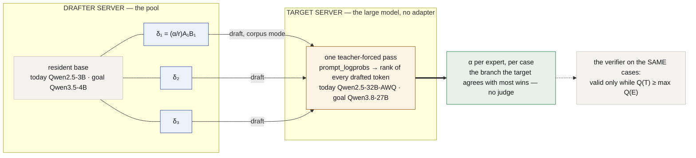
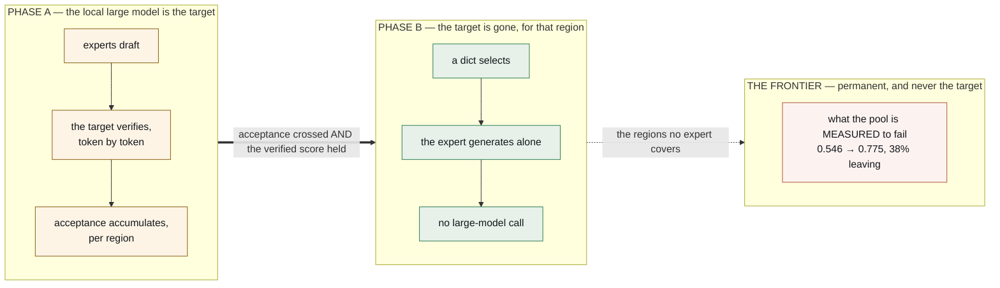

# lora-kernel

**A pool of QLoRA deltas over one resident base model, ranked by a larger model of
the same family that verifies their tokens, with a frontier model as the permanent
fallback for what the pool is measured to fail.** Nothing else is neural.

*[Léeme en español](README.es.md)*

**It runs inside a real agent.** [OpenClaw](https://docs.openclaw.ai/cli) on a laptop
→ a local proxy → a tunnel → vLLM on a rented card → a QLoRA of ours → back, with the
inbox tools handed to the agent over MCP and **zero requests leaving the machine** for
anything the pool serves **[ran]** P43. Step by step: [`docs/OPENCLAW.md`](docs/OPENCLAW.md).

Every claim about this repository is **[ran]** with its run directory; every claim
about anything else is **[read]** and cited; what could not be checked from here is
**[unverified]** and never load-bearing. Every formula is derived, step by step and
tied to its run, in [`docs/FOUNDATIONS.md`](docs/FOUNDATIONS.md). **The rule this
project keeps: every document carries its mathematics, and every Colab run updates
the formula it instantiates.**

---

## What this is for, and what to expect from it

**Not** a 3B model that beats a frontier model. **A tiered architecture that absorbs
the high-volume, repetitive part of an organisation's traffic locally and sends only
the residue out** — and the numbers below are the reason the sentence is written that
way.

### The measured points

| configuration | delivered accuracy | leaves the machine | run |
|---|---:|---:|---|
| everything local — the pool alone | **0.546** | 0 % | **[ran]** P41 |
| **the failing region routed to the frontier** | **0.775** | **38 %** | **[ran]** P41 |
| one expert, on its own task, served as its corpus teaches | **0.992** (human messages 0.989) | 0 % | **[ran]** P55 A |
| the same expert, served through `tool_calls` | 0.808 (human 0.741, bar 0.655, $p = 0.00036$) | 0 % | **[ran]** P43 |

The first two rows are the whole thesis in miniature. The original plan called the
frontier *scaffolding* to be withdrawn once the experts matched it; withdrawing it
measured **0.546**. Keeping it for what the pool is *measured* to fail — routed by
region, not guessed per case — measured **0.775** with 62 % of the traffic never
leaving. **The frontier stays. It stays for the residue.**

### The economics, as a model with its inputs labelled

Let a fraction $\rho$ of requests be served locally and $1-\rho$ go to a frontier API.
With $c_L$ the marginal cost of a local request and $c_F$ of a frontier one,

$$
\frac{\text{cost}_{\text{hybrid}}}{\text{cost}_{\text{frontier}}}
\;=\; \rho\,\frac{c_L}{c_F} + (1-\rho),
\qquad
\text{quality}_{\text{hybrid}} = \rho\,Q_L + (1-\rho)\,Q_F .
$$

What is **measured**: $\rho = 0.62$ and $\text{quality} = 0.775$ on the two-region
pool **[ran]** P41; a local expert on its own region at $Q_L \approx 0.99$ **[ran]**
P55 A; a local delta of **119,801,528 bytes** over a base that is read once per
token **[ran]**. What is **estimated, and said so**: $c_L/c_F$. A local token is a
share of one GPU-hour amortised over every request that hour; a frontier token is a
list price. Whatever the ratio is at your prices, the cost line above is linear in
it, and with $\rho = 0.62$ the hybrid sits between **38 % of frontier cost** (at
$c_L \to 0$) and frontier cost (at $c_L = c_F$). Three further reductions are
measured in shape and not yet in tokens: the tool surface an agent offers is pruned
from **54 lines to 3** before the prompt is built (#190 **[ran]**); the instructions
that would live in a system prompt live in the weights instead; and **nothing that
the pool serves is sent anywhere** **[ran]** P43.

### Where small experts work, and where they fail — both measured

**They work as assembly-line workers on a closed region**: a fixed task, fixed tools,
a mechanical rule. `email-full` learns *which* tool, *with what argument*, and the
rule *at least two of four signals* to **0.989** on human messages **[ran]**; the
fluids expert reproduces its teacher's procedure step for step, **30/30** inside its
region **[ran]** P9.

**They fail at the edge, silently.** The same fluids expert falls to **1 of 20** on
families it never saw — *with the same fluency, the same structure and the same
confidence*, inventing formulas **[ran]** P22. Below its training depth it
over-solves on **18 of 18** cases and the bare base beats it, 0.167 to 0.000 **[ran]**
P45. Every *behavioural* guard tried — tool-call rate, transcript length, a tripwire —
scored **0.62 against a chance of 0.60** **[ran]** P18. One *structural* guard
survives: dimensional algebra over $(\text{kg}, \text{m}, \text{s})$ catches **0.80** of
out-of-region work, false-alarms 0.22 alone, and combined with the mechanical check
fires **0 of 60** in region while still catching 0.35 outside **[ran]** P22.

So: **use them where the task repeats thousands of times a day and the rule is
knowable; do not use them alone where a silent failure costs more than the call it
saved.**

### Small models only — not today, and the long-run ratio is a hypothesis

Today the guards are not reliable enough to run without the fallback, and the number
that says so is the one above: 0.62 against 0.60. The mechanisms this architecture
bets on for moving $\rho$ up are three, each with the mathematics it rests on:

1. **Structural routing, not inferred routing.** The software's own structure — the
   room, the form, the endpoint — names the expert. A twelve-keyword dict already
   routes the coarse case at **1.000** **[ran]**; that is a criticism of the suite as
   much as a win, and it is also how a real deployment routes
   ([`docs/CASE-TEAM.md`](docs/CASE-TEAM.md): the standing group *is* the region).
2. **Mechanical verification, then escalate.** Where the expert's output can be
   checked — a schema, a test, a rule such as `important()` — the frontier is called
   only when the check fails. That is the withdrawal condition
   $Q_R(E) \ge Q_R(E\mid T) - \varepsilon$ on a paired test, measured once in region
   with a calculator standing in for the target: gap **0.000** **[ran]** P7.
3. **Speculative decoding inside one family.** A small expert drafts, a local larger
   model verifies in one pass, and the emitted tokens are distributed exactly as the
   larger model's (§ *How it works*). Where it holds, the *quality* of the large
   model comes at close to the *cost* of the small one — and its acceptance rate
   ranks the experts with no judge.

**The expectation, then:** $\rho$ around 0.6 is measured on a two-region pool; the
mechanisms above are what would move it towards 0.85–0.9 on regions that are
structurally named and mechanically checkable. **That ratio is a hypothesis with a
route, not a result**, and 1.0 is not on the route at all: out-of-distribution work
and the arbitration of the residue are what the frontier is kept for.

---

## The thesis, with the formula beside each replacement

| what it is today | what it becomes | the mathematics |
|---|---|---|
| an agent | **a domain QLoRA**, ~114 MB, hot-swapped per request | $W' = W + \tfrac{\alpha}{r}AB$ on seven projections per block — **29,933,568** parameters at $r=16$, **119,801,528** bytes on disk, derivation and artefact agree **[ran]** |
| the router — an extra model call | **a dict** for the coarse route (1.000 with twelve keywords **[ran]**) and **acceptance** for ranking experts that resemble each other | $\arg\max_i \alpha_T(E_i, c)$, valid iff $Q(T) \ge \max_i Q(E_i)$ |
| the harness — schemas, parsers, retries | **corpus-mode serving**: stop at `</tag>`, inject the real result, continue | $s_j = s_{j-1}\,\|\,\tilde s_j\,\|\,\texttt{= tool}(\tilde s_j)$ |
| the evolution loop | **a tournament over adapters**, promoted on a paired test | $p = \min(1, 2\Pr[\mathrm{Bin}(n_d,\tfrac12)\ge\max(u,n_d-u)])$ |
| memory, execution | markdown + git; a sandbox — **deliberately not neural** | — |

---

## The goal: `Qwen3.8-27B` as the large model, and the route there

Speculative decoding needs two models with **the same id space** (FOUNDATIONS §3.2):
a drafted id must name the same string to both. Whether a pair is usable is a fact
about the *pair*, never about one model — and the table is indexed that way, because
an earlier version of it read as a verdict on the 27B and was wrong:

| drafter → target | tokenizer ids | id map | target-only ids | usable |
|---|---:|---|---:|---|
| **Qwen2.5-3B → Qwen2.5-32B** *(today)* | 151,643 | byte-identical file | 0 | **yes** **[ran]** P48 |
| Qwen2.5-3B → Qwen3-32B | 151,643 | identical map | 4 (`<think>`, …) | yes **[ran]** P48 |
| Qwen2.5-3B → Qwen3.5 / 3.6 / 3.8-27B | 151,643 vs **248,044** | different | — | **no** **[ran]** P48 — *the 2.5 drafters cannot reach it* |
| **Qwen3.5-2B / 4B → Qwen3.8-27B** *(the goal)* | 248,044 | identical map | 7, all audio/TTS specials; `<think>` shared | **yes** **[ran]** D0 |

So the 27B is reachable, and the drafter is what moves: the pool migrates from a
`Qwen2.5-3B` base to a `Qwen3.5-4B` base. **The target itself needs no LoRA** — it
verifies, it never holds an adapter — so nothing about serving adapters constrains it.
What constrains the *drafter* is one measured fact, C18: vLLM 0.29.0 loads a LoRA on
`Qwen3.5-4B`, logs that it did, and serves the base anyway, while the same procedure
on `Qwen2.5-3B` comes back `applied` **[ran]** P33. The route, as mechanisms:

| # | mechanism | state | gate |
|---|---|---|---|
| **D0** | a 3.x drafter sharing an id space with the 27B | ✅ **[ran]** | id map identical, no collisions |
| **D1** | C18 under a newer vLLM | void — the chain installs the latest and it is **0.29.0**, P33's version **[ran]** | — |
| **D2** | **the C18 mechanism**, read with the log in hand: G3 merge-and-serve; the PEFT-key ↔ vLLM-module mapping | **next** | `applied` on the identity gate |
| **D3** | thinking off on the 27B | inside D4 | `<think>` ids emitted on the suite: **0** |
| **D4** | the P55 instrument, `--base Qwen/Qwen3.5-4B --target Qwen/Qwen3.8-27B`, graded pool retrained on the 3.5-4B | blocked on D2 | the same verdict table as M2 |

**Why the goal is not the first step.** Every mechanism below is target-agnostic given
the id space; the instrument built on Qwen 2.5 is the one D4 runs. If acceptance turns
out not to rank on 2.5 (M2), D4 would buy a faster version of a mechanism that does
not work. Nothing in M depends on D; D4 depends on all of M.

---

## How it works, block by block

### The drafter: one base, a pool of deltas

A decoder block maps $h \in \mathbb{R}^{T\times d}$ through seven linear maps —
$W_q, W_k, W_v, W_o$ around causal attention with RoPE and grouped-query heads, and
$W_{gate}, W_{up}, W_{down}$ in a SwiGLU MLP (FOUNDATIONS §1.2). An expert patches
exactly those seven in every block:

$$
xW' \;=\; xW \;+\; \tfrac{\alpha}{r}\,(xA)B,
\qquad A\in\mathbb{R}^{d_{in}\times r},\ B\in\mathbb{R}^{r\times d_{out}},\ r=16.
$$

$W$ is never touched, so the base stays resident and a request batch in which request
$j$ names adapter $i(j)$ is one shared GEMM plus a gathered pair of thin ones,

$$
y_j = x_j W + s\,(x_j A_{i(j)})\,B_{i(j)},
$$

which is what vLLM's Punica / `bgmv` kernels compute **[read]** and what
`--enable-lora --max-loras k --lora-modules name=path` turns on **[ran]**. **C18 is the
test that the second term is present**: same prompt through base and adapter, texts
must differ. `--max-loras` has only ever been 1 or 2 here; S-LoRA reports thousands on
one machine **[read]**, and ours is untested above two.

On the 3.5/3.8 line the block is different — three **Gated DeltaNet** linear-attention
layers for every full-attention one **[read]** `config.json`, the recurrence

$$
S_t = \alpha_t\,(I - \beta_t k_t k_t^\top)\,S_{t-1} + \beta_t\,k_t v_t^\top,\qquad o_t = S_t^\top q_t,
$$

with a fixed $d_k\times d_v$ state per layer instead of a growing KV cache. **Its
projections are still linear maps** $\tilde hW$, so the delta above applies to them
unchanged; whether the *engine* applies it is C18, a property of the kernel path and
not of the algebra.

### The target: one teacher-forced pass verifies a whole draft

Generation is the recursion $x_t \sim p(\cdot\mid x_{<t})$; decode reads every weight
once per token, so its floor is $t_{\text{step}} \gtrsim B_W/\mathcal B$ — **~13
ms/token for a 19.3 GB target on an A100** — and a 27B with 48 recurrent layers is
slow per token for the same reason. A verify pass over a prefix and $k$ drafted ids
costs **one** such read for all $k+1$ positions (FOUNDATIONS §2.3–2.4). At temperature
0 the target is one-hot, so speculative decoding's acceptance test
$\min(1, p_T/q)$ collapses to

$$
\text{accept } \tilde x_i \iff \tilde x_i = \arg\max_v\, p_T(v \mid \text{prefix}, \tilde x_{<i}),
$$

read here as *rank = 1* in the target's `prompt_logprobs` — the full teacher-forced
distribution along a given text, returned by one prefill, generating nothing
**[ran]** P55 A. The emitted sequence is distributed exactly as the target's whatever
the drafter is (FOUNDATIONS §6.2), which is why acceptance is a statement *about the
drafter*. With per-token rate $\alpha$ and $k$ drafts,

$$
\mathbb{E}[\tau] = \frac{1-\alpha^{k+1}}{1-\alpha},
\qquad
\text{speed-up} = \frac{\mathbb{E}[\tau]}{k\,c + 1},\quad c = \frac{t_{\text{draft}}}{t_{\text{target}}},
$$

and the gain grows as $c \to 0$ — a 4B drafting for a slow 27B is exactly the regime
where a large, recursive target justifies the machinery. **No α has been measured yet;
the instrument is built.**

On a hybrid target the verify pass runs the drafted tokens through the recurrence
above inside vLLM's chunked GDN prefill kernel and through the full-attention layers
with their paged KV; the seven target-only ids are modality specials the text task
never reaches, and `<think>` — shared by both models — is a serving flag (D3).

### Inside vLLM: which parts do what

| component | job here | evidence |
|---|---|---|
| engine + scheduler (continuous batching) | $n$ sequences share one weight read per step; 475 chains through the 3B in **31 s**, the 32B in **230 s** at concurrency 8 | **[ran]** P55 A |
| PagedAttention KV cache | $\text{bytes}_{KV}(t) = 2LH_{kv}d_h\,t\,b$ — 36 KB/token on the 3B, 256 KB/token on the 32B | **[read]** config |
| GDN state cache (`Mamba cache mode … align`) | the fixed $S_t$ per linear layer on 3.5/3.8 models | **[ran]** P33 log |
| `LoRAModelManager` + `PunicaWrapper` (`bgmv` shrink/expand) | the gathered delta term on the **drafter's** `Linear` modules; the log names which modules it skips — on `Qwen3.5-4B` every skipped one was `visual.*` | **[ran]** P33 log |
| OpenAI server: `/v1/completions` with `stop`, `include_stop_str_in_output` | the corpus-mode loop: generate to `</tag>`, inject, continue | **[ran]** P55 A |
| OpenAI server: `prompt_logprobs` | the target's rank of every drafted token in one prefill | **[ran]** P55 A |
| native speculative worker (`speculative_config`) | **not used**: it binds one drafter at start-up; per-request adapter forwarding into it is **[unverified]** | — |

**Two instances, then.** The drafter server holds the base and the pool; the target
server holds the large model alone. The drafter writes the whole chain in corpus
mode; the target scores it by `prompt_logprobs`. Under the argmax identity the
per-token verdicts are exactly what a fused loop would compute — one prefill per span
rather than per round, more expensive per token and equally informative, and it needs
nothing from vLLM's speculative path. It also gives no wall-clock speed-up, which this
project is not buying: **latency is EAGLE's** — a per-target head trained on the
target's hidden states drafts better than any separate expert **[read]** — and what a
single bound head cannot do is compare $k$ different experts. **Ranking is ours.**

### Why acceptance ranks — and when it cannot

For experts $E_1,\dots,E_m$ on a suite with a mechanical verifier, verified quality is
$Q(E)$ and acceptance is $\alpha_T(E) = $ the fraction of $E$'s decision tokens the
target would have written. **The claim:**

$$
Q(E_a) > Q(E_b) \;\Rightarrow\; \alpha_T(E_a) > \alpha_T(E_b),
$$

an ordering of experts with no judge at serving time. It is only about *quality* when
$Q(T) \ge \max_a Q(E_a)$: below that, $\alpha$ rewards the expert that shares the
target's mistakes. That inequality is a gate, tested as a paired sign test before any
acceptance is bought, and **it fired on the triage suite**: the untrained 32B got every
fact and misapplied the rule, $0.746 < 0.989$, expert right where target wrong on 87
cases against 2 **[ran]** P55 A. The instrument was ready and correctly not run. The
desk's `commitment` region is where the same 32B is measured at **1.000 on every
depth** **[ran]** P51 — P55b runs there.

---

## Withdrawal — of the local target, per region; the frontier stays

The large target is scaffolding *per region*. While it verifies, every accepted or
rejected token is a free datum: for each region of the problem space, which expert
the target keeps agreeing with. When an expert's acceptance crosses the threshold you
chose **and the verified score holds without the target** — $Q_R(E) \ge Q_R(E\mid T) -
\varepsilon$ on a paired test — the target comes out of that region and the expert
generates alone. A frontier API is never the target — no forced logprobs (C2), no
shared ids (C3) — it is the permanent **fallback** for what the pool is *measured* to
fail: **0.546 → 0.775** with 38 % of cases leaving **[ran]** P41.

---

## Progress, summarised

**Built and measured.** One resident base; deltas switched by the `model` field;
served by vLLM behind an OpenAI endpoint; reachable from a real agent with nothing
leaving; the tool surface pruned to what each member declares. One expert at
**0.989** on its own region, **released as `email-full@v1`**: re-served it reproduces its record
case for case, and a re-training from the same corpus ties it 1 : 0 **[ran]** P57; the serving
path that was costing it 18 points found and fixed. The acceptance instrument built, preflighted and gated. The id spaces measured
by pair; the route to `Qwen3.8-27B` named mechanism by mechanism.

**Not yet.** Acceptance has never been measured against any target, and the ordering
verdict has never been run — the two rows FOUNDATIONS §11 marks *not measured*. A
pool larger than two. The 3.x drafter. The tournament.

| # | mechanism | state | gate |
|---|---|---|---|
| **M0** | the drafter served **in corpus mode** — through `tool_calls` it *invents* the result it cannot receive | ✅ **[ran]** 0.808 → **0.992** | stop honoured; adapter ≠ base on 8 probes (C18) |
| **M-target** | a target worth accepting against **on this task** | ❌ triage: **0.746 < 0.989**, 2 : 87 **[ran]**; ✅ desk `commitment`: 32B **1.000** at every depth **[ran]** P51 | beats the best expert, paired, $p\le0.05$ |
| **M-α** | acceptance in **tokens** by forced `prompt_logprobs` | ✅ preflights pass **[ran]**; not yet run | templates identical; one entry per token with `rank` |
| **M1** | **experts that differ in quality** — graded nested corpora | ✅ on one bit **[ran]** P55b: `g25` 0, `g75` **240/240**, `g600` **240/240** — the risk named came true, **no intermediate grade** | verifier resolves ≥ 1 pair, or the target is not served |
| **M2** | **the ordering test** — the thesis | ❌ **not bought, twice [ran]**: on triage the 32B is below the expert (0.746 < 0.989); on the desk too (0.967 < 1.000, 0 : 8). **An untrained same-family 32B is not a valid target for a task a 3B was trained on.** Redesign counter 2 of 3 | SUPPORTED / FALSIFIED / UNRESOLVED-as-failure, written before the run |
| **D0–D4** | the route to `Qwen3.8-27B` | D0 ✅, D1 void, **D2 next**, D4 blocked on D2 | see above |

The steps that got here, each with its number, are in
[`docs/EXPERIMENT_PLAN.md`](docs/EXPERIMENT_PLAN.md); the compact record:

| | objective | state |
|:--:|---|---|
| **S1** | a real gap against the frontier | ✅ **+0.533** once the prompt stopped telling the baseline not to think |
| **S4** | the expert specialises per region | ✅ **+63.3** |
| **S5** | the withdrawal gap closes, with a calculator standing in for the target | ✅ **0.000** in region |
| **S9** | a region that is somebody's morning, end to end inside a real agent | ✅ **0.741** through `tool_calls` (P43) → **0.989** in corpus mode (P55 A), zero requests leaving |
| **S10** | the base the pool runs on | ✅ **Qwen 2.5, decided against a control** — C18 on `Qwen3.5-4B` |
| **S8** | the pool behind an OpenAI endpoint | 🟢 tags→`tool_calls` domain-free, 604/604; the surface pruned to what each member declares (#190) |
| **S3** | the router beats a lookup table | 🟡 ties a twelve-keyword dict at **1.000** — the members are too far apart to meet in one problem |
| **S6** | `harness.lora` — protocol apart from the expert | 🟡 parked, and reopened below as the experimental extra |
| **S7** | the tournament | 🟢 fitness fixed: both judges must accept |

### What has actually run

| claim | measurement | where |
|---|---|---|
| **The serving path was costing 18 points** | the same 598-example adapter: 0.808 through `tool_calls`, **0.992** in corpus mode, reproduced in two sessions at 31 s | `results/P55-graded-ranking-20260916/` |
| **An untrained 32B is not a valid target on triage** | human 0.746 vs the expert's 0.989, paired **2 : 87**, $p=0$; it gets the facts and misapplies the rule | same |
| **The id spaces, by pair** | 2.5 → 2.5-32B byte-identical; 2.5 → 3.x-27B impossible; **3.5-2B/4B → 3.8-27B identical, 7 audio/TTS specials** | `results/P48-…/`, `results/P55-…/D0-tokenizers.txt` |
| **C18** | vLLM loads a LoRA on `Qwen3.5-4B` and serves the base; the control on `Qwen2.5-3B` applies; the skipped modules are all `visual.*` | `results/P33-lora-matrix-20260914/` |
| **The desk has a target and a gradient** | `commitment`: 32B **1.000** at every depth, one `message` call each; base 1.000 → 0.000 | `results/P51-desk-profile-20260916/` |
| **One expert clears its gate inside a real agent** | 260/351 = 0.741, exact $p=0.00036$; OpenClaw → proxy → tunnel → vLLM → QLoRA, zero requests leaving | `results/P43-openclaw-e2e-20260915/` |
| **Routing by region pays; by case it does not** | 0.546 → **0.775** with 38 % leaving; per-case rules 0.378 and 0.689 | `results/P41-routing-20260915/` |
| **The expert cannot feel its edge; a structural guard can** | 30/30 in region → 1/20 outside with the same confidence; behavioural guards 0.62 vs chance 0.60; dimensional algebra catches 0.80, combined fires 0/60 in region | `results/P18-…/`, `results/P22-dimensions-20260912/` |
| **An expert is locked to its corpus's depth** | below its band it over-solves **18 of 18**; at three steps the bare base beats it 0.167 : 0.000 | `results/P45-ladder-sweep-20260915/` |
| **69–82 % of a calibration gap was the suite** | grouped by what a predictor can see, the ceiling leaves room 0.030 and 0.007 | `results/P46-ranking-ceiling-20260916/` |
| **The coarse route needs no model** | twelve keywords, **1.000** over 200 cases; the fine route falls to 0.845 | `tests/test_router_baseline.py` |
| **Acceptance by characters measures format** | identical answers 0.00 across formats, different answers 0.44 within one — the reason α is now in tokens on a shared id space | `results/S0*/` |
| **The withdrawal gap closes, with a calculator** | adapter + calculator **40/40** = the teacher; base + calculator 0/40 | `results/P7-calculator-20260908/` |

---

## Experimental extra: how much of the harness can be a LoRA

The original design had a `harness.lora` — the execution protocol in weights, so
that the schema leaves the prompt and the format is emitted rather than parsed. It
was parked on numbers, and the numbers are why it is reopened only as an
experiment:

| measured | what it says |
|---|---|
| a learned protocol **9/30** where twenty lines of `re` score **23/30**, on a suite with one tool **[ran]** P13 | where the call is a copy of an expression already written, code wins and weights cannot |
| the same protocol adapter on a **second subject** it was never edited for: **27 of 63** calls where the hand-written rule writes **0 of 63** **[ran]** P25 | a hand-written harness transfers nothing; a learned one transfers part of itself |
| a convention keyed on parameter count recovers **55 %** of the schema→tags cost with **0** domain lines **[ran]** P28 | most of the harness's value is a handful of structural conventions, not knowledge |

**The experimental question, stated so it can fail:** for a fixed, narrow tool
surface — the three inbox tools, the four desk tools — can the *decision* of which
tool to call and how to fill its argument live in the weights, with the *execution*
(stop, inject, continue) left to twenty lines of harness? P55 A already shows one
half: `email-full` makes the decision at **0.989** with **0 refused** calls and the
harness executes. The gate for the other half is the one S6 set and missed:
malformed-call rate **and** tokens, both against the code incumbent, on a surface
where the call is *not* a copy. Not a product claim; a bounded experiment with its
own number to beat.

## What is deliberately not a LoRA

**Memory** — markdown under git, because a weight delta cannot be read, diffed or
corrected by a person. **Execution** — the sandbox where tools run.

## How this is released

Open-core. **Open:** the runtime — multi-LoRA over vLLM, the acceptance instrument,
the withdrawal machinery; the protocol specification; the markdown + git memory
connector. **Not open:** trained vertical adapter packs; the managed dream/evolution
pipeline; the enterprise control plane.

## Lineage

| | |
|---|---|
| [`evolving-agents`](https://github.com/EvolvingAgentsLabs/evolving-agents) | The active repository — flows, memory at four levels, agents as markdown |
| [`gemma4nanoloop`](https://github.com/EvolvingAgentsLabs/gemma4nanoloop) | The measured case that a small local model runs a closed loop |
| `agentvcs` | Versions code, skills, goals, models and traces together — the substrate the tournament scores over |

## Documents

- [`docs/FOUNDATIONS.md`](docs/FOUNDATIONS.md) — **the mathematics, step by step and
  tied to what ran** · [es](docs/es/FOUNDATIONS.md)
- [`docs/SUBSTRATE-GATE.md`](docs/SUBSTRATE-GATE.md) — Phase 0: the serving substrate as a
  gate, and why each of its four checks exists · [es](docs/es/SUBSTRATE-GATE.md)
- [`docs/EXPERIMENT_PLAN.md`](docs/EXPERIMENT_PLAN.md) — every step with its gate,
  falsification and number · [es](docs/es/EXPERIMENT_PLAN.md)
- [`docs/STACK.md`](docs/STACK.md) — the inventory: every model id, adapter
  hyperparameter and vLLM flag, with its run · [es](docs/es/STACK.md)
- [`docs/ARCHITECTURE.md`](docs/ARCHITECTURE.md) — the seven layers, the mathematics of
  each, and the withdrawal condition · [es](docs/es/ARCHITECTURE.md)
- [`docs/TECHNICAL-REFERENCE.md`](docs/TECHNICAL-REFERENCE.md) — the mechanisms and the
  formula behind each · [es](docs/es/TECHNICAL-REFERENCE.md)
- [`docs/REPORT.md`](docs/REPORT.md) — the original plan against what happened ·
  [es](docs/es/REPORT.md)
- [`docs/OPEN-PROBLEMS.md`](docs/OPEN-PROBLEMS.md) — the open problems, without jargon ·
  [es](docs/es/OPEN-PROBLEMS.md)
- [`docs/OPENCLAW.md`](docs/OPENCLAW.md) — pointing a real agent at the pool ·
  [es](docs/es/OPENCLAW.md)
- [`docs/CASE-TRIAGE.md`](docs/CASE-TRIAGE.md), [`docs/CASE-TEAM.md`](docs/CASE-TEAM.md)
  — one person's morning; many groups on one GPU
- [`tests/README.md`](tests/README.md) — every test file and the identity it guards
- [`docs/the-frontier-is-scaffolding.md`](docs/the-frontier-is-scaffolding.md) — the
  article · [es](docs/es/the-frontier-is-scaffolding.md)

## Acknowledgement

This line of enquiry began with a conversation with
**[Ismael Faro](https://github.com/ismaelfaro)**, who suggested studying
speculative decoding and what it could be used for.

---

Apache 2.0 · [Evolving Agents Labs](https://github.com/EvolvingAgentsLabs)
