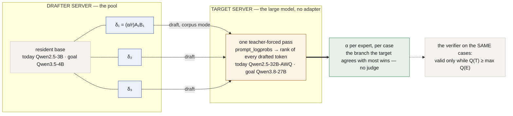
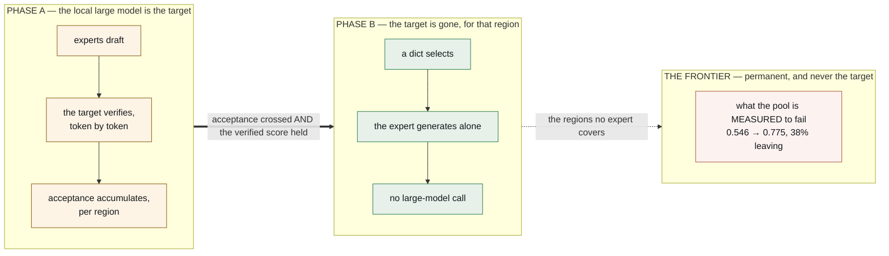

# lora-kernel

**The entire agentic system is a pool of QLoRA deltas over one resident base model,
ranked by a larger model of the same family that verifies their tokens.** Nothing
else is neural.

*[Léeme en español](README.es.md)*

**It runs inside a real agent.** [OpenClaw](https://docs.openclaw.ai/cli) on a laptop
→ a local proxy → a tunnel → vLLM on a rented card → a QLoRA of ours → back, with the
inbox tools handed to the agent over MCP and **zero requests leaving the machine** for
anything the pool serves **[ran]** P43. Step by step: [`docs/OPENCLAW.md`](docs/OPENCLAW.md).

> **Status, 2026-09-17.** Every claim about this repository is **[ran]** with its run
> directory; every claim about anything else is **[read]** and cited; what could not
> be checked from here is **[unverified]** and never load-bearing.
>
> - **The substrate is measured, three times over:** one resident base, deltas
>   switched by the `model` field, served by vLLM, reachable from a real agent.
> - **One expert is genuinely good.** Served the way its corpus teaches, `email-full`
>   scores **0.992** (human messages **0.989**), against **0.808** through `tool_calls`
>   **[ran]** P55 A — the serving path, not the weights, was costing 18 points.
> - **The central claim has an instrument and no verdict yet.** Acceptance in tokens
>   against a same-family target is built and preflighted; on the triage suite the
>   untrained 32B scored **0.746 < 0.989**, so the gate refused to buy a ranking against
>   a weaker target **[ran]** P55 A. The next run is on a suite where the target is
>   measured stronger (P55b).
> - **The goal is `Qwen3.8-27B` as the large model**, and the route to it is a short
>   list of mechanisms, one of which is blocked and named below.

---

## The thesis

A multi-agent system today is Python orchestrating API calls: a router model, a
planner model, JSON schemas in every prompt, a parser guessing whether the model meant
to call a tool. Replace all of it with **weight deltas on one resident base**:

| what it is today | what it becomes | the mathematics |
|---|---|---|
| an agent | **a domain QLoRA**, ~114 MB, hot-swapped per request | $W' = W + \tfrac{\alpha}{r}AB$ on seven projections per block — **29,933,568** parameters at $r=16$, **119,801,528** bytes on disk, derivation and artefact agree **[ran]** |
| the router — an extra model call | **a dict** for the coarse route (1.000 with twelve keywords **[ran]**) and **acceptance** for ranking experts that resemble each other | $\arg\max_i \alpha_T(E_i, c)$, valid iff $Q(T) \ge \max_i Q(E_i)$ |
| the harness — schemas, parsers, retries | **corpus-mode serving**: stop at `</tag>`, inject the real result, continue | $s_j = s_{j-1}\,\|\,\tilde s_j\,\|\,\texttt{= tool}(\tilde s_j)$ |
| the evolution loop | **a tournament over adapters**, promoted on a paired test | $p = \min(1, 2\Pr[\mathrm{Bin}(n_d,\tfrac12)\ge\max(u,n_d-u)])$ |
| memory, execution | markdown + git; a sandbox — **deliberately not neural** | — |

Every formula is derived, step by step and tied to its run, in
[`docs/FOUNDATIONS.md`](docs/FOUNDATIONS.md). **The rule this project keeps: every
document carries its mathematics, and every Colab run updates the formula it
instantiates.**

---

## The goal: `Qwen3.8-27B` as the large model, and the route there

Speculative decoding needs two models with **the same id space** (FOUNDATIONS §3.2):
a drafted id must name the same string to both. Whether a pair is usable is a fact
about the *pair*, never about one model — and the table is indexed that way, because
an earlier version of it read as a verdict on the 27B and was wrong:

| drafter → target | tokenizer ids | id map | target-only ids | usable |
|---|---:|---|---:|---|
| **Qwen2.5-3B → Qwen2.5-32B** *(today)* | 151,643 | byte-identical file | 0 | **yes** **[ran]** P48 |
| Qwen2.5-3B → Qwen3-32B | 151,643 | identical map | 4 (`<think>`, …) | yes **[ran]** P48 |
| Qwen2.5-3B → Qwen3.5 / 3.6 / 3.8-27B | 151,643 vs **248,044** | different | — | **no** **[ran]** P48 — *the 2.5 drafters cannot reach it* |
| **Qwen3.5-2B / 4B → Qwen3.8-27B** *(the goal)* | 248,044 | identical map | 7, all audio/TTS specials; `<think>` shared | **yes** **[ran]** D0 |

So the 27B is reachable, and the drafter is what moves: the pool migrates from a
`Qwen2.5-3B` base to a `Qwen3.5-4B` base. **The target itself needs no LoRA** — it
verifies, it never holds an adapter — so nothing about serving adapters constrains it.
What constrains the *drafter* is one measured fact, C18: vLLM 0.29.0 loads a LoRA on
`Qwen3.5-4B`, logs that it did, and serves the base anyway, while the same procedure
on `Qwen2.5-3B` comes back `applied` **[ran]** P33. The route, as mechanisms:

| # | mechanism | state | gate |
|---|---|---|---|
| **D0** | a 3.x drafter sharing an id space with the 27B | ✅ **[ran]** | id map identical, no collisions |
| **D1** | C18 under a newer vLLM | void — the chain installs the latest and it is **0.29.0**, P33's version **[ran]** | — |
| **D2** | **the C18 mechanism**, read with the log in hand: G3 merge-and-serve; the PEFT-key ↔ vLLM-module mapping | **next** | `applied` on the identity gate |
| **D3** | thinking off on the 27B | inside D4 | `<think>` ids emitted on the suite: **0** |
| **D4** | the P55 instrument, `--base Qwen/Qwen3.5-4B --target Qwen/Qwen3.8-27B`, graded pool retrained on the 3.5-4B | blocked on D2 | the same verdict table as M2 |

**Why the goal is not the first step.** Every mechanism below is target-agnostic given
the id space; the instrument built on Qwen 2.5 is the one D4 runs. If acceptance turns
out not to rank on 2.5 (M2), D4 would buy a faster version of a mechanism that does
not work. Nothing in M depends on D; D4 depends on all of M.

---

## How it works, block by block

### The drafter: one base, a pool of deltas

A decoder block maps $h \in \mathbb{R}^{T\times d}$ through seven linear maps —
$W_q, W_k, W_v, W_o$ around causal attention with RoPE and grouped-query heads, and
$W_{gate}, W_{up}, W_{down}$ in a SwiGLU MLP (FOUNDATIONS §1.2). An expert patches
exactly those seven in every block:

$$
xW' \;=\; xW \;+\; \tfrac{\alpha}{r}\,(xA)B,
\qquad A\in\mathbb{R}^{d_{in}\times r},\ B\in\mathbb{R}^{r\times d_{out}},\ r=16.
$$

$W$ is never touched, so the base stays resident and a request batch in which request
$j$ names adapter $i(j)$ is one shared GEMM plus a gathered pair of thin ones,

$$
y_j = x_j W + s\,(x_j A_{i(j)})\,B_{i(j)},
$$

which is what vLLM's Punica / `bgmv` kernels compute **[read]** and what
`--enable-lora --max-loras k --lora-modules name=path` turns on **[ran]**. **C18 is the
test that the second term is present**: same prompt through base and adapter, texts
must differ.

On the 3.5/3.8 line the block is different — three **Gated DeltaNet** linear-attention
layers for every full-attention one **[read]** `config.json`, the recurrence

$$
S_t = \alpha_t\,(I - \beta_t k_t k_t^\top)\,S_{t-1} + \beta_t\,k_t v_t^\top,\qquad o_t = S_t^\top q_t,
$$

with a fixed $d_k\times d_v$ state per layer instead of a growing KV cache. **Its
projections are still linear maps** $\tilde hW$, so the delta above applies to them
unchanged; whether the *engine* applies it is C18, a property of the kernel path and
not of the algebra.

### The target: one teacher-forced pass verifies a whole draft

Generation is the recursion $x_t \sim p(\cdot\mid x_{<t})$; decode reads every weight
once per token, so its floor is $t_{\text{step}} \gtrsim B_W/\mathcal B$ — **~13
ms/token for a 19.3 GB target on an A100** — and a 27B with 48 recurrent layers is
slow per token for the same reason. A verify pass over a prefix and $k$ drafted ids
costs **one** such read for all $k+1$ positions (FOUNDATIONS §2.3–2.4). At temperature
0 the target is one-hot, so speculative decoding's acceptance test
$\min(1, p_T/q)$ collapses to

$$
\text{accept } \tilde x_i \iff \tilde x_i = \arg\max_v\, p_T(v \mid \text{prefix}, \tilde x_{<i}),
$$

read here as *rank = 1* in the target's `prompt_logprobs` — the full teacher-forced
distribution along a given text, returned by one prefill, generating nothing
**[ran]** P55 A. The emitted sequence is distributed exactly as the target's whatever
the drafter is (FOUNDATIONS §6.2), which is why acceptance is a statement *about the
drafter*. With per-token rate $\alpha$ and $k$ drafts,

$$
\mathbb{E}[\tau] = \frac{1-\alpha^{k+1}}{1-\alpha},
\qquad
\text{speed-up} = \frac{\mathbb{E}[\tau]}{k\,c + 1},\quad c = \frac{t_{\text{draft}}}{t_{\text{target}}},
$$

and the gain grows as $c \to 0$ — a 4B drafting for a slow 27B is exactly the regime
where a large, recursive target justifies the machinery. **No α has been measured yet;
the instrument is built.**

On a hybrid target the verify pass runs the drafted tokens through the recurrence
above inside vLLM's chunked GDN prefill kernel and through the full-attention layers
with their paged KV; the seven target-only ids are modality specials the text task
never reaches, and `<think>` — shared by both models — is a serving flag (D3).

### Inside vLLM: which parts do what

| component | job here | evidence |
|---|---|---|
| engine + scheduler (continuous batching) | $n$ sequences share one weight read per step; 475 chains through the 3B in **31 s**, the 32B in **230 s** at concurrency 8 | **[ran]** P55 A |
| PagedAttention KV cache | $\text{bytes}_{KV}(t) = 2LH_{kv}d_h\,t\,b$ — 36 KB/token on the 3B, 256 KB/token on the 32B | **[read]** config |
| GDN state cache (`Mamba cache mode … align`) | the fixed $S_t$ per linear layer on 3.5/3.8 models | **[ran]** P33 log |
| `LoRAModelManager` + `PunicaWrapper` (`bgmv` shrink/expand) | the gathered delta term on the **drafter's** `Linear` modules; the log names which modules it skips — on `Qwen3.5-4B` every skipped one was `visual.*` | **[ran]** P33 log |
| OpenAI server: `/v1/completions` with `stop`, `include_stop_str_in_output` | the corpus-mode loop: generate to `</tag>`, inject, continue | **[ran]** P55 A |
| OpenAI server: `prompt_logprobs` | the target's rank of every drafted token in one prefill | **[ran]** P55 A |
| native speculative worker (`speculative_config`) | **not used**: it binds one drafter at start-up; per-request adapter forwarding into it is **[unverified]** | — |

**Two instances, then.** The drafter server holds the base and the pool; the target
server holds the large model alone. The drafter writes the whole chain in corpus
mode; the target scores it by `prompt_logprobs`. Under the argmax identity the
per-token verdicts are exactly what a fused loop would compute — one prefill per span
rather than per round, more expensive per token and equally informative, and it needs
nothing from vLLM's speculative path. It also gives no wall-clock speed-up, which this
project is not buying: **latency is EAGLE's** — a per-target head trained on the
target's hidden states drafts better than any separate expert **[read]** — and what a
single bound head cannot do is compare $k$ different experts. **Ranking is ours.**

### Why acceptance ranks — and when it cannot

For experts $E_1,\dots,E_m$ on a suite with a mechanical verifier, verified quality is
$Q(E)$ and acceptance is $\alpha_T(E) = $ the fraction of $E$'s decision tokens the
target would have written. **The claim:**

$$
Q(E_a) > Q(E_b) \;\Rightarrow\; \alpha_T(E_a) > \alpha_T(E_b),
$$

an ordering of experts with no judge at serving time. It is only about *quality* when
$Q(T) \ge \max_a Q(E_a)$: below that, $\alpha$ rewards the expert that shares the
target's mistakes. That inequality is a gate, tested as a paired sign test before any
acceptance is bought, and **it fired on the triage suite**: the untrained 32B got every
fact and misapplied the rule, $0.746 < 0.989$, expert right where target wrong on 87
cases against 2 **[ran]** P55 A. The instrument was ready and correctly not run. The
desk's `commitment` region is where the same 32B is measured at **1.000 on every
depth** **[ran]** P51 — P55b runs there.

---

## Withdrawal — of the local target, per region; the frontier stays

The large target is scaffolding *per region*. While it verifies, every accepted or
rejected token is a free datum: for each region of the problem space, which expert
the target keeps agreeing with. When an expert's acceptance crosses the threshold you
chose **and the verified score holds without the target** — $Q_R(E) \ge Q_R(E\mid T) -
\varepsilon$ on a paired test — the target comes out of that region and the expert
generates alone. A frontier API is never the target — no forced logprobs (C2), no
shared ids (C3) — it is the permanent **fallback** for what the pool is *measured* to
fail: routing one failing region to it took delivered accuracy **0.546 → 0.775** with
38% of cases leaving **[ran]** P41.

---

## Where the plan stands — mechanisms, one at a time

Each row is something this project never had, with the gate that says whether it now
does. A failed gate stops the run before the next mechanism is bought.

| # | mechanism | state | gate |
|---|---|---|---|
| **M0** | the drafter served **in corpus mode** — through `tool_calls` it *invents* the result it cannot receive | ✅ **[ran]** 0.808 → **0.992** | stop honoured; adapter ≠ base on 8 probes (C18) |
| **M-target** | a target worth accepting against **on this task** | ❌ triage: **0.746 < 0.989**, 2 : 87 **[ran]**; ✅ desk `commitment`: 32B **1.000** at every depth **[ran]** P51 | beats the best expert, paired, $p\le0.05$ |
| **M-α** | acceptance in **tokens** by forced `prompt_logprobs` | ✅ preflights pass **[ran]**; not yet run | templates identical; one entry per token with `rank` |
| **M1** | **experts that differ in quality** — graded nested corpora | `NEXT` P55b: desk `commitment`, `g25 ⊂ g75 ⊂ 600`; risk named: a one-call task may saturate every grade | verifier resolves ≥ 1 pair, or the target is not served |
| **M2** | **the ordering test** — the thesis | `NEXT` with M1 | SUPPORTED / FALSIFIED / UNRESOLVED-as-failure, written before the run |
| **D0–D4** | the route to `Qwen3.8-27B` | D0 ✅, D1 void, **D2 next**, D4 blocked on D2 | see above |

The steps that got here, each with its number, are in
[`docs/EXPERIMENT_PLAN.md`](docs/EXPERIMENT_PLAN.md); the compact record:

| | objective | state |
|:--:|---|---|
| **S1** | a real gap against the frontier | ✅ **+0.533** once the prompt stopped telling the baseline not to think |
| **S4** | the expert specialises per region | ✅ **+63.3** |
| **S5** | the withdrawal gap closes, with a calculator standing in for the target | ✅ **0.000** in region |
| **S9** | a region that is somebody's morning, end to end inside a real agent | ✅ **0.741** through `tool_calls` (P43) → **0.989** in corpus mode (P55 A), zero requests leaving |
| **S10** | the base the pool runs on | ✅ **Qwen 2.5, decided against a control** — C18 on `Qwen3.5-4B` |
| **S8** | the pool behind an OpenAI endpoint | 🟢 tags→`tool_calls` domain-free, 604/604; the surface pruned to what each member declares (#190) |
| **S3** | the router beats a lookup table | 🟡 ties a twelve-keyword dict at **1.000** — the members are too far apart to meet in one problem |
| **S6** | `harness.lora` — protocol apart from the expert | 🟡 parked: loses to twenty lines of `re` where the call is a copy; travels where a rule does not (27 of 63 vs 0) |
| **S7** | the tournament | 🟢 fitness fixed: both judges must accept |

---

## What has actually run

Everything here is **[ran]** with its directory; nothing is inferred from a paper.

| claim | measurement | where |
|---|---|---|
| **The serving path was costing 18 points** | the same 598-example adapter: 0.808 through `tool_calls`, **0.992** in corpus mode, reproduced in two sessions at 31 s | `results/P55-graded-ranking-20260916/` |
| **An untrained 32B is not a valid target on triage** | human 0.746 vs the expert's 0.989, paired **2 : 87**, $p=0$; it gets the facts and misapplies the rule | same |
| **The id spaces, by pair** | 2.5 → 2.5-32B byte-identical; 2.5 → 3.x-27B impossible; **3.5-2B/4B → 3.8-27B identical, 7 audio/TTS specials** | `results/P48-…/`, `results/P55-…/D0-tokenizers.txt` |
| **C18** | vLLM loads a LoRA on `Qwen3.5-4B` and serves the base; the control on `Qwen2.5-3B` applies; the skipped modules are all `visual.*` | `results/P33-lora-matrix-20260914/` |
| **The desk has a target and a gradient** | `commitment`: 32B **1.000** at every depth, one `message` call each; base 1.000 → 0.000 | `results/P51-desk-profile-20260916/` |
| **One expert clears its gate inside a real agent** | 260/351 = 0.741, exact $p=0.00036$; OpenClaw → proxy → tunnel → vLLM → QLoRA, zero requests leaving | `results/P43-openclaw-e2e-20260915/` |
| **Routing by region pays; by case it does not** | 0.546 → **0.775** with 38% leaving; per-case rules 0.378 and 0.689 | `results/P41-routing-20260915/` |
| **An expert is locked to its corpus's depth** | below its band it over-solves **18 of 18**; at three steps the bare base beats it 0.167 : 0.000 | `results/P45-ladder-sweep-20260915/` |
| **69–82% of a calibration gap was the suite** | grouped by what a predictor can see, the ceiling leaves room 0.030 and 0.007 | `results/P46-ranking-ceiling-20260916/` |
| **The coarse route needs no model** | twelve keywords, **1.000** over 200 cases; the fine route falls to 0.845 | `tests/test_router_baseline.py` |
| **Acceptance by characters measures format** | identical answers 0.00 across formats, different answers 0.44 within one — the reason α is now in tokens on a shared id space | `results/S0*/` |
| **The withdrawal gap closes, with a calculator** | adapter + calculator **40/40** = the teacher; base + calculator 0/40 | `results/P7-calculator-20260908/` |

---

## What has not run, and is not claimed

- **α against any target**, and **the ordering verdict** — the two rows of
  FOUNDATIONS §11 marked *not yet measured*. P55b is the run.
- **A pool larger than two** on one card; the cross-adapter KV cache (branches from
  different adapters do not share $K, V$ — the open engineering problem, named rather
  than waved at); the tournament; withdrawal beyond one region.
- **Any of D2–D4** — the 3.x drafter is blocked on a mechanism that is measured and not
  understood; the rule after two withdrawn diagnoses is to read it with the log in hand.
- **`harness.lora` earning its weights** where a call is not a copy; several close
  experts on one problem selected by acceptance
  ([`docs/analysis/close-experts.md`](docs/analysis/close-experts.md)); a typed head.

## What is deliberately not a LoRA

**Memory** — markdown under git, because a weight delta cannot be read, diffed or
corrected by a person. **Execution** — the sandbox where tools run.

## How this is released

Open-core. **Open:** the runtime — multi-LoRA over vLLM, the acceptance instrument,
the withdrawal machinery; the protocol specification; the markdown + git memory
connector. **Not open:** trained vertical adapter packs; the managed dream/evolution
pipeline; the enterprise control plane.

## Lineage

| | |
|---|---|
| [`evolving-agents`](https://github.com/EvolvingAgentsLabs/evolving-agents) | The active repository — flows, memory at four levels, agents as markdown |
| [`gemma4nanoloop`](https://github.com/EvolvingAgentsLabs/gemma4nanoloop) | The measured case that a small local model runs a closed loop |
| `agentvcs` | Versions code, skills, goals, models and traces together — the substrate the tournament scores over |

## Documents

- [`docs/FOUNDATIONS.md`](docs/FOUNDATIONS.md) — **the mathematics, step by step and
  tied to what ran**: the model as a function, why decode is memory-bound, BPE and id
  maps, LoRA with its count reconciled to the artefact, the engine, speculative
  decoding with its exactness and speed-up, acceptance as ranking with its
  precondition, the tasks as functions, the statistics, why the Qwen 3 family and
  `Qwen3.8-27B` are the goal · [es](docs/es/FOUNDATIONS.md)
- [`docs/EXPERIMENT_PLAN.md`](docs/EXPERIMENT_PLAN.md) — every step with its gate,
  falsification and number · [es](docs/es/EXPERIMENT_PLAN.md)
- [`docs/STACK.md`](docs/STACK.md) — the inventory: every model id, adapter
  hyperparameter and vLLM flag, with its run · [es](docs/es/STACK.md)
- [`docs/ARCHITECTURE.md`](docs/ARCHITECTURE.md) — the seven layers, the mathematics of
  each, and the withdrawal condition · [es](docs/es/ARCHITECTURE.md)
- [`docs/TECHNICAL-REFERENCE.md`](docs/TECHNICAL-REFERENCE.md) — the mechanisms and the
  formula behind each · [es](docs/es/TECHNICAL-REFERENCE.md)
- [`docs/REPORT.md`](docs/REPORT.md) — the original plan against what happened, and what
  NVIDIA's speculative modules do and do not give us · [es](docs/es/REPORT.md)
- [`docs/OPEN-PROBLEMS.md`](docs/OPEN-PROBLEMS.md) — the open problems, without jargon ·
  [es](docs/es/OPEN-PROBLEMS.md)
- [`docs/OPENCLAW.md`](docs/OPENCLAW.md) — pointing a real agent at the pool, step by
  step · [es](docs/es/OPENCLAW.md)
- [`docs/CASE-TRIAGE.md`](docs/CASE-TRIAGE.md), [`docs/CASE-TEAM.md`](docs/CASE-TEAM.md)
  — one person's morning; many groups on one GPU
- [`tests/README.md`](tests/README.md) — every test file and the identity it guards
- [`docs/the-frontier-is-scaffolding.md`](docs/the-frontier-is-scaffolding.md) — the
  article · [es](docs/es/the-frontier-is-scaffolding.md)

## Acknowledgement

This line of enquiry began with a conversation with
**[Ismael Faro](https://github.com/ismaelfaro)**, who suggested studying
speculative decoding and what it could be used for.

---

Apache 2.0 · [Evolving Agents Labs](https://github.com/EvolvingAgentsLabs)
