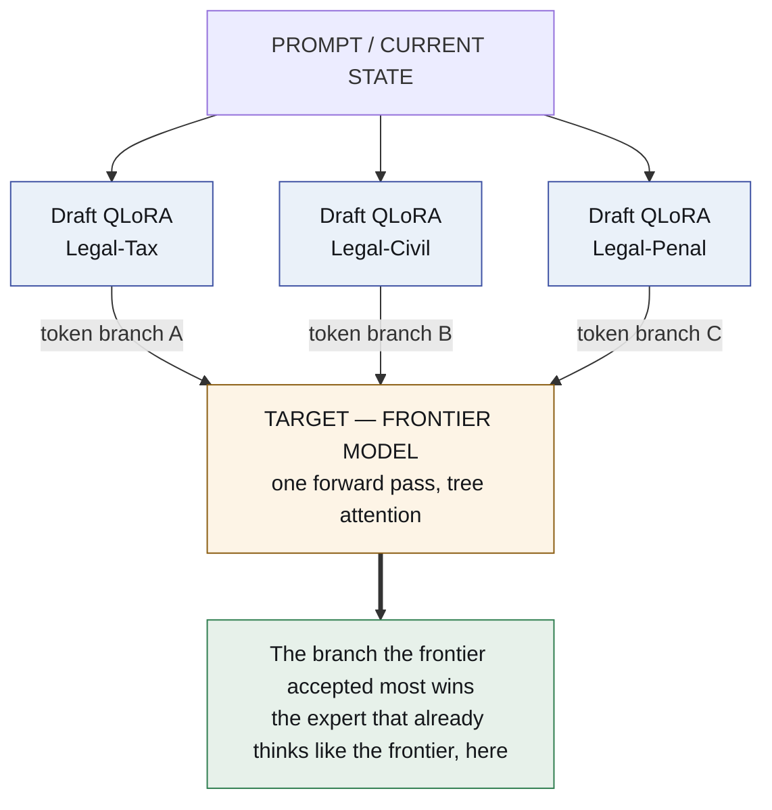
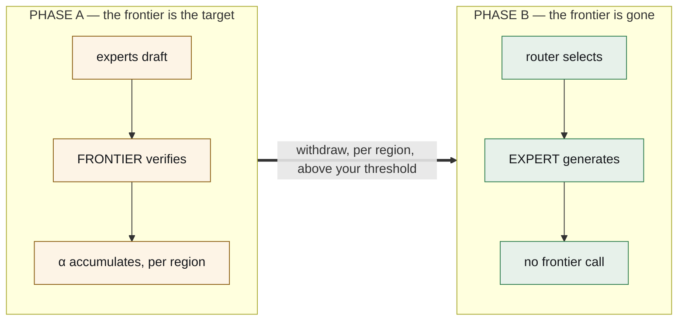

# lora-kernel

**The entire agentic system is a set of QLoRA adapters over one base model.**
Nothing else is neural.

*[Léeme en español](README.es.md)*

> **Status: specified, nothing built.** Every claim about a system outside this
> repository is marked **[read]** and cited. There is no **[ran]** yet.

---

## The thesis

Today a multi-agent system is Python orchestrating API calls: a router model, a
planner model, a pile of JSON schemas in every system prompt, and a parser
guessing whether the model meant to call a tool.

Replace all of it with **weight deltas on one resident base model**.

| what it is today | what it becomes |
|---|---|
| the harness — tool schemas, parsers, retry logic | **`harness.lora`** — an adapter that *emits* action tokens natively |
| an agent | **a domain QLoRA**, a few hundred MB, hot-swappable |
| the router — an extra model call | **acceptance rate**, falling out of a pass already being paid for |
| the evolution loop | **a tournament over adapters**, scored and promoted |
| memory | markdown + git — **deliberately not neural** |
| the execution environment | a sandbox — **deliberately not neural** |

One GPU. One base model resident. A pool of small deltas swapped per request by
vLLM's multi-LoRA serving. The agentic system stops being software that calls a
model and becomes **a model wearing different adapters**.

## The mechanism that makes routing free — and the reason it works

Speculative decoding has one property that is not a footnote: **the emitted
tokens are distributed exactly as the target model would have emitted them.**
Rejection sampling guarantees it. **[read]**

That property is what makes this architecture work, and it is why **the choice of
target is the whole design**:

> **The target is a frontier model.** The experts are its drafters.

Because the target is frontier-grade, a high acceptance rate means something
precise and valuable: *this small expert already produces what the frontier would
have produced, in this region of the problem space.* Acceptance rate stops being
a speed statistic and becomes **a continuous, per-region distillation score,
measured for free inside inference that was going to happen anyway.**



Routing costs nothing extra. The tokens were generated. The verification pass was
already happening. The winner is a by-product of arithmetic already paid for.

## Frontier withdrawal — the part that makes it an architecture rather than a trick

The frontier model is **scaffolding**, and the design says when to remove it.

**Phase A — the frontier is the target.** You pay frontier cost and you get
frontier output. What you *also* get, at zero marginal cost, is an accumulating
map: for every region of the problem space, which small expert the frontier keeps
agreeing with, and how strongly. This is distillation with its own evaluation
built into the serving path.

**Phase B — withdraw the frontier.** Experts whose acceptance rate crossed
threshold in a region are promoted from *drafter* to *generator*. The frontier
comes out. What replaces it is **only a router**, trained on the acceptance
surface Phase A produced. The answer is now assembled from the experts.



|  | Phase A | Phase B |
|---|---|---|
| **cost** | frontier | local |
| **quality** | frontier | at the α threshold you required |
| **what you also get** | a distillation score, free | — |

The threshold is the product decision. You choose how much frontier agreement you
require before an expert is allowed to answer alone, per region, and the number
is measured rather than argued.

## The four adapters, in detail

### 1. `harness.lora` — the kernel

One adapter trained on nothing but the execution protocol: tool-call syntax,
**action tokens** (`<invoke_tool name="sql">`, `<eval_state>`, `<observe>`),
error shapes, state transitions.

- **The schema leaves the system prompt.** The protocol lives in weights, so the
  context window carries work instead of documentation.
- **The format is emitted, not recovered.** No parser guessing whether the model
  meant to call a tool.
- It is always loaded. Domain adapters compose with it: the domain adapter
  thinks, the kernel acts.

The number to beat is **ours**, not a straw man: `gemma4nanoloop` already took
peak schema overhead from **5,548 → 817 tokens (−85%)** by binding tools per
phase, with no training at all. **[read]** And on syntax the incumbent is
grammar-constrained decoding, which this organisation has also built
(`token-trie`) — it makes invalid output *impossible* rather than unlikely. A
harness adapter has to win on tokens **and** on malformed-call rate.

### 2. Domain QLoRAs — user space

Each expert is a few hundred megabytes of delta. They are swapped per request,
batched together by vLLM, and versioned like code.

### 3. The router

Phase A: acceptance rate. Phase B: a router fitted to the acceptance surface.
Small, cheap, and the only thing left where the frontier used to be.

### 4. The tournament — how experts improve

Several adapters per sub-domain, competing. Fitness per executed task:

```
score = w₁ · verified task success
      + w₂ · α  (acceptance against the frontier target)
      − w₃ · tokens consumed
```

The worst is dropped. The winners' best trajectories become a DPO/GRPO dataset
and train the next delta. This runs **offline**, in the dream pass, over traces
that `agentvcs` versioned — because a tournament that runs inline changes the
thing it measures.

**One warning carried from this organisation's own measurements**, because it
decides the fitness function: the same procedure classified as *interface
compensation* on a 4B model and as *persistent gain* on a 12B. **Whether an
expert is real is not a property of the expert.** So `w₁` must come from a
verifier the loop cannot see, or the loop breeds adapters that flatter their
scorer. **[read]**

## What is deliberately not a LoRA

Exactly two things, and they are load-bearing:

1. **Memory** — markdown files under git. A weight delta cannot be read, diffed,
   cited or corrected by a person. Everything this organisation has measured
   about memory says the durable asset is the part you can read.
2. **Execution** — the sandbox where tools actually run.

## Engineering state, honestly

| capability | state |
|---|---|
| many LoRA adapters over one target, batched | **ships in vLLM** **[read]** |
| tree-structured draft verification | **ships** (EAGLE/Medusa family) **[read]** |
| **LoRA adapter as the draft model** | **open RFC**, filed 2026-08-12 — [vllm#52038](https://github.com/vllm-project/vllm/issues/52038) **[read]** |

The RFC exists because this is what people want, and its numbers are the
encouraging part: an **r=64 adapter is ~28× smaller** than the 0.8B drafter it
replaces, at drafting quality within about **2%** of a fully-trained per-domain
drafter. **[read]**

Until it lands, Phase A runs with adapters applied outside vLLM's speculative
path, or with small per-domain drafters — more memory, same experiment.

**The genuinely hard part is the KV cache.** Branches from *different adapters*
do not share a cacheable representation the way one drafter's tree does, because
the adapter changes the projections that produce K and V. Tree attention over one
drafter is solved; across adapters it is the open engineering problem, and it is
named here rather than waved at.

## What runs first

**E0 · Headroom.** Score the base alone on the task distribution. If it is at the
ceiling, every expert ties and a tie reads as a success.

**E1 · The α surface.** Two domain adapters and one frontier target. Measure
acceptance per region. This is Phase A in miniature and it produces the map
everything else is built on.

**E2 · Withdrawal.** Promote the adapter that crossed threshold, remove the
frontier, and measure verified task score against what the frontier scored. The
gap is the price of withdrawal, and it is the number the whole architecture
exists to make small.

**E3 · `harness.lora`**, against the −85% baseline above.

## How this is released

Open-core, deliberately.

**Open:** the runtime — multi-LoRA over vLLM, the speculative router, the
withdrawal machinery; the `harness.lora` specification and the action-token
protocol; the markdown + git memory connector.

**Not open:** trained vertical adapter packs; the managed dream/evolution
pipeline; the enterprise control plane.

Deep inference infrastructure that nobody can audit never becomes a standard, and
a standard with nothing beside it never pays for itself.

## Lineage

| | |
|---|---|
| [`evolving-agents`](https://github.com/EvolvingAgentsLabs/evolving-agents) | The active repository — flows, memory at four levels, agents as markdown. `ai-os` lives inside it |
| [`gemma4nanoloop`](https://github.com/EvolvingAgentsLabs/gemma4nanoloop) | The measured case that a small local model runs a closed loop |
| `agentvcs` | Versions code, skills, goals, models and traces together — the substrate the tournament scores over |

> Evolving Agents was the conceptual laboratory for adaptive agents. **This is the
> substrate that makes them weight deltas.**

## Documents

- [`docs/ARCHITECTURE.md`](docs/ARCHITECTURE.md) — the seven layers, why the
  target must be frontier-grade, and the withdrawal condition · [es](docs/es/ARCHITECTURE.md)
- [`docs/TECHNICAL-REFERENCE.md`](docs/TECHNICAL-REFERENCE.md) — the mechanisms,
  α and the α surface, the KV cache, action tokens, adapter composition, the
  fitness function · [es](docs/es/TECHNICAL-REFERENCE.md)
- [`docs/the-frontier-is-scaffolding.md`](docs/the-frontier-is-scaffolding.md) —
  the article · [es](docs/es/the-frontier-is-scaffolding.md)

## Acknowledgement

This line of enquiry began with a conversation with
**[Ismael Faro](https://github.com/ismaelfaro)**, who suggested studying
speculative decoding and what it could be used for.

---

<sub>Apache 2.0 · [Evolving Agents Labs](https://github.com/EvolvingAgentsLabs)</sub>
