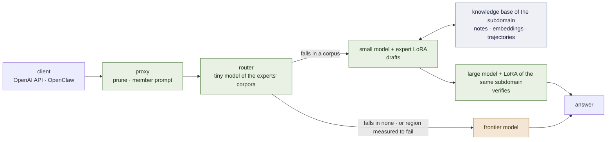

# lora-kernel

**Experts are corpora. A request goes to the expert whose corpus it looks like, and to a
frontier model when it looks like none.**

[](LICENSE)
[](docs/ARCHITECTURE.md)
[](docs/RECORD.md)

*[Español](README.es.md)*

lora-kernel is the runtime of a service: an **OpenAI-compatible API** that answers locally
what falls inside a measured region and forwards the rest to a frontier model, and
**OpenClaw instances per task** on top of it. A region is a small QLoRA expert trained by
ordinary supervised fine-tuning on one corpus, released through a gate, and served beside
the others on one resident base.

Every claim below is marked **[ran]** (observed in this repository, run directory named)
or **[read]** (inferred from source or a paper). Everything measured so far is on
**generated suites** — no real traffic has passed through it yet. That is the first thing
to know about the numbers.

---

## The idea, in four decisions

Twelve days of measurement reduced the design to one observation: **what makes an expert
work, and what makes routing work, is the distribution of the expert's corpus.** An expert
called a tool on 2 of 32 live turns under the runtime's prompt and on 19 of 32 under the
prompt its corpus taught **[ran]** P63. A keyword router misrouted 15 of 60 requests when
keyed on what two experts' inputs share, and none when keyed on what their corpora ask
**[ran]** P64. Same fact, seen twice. The design follows from it.

1. **An expert is its corpus** — the tool block, the argument keys and their order, the
   system prompt, the depth band. It is served under exactly that, or it is a different
   model. The release contract records all of it.
2. **The router is a very small model of those same corpora.** It decides which expert's
   distribution a request falls in, and **abstains** when it falls in none. Abstention is
   the frontier. The router never decides that a region is *good* — a measured table does.
3. **Each subdomain gets a pair: a LoRA on a small model and a LoRA on a large one, trained
   on the same corpus.** The small one drafts, the large one verifies — speculative
   decoding inside the subdomain. The pair is the local answer to "this region is too hard
   for the small expert", before anything leaves the machine.
4. **Each subdomain has a knowledge base of its own, and what the expert learns is the
   trajectory through it.** Notes of two kinds — encyclopedic (what holds, and when) and
   operational (how this kind of task is done, in order) — embedded in the same space the
   router reads. The weights hold the navigation; the base holds the content, where it can be
   read, versioned and edited without training. A trajectory through operational notes *is* a
   harness — per subdomain, and outside the weights.



**The family is Qwen 3.x, small and large**: `Qwen3.5-4B` (or `2B`) and `Qwen3.8-27B`,
which share one id space — 248,044 ids **[ran]** D0 — so the large one can verify what the
small one drafts. The design is family-agnostic by construction: a `Gemma 4 2B` / `Gemma 4
12B` pair is the named alternative, behind one known blocker (below).

---

## What works — measured

All on `Qwen2.5-3B-Instruct`, the base everything released so far was trained on.

| what | the number | run |
|---|---|---|
| **One vLLM, one base, several adapters**, each request served by its own | identity `applied` on every member, tools reachable, stop honoured | **[ran]** P56 |
| **`email-full@v1`** — inbox triage, tools and judgement in one adapter | **0.989** on human messages against the base's **0.345**; re-served and re-trained, both tie the recorded run | **[ran]** P36, P57 |
| **`desk-commitment@v1`** — a second member on the *same inbox*, a different question | **240/240** against the base's **38/240**, discordant **202 : 0**; ties its recorded run | **[ran]** P64 |
| **On a 3B the procedure has to be in the weights** | base + a 914-token procedure document: **0 tool calls on 351/351**, 0.601, under the majority bar; the expert beats it **137 : 1** | **[ran]** P61 |
| **The API routes per request**; the client names no model | replay on 240 cases: **0.546 → 0.775**, 0 misrouted, 37.5 % leave for the frontier | **[ran]** P41, P62 |
| **OpenClaw, live, from a laptop** | 40/40 turns local, 0 invented calls, 19/32 human turns call a tool, 0.688 against a 0.655 bar | **[ran]** P63 |
| **A member must be served its own tool surface** | offered OpenClaw's 54 tools it copies tags off the block: 225 of 227 calls refused; pruned, 8 of 1160 | **[ran]** P59 |
| **vLLM applies a LoRA over a quantised large model** (`Qwen2.5-32B-AWQ`) | logprob gate 3/3, mean \|Δℓ\| 0.22–0.49 nats against a base-vs-base 0.000 | **[ran]** P60 §3b |
| **Qwen 3.5 adapters are servable** — "vLLM ignores them" was a naming mismatch | same weights, 496 tensors renamed, not retrained: `not applied` → **`applied`**, 0 → 152 of 178 modules | **[ran]** D2 |

The expert that **decides** — look something up, judge, answer — works. The expert that
has to **reason** through a long chain does not: the fluid-mechanics member followed its
protocol perfectly and got the physics wrong on 78 of 90 **[ran]** P40. That region is
served by the frontier, and the router's table says so.

## What does not work, or is not measured

- **No real data.** Every suite is generated by this repository. A generated suite cannot
  contain a difficulty its author did not think of **[ran]** P50.
- **The saving in money has never been measured.** "37.5 % leave" is a share of generated
  cases, not a bill.
- **The router is still a keyword dictionary.** Its first learned replacement — an n-gram model
  of each corpus — is safer on foreign text (**0 of 128** served locally against the
  dictionary's **59**) and loses **every** legitimate request from a sender the generator never
  drew, 120 of 120 **[ran]** M2. It learned the generator's uniformity. The next arm is an
  embedding model.
- **No large-model half exists yet.** No LoRA has been trained on a 27B, and an *untrained*
  large model scored **below** the small expert in its own region — 0.967 against 1.000 on
  the desk, 0.746 against 0.989 on triage **[ran]** P55, P55b. That result is the reason
  the large model gets a LoRA of the same subdomain rather than being used bare.
- **No knowledge base exists yet**, and two results say how not to build one: a small model does
  not follow a procedure it merely reads **[ran]** P61, and knowledge that sits fixed in a corpus
  is memorised and then measures nothing **[ran]** P21.
- **No signal sees "coherent and wrong".** Hand-written rules missed it; agreement with a
  frontier sees it but buys quality, not saving **[ran]** P41.
- **Nothing released is on Qwen 3.x yet.** D2 removed the obstacle; the retraining is
  milestone 1.

The full ledger, including everything that failed and why, is [`docs/RECORD.md`](docs/RECORD.md).

---

## Where it goes — the milestones

Each has a gate and the arm that can kill it, written before it runs
([`docs/PLAN.md`](docs/PLAN.md)). Arms are bought in sequence, never as a grid.

| # | milestone | the arm that kills it first |
|---|---|---|
| **1** | **The pool on Qwen 3.x small.** Retrain `email-full` and `desk-commitment` on `Qwen3.5-4B`, tensors named for the class vLLM serves | the identity gate on a *real* adapter (D2's was a 60-step toy); then: loses, paired, to its Qwen 2.5 release |
| **2** | **The router as a tiny model of the corpora**, abstaining to the frontier | arm 1 **[ran]**, does not pass: safe on foreign text, loses every request from an unseen sender. Arm 2 — an embedding model — dies on the same four sets |
| **3** | **The large half**: a LoRA on `Qwen3.8-27B` from the same corpus, on the deep band where the small expert has headroom | vLLM does not apply it (logprob gate); then: large + LoRA does not beat small + LoRA, paired |
| **4** | **The speculative pair**: acceptance of small-LoRA drafts under large-LoRA verification | acceptance no higher than against the bare large model — the matched LoRA buys nothing |
| **5** | **The first real region**, by hand, through the same release gate | the release gate |
| **6** | **The service policy**: router → small → pair → frontier, with the bill measured | the local share costs more than it saves |
| **7** | **A knowledge base per subdomain, the trajectory through it as the harness** — on fluid mechanics, split into subdomains. *Runs next.* | under an **oracle** trajectory — exactly the right notes open — the expert still scores ~1/20 on a sibling family it never trained on |

**Engineering constraints these carry** — facts, not objections:

- vLLM ships multi-LoRA and speculative decoding, but **a LoRA-adapted drafter is an RFC,
  not a feature [read]**. Milestone 4 therefore measures acceptance the way this
  repository already does — one teacher-forced pass of the large model over the small
  one's draft (`prompt_logprobs`) — and reports α with its `k` beside the verified score.
  The speed-up is a separate claim and needs the runtime feature.
- A 27B does not fit the L4 the pool runs on. The large half is A100 work, 4-bit.
- The `<think>` channel of the 3.x line is switched off for members; their corpora never
  taught it.
- **Gemma 4** as the alternative family: `Gemma4ClippableLinear` is not an `nn.Linear`, so
  PEFT cannot attach to it as it stands **[ran]** P29. `lora_matrix` is the gate that would
  reopen it.

---

## Run it

```bash
# the gates that need no GPU
python -m pytest tests -q
python scripts/check-mirrors.py

# the routing replay — by request against by region, zero GPU
python -m training.harness.route

# anything that needs a GPU runs on Colab through one chain, streamed and resumable
GPU=L4 BRANCH=main MODULE=training.harness.verify_substrate \
  RUN_DIR=results/my-run training/harness/chain_serve.sh
```

Serving the pool to an agent, the proxy's flags and the substrate gate:
[`docs/SERVING.md`](docs/SERVING.md). OpenClaw, step by step, as it ran live:
[`docs/OPENCLAW.md`](docs/OPENCLAW.md).

A member is served with three flags, and they are the default for a reason each:
`--prune` (its own tool surface), `--member-prompt` (the prompt its corpus taught),
`--auto` (the client names no model).

## The release contract

A region enters through one door: a suite with a verifier, the base as the headroom arm,
an exact sign test on discordant pairs. What comes out is a manifest —
[`releases/email-full@v1.json`](releases/email-full@v1.json),
[`releases/desk-commitment@v1.json`](releases/desk-commitment@v1.json) — holding the base,
the recipe, the corpus hash, the adapter hash, the prompt hash and the paired comparisons
that admitted it. **The corpus named there is also what the router is trained on.** One
artefact defines the expert and its region.

## What is in the box

| path | what |
|---|---|
| `training/harness/openai_proxy.py`, `route.py` | the API: pruning, the member prompt, routing per request |
| `training/harness/train_pool.py`, `contract.py` | the pool registry — each member a record read off its corpus |
| `training/harness/release_gate.py`, `pool_second.py`, `verify_substrate.py` | the door a member enters through |
| `training/harness/accept_rank.py`, `awq_lora_gate.py` | acceptance, and a LoRA over a large quantised model — the two halves of milestone 3–4 |
| `training/harness/pool_base.py`, `train_one.py` | every released member retrained and re-released on another base (milestone 1) |
| `training/harness/corpus_router.py`, `router_sets.py` | milestone 2's measured arm, and the five + three sets any router is scored on |
| `training/harness/lora_matrix.py`, `rekey.py` | does this base serve a LoRA at all — with a control, and D2's renaming |
| `training/harness/knowledge_arm.py`, `null_arm.py`, `training/suite_gates.py` | headroom before anything is trained |
| `training/email/`, `training/mcp/` | the inbox and desk suites, and the inbox tools as an MCP server |
| `training/harness/chain_serve.sh` | the Colab chain: provision, run detached, stream, fetch, stop |
| `releases/`, `results/` | the manifests, and the runs the documents cite |

## Documents

| | |
|---|---|
| [`docs/PLAN.md`](docs/PLAN.md) | the living plan — milestones, gates, kill arms |
| [`docs/RECORD.md`](docs/RECORD.md) | everything measured, including what failed; each line names its run |
| [`docs/ARCHITECTURE.md`](docs/ARCHITECTURE.md) | the system: experts, router, the pair, the frontier |
| [`docs/FOUNDATIONS.md`](docs/FOUNDATIONS.md) | the mathematics, tied to the runs that instantiate it |
| [`docs/SERVING.md`](docs/SERVING.md) · [`docs/OPENCLAW.md`](docs/OPENCLAW.md) · [`docs/SUBSTRATE-GATE.md`](docs/SUBSTRATE-GATE.md) | running it |
| [`CLAUDE.md`](CLAUDE.md) | instructions for coding agents, and the measurement rules that were paid for |

**The record before this rewrite** — seventy-four run directories, the retired experts,
the analyses and the 2,800-line plan — is the tag
[`v0.1-foundations`](https://github.com/EvolvingAgentsLabs/lora-kernel/tree/v0.1-foundations).
A P-number cited here without a directory on `main` lives there.

## Scope

Open source: the runtime, the release contract, the gates. **Not part of this runtime nor
of the open-source version:** the customisation service and its tooling — a customer's
corpora, adapters trained as a service, the automation of traces → corpus → gate →
release. This repository builds the instrument that measures a customisation, not the
tooling that produces it at scale.

Apache 2.0. The idea began in a conversation with Ismael Faro.
