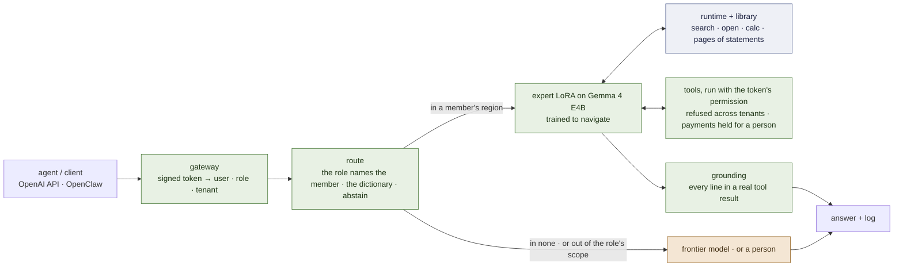

# lora-kernel


*The specialist, the library, the radar — and, through the door, the frontier, for when no drawer fits.*

**The LoRA is not the textbook. It is the specialist who knows how to use the library.**

[](LICENSE)
[](docs/ARCHITECTURE.md)
[](docs/MEMORY.md)
[](docs/RECORD.md)

*[Español](README.es.md)*

## The problem

An organisation running on agents keeps sending the same handful of repeating jobs — triage an
inbox, log a maintenance request, answer from a checklist — to a frontier model in the cloud, at
frontier prices, on data that often should not leave the building. The usual answer, fine-tuning a
model on the outcomes, trades that away for a worse problem: the facts end up **baked into the
weights**, so the day a procedure changes there is no file to edit — only a retrain, and until it
happens the model confidently gives the old answer.

lora-kernel keeps the facts in a library of markdown notes a person can read and correct, and trains
a small model only to find its way to the right one. What an expert knows how to *do* — which tools
to reach for, in what order, under this organisation's own rules — lives in a small adapter's
weights, trained by ordinary SFT. What it needs to *know* — the current value, the current
procedure — stays outside the weights, in a file. A very small router decides which expert's
territory a request falls in, and abstains to a frontier model for everything else, so nothing gets
answered outside its trained ground.

It ships as an **OpenAI-compatible API** — one resident model, several adapters, each request served
by its own — with **OpenClaw instances per task** on top.

Every claim below is marked **[ran]** (observed in this repository, run named), **[read]** (from
source or a paper) or **[spec]** (decided, not yet built) — and everything measured so far is on
generated suites, not real traffic yet. The living numbers, including what has not passed, are in
[`docs/PLAN.md`](docs/PLAN.md) and [`docs/RECORD.md`](docs/RECORD.md); what follows is what does not
change every time one of them moves.

---

## The core of version 1.0


*The core of 1.0: a router that may abstain, a specialist and a library per subdomain, one referee under all of them.*

Five things, and how each one changes:

| | what it is | changes by |
|---|---|---|
| **An expert is its corpus** | a QLoRA per subdomain, trained by ordinary SFT; served under exactly the prompt, tool block and result format its corpus taught — or it is a different model | a training run |
| **The router** | a very small model of those same corpora: *whose distribution is this request?* — and it **abstains** when the answer is none. Abstention is the frontier | re-indexing the corpora |
| **The memory** | a library of notes the expert navigates — below | **editing markdown** |
| **The runtime** | a small Python referee inside the proxy: executes the expert's commands, applies a site's rules, enforces the order of steps | a code change |
| **The release contract** | one manifest per member — corpus, adapter, library, radar and grammar, each hashed; admitted by a paired test against the bare base | a gate that has to pass |

And one thing that attaches per subdomain where it is measured to pay, **not required by 1.0**: a
second LoRA on a large model of the same family, trained on the same corpus, that verifies what the
small one drafts ([`docs/PLAN.md`](docs/PLAN.md) milestones 3–4).

### The memory, in five pieces

Full specification: [`docs/MEMORY.md`](docs/MEMORY.md) **[spec]**.

1. **The library — two shelves of markdown**, each note under half a page. The **operational
   harness** (*how is it done?*): recipe-like notes whose links are the control flow — `requires`
   (before this, that), `next` (the step that follows), `uses` (for this step, consult…). The
   **encyclopedic wiki** (*what is it, which formula applies?*): a tree, general to specific, that
   classifies which case you are in before you compute. **Shaped like Wikipedia, its unit is the
   atomic statement:** a page is a list of one-sentence, checkable statements under anchors
   (`§supplier`, `§if-damaged`), links live inside the statement that names them, and an answer cites
   the statement it rests on — so the memory is verifiable, not just searchable
   ([`docs/MEMORY.md`](docs/MEMORY.md) §1.6 — **[ran]** W9: a trajectory LoRA walks it 35/40 where the untrained
   base walks 0/40, 3-hop 16/16).
2. **The radar — embeddings compressed to one subdomain.** Not a general search engine. In a closed
   domain the vocabulary has exact functional meaning, so a small vector is enough to map the only
   two intents that matter: *what situation is this note for* (`when:`) and *what does it define*
   (`what:`). It returns the two or three notes of exactly the subdomain the expert is working in.
3. **The language — three verbs.** `<search>a situation or a doubt</search>` returns titles and ids.
   `<open>id</open>` returns the note and its links. `<calc>expression</calc>` — so the model never
   does arithmetic in its head, where it always fails.
4. **The LoRA — trained on the habit of navigating.** Its training cases draw their constants fresh
   every time — a liquid invented for one exercise, a local dwell time of 15 seconds instead of 5 —
   so the answer cannot be memorised and the model is *forced to open the note to see the number*.
   What ends up in the weights is a choreography: read, search the harness, open the protocol, make
   a stop in the wiki when a step needs a fact, send the numbers to `<calc>`, follow `next`.
5. **The runtime — the software referee.** It turns the pages, writing each result right after the
   tag. It applies local rules automatically: a ward that cleanses for 20 seconds has that value
   substituted *before* the note reaches the expert, which reads the rule already resolved. And it
   watches for cheating: if step 4 `requires` step 1 and the expert never opened step 1, the runtime
   cuts the execution — without needing to know whether the final answer was right. **And it decides what
   a reply may state:** every answer cites the statement it rests on, and the referee checks the citation;
   in front of tools, the gateway shows no line that is not in a real tool result (`examples/common/grounding.py`).

> **[ILLUSTRATION PLACEHOLDER — `docs/img/memory-walkthrough.png`]**
> *Being redrawn for pages of atomic statements; the brief is in [`docs/img/README.md`](docs/img/README.md). Six
> panels on one line: a request, a search that lights three page cards, a page opening as its table of sections, one
> sentence whose underlined name is the link to the next page, a third page's section, and the answer with its
> citation stamped on it — the referee's check under the last panel.*

**The gain.** If the protocol changes tomorrow you edit one markdown file in git. The LoRA is not
retrained, because what it learned was to obey the links and read the notes.

---

## The request path

> **[ILLUSTRATION PLACEHOLDER — `docs/img/request-path.png`]**
> *Being redrawn for the gateway; the brief is in [`docs/img/README.md`](docs/img/README.md). One line: an agent → the
> gateway reads the signed token (user · role · tenant) → the role's local expert → tools run with that permission (a
> refused record, a payment held for a director) → every line of the reply checked against a real tool result → the
> answer; a dashed branch for out of scope, to the frontier or to a person; a log under all of it.*



## Where it sits in an organisation

An organisation that runs on agents tends to draw the same picture: people in a few roles on top; an
agent runtime with **one agent per role**; the applications those agents operate; the channels people
already use; and, at the bottom, one database with identity, payments and monitoring beside it. In
that picture every agent is a system prompt over the same remote model.

lora-kernel is the layer under the agent column. **Each role becomes an expert** — an adapter trained
on how *this* organisation does that job — **with two drawers of notes**: how we do it here, and what
we know. The role a message arrives from says *which* expert — free, and measured safe **[ran]** F2; *whether* the request is inside that expert's region is still the router's job. What an
expert is measured to handle is answered on the organisation's own machine; the rest goes to the
frontier, or to a person where policy says nothing leaves the building. The systems of record stay
where they are: **records stay in the database, habits go in the adapter, knowledge stays in notes a
person can read and correct.**


*Where it sits in an organisation: records stay in the database, habits go in the adapter, knowledge stays in notes a person can read.*

The same shape, in other rooms — none of these is measured, they are where the design points:

| organisation | roles that become experts | what goes in the two drawers |
|---|---|---|
| **a distributor** | customer service, receiving, dispatch, purchasing, claims | the site's handling procedures · catalogue, carriers, service levels |
| **an accounting or law office** | intake, document review, deadlines, billing | the firm's checklists and templates · the rules of its jurisdiction, client by client |
| **a school or training centre** | enrolment, teaching support, communications, purchasing | how this school handles each case · programme, calendar, regulations |
| **a repair or field-service company** | equipment intake, diagnosis, spare parts, warranties | the procedure for each kind of repair · manuals, parts lists, warranty terms |
| **a club or community centre** | memberships, activity sign-ups, facilities, collections | how this club handles each case · activities, fees, house rules |
| **a property manager** | tenant requests, maintenance, collections, suppliers | the escalation procedure per building · contracts, by-laws, supplier terms |

What they share is what makes a region worth an expert: **the same few procedures, repeated daily,
with local rules that differ from the textbook, over data that should not leave.** The first library
in this repository is built from an open textbook's step-by-step procedures
([`knowledge/nursing-iv/`](knowledge/nursing-iv/)). What is *not* established is in the section
below, and it applies here in full: no real data yet, and the claim that a library extends an expert
to a procedure it never trained on is untested.

## Where it stands

**Already running.** One vLLM instance serving several LoRA adapters off one resident base, each
request routed to its own adapter, live through the OpenAI-compatible API and through OpenClaw
**[ran]** — the mechanism above is not a diagram, it answers real turns today. One trained expert,
served exactly the way its corpus taught it, reaches human-level accuracy on the job it was trained
for (inbox triage, 0.989 against a bare base's 0.345) **[ran]**.

**The memory works on its first test bed [ran].** On a wiki of atomic statements whose facts no model can know,
the untrained base cannot walk two- and three-hop questions (0 of 40); a trajectory LoRA trained on 32 other worlds
walks them 35 of 40 with every answer's citation verified, 16 of 16 at three hops — and on Gemma 4 E4B, 38 of 40
(`docs/PLAN.md` milestone 7, W9 and B1).

**A reference organisation, working end to end [ran].** The school demo: identity from a signed token, another
school's records refused by the tool layer, a payment held until a director approves it, out-of-scope requests
handed to the frontier or to a person, a log and a dashboard — and **every reply checked against the real tool
results by the gateway, outside the model**. 8 of 8 scenes on Gemma 4 E4B with a school-staff adapter, from 3 of 8
with a bare model ([`docs/DEMO.md`](docs/DEMO.md)).

**The family is Gemma 4** since 2026-09-25: measured against Qwen3.5-4B on the same wiki, a tie, and the user's
development stack targets Gemma; the released members move through the release gate one by one (milestone 1b).

**Not solved yet.** The router is still a keyword dictionary — its two learned replacements are both measured and
neither passes **[ran]** milestone 2. The small models still invent: in the school demo the gateway replaced 2 of 5
local replies with the tools' own text — caught, counted, never shown, but not cured. The speculative pair has not
started. No real traffic has been measured anywhere in this repository yet.

**Everything else — every milestone, every arm, every run — moves as the project does and is not
repeated here, on purpose.** [`docs/PLAN.md`](docs/PLAN.md) is the living state, with a gate and
falsification condition written before each milestone runs. [`docs/RECORD.md`](docs/RECORD.md) is
the full ledger, including what failed and the instruments that lied. [`docs/FRAMEWORK.md`](docs/FRAMEWORK.md)
is the gap analysis against being a generic framework, self-contained and written to be reviewed by
another model.

**Engineering constraints, decided and not up for debate.** The family is **Gemma 4** since 2026-09-25 —
small `gemma-4-E4B-it`, large `gemma-4-31B-it` (not yet measured) — chosen on a measured tie with
Qwen3.5-4B, whose released members stay until re-released ([`docs/ARCHITECTURE.md`](docs/ARCHITECTURE.md) §6).
Trained and served on Colab, in sessions under an hour, never on a user's machine.

---

## Run it

```bash
# the gates that need no GPU
python -m pytest tests -q
python scripts/check-mirrors.py

# the routing replay — by request against by region, zero GPU
python -m training.harness.route

# anything that runs a model runs on Colab through one chain — streamed, resumable, under an hour
GPU=L4 BRANCH=main MODULE=training.harness.verify_substrate \
  RUN_DIR=results/my-run training/harness/chain_serve.sh
```

Serving the pool to an agent, the proxy's flags and the substrate gate:
[`docs/SERVING.md`](docs/SERVING.md). OpenClaw, step by step, as it ran live:
[`docs/OPENCLAW.md`](docs/OPENCLAW.md). A member is served with three flags, each a default for a
reason: `--prune` (its own tool surface), `--member-prompt` (the prompt its corpus taught), `--auto`
(the client names no model).

## What is in the box

| path | what |
|---|---|
| `training/harness/openai_proxy.py`, `route.py` | the API: pruning, the member prompt, routing per request |
| `training/harness/train_pool.py`, `contract.py` | the pool registry — each member a record read off its corpus |
| `roles/`, `rolepack/` | **one declared directory per role** — member, corpus, prompt and tool block by reference and hash, route, answer policy, egress, loop, library — and the linter that checks every line against its artefact (`python -m rolepack.lint roles/`) |
| `training/harness/release_gate.py`, `pool_second.py`, `pool_base.py`, `verify_substrate.py` | the door a member enters through, on this base or another |
| `training/harness/accept_rank.py` | the corpus-mode loop — stop at the closing tag, write the result inline, continue — that the memory's runtime is built on; and acceptance by teacher forcing |
| `training/harness/corpus_mode_arm.py`, `training/physics/result_use.py` | an expert re-served as its corpus taught; a failure read where it happens — *was the result used?* |
| `training/harness/corpus_router.py`, `embed_router.py`, `router_sets.py` | the router's learned arms, and the eight sets any router is scored on |
| `training/nursing/` | the first text here nobody generated: three IV-therapy checklists, 72 checkable questions |
| `training/harness/lora_matrix.py`, `rekey.py`, `awq_lora_gate.py` | does this base — small or large — serve a LoRA at all |
| `training/harness/chain_serve.sh` | the Colab chain: provision, run detached, stream, fetch weights as they appear, resume |
| `training/harness/bill.py` | prices an existing replay at real frontier rates — zero GPU, nothing re-run (`results/M6-bill-20260921/`) |
| `examples/` | **the reference organisation, code-only, before any adapter** — `school/` and `distributor/`, both two tenants; a toy store, a tool layer that enforces permission outside the model, an MCP server per domain, an adversarial suite at 0 leaks; `examples/README.md` says how to point your own OpenClaw at it |
| `training/wiki/` | **W9, the wiki of atomic statements**: a distributor world per seed, 1–3-hop questions, the citation grader, the trajectory runner and its corpus |
| `examples/school/gateway.py`, `demo_run.py`, `school_arm.py` | **the school demo, as a working system**: signed identity, held writes and a director's approval, egress by role, grounding, a log and a dashboard; the school-staff trajectory LoRA and its measurement |
| `training/harness/fake_vllm.py` | a fake `vllm serve` for the serving path's integration tests — the bugs it models were paid for on a card once |
| `training/harness/family.py` | the model family in one place: Gemma 4 E4B for new members, Qwen3.5-4B for the released ones until re-released |
| `releases/`, `results/` | the manifests, and the runs the documents cite |

## Documents

| | |
|---|---|
| [`docs/MEMORY.md`](docs/MEMORY.md) | **the memory, as it will be built** — library, radar, three verbs, the LoRA's habit, the referee; build order for 1.0 |
| [`docs/KNOWLEDGE-TRAJECTORIES.md`](docs/KNOWLEDGE-TRAJECTORIES.md) | the *why* behind it, self-contained, written to be reviewed by other models: ten findings, five strategies, ten questions |
| [`docs/FRAMEWORK.md`](docs/FRAMEWORK.md) | **state and gaps, self-contained, written to be reviewed by other models** — what works, what does not, and what is missing for this to be a generic framework for an organisation with one agent per role |
| [`docs/ARCHITECTURE.md`](docs/ARCHITECTURE.md) | the system: experts, router, memory, runtime, the pair, the frontier — and where it sits in an organisation (§9) |
| [`docs/DEMO.md`](docs/DEMO.md) | **the five-minute demo** — a reference organisation on a small local model, what is measured and what is not, and the measurement it should end by asking for |
| [`docs/PLAN.md`](docs/PLAN.md) | the living plan — milestones, gates, kill arms |
| [`docs/RECORD.md`](docs/RECORD.md) | everything measured, including what failed; each line names its run |
| [`docs/FOUNDATIONS.md`](docs/FOUNDATIONS.md) | the mathematics, tied to the runs that instantiate it |
| [`docs/SERVING.md`](docs/SERVING.md) · [`docs/OPENCLAW.md`](docs/OPENCLAW.md) · [`docs/SUBSTRATE-GATE.md`](docs/SUBSTRATE-GATE.md) | running it |
| [`docs/articles/`](docs/articles/2026-09-it-was-the-harness.md) | *An organisation that runs on agents, on a single GPU: the architecture* — the solution architecture first, then what is already measured (the harness finding among it), what is not, the roadmap |
| [`CLAUDE.md`](CLAUDE.md) | instructions for coding agents, and the measurement rules that were paid for |

**The record before the rewrite of 2026-09-19** — seventy-four run directories, the retired experts,
the analyses, a 2,800-line plan — is the tag
[`v0.1-foundations`](https://github.com/EvolvingAgentsLabs/lora-kernel/tree/v0.1-foundations).
A P-number cited here without a directory on `main` lives there.

## Scope

Open source: the runtime, the memory's runtime and formats, the release contract, the gates. **Not
part of this runtime nor of the open-source version:** the customisation service and its tooling — a
customer's corpora and libraries, adapters trained as a service, the automation of traces → corpus →
gate → release. This repository builds the instrument that measures a customisation, not the tooling
that produces it at scale. Material from third parties keeps its licence: *Nursing Skills* is CC BY
4.0 and is attributed where it is used; WHO publications default to CC BY-NC-SA and are not shipped.

Apache 2.0. The idea began in a conversation with Ismael Faro.
