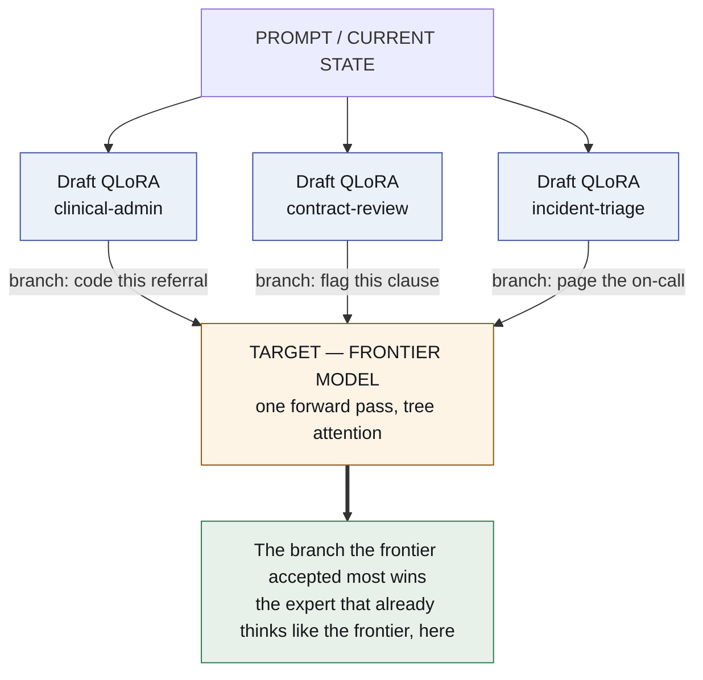
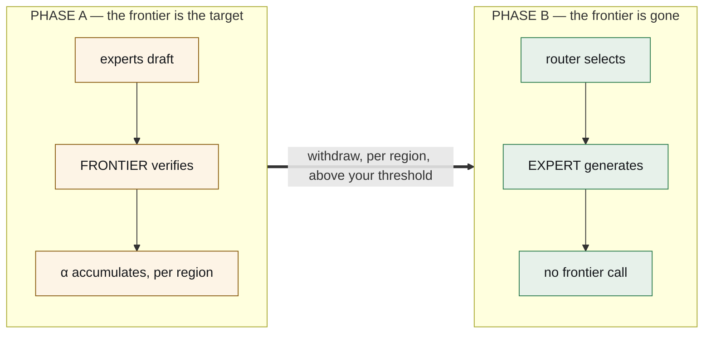

# lora-kernel

**The entire agentic system is a set of QLoRA adapters over one base model.**
Nothing else is neural.

*[Léeme en español](README.es.md)*

[](https://docs.openclaw.ai/cli)
[](https://huggingface.co/Qwen/Qwen2.5-3B-Instruct)
[](https://docs.vllm.ai)

**It runs inside a real agent.** [OpenClaw](https://docs.openclaw.ai/cli) on a
laptop → a local proxy → a tunnel → vLLM on a rented card → a QLoRA of ours → back,
with the inbox tools handed to the agent over MCP and **zero requests leaving the
machine** for anything the pool serves. Step by step:
[`docs/OPENCLAW.md`](docs/OPENCLAW.md).

> **Status: built and measuring.** ~~specified, nothing built; there is no [ran]
> yet~~ — stale since 2026-09-08 and corrected on 2026-09-15. Every claim about a
> system outside this repository is still marked **[read]** and cited; claims about
> this one are marked **[ran]** with the run directory that produced them.
>
> **Where it stands:** two adapters serve from one resident base, selected by the
> `model` field of an HTTP request. **One of them is good** — it beats the base
> 8 : 51 on the same cases. **One of them is not** — it follows the protocol
> perfectly and gets the physics wrong 78 times in 90. Sending that one to a
> frontier model takes delivered accuracy from **0.546 to 0.775** with 38% of cases
> leaving the machine. *A pool with two useful members is what this does not yet
> have.*
>
> **And four things measured on 2026-09-15/16 changed what to build next, three of
> them by cancelling something:**
>
> - **An expert is locked to the depth its corpus taught.** Below its training depth
>   `fluids-full` over-solves on **18 of 18** cases — inventing an area to answer a
>   question nobody asked — and at three steps the **bare base beats it, 0.167 to
>   0.000**. A corpus with one difficulty teaches a floor, not just a skill.
> - **Most of a calibration gap can belong to the suite.** 69–82% of the AURC room
>   reported for the expert's confidence was the information ceiling of the input,
>   not the model. A typed head reading only the listing was cancelled before the GPU.
> - **The coarse route needs no model — and that is a criticism, not a win.** Twelve
>   lines of keywords pick the right tool surface **1.000** of the time. A
>   discrimination problem solved by twelve keywords is not a test of expert
>   selection: **the two members are too far apart to ever meet in one problem.** The
>   fine route, where families differ only by a unit conversion, falls to **0.845** —
>   which is where selection actually gets hard.
> - **The speculative target is decided by a hash.** Every `Qwen2.5-Instruct` size
>   shares a byte-identical tokenizer with our base; the `Qwen3.x` line changed its
>   vocabulary at 3.5, so its 27B models **cannot verify our drafters at all**.

---

## The thesis

Today a multi-agent system is Python orchestrating API calls: a router model, a
planner model, a pile of JSON schemas in every system prompt, and a parser
guessing whether the model meant to call a tool.

Replace all of it with **weight deltas on one resident base model**.

| what it is today | what it becomes |
|---|---|
| the harness — tool schemas, parsers, retry logic | **`harness.lora`** — an adapter that *emits* action tokens natively |
| an agent | **a domain QLoRA**, a few hundred MB, hot-swappable |
| the router — an extra model call | **acceptance rate**, falling out of a pass already being paid for |
| the evolution loop | **a tournament over adapters**, scored and promoted |
| memory | markdown + git — **deliberately not neural** |
| the execution environment | a sandbox — **deliberately not neural** |

One GPU. One base model resident. A pool of small deltas swapped per request by
vLLM's multi-LoRA serving. The agentic system stops being software that calls a
model and becomes **a model wearing different adapters**.

## The mechanism that makes routing free — and the reason it works

Speculative decoding has one property that is not a footnote: **the emitted
tokens are distributed exactly as the target model would have emitted them.**
Rejection sampling guarantees it. **[read]**

That property is what makes this architecture work, and it is why **the choice of
target is the whole design**:

> ~~**The target is a frontier model.** The experts are its drafters.~~
> **The target is a larger model of the same family, served on the same card.**

**Restated twice, and the second one is the useful shape.**

*2026-09-15:* the frontier was scaffolding to be withdrawn once the experts matched
it. It is not being withdrawn — it is **the fallback for what the experts are
measured to fail at**, and the design question moved from *can we remove the target*
to *can we tell when the local answer is good enough to keep* **[ran]**
`results/P41-routing-20260915/`.

*2026-09-16:* a frontier API cannot be a speculative target at all — it does not
return the logprobs of a forced continuation and it does not share the tokenizer
(C2, C3). **A local large model can**, and now the choice is measured rather than
assumed **[ran]** `results/P48-tokenizer-compat-20260916/`:

| target | vocab | usable as a speculative target? |
|---|---:|---|
| **Qwen2.5-7B / 14B / 32B / 72B** | 151,643 | **yes — byte-identical `tokenizer.json`** |
| Qwen3-14B / Qwen3-32B | 151,643 | yes, with 4 target-only ids (`<think>`, …) |
| Qwen3.5 / 3.6 / 3.8-27B | **248,044** | **no — a different vocabulary** |

So the design has **three tiers, not two**, and each one is there for a different
reason:

    small experts   ——  draft, one adapter per subdomain, ~100 MB each
          ↓ acceptance says which subdomains they already cover
    a local large   ——  verifies token by token; withdrawable PER SUBDOMAIN
          ↓ region routing says which subdomains they do not cover
    the frontier    ——  answers what the experts are measured to fail (0.546 → 0.775)

**What that buys, and it is the thing S7's tournament never had:** with every expert
drafting against the same target, **acceptance is a ranking of experts that needs no
judge and no verifier** — same target, same prefix, same conditions. It is also the
quantity the literature reports for this architecture while every number here is
delivered accuracy.

**What it does not buy on its own:** a rejection is either the small model being
wrong or the large one being wrong, and only the verifier beside it separates them.
Acceptance alone must never authorise a withdrawal; the verified score has to hold
where the target is removed. **None of this tier structure has been run** — see
*What has not run*.

Because the target is frontier-grade, a high acceptance rate means something
precise and valuable: *this small expert already produces what the frontier would
have produced, in this region of the problem space.* Acceptance rate stops being
a speed statistic and becomes **a continuous, per-region distillation score,
measured for free inside inference that was going to happen anyway.**



Routing costs nothing extra. The tokens were generated. The verification pass was
already happening. The winner is a by-product of arithmetic already paid for.

## Frontier withdrawal — the part that makes it an architecture rather than a trick

The frontier model is **scaffolding**, and the design says when to remove it.

**Phase A — the frontier is the target.** You pay frontier cost and you get
frontier output. What you *also* get, at zero marginal cost, is an accumulating
map: for every region of the problem space, which small expert the frontier keeps
agreeing with, and how strongly. This is distillation with its own evaluation
built into the serving path.

**Phase B — withdraw the frontier.** Experts whose acceptance rate crossed
threshold in a region are promoted from *drafter* to *generator*. The frontier
comes out. What replaces it is **only a router**, trained on the acceptance
surface Phase A produced. The answer is now assembled from the experts.



|  | Phase A | Phase B |
|---|---|---|
| **cost** | frontier | local |
| **quality** | frontier | at the α threshold you required |
| **what you also get** | a distillation score, free | — |

The threshold is the product decision. You choose how much frontier agreement you
require before an expert is allowed to answer alone, per region, and the number
is measured rather than argued.

## The four adapters, in detail

### 1. `harness.lora` — the kernel

One adapter trained on nothing but the execution protocol: tool-call syntax,
**action tokens** (`<invoke_tool name="sql">`, `<eval_state>`, `<observe>`),
error shapes, state transitions.

- **The schema leaves the system prompt.** The protocol lives in weights, so the
  context window carries work instead of documentation.
- **The format is emitted, not recovered.** No parser guessing whether the model
  meant to call a tool.
- It is always loaded. Domain adapters compose with it: the domain adapter
  thinks, the kernel acts.
- **And it can be versioned, scored and evolved like any other adapter.** Today
  the harness is code, so you cannot cheaply run two of them against the same
  traffic and keep the better one. As an adapter it enters the same tournament:
  the orchestration layer stops being the one part of the system that cannot
  improve by itself.

The number to beat is **ours**, not a straw man: `gemma4nanoloop` already took
peak schema overhead from **5,548 → 817 tokens (−85%)** by binding tools per
phase, with no training at all. **[read]** And on syntax the incumbent is
grammar-constrained decoding, which this organisation has also built
(`token-trie`) — it makes invalid output *impossible* rather than unlikely. A
harness adapter has to win on tokens **and** on malformed-call rate.

### 2. Domain QLoRAs — user space

Each expert is a few hundred megabytes of delta. They are swapped per request,
batched together by vLLM, and versioned like code.

### 3. The router

Phase A: acceptance rate. Phase B: a router fitted to the acceptance surface.
Small, cheap, and the only thing left where the frontier used to be.

### 4. The tournament — how experts improve

Several adapters per sub-domain, competing. Fitness per executed task:

```
score = w₁ · verified task success
      + w₂ · α  (acceptance against the frontier target)
      − w₃ · tokens consumed
```

The worst is dropped. The winners' best trajectories become a DPO/GRPO dataset
and train the next delta. This runs **offline**, in the dream pass, over traces
that `agentvcs` versioned — because a tournament that runs inline changes the
thing it measures.

**One warning carried from this organisation's own measurements**, because it
decides the fitness function: the same procedure classified as *interface
compensation* on a 4B model and as *persistent gain* on a 12B. **Whether an
expert is real is not a property of the expert.** So `w₁` must come from a
verifier the loop cannot see, or the loop breeds adapters that flatter their
scorer. **[read]**

## What is deliberately not a LoRA

Exactly two things, and they are load-bearing:

1. **Memory** — markdown files under git. A weight delta cannot be read, diffed,
   cited or corrected by a person. Everything this organisation has measured
   about memory says the durable asset is the part you can read.
2. **Execution** — the sandbox where tools actually run.

## Engineering state, honestly

| capability | state |
|---|---|
| many LoRA adapters over one target, batched | **ships in vLLM** **[read]** |
| tree-structured draft verification | **ships** (EAGLE/Medusa family) **[read]** |
| **LoRA adapter as the draft model** | **open RFC**, filed 2026-08-12 — [vllm#52038](https://github.com/vllm-project/vllm/issues/52038) **[read]** |

The RFC exists because this is what people want, and its numbers are the
encouraging part: an **r=64 adapter is ~28× smaller** than the 0.8B drafter it
replaces, at drafting quality within about **2%** of a fully-trained per-domain
drafter. **[read]**

Until it lands, Phase A runs with adapters applied outside vLLM's speculative
path, or with small per-domain drafters — more memory, same experiment.

**The genuinely hard part is the KV cache.** Branches from *different adapters*
do not share a cacheable representation the way one drafter's tree does, because
the adapter changes the projections that produce K and V. Tree attention over one
drafter is solved; across adapters it is the open engineering problem, and it is
named here rather than waved at.

## What runs first — superseded, kept for the record

This section named four steps E0–E3 before any of them had run. All four
were bought and three of them reported; **What has actually run**, below,
carries the numbers. The plan they became lives in
[`docs/EXPERIMENT_PLAN.md`](docs/EXPERIMENT_PLAN.md), which is the state of
the work and is updated the same session a step reports.
- [**CASE-TRIAGE.md**](docs/CASE-TRIAGE.md) — one person's morning mail, end to end: which of the twelve measured mechanisms it exercises, which two it cannot, and the gate on each phase.
- [**CASE-TEAM.md**](docs/CASE-TEAM.md) — many groups on one GPU: the case where a standing group **is** the region, the router problem does not arise, and the pool is finally exercised as a pool.


## Where the plan stands

| | objective | state |
|:--:|---|---|
| **S0** | the instrument measures what it claims | ✅ |
| **S1** | a real gap against the frontier | ✅ **+0.533** |
| **S2** | agreement ranks experts | ✅ **6/6 pairs** against a target that is ahead |
| **S3** | the router beats a lookup table | 🟡 ties |
| **S4** | the expert specialises per region | ✅ **+63.3** |
| **S5** | close the withdrawal gap | ✅ **0.000** in region |
| **S9** | a region that is somebody's morning | ✅ **the expert clears its gate, and the end-to-end runs inside a real agent.** 260/351 human messages = **0.741** against a bar of 0.655, **exact p = 0.00036** — and OpenClaw on a laptop answers through a local proxy, a tunnel and a QLoRA served on a rented card, with **zero requests leaving the machine**. Earlier runs scored 84/81/82 against a threshold of 83; that was a suite too small for the effect (**47% power**), not a model wavering. **Two experts, one resident base, selected by the `model` field — and only one of them is good.** The email member beats the base **8 : 51 discordant, p ≈ 0**; co-residency costs it nothing (84/81/82 across three runs, every pair a tie). The fluids member follows the protocol perfectly — 0 refused, 0 out of turns, 6–8 calls — and gets the physics wrong **78 times in 90**, losing to a hand-written rule paired at p = 0.022. **The member that decides works; the member that reasons does not.**|
| **S10** | the base the pool can actually run on | ✅ **Qwen 2.5, decided against a control** — vLLM 0.29.0 loads a LoRA on `Qwen3.5-4B`, logs that it did, and **serves the base anyway**. The adapter was real: `lora_B` moved on all twelve projections and the output changed in process. Read beside a control on `Qwen2.5-3B` that came back `applied` in the same session, so it is a fact about the serving stack and not about the harness |
| **S8** | the pool behind an OpenAI endpoint | 🟢 **servable, and most of the bridge's cost is recovered** — each adapter is its own model name and applies. Tags→`tool_calls` is **domain-free**, 604/604 round trips. Schema→tags cost 0.188; **one convention keyed on parameter count recovers 55% of it** and drops refusals 88→17, the trained arm's exact number. Declaring allowed values **made it worse** |
| **S6** | `harness.lora` — kernel apart from the expert | 🟡 **a tie in fluids, not a tie in kind** — 94/96 against a rule's 93/96 where values cannot be memorised. On a **second subject** neither was edited for, the rule writes **0 of 63** calls and the adapter **27 of 63**: a hand-written harness transfers nothing, a learned one transfers part of itself. But 0.429 missed the 0.979 the brief asked for, and all arms still tie on the final answer |
| **S7** | the tournament that evolves the experts | 🟢 **fitness fixed** — neither judge alone ranks reliably (1 of 2 pairs each); **both-must-accept gets 2 of 2** |

**What works.** The protocol is learnable on its own and travels to a domain it
never saw. The expert's physics is exact inside its region, 30/30. **The two
patches compose when they take turns** — delegation goes from 0.6 to 4.7 calls per
case. The withdrawal gap closes: 1.000 against a fair baseline of 0.467. And the
pool is servable with vLLM multi-LoRA.

**What does not, and what is being done about it.**

| | what fails | plan |
|:--:|---|---|
| 1 | ~~A suite where the tools are necessary.~~ ~~The comparison is missing.~~ **Both done, and the comparison is a tie**: the no-tool control collapses 27/30 → 6/30 on per-case handbooks, and on that material the kernel reaches **94/96** against the rule's **93/96** | what separates them is character, not score: the rule makes 96 calls with **none refused**, the kernel makes 116 with **20 refused** and recovers all but one. Whether a 17.2% rejection rate matters against a paid or slow tool is unmeasured |
| 2 | **A guard on the region's edge** — the expert's formulas fall 30/30 → 1/20 outside it. Every *behavioural* signal is falsified: on unseen families the tool layer reads 0.18 against 0.15 inside, which is chance | a **structural** signal survives where behaviour did not. Dimensional algebra over (kg, m, s) detects **0.80** of out-of-region work on families sealed before the instrument existed. Alone it false-alarms at 0.22; escalating only when the dimensional **and** mechanical checks both fail **never fires in region — 0 of 60 — and still catches 0.35 of the work outside it**. It is wired as `escalate.has_left_its_region`. What is left is what escalation costs, which decides it against the wider rule that stops 60 of 67 wrong answers by sending half the in-region work away |
| 3 | ~~There is no judge without an oracle.~~ **Measured: a judge exists.** The frontier grades at **0.89** balanced and a peer at **0.82** — while that same peer *solves* the material at 0.467 | what is left is the case where nothing available can solve the work, which this run cannot speak to |
| 4 | **The router ties a keyword lookup** | needs per-family experts and material where surface and substance come apart |
| 5 | **The tournament is unbuilt** — the only objective never touched | the grade can come from a peer, which is what a withdrawn frontier leaves behind. Being built now |

## What has actually run

Everything below is **[ran]** in this repository, with the run directory named.
Nothing in this section is inferred from a paper or a README.

| claim | measurement | where |
|---|---|---|
| **A frontier gap exists**, and it is **+0.533**, not +0.975 | `gemini-3.8-flash` **30/30** against `qwen3.5:4b` **14/30**, same 30 cases, one shared contract, 6000 tokens. The same local model scores **0/30** under the prompt P5–P8 used for every baseline — so **0.467 of the original 0.975 was the prompt telling the baseline not to think** **[ran]**. On a clinical suite the same test failed three times — no frontier was ever ahead | `results/P5-physics-headroom-20260908/` |
| Distillation transfers the **procedure but not the arithmetic** | the expert reproduces the teacher's chain step for step and computes pi/4·0.22² as 0.037006 instead of 0.038013 | `results/P6-withdrawal-20260908/` |
| **The withdrawal gap closes** | adapter + calculator **40/40** = the teacher. Withdrawal gap **0.000** | `results/P7-calculator-20260908/` |
| …and it takes **both halves** | base + calculator **0/40** with 53 calls; adapter alone **4/40** | same |
| **The protocol is learnable on its own** | a kernel adapter with **no physics in its corpus** calls the tool on **30/30** fluid-mechanics cases, **0 malformed**, under a prompt that never mentions a tool | `results/P8-…`, `results/P9-…` |
| **The expert's physics is exact; only its arithmetic fails** | repaired chain accuracy **30/30** against a raw **1/30**, with **0** tool calls | `results/P9-shared-contract-20260909/` |
| **Two patches compose if they take turns** | sequential activation moves delegation from **0.6** calls per case to **4.7**, and accuracy from 4/30 to 9/30. Stacking them makes them fight; alternating them does not | `results/P13-sequential-20260910/` |
| **The best modular result needs no kernel weights** | the expert writing its own chain with a thin harness executing the arithmetic exactly: **23/30 raw, 30/30 repaired** — no merged adapter, no protocol in the expert's weights | same |
| **A pool is servable** | vLLM 0.28.0 multi-LoRA on `Qwen2.5-3B-Instruct`: the adapter changes the output, and served accuracy matches `transformers` for the same recipe | `results/P3-vllm-20260908/` |
| Acceptance by characters measures **format, not agreement** | identical answers score 0.00 across formats; different answers score 0.44 within one. The promotion criterion is **semantic answer agreement** | `results/S0*/` |
| **A pool serves, with a stranger's adapter beside ours** | two adapters resident on one base, each differing from the base *and from each other*; the gate refuses a pool whose members are the same model | `results/P40-…`, `results/P42-third-party-20260915/` |
| **One expert is genuinely good** | `email-full` with tools: **260/351 = 0.741**, exact one-sided p = **0.00036** against the majority-class bar | `results/P43-openclaw-e2e-20260915/` |
| **Routing by region pays; routing by case does not** | everything local **0.546**; fluids → frontier **0.775** with 38% leaving; per-case tripwire **0.378**, per-case quality gate **0.689**. The rules cannot see a chain that is coherent and wrong | `results/P41-routing-20260915/` |
| **The suite had no difficulty axis, and the expert is locked to its corpus's depth** | oracle solutions were 6, 7 or 9 steps with **no case below six**. Given rungs at 1-4, the expert **over-solves on 18 of 18** below its band and **0 of 17** at or above it; at three steps the bare base beats it **0.167 to 0.000** | `results/P45-ladder-sweep-20260915/` |
| **69-82% of a measured calibration gap was the suite** | grouping cases by what a predictor can see gives the ceiling: on the full inbox both arms are already at it, room **0.030** and **0.007**; on the human subset the best listing-only predictor is a **constant** | `results/P46-ranking-ceiling-20260916/` |
| **The coarse route needs no model** | twelve lines of keywords pick the right tool surface **1.000** of the time over 200 cases; the fine route baseline is **0.845**, and its worst confusion is the depth boundary | `tests/test_router_baseline.py` |
| **The speculative target is decided by a hash** | every `Qwen2.5-Instruct` size shares a byte-identical tokenizer with the base; `Qwen3-14B/32B` are id-compatible with 4 target-only ids; **`Qwen3.5/3.6/3.8-27B` have a 248,044-entry vocabulary and cannot verify our drafters** | `results/P48-tokenizer-compat-20260916/` |

## What has not run, and is not claimed

- **Showing that a learned protocol is worth its weights.** Composition is
  solved: taking turns restores delegation. But on this suite the kernel adapter
  **loses to twenty lines of `re`** — 9/30 against a thin harness's 23/30 — because
  there is one tool and the call is a copy of an expression already written. It has
  to earn its place where the call is *not* a copy: several tools, arguments to
  format, a choice of which to use. That experiment does not exist yet.
- ~~Sequential activation, which §5 names as its own default and was never
  measured.~~ **Measured in P13 and it works**: delegation goes from 0.6 to 4.7
  calls per case. No longer outstanding.
- **A guard on the region's edge.** Measured now, and it is worse than assumed:
  the expert's formulas fall from **30/30 inside its region to 1/20 outside**, in
  the same domain and the same question style, and **nothing in its output marks
  the difference** — same structure, same confidence, invented physics. Per-region
  promotion needs a guard that does not exist.
- **The price of holding a pool.** The mixed-batch arm measured this repository's
  own loop rather than vLLM's scheduler and is void.
- **Cross-adapter KV cache**, the tournament, the router, frontier withdrawal at
  any scale beyond one region.
- **The three tiers, and every layer of the layered design.** Small experts drafting
  against a local large target, acceptance as a tournament ranking, withdrawal per
  subdomain, a subspecialty layer that also picks the tool surface, structural
  markers in the prompt — **all of it is analysis** (`docs/analysis/`) and **none of
  it has been run**. What is measured is the *inputs* to those decisions: the
  tokenizer compatibility, the routing baseline, the depth floor, the calibration
  ceiling.
- **A pool larger than two.** `--max-loras` has only ever been 1 or 2 here. S-LoRA
  reports thousands on one machine **[read]**; ours is untested above two, and the
  layered design is the first thing that would need more.
- **Several close experts on one problem.** The next thing to build, and the reason
  is a correction to the line above: two useful members is necessary and not
  sufficient — **they have to be close enough to co-occur**. Three reply-drafting
  experts over one inbox, one set of tools, one base, **only the policy differing**,
  selected by **acceptance** rather than by a router — because when candidates
  resemble each other, *which expert looks relevant* and *which expert wrote what the
  larger model would have written* stop being the same question. Drafting also has
  **no mechanical verifier**, which is where S7's tournament has always stalled, and
  acceptance needs none. Design and gates:
  [`docs/analysis/close-experts.md`](docs/analysis/close-experts.md). **Not built.**
- **That a typed adapter helps.** The listing-only version was cancelled by its own
  headroom check; the version that sits after the tool chain is specified and its
  first measurement was still running when this was written.

## How this is released

Open-core, deliberately.

**Open:** the runtime — multi-LoRA over vLLM, the speculative router, the
withdrawal machinery; the `harness.lora` specification and the action-token
protocol; the markdown + git memory connector.

**Not open:** trained vertical adapter packs; the managed dream/evolution
pipeline; the enterprise control plane.

Deep inference infrastructure that nobody can audit never becomes a standard, and
a standard with nothing beside it never pays for itself.

## Lineage

| | |
|---|---|
| [`evolving-agents`](https://github.com/EvolvingAgentsLabs/evolving-agents) | The active repository — flows, memory at four levels, agents as markdown. `ai-os` lives inside it |
| [`gemma4nanoloop`](https://github.com/EvolvingAgentsLabs/gemma4nanoloop) | The measured case that a small local model runs a closed loop |
| `agentvcs` | Versions code, skills, goals, models and traces together — the substrate the tournament scores over |

> Evolving Agents was the conceptual laboratory for adaptive agents. **This is the
> substrate that makes them weight deltas.**

## Documents

- [`docs/REPORT.md`](docs/REPORT.md) — **the original plan against what happened**,
  the pattern in the failures (almost every negative result is the suite, not the
  architecture), what is genuinely blocked, and what NVIDIA's speculative-decoding
  modules do and do not give us · [es](docs/es/REPORT.md)
- [`docs/STACK.md`](docs/STACK.md) — **the inventory: every model id, every adapter
  hyperparameter, every vLLM flag**, with the run that established it — the base and
  why it is settled by measurement, the two targets and the tokenizer table, the five
  adapters with their bands and scores, the training recipe, the serve command flag
  by flag, what is refused and by what · [es](docs/es/STACK.md)
- [`docs/ARCHITECTURE.md`](docs/ARCHITECTURE.md) — the seven layers, why the
  target must be frontier-grade, and the withdrawal condition · [es](docs/es/ARCHITECTURE.md)
- [`docs/TECHNICAL-REFERENCE.md`](docs/TECHNICAL-REFERENCE.md) — the mechanisms,
  α and the α surface, the KV cache, action tokens, adapter composition, the
  fitness function · [es](docs/es/TECHNICAL-REFERENCE.md)
- [`docs/OPEN-PROBLEMS.md`](docs/OPEN-PROBLEMS.md) — **the open problems, written
  without jargon**, with **Problem 3 stated in full so it can be handed to someone
  with no other context** — it is the one that blocks the product: what each problem is, what we
  tried, what each attempt ruled out, and what solving it would look like ·
  [es](docs/es/OPEN-PROBLEMS.md)
- [`docs/the-frontier-is-scaffolding.md`](docs/the-frontier-is-scaffolding.md) —
  the article · [es](docs/es/the-frontier-is-scaffolding.md)

## Acknowledgement

This line of enquiry began with a conversation with
**[Ismael Faro](https://github.com/ismaelfaro)**, who suggested studying
speculative decoding and what it could be used for.

---

<sub>Apache 2.0 · [Evolving Agents Labs](https://github.com/EvolvingAgentsLabs)</sub>
