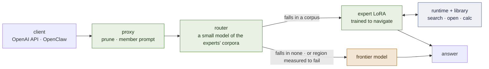

# lora-kernel

> **[HERO IMAGE PLACEHOLDER — `docs/img/hero.png`, 1600 × 640]**
> *A reading room seen from slightly above, drawn in a flat, warm, technical-illustration style —
> ink lines, two or three muted colours, no gradients, no glow. In the centre a small desk with one
> reading lamp; at the desk a single figure (neutral, not a robot) with an open card in hand. Behind
> the desk a wall of card-catalogue drawers, clearly split in two: the upper half has drawers joined
> by a thin line that runs from drawer to drawer like a route (the procedures), the lower half
> branches like a tree (the encyclopedia). A small radar dish on the desk casts a soft cone that
> lights exactly three drawers. Through a doorway on the far right, faint and distant, a much larger
> building with a sign "frontier" — where a question goes when no drawer fits. The mood: a specialist
> at work in a small, well-ordered library, not a machine that knows everything. Leave the left third
> calm enough for the title to sit over it.*

**The LoRA is not the textbook. It is the specialist who knows how to use the library.**

[](LICENSE)
[](docs/ARCHITECTURE.md)
[](docs/MEMORY.md)
[](docs/RECORD.md)

*[Español](README.es.md)*

lora-kernel is the runtime of a service: an **OpenAI-compatible API** that answers locally what
falls inside a measured region and forwards the rest to a frontier model, with **OpenClaw instances
per task** on top. A region is a small QLoRA expert over one resident small model. What an expert
knows how to *do* is in its weights; what it needs to *know* is in a library of markdown notes it
has been trained to navigate — so when a protocol changes you edit a file in git, and nothing is
retrained.

Every claim below is marked **[ran]** (observed in this repository, run named), **[read]** (from
source or a paper) or **[spec]** (decided, not yet built). **Everything measured so far is on
generated suites; no real traffic has passed through it.** That is the first thing to know about
the numbers, and the core of 1.0 is *specified*, not shipped.

---

## The core of version 1.0

> **[ILLUSTRATION PLACEHOLDER — `docs/img/core-1-0.png`]**
> *One horizontal diagram in the hero's style. A request enters from the left and meets a small
> signpost labelled "router — whose corpus does this look like?". Three lanes leave it. The top two
> lanes each lead to a small desk with a specialist and its own little bookcase (label one
> "inbox triage", the other "IV therapy"); each bookcase shows the two shelves, harness above and
> wiki below. The bottom lane, dashed, leads off the right edge to a distant large building,
> "frontier — when it looks like none". Under the two desks runs one continuous band labelled
> "runtime — referee: turns the pages · applies the site's rules · enforces the order". Above each
> desk a small tag: "LoRA — trained to navigate, not to remember".*

Five things, and how each one changes:

| | what it is | changes by |
|---|---|---|
| **An expert is its corpus** | a QLoRA per subdomain, trained by ordinary SFT; served under exactly the prompt, tool block and result format its corpus taught — or it is a different model | a training run |
| **The router** | a very small model of those same corpora: *whose distribution is this request?* — and it **abstains** when the answer is none. Abstention is the frontier | re-indexing the corpora |
| **The memory** | a library of notes the expert navigates — below | **editing markdown** |
| **The runtime** | a small Python referee inside the proxy: executes the expert's commands, applies a site's rules, enforces the order of steps | a code change |
| **The release contract** | one manifest per member — corpus, adapter, library, radar and grammar, each hashed; admitted by a paired test against the bare base | a gate that has to pass |

And one thing that attaches per subdomain where it is measured to pay, **not required by 1.0**: a
second LoRA on a large model of the same family, trained on the same corpus, that verifies what the
small one drafts ([`docs/PLAN.md`](docs/PLAN.md) milestones 3–4).

### The memory, in five pieces

Full specification: [`docs/MEMORY.md`](docs/MEMORY.md) **[spec]**.

1. **The library — two shelves of markdown**, each note under half a page. The **operational
   harness** (*how is it done?*): recipe-like notes whose links are the control flow — `requires`
   (before this, that), `next` (the step that follows), `uses` (for this step, consult…). The
   **encyclopedic wiki** (*what is it, which formula applies?*): a tree, general to specific, that
   classifies which case you are in before you compute.
2. **The radar — embeddings compressed to one subdomain.** Not a general search engine. In a closed
   domain the vocabulary has exact functional meaning, so a small vector is enough to map the only
   two intents that matter: *what situation is this note for* (`when:`) and *what does it define*
   (`what:`). It returns the two or three notes of exactly the subdomain the expert is working in.
3. **The language — three verbs.** `<search>a situation or a doubt</search>` returns titles and ids.
   `<open>id</open>` returns the note and its links. `<calc>expression</calc>` — so the model never
   does arithmetic in its head, where it always fails.
4. **The LoRA — trained on the habit of navigating.** Its training cases draw their constants fresh
   every time — a liquid invented for one exercise, a local dwell time of 15 seconds instead of 5 —
   so the answer cannot be memorised and the model is *forced to open the note to see the number*.
   What ends up in the weights is a choreography: read, search the harness, open the protocol, make
   a stop in the wiki when a step needs a fact, send the numbers to `<calc>`, follow `next`.
5. **The runtime — the software referee.** It turns the pages, writing each result right after the
   tag. It applies local rules automatically: a ward that cleanses for 20 seconds has that value
   substituted *before* the note reaches the expert, which reads the rule already resolved. And it
   watches for cheating: if step 4 `requires` step 1 and the expert never opened step 1, the runtime
   cuts the execution — without needing to know whether the final answer was right.

> **[ILLUSTRATION PLACEHOLDER — `docs/img/memory-walkthrough.png`]**
> *A vertical storyboard of seven numbered panels joined by one line, like a subway map. 1: a request
> card "500 mL over 4 h, gravity, 20 gtt/mL". 2: the expert writes `search`; the radar lights three
> cards on the harness shelf. 3: the card "Primary infusion" opens. 4: the line runs along the
> harness shelf, step to step. 5: at "set the rate" the line drops to the wiki shelf, to a card
> "gravity drip rate", and climbs back — this detour is the point of the picture. 6: a small
> calculator shows 500 × 20 ÷ 240 = 41.67. 7: the answer, "42 drops per minute". Along the bottom the
> referee band shows one green check under panel 4: "requires: safety steps — opened".*

**The gain.** If the protocol changes tomorrow you edit one markdown file in git. The LoRA is not
retrained, because what it learned was to obey the links and read the notes.

---

## What is measured

On `Qwen2.5-3B-Instruct`, the base everything released so far was trained on.

| what | the number | run |
|---|---|---|
| **One vLLM, one base, several adapters**, each request served by its own | identity `applied` on every member, tools reachable, stop honoured | **[ran]** P56 |
| **`email-full@v1`** — inbox triage, tools and judgement in one adapter | **0.989** on human messages against the base's **0.345**; re-served and re-trained, both tie the recorded run | **[ran]** P36, P57 |
| **`desk-commitment@v1`** — a second member on the *same inbox*, a different question | **240/240** against the base's **38/240**, discordant **202 : 0** | **[ran]** P64 |
| **An expert that reasons, served the way its corpus taught** — fluid mechanics, 6-to-9-step chains with a calculator and a per-case handbook | **90/90**, where the same adapter on the same cases scored **11/90** through `tool_calls` messages (79 : 0, paired) — and **24 : 0** against the frontier's 66/90. No evaluated case is in its corpus | **[ran]** M7 arm 0b |
| **On a 3B, a procedure merely pasted into the prompt is not followed** | base + a 914-token procedure: **0 tool calls on 351/351**, under the majority bar; the trained expert beats it **137 : 1** | **[ran]** P61 |
| **The API routes per request**; the client names no model | replay on 240 cases: 0.546 → 0.775, 0 misrouted | **[ran]** P41, P62 |
| **OpenClaw, live, from a laptop** | 40/40 turns local, 0 invented calls, 19/32 human turns call a tool | **[ran]** P63 |
| **A member must be served its own tool surface** | offered OpenClaw's 54 tools it copies tags off the block: 225 of 227 calls refused; pruned, 8 of 1160 | **[ran]** P59 |
| **vLLM applies a LoRA over a quantised large model** | logprob gate 3/3, mean \|Δℓ\| 0.22–0.49 nats against a base-vs-base 0.000 | **[ran]** P60 §3b |
| **Qwen 3.5 adapters are servable** — "vLLM ignores them" was a naming mismatch | same weights, 496 tensors renamed, not retrained: `not applied` → **`applied`** | **[ran]** D2 |

**The one lesson under half of that table: serve an expert the way its corpus taught it.** Under a
foreign system prompt 2 of 32 live turns call a tool, under its own 19 of 32 (P63). Through
`tool_calls` messages an inbox expert scores 0.808, with results written inline 0.992 (P55). And the
line this repository quoted most — *"the expert that decides works, the expert that reasons fails"* —
was read off a harness that never showed the expert its results the way it had been taught to read
them: 11 of 90 became 90 of 90 (M7 arm 0b). The memory is built on exactly that channel.

## What is not measured, or does not work

- **No real data.** Every suite so far is generated here, and a generated suite cannot contain a
  difficulty its author did not think of **[ran]** P50. The first real region is named — **nursing
  procedures** (Open RN *Nursing Skills*, CC BY 4.0) — and only its headroom is measured: an untrained
  4B goes from 29/48 closed-book to 45/48 with the right note open, and from 0/12 to 12/12 on a value
  a unit's protocol changed **[ran]** M5. Nothing is trained on it yet, and retrieval is untested.
- **The memory is specified, not built.** Its central claim is untested: that a library extends an
  expert to a *procedure it never trained on*. Without one, a specialist just outside its region is
  confidently wrong — 30/30 inside, 1/20 on sibling families **[ran]** P14.
- **The router is still a keyword dictionary.** Its first learned replacement, an n-gram model of
  each corpus, is safer on foreign text (0 of 128 served locally against the dictionary's 59) and
  loses **every** legitimate request from a sender the generator never drew, 120 of 120 **[ran]** M2.
  The embedding arm — the same encoder the radar uses — is pre-registered.
- **Nothing released is on Qwen 3.x yet.** `email-full` trains on `Qwen3.5-4B` and its adapter is
  home; the gates have not run. A Colab session lives sixty minutes and one member takes ~45 to
  train on the hybrid stack, so the move runs as three sessions **[ran]** M1.
- **Outside its training depth the reasoning expert is unmeasured again.** The result that it
  over-solves shorter problems (P45) came through the `tool_calls` path, and is open.
- **The saving in money has never been measured**, and no signal yet sees an answer that is coherent
  and wrong.

The full ledger, including everything that failed and the instruments that lied, is
[`docs/RECORD.md`](docs/RECORD.md).

---

## The request path

> **[ILLUSTRATION PLACEHOLDER — `docs/img/request-path.png`]**
> *A clean left-to-right flow in the same style, five stations on one line: "client (OpenAI API ·
> OpenClaw)" → "proxy — prunes the tools to the member's own, swaps in the member's prompt" →
> "router — abstains when it looks like no corpus" → "expert + its library" → "answer". From the
> router a dashed branch drops down and runs along the bottom to "frontier", rejoining at "answer".
> Under the expert station, a small inset shows the three verbs as three keys on a keyboard:
> `search`, `open`, `calc`.*



## Where it goes

Each milestone has a gate and the arm that can kill it, written before it runs
([`docs/PLAN.md`](docs/PLAN.md)). Arms are bought in sequence, never as a grid.

| # | milestone | state · the arm that kills it first |
|---|---|---|
| **1** | the pool on Qwen 3.x small (`Qwen3.5-4B`) | in progress, three sessions · the identity gate on a *real* adapter; then: loses, paired, to its Qwen 2.5 release |
| **2** | the router as a small model of the corpora | arm 1 **[ran]**, does not pass; arm 2 (embeddings) pre-registered · loses requests from unseen senders, or serves a member's own listing followed by another task |
| **7** | **the memory** — the core of 1.0 | arm 0 and 0b **[ran]**: the channel works · under an **oracle** walk — exactly the right notes open — the expert still scores ~1/20 on a sibling procedure it never trained on |
| **5** | the first real region: nursing procedures | headroom **[ran]**: 29/48 closed-book → 45/48 with the note open, 0/12 → 12/12 on a site's value · next: the same content as *walks*, against the untrained base reading the same notes |
| **3–4** | the large half of a pair, and acceptance between the halves | not started · large + LoRA does not beat small + LoRA; then: acceptance no higher than under the bare large model |
| **6** | the service policy, with the bill | not started · the local share costs more than it saves |

**Engineering constraints these carry — facts, not objections.** Everything that runs a model runs
on Colab, in sessions of under an hour; nothing runs on the user's machine. A LoRA-adapted drafter is
a vLLM RFC, not a feature **[read]**, so acceptance is measured by teacher forcing and claims no
speed-up. A 27B is A100 work in 4-bit. The `<think>` channel of the 3.x line is off for members.
Gemma 4 (2B / 12B) is the named alternative family and is blocked at PEFT **[ran]** P29.

---

## Run it

```bash
# the gates that need no GPU
python -m pytest tests -q
python scripts/check-mirrors.py

# the routing replay — by request against by region, zero GPU
python -m training.harness.route

# anything that runs a model runs on Colab through one chain — streamed, resumable, under an hour
GPU=L4 BRANCH=main MODULE=training.harness.verify_substrate \
  RUN_DIR=results/my-run training/harness/chain_serve.sh
```

Serving the pool to an agent, the proxy's flags and the substrate gate:
[`docs/SERVING.md`](docs/SERVING.md). OpenClaw, step by step, as it ran live:
[`docs/OPENCLAW.md`](docs/OPENCLAW.md). A member is served with three flags, each a default for a
reason: `--prune` (its own tool surface), `--member-prompt` (the prompt its corpus taught), `--auto`
(the client names no model).

## What is in the box

| path | what |
|---|---|
| `training/harness/openai_proxy.py`, `route.py` | the API: pruning, the member prompt, routing per request |
| `training/harness/train_pool.py`, `contract.py` | the pool registry — each member a record read off its corpus |
| `training/harness/release_gate.py`, `pool_second.py`, `pool_base.py`, `verify_substrate.py` | the door a member enters through, on this base or another |
| `training/harness/accept_rank.py` | the corpus-mode loop — stop at the closing tag, write the result inline, continue — that the memory's runtime is built on; and acceptance by teacher forcing |
| `training/harness/corpus_mode_arm.py`, `training/physics/result_use.py` | an expert re-served as its corpus taught; a failure read where it happens — *was the result used?* |
| `training/harness/corpus_router.py`, `embed_router.py`, `router_sets.py` | the router's two learned arms, and the eight sets any router is scored on |
| `training/nursing/` | the first text here nobody generated: three IV-therapy checklists, 72 checkable questions |
| `training/harness/lora_matrix.py`, `rekey.py`, `awq_lora_gate.py` | does this base — small or large — serve a LoRA at all |
| `training/harness/chain_serve.sh` | the Colab chain: provision, run detached, stream, fetch weights as they appear, resume |
| `releases/`, `results/` | the manifests, and the runs the documents cite |

## Documents

| | |
|---|---|
| [`docs/MEMORY.md`](docs/MEMORY.md) | **the memory, as it will be built** — library, radar, three verbs, the LoRA's habit, the referee; build order for 1.0 |
| [`docs/KNOWLEDGE-TRAJECTORIES.md`](docs/KNOWLEDGE-TRAJECTORIES.md) | the *why* behind it, self-contained, written to be reviewed by other models: ten findings, five strategies, ten questions |
| [`docs/ARCHITECTURE.md`](docs/ARCHITECTURE.md) | the system: experts, router, memory, runtime, the pair, the frontier |
| [`docs/PLAN.md`](docs/PLAN.md) | the living plan — milestones, gates, kill arms |
| [`docs/RECORD.md`](docs/RECORD.md) | everything measured, including what failed; each line names its run |
| [`docs/FOUNDATIONS.md`](docs/FOUNDATIONS.md) | the mathematics, tied to the runs that instantiate it |
| [`docs/SERVING.md`](docs/SERVING.md) · [`docs/OPENCLAW.md`](docs/OPENCLAW.md) · [`docs/SUBSTRATE-GATE.md`](docs/SUBSTRATE-GATE.md) | running it |
| [`CLAUDE.md`](CLAUDE.md) | instructions for coding agents, and the measurement rules that were paid for |

**The record before the rewrite of 2026-09-19** — seventy-four run directories, the retired experts,
the analyses, a 2,800-line plan — is the tag
[`v0.1-foundations`](https://github.com/EvolvingAgentsLabs/lora-kernel/tree/v0.1-foundations).
A P-number cited here without a directory on `main` lives there.

## Scope

Open source: the runtime, the memory's runtime and formats, the release contract, the gates. **Not
part of this runtime nor of the open-source version:** the customisation service and its tooling — a
customer's corpora and libraries, adapters trained as a service, the automation of traces → corpus →
gate → release. This repository builds the instrument that measures a customisation, not the tooling
that produces it at scale. Material from third parties keeps its licence: *Nursing Skills* is CC BY
4.0 and is attributed where it is used; WHO publications default to CC BY-NC-SA and are not shipped.

Apache 2.0. The idea began in a conversation with Ismael Faro.
