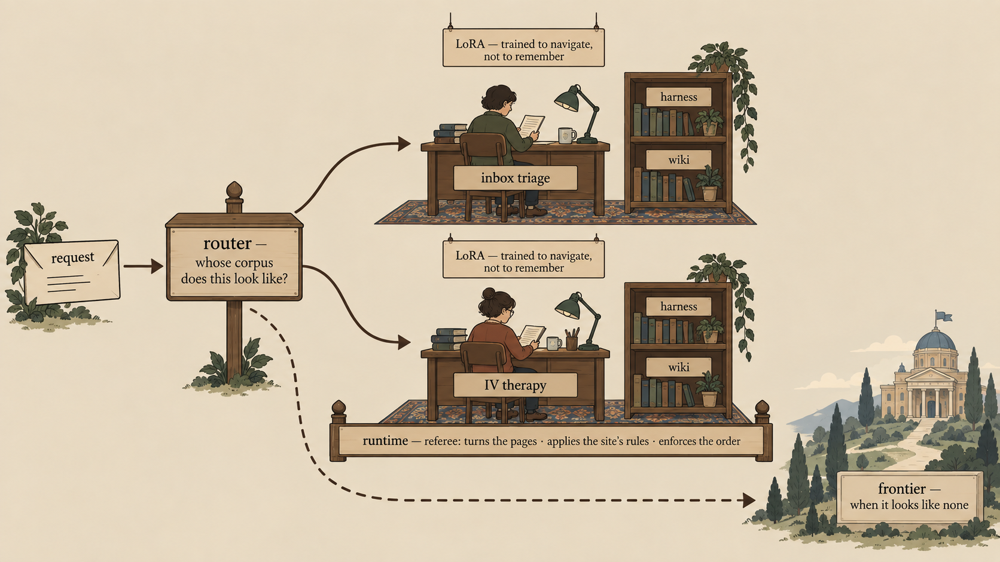
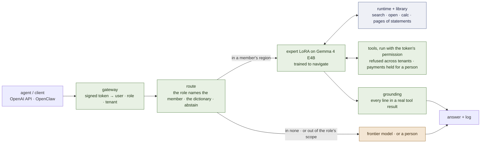
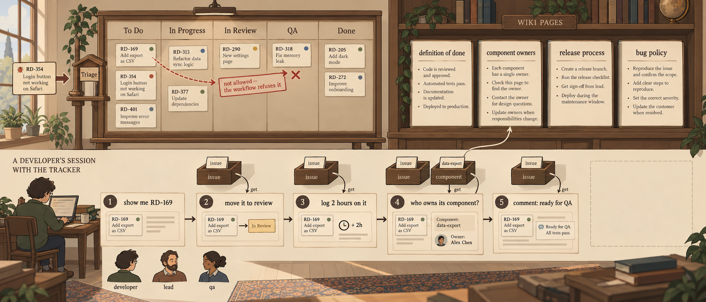

# lora-kernel


*The specialist, the library, the radar — and, through the door, the frontier, for when no drawer fits.*

**The LoRA is not the textbook. It is the specialist who knows how to use the library.**

[](LICENSE)
[](docs/ARCHITECTURE.md)
[](docs/MEMORY.md)
[](docs/RECORD.md)

*[Español](README.es.md)*

> **In one minute.** A small model (Gemma 4 E4B) gets one LoRA per job, trained on *how to walk* a
> library of markdown notes — search, open, follow the link, calculate — not on the facts inside them.
> A procedure changes: edit the note, no retraining. A tiny router sends whatever falls outside every
> expert's ground to a frontier model. Measured here **[ran]**: an inbox-triage expert at 0.989 against
> the bare base's 0.345; multi-hop questions over a wiki no model has seen, 38/40 against the bare
> Gemma's 19/40; and one lesson worth the visit on its own — the same adapter scored 11/90 served
> through `tool_calls` and **90/90** served the way its corpus taught it. Mostly on generated suites and on real regulations ingested verbatim, no
> real traffic yet; what failed is in [`docs/RECORD.md`](docs/RECORD.md). The wiki-walking adapter is on
> [Hugging Face](https://huggingface.co/Matias/lora-kernel-distributor-wiki-gemma4-e4b) — try it in ten minutes:
> [](https://colab.research.google.com/github/EvolvingAgentsLabs/lora-kernel/blob/main/examples/colab/wiki_walk.ipynb)

## Watch the demo — a whole educational centre on one small local model (76 s)

https://github.com/user-attachments/assets/e392f2b9-ff83-45f5-bc96-0da483a7b05f

**[the MP4 in the repository (1.8 MB)](docs/video/demo-escuela.mp4)** · in Spanish · every request, tool call, reply and number on screen is
copied from one recorded run — [`results/DEMO-school-diagram-20260926/`](results/DEMO-school-diagram-20260926/BRIEF.md), **15/15** on
Gemma 4 E4B + a school-staff LoRA behind the gateway. Synthetic schools; identity, payments and monitoring are demo stand-ins.
The video is HTML rendered with [HyperFrames](https://github.com/heygen-com/hyperframes): [`video/demo-escuela/`](video/README.md).

https://github.com/user-attachments/assets/bf19e256-6c78-4170-97ff-dca3b407dd6d

**And the team tracker, multi-turn, on a laptop (76 s): [the MP4 (2.4 MB)](docs/video/demo-tracker.mp4)** · in Spanish · three
sessions through OpenClaw, Gemma 4 E4B + `tr-s1` on llama.cpp, carrying the keys, not the conversation — every turn copied from
[`results/LIVE-tracker-openclaw-20260930/`](results/LIVE-tracker-openclaw-20260930/BRIEF.md), **14/14**, dependent 8/8 · [`video/demo-tracker/`](video/README.md).

**And live, not only scripted [ran] 2026-09-26: 15/15 through the real OpenClaw.** The same scenes sent by OpenClaw 2026.9.4
itself — one profile per role, each holding its signed token as the provider key — to the gateway, with the member on a
rented L4 and **Claude Haiku 4.5 as the frontier** for what no tool covers: every scene passes, the one frontier turn cost
$0.0112, and the director's approval executed the held charge. How to point your own OpenClaw at it:
[`docs/OPENCLAW.md`](docs/OPENCLAW.md) §6 · the run: [`results/LIVE-school-openclaw-20260926/`](results/LIVE-school-openclaw-20260926/BRIEF.md).

**The distributor too, live and on a laptop [ran] 2026-09-28: 6/6 through the real OpenClaw.** The distributor's member
(`gemma-4-E4B-it` 8-bit + `distributor-staff-out-s0`, llama.cpp on a MacBook Air M4) behind the same gateway (`--org
distributor`): an order read, a stock read, a ticket written, another centre's order refused by the tool, a delivery note's
planted instruction reported as data — and, since M10 taught it to abstain (20/20 held out, 0 of 70 lost), a request no
tool covers **forwarded to Claude Haiku 4.5** ($0.0112). No GPU rented; 5 of 6 turns never left the machine
([`LIVE-distributor`](results/LIVE-distributor-openclaw-20260928/BRIEF.md) · [`M10`](results/M10-distributor-abstain-20260928/BRIEF.md)).

## The problem

An organisation running on agents keeps sending the same handful of repeating jobs — triage an
inbox, log a maintenance request, answer from a checklist — to a frontier model in the cloud, at
frontier prices, on data that often should not leave the building. The usual answer, fine-tuning a
model on the outcomes, trades that away for a worse problem: the facts end up **baked into the
weights**, so the day a procedure changes there is no file to edit — only a retrain, and until it
happens the model confidently gives the old answer.

lora-kernel keeps the facts in a library of markdown notes a person can read and correct, and trains
a small model only to find its way to the right one. What an expert knows how to *do* — which tools
to reach for, in what order, under this organisation's own rules — lives in a small adapter's
weights, trained by ordinary SFT. What it needs to *know* — the current value, the current
procedure — stays outside the weights, in a file. A very small router decides which expert's
territory a request falls in, and abstains to a frontier model for everything else, so nothing gets
answered outside its trained ground.

It ships as an **OpenAI-compatible API** — one resident model, several adapters, each request served
by its own — with **OpenClaw instances per task** on top.

Every claim below is marked **[ran]** (observed in this repository, run named), **[read]** (from
source or a paper) or **[spec]** (decided, not yet built) — and everything measured so far is on generated suites or on real documents ingested verbatim, never on real traffic. The living numbers, including what has not passed, are in
[`docs/PLAN.md`](docs/PLAN.md) and [`docs/RECORD.md`](docs/RECORD.md); what follows is what does not
change every time one of them moves.

---

## The core of version 1.0



*The core of 1.0: a router that may abstain, a specialist and a library per subdomain, one referee under all of them.*

Five things, and how each one changes. **Status, 2026-10-05: all five are built and measured** — hence the badge, "core 1.0 built, measured" — with what has not passed named: the radar's gate (recall@3 0.638 against 0.80, W3 **[ran]**), a verifier nobody here wrote (τ²-bench, below: installed, no member scored yet) and real traffic:

| | what it is | changes by |
|---|---|---|
| **An expert is its corpus** | a QLoRA per subdomain, trained by ordinary SFT; served under exactly the prompt, tool block and result format its corpus taught — or it is a different model | a training run |
| **The router** | a very small model of those same corpora: *whose distribution is this request?* — and it **abstains** when the answer is none. Abstention is the frontier | re-indexing the corpora |
| **The memory** | a library of notes the expert navigates — below | **editing markdown** |
| **The runtime** | a small Python referee inside the proxy: executes the expert's commands, applies a site's rules, enforces the order of steps | a code change |
| **The release contract** | one manifest per member — corpus, adapter, library, radar and grammar, each hashed; admitted by a paired test against the bare base | a gate that has to pass |

And one thing that attaches per subdomain where it is measured to pay, **not required by 1.0**: a
second LoRA on a large model of the same family, trained on the same corpus, that verifies what the
small one drafts ([`docs/PLAN.md`](docs/PLAN.md) milestones 3–4).

## Design principles

- **A member is a learned procedure, not a store.** What a LoRA holds is a dynamic — state →
  transformation → next state: search, open, follow a link, cite — and the library holds the
  content. Trained on walks over one real regulation family, `real-spans-s0` cites on a family it
  never saw, 18/23 against the untrained base's 9/23, two seeds — but only because the dynamic was
  learned over real text: trained on a generated world instead, the member learned the generator and
  scored 0/25 on a real one ([`REAL3`](results/REAL3-real-corpus-20260930/BRIEF.md) **[ran]**,
  [`REAL0`](results/REAL0-real-library-20260930/BRIEF.md) **[ran]**). The direct test is editing the
  library without touching the weights: a member that has never even seen a library answers 17 of 17
  questions with a number changed after training, each cited to the edited statement, 0 stale
  ([`EDIT0`](results/EDIT0-edit-without-retraining-20261004/BRIEF.md) **[ran]**).
- **The division of labour is already in the architecture.** The router decides which corpus a
  request falls in and abstains to the frontier; the members hold the learned procedure per
  subdomain; the library holds the content; the referee and runtime check what can be checked
  without the answer key; the frontier takes what falls in no corpus — a mapping of what the core
  above already is, nothing new.
- **An evaluation acts on the system; it advises a member only if its corpus taught it to take that
  advice.** Handed back as a hint, the citation check repaired 0 of 6 wrong answers — a small model
  does not follow what it merely reads ([`CITE0`](results/CITE0-runtime-check-20261002/BRIEF.md)
  **[ran]**). As a gate in front of the runtime instead, the same check withholds 86 of 165 not-right
  answers and 0 of 275 right ones, at a stated cost (43 of 347 right values withheld under a failing
  citation) — on by default since the user's 2026-10-02 decision
  ([`GATE0`](results/GATE0-cite-gate-20261002/BRIEF.md) **[ran]**).
- **Compute at test time, under the gate — BOK HELPS, not enough to turn on.** Walk once, greedy —
  the served arm. Where the gate would withhold that answer, walk again and deliver the first walk
  the gate passes: pooled over CITE0's and REAL4's 52-row sets, 16 rows resampled, gain 4 (walk 1
  wrong, resample right) against new wrong 3 (walk 1 withheld, resample still wrong) — gain > new
  wrong but exact sign test $p = 1.0$, short of BOK WORKS' gain ≥ 5. Read: a first walk that passes
  the gate is right 72/88 (82%), a resampled one that passes it only 4/7 (57%) — sampling until the
  gate passes finds a citation it accepts, not necessarily the one the question asks about, which is
  exactly what every new-wrong row does. **Not turned on**
  ([`BOK0`](results/BOK0-best-of-k-20261002/BRIEF.md) **[ran]**).
- **A page can open small instead of merely capped — PAGE TOP HELPS.** Showing only the question's
  best 8 statements of a page (`page_top`, the served default since the user's 2026-10-02 decision)
  answers 34 of 44 against the unchanged page's 30, paired 6:2 ($p = 0.29$), at a third of the walk
  text, on a fourth real family never seen before ([`PAGE0`](results/PAGE0-page-top-20261002/BRIEF.md)
  **[ran]**). Training a corpus under that served form, with the referee's `recover` guard mode
  measured for the first time, repairs nothing on the same set — the format-corpus line stops there
  ([`FMT0`](results/FMT0-format-corpus-20261002/BRIEF.md) **[ran]**).

### The memory, in five pieces

Full specification and its record: [`docs/MEMORY.md`](docs/MEMORY.md) (~~**[spec]**~~ built through W9 **[ran]**).

1. **The library — two shelves of markdown**, each note under half a page. The **operational
   harness** (*how is it done?*): recipe-like notes whose links are the control flow — `requires`
   (before this, that), `next` (the step that follows), `uses` (for this step, consult…). The
   **encyclopedic wiki** (*what is it, which formula applies?*): a tree, general to specific, that
   classifies which case you are in before you compute. **Shaped like Wikipedia, its unit is the
   atomic statement:** a page is a list of one-sentence, checkable statements under anchors
   (`§supplier`, `§if-damaged`), links live inside the statement that names them, and an answer cites
   the statement it rests on — so the memory is verifiable, not just searchable
   ([`docs/MEMORY.md`](docs/MEMORY.md) §1.6 — **[ran]** W9: a trajectory LoRA walks it 35/40 where the untrained
   base walks 0/40, 3-hop 16/16).
2. **The radar — embeddings compressed to one subdomain.** Not a general search engine. In a closed
   domain the vocabulary has exact functional meaning, so a small vector is enough to map the only
   two intents that matter: *what situation is this note for* (`when:`) and *what does it define*
   (`what:`). It returns the two or three notes of exactly the subdomain the expert is working in.
3. **The language — three verbs.** `<search>a situation or a doubt</search>` returns titles and ids.
   `<open>id</open>` returns the note and its links. `<calc>expression</calc>` — so the model never
   does arithmetic in its head, where it always fails.
4. **The LoRA — trained on the habit of navigating.** Its training cases draw their constants fresh
   every time — a liquid invented for one exercise, a local dwell time of 15 seconds instead of 5 —
   so the answer cannot be memorised and the model is *forced to open the note to see the number*.
   What ends up in the weights is a choreography: read, search the harness, open the protocol, make
   a stop in the wiki when a step needs a fact, send the numbers to `<calc>`, follow `next`.
5. **The runtime — the software referee.** It turns the pages, writing each result right after the
   tag. It applies local rules automatically: a ward that cleanses for 20 seconds has that value
   substituted *before* the note reaches the expert, which reads the rule already resolved. And it
   watches for cheating: if step 4 `requires` step 1 and the expert never opened step 1, the runtime
   cuts the execution — without needing to know whether the final answer was right. **And it decides what
   a reply may state:** every answer cites the statement it rests on, and the referee checks the citation;
   in front of tools, the gateway shows no line that is not in a real tool result (`examples/common/grounding.py`).


*One question, end to end: pages of one-sentence statements, links inside the sentences, an answer that names the sentence it rests on.*

**The gain.** If the protocol changes tomorrow you edit one markdown file in git. The LoRA is not
retrained, because what it learned was to obey the links and read the notes — tested directly by
patching one statement in the library after training (W7): the member follows the new value 37 of
38 times, cited to the patched line, 0 stale; closed-book, the same weights recite the old value
only 1 time in 40 — evidence for what this claim actually rests on: the route was learned, not the
fact ([`results/W7-edit-after-training-20260927/`](results/W7-edit-after-training-20260927/BRIEF.md)).


*H1: fetching a value by key fixes what reading the history lost — the claim now names the order.*

**Short-term operational memory, next to the library — built, [ran] in tests, not yet trained on**
(`examples/common/opmemory.py`). The library above is what an expert *knows*; this is where a
workflow keeps its *live* state: a session cache keyed by (organisation, user, session) and a
global cache per organisation (`global.<key>`), served by the tool layer exactly like any other
tool — bounded by the signed claim, so no key ever crosses an organisation or a user — keys
validated, values capped at 500 characters, every write logged. It lives in memory and dies with
the gateway, short-term by design. A workflow is declared, not neural: one TOML file per role
(`examples/distributor/workflows/*.toml`, six roles, two or three states each), advanced only by
the calls the tool layer *ran* — the model never sets the state, only reads it. Served with
`Gateway(memory=, workflows=, tool_block=)`, a turn's whole context becomes one line —
`state: <workflow>/<state> · keys: <names>` — instead of the conversation, and the model fetches
(`<get>key</get>`) or stores (`<put>key=value</put>`) a value only in the step that needs it.

**The workflow harness — the user's idea, 2026-09-29, designed [spec].** For a
subdomain, a member learns in its weights the domain's workflows, its tools, and the *keys* of
that operational memory — never the values, never the conversation, so the prompt stays flat as a
session grows. What lands in the corpus is the same choreography as the library above, extended
from reading (`<open>id§anchor</open>`) to reading *and writing* operational state. It is a harness
inside each member, one corpus — not a separate adapter composed with a domain one, which is what
parked the earlier `harness.lora` (composition could not be measured cleanly, P9/P13). Full design:
[`docs/review/harness-workflow-kv.md`](docs/review/harness-workflow-kv.md).

**H1 has a result, and it reads two ways [ran].** Against `history`'s 43 of 54 dependent turns, the
harness arm (`wf-s0` + the operational memory) gets 53 of 54 — 1 lost, 11 gained — with
customer-service claims now naming the order fetched by key (10/10 against history's 2/10),
dispatch 14/14, and every one of the 53 right turns traced to a `<get>` by key (53/53); the prompt
itself stays flat per turn (745, 726, 710 tokens) where history's keeps growing (345, 428, 394). The
same corpus without the tool block (`harness-noblock`) scores 0 of 60: without it the member calls
no tool and states data it never read — its corpus was never trained without the block. Read across
both arms, the pre-registered gate (first turns ≥ 90% *in every arm*) is tripped by the no-block
arm alone, which voids the run as written — an instrument design error, recorded, not one the code
was changed to fix after seeing the result. Read per arm instead, the harness **PASSED** and
harness-noblock **FALSIFIED**. **The user's decision (2026-09-29): the per-arm reading stands —
harness PASSED, harness-noblock FALSIFIED; the as-written VOID is kept as the record of an
instrument error, not as the verdict.** In these short (2–3 turn) sessions the harness pays roughly 2× the prompt
tokens per turn (an extra get → call → put round-trip); the saving it is built for belongs to longer
sessions, which is why a Jira-and-Confluence-like tracker domain (`examples/tracker/`) was built for
that case
([`results/H1-workflow-harness-20260929/`](results/H1-workflow-harness-20260929/BRIEF.md)).

**H2 has a result, on the tracker domain, and the user's decision (2026-09-29) reads it as reading
1.** 60 held-out long sessions, 160 dependent turns: the harness gets **146 of 160 (91.3 %)**, above
the 90 % bar, flat over five turns (p̄ 1613, 1223, 1011, 1149, 1274 — p̄5 ≤ 1.1 p̄1 holds);
descriptively, paired against `base-history` on the same 160 turns, **142 : 0**. `base-history`
itself scores 44 of 60 on first turns, trips the same per-arm VOID rule as a broken treatment would,
and voids the comparison — a rule meant to catch a treatment mid-training instead caught an
untrained baseline whose failure *is* the headroom, so the pre-registered "beats base-history" reads
**FALSIFIED as written**, and stays on record with those two instrument errors (the per-arm VOID
asked of an untrained baseline, and the anchor check below). **The user's decision: reading 1 —
the readable conditions are H2's verdict, the harness PASSED.** Not rerun: no rule change could move
a baseline at 4/160. `harness-noblock` (the tool block removed at serving) reaches 80 of 160 — a
corpus bug, not partial learning: the generator rendered the block-less third by the same modulus
(`% 3`) the roles rotate on, so all 400 block-less rows were QA's, and the member learned block-less
exactly the role it was shown (QA lane 80/80; lead and developer lanes 0/20, lead's only exception
`sprint_board`, a call with no argument) — still short of the bar. In the harness arm the 14 dependent misses are all one turn, QA's final comment (6/20): the member re-reads the issue or tries a refused transition instead of commenting — a real miss, on one eval phrasing ("Note on it: …" 1/15 vs "Put a comment on it: …" 5/5); separately, 10 of the 60 independent turns (50/60) are the anchor check — "where must tests pass?" reads the whole `definition-of-done` page instead of `#tests`, and the statement is in what it read (measuring phrasing, recorded, not loosened). **H3 has a result [ran]:**
trained on a second corpus — wording widened by two phrasings per turn in every role, a block-less
third of each role — `tr-s1` scores 158/160 dependent (98.8 %) on a fresh held-out suite against
`tr-s0`'s 147/160 on the same turns, paired 11:0, exact sign test p = 0.00098, 0 lost, flat prompt —
**H3a PASSED**. Served without the tool block, `tr-s1` scores 156/160 (97.5 %), every role above the
bar (developer 76/80, lead 40/40, QA 40/40), at about a third of the prompt tokens per turn — **H3b
PASSED**: the block-less member is the compact context the design asked for. Read where they happen:
`tr-s1`'s 2 misses are one case, the note's own text taken as a command (`issue_transition → qa`,
refused by the tool layer); the block-less arm's 4 misses are one session whose first turn cascades an
error through the rest ([`results/H3-tracker-corpus-v2-20260929/BRIEF.md`](results/H3-tracker-corpus-v2-20260929/BRIEF.md))
([`results/H2-tracker-harness-20260929/`](results/H2-tracker-harness-20260929/BRIEF.md)).
**And it runs live on the user's Mac** — `tr-s1` block-less with the operational memory, llama.cpp Q8_0 + its LoRA as GGUF, driven through OpenClaw over three sessions (lead, developer, QA): **14/14 turns, dependent 8/8**, gateway latency median 3.7 s, ~370 prompt tokens a turn ([`results/LIVE-tracker-openclaw-20260930/BRIEF.md`](results/LIVE-tracker-openclaw-20260930/BRIEF.md)).

A command-like note is not obeyed: on 40 unseen ones ("mark as done once CI is green", …) `tr-s1` writes 40/40 as comments and runs none — no headroom, so no new member was trained ([`H4`](results/H4-tracker-command-notes-20260930/BRIEF.md)); a key the user types is now kept even when a turn's call goes wrong (`[capture]`, `docs/MECHANISMS.md` §9). The span-masked loss that fixed real-document training (below) is not a new default: checked for cost on this tracker member near its own ceiling, it regresses one phrasing 0 of 20 against the whole-text loss it would replace — short-result members keep the whole-text loss, the span-masked one stays for where results are long ([`H5`](results/H5-span-loss-tracker-20261001/BRIEF.md)).

**The gateway is hardened against a restart and against reaching outside its own hosts [ran] (#310).** What a workflow leaves for a person survives a process restart: approvals and handoffs are journaled (`approvals.jsonl`, `handoffs.jsonl`) and read back on start, so a charge already `executing` when the process died comes back `interrupted` — listed for the approver, never re-run on its own — and a held write executes at most once, with the requester's own scope. The process's own egress is closed to its configured hosts (`examples/common/egress.py`): the member's server, the frontier's host and loopback, DNS lookup included — everything else denied before it even resolves — and the gateway now sets `HF_HUB_OFFLINE` so it stops asking the model hub over the network at start-up. Headroom checked before building anything more: every recorded turn across three domains and both engines replayed, 70 exposed a planted instruction in a tool result, 0 acted on it — no unasked write, no reach into another organisation — so the proposed next step, wrapping foreign material in its own fence, is not built; there is nothing on these suites for it to fix ([`INJ0`](results/INJ0-planted-headroom-20260930/BRIEF.md)).

**The memory's walk did not transfer to real documents, and now it does.** On a library ingested verbatim from US regulations, `distributor-wiki@v2` scored 0/25 multi-hop: it searched with queries memorised from its generated training world and never opened a page ([`REAL0`](results/REAL0-real-library-20260930/BRIEF.md)). The runtime's own mitigations — the question's own text as the first search on every shelf, a fallback to its literal text, a page opened with its statements attached — closed most of the gap with no retraining, to 24/25 ([`REAL1`](results/REAL1-entry-20260930/BRIEF.md)–[`REAL2`](results/REAL2-page-text-20260930/BRIEF.md)). Trained instead on walks over **real** documents of another family, with the loss masked to the model's own spans so it learns to answer rather than to copy the pages it is shown, the same line reaches **18/25 on these same rows** — against the untrained base's 7/25, from `distributor-wiki@v2`'s 0/25 — and **18/23 (78 %)** on a fresh, harder multi-hop set, both seeds, against the base's 9/23 ([`REAL3`](results/REAL3-real-corpus-20260930/BRIEF.md)). Refusal — the trained member answered every unanswerable question, 0/4 — is then fixed the same way, 27 unanswerable walks added to the corpus: 15/16 refused, 0 false refusals of 36 answerable; as written this is FALSIFIED on the headline's cost by one row (loses 3 where the bar is ≤ 2), and whether that cost is real or is vLLM's own run-to-run spread is noise — the reading **the user accepted on 2026-10-01**: `real-none-s0` is the real-document member ([`REAL4`](results/REAL4-refusal-20260930/BRIEF.md)). Unchanged again, the same member walks a **third** family chosen for the opposite property — EPA 40 CFR 112, 15 pages, 146 links (9.7 per page) against the second family's 22 total — at **15/25 (60 %)**, under the 70 % bar but 7× the untrained base (13 : 0, $p = 0.00024$) and refusals 5/5; most of the lost rows cite a statement holding the same number as the one asked, not the wrong page — the strict citation on repeated values, not the walk, is the open item ([`REAL5`](results/REAL5-third-family-20261001/BRIEF.md)).

**The citation on repeated values stays where REAL5 left it — two corpus changes have now failed to move it, and the line stops here.** A corpus of one-hop walks whose value repeats across the training regulations left REAL5's citation exactly where it was — `real-cite-s0` ties `real-none-s0` 15/25 — because the misses are multi-hop rows cited at the wrong end of a link, not a one-hop choice among repeats; one of REAL5's rows rests on a statement with a word-for-word twin elsewhere in the library, which no reading can separate ([`REAL6`](results/REAL6-citation-20261001/BRIEF.md), FALSIFIED). REAL7 trained cross-link decoy walks instead — the answer at a link's end, the same number sitting as a decoy at its start — on a training family extended with four more parts of 49 CFR, and read the verdict on REAL5's twin-free headline: `real-link-s0` ties `real-none-s0` 13/21 (4:4 paired, $p=1.0$), under the ≥ 15/21 bar — though the value is right more often (22 against 20 of 25) and refusals hold 5/5 both — **FALSIFIED**. Two corpus changes aimed at this citation (REAL6, REAL7) have now changed nothing; by the rule on counting redesigns, this corpus line on this citation question stops here. What stands: `real-none-s0` with the runtime cites the supporting statement on 13/21 twin-free multi-hop rows of a third family (value right 20/25), refusals 5/5 — what might move it next is not another corpus but a runtime citation check that rejects a citation whose page the walk did not end on, measured on a fresh set ([`REAL7`](results/REAL7-crosslink-20261001/BRIEF.md)).

**The real-document member is served the way the product would be, and the live run finished and PASSED.** `examples/library/serve.py` puts `real-none-s0` behind an OpenAI-compatible endpoint on llama.cpp (the E4B as Q8_0 + the LoRA as GGUF f16, context **12,288** — 16,384 ran out of memory on the user's 16 GB Mac, `-b 512 -ub 512`) running REAL4's own runtime — full-text entry on every shelf, fallback, pages opened with their statements — egress closed to the model server; `live_library.py` drives it through **OpenClaw 2026.9.4**, a fresh session per question, and grades the reply the way REAL4 did, off the endpoint's own walk record. REAL4's 52 questions, 22.5 minutes: **36/52** — headline 16/23, refusals 15/16, one-hop 5/13 — against REAL4 on vLLM bf16's 38/52 (16/23, 15/16, 7/13): **PASSED** (bar ≥ 34, refusals ≥ 13, headline ≥ 14); the headline and the refusals match the measured arm exactly, the two rows lost are one-hop. Every loss reads where it happens, and it is the edge's, not the member's: 4 walks overflowed the 12,288-token context after opening a ~7k-token page whole, one OpenClaw question timed out with no walk recorded, and three slow questions were re-sent wrapped in OpenClaw's own queued-message envelope; a walk with no final line no longer shows as `Not in my library.` (`serve.NO_ANSWER`). Owed: stripping that envelope before the runtime reads the question, and a page budget so a long page fits a 12k context ([`LIVE-library`](results/LIVE-library-20261001/BRIEF.md)).

**Both owed edge items are now built, and the edge's own losses measure at zero — the score still falls one short.** `examples/school/gateway.runtime_request` strips OpenClaw's queued-message envelope before the runtime reads the question, and `memory.runtime.Conversation.page_budget` (served at **2,500** tokens by `examples/library/serve.py`) opens a page over that budget with its statements in BM25 order against the question until the budget, the rest left as openable anchors — on this library only 29 CFR 1910.178 exceeds it. The same 52 questions, run again: **37/52** — headline 16/23, refusals 14/16, one-hop 7/13 — against this run's 36/52 and REAL4 on vLLM's 38/52; **0** context overflows (4 before) and **0** envelopes (3 before), paired against LIVE-library **3 : 2** ($p = 1.0$). Verdict as written: **NO CHANGE** — 0 overflows but 37 < 38, not REGRESSED (headline and refusals clear their bars, no paired loss). The three wins are exactly the rows the edge had cost; the one new loss, `none-9`, is the budget showing a question's best-matching statement to a question the library cannot answer. ~~Owed: why OpenClaw holds a finished turn on 3 rows~~ — found: node held inside its own exit after a successful run; the driver now ends the turn's process group shortly after OpenClaw's own run-ended line instead of waiting on an exit that might not come, and the endpoint itself always answers a walk that raises instead of leaving OpenClaw to re-send it ([`LIVE-library2`](results/LIVE-library2-20261002/BRIEF.md)).

**A runtime check that rejects a bad citation before it leaves fires clean and still cannot be repaired: FALSIFIED.** `cite_check` reads only the referee's own record — never the answer — and on a fresh 52-row set over a third family it fires on 6 rows with **converted 0, broken 0**: told why its citation fails, the member does not write a better one. What it is, measured: a detector with no false alarm, 15 fires and 0 on a right answer across this set and LIVE-library2's; the next step is the check as a **gate**, not a hint — a line that fails it is not delivered ([`CITE0`](results/CITE0-runtime-check-20261002/BRIEF.md)).

**That gate has a result of its own, and it works.** Replayed exactly on 532 recorded `+page` walks, `--cite-gate` blocks 0 of 275 right answers and 86 of 165 not-right ones (52.1%), raising delivered precision 0.625 → 0.777 — at a real cost read in full, not hidden: 43 of the 86 blocked rows hold a right value under a citation that fails (43 of 347 correct values withheld, 12.4%). **It ships on by default in the served endpoint — the user's decision, 2026-10-02, accepting that cost; `--no-cite-gate` turns it off** ([`GATE0`](results/GATE0-cite-gate-20261002/BRIEF.md)).

---

## The request path

![One line of seven stations: an agent; the gateway reading a signed badge; the operational memory — one index card (state and key names) and two drawers, session and organisation, with a workflow dial; the role's small local expert, fetching and storing by key; tools run with the badge's permission, one record refused and a payment held; a sheet with an invented line crossed out; the answer. A dashed branch for out of scope leads to a distant building and to a person; a log band runs under everything.](docs/img/request-path.png)

*The request path: the expert reads one card and the keys it needs, never the conversation; permission, holds and grounding are the gateway's.*


```mermaid
flowchart LR
    C["agent / client<br>OpenAI API · OpenClaw"] --> G["gateway<br>signed token → user · role · tenant"]
    G --> R["route<br>the role names the member · the dictionary · abstain"]
    R -- "in a member's region" --> E["expert LoRA on Gemma 4 E4B<br>trained to navigate"]
    E <--> M["runtime + library<br>search · open · calc · pages of statements"]
    E <--> T["tools, run with the token's permission<br>refused across tenants · payments held for a person"]
    E --> V["grounding<br>every line in a real tool result"]
    R -- "in none · or out of the role's scope" --> F["frontier model · or a person"]
    V --> A["answer + log"]
    F --> A
    classDef local fill:#e8f1e4,stroke:#4a7a3a,color:#1d3314
    classDef art fill:#eef0f6,stroke:#4a5a8a,color:#1d2240
    classDef out fill:#f4e6d4,stroke:#9a6a2a,color:#3d2a0e
    class G,R,E,T,V local
    class M art
    class F out
```

## Where it sits in an organisation

An organisation that runs on agents tends to draw the same picture: people in a few roles on top; an
agent runtime with **one agent per role**; the applications those agents operate; the channels people
already use; and, at the bottom, one database with identity, payments and monitoring beside it. In
that picture every agent is a system prompt over the same remote model.

lora-kernel is the layer under the agent column. **Each role becomes an expert** — an adapter trained
on how *this* organisation does that job — **with two drawers of notes**: how we do it here, and what
we know. The role a message arrives from says *which* expert — free, and measured safe **[ran]** F2; *whether* the request is inside that expert's region is still the router's job. What an
expert is measured to handle is answered on the organisation's own machine; the rest goes to the
frontier, or to a person where policy says nothing leaves the building. The systems of record stay
where they are: **records stay in the database, habits go in the adapter, knowledge stays in notes a
person can read and correct.**


*Where it sits in an organisation: records stay in the database, habits go in the adapter, knowledge stays in notes a person can read.*

The same shape, in other rooms — none of these is measured, they are where the design points:

| organisation | roles that become experts | what goes in the two drawers |
|---|---|---|
| **a distributor** | customer service, receiving, dispatch, purchasing, claims | the site's handling procedures · catalogue, carriers, service levels |
| **an accounting or law office** | intake, document review, deadlines, billing | the firm's checklists and templates · the rules of its jurisdiction, client by client |
| **a school or training centre** | enrolment, teaching support, communications, purchasing | how this school handles each case · programme, calendar, regulations |
| **a repair or field-service company** | equipment intake, diagnosis, spare parts, warranties | the procedure for each kind of repair · manuals, parts lists, warranty terms |
| **a club or community centre** | memberships, activity sign-ups, facilities, collections | how this club handles each case · activities, fees, house rules |
| **a property manager** | tenant requests, maintenance, collections, suppliers | the escalation procedure per building · contracts, by-laws, supplier terms |

What they share is what makes a region worth an expert: **the same few procedures, repeated daily,
with local rules that differ from the textbook, over data that should not leave.** The first library
in this repository is built from an open textbook's step-by-step procedures
([`knowledge/nursing-iv/`](knowledge/nursing-iv/)). What is *not* established is in the section
below, and it applies here in full: no real traffic yet, and the claim that a library extends an expert to a procedure it never trained on holds on the atomic-statement wiki (W9) and, trained on real text with a span-masked loss, on real regulations (REAL3), and did not on the nursing library's two-valued notes (W5, W5c) — ~~untested~~.

## Where it stands

**Already running.** One vLLM instance serving several LoRA adapters off one resident base, each
request routed to its own adapter, live through the OpenAI-compatible API and through OpenClaw
**[ran]** — the mechanism above is not a diagram, it answers real turns today. One trained expert,
served exactly the way its corpus taught it, reaches human-level accuracy on the job it was trained
for (inbox triage, 0.989 against a bare base's 0.345) **[ran]**.

**The memory works on its first test bed [ran].** On a wiki of atomic statements whose facts no model can know,
the untrained base cannot walk two- and three-hop questions (0 of 40); a trajectory LoRA trained on 32 other worlds
walks them 35 of 40 with every answer's citation verified, 16 of 16 at three hops — and on Gemma 4 E4B, 38 of 40
(`docs/PLAN.md` milestone 7, W9 and B1).

**A reference organisation, working end to end [ran].** The school demo: identity from a signed token, another
school's records refused by the tool layer, a payment held until a director approves it, out-of-scope requests
handed to the frontier or to a person, a log and a dashboard — and **every reply checked against the real tool
results by the gateway, outside the model**. **15 of 15 scenes covering every role and every box of the reference diagram** (dev, trainee, marketing, educator,
purchasing, CFO, IT; agenda, memberships, enrolments; communications, operations, purchasing, payroll, marketing,
dashboards) on Gemma 4 E4B with a school-staff adapter — the first 8 from 3 of 8
with a bare model ([`docs/DEMO.md`](docs/DEMO.md)).

**That school member's LoRA needs only its top half [ran] (E6).** Restricted to layers 21–41 of 42,
it matches the full adapter exactly — 70 of 70 held-out, 15 of 15 on the demo — and the KV of the 21
layers below comes out bit-identical to the base, a base-vs-base control included. It does not save
anything yet: the E4B already caches 24 of 42 layers across adapters, so a switch still recomputes
layers 21–23, and the result rests on one seed
([`results/E6-upper-layers-20260927/`](results/E6-upper-layers-20260927/BRIEF.md)).

**The family is Gemma 4** since 2026-09-25: measured against Qwen3.5-4B on the same wiki, a tie, and the user's
development stack targets Gemma. **Every released member is on Gemma 4 E4B** — `email-full@v3`, `desk-commitment@v3`,
`distributor-wiki@v2`; the Qwen 2.5 releases stay only as the control arm.

**The pair, measured [ran].** The large half is `gemma-4-12B-it` — one id space with the E4B, a LoRA served applied,
small enough for a Mac mini. Its LoRA raises acceptance of the small member's drafts (α 0.871 → 0.898, 76 : 18
records), so it earns its place as the **verifier**. It buys **no accuracy**: on a band of comparison questions both
halves failed while the corpus never showed one, and once it did the small member alone went from 10 to 37 of 40
(milestones 3 and 4, B2–B5). **A second region finds the same thing: no case for the large half's accuracy. [ran]
PAIR0, 2026-10-02:** before training a 12B member for the real-document region, the two bare bases under the served
runtime — the 12B loses to the E4B, 11/44 against 21/44 answerable rows, paired 2 : 12, $p = 0.013$. No 12B member is
trained for this region either; the pair stays a speed result without a region that needs the large half's accuracy.
**PAIR1 [ran], 2026-10-03 — TIE:** untrained size conflates with protocol, so the pair's own definition — both
halves trained on the same corpus — got its own try. Training took two out-of-memory failures at window 4,096 on a
40 GB A100 and a refused H100 (quota) before `span_logits_loss` (proved equal to HuggingFace's own loss) let it
finish. Trained, `real-none-12b` ties `real-none-s0` on PAGE0's record: 33/44 against 34/44 answerable, paired 5 : 6
($p = 1.0$), 23/30 against 24/30 multi-hop, 10/14 one-hop and 7/8 refusals both — and 33/44 against FMT0's record
too. With B3, a second region where the large half buys no accuracy; the speculative pair stays a speed result
(B4, F0, C0, F0c) without a region that needs it. Trained, the 12B walks clean — 0 thought lines where the bare
12B left hundreds in PAIR0 — so the protocol was the training, not the size. One observation beside the verdict:
the two members err on different rows (39/44 right by either) ([`PAIR1`](results/PAIR1-large-member-20261003/BRIEF.md)).

**Confirmed on a full-size GPU, bf16 (C0).** The 12B's native MTP drafter with the expert LoRA on:
1.92× on the domain (α 0.34), 2.40× general; the base pair alone runs 2.80×/2.60×. A merged E4B
drafter aligned to the same LoRA did not run this round: it OOMs beside the 12B on an L4, vLLM's
online FP8 fails on that GPU, bitsandbytes is not an accepted drafter quantisation, and an H100
request was refused for quota. Restricting that LoRA to the drafter's own upper layers doesn't help
either — α on the domain goes base 0.82, full LoRA 0.44, upper-half 0.43 (ρ = −0.02, NONE) — and in
vLLM the upper-half adapter serves at the full one's exact speed: half an adapter saves memory, not
time ([`results/C0-aligned-draft-20260927/`](results/C0-aligned-draft-20260927/BRIEF.md),
[`results/C0-upper-e4b-20260927/`](results/C0-upper-e4b-20260927/BRIEF.md)).

**Speculative decoding with a LoRA expert, running [ran] 2026-09-27 (F0).** One vLLM server, `gemma-4-12B-it` + an expert
LoRA + **Gemma 4's own MTP drafter** (`gemma-4-12B-it-assistant`), on one L4 in FP8: it starts, the LoRA is applied, a
LoRA loads at runtime in 0.25 s with the drafter on. The base runs **2.7×** faster on the expert's prompts (acceptance
0.79); **with the LoRA on, 1.7× on its own domain and 2.1× on general text** — the drafter sees the LoRA through the
target's activations but does not predict what it makes the target write. The public EAGLE-3 does far worse (1.2×). That
run was not batch-invariant, on an L4 in FP8, where F0b then found the engine itself was not deterministic. And the
expert LoRA hot-swaps, the drafter does not: vLLM binds one drafter per server; what that means and what is being measured, [`docs/GUIDE.md`](docs/GUIDE.md) §6.5
([`results/F0-spec-lora-12b-20260927/`](results/F0-spec-lora-12b-20260927/BRIEF.md)).

**Output identity at temperature 0, established [ran] 2026-10-03 (F0c).** In bf16 on an A100, with
`VLLM_BATCH_INVARIANT=1`, the plain-vs-plain control is identical in every set (16/16, 8/8, 16/16, 8/8) — the engine
is deterministic here. Against that control, MTP matches it up to every stop a served walk reaches: on the LoRA's
own domain, 16/16 agree up to the point a served walk stops (the 2 of 16 raw divergences happen only after a closing
tag this tool-less spike decodes past), at **1.98×**; on LoRA/general, 8/8. Base/general still flips on synonym
near-ties (5 of 8) — a verification-shape artefact of scoring several positions in one forward, not a fault in the
acceptance rule. With the expert's own LoRA, on its own domain, speculative decoding preserves what a served walk
writes up to every stop; it is not a general bitwise guarantee of vLLM
([`results/F0c-identity-bf16-20261003/`](results/F0c-identity-bf16-20261003/BRIEF.md)).

**The edge runtime is llama.cpp, not MLX — decided 2026-09-28 (MAC2).** On the user's own MacBook
Air M4 (16 GB), llama.cpp build 11146 loads the E4B GGUF, serves the 12B LoRA (6/6), swaps a LoRA in
with `POST /lora-adapters` in 3 ms restoring the base exactly, and reproduces speculative-decoding
output 20/20 identical — though Gemma's own MTP slows the 12B there (0.52× with the LoRA on its
domain, 0.66–0.87× otherwise) and the E4B+12B pair does not fit in 16 GB (tried: Q4_0, Q3_K_M,
per-layer embeddings on CPU). ~~MLX stays the `edge` engine~~ — that verdict was about speculative
decoding only. **`vLLM` stays the `server` profile** (Colab, every measurement and training run
here) and **MLX stays the research bench**, not a serving engine (Python access to the graph,
pointer hot-swap 2.9 µs). Use the **Q8_0** GGUF of the E4B, not Q4_0 — the smaller quant flips the
order id in llama.cpp's own prompt cache, as the live distributor run below found
([`results/MAC2-llamacpp-20260927/`](results/MAC2-llamacpp-20260927/BRIEF.md)).

**Multi-turn has headroom, at the edge [ran] (MT0).** A later turn that refers back — "move it to
dock 5", "file a claim about that order" — has no referent under today's gateway, which reads only
the last request: over 60 held-out distributor sessions (124 turns, 54 dependent on an earlier
turn), it resolves 4 of 54 of them, and that 4 is chance (purchasing only). Carrying the
conversation (`Gateway(history=True)`, the naive baseline) gets 43 of 54 (79.6 %): it resolves a
reference it only has to copy into an argument (receiving 10/10, returns 10/10, purchasing 9/10,
dispatch 12/14) but not one it has to write into free text — a claim about "that order" is filed
with no order number 8 of 10 times (customer service 2/10). First turns are 60/60 in both arms, and
context grows little over two or three turns (+24 % at turn 2)
([`results/MT0-multiturn-baseline-20260929/`](results/MT0-multiturn-baseline-20260929/BRIEF.md)).

**One card serves several members at once, no material contention [ran] (C1).** One L4, vLLM 0.30,
four members mixed in the same batch (school, upper-layers, staff, out-of-scope): 16 sessions
across four adapters keep 1.03× the throughput of 16 sessions on one adapter (278.6 vs 269.7
tok/s); 32 sessions across four adapters reach 504 tok/s at a p95 time-to-first-token of 0.24 s
with zero errors over 128 requests; throughput scales near-linearly, 22.7 → 135 → 270 → 500 tok/s
for 1 → 8 → 16 → 32 sessions, and the ceiling sits above 32 — not reached. Supersedes E5's
single-burst 0.88 ([`results/C1-concurrency-20260929/`](results/C1-concurrency-20260929/BRIEF.md)).

**An external verifier is installed, a teacher is chosen by its terms, and TEACH0 is closed [ran] (2026-10-05).** The one
thing every earlier suite shared is that this repository wrote its grader. **τ²-bench airline** — whose reward is the hash of
the final database state, in code from `sierra-research/tau2-bench` — now runs here: the mock domain end to end, and its
local grader re-grades the **800 of 800** simulations shipped with it to the recorded reward (T0 passed by the brief's option
(b); 0.97 USD of a 50 USD cap; [`TAU2-T0`](results/TAU2-T0-recon-20261005/BRIEF.md), [`docs/tau2/RECON.md`](docs/tau2/RECON.md)).
Its airline split is 30 train / 20 test, and this project tunes on train and reports test. **The teacher is chosen by the
terms of use, not by quality:** Claude's and Grok's terms forbid training a published model on their outputs, GPT's and
Gemini's leave "compete" undefined, and **Gemma 4 31B self-hosted** is Apache 2.0 like the base — so it is both teacher and
user simulator, the user's decision ([`docs/tau2/TEACHER-TERMS.md`](docs/tau2/TEACHER-TERMS.md)). **The format gap is measured
offline, before anything is built:** τ² hands the agent native tool calls, members write inline tags, and the repo's tag
serializer round-trips 1,345 of 1,587 shipped airline tool calls and **loses 220 of 320 writes**; a tag whose body is the
JSON of the arguments round-trips **1,587/1,587** — the shim is specified, not built, and no member has been scored on τ².
**Next, T1:** Gemma 4 31B against the E4B base on airline `test`, k = 4, gate a gap — the question TEACH0 could not answer.
**TEACH0 is closed by the user's decision** — blocked by the serving engine (vLLM 0.30's FP8 does not run on the A100 and it has
no `bitsandbytes` method), no result ([`TEACH0`](results/TEACH0-26b-headroom-20261004/BRIEF.md)); Google's own card **[read]**
has the 26B at 68.2 % against the 12B's 69.0 % on τ², so the 26B line rests. **RFT0 [ran]: RFT HELPS as
written, a tie in substance** — rejection-sampling fine-tuning on the member's own verified walks, 35/44 against 34/44,
paired 2 : 1, $p = 1.0$; GRPO is not bought. The failure it and three attempts before it targeted (another statement cited
on the right page) is 0 in both arms on this set — PAGE0's counter had included the right statement; what remains is
two-value answers giving one value and the grader reading `40 CFR`'s title as a second number
([`RFT0`](results/RFT0-rejection-sampling-20261005/BRIEF.md)).

**Not solved yet.** ~~The router is still a keyword dictionary — its two learned replacements are both measured and
neither passes~~ — **a factored router (task vs. content) now passes [ran] ROUTE0, 2026-10-02**: it serves 0 of 600
foreign texts locally against the dictionary's 294 and loses 0 of 480 legitimate requests, and is now the proxy's
default; what it will not do by design is keep a paraphrase local (0/120, reported) — tested directly, paraphrases
**cost** a trained member accuracy on one compound rule [ran] P2a, 2026-10-04, so the router probe that would keep
them local (ROUTE2) is not built. **For open-task members (no single task to factor against), the router is the
role plus the member's own abstention, now measured in all three organisations** — school, distributor (M10), and
the tracker, whose member never had abstaining turns until `tr-out-s0` [ran] ROUTE1, 2026-10-03: 27 of 30 held-out
out-of-scope turns reach the role's egress instead of being attempted, with none of the 160 dependent turns lost.
**The user's decision, 2026-10-04: `tr-out-s0` is now the tracker's served member, in place of `tr-s1`**
(`examples/tracker/live_tracker.py`'s own `llama-server`/gateway command); the live demo above and H3's
record stay as having run `tr-s1`. The small models still invent: in the school demo the gateway replaced 2 of 5
local replies with the tools' own text — caught, counted, never shown, but not cured. Speculative decoding with a LoRA
expert runs for real (F0, C0, above), and its output identity at temperature 0 is now established in bf16 on an A100
(F0c, above) — up to every stop a served walk reaches, on the LoRA's own domain and in full on general text; the
aligned drafter that might close the remaining speed gap to the bare base is parked — it does not run at all yet
(C0). Whether the workflow harness beats
carrying the conversation has an answer that reads two ways: **PASSED** by arm (53/54 dependent turns against
history's 43/54, flat tokens, every right turn traced by key) but **VOID** as pre-registered, because the gate that
was meant to guard every arm's first turns is tripped instead by the no-block control's own failure (0/60) — the user
chose the per-arm reading (2026-09-29): harness PASSED, harness-noblock FALSIFIED, the as-written VOID kept as the
record of that instrument error. On the longer, more explicit tracker domain built for that case (a
Jira-and-Confluence-like team tool, natural keys, long sessions — `examples/tracker/`, synthetic
only), the harness reaches **146/160 (91.3 %)** dependent turns and flat tokens over five turns, but
**FALSIFIED as written**: the untrained `base-history` control fails its own first turns (44/60) and
trips the per-arm VOID rule meant for a broken treatment, voiding the comparison it existed to make —
a second instance of the same instrument error, kept on record. **The user's decision: reading 1 —
the readable conditions (146/160, flat, descriptive 142:0) are H2's verdict** (H2, above). **H3, trained
against H2's two corrections, has a result [ran]:** `tr-s1` 158/160 against `tr-s0` 147/160 on a fresh
suite, 11:0 paired, p = 0.00098 (**H3a PASSED**); block-less **now works, every role** — 156/160
(97.5 %), developer 76/80, lead 40/40, QA 40/40, at about a third of the prompt tokens per turn
(**H3b PASSED**) — the block-less member is the compact context the design asked for. The
harness has run live through OpenClaw on the user's Mac (LIVE-tracker, 14/14); its global
cache — built and unit-tested — is not yet trained on in any corpus outside the tracker domain. ~~The memory's library lives only in `distributor-wiki@v2`, a separate member — no serving member carries its own library yet.~~ **A serving member now carries its library [ran]:** `real-none-s0` behind `examples/library/serve.py` — citation gate on, `page_top = 8`, strict guard, an answer for every question (LIVE-library2, GATE0, PAGE0) — while the abstaining members of the school, distributor and tracker are separate from it. The distributor's live run above is llama.cpp only; nobody
has run the pair through vLLM bf16 as a live demo yet. No real traffic has been measured anywhere in this repository yet.

**Everything else — every milestone, every arm, every run — moves as the project does and is not
repeated here, on purpose.** [`docs/PLAN.md`](docs/PLAN.md) is the living state, with a gate and
falsification condition written before each milestone runs. [`docs/RECORD.md`](docs/RECORD.md) is
the full ledger, including what failed and the instruments that lied. [`docs/FRAMEWORK.md`](docs/FRAMEWORK.md)
is the gap analysis against being a generic framework, self-contained and written to be reviewed by
another model.

**Engineering constraints, decided and not up for debate.** The family is **Gemma 4** since 2026-09-25 —
small `gemma-4-E4B-it`, large `gemma-4-12B-it` (measured, B2–B5) — chosen on a measured tie with
Qwen3.5-4B; every released member has moved ([`docs/ARCHITECTURE.md`](docs/ARCHITECTURE.md) §6).
Trained on Colab, in sessions under an hour. ~~Served only on Colab, never on a user's machine~~ —
serving now has two profiles: `server` is vLLM on Colab (every measurement and every training run);
`edge` is llama.cpp on the user's own machine, decided 2026-09-28 (MAC2, above).

---



*The team tracker: declared workflows the tool layer enforces, a space of one-sentence pages, and long sessions carried by key.*

## Run it

```bash
# the gates that need no GPU
python -m pytest tests -q
python scripts/check-mirrors.py

# the routing replay — by request against by region, zero GPU
python -m training.harness.route

# anything that runs a model runs on Colab through one chain — streamed, resumable, under an hour
GPU=L4 BRANCH=main MODULE=training.harness.verify_substrate \
  RUN_DIR=results/my-run training/harness/chain_serve.sh
```

Serving the pool to an agent, the proxy's flags and the substrate gate:
[`docs/SERVING.md`](docs/SERVING.md). OpenClaw, step by step, as it ran live:
[`docs/OPENCLAW.md`](docs/OPENCLAW.md). A member is served with three flags, each a default for a
reason: `--prune` (its own tool surface — serving OpenClaw's full 54-tool block instead costs 16.8×
time-to-first-token and drops accuracy from 70/70 to 39/70, [E5](results/E5-engine-baseline-20260928/BRIEF.md)),
`--member-prompt` (the prompt its corpus taught), `--auto` (the client names no model).


*Two runtimes: vLLM on a rented card to measure, train and serve many; llama.cpp on your own machine to serve one.*

**Running a member on your own machine — the `edge` profile, no GPU rented:**

```bash
# once: the member's LoRA to GGUF
python llama.cpp/convert_lora_to_gguf.py --base <gemma-4-E4B-it HF snapshot> --outtype f16 \
    --outfile lora-<member>-f16.gguf adapters/<member>
llama-server -m gemma-4-E4B-it-Q8_0.gguf --lora lora-<member>-f16.gguf --port 8792 -c 8192 -ngl 99
python -m examples.school.gateway --org <school|distributor> --upstream http://localhost:8792 \
    --member <member> --tokenizer google/gemma-4-E4B-it --port 8766
```

Q8_0, not Q4_0 — the smaller quant flips the order id in llama.cpp's own prompt cache. This is
exactly how the live distributor demo above runs, member and all
([`docs/OPENCLAW.md`](docs/OPENCLAW.md), [`docs/SERVING.md`](docs/SERVING.md),
[`results/LIVE-distributor-openclaw-20260928/`](results/LIVE-distributor-openclaw-20260928/BRIEF.md)).

## What is in the box

| path | what |
|---|---|
| `training/harness/openai_proxy.py`, `route.py` | the API: pruning, the member prompt, routing per request |
| `training/harness/train_pool.py`, `contract.py` | the pool registry — each member a record read off its corpus |
| `roles/`, `rolepack/` | **one declared directory per role** — member, corpus, prompt and tool block by reference and hash, route, answer policy, egress, loop, library — and the linter that checks every line against its artefact (`python -m rolepack.lint roles/`) |
| `training/harness/release_gate.py`, `pool_second.py`, `pool_base.py`, `verify_substrate.py` | the door a member enters through, on this base or another |
| `training/harness/accept_rank.py` | the corpus-mode loop — stop at the closing tag, write the result inline, continue — that the memory's runtime is built on; and acceptance by teacher forcing |
| `training/harness/corpus_mode_arm.py`, `training/physics/result_use.py` | an expert re-served as its corpus taught; a failure read where it happens — *was the result used?* |
| `training/harness/corpus_router.py`, `embed_router.py`, `router_sets.py` | the router's earlier whole-request arms, and the eight sets any router is scored on |
| `training/harness/factored_router.py` | the router that passes: local iff exactly one paragraph is not the member's content and it is its task — the proxy's default (`openai_proxy --router factored`); its sets, `results/ROUTE0-factored-router-20261002/` |
| `training/nursing/` | the first text here nobody generated: three IV-therapy checklists, 72 checkable questions |
| `training/harness/lora_matrix.py`, `rekey.py`, `awq_lora_gate.py` | does this base — small or large — serve a LoRA at all |
| `training/harness/chain_serve.sh` | the Colab chain: provision, run detached, stream, fetch weights as they appear, resume |
| `training/harness/bill.py` | prices an existing replay at real frontier rates — zero GPU, nothing re-run (`results/M6-bill-20260921/`) |
| `examples/` | **the reference organisation, code-only, before any adapter** — `school/` and `distributor/`, both two tenants; a toy store, a tool layer that enforces permission outside the model, an MCP server per domain, an adversarial suite at 0 leaks; `examples/README.md` says how to point your own OpenClaw at it |
| `training/wiki/` | **W9, the wiki of atomic statements**: a distributor world per seed, 1–3-hop questions, the citation grader, the trajectory runner and its corpus |
| `examples/school/gateway.py`, `demo_run.py`, `school_arm.py` | **the school demo, as a working system**: signed identity, held writes and a director's approval, egress by role, grounding, a log and a dashboard; the school-staff trajectory LoRA and its measurement |
| `training/harness/fake_vllm.py` | a fake `vllm serve` for the serving path's integration tests — the bugs it models were paid for on a card once |
| `training/harness/family.py` | the model family in one place: Gemma 4 E4B small, 12B large; Qwen only as the control arm |
| `releases/`, `results/` | the manifests, and the runs the documents cite |

## Documents

| | |
|---|---|
| [`docs/GUIDE.md`](docs/GUIDE.md) | **start here if you want to understand it** — a guide for people: how a model generates text, llama.cpp, vLLM and MLX, quantisation, LoRA, speculative decoding (draft model, MTP, EAGLE), serving many experts, the memory, the gateway, how we measure, and what has been unlocked so far |
| [`docs/MEMORY.md`](docs/MEMORY.md) | **the memory, as it will be built** — library, radar, three verbs, the LoRA's habit, the referee; build order for 1.0 |
| [`docs/MECHANISMS.md`](docs/MECHANISMS.md) | **how every mechanism works** — a request's path through the gateway, the operational memory and the workflow harness, mechanism by mechanism |
| [`docs/KNOWLEDGE-TRAJECTORIES.md`](docs/KNOWLEDGE-TRAJECTORIES.md) | the *why* behind it, self-contained, written to be reviewed by other models: ten findings, five strategies, ten questions |
| [`docs/FRAMEWORK.md`](docs/FRAMEWORK.md) | **state and gaps, self-contained, written to be reviewed by other models** — what works, what does not, and what is missing for this to be a generic framework for an organisation with one agent per role |
| [`docs/ARCHITECTURE.md`](docs/ARCHITECTURE.md) | the system: experts, router, memory, runtime, the pair, the frontier — and where it sits in an organisation (§9) |
| [`docs/DEMO.md`](docs/DEMO.md) | **the five-minute demo** — a reference organisation on a small local model, what is measured and what is not, and the measurement it should end by asking for |
| [`docs/PLAN.md`](docs/PLAN.md) | the living plan — milestones, gates, kill arms |
| [`docs/RECORD.md`](docs/RECORD.md) | everything measured, including what failed; each line names its run |
| [`docs/tau2/RECON.md`](docs/tau2/RECON.md) · [`docs/tau2/TEACHER-TERMS.md`](docs/tau2/TEACHER-TERMS.md) | **τ²-bench, the external verifier** — the reconnaissance (domains, airline's tools, reward and splits, the format gap and the shim to come) and which teachers' terms allow training a published adapter; Spanish mirrors under `docs/es/tau2/` |
| [`docs/FOUNDATIONS.md`](docs/FOUNDATIONS.md) | the mathematics, tied to the runs that instantiate it |
| [`docs/SERVING.md`](docs/SERVING.md) · [`docs/OPENCLAW.md`](docs/OPENCLAW.md) · [`docs/SUBSTRATE-GATE.md`](docs/SUBSTRATE-GATE.md) | running it |
| [`docs/articles/`](docs/articles/2026-09-it-was-the-harness.md) | *An organisation that runs on agents, on a single GPU: the architecture* — the solution architecture first, then what is already measured (the harness finding among it), what is not, the roadmap |
| [`CLAUDE.md`](CLAUDE.md) | instructions for coding agents, and the measurement rules that were paid for |

**The record before the rewrite of 2026-09-19** — seventy-four run directories, the retired experts,
the analyses, a 2,800-line plan — is the tag
[`v0.1-foundations`](https://github.com/EvolvingAgentsLabs/lora-kernel/tree/v0.1-foundations).
A P-number cited here without a directory on `main` lives there.

## Scope

Open source: the runtime, the memory's runtime and formats, the release contract, the gates. **Not
part of this runtime nor of the open-source version:** the customisation service and its tooling — a
customer's corpora and libraries, adapters trained as a service, the automation of traces → corpus →
gate → release. This repository builds the instrument that measures a customisation, not the tooling
that produces it at scale. Material from third parties keeps its licence: *Nursing Skills* is CC BY
4.0 and is attributed where it is used; WHO publications default to CC BY-NC-SA and are not shipped.

Apache 2.0. The idea began in a conversation with Ismael Faro.
