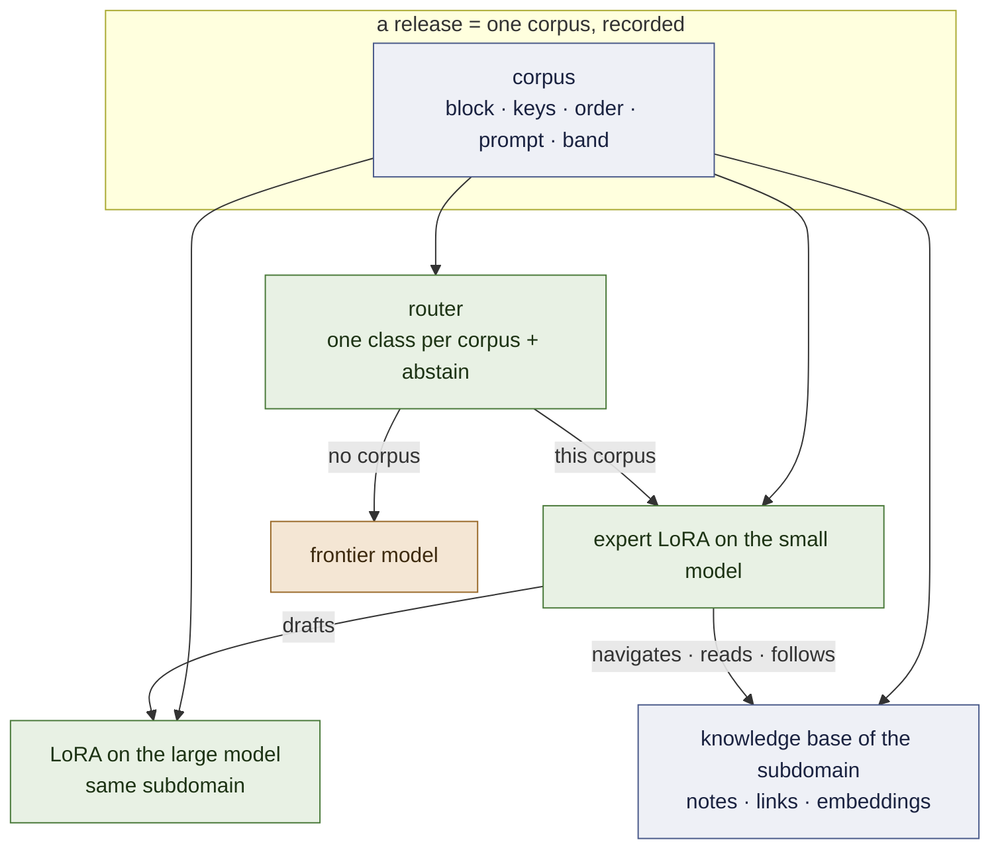
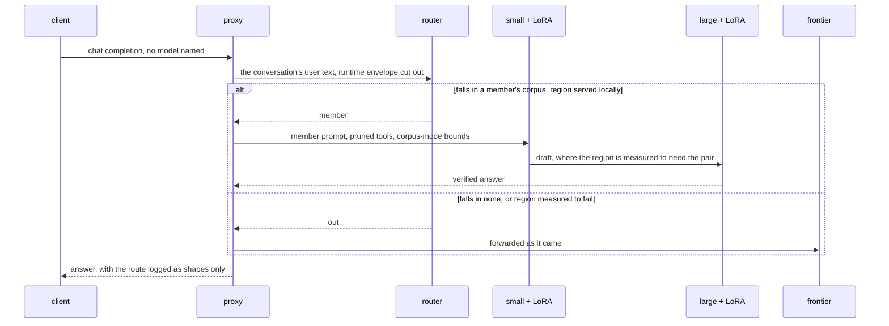
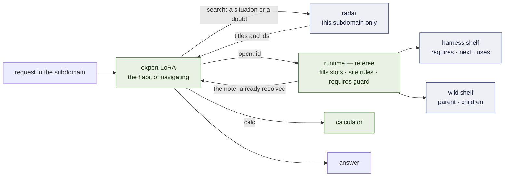
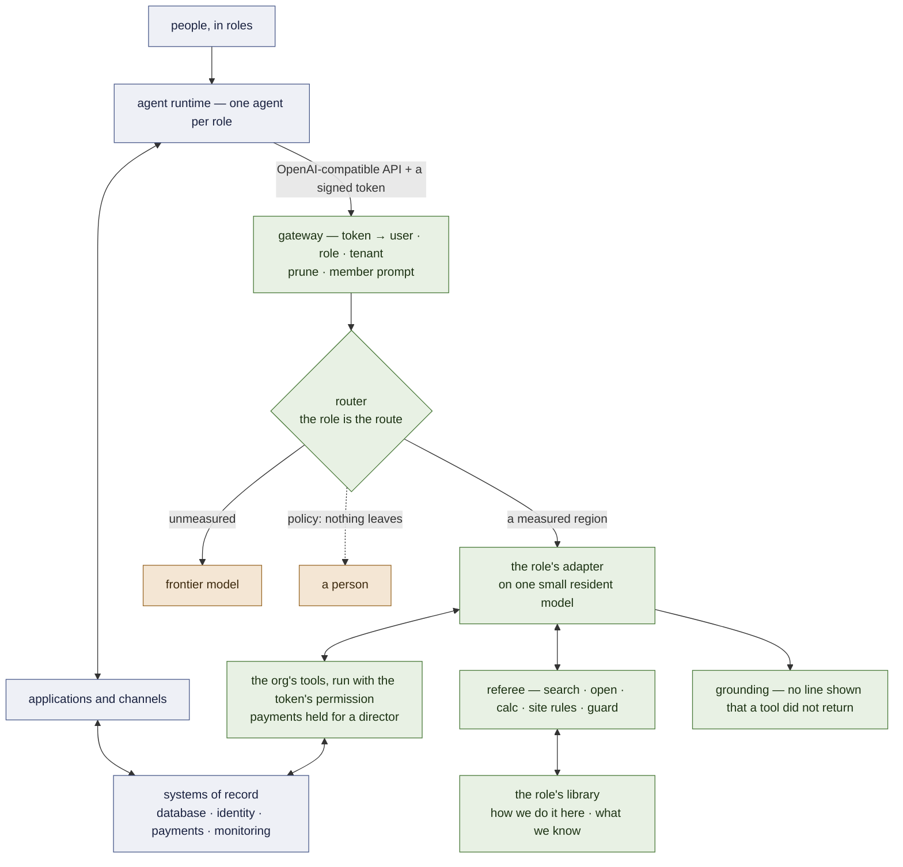

# Architecture

The system as designed on 2026-09-19, state as of 2026-09-20. What is built and measured is marked
**[ran]**; what is designed and not built says so. Where it sits in a whole organisation, and what is
missing for it to be a generic framework, is §9 and [`FRAMEWORK.md`](FRAMEWORK.md). The measurements behind every choice are in
[`RECORD.md`](RECORD.md); the order of work is [`PLAN.md`](PLAN.md).

## 1. One fact, four components — and what version 1.0 is

**An expert is the distribution of its corpus.** Not the weights alone: the tool block, the
argument keys and their order, the system prompt, the depth of the problems it saw. Served
outside that distribution it is a different, worse model — 2 of 32 live turns call a tool
under a foreign prompt, 19 of 32 under its own **[ran]** P63; an expert that reasons through
6-to-9-step chains scores 11 of 90 when its tools' results reach it as `tool_calls` messages and
**90 of 90** when they are written inline, as its corpus taught **[ran]** M7 arm 0b.

**Version 1.0 is five things [spec]:** experts defined by their corpora, the router with its
abstention, the memory (§4), the runtime that referees it, and the release contract that hashes all
of it. The pair of §3 attaches per subdomain where it is measured to pay and is not required by 1.0.

Everything else is that fact applied four times:

| component | what it is | state |
|---|---|---|
| **the expert** | a QLoRA on the small model, trained by SFT on one corpus, released with a contract that records the distribution | **[ran]** two released; since M1 on `Qwen3.5-4B`, each tying its Qwen 2.5 release |
| **the router** | a very small model *of the same corpora*: which expert's distribution does this request fall in — or none | a keyword dictionary **[ran]**; two learned arms **[ran]** M2, neither passes; in a deployment with one agent per role, *the role is the route* (§9) |
| **the pair** | a second LoRA, on the large model, trained on the *same corpus*; the small one drafts, the large one verifies | designed; milestones 3–4 |
| **the memory** | the subdomain's library — an operational harness and an encyclopedic wiki — a radar over it, three verbs, and a referee; the LoRA learns the **habit of navigating**, not the content | library, referee, corpus built **[ran]** W1, W2, W4; search under its bar **[ran]** W3; **the central claim measured three times and not passed** **[ran]** W5, W5b, W5c — navigation transfers, reading a conditional value in an unseen note does not (§4) |

One artefact — the corpus named in the release manifest — defines the expert, trains its
large half, and trains the router's class for it. Adding a region adds one corpus, and the
base of knowledge that corpus's trajectories walk through.

## 2. The request path

**The proxy** (`openai_proxy.py`) **[ran]**. It speaks the OpenAI API. For a member it
prunes the offered tools to the member's declared surface (`--prune`), replaces the
runtime's system prompt with the one the corpus taught (`--member-prompt`), and runs the
corpus-mode loop — generation stops at a closing tag, the tool's result is injected, it
continues — bounded at six round-trips and 256 tokens a step, the bounds the corpus itself
has. It refuses rather than serving wrong: a request it cannot route is a 503, not a guess.

**The router** reads the subject of the conversation and nothing else: every user turn,
with the runtime's internal-context envelope cut out — a runtime's own system prompt
out-scored the email in the user turn the first time a live agent called **[ran]** P63.
Two decisions are kept apart on purpose:

- *whose distribution is this* — the router's, learned from the corpora. Its first learned arm, an
  n-gram model of each corpus's frame, was safe on foreign text and lost every request from an
  unseen sender **[ran]** M2; the dictionary stays until the embedding arm is measured;
- *is that region served locally* — a measured table, `serve: local | out`. The table is only as
  good as the measurement behind it: fluids was marked *out* on 11 of 90, which turned out to be
  the serving path — locally, as taught, it is 90 of 90 against the frontier's 66 **[ran]** M7 arm
  0b — and it goes back through the release gate before the mark changes.

**The default is the frontier.** A model asked to choose always chooses, so abstention is
designed in and measured first (milestone 2).

**In front of an organisation's tools, the gateway [ran] 2026-09-25** (`examples/school/gateway.py`, the reference
organisation's path). What the proxy does for a member, plus the four things a role-based agent system needs and a
model must not decide:

| step | what it does | where it lives, and why not in the model |
|---|---|---|
| **who** | the bearer token is verified → user, role, tenant; a role asked for in `model: auto:<role>` must match it | `examples/common/tokens.py` (HS256 with a demo secret, standing in for the identity provider's RS256/JWKS — that verification is not built) |
| **permission** | every tool runs with that claim; another tenant's row is refused before it is read | the tool layer (`examples/school/tools.py`) — 77 adversarial cases, 0 leaks **[ran]** |
| **a person for what matters** | a payment or an all-families message is HELD; a director of the same tenant approves it, never the account that asked; it then runs with the requester's scope | `examples/common/approvals.py` |
| **what a reply may state** | every item of a reply must occur in a real tool result, or the reply is replaced by the tools' own text; instruction-shaped text found in a record is removed from what is shown | `examples/common/grounding.py` — the school-staff LoRA invented a line of a tool's list on the demo day; the filter replaced 2 of 5 local replies and the user saw neither **[ran]** `results/DEMO-school-gemma-20260925` |
| **scope** | a request the role's tools do not cover follows the role's egress: the frontier, or a person's queue | the model says `OUT OF SCOPE`; the policy decides where it goes — the model's judgment is recorded, not trusted |
| **log** | one JSON line per request — who, role, route, calls, denials, holds, grounding, tokens — and a dashboard that prices the local tokens at the frontier's rates | the monitoring feed; the GPU's own cost is not priced |

## 3. The pair

**Why the large half is trained, not borrowed.** An untrained large model is not a better
expert in a narrow region: 0.967 against the small expert's 1.000 on the desk, 0.746
against 0.989 on triage **[ran]** P55, P55b. Verification by a model that disagrees with a
*correct* draft rejects good tokens. Training the large model on the same corpus is what
makes it a verifier of this subdomain rather than a generalist second opinion.

**What is already known about the halves.** vLLM applies a LoRA over a 4-bit large model
**[ran]** P60 §3b. Qwen 3.5 adapters are servable once their tensors are named for the class
vLLM serves **[ran]** D2. The small and large models of the family share one id space, so a
drafted token *can* be verified **[ran]** D0 — between families, or against a frontier API,
it cannot **[ran]** P48.

**What is not available.** vLLM's speculative decoding does not take a LoRA-adapted drafter;
that is an RFC **[read]**. Until it ships, acceptance is measured by teacher forcing — the
large model scores the small one's finished draft in one prefill (`accept_rank.py`,
[`FOUNDATIONS.md`](FOUNDATIONS.md) §5.3, §6) — which gives α exactly and the speed-up not at
all. The pair is first a **quality** device (does large + LoRA beat small + LoRA where the
small one has headroom) and then a **speculative** one (does the matched LoRA raise α).

**Where it runs.** The small pool is served from one L4. A 27B is A100 work in 4-bit.

## 4. The memory — the core of 1.0

> **The LoRA is not the textbook. It is the specialist who knows how to use the library.**

**State, 2026-09-25 [ran].** **The memory works on its first test bed.** On a wiki of atomic statements (below),
whose facts no model can know, the untrained base does not walk two- and three-hop questions (0/40 on Qwen3.5-4B; it
never writes a verb after a result) and a trajectory LoRA trained on 32 other worlds does — 35/40 on both seeds, every
citation verified, 3-hop 16/16; on Gemma 4 E4B 38/40 (W9, B1). Before it, on the nursing library (W1–W5e), the result
had two halves that still stand: **navigation transfers** to a procedure the adapter never saw (42 : 0 against the
untrained base made to navigate), **reading a value under a condition in an unseen note does not** (the untrained base
reads it, 15/15; a split by kind of task tied, W5d; and two training draws of one recipe disagreed on 25 of 67 rows,
W5e — so members are trained on two seeds). Search with an off-the-shelf encoder reached recall@3 0.638 against a bar
of 0.80 (W3); the searcher is lexical. ~~State, 2026-09-20 … evidence of nothing until it is run on a set written after
the policy is frozen.~~

**The unit of the library, from 2026-09-24: the atomic statement — [ran] W9, PASSED.** The user's design: the
library is shaped like Wikipedia. A page is about one thing and is a list of **atomic statements** —
one checkable sentence each, under an anchor — and **the statement, not the page, is the unit of
memory**. Links live inside the statement that names them (a product's `§supplier` is also the way to
the supplier's page); operative pages are recipes whose statements are steps and branches, and a plan
is the trajectory the task's context chooses through them. `<open>id</open>` shows a page's sections,
`<open>id§anchor</open>` one statement, and every answer cites the statement it rests on — a citation
the runtime checks mechanically, so the memory is its own verifier. First test bed: an invented
distributor wiki whose operative pages follow the roles of the reference organisation (purchasing,
receiving, dispatch, claims and returns, customer communications, finance, HR, marketing, IT), generated
per world so no value can be known by heart; the untrained base is measured before a trajectory LoRA is
bought ([`MEMORY.md`](MEMORY.md) §1.6).

Specified piece by piece in [`MEMORY.md`](MEMORY.md) **[spec]**; argued for, with its open
questions, in [`KNOWLEDGE-TRAJECTORIES.md`](KNOWLEDGE-TRAJECTORIES.md). Five pieces, four of them
not neural:

| piece | what it is | where it lives |
|---|---|---|
| **the library** | markdown notes under half a page, on two shelves — and, since W9 **[ran]**, pages of atomic statements with their links inside, cited by every answer. **Operational harness** — *how is it done*: recipe-like notes whose links are control flow (`requires`, `next`, `uses`). **Encyclopedic wiki** — *what is it, which formula applies*: a tree, general to specific (`parent` → `children`) | `knowledge/<subdomain>/`, in git |
| **the radar** | embeddings compressed to one subdomain; per note two vectors, *when is it for* and *what does it define*; returns the two or three notes of exactly the subdomain in play | one small index per subdomain |
| **the language** | three verbs the expert may write — `<search>`, `<open>`, `<calc>` — each answered inline after its closing tag | a grammar, versioned with the release |
| **the LoRA** | trained on the *habit of navigating*: cases whose constants change every time, so the number has to be read from the note | the adapter — the only trained piece |
| **the runtime** | a small Python referee in the proxy: turns the pages, substitutes a site's rules before the expert sees the note, cuts a walk that skips a `requires` | `memory/` **[spec]**, on the corpus-mode loop that already serves every member |

> **[ILLUSTRATION PLACEHOLDER — `docs/img/memory-five-pieces.png`]**
> *The same picture as in `MEMORY.md`: a bookcase with two labelled shelves (a route of cards above,
> a tree of cards below), a small radar lighting three cards, a specialist holding three tools
> labelled `search`, `open`, `calc`, and beneath them a band labelled "runtime — referee" with a page
> being turned, a "site rule applied" stamp and a barrier gate reading "requires step 1".*

**Why it is a harness.** A classical agent harness keeps three things fused: the procedure in the
system prompt, the loop in hand-written code, and the hope that the model obeys. Here they are
apart. The procedure is the harness shelf — *editable text*. The loop is the links — *editable
frontmatter*, enforced by the referee where it matters. And obedience is no longer hoped for: it is
the one thing the adapter is trained on. This is what `harness.lora` was reaching for — a shared
protocol adapter composed with domain adapters, parked when composition could not be measured
cleanly — now per subdomain, and with its content outside the weights.

**Three measurements force the split rather than suggest it.** A small model does not follow a
procedure it merely reads — base + document, 0 tool calls on 351/351 **[ran]** P61 — so following is
what is trained. Fixed knowledge in a corpus is memorised and then prices nothing — a control with no
lookup tool scored 27/30 over fourteen values **[ran]** P15, P21 — so what a case needs is drawn per
case and delivered only through a note's slots. And a specialist is confidently wrong one step
outside its region — 30/30 inside, 1/20 on sibling families **[ran]** P14 — which is the headroom and
the claim: *the sibling's notes extend the region with no retraining.* That claim is untested.

**What is already known to work** is the channel: an expert does use a result written inline after
its tag — 90 of 90 on chains of six to nine tool calls **[ran]** M7 arm 0b — and the memory delivers
every note through exactly that.

**What is not assumed.** That a hierarchy beats a flat search — in this workspace's earlier memory
benchmark it lost to lexical search, and `evolving-memory`'s dual index changed nothing **[read]** —
or that compressing the radar to a small dimension costs nothing. Both are arms with a flat baseline.

## 5. The release contract

A region enters through one door **[ran]**: a suite with a verifier the training loop never
sees; the bare base as the headroom arm; the exact sign test on discordant pairs. The
manifest that comes out (`releases/*.json`) holds base, recipe, corpus hash, adapter hash,
prompt hash, the score and the paired comparisons. Re-serving it and re-training from it
both tie the recorded run **[ran]** P57. `training/harness/train_pool.py` holds each member
as a record read off its corpus — band, surface, keys, order, system prompt — and tests
re-read every corpus and fail if a declaration drifts. With milestone 7 the manifest gains the
knowledge base's hash and its index's hash: a member is its corpus *and* its base.

## 6. The family

**Gemma 4, from 2026-09-25 — the user's decision on B1 [ran].** `google/gemma-4-E4B-it` small; `gemma-4-31B-it`
named as the large half of a pair and **not measured**. On W9's wiki, with the same corpus and recipe, Gemma's member
tied Qwen3.5-4B's (38/40 against 35 and 35, 4 : 1 against each); untrained, Gemma already walks it 19/40 where Qwen
walks 0/40, and it trains in a third of the time. The user decided before the comparison ran that parity chooses
Gemma, because the development stack targets it. Two engineering constraints come with it: the LoRA excludes the
vision and audio towers, whose projections are `Gemma4ClippableLinear` (P29's block, and nothing else —
`training/s4_train.py::towers_to_exclude`); and its thinking channel stays off for members, as Qwen's did.

**The released members stay on `Qwen3.5-4B`** (`releases/*@v2.json`) until each is re-released on Gemma through the
release gate; the `@v1` releases on `Qwen2.5-3B-Instruct` stay as the control arm. The family is named in one place,
`training/harness/family.py`. ~~Qwen 3.x: `Qwen3.5-4B` small, `Qwen3.8-27B` large … Gemma 4 meets the id-space
requirement and not yet the PEFT one **[ran]** P29.~~

Nothing in §1–§5 names a family. A pair needs one id space and a base PEFT can attach to; Gemma 4 E4B now meets the
second **[ran]** B1; whether it shares an id space with 31B is milestone 3's first check.

## 7. What is not neural, on purpose

- **Memory and knowledge** are markdown and git; an index of embeddings is derived from them, never the source.
- **Execution** is a sandbox; tools are an MCP server (`training/mcp/inbox_server.py`).
- **Arithmetic** is a calculator: distillation transferred a procedure and not the
  arithmetic **[ran]** P5–P7.
- **Whether a region is served locally** is a table of measurements, not a model's opinion.

## 8. Deliberately not built

A bespoke inference runtime, KV-cache sharing across adapters, tree attention across
adapters, composition of adapters, a tournament that breeds them, the control plane, vertical
packs. And, by scope rather than by order: the customisation service and its tooling are not
part of this runtime nor of the open-source version.

## 9. Where it sits in an organisation — and the framework boundary

The deployment this is aimed at is an organisation that runs on **one agent per role**: people in a
few roles; an agent runtime with an agent per role; the applications those agents operate
(scheduling, administration); the channels people already use (an app, messaging split into an
outside and an internal audience); and one relational database with identity, payments and monitoring
beside it. lora-kernel is **one layer under the agent column** and replaces nothing above or below it:

**Records stay in the database, habits go in the adapter, knowledge stays in notes a person can read
and correct.** Three consequences for the design:

- **The role says which member — not whether.** The runtime already knows which agent a message came
  from, and the role rides in the model id (`auto:<role>`). **[ran]** F2: with the role *confirmed by
  the member's own keys* there are never more misroutes than with the keys alone, nothing is served
  under a wrong role, and the 240-case replay ties at 0.775; it is the proxy's default. The policy
  that let the role decide alone served 120 of 120 foreign tasks and failed. So half of the router's
  open problem is gone — *which* — and half remains: *is this request in the region at all*.
- **The unit is a role pack, not an adapter.** Tool surface, prompt, corpus, library, suites, and two
  policies: *who writes which kind of answer* (§4's split) and *what may leave* (frontier, a person,
  or nothing). **[ran]** F3: `roles/<role>/role.toml`, every line checked against its artefact by
  `rolepack.lint`; the two released members re-expressed with the served prompt and tool block
  byte-identical, the registries derivable and equal. The code does not read the packs yet, and the
  memory's member declares a loop — the referee's — that the API cannot serve.
- **The model never holds a credential.** Tools reach the systems of record *as the person asking*;
  permission is checked by the tool, outside the model, and every action is logged. **[spec]** —
  nothing of this layer exists, and no expert here has been measured performing a write.

What exists, what is missing and the order to build it — thirteen gaps, eight interfaces, seven steps,
each with the result that would stop it — is [`FRAMEWORK.md`](FRAMEWORK.md). The scope line of §8 does
not move: the framework is the runtime, the formats, the gates and *reference* role packs on generated
data; a customer's corpora and the pipeline from traces to a release are not in this repository.

**Read against a pasted architecture, 2026-09-20.** A five-phase plan — an educational centre and a
distributor under one kernel, speculative decoding, Postgres row-level security behind Auth0, Docker
Compose — arrived pasted into a session and was checked against the gap table above: most of it was
already built (role packs, F3), already sequenced later (concurrency, the bill, installation), or
blocked (a LoRA-adapted drafter is a vLLM RFC, not a feature). One gap it named correctly and this
repository had not closed — permission enforced outside the model, not asked of it — becomes the
next step, scoped to **one** neutral domain, not two, with a toy store standing in for Auth0/Postgres
RLS until shown insufficient, gated at **0 leaks** on an adversarial suite. `W5d` — the read/write
split a role's answer policy needs — runs first: it is cheaper and the next step's role packs already
declare a policy they have no measured value for. Full reading, phase by phase: [`FRAMEWORK.md`](FRAMEWORK.md)
§9; the plan entry: [`PLAN.md`](PLAN.md) §0.

**The code-only half is built [ran] 2026-09-21** (`examples/`): `school/`, the user's own named main
case, all seven roles the reference diagram draws — `dev`, `trainee`, `marketing`, `educador`,
`compras`, `cfo`, `it` — thirteen tools, two tenants, an adversarial suite at **0 leaks**, both
domains' MCP servers registered and `mcp probe`-verified against a real OpenClaw instance. What is
still missing is the falsifier's model-side half (does a *model* ever try the cross-tenant call —
needs an account behind an OpenClaw turn, not yet run) and any corpus or adapter — nothing here
trains. Milestone 6's own first number also landed the same day: pricing the existing P41/P62 replay
at real `google/gemini-3.8-flash` rates puts today's frontier bill for the 37.5 % sent out at **$0.18**
— a fraction of a dollar at this scale, and the GPU's own cost is the one input still unpriced, named
rather than guessed (`docs/PLAN.md` milestone 6, `results/M6-bill-20260921/`).
