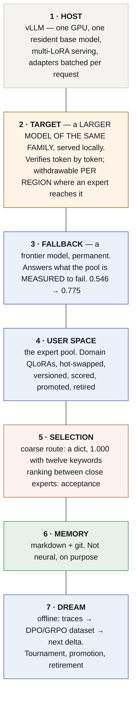

# Architecture

> **For the concrete stack — which base, which targets, which adapters at which
> rank, which vLLM flags — see [`STACK.md`](STACK.md).**

> **Specification.** Nothing here is built. Written to be argued with before it
> is, which is cheaper.
>
> *[Léeme en español](es/ARCHITECTURE.md)*

---

## 1. The stack



**Restructured 2026-09-16.** Three layers changed and the reasons are measured.

- **Layer 2 was "a frontier model, then withdrawn".** A frontier API cannot verify
  tokens at all — no logprobs for a forced continuation (C2), a different tokenizer
  (C3) **[ran]** P48. The target is a **larger model of the same family, on the same
  card**, and what gets withdrawn is *it*, per region, not the frontier.
- **Layer 3 was `harness.lora`, the kernel adapter.** Composition in weight space is
  dropped — P8's result was void on a notation confound and P35 measured the cost of
  splitting a capability in two: asking fell from 123 of 150 cases to 22 **[ran]**.
  The frontier took that slot, because it turned out to be a permanent component
  rather than scaffolding: routing a failing region to it delivers **0.546 → 0.775**
  **[ran]** P41.
- **Layer 5 was "α, free".** Half of it is free and the other half is a dict: the
  coarse route scores **1.000** with twelve keywords **[ran]**, so a learned router
  is unbought. Acceptance is for the half a dict cannot do — **ranking experts that
  resemble each other** — and that is the only claim an EAGLE head cannot also serve.

**Layers 4 and 7 produce only adapters. Layer 6 produces only text. Layer 1 is
somebody else's runtime.**

## 2. Why the target must be bigger — and why it cannot be a frontier API

The property that makes this work is not a footnote: **under rejection sampling the
emitted tokens are distributed exactly as the target would have emitted them**
**[read]**. So the target decides what "correct" means, and everything else is a
question about cost.

Which is why the target has to be **better than the experts** — and why, for three
years of this document's assumptions, "better" was read as "frontier".

**That reading was wrong, and it is not a matter of degree.** A frontier API cannot
be a speculative target **at all**:

- it does not return the logprobs of a **forced** continuation (C2), so there is
  nothing to verify against;
- it does not share the base's tokenizer (C3), so a drafted id does not mean the same
  string to both models.

Measured rather than argued **[ran]** `results/P48-tokenizer-compat-20260916/`:

| candidate target | vocab | usable |
|---|---:|---|
| `Qwen2.5-7B / 14B / 32B / 72B-Instruct` | 151,643 | **yes — byte-identical `tokenizer.json`** |
| `Qwen3-14B`, `Qwen3-32B` | 151,643 | yes, with 4 target-only ids |
| `Qwen3.5 / 3.6 / 3.8-27B` | **248,044** | **no — a different vocabulary** |

**So the target is `Qwen2.5-32B-Instruct-AWQ`** — 19.3 GB, fits beside the 3B on one
A100, and its `tokenizer.json` hashes identically to the base's. A frontier model
keeps a different job, in layer 3, where it is permanent.

### And the target is not what makes this fast

Speculative decoding has **two** purposes and this project had been claiming both.
For **latency**, a drafting head trained on the target's own hidden states wins, and
one exists for exactly this target **[read]**. Our domain experts will never beat it
at that, because it has no other job.

**What it cannot do is rank.** There is one head per target, so there is nothing to
choose between. **Acceptance as a judge-free ranking over k experts is the claim that
survives**, and it is the only thing this architecture has that an EAGLE head does
not.

## 3. Withdrawal — of the target, per region, and not of the frontier

~~The frontier model is scaffolding, and the design says when to remove it.~~

**Restated 2026-09-15 and again 2026-09-16, both times by measurement.** The frontier
is not scaffolding: it is the fallback for what the pool is *measured* to fail, and
sending one failing subdomain to it took delivered accuracy from **0.546 to 0.775**
with 38% of cases leaving the machine **[ran]** `results/P41-routing-20260915/`.

**What withdrawal means now is cheaper and more honest.** Where an expert's acceptance
against the local 32B is high enough, **the 32B comes out for that region** and the
expert generates alone. The frontier stays where it is, answering the regions no
expert covers.

**Acceptance alone cannot authorise it.** A rejection is either the small model being
wrong or the large one being wrong, and only a verifier on the same cases separates
them — which is why the suite this is measured on has one, and why `carries()`-style
floors sit *beside* acceptance rather than behind it.

**The order that follows from that.** Phase A serves the target and accumulates, per
region, which expert it keeps agreeing with. Phase B removes the target where that
number crossed a threshold **and the verified score held**. Two conditions, not one.

## 4. Composition — dropped, and what replaced it

~~The kernel and the expert are different adapters and must stay so.~~

**Dropped 2026-09-15, on measurement.** Two results closed it:

- **P8's apparent interference was void** on a notation confound — the arms were
  never comparable.
- **P35 measured what splitting a capability costs.** Taught the tool vocabulary
  separately from the domain, the vocabulary was learned and the *disposition* was
  lost: asking fell from **123 of 150 cases to 22** **[ran]**.

And `harness.lora` lost its own case on the way: a learned protocol scored **9/30**
where twenty lines of `re` scored **23/30**, because that suite had one tool and
asking for it was copying an expression already written **[ran]** P13.

**What replaced it: self-contained experts.** Each adapter carries its own disposition
to reach for tools, in the vocabulary it will be served with. `contract.py` makes that
declarable — a member states the **band** its corpus taught, because an expert served
outside it does not simplify, it **over-solves**: below its band `fluids-full`
invented an area on **18 of 18** cases and the bare base beat it at three steps,
0.167 to 0.000 **[ran]** P45.

**And piping costs nothing if composition is ever wanted back.** `base→lora1` then
`base→lora2` never has two deltas live in one forward pass, so the interference
question does not arise — and the pool already serves exactly that shape. It is two
requests with two model names.

## 5. The tournament

Per executed task:

```
score = w₁ · verified task success
      + w₂ · α (against the frontier target)
      − w₃ · tokens consumed
```

- **`w₁` must come from a verifier the loop cannot see.** Otherwise the loop
  breeds adapters that flatter their scorer, and the strongest measurement this
  organisation has is that the same procedure was *interface compensation* on one
  model and *persistent gain* on another. **[read]**
- **`w₂` is only meaningful while the target is frontier-grade.** After
  withdrawal it measures agreement with a peer and must be re-weighted or dropped.
- **Offline, always.** A tournament that runs inline changes the thing it
  measures.

Promotion, retirement and crossing are commits: `agentvcs` versions the adapter
alongside the traces and the goal that produced it, so a regression is diffable
and revertible.

## 6. What is not neural, and why that is not aesthetics

**Memory is markdown under git.** A weight delta cannot be read, diffed, cited or
corrected by a person, and it cannot be pointed at in an audit. Every measurement
this organisation has on memory says the durable asset is the part a human can
read.

**Execution is a sandbox.** Tools run as processes.

**Verification is a verifier**, never the model's opinion of itself, and its
strength — exact, deterministic, statistical, human, judge — is recorded with
every result.

## 7. Order of work

~~E0 headroom · E1 the α surface against a frontier target · E2 withdrawal · E3
`harness.lora` · E4 the tournament~~

**Restructured 2026-09-16.** E1 assumed a frontier target, which cannot verify tokens;
E3's adapter lost to twenty lines of `re`. What replaces them is four sessions, each
able to end what follows it.

| | | ends the line if |
|---|---|---|
| **S1** | **profile** the base and the target over the region × depth grid; the band where the base is neither on the floor nor at the ceiling is chosen **once** | the base is above 0.70 everywhere, below 0.15 everywhere, or the target fails most cells |
| **S2** | **train the experts** — each on conversations **the target generated for its own region**, not on an oracle's | — |
| **S3** | **the ranking**: acceptance per expert per region, with the verified score beside it | acceptance does not order the experts the way the verifier does |
| **S4** | **reserve** — three of the last runs died or were void | — |

**Two rules the order depends on.** The band is chosen once and never revisited,
whatever a later treatment scores — choosing it twice is the instrument looking for a
result. And **no arm scores anything before a preflight proves it can reach its
tools**: P51's first attempt returned HTTP 400 on all 240 cases and printed
`correct 0 calls 0 refused 0`, which is what a floor looks like **[ran]**.

**Before any of it, the suite passes `training/suite_gates.py`** or its numbers are
not evidence. All four suites this project previously measured on fail at least one
**[ran]** `results/P50-suite-audit-20260916/`.

## 8. Deliberately not built yet

- **Tree attention across adapters.** The KV-cache problem is the expensive part
  and it is only worth solving once S3 says the branches are worth comparing.
- **Ten verticals, adapter marketplace, control plane.** Downstream of a pool with
  two useful members **close enough to meet in one problem** — which is the thing
  nine days of work has not produced, and the reason the suite was regenerated.
- **An EAGLE or Medusa head of our own.** Qwen 2.5 is in Model-Optimizer's support
  matrix and the online path fits a 3B on the A100 this project rents **[read]** — so
  it is possible, and it is still a **latency** purchase. It cannot rank experts,
  which is the only thing we need speculative decoding for.
- **A new inference runtime.** vLLM is the substrate. Needing our own would be a
  finding, not a plan.

## The mathematics of each layer

Every layer above is a formula with a run under it; the derivations are in
[`FOUNDATIONS.md`](FOUNDATIONS.md) and only the statement is repeated here.

| layer | what it is, as mathematics | the number under it |
|---|---|---|
| **1 · HOST** | one resident $\theta$; a request with adapter $i$ computes $y = xW + s\,(xA_i)B_i$ per projection, batched across requests by adapter id (§5.2) | C18 identity gate: `applied` on `Qwen2.5-3B`, identical on `Qwen3.5-4B` **[ran]** P33; `applied` 6/8 probes **[ran]** P55 A |
| **2 · TARGET** | verifies a draft in one teacher-forced pass; at $T=0$ accept $\tilde x_i$ iff $\tilde x_i = \arg\max p_T(\cdot\mid\text{prefix},\tilde x_{<i})$ (§6.3); a verify pass costs one weight read for $k+1$ positions (§2.3) | same id space as the base: byte-identical tokenizer **[ran]** P48; `prompt_logprobs` returns rank per token **[ran]** P55 A |
| **3 · FALLBACK** | outside the mathematics of acceptance on purpose: no logprobs for a forced continuation (C2), no shared ids (C3) — it answers, it never verifies | routing by region 0.546 → 0.775 **[ran]** P41 |
| **4 · USER SPACE** | each member is $\Delta_i = \tfrac{\alpha}{r}A_iB_i$ over the seven projections of every block (§4.1); 29,933,568 parameters each (§4.2) | 119,801,528 bytes per adapter **[ran]** `STACK.md` §3 |
| **5 · SELECTION** | coarse: a lookup; fine: $\arg\max_i \alpha_T(E_i, c)$ — valid only when $Q(T)\ge\max_i Q(E_i)$ (§7.2) | the precondition failed on triage, $0.746 < 0.989$ **[ran]** P55 A; unmeasured elsewhere |
| **6 · MEMORY** | not neural; no formula, by design | — |
| **7 · DREAM** | the tournament's fitness is a paired sign test on discordant cases (§9.2), never two totals | 84/81/82 were three ties **[ran]** P36/P38/P40 |

**The withdrawal condition, formally.** Layer 2 is withdrawable in a region $R$ when
the expert alone matches the verified score it reaches with the target's verification:
$Q_R(E) \ge Q_R(E \mid T) - \varepsilon$ on a paired test. Measured once, in-region,
with a calculator standing in for the target: gap **0.000** **[ran]** S5 — never yet
with acceptance, because acceptance has never been measured (§11 of FOUNDATIONS).
