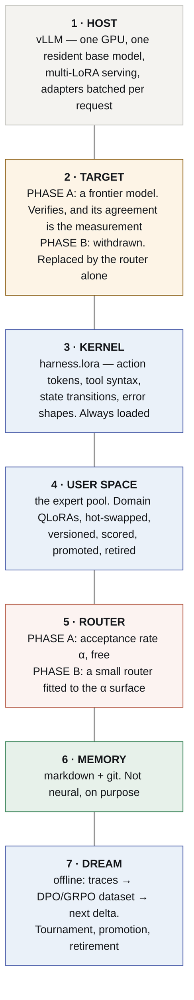

# Architecture

> **Specification.** Nothing here is built. Written to be argued with before it
> is, which is cheaper.

---

## 1. The stack



**Layers 3, 4 and 7 produce only adapters. Layer 6 produces only text. Layer 1 is
somebody else's runtime.** That is the whole system — and layer 5 is drawn as the
one open box on purpose, because naming the router "speculative" before the α
surface exists would be assuming the result.

## 2. Why the target must be frontier-grade

Speculative decoding emits the *target's* distribution. So what acceptance rate
measures is **agreement with whatever you chose to verify with**, and the choice
therefore decides what the number means:

| target | what a high α tells you |
|---|---|
| the shared base model | this expert has drifted least from the base — *anti-correlated with specialisation* |
| **a frontier model** | **this expert already produces what the frontier would, here** |

The second is a distillation score. It is the design.

This is the single rule that keeps the architecture coherent, and it is why the
frontier is not an optimisation but a component: **remove it in Phase A and the
router is measuring the wrong thing.**

## 3. Frontier withdrawal

The frontier is scaffolding with a stated removal condition.

**Phase A.** Experts draft, frontier verifies, α accumulates per expert per
region of the problem space. Cost is frontier cost; quality is frontier quality;
the measurement is free.

**Phase B.** For a region where an expert's α crossed threshold, promote it from
drafter to generator, drop the frontier, and let the router choose. Cost collapses
to local inference.

**The threshold is a product decision, made on a measured surface.** How much
frontier agreement do you require before an expert answers alone? Per region.
Recorded, revisable, and reversible — a region can be sent back to Phase A when
its verified score drops.

**The number that decides the whole architecture** is the withdrawal gap: the
verified task score after withdrawal, minus the score the frontier had. Making
that gap small *is* the project.

## 4. Composition — kernel plus expert

The kernel and the expert are different adapters and must stay so.

- `harness.lora` owns **how to act**: action tokens, tool syntax, state.
- a domain adapter owns **what is true** in its region.

Merging them would make every domain adapter re-learn the protocol, which is the
cost this design exists to remove. Serving them together is a multi-adapter
composition question and is treated in
[`TECHNICAL-REFERENCE.md` §5](TECHNICAL-REFERENCE.md).

## 5. The tournament

Per executed task:

```
score = w₁ · verified task success
      + w₂ · α (against the frontier target)
      − w₃ · tokens consumed
```

- **`w₁` must come from a verifier the loop cannot see.** Otherwise the loop
  breeds adapters that flatter their scorer, and the strongest measurement this
  organisation has is that the same procedure was *interface compensation* on one
  model and *persistent gain* on another. **[read]**
- **`w₂` is only meaningful while the target is frontier-grade.** After
  withdrawal it measures agreement with a peer and must be re-weighted or dropped.
- **Offline, always.** A tournament that runs inline changes the thing it
  measures.

Promotion, retirement and crossing are commits: `agentvcs` versions the adapter
alongside the traces and the goal that produced it, so a regression is diffable
and revertible.

## 6. What is not neural, and why that is not aesthetics

**Memory is markdown under git.** A weight delta cannot be read, diffed, cited or
corrected by a person, and it cannot be pointed at in an audit. Every measurement
this organisation has on memory says the durable asset is the part a human can
read.

**Execution is a sandbox.** Tools run as processes.

**Verification is a verifier**, never the model's opinion of itself, and its
strength — exact, deterministic, statistical, human, judge — is recorded with
every result.

## 7. Order of work

| | | gates |
|---|---|---|
| **E0** | headroom on the base alone | everything |
| **E1** | the α surface: 2 experts, 1 frontier target | E2 |
| **E2** | withdrawal: promote, remove the frontier, measure the gap | the product |
| **E3** | `harness.lora` against the −85% schema baseline | the kernel |
| **E4** | the tournament, with a held-out verifier | evolution |

## 8. Deliberately not built yet

- **Tree attention across adapters.** The KV-cache problem is the expensive part
  and it is only worth solving once E1 says the branches are worth comparing.
- **Ten verticals, adapter marketplace, control plane.** Downstream of E2.
- **A new inference runtime.** vLLM is the substrate. Needing our own would be a
  finding, not a plan.
