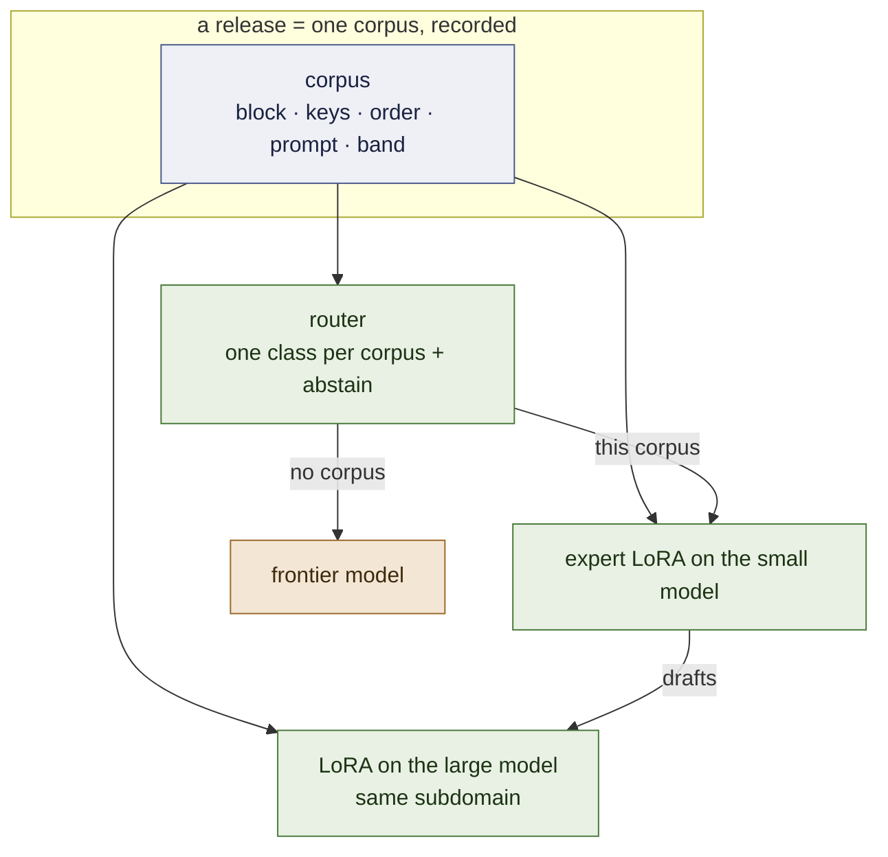
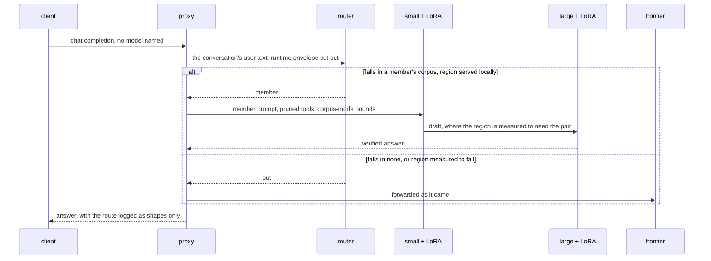

# Architecture

The system as designed on 2026-09-19. What is built and measured is marked **[ran]**; what
is designed and not built says so. The measurements behind every choice are in
[`RECORD.md`](RECORD.md); the order of work is [`PLAN.md`](PLAN.md).

## 1. One fact, three components

**An expert is the distribution of its corpus.** Not the weights alone: the tool block, the
argument keys and their order, the system prompt, the depth of the problems it saw. Served
outside that distribution it is a different, worse model — 2 of 32 live turns call a tool
under a foreign prompt, 19 of 32 under its own **[ran]** P63; below its training depth a
reasoning expert over-solves 18 of 18 **[ran]** P45.

Everything else is that fact applied three times:

| component | what it is | state |
|---|---|---|
| **the expert** | a QLoRA on the small model, trained by SFT on one corpus, released with a contract that records the distribution | **[ran]** two released, on Qwen 2.5 |
| **the router** | a very small model *of the same corpora*: which expert's distribution does this request fall in — or none | a keyword dictionary **[ran]**; the model is milestone 2 |
| **the pair** | a second LoRA, on the large model, trained on the *same corpus*; the small one drafts, the large one verifies | designed; milestones 3–4 |

One artefact — the corpus named in the release manifest — defines the expert, trains its
large half, and trains the router's class for it. Adding a region adds one corpus.

## 2. The request path

**The proxy** (`openai_proxy.py`) **[ran]**. It speaks the OpenAI API. For a member it
prunes the offered tools to the member's declared surface (`--prune`), replaces the
runtime's system prompt with the one the corpus taught (`--member-prompt`), and runs the
corpus-mode loop — generation stops at a closing tag, the tool's result is injected, it
continues — bounded at six round-trips and 256 tokens a step, the bounds the corpus itself
has. It refuses rather than serving wrong: a request it cannot route is a 503, not a guess.

**The router** reads the subject of the conversation and nothing else: every user turn,
with the runtime's internal-context envelope cut out — a runtime's own system prompt
out-scored the email in the user turn the first time a live agent called **[ran]** P63.
Two decisions are kept apart on purpose:

- *whose distribution is this* — the router's, learned from the corpora;
- *is that region served locally* — a measured table, `serve: local | out`. Fluids is a
  perfect topical match and is measured to fail; it is served out.

**The default is the frontier.** A model asked to choose always chooses, so abstention is
designed in and measured first (milestone 2).

## 3. The pair

**Why the large half is trained, not borrowed.** An untrained large model is not a better
expert in a narrow region: 0.967 against the small expert's 1.000 on the desk, 0.746
against 0.989 on triage **[ran]** P55, P55b. Verification by a model that disagrees with a
*correct* draft rejects good tokens. Training the large model on the same corpus is what
makes it a verifier of this subdomain rather than a generalist second opinion.

**What is already known about the halves.** vLLM applies a LoRA over a 4-bit large model
**[ran]** P60 §3b. Qwen 3.5 adapters are servable once their tensors are named for the class
vLLM serves **[ran]** D2. The small and large models of the family share one id space, so a
drafted token *can* be verified **[ran]** D0 — between families, or against a frontier API,
it cannot **[ran]** P48.

**What is not available.** vLLM's speculative decoding does not take a LoRA-adapted drafter;
that is an RFC **[read]**. Until it ships, acceptance is measured by teacher forcing — the
large model scores the small one's finished draft in one prefill (`accept_rank.py`,
[`FOUNDATIONS.md`](FOUNDATIONS.md) §5.3, §6) — which gives α exactly and the speed-up not at
all. The pair is first a **quality** device (does large + LoRA beat small + LoRA where the
small one has headroom) and then a **speculative** one (does the matched LoRA raise α).

**Where it runs.** The small pool is served from one L4. A 27B is A100 work in 4-bit.

## 4. The release contract

A region enters through one door **[ran]**: a suite with a verifier the training loop never
sees; the bare base as the headroom arm; the exact sign test on discordant pairs. The
manifest that comes out (`releases/*.json`) holds base, recipe, corpus hash, adapter hash,
prompt hash, the score and the paired comparisons. Re-serving it and re-training from it
both tie the recorded run **[ran]** P57. `training/harness/train_pool.py` holds each member
as a record read off its corpus — band, surface, keys, order, system prompt — and tests
re-read every corpus and fail if a declaration drifts.

## 5. The family

Qwen 3.x: `Qwen3.5-4B` (or `2B`) small, `Qwen3.8-27B` large. The 3.x line is hybrid — three
linear-attention layers to one full-attention layer — and D2's renamed adapter landed
weights on both kinds. Its `<think>` channel stays off for members. Released members are
still on `Qwen2.5-3B-Instruct`; milestone 1 moves them, with the 2.5 releases as the
control.

Nothing in §1–§4 names a family. A pair needs one id space and a base PEFT can attach to;
`Gemma 4 2B / 12B` meets the first and not yet the second **[ran]** P29.

## 6. What is not neural, on purpose

- **Memory** is markdown and git.
- **Execution** is a sandbox; tools are an MCP server (`training/mcp/inbox_server.py`).
- **Arithmetic** is a calculator: distillation transferred a procedure and not the
  arithmetic **[ran]** P5–P7.
- **Whether a region is served locally** is a table of measurements, not a model's opinion.

## 7. Deliberately not built

A bespoke inference runtime, KV-cache sharing across adapters, tree attention across
adapters, composition of adapters, a tournament that breeds them, the control plane, vertical
packs. And, by scope rather than by order: the customisation service and its tooling are not
part of this runtime nor of the open-source version.
