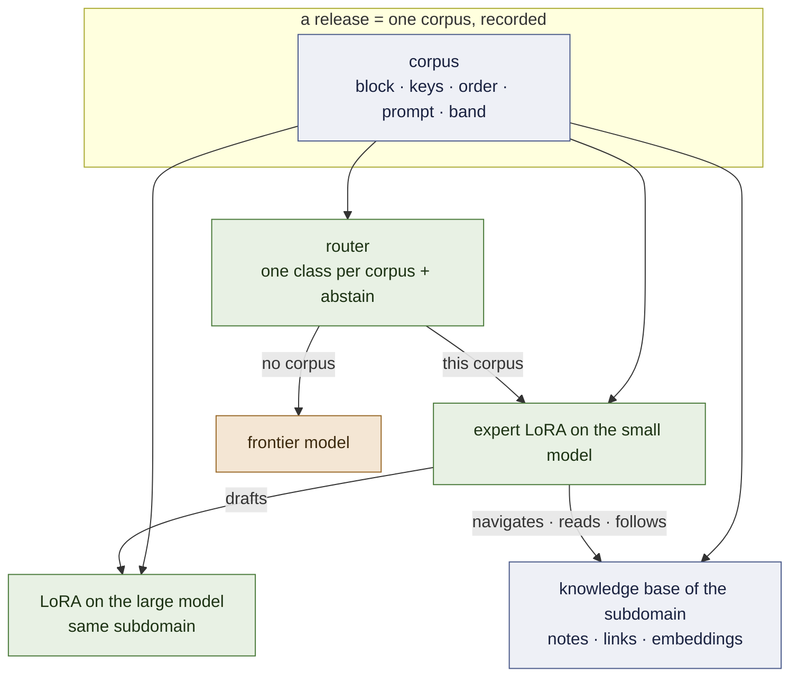
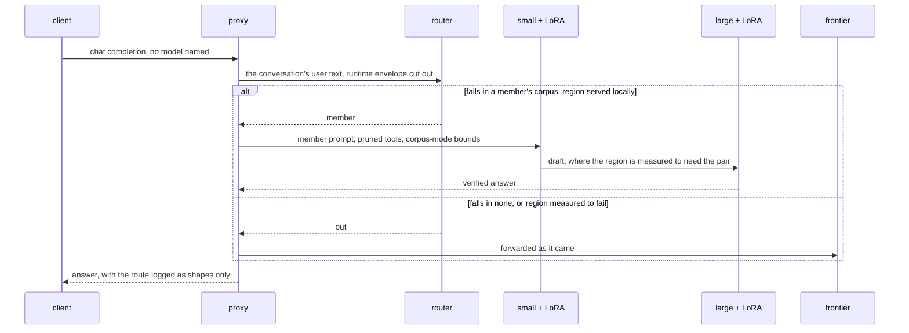
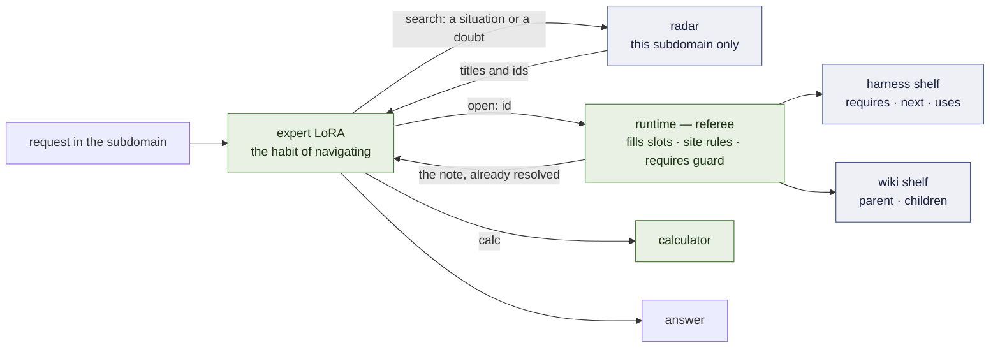

# Architecture

The system as designed on 2026-09-19. What is built and measured is marked **[ran]**; what
is designed and not built says so. The measurements behind every choice are in
[`RECORD.md`](RECORD.md); the order of work is [`PLAN.md`](PLAN.md).

## 1. One fact, four components — and what version 1.0 is

**An expert is the distribution of its corpus.** Not the weights alone: the tool block, the
argument keys and their order, the system prompt, the depth of the problems it saw. Served
outside that distribution it is a different, worse model — 2 of 32 live turns call a tool
under a foreign prompt, 19 of 32 under its own **[ran]** P63; an expert that reasons through
6-to-9-step chains scores 11 of 90 when its tools' results reach it as `tool_calls` messages and
**90 of 90** when they are written inline, as its corpus taught **[ran]** M7 arm 0b.

**Version 1.0 is five things [spec]:** experts defined by their corpora, the router with its
abstention, the memory (§4), the runtime that referees it, and the release contract that hashes all
of it. The pair of §3 attaches per subdomain where it is measured to pay and is not required by 1.0.

Everything else is that fact applied four times:

| component | what it is | state |
|---|---|---|
| **the expert** | a QLoRA on the small model, trained by SFT on one corpus, released with a contract that records the distribution | **[ran]** two released, on Qwen 2.5 |
| **the router** | a very small model *of the same corpora*: which expert's distribution does this request fall in — or none | a keyword dictionary **[ran]**; the model is milestone 2 |
| **the pair** | a second LoRA, on the large model, trained on the *same corpus*; the small one drafts, the large one verifies | designed; milestones 3–4 |
| **the memory** | the subdomain's library — an operational harness and an encyclopedic wiki — a radar over it, three verbs, and a referee; the LoRA learns the **habit of navigating**, not the content | specified ([`MEMORY.md`](MEMORY.md)); the channel it uses is measured; milestone 7 |

One artefact — the corpus named in the release manifest — defines the expert, trains its
large half, and trains the router's class for it. Adding a region adds one corpus, and the
base of knowledge that corpus's trajectories walk through.

## 2. The request path

**The proxy** (`openai_proxy.py`) **[ran]**. It speaks the OpenAI API. For a member it
prunes the offered tools to the member's declared surface (`--prune`), replaces the
runtime's system prompt with the one the corpus taught (`--member-prompt`), and runs the
corpus-mode loop — generation stops at a closing tag, the tool's result is injected, it
continues — bounded at six round-trips and 256 tokens a step, the bounds the corpus itself
has. It refuses rather than serving wrong: a request it cannot route is a 503, not a guess.

**The router** reads the subject of the conversation and nothing else: every user turn,
with the runtime's internal-context envelope cut out — a runtime's own system prompt
out-scored the email in the user turn the first time a live agent called **[ran]** P63.
Two decisions are kept apart on purpose:

- *whose distribution is this* — the router's, learned from the corpora. Its first learned arm, an
  n-gram model of each corpus's frame, was safe on foreign text and lost every request from an
  unseen sender **[ran]** M2; the dictionary stays until the embedding arm is measured;
- *is that region served locally* — a measured table, `serve: local | out`. The table is only as
  good as the measurement behind it: fluids was marked *out* on 11 of 90, which turned out to be
  the serving path — locally, as taught, it is 90 of 90 against the frontier's 66 **[ran]** M7 arm
  0b — and it goes back through the release gate before the mark changes.

**The default is the frontier.** A model asked to choose always chooses, so abstention is
designed in and measured first (milestone 2).

## 3. The pair

**Why the large half is trained, not borrowed.** An untrained large model is not a better
expert in a narrow region: 0.967 against the small expert's 1.000 on the desk, 0.746
against 0.989 on triage **[ran]** P55, P55b. Verification by a model that disagrees with a
*correct* draft rejects good tokens. Training the large model on the same corpus is what
makes it a verifier of this subdomain rather than a generalist second opinion.

**What is already known about the halves.** vLLM applies a LoRA over a 4-bit large model
**[ran]** P60 §3b. Qwen 3.5 adapters are servable once their tensors are named for the class
vLLM serves **[ran]** D2. The small and large models of the family share one id space, so a
drafted token *can* be verified **[ran]** D0 — between families, or against a frontier API,
it cannot **[ran]** P48.

**What is not available.** vLLM's speculative decoding does not take a LoRA-adapted drafter;
that is an RFC **[read]**. Until it ships, acceptance is measured by teacher forcing — the
large model scores the small one's finished draft in one prefill (`accept_rank.py`,
[`FOUNDATIONS.md`](FOUNDATIONS.md) §5.3, §6) — which gives α exactly and the speed-up not at
all. The pair is first a **quality** device (does large + LoRA beat small + LoRA where the
small one has headroom) and then a **speculative** one (does the matched LoRA raise α).

**Where it runs.** The small pool is served from one L4. A 27B is A100 work in 4-bit.

## 4. The memory — the core of 1.0

> **The LoRA is not the textbook. It is the specialist who knows how to use the library.**

Specified piece by piece in [`MEMORY.md`](MEMORY.md) **[spec]**; argued for, with its open
questions, in [`KNOWLEDGE-TRAJECTORIES.md`](KNOWLEDGE-TRAJECTORIES.md). Five pieces, four of them
not neural:

| piece | what it is | where it lives |
|---|---|---|
| **the library** | markdown notes under half a page, on two shelves. **Operational harness** — *how is it done*: recipe-like notes whose links are control flow (`requires`, `next`, `uses`). **Encyclopedic wiki** — *what is it, which formula applies*: a tree, general to specific (`parent` → `children`) | `knowledge/<subdomain>/`, in git |
| **the radar** | embeddings compressed to one subdomain; per note two vectors, *when is it for* and *what does it define*; returns the two or three notes of exactly the subdomain in play | one small index per subdomain |
| **the language** | three verbs the expert may write — `<search>`, `<open>`, `<calc>` — each answered inline after its closing tag | a grammar, versioned with the release |
| **the LoRA** | trained on the *habit of navigating*: cases whose constants change every time, so the number has to be read from the note | the adapter — the only trained piece |
| **the runtime** | a small Python referee in the proxy: turns the pages, substitutes a site's rules before the expert sees the note, cuts a walk that skips a `requires` | `memory/` **[spec]**, on the corpus-mode loop that already serves every member |

> **[ILLUSTRATION PLACEHOLDER — `docs/img/memory-five-pieces.png`]**
> *The same picture as in `MEMORY.md`: a bookcase with two labelled shelves (a route of cards above,
> a tree of cards below), a small radar lighting three cards, a specialist holding three tools
> labelled `search`, `open`, `calc`, and beneath them a band labelled "runtime — referee" with a page
> being turned, a "site rule applied" stamp and a barrier gate reading "requires step 1".*

**Why it is a harness.** A classical agent harness keeps three things fused: the procedure in the
system prompt, the loop in hand-written code, and the hope that the model obeys. Here they are
apart. The procedure is the harness shelf — *editable text*. The loop is the links — *editable
frontmatter*, enforced by the referee where it matters. And obedience is no longer hoped for: it is
the one thing the adapter is trained on. This is what `harness.lora` was reaching for — a shared
protocol adapter composed with domain adapters, parked when composition could not be measured
cleanly — now per subdomain, and with its content outside the weights.

**Three measurements force the split rather than suggest it.** A small model does not follow a
procedure it merely reads — base + document, 0 tool calls on 351/351 **[ran]** P61 — so following is
what is trained. Fixed knowledge in a corpus is memorised and then prices nothing — a control with no
lookup tool scored 27/30 over fourteen values **[ran]** P15, P21 — so what a case needs is drawn per
case and delivered only through a note's slots. And a specialist is confidently wrong one step
outside its region — 30/30 inside, 1/20 on sibling families **[ran]** P14 — which is the headroom and
the claim: *the sibling's notes extend the region with no retraining.* That claim is untested.

**What is already known to work** is the channel: an expert does use a result written inline after
its tag — 90 of 90 on chains of six to nine tool calls **[ran]** M7 arm 0b — and the memory delivers
every note through exactly that.

**What is not assumed.** That a hierarchy beats a flat search — in this workspace's earlier memory
benchmark it lost to lexical search, and `evolving-memory`'s dual index changed nothing **[read]** —
or that compressing the radar to a small dimension costs nothing. Both are arms with a flat baseline.

## 5. The release contract

A region enters through one door **[ran]**: a suite with a verifier the training loop never
sees; the bare base as the headroom arm; the exact sign test on discordant pairs. The
manifest that comes out (`releases/*.json`) holds base, recipe, corpus hash, adapter hash,
prompt hash, the score and the paired comparisons. Re-serving it and re-training from it
both tie the recorded run **[ran]** P57. `training/harness/train_pool.py` holds each member
as a record read off its corpus — band, surface, keys, order, system prompt — and tests
re-read every corpus and fail if a declaration drifts. With milestone 7 the manifest gains the
knowledge base's hash and its index's hash: a member is its corpus *and* its base.

## 6. The family

Qwen 3.x: `Qwen3.5-4B` (or `2B`) small, `Qwen3.8-27B` large. The 3.x line is hybrid — three
linear-attention layers to one full-attention layer — and D2's renamed adapter landed
weights on both kinds. Its `<think>` channel stays off for members. **The released members are on
`Qwen3.5-4B` since milestone 1 [ran]** — retrained from the same corpora, each tying its Qwen 2.5
release (471/475, 240/240); the `@v1` releases on 2.5 stay as the control.

Nothing in §1–§5 names a family. A pair needs one id space and a base PEFT can attach to;
`Gemma 4 2B / 12B` meets the first and not yet the second **[ran]** P29.

## 7. What is not neural, on purpose

- **Memory and knowledge** are markdown and git; an index of embeddings is derived from them, never the source.
- **Execution** is a sandbox; tools are an MCP server (`training/mcp/inbox_server.py`).
- **Arithmetic** is a calculator: distillation transferred a procedure and not the
  arithmetic **[ran]** P5–P7.
- **Whether a region is served locally** is a table of measurements, not a model's opinion.

## 8. Deliberately not built

A bespoke inference runtime, KV-cache sharing across adapters, tree attention across
adapters, composition of adapters, a tournament that breeds them, the control plane, vertical
packs. And, by scope rather than by order: the customisation service and its tooling are not
part of this runtime nor of the open-source version.
