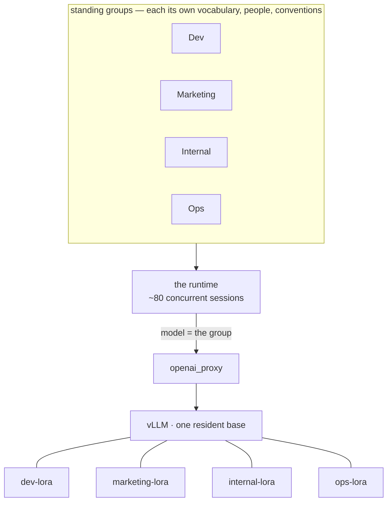
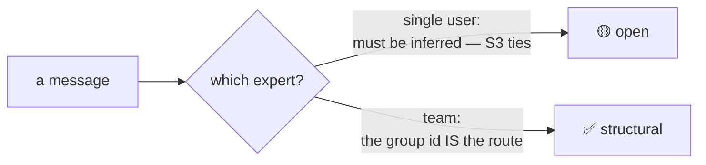
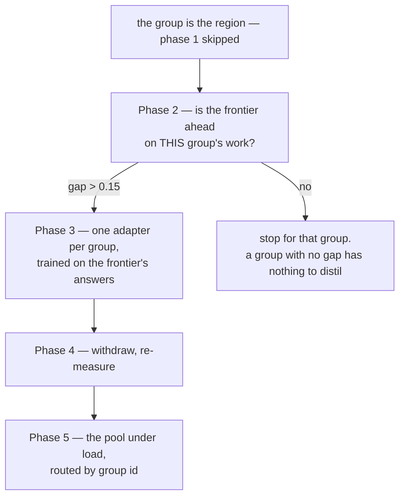

# A second case: many groups, one GPU, and the region you do not have to find

[`CASE-TRIAGE.md`](CASE-TRIAGE.md) takes one person's repeated task and exercises the
adapter pool with **one** adapter at a time. This one is its complement: a team
running an agent runtime in multiplayer mode — every employee in chat, several agents,
dozens of concurrent sessions, and conversations organised into standing groups.

It is written from a publicly described deployment, with the person and the
organisation left out. **What matters here is the shape, not who runs it.**

## Why the shape fits better than a single user's

A single user doing varied work has **no region**, and the architecture's whole claim
is that a small expert beats a generalist *inside* one — S5's 0.000 was measured in
region, and the same expert falls **30/30 → 1/20** outside it. A standing group is a
region by construction: it repeats, it has its own vocabulary, and its membership is
stable.

**So the question `null_arm` exists to answer is already answered by the structure.**
For one person it takes two weeks of traffic to learn whether a region exists. Here
the group *is* the region, and phase 1 of the triage plan can be skipped.

## It dissolves the problem we could not solve

S3 is amber and has been since it was written: **the router ties a lookup table.** We
could not find material where inferring the right expert beats looking it up.

In this deployment that is not a problem to beat — **it is a problem that does not
arise.** The group id *is* the route. Nothing has to be inferred, because the client
already knows which room it is in.

A context that removes an open problem is worth more than one that improves a number.

## And it is the first case that exercises the pool as a pool

Everything measured so far has served **one** adapter at a time, or two in a
throughput test whose arms did not do the same work. Dozens of concurrent sessions
routed to different experts is the architecture's economic claim being exercised
rather than argued:

| question | our status | what this deployment supplies |
|---|---|---|
| can a pool be served at all | **S8 ✅** — each adapter its own model name, verified applied | nothing needed |
| what does a mixed batch cost | **unmeasured** — two runs measured output length, not routing | real traffic alternating between groups, with the same work on both sides |
| does per-request swapping scale | **not disqualified**, which is all we can say | ~80 sessions is the test |

**The pool-cost question fixes itself here.** Our two attempts both compared a
kernel-only batch against a mixed one, and the kernel writes 476 characters where the
domain writes 338 — so the measurement was dominated by output length **[ran]**
`results/P26-openai-server-20260913/`. With real groups the traffic is the same kind
of work on both sides, and the confound goes away for free.

## The order, and it is shorter than triage's

**Phase 2 is per group, not per deployment.** Some groups will have a gap worth
distilling and some will not, and a team-wide average would hide both. This is S1's
gate — the one that failed three times before a suite was found where the frontier
was genuinely ahead — applied once per region instead of once per project.

## What we do not have, and would be blocking at team scale

| | status |
|---|---|
| **multi-tenant isolation** — one key, one upstream, no per-user separation | not built |
| **streaming** — refused deliberately: a tag is only a call once it is closed | not built |
| **per-group adapter lifecycle** — training, promoting, retiring | not built |
| **privacy** — `openclaw_traffic` records shapes only, never prompts | **built**, and it matters more at team scale, not less |

## What this case is honestly for

It is the **model** half of such a deployment, not the infrastructure half. It
addresses *"we pay an API for every agent of every employee"* and *"the Marketing
agent should know how Marketing talks"*. **It does not address a websocket that drops,
a sidebar that fills with sessions, or a gateway behind a proxy** — and a reading of
this document that implies otherwise is a misreading.
