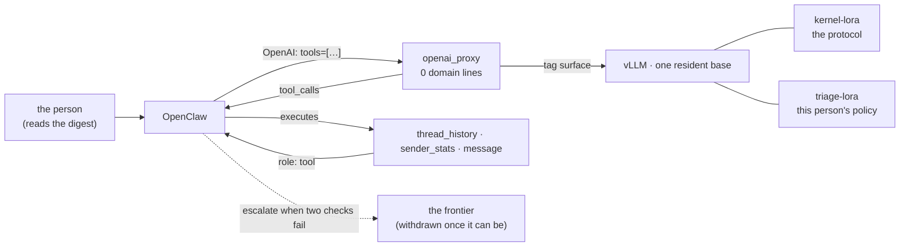
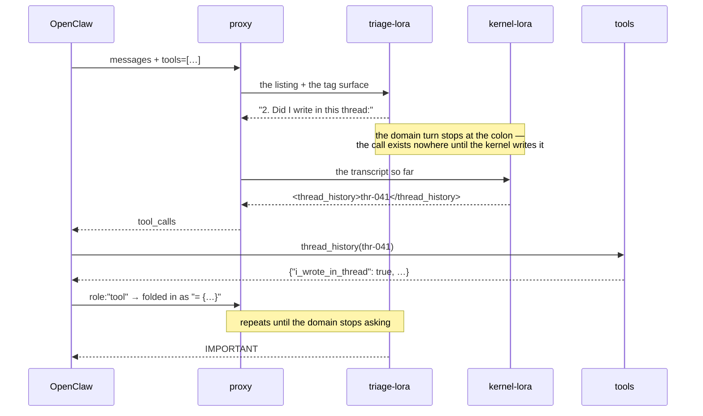
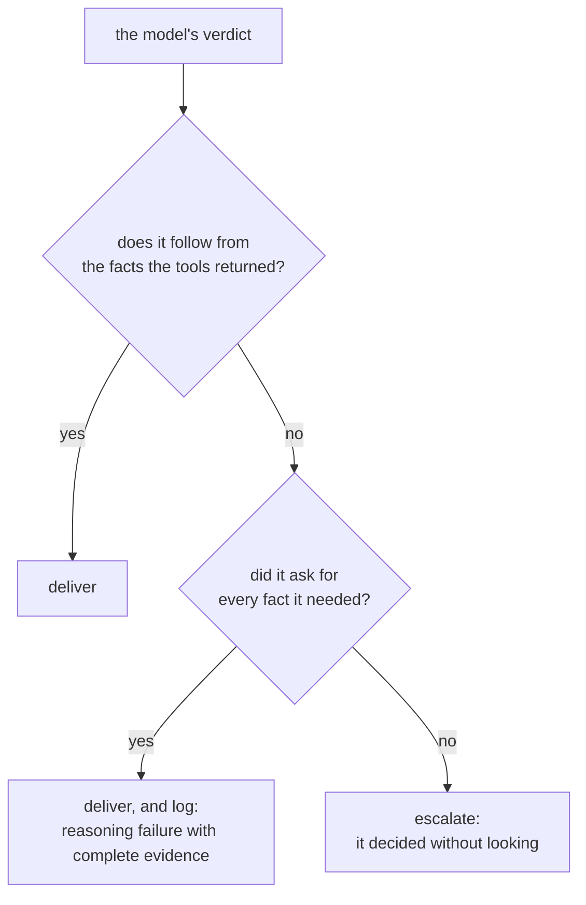
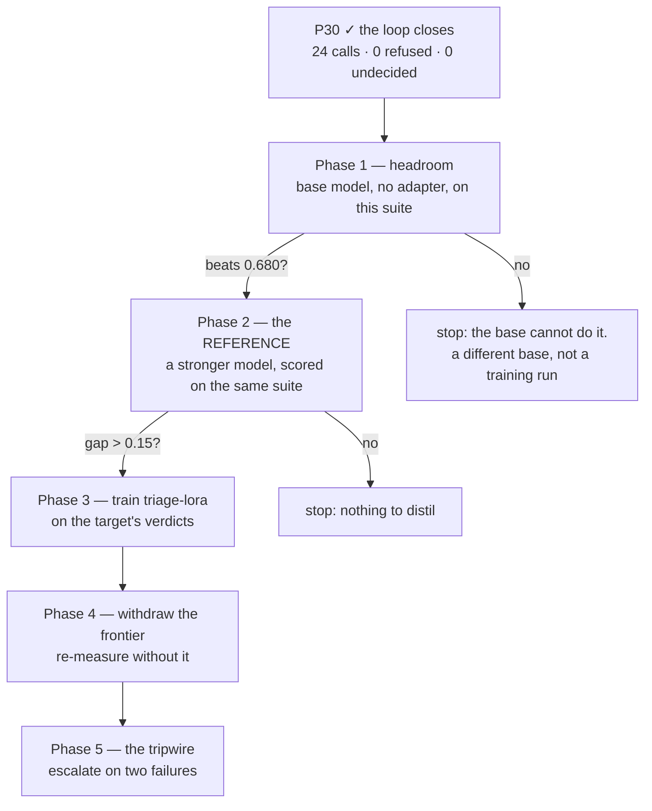

# End to end: morning triage as a test of everything lora-kernel built

This is a design, not a report. It takes one person's daily mail triage and asks
which of this project's **measured** mechanisms it exercises, which it cannot, and in
what order to find out. Every claim below that carries a number is linked to the step
that produced it; everything else is a plan and says so.

## Why this case and not a demo

The architecture pays only where there is a **region** — a narrow task repeated daily.
Triage is that, and it adds something fluid mechanics never had:

> **the right answer is mechanically checkable.**

`inbox.important()` is four conditions over facts the tools return. Given the facts,
the verdict is a computation. **That is a verifier without a judge**, and it is what
S7's tournament has lacked since the day it was written.

## The shape

Two processes and a pool. The proxy knows no domain — **0 of 38 lines name a tool or
a subject**, asserted by a test — and the adapters are swapped by the `model` field of
an HTTP request.

## One message, one conversation

The turn-taking is P13's result, not a design choice: **stacking the two adapters did
not work and taking turns did**, and the domain turn stopping at the colon is what
makes the call the kernel's rather than a copy **[ran]** `results/P13-sequential-20260910/`.

## What this case exercises, and what it cannot

| mechanism | measured at | does triage exercise it | how |
|---|---|---|---|
| protocol / domain split | S6 — 94/96 vs a rule's 93/96 | **yes** | the policy is the domain, the calls are the kernel |
| sequential activation | P13 — 0.6 → 4.7 calls per case | **yes** | the loop above |
| values that cannot be memorised | P21 — no-tool control 27/30 → 6/30 | **yes, for free** | a different inbox every day |
| tags → `tool_calls` | P27 — 0 domain lines, 604/604 | **yes** | the proxy, unchanged |
| the arity convention | P28 — refusals 88 → 17 | **yes** | all three tools take one parameter |
| the grammar mask | P24 — refusals 23 → 10, coverage unchanged | **yes** | same sampler, different tags |
| a withdrawal gap | S5 — 1.000 against 0.467 in region | **to be measured** | the target is the person's own frontier model |
| agreement orders experts | S2 — 6/6 pairs | **to be measured** | agreement on the verdict, not on prose |
| a fitness without an oracle | P20 — conjunction 2/2 | **replaced by something better** | the verdict is computable from the facts |
| the dimensional tripwire | P22 — 0 false alarms in region | **no** | there are no units here |
| the repair walk | P7 — 1/30 → 30/30 | **as an analogue** | recompute the verdict from the returned facts |
| the router | S3 — ties a lookup table | **no** | one adapter, chosen by the client |

**Two of the twelve do not transfer, and they are named rather than quietly dropped.**
The dimensional guard is physics; the router has nothing to route.

## The escalation, which survives the change of domain

P22's usable result was not the dimensional check itself — it was the **shape**:
escalate only when two checks that are blind in different places both fail. Here the
two are available and one of them is exact:

The left branch is `important()` run over whatever the tools actually returned — a
**mechanical check**, not a model. The right branch is coverage: did it call the tools
the definition needs. **Two failures before escalating** is P22's conjunction, which
never fired inside the region — 0 of 60 — while still catching a third of the work
outside it **[ran]**.

## The phases, and the gate on each

**Phase 1 is the killing arm and it is bought first.** If a 3B with tools cannot beat
0.680 on this suite, no adapter over it will, and the honest answer is a different
base. This project has twice reported a treatment that could not have worked because
the baseline was at a ceiling; **the floor costs exactly as much**.

**Phase 2's gate is the one S1 failed three times.** A withdrawal gap needs somewhere
to fall from: if the person's own frontier model is not clearly ahead on their own
mail, there is nothing to distil and the step stops there rather than proceeding to
measure a tie.

## What this design does not claim

- **No trained adapter has run on this suite.** P30 proved the plumbing with a stub;
  every row above marked *to be measured* is a plan.
- **The importance definition is invented.** It is a plausible policy, not this
  person's. A real deployment replaces it with theirs — and the fact that it is one
  function is what makes that a one-line change.
- **A simulated inbox is not an inbox.** It was built so the listing cannot answer it
  (a listing-only rule scores **0.680 against a bar of 0.680** **[ran]**), which is
  the property that makes it a fair test — and real mail may be easier, harder, or
  simply different.
