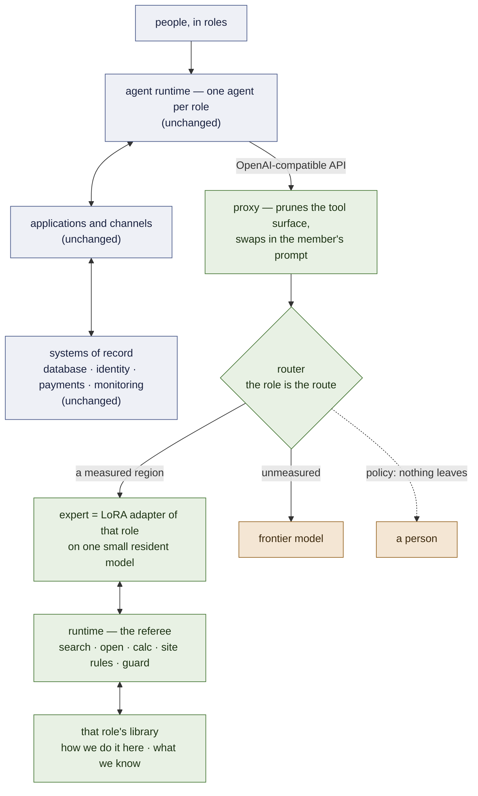

# From a measured runtime to a generic framework — state and gaps

*Written 2026-09-20 to be read on its own, and to be reviewed by other models. It answers three
questions: what works today, what has to be made to work, and what is missing for lora-kernel to be a
**generic framework** for one kind of deployment — an organisation that runs on one agent per role.
Every claim carries a marker: **[ran]** observed by executing something in this repository, with the
run named; **[read]** inferred from source or documentation; **[spec]** designed, not built. Numbers
come from [`RECORD.md`](RECORD.md); nothing here is a new measurement.*

---

## 1. The target: an organisation that runs on one agent per role

The reference deployment is the shape small organisations are converging on **[read]**. Its layers:

| layer | what is in it, in the reference deployment |
|---|---|
| **people** | four kinds of user: members (adults and children), visitors, educators, employees |
| **agent system** | an agent runtime (OpenClaw) with **one agent per role**: dev, trainee, marketing, educator, purchasing, finance, IT |
| **applications** | *scheduling* — calendar, memberships, enrolments, events; *administration* — communications, operations, purchasing, payroll and HR, marketing, dashboards |
| **channels** | a native app (calendar, messages) and a messaging channel split in two audiences: members, internal |
| **systems of record** | **one** relational database; beside it an identity-and-permissions provider, a payments provider, error monitoring |

In that drawing every agent is a system prompt over the same remote frontier model, and every message
from every person leaves the organisation whole. The bill and the data that leaves grow with the
number of people, not with how hard the work is.

**Our approach is one layer, placed under the agent column — it replaces nothing above or below it:**

The rule that orders the design: **records stay in the database, habits go in the adapter, knowledge
stays in notes a person can read and correct.** A role's adapter is trained on how *this* organisation
does *that* job; what it needs to know is looked up, never memorised; what it is not measured to
handle leaves — to a frontier model, or to a person where policy says nothing leaves.

---

## 2. What works today

All on generated suites; §3 says what that costs. Base model `Qwen/Qwen3.5-4B` unless noted.

| piece of the target | what is established | evidence |
|---|---|---|
| **several experts, one resident model, one GPU** | one vLLM, one base, several adapters, each request served by its own; identity gate `applied` on every member | **[ran]** P56, M1 |
| **an expert per task, released through a gate** | two released members, each tying its earlier release case by case on a new base: inbox triage 471/475, desk commitments 240/240; manifests hash corpus, adapter, recipe | **[ran]** M1, `releases/*@v2.json` |
| **an expert that works through multi-step tool chains** | fluids, 6–9 steps with calculator and per-case handbook: 90/90 when results are written inline as its corpus taught (11/90 through `tool_calls` messages) — on the 3B | **[ran]** M7 arm 0b |
| **the API between the agent runtime and the pool** | OpenAI-compatible proxy; prunes the runtime's 54 tools to the member's own (225/227 refused calls → 8/1160); swaps in the member's prompt (2/32 → 19/32 live turns call a tool); routes per request (0.546 → 0.775 on a 240-case replay, 0 misrouted); named models that must never leave (`--local`); fallback to a frontier (`--fallback`) | **[ran]** P41, P59, P62, P63 |
| **OpenClaw, live** | 40/40 turns local, 0 invented calls | **[ran]** P63 |
| **the library** | note format, lint, first library: 94 linked notes, an example site layer; 72/72 oracle walks | **[ran]** W1 |
| **the referee** | three verbs with results inline, opaque ids re-drawn per conversation, site rules applied before a note is shown, a guard that cuts a walk that skips a required step; 72/72 walks, 0 refusals, three cheating walks cut | **[ran]** W2 |
| **navigation transfers to a procedure never trained on** | against the untrained base made to navigate: 42 : 0; shared-line rows 22/22 (the base handed the right notes: 8/22); finding one's place mid-procedure 14/22 (5/22); 0 retrieval misses, 5 refused verbs in 88 walks | **[ran]** W5c |
| **the measurement kit** | headroom-first, paired exact sign tests, briefs with falsifiers written before the run, a grader that separates *right*, *right in another format*, *right but never read*; traffic **shapes** logged in passthrough without storing prompts | **[ran]** throughout; `openai_proxy --passthrough --log` |
| **the chain that runs it** | Colab sessions of ≤ 60 min, resumable, adapters fetched while the session lives | **[ran]** every run above |

## 3. What does not work, or is not measured

| | state | evidence |
|---|---|---|
| **no real data** | every suite is generated here; no real traffic has passed through the system | — |
| **the memory's central claim** — a library extends an expert to a procedure it never trained on | **measured three times, not passed.** The adapter ties or trails the *untrained* base handed the right notes: 35 vs 45 of 56; on a second corpus 42 vs 46 of 66 | **[ran]** W5, W5c |
| **reading a value under a condition, in an unseen note** | the adapter writes the first number: 0/11, then 4/15 after a corpus that showed the shape over eight notes — where it reads the *trained* notes 17/18 and the untrained base reads 15/15. *A balanced corpus over eight notes teaches eight notes* | **[ran]** W5c |
| **note search** | an off-the-shelf encoder: recall@3 0.638 against a bar of 0.80 fixed beforehand (word matching: 0.064) | **[ran]** W3 |
| **a learned router** | two arms (n-grams, embeddings) lose every legitimate request from an unseen sender; the default is a keyword dictionary | **[ran]** M2 |
| **moving a reasoning expert to a new base** | 80/90 against its own 90/90: ten chains right to the number whose last line leaves the corpus's format; not released | **[ran]** M7 arm 0c |
| **per-case escalation** | both available rules deliver less than routing by region: the expert's wrong chains are *consistent* | **[ran]** P41 |
| **per-user isolation and auth** | one API key, one destination | **[read]** `openai_proxy.py` |
| **concurrency** | dozens of sessions alternating between adapters: never measured | — |
| **streaming** | buffered on purpose: a tool call is only a call once it closes | **[read]** `docs/OPENCLAW.md` |
| **installability** | runs on a rented GPU through a tunnel and a Colab chain; no package, no container | — |
| **the saving in money** | never measured | — |
| **any language but English** | never measured; the reference deployment speaks Spanish | — |
| **writes** | every measured tool *reads*, *decides* or *calculates*. No expert has been measured performing an action that changes a system of record | — |

## 4. The finding that reshapes the design: the adapter navigates, the base reads

Three runs on the same question give one picture **[ran]** W5, W5b, W5c:

- **What training buys is navigation and procedure.** Untrained, the base cannot walk a library at all
  (0/56, 0/66; 336 refused verbs). Trained, it walks a procedure it never saw almost as well as the
  ones it did.
- **What training damages is a reading skill the base already has.** Handed the right notes, the
  untrained base reads a conditional value 15/15; the adapter, 4/15. The damage is narrow — on notes
  it trained on it reads *better* than the base (control 78/80 against 56/80).
- **Letting the base write every final line is not the answer** (W5b): it recovers the 12 reading
  failures and loses 19 control cases. **Splitting by kind of task might be**: the adapter carries
  procedures, the base reads values from the notes the adapter's walk opened — 47/56 and 58/60 on
  records already paid for. *That number is post-hoc on a set already seen and is evidence of nothing
  until it is run on a set written after the policy is frozen.*

For the framework this means the unit is **not** "one adapter answers everything in its role". It is
*an adapter that moves through the role's procedures and tools, plus a policy for who writes which
kind of answer*. That policy belongs in the role's contract, next to its tool surface and prompt.

## 5. Gap analysis, layer by layer

For each element of the target: what a generic framework must provide, what exists, the gap, and the
cheapest step that could show the gap is closable — or not.

| # | element | the framework must provide | exists | gap | first falsifiable step |
|---|---|---|---|---|---|
| **A** | **role → expert** | the agent's identity selects the adapter; no guessing | routing per request by *what is asked* (`route.REGIONS`, keyword keys); per-model `--local` | the route is not yet taken from the agent / session / group id the runtime already knows | zero GPU: carry the agent id in a header, replay the 240-case routing set with role-as-route; it must be ≥ the dictionary, with 0 misrouted |
| **B** | **a role's tool surface** | a declared set of tools per role, pruned and rendered the way the corpus taught | pruning, member prompt, `contract.py` reading block/keys/order off the corpus; one MCP server (inbox) | no generic declaration: each region's tools live in its own generator | a **role pack** manifest (§6) validated by a linter; the two released members re-expressed in it with byte-identical served prompts |
| **C** | **a corpus per role** | a way to go from tools + procedures + cases to a training corpus that passes `suite_gates` | four hand-written generators (inbox, desk, fluids, walks); the gates; the rule that a generator *calls* the renderer | no shared generator skeleton; *building a customer's corpus from its traces is out of scope of this repository by decision* — the framework ships the format, the gates and reference packs | extract the skeleton the four generators share; regenerate one existing corpus through it, byte-identical |
| **D** | **a library per role** | format, lint, referee, search, and a division of labour that passes a held-out test | W1–W4 built; W3's search under its bar; W5 not passed | §4: who reads; search recall; a reading skill taught over many notes or left to the base | one L4 session, no training: the split by task kind on the second held-out set; then a *new* set after the freeze |
| **E** | **access to the systems of record** | tools that read and write the database **as the person asking**, with permissions enforced outside the model and every action logged | nothing | the whole layer. Identity must flow runtime → proxy → tool; the model never holds a credential; row-level permission is checked by the tool, not asked of the model | a toy relational database with two roles and one forbidden row; the expert must be unable to obtain it through any tool call, measured as 0 leaks over an adversarial suite |
| **F** | **write actions** | confirmation, idempotency and undo for anything that changes a record | nothing measured | no expert here has ever been scored on a write | a role whose task ends in one write; gate on *wrong writes = 0*, not on accuracy |
| **G** | **many people at once** | isolation between users and between roles; adapters' lifecycle; throughput under mixed load | multi-adapter serving measured one request at a time; per-sequence LoRA application **[read]** vLLM | per-user keys; whether prefix caching is keyed by adapter is **not audited by us**; mixed-batch cost unknown | replay logged shapes at 8/32/64 concurrent sessions alternating adapters: latency, throughput, and a canary string that must never cross roles |
| **H** | **what leaves** | a per-role egress policy: frontier, a person, or refuse | `--fallback`, `--local`, a region table marked `local`/`out` by measurement | no hand-off to a person; no policy object; no record of what left | policy in the role pack; a log of every request that left, by role, with shapes only |
| **I** | **channels** | chat-grade latency; streaming | buffered replies | time-to-first-token and full-turn latency never measured on the member path | measure both on an L4 for the two released members under the proxy |
| **J** | **operations** | metrics, error reporting, drift detection, rollback to a previous release | manifests with hashes; shapes log | no metrics endpoint; no detection that traffic has left the region an expert was released on | `ceiling.py`-style check run on live shapes against the release's recorded band |
| **K** | **installation** | one command on one machine with a GPU | the Colab chain | container, configuration, a documented GPU sizing table | compose file: vLLM + proxy + referee; the OpenClaw walkthrough reproduced on it |
| **L** | **language** | the deployment's language | English only | unknown | the inbox suite translated: base headroom first, then one adapter |
| **M** | **the bill** | cost per resolved request, local against frontier, by role | nothing | the claim the whole architecture rests on commercially is unmeasured | the 240-case replay priced both ways, with GPU-hours at the rented rate |

## 6. What "generic framework" means here: the interfaces to freeze

A framework is the set of things a third party fills in without reading our code. Eight interfaces;
five exist in some form.

| interface | what it fixes | state |
|---|---|---|
| **release contract** | corpus hash, adapter hash, recipe, base, the paired verdict it entered on | **exists** `releases/*.json`, `release_gate.py` |
| **gate protocol** | headroom → arms in sequence → paired sign test → verdict in the file | **exists**, in every runner; not yet one reusable module |
| **library format** | note frontmatter, links, slots, layers textbook → site → case, site-added sentences, lint | **exists** `memory/notes.py`, `layers.py`, `lint.py` |
| **runtime verbs** | `search`, `open`, `calc`; inline results; opaque ids; guard modes | **exists** `memory/runtime.py`, `guard.py` |
| **serving adapter** | OpenAI-compatible in, vLLM multi-LoRA out; prune, prompt, route, fallback | **exists** `openai_proxy.py`, `route.py` |
| **role pack** | one directory per role: id, tool surface, system prompt, corpus reference, library reference, suites, **answer policy** (§4), **egress policy** (H) | **missing** — today this is spread over `train_pool.POOL`, `route.REGIONS`, generators and flags |
| **tool layer** | how a tool reaches a system of record as the asking person, with permission and audit | **missing** |
| **measurement kit** | shapes log → null arm → headroom → the brief | **partial**: the pieces exist, not packaged |

The scope line does not move: **a customer's corpora, adapters as a service, and the pipeline from
traces to a release are not part of this repository.** The framework is the runtime, the formats, the
gates and *reference* role packs built on generated data — the instrument that measures a
customisation, not the customisation.

## 7. The order to make it work

Cheapest and most able to kill an assumption first. Each step names what would stop it.

1. **Decide who reads** (D). One L4 session, no training: the split by task kind on the second
   held-out set. *Stops if* it does not beat the adapter alone, paired. Then the same policy on a set
   written after the freeze — the only version that counts.
2. **Role as route** (A). Zero GPU. *Stops if* routing by agent id is worse than the dictionary on
   the replay — which would mean roles do not partition the work the way the drawing assumes.
3. **The role pack** (B, C). Zero GPU: manifest, linter, the two released members re-expressed in it
   with byte-identical served prompts. *Stops if* a member cannot be expressed without losing part of
   what its corpus taught.
4. **A reference organisation on a neutral domain** (B–F, H). A generated distributor: three roles,
   a toy relational database, a library per role with the conditional shape over *many* notes, tools
   that read as the asking person. It is the end-to-end the target architecture needs and the many-note
   test §4 asks for, in one build. *Stops if* an expert can be made to return a forbidden row.
5. **Many people at once** (G, I). Concurrency, latency, the cross-role canary. *Stops if* alternating
   adapters costs more than serving them apart.
6. **The bill** (M). *Stops if* the local share costs more than it saves — milestone 6's own
   falsifier.
7. **Installation, language, operations** (K, L, J) — once 1–6 say there is something worth installing.

Steps 1–3 need no training. Step 4 is the first that does.

## 8. Questions for a reviewer

1. §4 proposes splitting *who writes the final answer* by kind of task. Is there a cleaner division —
   for instance, the adapter emitting a pointer to the span it read, and the base copying it?
2. The adapter loses a reading skill after 3 epochs at rank 16 over all projections. Would a lighter
   recipe (attention-only, one epoch, lower rank) keep navigation and spare reading — and is that a
   cheaper experiment than teaching the shape over many notes?
3. Is *role as route* safe? What breaks when one person's message legitimately belongs to two roles?
4. The tool layer (E) puts permission checks outside the model. What is the minimal design in which a
   prompt injection inside a *note* or a *record* cannot cause a cross-role read?
5. Should the router abstain on *requests* or on *steps*? Per-case escalation failed because wrong
   chains are consistent (P41). Is there a signal that sees a coherent and wrong answer?
6. Note search reaches 0.64 recall@3. With role as route and a shelf argument, is a learned projection
   still needed, or does the library's own link structure do the work?
7. What is the smallest honest end-to-end demo of the target architecture that uses no real data and
   still cannot be mistaken for a toy?
8. Which of §6's missing interfaces should be frozen first, given that freezing one early constrains
   the others?
9. Every result is on generated suites. Which single real dataset, permissively licensed and not from
   health care, would most cheaply replace one of them?
10. What would make you *not* build this — which row of §3 is the one that should stop the project if
    it does not move?

---

*Pointers: [`ARCHITECTURE.md`](ARCHITECTURE.md) the system · [`MEMORY.md`](MEMORY.md) the memory's
specification · [`RECORD.md`](RECORD.md) every measurement · [`PLAN.md`](PLAN.md) the living plan ·
[`SERVING.md`](SERVING.md) and [`OPENCLAW.md`](OPENCLAW.md) running it.*
