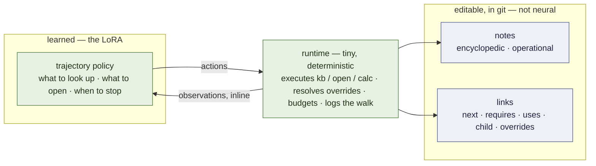

# Knowledge trajectories — a per-expert memory that is also the harness

**A design document, written to be argued with.** It is self-contained on purpose: hand it to
another model, or a person, with no other context and ask them to break it. Everything marked
**[ran]** was measured in this repository and names its run; **[read]** was read in source or a
paper; **[proposed]** is a design choice nobody has tested; **[open]** is a question this document
does not know the answer to. **Nothing described here is built.** The measurements that shaped it
are real, and §2 lists them with their numbers, because a design review that does not know them
will re-propose what already failed.

**The implementation decided from this design — the library's two shelves, the radar, three verbs,
the referee, and the build order for version 1.0 — is [`MEMORY.md`](MEMORY.md).** This document stays
as the argument and its open questions.

Status: proposal, 2026-09-19. Owner of the idea: the user. Plan entry:
[`PLAN.md`](PLAN.md) milestone 7. Formalism: [`FOUNDATIONS.md`](FOUNDATIONS.md) §8.6.

---

## 1. The idea in one paragraph

The system is a pool of small experts: one QLoRA per subdomain over a small resident model
(`Qwen3.5-4B`), a router that sends a request to the expert whose training corpus it resembles and
to a frontier model otherwise. This document adds the expert's **memory**. Each subdomain gets its
own **knowledge base** of short markdown notes of two kinds — **encyclopedic** (what holds, and
when: concepts, regimes, property tables) and **operational** (how a kind of task is done: ordered
steps, the check that must precede an action) — embedded in a vector space. The expert does not
memorise the notes. What its LoRA learns is a **trajectory policy**: what to look up first, which
link to follow, when to stop reading and compute. **The weights hold the navigation; the base
holds the content.** And because an operational note *is* a procedure and its links *are* control
flow, a trajectory through them does what an agent harness does — so the harness stops being a
fixed prompt and a hand-written loop, and becomes three separable things: editable content,
editable control flow, and a learned way of walking them.

## 2. What is already measured, and must constrain the design

| # | finding | number | run |
|---|---|---|---|
| F1 | **A small model does not follow a procedure it merely reads.** Base 3B + a 914-token procedure document in the system prompt | 0 tool calls on 351/351 messages; 0.601, under the 0.655 majority bar; the trained expert beats it 137 : 1 | **[ran]** P61 |
| F2 | **Fixed knowledge in a training corpus is memorised, and then it prices nothing.** A lookup tool over a 14-value property table | a control with **no tool at all** scored 27/30 — 600 examples memorise 14 numbers. Fixed by a handbook drawn **per case** (a fluid that exists only in this problem) | **[ran]** P15, P21 |
| F3 | **A specialist is confidently wrong one step outside its region** | 30/30 on its formulas inside; **1/20** on two sibling families it never saw; prose equally fluent | **[ran]** P14 |
| F4 | **A corpus with one difficulty teaches a floor** | trained on 6-to-9-step chains only, the expert over-solves 18/18 shorter problems; the bare base beats it on 3-step ones | **[ran]** P45 |
| F5 | **An expert is what its corpus taught — the tool block, the argument order, the system prompt.** Served under another prompt it is another model | 2/32 live turns call a tool under the runtime's prompt; 19/32 under its own | **[ran]** P63 |
| F6 | **The way a tool's result reaches the expert matters.** Result inline after the closing tag (as trained) vs. through `tool_calls` messages | `email-full` 0.992 vs 0.808 | **[ran]** P55 |
| F7 | **An expert uses what it reads when it reads it the way it was taught — and not otherwise.** The fluids expert through `tool_calls` messages | 11/90: of 79 failures, 74 hold a number that came from nowhere and 75 leave a result unused — it looks the density up, 882.3, and multiplies by 1359.7. **Re-served with results written inline, as its corpus taught: 90/90**, 79 : 0 paired, no evaluated case in its corpus | **[ran]** M7 arm 0, 0b |
| F8 | **A lexical model of a generated corpus learns the generator.** An n-gram router trained on the experts' corpora | safe on foreign text (0/128 served locally vs 59/128 for a keyword dictionary) and loses **120/120** legitimate requests from unseen senders — every generated address ended `.com` | **[ran]** M2 |
| F9 | **Structure has lost to flat retrieval twice in this author's work.** A memory hierarchy vs lexical search; and indexing *what a thing is for* beside *what it is* | the hierarchy lost; the dual index changed nothing — acc@1 80 % at every mixing weight, n = 10, errors all **within-topic** | workspace benchmark; `evolving-memory` `benchmarks/RESULTS.md` **[read]** |
| F10 | **Distillation transfers a procedure and not the arithmetic** | adapter + calculator 40/40; adapter alone 4/40 (π/4·0.22² written as 0.037006) | **[ran]** P5–P7 |

Consequences, each of which the design below obeys:

- F1 ⇒ *following what it reads* has to be what the adapter is **trained** on. Pasting notes into
  the prompt of an untrained model is not a baseline that means anything at this size.
- F2 ⇒ anything the base is supposed to supply must be **unmemorisable by construction** during
  training and evaluation, or the base measures nothing.
- F3 ⇒ the headroom, and the claim: notes for a **sibling family the adapter never trained on**
  extend its region with no retraining.
- F5, F6 ⇒ the action vocabulary, its rendering and the inline result format are part of the
  corpus and frozen with the release.
- F7 ⇒ every note reaches the expert **inline, in the form its corpus taught**, and the design is
  measured **where it happens**: was the note retrieved, opened, *used* — not only the answer.
- F9 ⇒ hierarchy and trajectory-aware retrieval are **arms with a flat baseline**, never assumptions.
- F10 ⇒ arithmetic stays in a calculator.

## 3. The three parts



| part | holds | changes by | a classical harness keeps it in |
|---|---|---|---|
| **notes** | the content: facts, formulas, steps, checks | editing markdown | the system prompt |
| **links** | the control flow: what comes next, what must precede, what a step uses | editing frontmatter | a hand-written loop |
| **policy** | how to walk: query, open, follow, stop, compute | training a LoRA | the base model's obedience — which F1 says a small model does not have |

That table is the sense in which this *is* a harness: the same three responsibilities, moved to
where each can be changed at its own cost. Content and control flow change with a text editor and
a git commit; only the way of walking costs a training run, and it is the part that should change
least.

### 3.1 Notes **[proposed]**

One file per note, markdown with frontmatter, in `knowledge/<subdomain>/`. Short — a note must fit
a 4B's attention with room to spare: **target ≤ 150 tokens of body.**

```markdown
---
id: iv-primary/20-cleanse-cap
kind: step                      # concept | table | procedure | step | check | override
subdomain: nursing-iv
title: Cleanse the catheter cap before attaching tubing
what: Disinfection of the IV port's cap with an alcohol pad or scrub hub.
when: You are about to connect a syringe or tubing to a patient's IV port.
links:
  prev: iv-primary/19-assess-site
  next: iv-primary/21-assess-patency
  requires: [iv-primary/08-safety-steps]
  uses: [asepsis/scrub-the-hub]
source: Nursing Skills (Open RN), ch. 23, CC BY 4.0
---
Vigorously cleanse the catheter cap for at least {{seconds}} seconds and allow it to dry.
```

- **`what` and `when` are both embedded** — what the note *is* and what it is *for*. Borrowed from
  `evolving-memory`'s dual index **[read]**; its own benchmark found no gain (F9), so here it is an
  arm against a single embedding, not a given.
- **Kinds.** Encyclopedic: `concept` (a definition; which correlation holds in which regime),
  `table` (rows of properties). Operational: `procedure` (a skeleton: ordered step titles only),
  `step` (one action, its detail), `check` (a condition that gates an action). `override` is §3.3.
- **`{{slots}}`** are values the runtime fills when it serves the note. They are how F2 is
  satisfied (§5) and how a site's adaptation is expressed (§3.3).
- A **procedure is a skeleton plus step notes**, not one long note: open-book over a 32-step
  checklist is a different task from walking it, and the design needs both measurable.

### 3.2 Links **[proposed]**

| link | meaning | who reads it |
|---|---|---|
| `next` / `prev` | sequence inside a procedure | the policy, to advance |
| `requires` | this must have been opened/satisfied first | the policy — and the **runtime, as a guard** (§3.5) |
| `uses` | a step depends on a concept, table or sub-procedure | the policy, to descend |
| `child` / `parent` | hierarchy among encyclopedic notes | the policy, to narrow |
| `overrides` | a site's note replaces a field of a base note | the runtime only |
| `see_also` | weak association | retrieval re-weighting only |

`evolving-memory` writes such edges and **never reads one at retrieval time [read]** — its traversal
is `ORDER BY step_index`. Reading them is the new work here.

### 3.3 Layers: textbook, site, case **[proposed]**

A base resolves in layers, nearest wins: **case** (values drawn for one problem — training and
evaluation only) → **site** (a ward's or a customer's adaptation: "here the cap is cleansed for 15
seconds") → **textbook**. The **runtime resolves them, not the model**: `<open>` returns one note,
already resolved, with the overridden field marked (`[site]`). Reasons: it is deterministic, it is
auditable, and a model that has to retrieve *both* the rule and its exception and reconcile them
is being asked for exactly the thing F7 says it does badly. **[open]** whether hiding the
reconciliation costs the model the ability to *explain* a deviation when asked.

"Local experts" is this layer. It is also F2's unmemorisable content met in the world rather than
manufactured: a site's number cannot be in the weights because it differs by site.

### 3.4 Actions — the whole vocabulary **[proposed]**

Three verbs, written as tags in the expert's own text, the result injected **inline** after the
closing tag (F6), generation stopped at each closing tag:

```
<search>what is asked, in the expert's words</search>= 3 notes
  [a3f] step · Cleanse the catheter cap before attaching tubing — when: about to connect to an IV port
  [9c1] check · Assess IV site patency — when: before starting any infusion
  [77e] concept · Scrub the hub — when: any access of a needleless connector
<open>a3f</open>= Cleanse the catheter cap … for at least 15 [site] seconds and allow it to dry.
  links: next 9c1 · requires 08b · uses 77e
<calc>500 * 20 / (4 * 60)</calc>= 41.6667
```

- `<search>` returns **titles and `when` lines only**, never bodies: retrieval and reading are two
  decisions, measured separately (§6).
- `<open>` returns the resolved body and the note's outgoing links **with their types**. Following
  a link is just `<open>` on its id — no fourth verb.
- **Ids are opaque and re-drawn per case during training [proposed].** If ids were stable the
  adapter would learn "for step 20 open `a3f`" — navigation by rote, which works until the base
  changes and fails silently on a sibling family (F3). Opaque ids force it to read what `<search>`
  returned. **[open]:** the cost is that the policy can never learn a legitimate shortcut.
- Budgets are the runtime's: at most *k* notes per `<search>` (3–5), a token cap per note, a cap on
  opens per task. A walk that hits a cap ends as *not answered* and goes out to the frontier.

### 3.5 The runtime — what stays non-neural **[proposed]**

Executes the three verbs; resolves layers; enforces budgets; **logs the walk**; and checks
**conformance**: if the expert reports a step done whose `requires` target it never opened, that
is a violation the runtime can see **without knowing the right answer** — the same kind of guard
as dimensional analysis on a physics chain (P22 **[ran]**: an invented relation fails units). It
is a verifier the training loop never sees, which is what any signal used to select or train must
be. It lives in the proxy beside the existing tools; a subdomain's base is a few hundred notes, so
the index is an exhaustive cosine — a matrix product, no ANN library, no server.

## 4. Trajectory strategies — what "a strategy per LoRA" means

A strategy is a *grammar of walks*. A subdomain's training corpus is generated under one, so the
strategy ends up in the weights the same way the tool block does (F5). Which one fits is a property
of the subdomain's tasks — of the **distribution of its corpus** — and that is the hypothesis:

| # | strategy | the walk | expected to fit |
|---|---|---|---|
| S0 | none | answer from weights | the control; F3 says 1/20 outside the region |
| S1 | flat | one `<search>` on the task text → open top-1 → answer | the RAG baseline every other strategy must beat |
| S2 | **procedure-first** | `<search>` restricted to `procedure` → open the skeleton → walk `next`, descending `uses` only where a step needs a fact | nursing; any task that *is* a procedure |
| S3 | concept-first | `<search>` over concepts → descend `child` to a leaf formula or table → compute | diagnosis-like tasks; "which regime am I in" |
| S4 | **trajectory-conditioned retrieval** | every query is scored inside the neighbourhood of the last note opened | where flat retrieval confuses items *within* a topic — which is exactly where F9's errors were |

S4's score, with $q$ the query, $n$ a candidate, $\ell$ the last note opened, $N(\ell)$ its linked
neighbours and $e$ the encoder:

$$s(n \mid q, \ell) = \underbrace{\langle e(q), e_{\text{when}}(n)\rangle}_{\text{is it for this}} \;+\; \beta\,\underbrace{\langle e(q), e_{\text{what}}(n)\rangle}_{\text{is it this}} \;+\; \lambda\,\mathbf 1[n \in N(\ell)] \;+\; \mu\,\langle e(\ell), e(n)\rangle ,$$

$\beta = \lambda = \mu = 0$ is S1's flat search, so the arm is a strict generalisation of its
baseline and every sub-score is kept on the match to say which term moved a rank.

**One encoder for the router and the base [proposed].** The router's next arm is an embedding
model (F8 killed the lexical one). If a subdomain is a region of one space — the requests routed to
the member fall in it, and so do the `when` lines of its notes — then "whose corpus is this" and
"which note is for this" are the same geometry, built once. Candidates,
both small and open, both **served on Colab like every other model here — nothing runs on the
user's machine**: `embeddinggemma`, and in the family the smallest Qwen 3 embedding model **[read]**.

## 5. The corpus — how a trajectory gets into the weights

For each training case the **oracle knows the walk**: which notes the solution needs, in which
order. The corpus is that walk rendered as the expert's own turn, actions and inline observations
together, exactly as it will be served (F5, F6). Four rules, each from a measurement:

1. **Unmemorisable content (F2).** Slot values are drawn per case: a fluid named `TD-78` with a
   density that exists only in this problem; **and coefficients of the procedure itself** — a
   correlation variant, a site's dwell time. The adapter can learn *which* note a step needs. It
   cannot learn *what the note says*. The run asserts the channel is needed: no slot value may
   appear in the task statement.
2. **Opaque ids, distractors, and dead ends.** `<search>` results in the corpus contain wrong-but-near
   notes; some cases have **no applicable note**, and the taught walk ends in *not in my base* —
   which the proxy turns into the frontier. An expert that cannot abstain from its own base is F3
   with extra steps.
3. **Every depth the expert will serve (F4).** Walks of one, two, five opens; procedures entered at
   their first step and in the middle.
4. **Held-out sibling families (F3).** The test that matters is a family whose notes exist in the
   base and whose walks were never in the corpus.

**[open]** Imitating oracle walks is supervised and cheap. Whether the policy should then be
improved against the runtime's own signals — conformance (§3.5), *result used downstream* (F7),
the final verifier — by rejection sampling or preference training over walks is undecided; it is
the first place this design could start breeding walks that flatter its scorer.

## 6. How it is measured

Milestone 7's arms, in the order that can kill it soonest ([`PLAN.md`](PLAN.md)):

| # | arm | decides |
|---|---|---|
| 0 | the recorded failures, read where they happen | **done [ran]** — F7 |
| 0b | the same expert re-served with inline results | whether F7 is the model or the path |
| 1 | **oracle trajectory**, with vs without the base, on a held-out sibling family | the ceiling: if exactly the right notes, open, do not lift it off ~1/20, stop |
| 2 | learned navigation vs the oracle walk | what navigation loses |
| 3 | encyclopedic only · operational only · both | which kind of knowledge carries the gain |
| 4 | S1 flat lexical · S1 flat embedding · S4 | whether a trajectory strategy beats a flat search (F9 says do not assume it) |
| 5 | edit one note after training | that the answer follows the base, not the weights |

Measured **per step, not only at the answer**: *retrieved* (the needed note in `<search>`'s list),
*opened*, *used* (its value reaches a later step — the instrument of F7), *conformant* (§3.5),
*correct*; plus tokens per task, because a walk is not free. A reader that got lucky over an empty
note is a case a final score cannot see.

Two test beds with different jobs. **Fluid mechanics** is the *instrument*: an exact oracle,
content unmemorisable by construction, four subdomains of two sibling families each. **Nursing
procedures** (Open RN *Nursing Skills*, CC BY 4.0) are the *region*: text nobody here generated,
operational knowledge in its purest form, and a real site layer. A result that holds in one and
not the other is a finding about generated suites.

## 7. Memory in the other sense — walks that were taken **[proposed, phase 2]**

The runtime logs every walk. Logged walks are an **episodic memory** from which the base can grow:
notes repeatedly opened together suggest a `uses` link; a walk that reached the answer in three
opens where the procedure takes seven suggests a shortcut note; walks that failed conformance
suggest a `check` — a *do-not* beside the steps, which `evolving-memory` calls a negative
constraint **[read]**. Two boundaries. **A proposal is never applied without a gate** — a verifier
or a person — because a base that edits itself from its own traffic is F8 waiting to happen: it
will learn its own habits. And **the consolidation tooling is outside this open-source runtime**;
the runtime's part is to log the walk in a form that can be consolidated. **[open]** whether a log
may keep note *content* or only *shapes* — ids, kinds, link types — when the traffic is a
customer's.

## 8. What it changes elsewhere

- **The release contract** gains the base's hash, the index's hash, the encoder's id and the action
  grammar's version: a member is its corpus, its base and the way it was taught to walk it.
- **The speculative pair** (a LoRA on the small model and one on the large, same corpus): a walk is
  mostly *decision tokens* — which verb, which id — and both halves are trained on the same walks,
  so acceptance should be highest exactly there. **[open]**, and measurable with the instrument
  that already exists.
- **Routing:** "no applicable note" is a second abstention, inside the region, after the router's
  first one at its edge.

## 9. What this design does not claim

That a hierarchy helps. That embeddings beat lexical search inside a base of a few hundred notes.
That a 4B can learn to follow a *note it never trained on* — arm 1 exists to find out. F1 is a
reason to doubt it; F7 says only that the channel works: an expert does use what it reads, in
its own region, when it reads it as taught. That anything measured on a generated suite transfers to a real one. That
this is cheaper than putting the procedure in the weights when the procedure never changes — for a
frozen procedure, F1 says weights win, and the base earns its place only where content **varies**:
by site, by case, by date, or by family.

## 10. Questions for a reviewer

1. **Granularity.** One note per step, or per procedure with anchors? The first makes walks long
   (tokens, latency, more chances to derail); the second makes reading the hard part. Is there a
   principled size?
2. **Opaque ids.** Do they buy generalisation to unseen notes, or just make every walk pay for a
   search the policy could have skipped? Is there a middle — stable ids inside a trained family,
   opaque across families?
3. **Who reconciles an override** — runtime (proposed) or model? What is lost when the model never
   sees the textbook value it is deviating from?
4. **Who writes the query.** The policy (proposed), or a template filled from the current step
   (`step title + task`)? A template removes a failure mode and a degree of freedom.
5. **Is S4 worth its terms?** With two priors against structure (F9), what is the smallest
   experiment that would show $\lambda$ or $\mu$ earning their place — and on what kind of base
   would they have to?
6. **One encoder for routing and retrieval.** Is "a subdomain is a region of one space" sound, or
   do request-style text and note-style text need separate spaces or a learned projection?
7. **Beyond imitation.** Which training signal for walks does *not* breed a policy that flatters
   the conformance guard?
8. **Abstention inside the region.** How is "no applicable note" taught without teaching the policy
   to give up early?
9. **What F7 leaves open.** Inline, in its own region, a 3B uses what it reads (90/90). Does that
   carry to a note whose *content it has never seen used* — a sibling procedure — or is "uses what it
   reads" itself something it learned per family? What is the cheapest experiment that separates
   *reading* from *having practised this particular reading*?
10. **Where is this wrong?** In particular: is "trajectory = harness" a real decomposition, or a
    relabelling of retrieval-augmented tool use — and if the latter, what would the difference have
    had to predict to be real?
