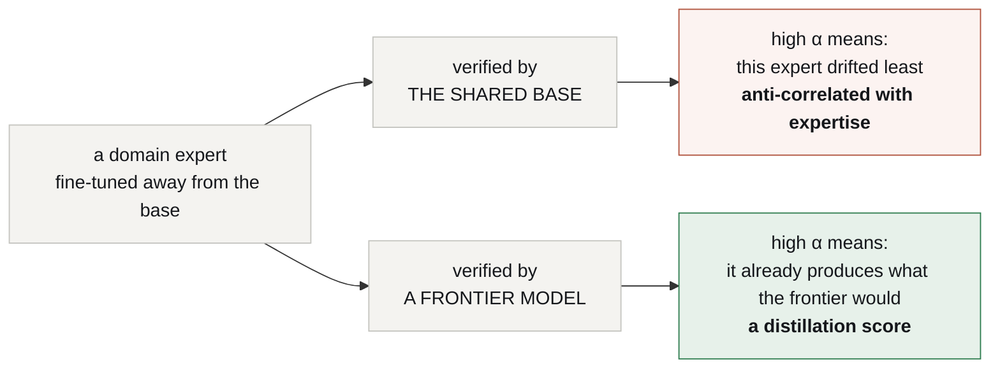

# Technical reference

> **Reference for mechanisms that exist; specification for the parts that do
> not.** Every claim about a system outside this repository is **[read]** and
> cited. Nothing here has been run.
>
> *[Léeme en español](es/TECHNICAL-REFERENCE.md)*

---

## 1. Speculative decoding

A **drafter** proposes `k` tokens. The **target** scores all `k+1` positions in
one forward pass. Rejection sampling accepts a prefix and resamples at the first
rejection, constructed so that **accepted tokens are distributed exactly as the
target would have emitted them**. Lossless by design. **[read]**

Two consequences define this project:

1. **The emitted answer is the target's.** During Phase A you are getting
   frontier output — which is the point: you are paying for frontier quality and
   collecting the measurement for free.
2. **α measures agreement with the target.** Against a frontier target that is a
   distillation score; against a weak base it is not. See
   [`ARCHITECTURE.md` §2](ARCHITECTURE.md).

### 1.1 What α measures depends entirely on what verifies



The right-hand branch is the architecture. The left-hand one is the reason the
target is a component rather than an optimisation: swap it and the router is
measuring the wrong thing, silently, while every number still looks fine.

### 1.2 Acceptance rate, defined

For drafter `d`, target `t`, prompt distribution `P`, draft length `k`:

```
α(d, t) = E_{x~P} [ accepted_tokens(x) / k ]
```

**Always reported with its `k`.** α falls as `k` grows, so a number without its
draft length is not comparable. Speedup is a function of `α`, `k` and the
drafter/target cost ratio — never of `α` alone.

**Always reported beside the verified task score** of the same configuration,
because the withdrawal decision is made on both.

### 1.3 The α surface

α is not one number per expert. It is a number per expert **per region** of the
problem space, and the regions are the unit of withdrawal. A legal-tax adapter
may cross threshold on deduction questions months before it crosses on
procedure. Store α with the region label, or Phase B promotes an expert into
territory nobody measured.

## 2. Multi-adapter serving in vLLM — state today

| capability | state | source |
|---|---|---|
| many LoRA adapters over one **target**, batched in one request stream | **ships** | **[read]** |
| tree-structured draft verification | **ships** (EAGLE/Medusa family) | **[read]** |
| LoRA adapter as the **draft** model | **open RFC**, 2026-08-12 | [vllm#52038](https://github.com/vllm-project/vllm/issues/52038) **[read]** |
| earlier attempt | adapter applied to target, **disabled on the draft** | [vllm#11966](https://github.com/vllm-project/vllm/pull/11966) **[read]** |

The RFC's figures are why this is the right bet: an **r=64** adapter is roughly
**28× smaller** than the 0.8B drafter it replaces, at drafting quality within
about **2%** of a fully-trained per-domain drafter. **[read]** That is the
economics of the whole expert pool in one number.

**Until it lands**, Phase A runs one of two ways, and both are the same
experiment with a different memory bill:

- adapters applied to drafter models outside vLLM's speculative path; or
- small per-domain drafters instead of adapters.

## 3. The KV cache — the expensive part

Branches from one drafter share a cacheable representation; tree attention
exploits that and is solved. **[read]**

Branches from **different adapters** do not. A LoRA modifies the projections that
produce K and V, so each adapter's branch has its own key/value state beyond the
shared prompt prefix. Paged attention gives prefix sharing; it does not give
cross-adapter branch sharing.

This is the open engineering problem of the architecture. It is worth solving
after E1, not before.

## 4. `harness.lora` — the kernel adapter

Trained on the execution protocol only, never on domain content.

### 4.1 Action tokens

The adapter emits protocol as **tokens**, not as prose a parser must recover:

```
<invoke_tool name="sql">SELECT …</invoke_tool>
<observe>…</observe>
<eval_state>…</eval_state>
```

Moving a format guarantee from a prompt into weights is the mechanically
strongest part of the design. **The honest comparison is grammar-constrained
decoding**, which makes invalid syntax *impossible* rather than unlikely — and
which this organisation has built: `token-trie` masks logits so a small model
cannot emit invalid syntax. It was archived for a reason worth repeating: **that
masking needs the sampler, which an API-backed SDK does not expose.** Owning the
runtime is what makes either approach available at all. **[read]**

The two are complementary: the adapter makes the *right* call likely, the grammar
makes the *malformed* call impossible. Shipping both is allowed.

### 4.2 What it must beat

Not "large JSON schemas in the system prompt" — that comparison flatters it. The
baseline is **our own previous version**: `gemma4nanoloop` bound tools per phase
and took peak schema overhead from **5,548 to 817 tokens, −85%**, with no
training at all. **[read]**

Three numbers, together:

- **protocol tokens per call** — the −85% is the bar
- **malformed-call rate** — against constrained decoding, not against prose
- **latency**, including adapter switch cost

Winning on tokens and losing on malformed calls is not winning.

## 5. Composing two adapters

The kernel and a domain expert must both be active. Three options, in increasing
cost:

1. **Sequential activation** — the domain adapter reasons, the kernel emits the
   call. Cheapest, and it matches the phase structure the loop already has.
2. **Stacked adapters** — both applied; requires the serving stack to compose
   two deltas on the same base.
3. **A merged adapter per expert** — trains the protocol into every domain
   adapter, which is the cost this design exists to remove. Listed to be
   rejected.

**Measured status, 2026-09-09 [ran].** Option 3 is the only one that has worked: a merged adapter scores **40/40** with the calculator, its withdrawal gap 0.000. Option 2 was run twice — stacked and blended at 0.5/0.5 — and scored **0/30** both times, but those arms are **confounded**, not falsifying: the two corpora taught different notations and every arm ran under one of their system prompts. P9 re-runs option 2 under a shared contract. **Option 1, the stated default of this section, was measured on 2026-09-10 and it is the one that works.**

**Option 1 was measured on 2026-09-10 and it works** [ran]
`results/P13-sequential-20260910/`. Taking turns moves delegation from **0.6 to
4.7 calls per case** and more than doubles accuracy: the competition option 2
suffers from is a property of asking two adapters for the same word, not of the
adapters. It is the default because it is the only mode that works, not because
it is cheapest.

**What option 1 costs**: two forward passes per step instead of one, and a
runtime that owns the turn boundary. Composition moves out of the weights and
into the loop — a real concession, and the price of the only mode that composes.

## 6. The fitness function

```
score = w₁ · verified task success
      + w₂ · α (against the frontier target)
      − w₃ · tokens consumed
```

- **`w₁`** comes from a verifier held out from the training loop. Non-negotiable.
- **`w₂`** is meaningful only while the target is frontier-grade.
- **`w₃`** includes adapter switch cost, not only generated tokens.

## 7. What is not neural

- **Memory**: markdown under git, readable and diffable by a person.
- **Execution**: the sandbox where tools run.
- **Verification**: a verifier whose strength is stated with every result.
