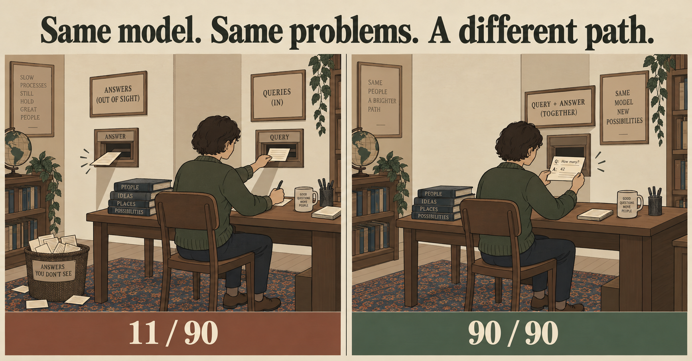

# An organisation that runs on agents, on a single GPU: the architecture

*An article for LinkedIn — September 2026. Spanish version:
[`2026-09-era-el-arnes.es.md`](2026-09-era-el-arnes.es.md). Every number here comes from the
repository's record ([`../RECORD.md`](../RECORD.md)) and names its run.*

*Records stay in the database; habits go in the adapter; knowledge stays in notes a person can read.*

---

More and more small organisations draw themselves the same way: people in a few roles, **one agent
per role** on a runtime like OpenClaw, the applications those agents operate, the channels people
already use, and one database underneath. It works. And it has a property that gets little
attention: **every message from every person to every agent leaves, whole, for a frontier API.** The
bill, and the data that leaves, grow with the number of people, not with how hard the work is.

This article is about the layer missing from that drawing — the one that goes *under* the agent
column — and about what can be built with it. The architecture first. Then which part of it is
measured and which is not, with numbers.

## The architecture, layer by layer

The drawing's example is a distributor. Read it top to bottom.

**1. People, in roles.** Customers, suppliers and carriers, the warehouse crew, the office staff.
They are not "users": each role asks different things, over different channels, with different
permissions.

**2. An agent runtime, with one agent per role.** Customer service, receiving, dispatch, purchasing
and stock, claims and returns, IT. This exists already and we do not replace it: it is OpenClaw, or
whichever runtime you use.

**3. The applications and the channels.** Orders (orders, deliveries, docks, returns) and back office
(communications, operations, purchasing, payroll, reporting); an app, and messaging split into
customers and internal. We do not touch these either.

**4. The systems of record.** One database, with identity and permissions, payments and monitoring
beside it. **They stay where they are.** No customer's data enters a model through training.

**5. And the new layer: under the agents, a single GPU as a bookshelf.** One small resident model —
4 billion parameters — and, leaning on it, **one LoRA adapter per role**, about 120 MB each. Where
today every agent is a *prompt* over the same remote model, here every role is an **expert**: trained
on how *this* organisation does *that* job. And every expert has a two-drawer card file:

- **"how we do it here"** — the operational harness: step-by-step procedures, linked by *requires*,
  *next*, *uses*;
- **"what we know"** — the wiki: what each thing is, which formula applies, what the catalogue says.

They are markdown notes under half a page. **The model does not memorise them: it learns to navigate
them**, with three verbs — search, open, calc. *The LoRA is not the textbook; it is the specialist who
knows how to use the library.*

Three more pieces close the drawing:

- **The router: the role a message comes from says *which* expert — never *whether*.** The runtime
  already knows which agent, group or channel a message came from, so nobody has to guess the expert.
  What still has to be checked is that the request falls inside what that expert is measured to do:
  when we let the role decide alone, 131 of 240 requests sent under the wrong role were served by the
  wrong expert without a sound. With the role *and* that check, all of them left.
- **Two exits for what is not measured.** What an expert is not *measured* to handle goes to a
  frontier model — or **to a person, where policy says nothing leaves the building.** Abstaining is
  part of the design, not a failure.
- **A referee that is not AI.** A small program turns the pages, **applies this site's rules before a
  note is shown** ("here a pallet over 1.6 m is re-stacked before dispatch") and cuts the walk if the model skips a
  required step.

The rule that orders everything: **records stay in the database, habits go in the adapter, knowledge
stays in notes a person can read and correct.** If a protocol changes tomorrow, someone edits a file
in git. Nothing is retrained.

## What you can build with it

The distributor is one example. The shape repeats wherever there are **a few procedures, repeated daily,
with local rules that differ from the textbook, over data that should not leave:**

| organisation | roles that become experts | what goes in the two drawers |
|---|---|---|
| **a distributor** | customer service, receiving, dispatch, purchasing, claims | the site's handling procedures · catalogue, carriers, service levels |
| **an accounting or law office** | intake, document review, deadlines, billing | the firm's checklists and templates · the rules of its jurisdiction |
| **a school or training centre** | enrolment, teaching support, communications, purchasing | how this school handles each case · programme, calendar, regulations |
| **a repair or field-service company** | equipment intake, diagnosis, spare parts, warranties | the procedure for each kind of repair · manuals, parts lists, warranty terms |
| **a club or community centre** | memberships, activity sign-ups, facilities, collections | how this club handles each case · activities, fees, house rules |
| **a property manager** | tenant requests, maintenance, collections, suppliers | escalation per building · contracts, by-laws, supplier terms |

None of those rows is measured: they are where the design points. What is measured comes below.

**If you wanted to build it, the order would be:**

1. **Pick a role, not the organisation.** The one with the most repetitive work and a verifiable answer.
2. **Look at shapes, not texts.** We have a tool that reads, from the runtime's own log, what *shape*
   the traffic has — how many turns, which tools, how long — without ever storing a prompt.
3. **Measure whether the frontier is actually ahead on THAT role's work.** Per role, not on average.
   It happened to us: on our first suite, paying 100 times more scored worse. A role with no gap has
   nothing to distil, and it is better to know before training anything.
4. **Write the library before the adapter.** The notes are useful from day one, to people too — and
   they are what the team will maintain.
5. Only then: an adapter for that role, through its release gate.

---

## What we already have

It is called **lora-kernel** and it is open source: an OpenAI-compatible API — with OpenClaw on top —
that resolves locally what falls in a measured region and sends the rest out. This is what stands
behind each piece of the drawing, with its number.

## The finding that ordered the project: it was our harness

*Same model. Same problems. A different path.*

For four days, the most repeated sentence in our project was: **"the expert that decides works; the
expert that reasons fails."** It was false.

We trained a small model — 3 billion parameters, with a LoRA adapter — to solve fluid-mechanics
problems: chains of 6 to 9 steps, each step using a tool (look a property up in a handbook, convert
units, calculate). We evaluated it on 90 new problems.

**Result: 11 of 90.** The model called its tools flawlessly — 603 calls, none refused — and then got
the physics wrong. The obvious conclusion: small models follow protocols, they do not reason. We
wrote it into the plan, retired the expert, and routed that region to a frontier model.

Four days later we wanted to build on that conclusion, and before doing so we read the 79 failures
one by one, looking at **where** each chain broke. It was not the physics.

In 74 of the 79, the model used a number that came from nowhere. It looked up the fluid's density,
the tool returned 882.3 — and in the next step it multiplied by 1359.7. A made-up number that looked
like a density.

Why would it ignore the result it had just asked for? Because **it never saw it where it had learned
to read it.** In its training data, a tool's result appeared written right after the call, in the
same text:

`<calc>3.96 + 0.541/2</calc>= 4.2305`

But we were serving it the standard API way: the call goes out as `tool_calls`, the result comes
back as a separate message with `role: "tool"`. To a large model those are the same thing. To a
small one trained the other way, the result simply was not there.

We served it again the way its training had taught it. **Same adapter. Same 90 problems.**

**90 of 90.**

Paired case by case, 79 to 0. A number that clean is exactly the kind we have learned not to
believe, so we checked before writing it down: none of the 90 statements was in its training data,
no answer recurred, and in 89 of 90 the final answer came from the model's own last calculation. On
those same cases a frontier model had scored 66. (With the caveat it deserves: these are problems we
generated, inside the exact region that expert trained for. A specialist beating a generalist
*there* is what you would expect.)

We had not measured the model. We had measured our harness.

## What it means if you run a fine-tuned model under OpenClaw

It is not a one-off. In twelve days we met it three more times:

- **The system prompt.** Under the runtime's 37 KB prompt, our email expert called a tool on 2 of 32
  turns. Under the prompt it was trained with, 19 of 32.
- **The tool list.** Offered OpenClaw's 54 tools, the expert copied names off the block: 225 of 227
  calls refused. Pruned to its own, 8 of 1160.
- **The result format.** The same email expert: 0.992 with results inline, 0.808 through
  `tool_calls`.

It is one lesson: **a small fine-tuned model is what its corpus taught it — the prompt, the tool
block, the order of the arguments, and the way a result reaches it.** Served any other way it is a
different model, and a worse one. Before concluding that "the model can't do this":

1. Look at where it fails, not only whether it fails. *Did it use what the tool returned?*
2. Serve it once exactly as it was trained. It is a ten-minute run.
3. Take the arithmetic out of the model's head. With a calculator, 40 of 40; without, 4 of 40.

## The pieces of the drawing, one by one

- **Several experts over one resident model, on one GPU.** Measured: one server, one base, several
  adapters, each request served by its own; sharing the card costs the one serving nothing.
- **Two released experts**, now on the Qwen 3.x family (4B): inbox triage **471/475** and desk
  commitments **240/240** — each a tie, case by case, with its earlier release on another base.
  Nothing is released without that gate.
- **The API routes per request; the client names no model.** On a 240-case replay, 0.546 → 0.775,
  with 0 misrouted.
- **OpenClaw, live, against the system:** 40 of 40 turns resolved locally, 0 invented calls.
- **The library exists.** The first one is built from the step-by-step procedures of an open
  textbook (CC BY 4.0) — 94 linked notes that pass a lint, with an example layer of local rules.
- **The referee exists.** All 72 reference walks pass through it without one refusal; the three
  cheating walks — skipping a required step, opening a note nobody showed it, going out of order —
  are cut.
- **And an encouraging sign about reading notes:** an untrained 4B goes from 29/48 to 45/48 with the
  right note open, and from 0/12 to 12/12 when the note carries a site's local rule.

## When the role is a group: a team in multiplayer mode

The same architecture, seen from the messaging side. The case I see more and more: **a whole team running OpenClaw in multiplayer mode.** Every person
writes to the agents from their messaging app. There are several agents. There are dozens of
sessions open at once. And the conversations live in **standing groups per area**: development,
marketing, internal, operations — plus everyone's direct messages, and a bot that now and then
shows "run failed".

*Many groups, one machine — and each group with its own specialist and its own library.*

**First, what this does NOT fix**, because it is what hurts most at that scale: a sidebar that fills
up with sessions, a gateway that now and then becomes unreachable behind an access proxy, a websocket
that drops. That is the *infrastructure* half of such a deployment, and nothing we do touches it.
Ours is the other half: **the model half.**

And in that half, a team changes three things compared with a single user.

**1. The group is the region — and the problem we failed at twice gets much smaller.** Our architecture
claims exactly one thing: a small expert beats a generalist *inside* a region — and outside it falls
from 30/30 to 1/20. One person doing varied work has no region; you have to discover whether one
exists, and then *guess* which one each message belongs to. That is where we failed: both of our
learned routers sent away 100 % of requests from new senders. **A standing group is a region by
construction**: it repeats, it has its own vocabulary, its people and its conventions. And the route
does not have to be inferred: *the group's id says which expert.* (Which, not whether: that the request falls inside what the expert is measured to do still has to be checked — above is what we measured when that check is missing.) The client already knows which room it
is in. A context that removes an open problem is worth more than one that improves a number.

**2. One GPU, one resident model, one adapter per group.** This part is measured: one server, one
base model, several adapters, each request served by its own; living side by side costs the one that
is serving nothing. An adapter weighs about 120 MB. Marketing's knows nothing about development, and
has no reason to.

**3. Each group's library is where "how we do it here" lives.** Marketing's operational harness —
how a brief is put together, what is checked before publishing — and development's — how a bug is
triaged, what a review asks for — are markdown files **the team itself edits**. The process changes,
the note is edited, and that group's agent follows it the next day with nothing retrained. It is the
difference between "the marketing agent should know how marketing talks" and having to tell it again
in every prompt.

What that goes after is concrete: **today, every message from every person to every agent leaves
whole for a frontier API.** The bill, and the data leaving the company, grow with headcount, not
with how hard the work is.

## What it is not, yet

I would rather say it myself:

- **Everything measured is on data we generated.** No real traffic has passed through the system.
- **It is not installable yet.** Today it runs on a rented GPU, a tunnel and our proxy.
- **The library's central claim is untested:** that it extends an expert to a procedure it never
  trained on. It is the next measurement, and it can go wrong.
- **The note search is not good enough yet.** An off-the-shelf embedding model puts the right note in
  the top 3 for 64% of paraphrased queries — against 6% for word matching, but under the 80% we had
  set before measuring. We did not move the bar.
- **Moving to a new base is not free.** The fluids expert, retrained on the new model, scored 80/90
  against its own 90/90: in all ten cases the arithmetic was right and the *last line* came out in a
  format its corpus never taught. It was not released. The harness, again.
- **The learned router failed twice:** safe on foreign text, but it sent out 100% of legitimate
  requests from new senders. That is why in this architecture the route is the role.
- **At team scale, still missing:** isolation between users, streaming, the adapters' lifecycle, and
  the cost of serving dozens of sessions alternating between roles.
- **We have never measured the saving in money.**

## Roadmap

1. ~~The pool on a newer base~~ — done.
2. **The test that can kill the library:** the expert solves a sibling procedure it never saw, only
   because its notes are in the library — against the same untrained model reading the same notes.
3. **A search that separates the task from its content**, for the notes and for the router.
4. **The first real region: a role in an organisation that already works this way** — there the
   region is given, with each site's adaptations as editable notes.
5. **The service policy, with the bill measured.**

Every step has, written before it runs, the condition that would prove it false. That is how we found
the harness.

## Want to test it? Do you have a real case?

If your organisation already draws itself this way, we would love your help evaluating it. We are
looking for two or three teams to test this and share feedback — ideally a team that already runs an
agent per role, with a task that meets three conditions: it repeats a lot, it has a verifiable answer,
and today it is sent whole to a frontier model.

We have no product to sell you. We have an architecture, a method to measure whether part of that
work can be resolved on your own machine — and the habit of publishing the number whichever way it
comes out.

Repository: github.com/EvolvingAgentsLabs/lora-kernel

Apache 2.0. The idea began in a conversation with Ismael Faro.
