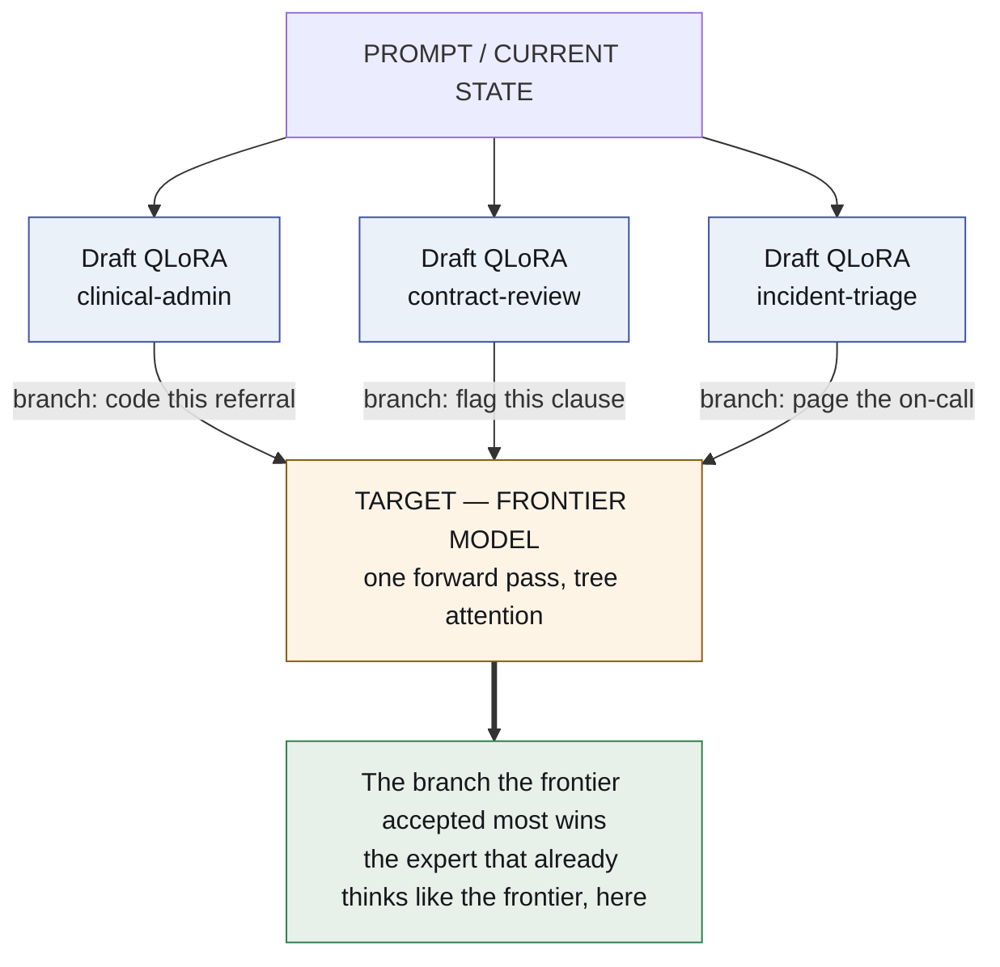
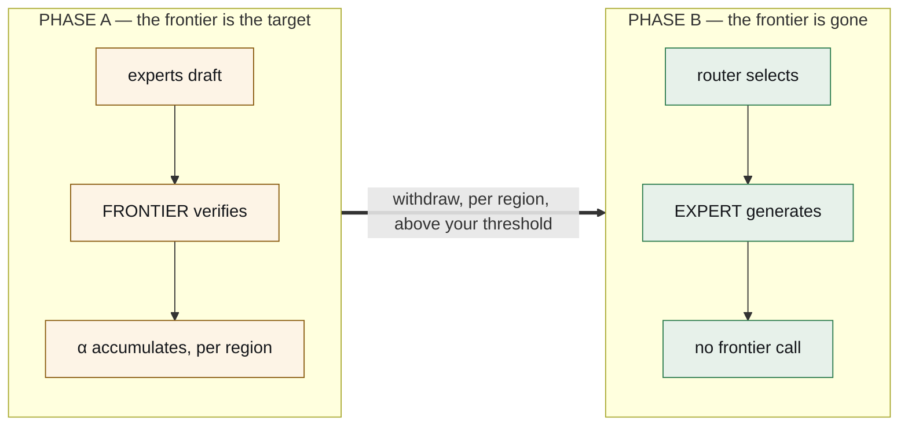

# Delete the framework. Put it in the weights.

*A multi-agent system is currently a pile of Python holding a model at arm's
length. It does not have to be. The whole thing — the harness, the router, the
experts — can be a handful of files sitting on one model, and the mechanism that
gets you there is a distillation trick hiding inside an inference optimisation.*

*[Léeme en español](es/delete-the-framework.md)*

---

## What you have today

Open the agent system you are running right now and look at what is actually in
it.

A **router**, which is a model call whose only job is to decide which other model
call to make. A **system prompt** carrying a JSON document that describes every
tool, most of which this request will not use. A **parser** downstream, guessing
whether the model meant to call something. **Retry logic**, because sometimes it
guessed wrong. An **orchestration process** in Python, holding state, making HTTP
calls, and waiting.

Every one of those is software written to compensate for the fact that the model
does not know how to act. And each one is a place where a request can be slow, or
expensive, or wrong in a way nobody notices.

Now the claim:

> **All of it can be weights.** One base model resident on one GPU, and a folder
> of small adapters — a few hundred megabytes each — swapped per request. The
> harness is one of them. Each expert is one of them. The router stops being a
> call and becomes a by-product of arithmetic you were already paying for.
>
> **The multi-agent framework does not get simpler. It stops existing.**

## Three ways to read the rest of this

Because the same architecture is a different thing depending on what you are
holding.

**If you sign the invoice.** You currently pay frontier prices on every request
because a smaller model is not reliable enough on your domain. This is a path
where you keep paying them *for a while*, on purpose, and the paying itself buys
you the measurement that lets you stop.

**If you are on call.** Your outages are format errors, a parser that met an
answer it did not expect, and a router that sent a question to the wrong agent.
Two of those three are prompt-shaped problems, and this moves them out of the
prompt.

**If you train models.** This is online distillation where the evaluation is free
and continuous, the teacher is in production rather than in a notebook, and the
promotion criterion is a number you set rather than a vibe. The part that is
novel is not the distillation. It is where the score comes from.

---

## The first thing to become an adapter is the harness

Not the experts. The harness — and this is the part I find hardest to stop
turning over.

What does a harness do? It **injects tool schemas into the system prompt**, so
every call pays for a document describing functions it will mostly not use and
the model's attention is spread across it. Then it **validates the output
afterwards**, with a parser that is guessing, or with a grammar that constrains
the decoder.

The protocol lives in the prompt. That is the most expensive and least reliable
place to put anything.

**So train it into the weights.** One adapter — `harness.lora` — on nothing but
the execution protocol:

- tool-call syntax, and **action tokens emitted natively**: `<invoke_tool
  name="sql">`, `<observe>`, `<eval_state>`
- what an API error looks like, and what to do about it
- state transitions — when a step is done, when to hand back, when to stop

It never learns a domain. It learns *how to act*, once, and every expert composes
with it. **The domain adapter thinks; the kernel acts.** A fleet of twenty experts
stops containing twenty copies of the same tool protocol.

And here is the part that makes it more than a token-count optimisation.

> **A harness in weights is a harness you can version, score and evolve.**

Today your harness is code. You cannot cheaply run two of them against the same
traffic and keep the better one — you refactor, you deploy, you hope. As an
adapter it enters the same tournament as everything else, with the same fitness
function and the same held-out verifier. `harness-v3` loses to `harness-v4` on
malformed-call rate and is retired overnight.

**The orchestration layer stops being the one part of the system that cannot
improve by itself.**

### The honest comparison, before anyone gets excited

The flattering comparison is "look how much smaller the system prompt is". The
one that counts is our own previous result: `gemma4nanoloop` bound tools *per
phase* — the model only ever sees the two or three tools the current phase can
use — and took peak schema overhead from **5,548 tokens to 817, a reduction of
85%, with no training at all.** A harness adapter has to beat that.

And on syntax the incumbent is not prose, it is **grammar-constrained decoding**,
which does not make malformed output unlikely — it makes it *impossible*. We
built that too, in `token-trie`, and archived it for a reason that matters here:
masking logits needs the sampler, and an API does not give you the sampler.

Which points at the resolution rather than a fight: they are complementary. The
adapter makes the *right* call likely; the grammar makes the *malformed* call
impossible. Ship both — and measure the adapter on tokens, on malformed-call
rate, and on latency including the swap. Winning on the first and losing on the
second is not winning.

## The experts are adapters, and one of them gets chosen for free

Now the router. This is where an inference optimisation turns out to be something
else.

**Speculative decoding** makes generation faster by having a small model guess
ahead. A **drafter** proposes a handful of tokens; a **target** checks them all in
one forward pass; the survivors are kept. It comes with a guarantee that is the
whole reason anyone uses it: **the tokens that come out are distributed exactly
as the target would have emitted them.** The drafter can make the answer arrive
sooner. It cannot make it a different answer.

Now make the one choice that decides everything: **let the experts be the
drafters, and let a frontier model be the target.**



Look at what the acceptance rate now means.

The frontier is not agreeing with the blandest adapter. It is agreeing with the
one that **produced what the frontier itself was about to produce** — in this
domain, on this problem, right now. That is not a speed statistic. It is a
per-region distillation score, and you get it inside inference you were paying
for anyway.

**You are not running an evaluation.** You are serving traffic, and the serving
path is quietly filling in a map: which small expert can already stand in for the
frontier, and where.

Routing — normally a classifier call nobody trusts — costs nothing. The tokens
existed. The pass was happening. The winner is a by-product.

## And then the teacher leaves

This is what turns a clever trick into an architecture. **The frontier model is
scaffolding, and the design says when to remove it.**



In **Phase A** you pay frontier prices and get frontier answers, and the map
fills in. In **Phase B**, for the regions where an adapter crossed the threshold
*you* chose, you promote it from drafter to generator and drop the frontier. What
replaces it is not another large model. It is **a router and nothing else**.

|  | Phase A | Phase B |
|---|---|---|
| **cost** | frontier | local |
| **quality** | frontier | at the α threshold you required |
| **what you also get** | a distillation score, free | — |

The threshold is yours, per region, on a measured surface: how much frontier
agreement do you demand before a small expert answers alone? It is reversible — a
region whose verified score drops goes back to Phase A.

One number is what the whole architecture exists to make small: the **withdrawal
gap** — the verified task score after the frontier leaves, minus the score it had
while it was there.

## Two kinds of competition, and they are not the same mechanism

"Compete" hides two different things, and separating them is what makes a pool of
adapters tractable rather than chaotic.

**Across sub-domains, competition is routing.** `clinical-admin`,
`contract-review` and `incident-triage` draft the same request; one is simply the
right expert; acceptance says which. **Per request**, in the forward pass, free.

**Within one sub-domain, competition is evolution.** `contract-v1`, `contract-v2`
and `contract-v3` are not answering different questions — they are three attempts
at the same job. That is decided over hundreds of requests, offline, on
accumulated fitness:

```
score = w₁ · verified task success
      + w₂ · α (acceptance against the frontier target)
      − w₃ · tokens consumed
```

The worst is retired. The winners' best trajectories become a DPO or GRPO
dataset, and `contract-v4` is trained from them overnight.

Conflating the two gives you a system that re-decides its architecture on every
request. Routing is a decision about *this prompt*; evolution is a decision about
*the pool*, and it belongs in the night.

## What deliberately stays text

Two things never become weights, and it is not aesthetics.

**Memory is markdown in git.** A weight delta cannot be read, diffed, cited or
corrected by a person, and it cannot be pointed at in an audit. Everything this
organisation has measured about memory says the durable asset is the part a human
can read.

**Execution is a sandbox.** Tools run as processes.

That is the entire system: a GPU, a base model, a folder of deltas, a text
repository, and a sandbox.

## What is true today, and what it costs

The appeal of an idea is not the same as its availability.

**Multi-LoRA serving over one target ships today.** Tree-structured draft
verification ships today. **LoRA-as-drafter does not yet** — it is an open vLLM
RFC, filed 12 August 2026. Until it lands, Phase A runs with adapters applied to
drafter models outside vLLM's speculative path, or with small per-domain
drafters: more memory, identical experiment.

That RFC is also the best argument for the economics: an **r=64 adapter is about
28× smaller** than the 0.8B drafter it replaces, at drafting quality within
roughly **2%**. That ratio is why holding twenty experts in memory is reasonable.

**The hard part is the KV cache.** Branches from one drafter share a cacheable
representation — that is what tree attention exploits. Branches from *different
adapters* do not, because a LoRA changes the projections that produce K and V.
Prefix sharing is standard; cross-adapter branch sharing is the open problem, and
it is worth solving only once the first acceptance surface says the branches are
worth comparing.

**And two warnings from measurements that were not kind to us.** Owning the
runtime is what makes any of this available — both halves of the harness argument
need the sampler, and an API does not hand it to you. And a tournament can breed
flattery: the same procedure once classified as *interface compensation* on a 4B
model and *persistent gain* on a 12B. Whether an expert is real is not a property
of the expert; it is a property of the pair. So the task-success term has to come
from a verifier the loop cannot see, or the loop will cheerfully evolve adapters
that agree with their scorer and know nothing.

## What runs first

A **headroom check**, because a base model already at the ceiling makes every
expert tie, and a tie reads as a success.

Then two domain adapters and one frontier target, to produce the first acceptance
surface.

Then the withdrawal, and the number that decides everything: how much verified
quality is lost when the frontier walks away.

---

*The repository is [`lora-kernel`](https://github.com/EvolvingAgentsLabs/lora-kernel).
Nothing is built yet, and it says so on every page.*

*This line of enquiry began when [Ismael Faro](https://github.com/ismaelfaro)
suggested I study speculative decoding and see what it was good for. It turned
out to be good for something other than speed.*
