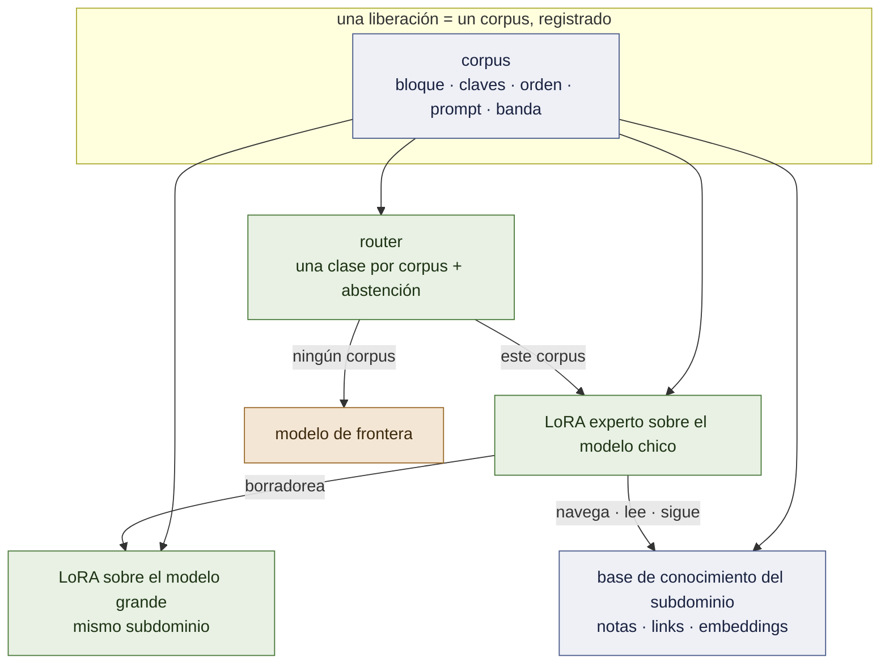
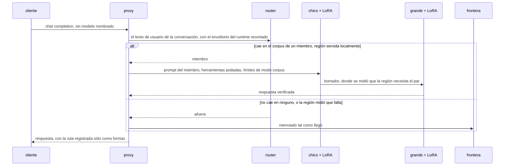
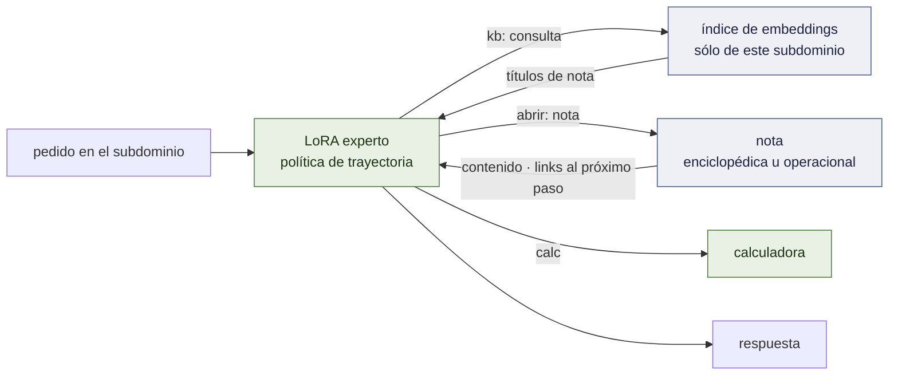

# Arquitectura

El sistema tal como está diseñado el 2026-09-19. Lo que está construido y medido lleva la
marca **[ran]**; lo que está diseñado y no construido, lo dice. Las mediciones detrás de
cada elección están en [`RECORD.md`](RECORD.md); el orden de trabajo está en
[`PLAN.md`](PLAN.md).

## 1. Un hecho, cuatro componentes

**Un experto es la distribución de su corpus.** No sólo los pesos: el bloque de
herramientas, las claves del argumento y su orden, el system prompt, la profundidad de los
problemas que vio. Servido fuera de esa distribución es un modelo distinto, peor — 2 de 32
turnos en vivo llaman a una herramienta bajo un prompt ajeno, 19 de 32 bajo el propio
**[ran]** P63; por debajo de su profundidad de entrenamiento un experto de razonamiento
sobre-resuelve 18 de 18 **[ran]** P45.

Todo lo demás es ese hecho aplicado cuatro veces:

| componente | qué es | estado |
|---|---|---|
| **el experto** | un QLoRA sobre el modelo chico, entrenado por SFT sobre un corpus, liberado con un contrato que registra la distribución | **[ran]** dos liberados, sobre Qwen 2.5 |
| **el router** | un modelo muy chico *de los mismos corpus*: a la distribución de qué experto cae este pedido — o de ninguno | un diccionario de palabras clave **[ran]**; el modelo es el hito 2 |
| **el par** | un segundo LoRA, sobre el modelo grande, entrenado sobre el *mismo corpus*; el chico borradorea, el grande verifica | diseñado; hitos 3–4 |
| **la base de conocimiento** | las notas propias del subdominio — enciclopédicas y operacionales — embebidas; el LoRA aprende la **trayectoria** que las recorre, no su contenido | diseñado; hito 7 |

Un solo artefacto — el corpus nombrado en el manifiesto de la liberación — define al
experto, entrena su mitad grande, y entrena la clase del router para él. Agregar una región
agrega un corpus, y la base de conocimiento que las trayectorias de ese corpus recorren.

## 2. El camino del pedido

**El proxy** (`openai_proxy.py`) **[ran]**. Habla la API de OpenAI. Para un miembro poda las
herramientas ofrecidas a la superficie declarada del miembro (`--prune`), reemplaza el
system prompt del runtime por el que enseñó el corpus (`--member-prompt`), y corre el bucle
de modo corpus — la generación para en una etiqueta de cierre, se inyecta el resultado de la
herramienta, continúa — acotado a seis idas y vueltas y 256 tokens por paso, los límites que
tiene el propio corpus. Se rehúsa antes que servir mal: un pedido que no puede rutear es un
503, no una adivinanza.

**El router** lee el asunto de la conversación y nada más: cada turno de usuario, con el
envoltorio de contexto interno del runtime recortado — el propio system prompt de un
runtime superó en puntaje al email del turno de usuario la primera vez que un agente en vivo
llamó **[ran]** P63. Dos decisiones se mantienen separadas a propósito:

- *a qué distribución pertenece esto* — la del router, aprendida de los corpus. Su primer
  brazo aprendido, un modelo de n-gramas del marco de cada corpus, fue seguro sobre texto
  ajeno y perdió todos los pedidos de un remitente nunca visto **[ran]** M2; el diccionario
  se mantiene hasta que se mida el brazo de embeddings;
- *esa región se sirve localmente* — una tabla medida, `serve: local | out`. Fluids es una
  coincidencia temática perfecta y se midió que falla; se sirve afuera.

**El default es la frontera.** Un modelo al que se le pide elegir siempre elige, así que la
abstención está diseñada de entrada y se mide primero (hito 2).

## 3. El par

**Por qué la mitad grande está entrenada, no prestada.** Un modelo grande sin entrenar no es
mejor experto en una región angosta: 0,967 contra el 1,000 del experto chico en desk, 0,746
contra 0,989 en triage **[ran]** P55, P55b. La verificación por un modelo que discrepa con
un borrador *correcto* rechaza tokens buenos. Entrenar el modelo grande sobre el mismo
corpus es lo que lo vuelve un verificador de este subdominio en lugar de una segunda opinión
generalista.

**Lo que ya se sabe de las mitades.** vLLM aplica un LoRA sobre un modelo grande en 4 bits
**[ran]** P60 §3b. Los adaptadores de Qwen 3.5 son servibles una vez que sus tensores llevan
los nombres de la clase que vLLM sirve **[ran]** D2. Los modelos chico y grande de la
familia comparten un espacio de ids, así que un token drafteado *puede* verificarse
**[ran]** D0 — entre familias, o contra una API de frontera, no puede **[ran]** P48.

**Lo que todavía no está disponible.** La decodificación especulativa de vLLM no acepta un
drafter con adaptador LoRA; eso es un RFC **[read]**. Hasta que salga, la aceptación se mide
por teacher forcing — el modelo grande puntúa el borrador terminado del chico en un solo
prefill (`accept_rank.py`, [`FOUNDATIONS.md`](FOUNDATIONS.md) §5.3, §6) — lo que da α
exactamente y la aceleración nada. El par es primero un dispositivo de **calidad** (¿el
grande + LoRA le gana al chico + LoRA donde el chico tiene margen?) y después uno
**especulativo** (¿el LoRA emparejado sube α?).

**Dónde corre.** El pool chico se sirve desde una sola L4. Un 27B es trabajo de A100 en 4
bits.

## 4. La base de conocimiento, y por qué la trayectoria es el harness

**Dos tipos de conocimiento, una base por subdominio.** *Enciclopédico* — jerárquico: qué es
una cantidad, qué correlación vale en qué régimen, las propiedades de un material.
*Operacional* — secuencial: cómo se resuelve este tipo de problema, en qué orden, qué chequear
antes de contestar. Los dos son notas en markdown con links, embebidas en el mismo espacio que
usa el segundo brazo del router.

**Los pesos guardan la navegación; la base guarda el contenido.** Tres mediciones fuerzan esa
separación en vez de sólo sugerirla:

- Un modelo chico no sigue un procedimiento que sólo lee: base + documento, 0 llamadas a
  herramientas sobre 351/351 **[ran]** P61. Así que *seguir lo que lee* es lo que se entrena en
  el adaptador — su corpus son trayectorias: preguntar, abrir una nota, seguir su link,
  calcular.
- El conocimiento fijo dentro de un corpus se memoriza y después no cuesta nada: un control sin
  herramienta de búsqueda puntuó 27/30 porque catorce valores entran en 600 ejemplos **[ran]**
  P15, P21. Así que lo que un caso necesita tiene que ser **inmemorizable por construcción** —
  valores, y coeficientes del propio procedimiento, sorteados por caso. El experto puede
  aprender *qué* nota necesita un paso, nunca *qué dice*.
- Un especialista se equivoca con confianza un paso fuera de su región — 30/30 adentro, 1/20 en
  familias hermanas **[ran]** P14. Para eso está la base: las notas de la familia hermana
  extienden la región sin reentrenar, *si* la política de trayectoria transfiere. El hito 7 mide
  exactamente eso, primero bajo una trayectoria oráculo.

**Esto es lo que `harness.lora` buscaba.** Ese diseño ponía un protocolo de ejecución
compartido en un adaptador y lo componía con adaptadores de dominio; la composición nunca se
midió limpiamente y quedó parada. Acá el harness es por subdominio, aprendido como una política
de trayectoria, y su *contenido* vive afuera de los pesos — donde se puede leer, versionar en
git, y editar sin entrenar (hito 7, brazo 5).

**Lo que no se asume.** Que una jerarquía le gane a una búsqueda plana — en la memoria de este
workspace le perdió a la búsqueda léxica en un benchmark anterior — o que los embeddings le
ganen a la recuperación léxica adentro de una base de unas pocas decenas de notas. Los dos son
brazos.

## 5. El contrato de liberación

Una región entra por una sola puerta **[ran]**: una suite con un verificador que el bucle de
entrenamiento nunca ve; la base pelada como brazo de headroom; el test de signos exacto
sobre pares discordantes. El manifiesto que resulta (`releases/*.json`) guarda base, receta,
hash del corpus, hash del adaptador, hash del prompt, el score y las comparaciones pareadas.
Volver a servirlo y volver a entrenar desde él empatan con la corrida registrada **[ran]**
P57. `training/harness/train_pool.py` guarda cada miembro como un registro leído de su
corpus — banda, superficie, claves, orden, system prompt — y los tests vuelven a leer cada
corpus y fallan si una declaración se desvía. Con el hito 7 el manifiesto gana el hash de la
base de conocimiento y el hash de su índice: un miembro es su corpus *y* su base.

## 6. La familia

Qwen 3.x: `Qwen3.5-4B` (o `2B`) chico, `Qwen3.8-27B` grande. La línea 3.x es híbrida — tres
capas de atención lineal por cada capa de atención completa — y el adaptador renombrado de
D2 aterrizó pesos en los dos tipos. Su canal `<think>` queda apagado para los miembros. Los
miembros liberados siguen sobre `Qwen2.5-3B-Instruct`; el hito 1 los muda, con las
liberaciones 2.5 como control.

Nada en §1–§5 nombra una familia. Un par necesita un espacio de ids y una base a la que PEFT
pueda engancharse; `Gemma 4 2B / 12B` cumple lo primero y todavía no lo segundo **[ran]**
P29.

## 7. Lo que no es neuronal, a propósito

- **La memoria y el conocimiento** son markdown y git; un índice de embeddings se deriva de
  ellos, nunca es la fuente.
- **La ejecución** es un sandbox; las herramientas son un servidor MCP
  (`training/mcp/inbox_server.py`).
- **La aritmética** es una calculadora: la destilación transfirió un procedimiento y no la
  aritmética **[ran]** P5–P7.
- **Si una región se sirve localmente** es una tabla de mediciones, no la opinión de un
  modelo.

## 8. Deliberadamente sin construir

Un runtime de inferencia a medida, compartir la caché KV entre adaptadores, tree attention
entre adaptadores, composición de adaptadores, un torneo que los cría, el control plane, los
packs verticales. Y, por alcance más que por orden: el servicio de personalización y sus
herramientas no son parte de este runtime ni de la versión open-source.
