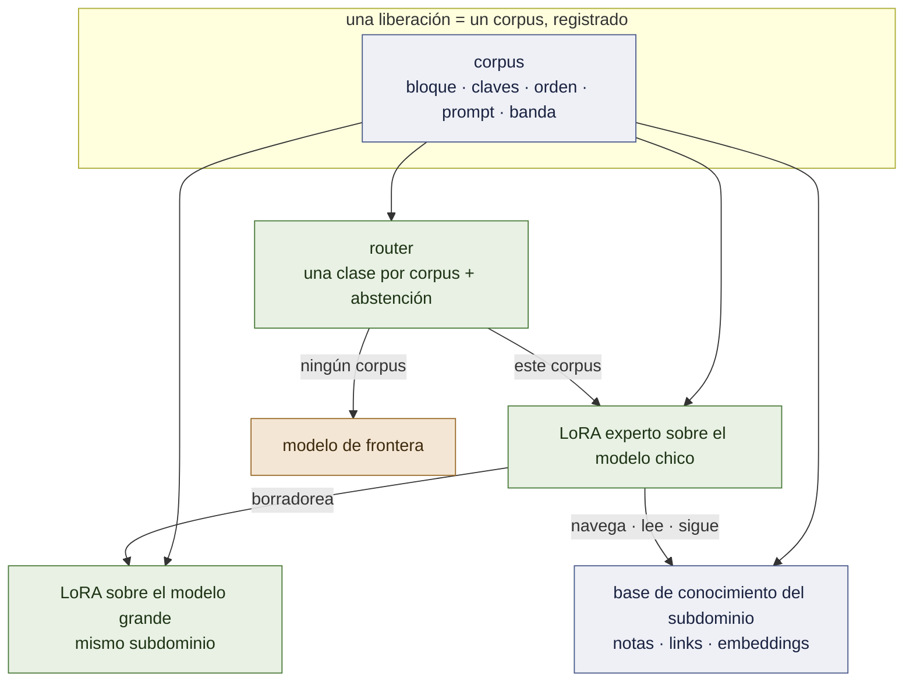
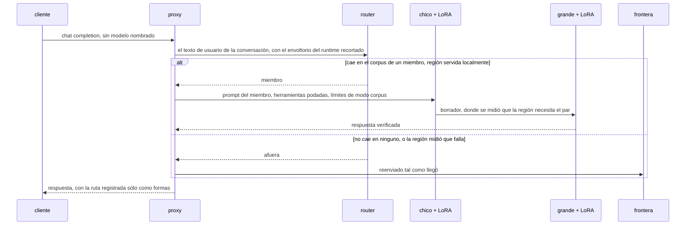
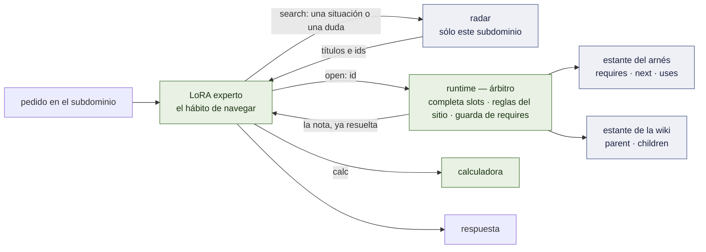
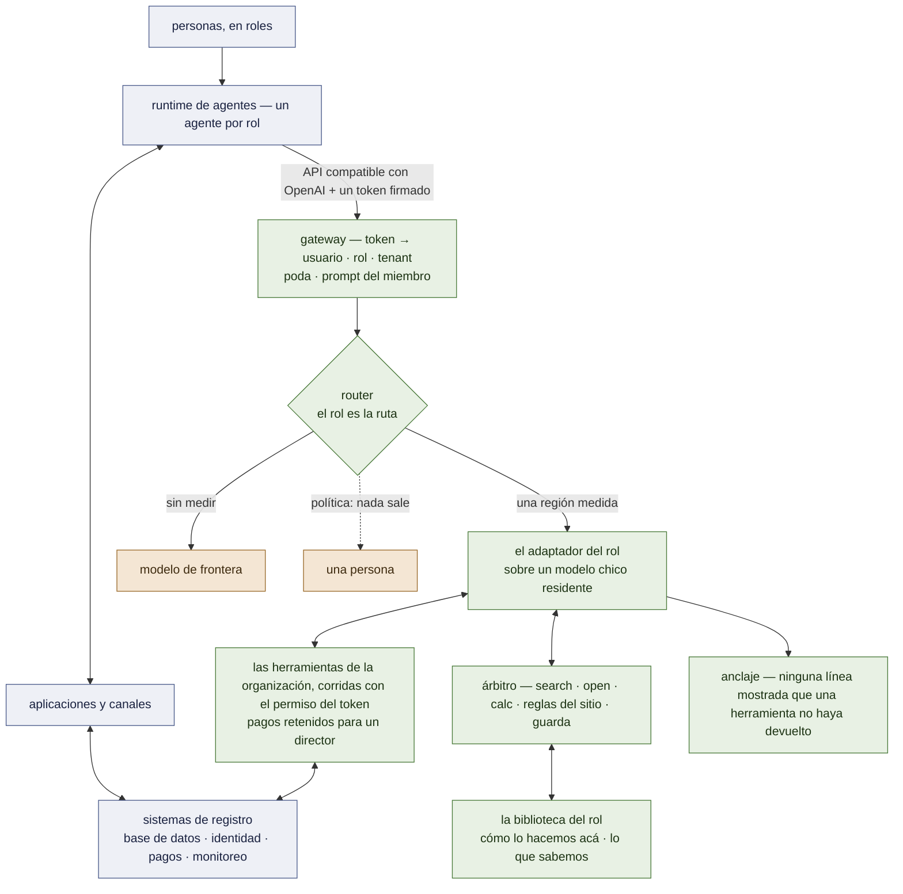

# Arquitectura

El sistema tal como está diseñado el 2026-09-19, estado al 2026-09-20. Lo que está construido y
medido lleva la marca **[ran]**; lo que está diseñado y no construido, lo dice. Dónde se ubica
dentro de una organización entera, y qué falta para que sea un framework genérico, está en el §9 y
en [`FRAMEWORK.md`](FRAMEWORK.md). Las mediciones detrás de cada elección están en
[`RECORD.md`](RECORD.md); el orden de trabajo está en [`PLAN.md`](PLAN.md).

## 1. Un hecho, cuatro componentes — y qué es la versión 1.0

**Un experto es la distribución de su corpus.** No sólo los pesos: el bloque de
herramientas, las claves del argumento y su orden, el system prompt, la profundidad de los
problemas que vio. Servido fuera de esa distribución es un modelo distinto, peor — 2 de 32
turnos en vivo llaman a una herramienta bajo un prompt ajeno, 19 de 32 bajo el propio
**[ran]** P63; un experto que razona en cadenas de 6 a 9 pasos puntúa 11 de 90 cuando los
resultados de sus herramientas le llegan como mensajes `tool_calls` y **90 de 90** cuando se
escriben en línea, como le enseñó su corpus **[ran]** M7 brazo 0b.

**La versión 1.0 es cinco cosas [spec]:** los expertos definidos por sus corpus, el router
con su abstención, la memoria (§4), el runtime que la arbitra, y el contrato de liberación
que la hashea toda. El par del §3 se acopla por subdominio donde se mide que paga y no es
requerido por 1.0.

Todo lo demás es ese hecho aplicado cuatro veces:

| componente | qué es | estado |
|---|---|---|
| **el experto** | un QLoRA sobre el modelo chico, entrenado por SFT sobre un corpus, liberado con un contrato que registra la distribución | **[ran]** dos liberados; desde M1 sobre `Qwen3.5-4B`, cada uno empatando su liberación de Qwen 2.5 |
| **el router** | un modelo muy chico *de los mismos corpus*: a la distribución de qué experto cae este pedido — o de ninguno | un diccionario de palabras clave **[ran]**; dos brazos aprendidos **[ran]** M2, ninguno pasa; en un despliegue con un agente por rol, *el rol es la ruta* (§9) |
| **el par** | un segundo LoRA, sobre el modelo grande, entrenado sobre el *mismo corpus*; el chico borradorea, el grande verifica | diseñado; hitos 3–4 |
| **la memoria** | la biblioteca propia del subdominio — un arnés operativo y una wiki enciclopédica — un radar sobre ella, tres verbos, y un árbitro; el LoRA aprende el **hábito de navegar**, no el contenido | biblioteca, árbitro, corpus construidos **[ran]** W1, W2, W4; búsqueda debajo de su vara **[ran]** W3; **la afirmación central medida tres veces y no pasa** **[ran]** W5, W5b, W5c — la navegación se transfiere, leer un valor condicional en una nota nunca vista no (§4) |

Un solo artefacto — el corpus nombrado en el manifiesto de la liberación — define al
experto, entrena su mitad grande, y entrena la clase del router para él. Agregar una región
agrega un corpus, y la base de conocimiento que las trayectorias de ese corpus recorren.

## 2. El camino del pedido

**El proxy** (`openai_proxy.py`) **[ran]**. Habla la API de OpenAI. Para un miembro poda las
herramientas ofrecidas a la superficie declarada del miembro (`--prune`), reemplaza el
system prompt del runtime por el que enseñó el corpus (`--member-prompt`), y corre el bucle
de modo corpus — la generación para en una etiqueta de cierre, se inyecta el resultado de la
herramienta, continúa — acotado a seis idas y vueltas y 256 tokens por paso, los límites que
tiene el propio corpus. Se rehúsa antes que servir mal: un pedido que no puede rutear es un
503, no una adivinanza.

**El router** lee el asunto de la conversación y nada más: cada turno de usuario, con el
envoltorio de contexto interno del runtime recortado — el propio system prompt de un
runtime superó en puntaje al email del turno de usuario la primera vez que un agente en vivo
llamó **[ran]** P63. Dos decisiones se mantienen separadas a propósito:

- *a qué distribución pertenece esto* — la del router, aprendida de los corpus. Su primer
  brazo aprendido, un modelo de n-gramas del marco de cada corpus, fue seguro sobre texto
  ajeno y perdió todos los pedidos de un remitente nunca visto **[ran]** M2; el diccionario
  se mantiene hasta que se mida el brazo de embeddings;
- *esa región se sirve localmente* — una tabla medida, `serve: local | out`. La tabla vale lo
  que valga la medición detrás: fluids estaba marcada *afuera* con un 11 de 90, que resultó
  ser el camino de servido — localmente, como le enseñaron, es 90 de 90 contra el 66 de la
  frontera **[ran]** M7 brazo 0b — y vuelve a pasar por la puerta de liberación antes de que
  la marca cambie.

**El default es la frontera.** Un modelo al que se le pide elegir siempre elige, así que la
abstención está diseñada de entrada y se mide primero (hito 2).

**Frente a las herramientas de una organización, el gateway [ran] 2026-09-25** (`examples/school/gateway.py`, el
camino de la organización de referencia). Lo que el proxy hace por un miembro, más las cuatro cosas que necesita un
sistema de agentes por rol y que un modelo no debe decidir:

| paso | qué hace | dónde vive, y por qué no en el modelo |
|---|---|---|
| **quién** | se verifica el token portador → usuario, rol, tenant; un rol pedido en `model: auto:<rol>` tiene que coincidir con él | `examples/common/tokens.py` (HS256 con un secreto de demo, en lugar del RS256/JWKS del proveedor de identidad — esa verificación no está construida) |
| **permiso** | cada herramienta corre con esa credencial; la fila de otro tenant se rechaza antes de leerla | la capa de herramientas (`examples/school/tools.py`) — 77 casos adversariales, 0 fugas **[ran]** |
| **una persona para lo que importa** | un pago o un mensaje a todas las familias queda RETENIDO; lo aprueba un director del mismo tenant, nunca la cuenta que lo pidió; después corre con el alcance de quien lo pidió | `examples/common/approvals.py` |
| **qué puede afirmar una respuesta** | cada ítem de una respuesta tiene que ocurrir en un resultado real de herramienta, o la respuesta se reemplaza por el texto propio de las herramientas; el texto con forma de instrucción encontrado en un registro se saca de lo que se muestra | `examples/common/grounding.py` — el LoRA del personal de la escuela inventó una línea de un listado de una herramienta el día de la demo; el filtro reemplazó 2 de 5 respuestas locales y el usuario no vio ninguna de las dos **[ran]** `results/DEMO-school-gemma-20260925` |
| **alcance** | un pedido que las herramientas del rol no cubren sigue la salida del rol: la frontera, o la cola de una persona | el modelo dice `OUT OF SCOPE`; la política decide adónde va — el juicio del modelo queda registrado, no se confía en él |
| **log** | una línea JSON por pedido — quién, rol, ruta, llamadas, rechazos, retenciones, anclaje, tokens — y un dashboard que tasa los tokens locales a las tarifas de la frontera | el feed de monitoreo; el costo propio de la GPU no se tasa |

## 3. El par

**Por qué la mitad grande está entrenada, no prestada.** Un modelo grande sin entrenar no es
mejor experto en una región angosta: 0,967 contra el 1,000 del experto chico en desk, 0,746
contra 0,989 en triage **[ran]** P55, P55b. La verificación por un modelo que discrepa con
un borrador *correcto* rechaza tokens buenos. Entrenar el modelo grande sobre el mismo
corpus es lo que lo vuelve un verificador de este subdominio en lugar de una segunda opinión
generalista.

**Lo que ya se sabe de las mitades.** vLLM aplica un LoRA sobre un modelo grande en 4 bits
**[ran]** P60 §3b. Los adaptadores de Qwen 3.5 son servibles una vez que sus tensores llevan
los nombres de la clase que vLLM sirve **[ran]** D2. Los modelos chico y grande de la
familia comparten un espacio de ids, así que un token drafteado *puede* verificarse
**[ran]** D0 — entre familias, o contra una API de frontera, no puede **[ran]** P48.

**Lo que todavía no está disponible.** La decodificación especulativa de vLLM no acepta un
drafter con adaptador LoRA; eso es un RFC **[read]**. Hasta que salga, la aceptación se mide
por teacher forcing — el modelo grande puntúa el borrador terminado del chico en un solo
prefill (`accept_rank.py`, [`FOUNDATIONS.md`](FOUNDATIONS.md) §5.3, §6) — lo que da α
exactamente y la aceleración nada. El par es primero un dispositivo de **calidad** (¿el
grande + LoRA le gana al chico + LoRA donde el chico tiene margen?) y después uno
**especulativo** (¿el LoRA emparejado sube α?).

**Dónde corre.** El pool chico se sirve desde una sola L4. Un 27B es trabajo de A100 en 4
bits.

## 4. La memoria — el núcleo de 1.0

> **El LoRA no es el libro de texto. Es el especialista que sabe usar la biblioteca.**

**Estado, 2026-09-25 [ran].** **La memoria funciona en su primer banco de pruebas.** En una wiki de
enunciados atómicos (más abajo), cuyos hechos ningún modelo puede saber, la base sin entrenar no
camina las preguntas de dos y tres saltos (0/40 sobre Qwen3.5-4B; nunca escribe un verbo después de
un resultado) y un LoRA de trayectoria entrenado sobre otros 32 mundos sí — 35/40 en las dos
semillas, cada cita verificada, 3-hop 16/16; sobre Gemma 4 E4B 38/40 (W9, B1). Antes de eso, sobre la
biblioteca de enfermería (W1–W5e), el resultado tenía dos mitades que siguen en pie: **la navegación
se transfiere** a un procedimiento que el adaptador nunca vio (42 : 0 contra el base sin entrenar
obligado a navegar), **leer un valor bajo una condición en una nota nunca vista no** (el base sin
entrenar la lee, 15/15; una partición por tipo de tarea empató, W5d; y dos sorteos de entrenamiento
de una misma receta discreparon en 25 de 67 filas, W5e — así que los miembros se entrenan sobre dos
semillas). La búsqueda con un encoder estándar llegó a recall@3 0,638 contra una vara de 0,80 (W3);
el buscador es léxico. ~~Estado, 2026-09-20 … evidencia de nada hasta que se corra sobre un conjunto
escrito después de congelar la política.~~

**La unidad de la biblioteca, desde el 2026-09-24: el enunciado atómico — [ran] W9, PASÓ.** El
diseño del usuario: la biblioteca tiene forma de Wikipedia. Una página es sobre una sola cosa y es una lista de
**enunciados atómicos** — una oración chequeable cada uno, bajo un ancla — y **el enunciado, no la
página, es la unidad de memoria**. Los enlaces viven dentro del enunciado que los nombra (el
`§supplier` de un producto es también el camino a la página del proveedor); las páginas operativas son
recetas cuyos enunciados son pasos y ramas, y un plan es la trayectoria que el contexto de la tarea
elige por ellos. `<open>id</open>` muestra las secciones de una página, `<open>id§anchor</open>` un
solo enunciado, y toda respuesta cita el enunciado en el que se apoya — una cita que el runtime
chequea mecánicamente, así que la memoria es su propio verificador. Primer banco de pruebas: una wiki
de distribuidora inventada cuyas páginas operativas siguen los roles de la organización de referencia
(compras, recepción, despacho, reclamos y devoluciones, comunicaciones con clientes, finanzas, RRHH,
marketing, IT), generada por mundo para que ningún valor se pueda saber de memoria; el base sin
entrenar se mide antes de comprar un LoRA de trayectoria ([`MEMORY.md`](MEMORY.md) §1.6).

Especificada pieza por pieza en [`MEMORY.md`](MEMORY.md) **[spec]**; argumentada, con sus
preguntas abiertas, en [`KNOWLEDGE-TRAJECTORIES.md`](KNOWLEDGE-TRAJECTORIES.md). Cinco piezas,
cuatro de ellas no neuronales:

| pieza | qué es | dónde vive |
|---|---|---|
| **la biblioteca** | notas en markdown de menos de media página, en dos estantes — y, desde W9 **[ran]**, páginas de enunciados atómicos con sus enlaces adentro, citadas por cada respuesta. **Arnés operativo** — *cómo se hace*: notas tipo receta cuyos links son control de flujo (`requires`, `next`, `uses`). **Wiki enciclopédica** — *qué es, qué fórmula aplica*: un árbol, de lo general a lo específico (`parent` → `children`) | `knowledge/<subdominio>/`, en git |
| **el radar** | embeddings comprimidos a un subdominio; por nota dos vectores, *para qué sirve* y *qué define*; devuelve las dos o tres notas exactas del subdominio en juego | un índice chico por subdominio |
| **el lenguaje** | tres verbos que el experto puede escribir — `<search>`, `<open>`, `<calc>` — cada uno respondido en línea después de su etiqueta de cierre | una gramática, versionada con la liberación |
| **el LoRA** | entrenado sobre el **hábito de navegar**: casos cuyas constantes cambian cada vez, así que el número hay que leerlo de la nota | el adaptador — la única pieza entrenada |
| **el runtime** | un pequeño árbitro en Python dentro del proxy: da vuelta las páginas, sustituye las reglas de un sitio antes de que el experto vea la nota, corta un recorrido que se salta un `requires` | `memory/` **[spec]**, sobre el mismo bucle de modo corpus que ya sirve a cada miembro |

> **[MARCADOR DE ILUSTRACIÓN — `docs/img/memory-five-pieces.png`]**
> *La misma imagen que en `MEMORY.md`: una biblioteca con dos estantes rotulados (una ruta de
> fichas arriba, un árbol de fichas abajo), un radar chico iluminando tres fichas, un
> especialista sosteniendo tres herramientas rotuladas `search`, `open`, `calc`, y debajo de
> ellas una banda rotulada "runtime — árbitro" con una página siendo dada vuelta, un sello
> "regla del sitio aplicada" y una barrera que dice "requires paso 1".*

**Por qué es un harness.** Un harness de agente clásico mantiene tres cosas fundidas: el
procedimiento en el system prompt, el bucle en código escrito a mano, y la esperanza de que el
modelo obedezca. Acá están separadas. El procedimiento es el estante del arnés — *texto
editable*. El bucle son los links — *frontmatter editable*, reforzado por el árbitro donde
importa. Y ya no se espera la obediencia: es lo único que entrena el adaptador. Esto es lo que
`harness.lora` buscaba — un adaptador de protocolo compartido compuesto con adaptadores de
dominio, parado cuando la composición no se pudo medir limpiamente — ahora por subdominio, y
con su contenido afuera de los pesos.

**Tres mediciones fuerzan la separación en vez de sólo sugerirla.** Un modelo chico no sigue un
procedimiento que sólo lee — base + documento, 0 llamadas a herramientas sobre 351/351 **[ran]**
P61 — así que seguir es lo que se entrena. El conocimiento fijo en un corpus se memoriza y
después no cuesta nada — un control sin herramienta de búsqueda puntuó 27/30 sobre catorce
valores **[ran]** P15, P21 — así que lo que un caso necesita se sortea por caso y se entrega
sólo a través de los slots de una nota. Y un especialista se equivoca con confianza un paso
fuera de su región — 30/30 adentro, 1/20 en familias hermanas **[ran]** P14 — que es el
headroom y la apuesta: *las notas de la hermana extienden la región sin reentrenar.* Esa apuesta
está sin probar.

**Lo que ya se sabe que funciona** es el canal: un experto sí usa un resultado escrito en línea
después de su etiqueta — 90 de 90 en cadenas de seis a nueve llamadas a herramientas **[ran]**
M7 brazo 0b — y la memoria entrega cada nota exactamente por ese canal.

**Lo que no se asume.** Que una jerarquía le gane a una búsqueda plana — en la memoria de este
workspace le perdió a la búsqueda léxica en un benchmark anterior, y el índice dual de
`evolving-memory` no cambió nada **[read]** — o que comprimir el radar a una dimensión chica no
cueste nada. Los dos son brazos con una línea base plana.

## 5. El contrato de liberación

Una región entra por una sola puerta **[ran]**: una suite con un verificador que el bucle de
entrenamiento nunca ve; la base pelada como brazo de headroom; el test de signos exacto
sobre pares discordantes. El manifiesto que resulta (`releases/*.json`) guarda base, receta,
hash del corpus, hash del adaptador, hash del prompt, el score y las comparaciones pareadas.
Volver a servirlo y volver a entrenar desde él empatan con la corrida registrada **[ran]**
P57. `training/harness/train_pool.py` guarda cada miembro como un registro leído de su
corpus — banda, superficie, claves, orden, system prompt — y los tests vuelven a leer cada
corpus y fallan si una declaración se desvía. Con el hito 7 el manifiesto gana el hash de la
base de conocimiento y el hash de su índice: un miembro es su corpus *y* su base.

## 6. La familia

**Gemma 4, desde 2026-09-25 — la decisión del usuario sobre B1 [ran].** `google/gemma-4-E4B-it` chico;
`gemma-4-31B-it` nombrado como la mitad grande de un par y **no medido**. En el wiki de W9, con el mismo corpus y
la misma receta, el miembro de Gemma empató al de Qwen3.5-4B (38/40 contra 35 y 35, 4 : 1 contra cada uno); sin
entrenar, Gemma ya la camina 19/40 donde Qwen camina 0/40, y entrena en un tercio del tiempo. El usuario decidió
antes de que corriera la comparación que la paridad elige a Gemma, porque el stack de desarrollo apunta a ella. Le
vienen dos restricciones de ingeniería: el LoRA excluye las torres de visión y audio, cuyas proyecciones son
`Gemma4ClippableLinear` (el bloqueo de P29, y nada más —
`training/s4_train.py::towers_to_exclude`); y su canal de pensamiento queda apagado para los miembros, como el de
Qwen.

**Los miembros liberados se mueven de a uno por la compuerta de release:** `email-full@v3` está sobre Gemma (M1b **[ran]**:
empate con `@v2`, 119 : 0 sobre el Gemma pelado); `desk-commitment@v3` también, entrenado en las dos bandas de desk (M1d **[ran]**: banda profunda 239/240
contra 83 del Gemma pelado); `distributor-wiki@v1` sobre Gemma; los releases `@v1` sobre `Qwen2.5-3B-Instruct` quedan
como brazo de control. La familia se nombra en un solo lugar, `training/harness/family.py`. ~~Qwen 3.x:
`Qwen3.5-4B` chico, `Qwen3.8-27B` grande … Gemma 4 cumple el requisito de espacio de ids y todavía no el de
PEFT **[ran]** P29.~~

Nada en §1–§5 nombra una familia. Un par necesita un espacio de ids y una base a la que PEFT pueda engancharse;
Gemma 4 E4B ahora cumple lo segundo **[ran]** B1; si comparte espacio de ids con 31B es la primera verificación
del hito 3.

## 7. Lo que no es neuronal, a propósito

- **La memoria y el conocimiento** son markdown y git; un índice de embeddings se deriva de
  ellos, nunca es la fuente.
- **La ejecución** es un sandbox; las herramientas son un servidor MCP
  (`training/mcp/inbox_server.py`).
- **La aritmética** es una calculadora: la destilación transfirió un procedimiento y no la
  aritmética **[ran]** P5–P7.
- **Si una región se sirve localmente** es una tabla de mediciones, no la opinión de un
  modelo.

## 8. Deliberadamente sin construir

Un runtime de inferencia a medida, compartir la caché KV entre adaptadores, tree attention
entre adaptadores, composición de adaptadores, un torneo que los cría, el control plane, los
packs verticales. Y, por alcance más que por orden: el servicio de personalización y sus
herramientas no son parte de este runtime ni de la versión open-source.

## 9. Dónde se ubica dentro de una organización — y el límite del framework

El despliegue al que apunta esto es una organización que funciona con **un agente por rol**:
personas en unos pocos roles; un runtime de agentes con un agente por rol; las aplicaciones que esos
agentes operan (agenda, administración); los canales que la gente ya usa (una app, mensajería
dividida en una audiencia externa y una interna); y una base de datos relacional con identidad, pagos
y monitoreo al lado. lora-kernel es **una sola capa debajo de la columna de agentes** y no reemplaza
nada arriba ni abajo:

**Los registros quedan en la base, los hábitos van en el adaptador, el conocimiento queda en notas
que una persona puede leer y corregir.** Tres consecuencias para el diseño:

- **El rol dice cuál miembro — no si corresponde.** El runtime ya sabe de qué agente vino un mensaje,
  y el rol viaja en el id del modelo (`auto:<rol>`). **[ran]** F2: con el rol *confirmado por las
  claves propias del miembro* nunca hay más mal ruteados que con las claves solas, nada se sirve bajo
  un rol equivocado, y el replay de 240 casos empata en 0,775; es el default del proxy. La política
  que dejaba decidir al rol solo sirvió 120 de 120 tareas ajenas y falló. Así que la mitad del
  problema abierto del router se fue — *cuál* — y la mitad queda: *si este pedido está en la región*.
- **La unidad es un paquete de rol, no un adaptador.** Superficie de herramientas, prompt, corpus,
  biblioteca, suites, y dos políticas: *quién escribe qué tipo de respuesta* (la partición del §4) y
  *qué puede salir* (frontera, una persona, o nada). **[ran]** F3: `roles/<rol>/role.toml`, cada línea
  chequeada contra su artefacto por `rolepack.lint`; los dos miembros liberados re-expresados con el
  prompt y el bloque de herramientas servidos idénticos byte a byte, los registros derivables e
  iguales. El código todavía no lee los paquetes, y el miembro de la memoria declara un loop — el del
  árbitro — que la API no puede servir.
- **El modelo nunca tiene una credencial.** Las herramientas llegan a los sistemas de registro
  *como la persona que pregunta*; el permiso lo chequea la herramienta, fuera del modelo, y cada
  acción queda registrada. **[spec]** — nada de esta capa existe, y ningún experto acá fue medido
  ejecutando una escritura.

Qué existe, qué falta y el orden para construirlo — trece brechas, ocho interfaces, siete pasos,
cada uno con el resultado que lo detendría — está en [`FRAMEWORK.md`](FRAMEWORK.md). La línea de
alcance del §8 no se mueve: el framework es el runtime, los formatos, las compuertas y paquetes de
rol *de referencia* sobre datos generados; los corpus de un cliente y la canalización de trazas a
liberación no están en este repositorio.

**Leído contra una arquitectura pegada, 2026-09-20.** Un plan de cinco fases — un centro educativo y
una distribuidora bajo un solo kernel, decodificación especulativa, seguridad a nivel de fila de
Postgres detrás de Auth0, Docker Compose — llegó pegado a una sesión y se chequeó contra la tabla de
brechas de arriba: la mayor parte ya estaba construida (paquetes de rol, F3), ya secuenciada más
adelante (concurrencia, la factura, instalación), o bloqueada (un drafter con LoRA es un RFC de
vLLM, no una función). Una brecha que nombró correctamente y este repositorio no había cerrado —
permiso reforzado fuera del modelo, no pedido al modelo — se vuelve el paso siguiente, acotado a
**un** dominio neutral, no dos, con un almacén de juguete en lugar de Auth0/Postgres RLS hasta que se
muestre insuficiente, con compuerta a **0 fugas** sobre una suite adversarial. `W5d` — la partición
lectura/escritura que necesita la política de respuesta de un rol — corre primero: es más barato y el
paso siguiente ya declara una política sin valor medido. Lectura completa, fase por fase:
[`FRAMEWORK.md`](FRAMEWORK.md) §9; la entrada del plan: [`PLAN.md`](PLAN.md) §0.

**La mitad de sólo código ya está construida [ran] 2026-09-21** (`examples/`): `school/`, el caso
principal nombrado por el propio usuario, con los siete roles que dibuja el diagrama de referencia —
`dev`, `trainee`, `marketing`, `educador`, `compras`, `cfo`, `it` — trece herramientas, dos
inquilinos, una suite adversarial a **0 fugas**, los servidores MCP de los dos dominios registrados y
verificados con `mcp probe` contra una instancia real de OpenClaw. Lo que todavía falta es la mitad
del lado del modelo del falsificador — si un *modelo* alguna vez intenta la llamada entre inquilinos,
necesita una cuenta detrás de un turno de OpenClaw, todavía no corrido — y cualquier corpus o
adaptador — nada acá entrena. El primer número del hito 6 también aterrizó el mismo día: tasar el
replay existente de P41/P62 a las tarifas reales de `google/gemini-3.8-flash` pone la factura real de
hoy hacia la frontera, por el 37,5 % que sale, en **$0,18** — una fracción de dólar a esta escala, y el
costo de la propia GPU es la única entrada que sigue sin tasar, nombrada en vez de adivinada
(`docs/PLAN.md` hito 6, `results/M6-bill-20260921/`).
