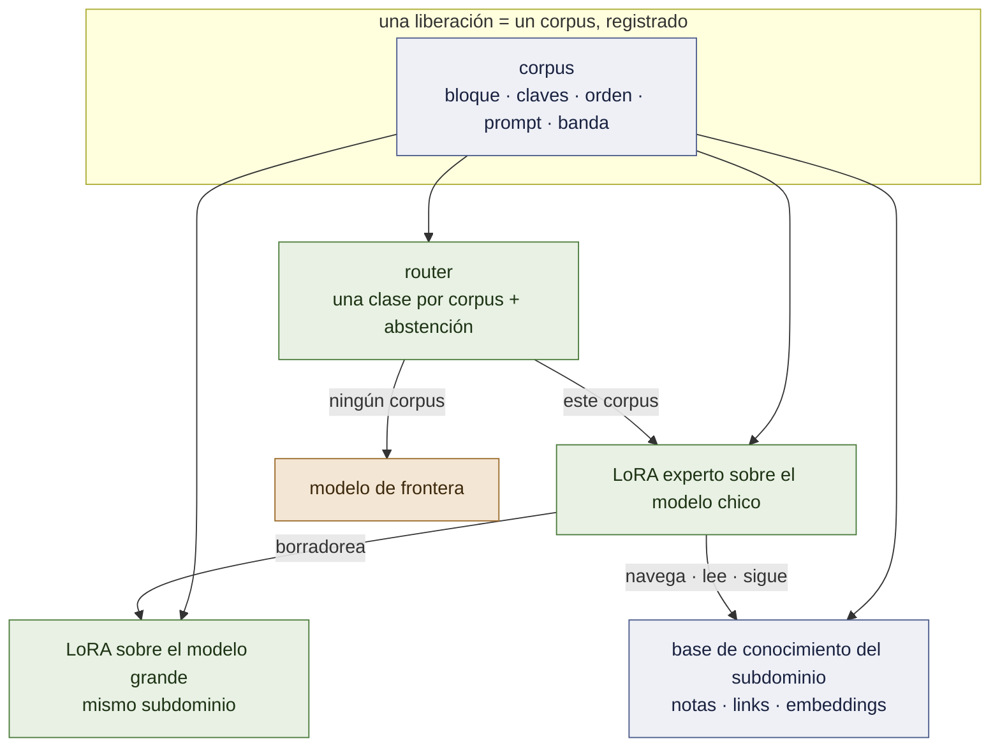
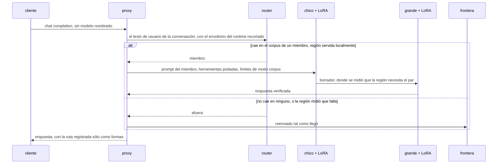
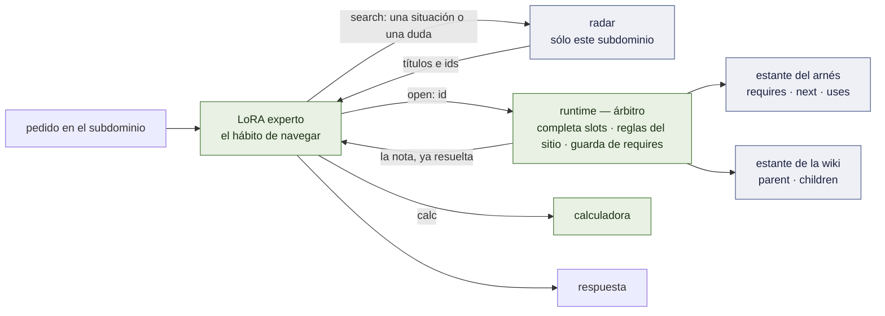
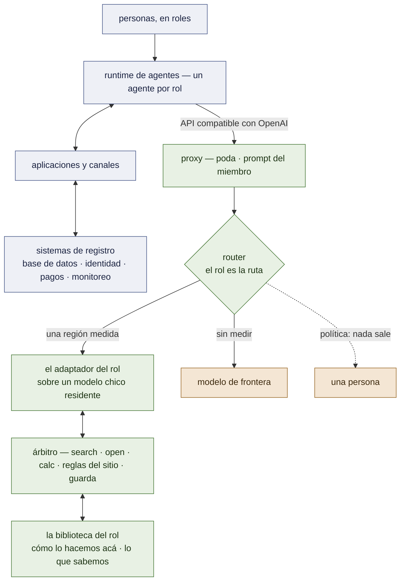

# Arquitectura

El sistema tal como está diseñado el 2026-09-19, estado al 2026-09-20. Lo que está construido y
medido lleva la marca **[ran]**; lo que está diseñado y no construido, lo dice. Dónde se ubica
dentro de una organización entera, y qué falta para que sea un framework genérico, está en el §9 y
en [`FRAMEWORK.md`](FRAMEWORK.md). Las mediciones detrás de cada elección están en
[`RECORD.md`](RECORD.md); el orden de trabajo está en [`PLAN.md`](PLAN.md).

## 1. Un hecho, cuatro componentes — y qué es la versión 1.0

**Un experto es la distribución de su corpus.** No sólo los pesos: el bloque de
herramientas, las claves del argumento y su orden, el system prompt, la profundidad de los
problemas que vio. Servido fuera de esa distribución es un modelo distinto, peor — 2 de 32
turnos en vivo llaman a una herramienta bajo un prompt ajeno, 19 de 32 bajo el propio
**[ran]** P63; un experto que razona en cadenas de 6 a 9 pasos puntúa 11 de 90 cuando los
resultados de sus herramientas le llegan como mensajes `tool_calls` y **90 de 90** cuando se
escriben en línea, como le enseñó su corpus **[ran]** M7 brazo 0b.

**La versión 1.0 es cinco cosas [spec]:** los expertos definidos por sus corpus, el router
con su abstención, la memoria (§4), el runtime que la arbitra, y el contrato de liberación
que la hashea toda. El par del §3 se acopla por subdominio donde se mide que paga y no es
requerido por 1.0.

Todo lo demás es ese hecho aplicado cuatro veces:

| componente | qué es | estado |
|---|---|---|
| **el experto** | un QLoRA sobre el modelo chico, entrenado por SFT sobre un corpus, liberado con un contrato que registra la distribución | **[ran]** dos liberados; desde M1 sobre `Qwen3.5-4B`, cada uno empatando su liberación de Qwen 2.5 |
| **el router** | un modelo muy chico *de los mismos corpus*: a la distribución de qué experto cae este pedido — o de ninguno | un diccionario de palabras clave **[ran]**; dos brazos aprendidos **[ran]** M2, ninguno pasa; en un despliegue con un agente por rol, *el rol es la ruta* (§9) |
| **el par** | un segundo LoRA, sobre el modelo grande, entrenado sobre el *mismo corpus*; el chico borradorea, el grande verifica | diseñado; hitos 3–4 |
| **la memoria** | la biblioteca propia del subdominio — un arnés operativo y una wiki enciclopédica — un radar sobre ella, tres verbos, y un árbitro; el LoRA aprende el **hábito de navegar**, no el contenido | biblioteca, árbitro, corpus construidos **[ran]** W1, W2, W4; búsqueda debajo de su vara **[ran]** W3; **la afirmación central medida tres veces y no pasa** **[ran]** W5, W5b, W5c — la navegación se transfiere, leer un valor condicional en una nota nunca vista no (§4) |

Un solo artefacto — el corpus nombrado en el manifiesto de la liberación — define al
experto, entrena su mitad grande, y entrena la clase del router para él. Agregar una región
agrega un corpus, y la base de conocimiento que las trayectorias de ese corpus recorren.

## 2. El camino del pedido

**El proxy** (`openai_proxy.py`) **[ran]**. Habla la API de OpenAI. Para un miembro poda las
herramientas ofrecidas a la superficie declarada del miembro (`--prune`), reemplaza el
system prompt del runtime por el que enseñó el corpus (`--member-prompt`), y corre el bucle
de modo corpus — la generación para en una etiqueta de cierre, se inyecta el resultado de la
herramienta, continúa — acotado a seis idas y vueltas y 256 tokens por paso, los límites que
tiene el propio corpus. Se rehúsa antes que servir mal: un pedido que no puede rutear es un
503, no una adivinanza.

**El router** lee el asunto de la conversación y nada más: cada turno de usuario, con el
envoltorio de contexto interno del runtime recortado — el propio system prompt de un
runtime superó en puntaje al email del turno de usuario la primera vez que un agente en vivo
llamó **[ran]** P63. Dos decisiones se mantienen separadas a propósito:

- *a qué distribución pertenece esto* — la del router, aprendida de los corpus. Su primer
  brazo aprendido, un modelo de n-gramas del marco de cada corpus, fue seguro sobre texto
  ajeno y perdió todos los pedidos de un remitente nunca visto **[ran]** M2; el diccionario
  se mantiene hasta que se mida el brazo de embeddings;
- *esa región se sirve localmente* — una tabla medida, `serve: local | out`. La tabla vale lo
  que valga la medición detrás: fluids estaba marcada *afuera* con un 11 de 90, que resultó
  ser el camino de servido — localmente, como le enseñaron, es 90 de 90 contra el 66 de la
  frontera **[ran]** M7 brazo 0b — y vuelve a pasar por la puerta de liberación antes de que
  la marca cambie.

**El default es la frontera.** Un modelo al que se le pide elegir siempre elige, así que la
abstención está diseñada de entrada y se mide primero (hito 2).

## 3. El par

**Por qué la mitad grande está entrenada, no prestada.** Un modelo grande sin entrenar no es
mejor experto en una región angosta: 0,967 contra el 1,000 del experto chico en desk, 0,746
contra 0,989 en triage **[ran]** P55, P55b. La verificación por un modelo que discrepa con
un borrador *correcto* rechaza tokens buenos. Entrenar el modelo grande sobre el mismo
corpus es lo que lo vuelve un verificador de este subdominio en lugar de una segunda opinión
generalista.

**Lo que ya se sabe de las mitades.** vLLM aplica un LoRA sobre un modelo grande en 4 bits
**[ran]** P60 §3b. Los adaptadores de Qwen 3.5 son servibles una vez que sus tensores llevan
los nombres de la clase que vLLM sirve **[ran]** D2. Los modelos chico y grande de la
familia comparten un espacio de ids, así que un token drafteado *puede* verificarse
**[ran]** D0 — entre familias, o contra una API de frontera, no puede **[ran]** P48.

**Lo que todavía no está disponible.** La decodificación especulativa de vLLM no acepta un
drafter con adaptador LoRA; eso es un RFC **[read]**. Hasta que salga, la aceptación se mide
por teacher forcing — el modelo grande puntúa el borrador terminado del chico en un solo
prefill (`accept_rank.py`, [`FOUNDATIONS.md`](FOUNDATIONS.md) §5.3, §6) — lo que da α
exactamente y la aceleración nada. El par es primero un dispositivo de **calidad** (¿el
grande + LoRA le gana al chico + LoRA donde el chico tiene margen?) y después uno
**especulativo** (¿el LoRA emparejado sube α?).

**Dónde corre.** El pool chico se sirve desde una sola L4. Un 27B es trabajo de A100 en 4
bits.

## 4. La memoria — el núcleo de 1.0

> **El LoRA no es el libro de texto. Es el especialista que sabe usar la biblioteca.**

**Estado, 2026-09-20 [ran].** El formato de la biblioteca, el lint, la primera biblioteca (W1), el
árbitro (W2) y el corpus de recorridos (W4) están construidos y pasan sus compuertas. La búsqueda con
un encoder estándar llega a recall@3 0,638 contra una vara de 0,80 (W3). El brazo que mata (W5) se
corrió tres veces sobre un procedimiento que el adaptador nunca entrenó, y **no pasa**: el adaptador
empata o pierde contra el base *sin entrenar* con las notas correctas delante (35 contra 45 de 56;
42 contra 46 de 66). Leído donde ocurre, el resultado tiene dos mitades. **La navegación se
transfiere**: 42 : 0 contra el base sin entrenar obligado a navegar, 22/22 en filas de línea
compartida donde el base leyendo las notas correctas saca 8/22, 0 fallos de recuperación. **Una
habilidad de lectura no se transfiere**: preguntado un valor dado bajo una condición en una nota
nunca vista, el adaptador escribe el primer número — 0/11, y 4/15 tras un corpus que mostró la forma
sobre ocho notas (17/18 sobre esas ocho; el base sin entrenar 15/15). Dejar que el base escriba cada
línea final recupera esas y pierde 19 casos de control (W5b), así que no es un diseño de servido. Lo
que queda abierto es una **partición por tipo de tarea** — el adaptador lleva los procedimientos, el
base lee los valores de lo que abrió el recorrido del adaptador — que es 47/56 sobre registros ya
pagados y evidencia de nada hasta que se corra sobre un conjunto escrito después de congelar la
política.

Especificada pieza por pieza en [`MEMORY.md`](MEMORY.md) **[spec]**; argumentada, con sus
preguntas abiertas, en [`KNOWLEDGE-TRAJECTORIES.md`](KNOWLEDGE-TRAJECTORIES.md). Cinco piezas,
cuatro de ellas no neuronales:

| pieza | qué es | dónde vive |
|---|---|---|
| **la biblioteca** | notas en markdown de menos de media página, en dos estantes. **Arnés operativo** — *cómo se hace*: notas tipo receta cuyos links son control de flujo (`requires`, `next`, `uses`). **Wiki enciclopédica** — *qué es, qué fórmula aplica*: un árbol, de lo general a lo específico (`parent` → `children`) | `knowledge/<subdominio>/`, en git |
| **el radar** | embeddings comprimidos a un subdominio; por nota dos vectores, *para qué sirve* y *qué define*; devuelve las dos o tres notas exactas del subdominio en juego | un índice chico por subdominio |
| **el lenguaje** | tres verbos que el experto puede escribir — `<search>`, `<open>`, `<calc>` — cada uno respondido en línea después de su etiqueta de cierre | una gramática, versionada con la liberación |
| **el LoRA** | entrenado sobre el **hábito de navegar**: casos cuyas constantes cambian cada vez, así que el número hay que leerlo de la nota | el adaptador — la única pieza entrenada |
| **el runtime** | un pequeño árbitro en Python dentro del proxy: da vuelta las páginas, sustituye las reglas de un sitio antes de que el experto vea la nota, corta un recorrido que se salta un `requires` | `memory/` **[spec]**, sobre el mismo bucle de modo corpus que ya sirve a cada miembro |

> **[MARCADOR DE ILUSTRACIÓN — `docs/img/memory-five-pieces.png`]**
> *La misma imagen que en `MEMORY.md`: una biblioteca con dos estantes rotulados (una ruta de
> fichas arriba, un árbol de fichas abajo), un radar chico iluminando tres fichas, un
> especialista sosteniendo tres herramientas rotuladas `search`, `open`, `calc`, y debajo de
> ellas una banda rotulada "runtime — árbitro" con una página siendo dada vuelta, un sello
> "regla del sitio aplicada" y una barrera que dice "requires paso 1".*

**Por qué es un harness.** Un harness de agente clásico mantiene tres cosas fundidas: el
procedimiento en el system prompt, el bucle en código escrito a mano, y la esperanza de que el
modelo obedezca. Acá están separadas. El procedimiento es el estante del arnés — *texto
editable*. El bucle son los links — *frontmatter editable*, reforzado por el árbitro donde
importa. Y ya no se espera la obediencia: es lo único que entrena el adaptador. Esto es lo que
`harness.lora` buscaba — un adaptador de protocolo compartido compuesto con adaptadores de
dominio, parado cuando la composición no se pudo medir limpiamente — ahora por subdominio, y
con su contenido afuera de los pesos.

**Tres mediciones fuerzan la separación en vez de sólo sugerirla.** Un modelo chico no sigue un
procedimiento que sólo lee — base + documento, 0 llamadas a herramientas sobre 351/351 **[ran]**
P61 — así que seguir es lo que se entrena. El conocimiento fijo en un corpus se memoriza y
después no cuesta nada — un control sin herramienta de búsqueda puntuó 27/30 sobre catorce
valores **[ran]** P15, P21 — así que lo que un caso necesita se sortea por caso y se entrega
sólo a través de los slots de una nota. Y un especialista se equivoca con confianza un paso
fuera de su región — 30/30 adentro, 1/20 en familias hermanas **[ran]** P14 — que es el
headroom y la apuesta: *las notas de la hermana extienden la región sin reentrenar.* Esa apuesta
está sin probar.

**Lo que ya se sabe que funciona** es el canal: un experto sí usa un resultado escrito en línea
después de su etiqueta — 90 de 90 en cadenas de seis a nueve llamadas a herramientas **[ran]**
M7 brazo 0b — y la memoria entrega cada nota exactamente por ese canal.

**Lo que no se asume.** Que una jerarquía le gane a una búsqueda plana — en la memoria de este
workspace le perdió a la búsqueda léxica en un benchmark anterior, y el índice dual de
`evolving-memory` no cambió nada **[read]** — o que comprimir el radar a una dimensión chica no
cueste nada. Los dos son brazos con una línea base plana.

## 5. El contrato de liberación

Una región entra por una sola puerta **[ran]**: una suite con un verificador que el bucle de
entrenamiento nunca ve; la base pelada como brazo de headroom; el test de signos exacto
sobre pares discordantes. El manifiesto que resulta (`releases/*.json`) guarda base, receta,
hash del corpus, hash del adaptador, hash del prompt, el score y las comparaciones pareadas.
Volver a servirlo y volver a entrenar desde él empatan con la corrida registrada **[ran]**
P57. `training/harness/train_pool.py` guarda cada miembro como un registro leído de su
corpus — banda, superficie, claves, orden, system prompt — y los tests vuelven a leer cada
corpus y fallan si una declaración se desvía. Con el hito 7 el manifiesto gana el hash de la
base de conocimiento y el hash de su índice: un miembro es su corpus *y* su base.

## 6. La familia

Qwen 3.x: `Qwen3.5-4B` (o `2B`) chico, `Qwen3.8-27B` grande. La línea 3.x es híbrida — tres
capas de atención lineal por cada capa de atención completa — y el adaptador renombrado de
D2 aterrizó pesos en los dos tipos. Su canal `<think>` queda apagado para los miembros. **Los miembros
liberados están sobre `Qwen3.5-4B` desde el hito 1 [ran]** — reentrenados desde los mismos corpus,
cada uno empatando a su release de Qwen 2.5 (471/475, 240/240); los releases `@v1` sobre 2.5 quedan
como control.

Nada en §1–§5 nombra una familia. Un par necesita un espacio de ids y una base a la que PEFT
pueda engancharse; `Gemma 4 2B / 12B` cumple lo primero y todavía no lo segundo **[ran]**
P29.

## 7. Lo que no es neuronal, a propósito

- **La memoria y el conocimiento** son markdown y git; un índice de embeddings se deriva de
  ellos, nunca es la fuente.
- **La ejecución** es un sandbox; las herramientas son un servidor MCP
  (`training/mcp/inbox_server.py`).
- **La aritmética** es una calculadora: la destilación transfirió un procedimiento y no la
  aritmética **[ran]** P5–P7.
- **Si una región se sirve localmente** es una tabla de mediciones, no la opinión de un
  modelo.

## 8. Deliberadamente sin construir

Un runtime de inferencia a medida, compartir la caché KV entre adaptadores, tree attention
entre adaptadores, composición de adaptadores, un torneo que los cría, el control plane, los
packs verticales. Y, por alcance más que por orden: el servicio de personalización y sus
herramientas no son parte de este runtime ni de la versión open-source.

## 9. Dónde se ubica dentro de una organización — y el límite del framework

El despliegue al que apunta esto es una organización que funciona con **un agente por rol**:
personas en unos pocos roles; un runtime de agentes con un agente por rol; las aplicaciones que esos
agentes operan (agenda, administración); los canales que la gente ya usa (una app, mensajería
dividida en una audiencia externa y una interna); y una base de datos relacional con identidad, pagos
y monitoreo al lado. lora-kernel es **una sola capa debajo de la columna de agentes** y no reemplaza
nada arriba ni abajo:

**Los registros quedan en la base, los hábitos van en el adaptador, el conocimiento queda en notas
que una persona puede leer y corregir.** Tres consecuencias para el diseño:

- **El rol es la ruta.** El runtime ya sabe de qué agente, grupo o canal vino un mensaje; el
  problema abierto del router (dos brazos aprendidos pierden todo pedido de un remitente no visto
  **[ran]** M2) se esquiva en vez de resolverse. **[spec]** — hoy el proxy rutea según qué se
  pregunta.
- **La unidad es un paquete de rol, no un adaptador.** Superficie de herramientas, prompt, corpus,
  biblioteca, suites, y dos políticas: *quién escribe qué tipo de respuesta* (la partición del §4) y
  *qué puede salir* (frontera, una persona, o nada). **[spec]** — hoy esto está repartido entre
  `train_pool.POOL`, `route.REGIONS`, los generadores y los flags del proxy.
- **El modelo nunca tiene una credencial.** Las herramientas llegan a los sistemas de registro
  *como la persona que pregunta*; el permiso lo chequea la herramienta, fuera del modelo, y cada
  acción queda registrada. **[spec]** — nada de esta capa existe, y ningún experto acá fue medido
  ejecutando una escritura.

Qué existe, qué falta y el orden para construirlo — trece brechas, ocho interfaces, siete pasos,
cada uno con el resultado que lo detendría — está en [`FRAMEWORK.md`](FRAMEWORK.md). La línea de
alcance del §8 no se mueve: el framework es el runtime, los formatos, las compuertas y paquetes de
rol *de referencia* sobre datos generados; los corpus de un cliente y la canalización de trazas a
liberación no están en este repositorio.
