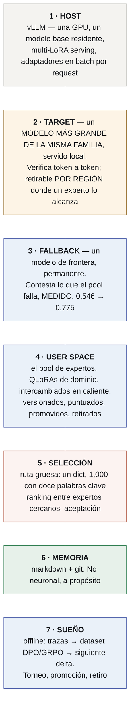

# Arquitectura

> **Para el stack concreto — qué base, qué targets, qué adaptadores a qué rank,
> qué flags de vLLM — ver [`STACK.md`](STACK.md).**

> **Especificación.** Nada de acá está construido. Escrito para que se lo discuta
> antes de construirlo, que sale más barato.
>
> *[Read this in English](../ARCHITECTURE.md)*

---

## 1. El stack



**Las capas 3, 4 y 7 producen sólo adaptadores. La capa 6 produce sólo texto. La
capa 1 es el runtime de otro.** Ése es el sistema entero — y la capa 5 está
dibujada como la única caja abierta a propósito, porque llamar "especulativo" al
router antes de que exista la superficie de α sería asumir el resultado.

## 2. Por qué el target tiene que ser más grande — y por qué no puede ser una API de frontera

La propiedad que hace funcionar esto no es una nota al pie: **bajo muestreo por
rechazo los tokens emitidos se distribuyen exactamente como los habría emitido el
target** **[read]**. Así que el target define qué significa "correcto", y todo lo demás
es una pregunta sobre costo.

Por eso el target tiene que ser **mejor que los expertos** — y por eso, durante toda
la vida de este documento, "mejor" se leyó como "frontera".

**Esa lectura era incorrecta, y no es cuestión de grado.** Una API de frontera no
puede ser target especulativo **en absoluto**:

- no devuelve los logprobs de una continuación **forzada** (C2), así que no hay contra
  qué verificar;
- no comparte el tokenizer de la base (C3), así que un id drafteado no significa la
  misma cadena para los dos modelos.

Medido y no argumentado **[ran]** `results/P48-tokenizer-compat-20260916/`:

| target candidato | vocab | ¿sirve? |
|---|---:|---|
| `Qwen2.5-7B / 14B / 32B / 72B-Instruct` | 151.643 | **sí — `tokenizer.json` byte-idéntico** |
| `Qwen3-14B`, `Qwen3-32B` | 151.643 | sí, con 4 ids que sólo el target tiene |
| `Qwen3.5 / 3.6 / 3.8-27B` — *con el drafter Qwen 2.5* | **248.044** | **no — otro vocabulario; lo que se mueve es el drafter** |
| **`Qwen3.8-27B` con un drafter `Qwen3.5-2B / 4B` — el objetivo** | 248.044 | **sí**, 7 ids sólo del target de audio/TTS **[ran]** D0 |

**Así que el target es `Qwen2.5-32B-Instruct-AWQ`** — 19,3 GB, entra al lado del 3B en
una A100, y su `tokenizer.json` hashea igual que el de la base. Un modelo de frontera
conserva otro trabajo, en la capa 3, donde es permanente.

### Y el target no es lo que hace rápido a esto

La decodificación especulativa tiene **dos** propósitos y este proyecto reclamaba los
dos. Para **latencia** gana una cabeza de drafting entrenada sobre los estados ocultos
del propio target, y existe una para exactamente este target **[read]**. Nuestros
expertos de dominio nunca le van a ganar en eso, porque ella no tiene otro trabajo.

**Lo que no puede hacer es rankear.** Hay una cabeza por target, así que no hay entre
qué elegir. **La aceptación como ranking sin juez sobre k expertos es la afirmación
que sobrevive**, y es lo único que esta arquitectura tiene y una cabeza EAGLE no.

## 3. El retiro — del target, por región, y no de la frontera

~~El modelo de frontera es andamio, y el diseño dice cuándo sacarlo.~~

**Reformulado el 2026-09-15 y otra vez el 2026-09-16, las dos por medición.** La
frontera no es andamio: es el fallback para lo que el pool falla, *medido*, y mandarle
un subdominio que falla llevó la entrega de **0,546 a 0,775** con el 38% de los casos
saliendo de la máquina **[ran]** `results/P41-routing-20260915/`.

**Lo que significa retirar ahora es más barato y más honesto.** Donde la aceptación de
un experto contra el 32B local es suficientemente alta, **el 32B sale para esa región**
y el experto genera solo. La frontera se queda donde está, contestando las regiones que
ningún experto cubre.

**La aceptación sola no lo autoriza.** Un rechazo es el chico equivocándose o el grande
equivocándose, y sólo un verificador sobre los mismos casos los separa — por eso la
suite donde se mide esto tiene uno, y por eso los pisos tipo `carries()` van **al lado**
de la aceptación y no detrás.

**El orden que se sigue de eso.** La fase A sirve el target y acumula, por región, con
qué experto sigue coincidiendo. La fase B saca el target donde ese número cruzó un
umbral **y el score verificado aguantó**. Dos condiciones, no una.

## 4. Composición — descartada, y qué la reemplazó

~~El kernel y el experto son adaptadores distintos y tienen que seguir siéndolo.~~

**Descartada el 2026-09-15, por medición.** Dos resultados la cerraron:

- **La interferencia aparente de P8 era nula** por un confound de notación — los brazos
  nunca fueron comparables.
- **P35 midió lo que cuesta partir una capacidad.** Enseñado el vocabulario de
  herramientas aparte del dominio, el vocabulario se aprendió y la *disposición* se
  perdió: pedir cayó de **123 de 150 casos a 22** **[ran]**.

Y `harness.lora` perdió su propio caso en el camino: un protocolo aprendido sacó
**9/30** donde veinte líneas de `re` sacaron **23/30**, porque esa suite tenía una sola
herramienta y pedirla era copiar una expresión ya escrita **[ran]** P13.

**Lo que la reemplazó: expertos autocontenidos.** Cada adaptador lleva su propia
disposición a buscar herramientas, en el vocabulario con el que va a ser servido.
`contract.py` lo vuelve declarable — un miembro declara la **banda** que le enseñó su
corpus, porque un experto servido fuera de ella no simplifica: **sobre-resuelve**. Por
debajo de su banda `fluids-full` inventó un área en **18 de 18** casos y la base pelada
le ganó a tres pasos, 0,167 contra 0,000 **[ran]** P45.

**Y encadenar no cuesta nada si alguna vez se quiere la composición de vuelta.**
`base→lora1` y después `base→lora2` nunca tiene dos deltas vivos en el mismo forward,
así que la pregunta por la interferencia no aparece — y el pool ya sirve esa forma. Son
dos pedidos con dos nombres de modelo.

## 5. El torneo

Por tarea ejecutada:

```
score = w₁ · éxito verificado de la tarea
      + w₂ · α (contra el target de frontera)
      − w₃ · tokens consumidos
```

- **`w₁` tiene que venir de un verificador que el bucle no pueda ver.** Si no, el
  bucle cría adaptadores que adulan a su propio evaluador, y la medición más
  fuerte que tiene esta organización es que el mismo procedimiento fue
  *compensación de interfaz* en un modelo y *ganancia persistente* en otro. **[read]**
- **`w₂` sólo tiene sentido mientras el target sea de frontera.** Después del
  retiro mide coincidencia con un par, y hay que reponderarlo o descartarlo.
- **Offline, siempre.** Un torneo que corre en línea cambia aquello que mide.

Promoción, retiro y cruza son commits: `agentvcs` versiona el adaptador junto con
las trazas y el objetivo que lo produjeron, así que una regresión es diffeable y
reversible.

## 6. Lo que no es neuronal, y por qué eso no es estética

**La memoria es markdown bajo git.** Un delta de pesos no se puede leer, diffear,
citar ni corregir, y no se lo puede señalar en una auditoría. Toda medición que
tiene esta organización sobre memoria dice que el activo durable es la parte que
una persona puede leer.

**La ejecución es un sandbox.** Las herramientas corren como procesos.

**La verificación es un verificador**, nunca la opinión del modelo sobre sí mismo,
y su fuerza — exacta, determinista, estadística, humana, juez — se registra con
cada resultado.

## 7. Orden de trabajo

~~E0 headroom · E1 la superficie de α contra un target de frontera · E2 retiro ·
E3 `harness.lora` · E4 el torneo~~

**Reestructurado el 2026-09-16.** E1 suponía un target de frontera, que no puede
verificar tokens; el adaptador de E3 perdió contra veinte líneas de `re`. Lo reemplazan
cuatro sesiones, cada una capaz de terminar lo que sigue.

| | | termina la línea si |
|---|---|---|
| **S1** | **perfilar** base y target sobre el grid región × profundidad; la banda donde la base no está ni en el piso ni en el techo se elige **una vez** | la base está arriba de 0,70 en todo, abajo de 0,15 en todo, o el target falla la mayoría de las celdas |
| **S2** | **entrenar los expertos** — cada uno con conversaciones que **generó el target para su propia región**, no de un oráculo | — |
| **S3** | **el ranking**: aceptación por experto y región, con el score verificado al lado | la aceptación no ordena a los expertos como los ordena el verificador |
| **S4** | **reserva** — tres de las últimas corridas murieron o quedaron nulas | — |

**Dos reglas de las que depende el orden.** La banda se elige una vez y no se revisa,
sea cual sea el resultado de un tratamiento posterior — elegirla dos veces es el
instrumento buscando un resultado. Y **ningún brazo puntúa nada antes de que un
preflight pruebe que llega a sus herramientas**: el primer intento de P51 devolvió HTTP
400 en los 240 casos e imprimió `correct 0 calls 0 refused 0`, que es lo que parece un
piso **[ran]**.

**Antes de todo eso, la suite pasa `training/suite_gates.py`** o sus números no son
evidencia. Las cuatro suites que este proyecto midió antes fallan al menos una **[ran]**
`results/P50-suite-audit-20260916/`.

## 8. Deliberadamente sin construir todavía

- **Tree attention entre adaptadores.** El problema del KV cache es la parte cara
  y sólo vale la pena resolverlo cuando E1 diga que las ramas valen la
  comparación.
- **Diez verticales, marketplace de adaptadores, control plane.** Río abajo de E2.
- **Un runtime de inferencia propio.** vLLM es el sustrato. Necesitar uno propio
  sería un hallazgo, no un plan.

## La matemática de cada capa

Cada capa de arriba es una fórmula con una corrida debajo; las derivaciones están en
[`FOUNDATIONS.md`](FOUNDATIONS.md) y acá se repite sólo el enunciado.

| capa | qué es, como matemática | el número debajo |
|---|---|---|
| **1 · HOST** | un $\theta$ residente; un pedido con adaptador $i$ calcula $y = xW + s\,(xA_i)B_i$ por proyección, batcheado entre pedidos por id de adaptador (§5.2) | compuerta de identidad C18: `applied` en `Qwen2.5-3B`, idéntico en `Qwen3.5-4B` **[ran]** P33; `applied` 6/8 sondas **[ran]** P55 A |
| **2 · TARGET** | verifica un draft en una pasada con teacher forcing; a $T=0$ acepta $\tilde x_i$ sii $\tilde x_i = \arg\max p_T(\cdot\mid\text{prefijo},\tilde x_{<i})$ (§6.3); una pasada de verificación cuesta una lectura de pesos por $k+1$ posiciones (§2.3) | mismo espacio de ids que la base: tokenizer byte-idéntico **[ran]** P48; `prompt_logprobs` devuelve el rango por token **[ran]** P55 A |
| **3 · FALLBACK** | fuera de la matemática de la aceptación a propósito: sin logprobs para una continuación forzada (C2), sin ids compartidos (C3) — contesta, nunca verifica | ruteo por región 0,546 → 0,775 **[ran]** P41 |
| **4 · USER SPACE** | cada miembro es $\Delta_i = \tfrac{\alpha}{r}A_iB_i$ sobre las siete proyecciones de cada bloque (§4.1); 29.933.568 parámetros cada uno (§4.2) | 119.801.528 bytes por adaptador **[ran]** `STACK.md` §3 |
| **5 · SELECTION** | gruesa: una tabla; fina: $\arg\max_i \alpha_T(E_i, c)$ — válida sólo cuando $Q(T)\ge\max_i Q(E_i)$ (§7.2) | la precondición falló en triage, $0,746 < 0,989$ **[ran]** P55 A; sin medir en otro lado |
| **6 · MEMORY** | no neuronal; sin fórmula, por diseño | — |
| **7 · DREAM** | el fitness del torneo es un test de signos pareado sobre casos discordantes (§9.2), nunca dos totales | 84/81/82 fueron tres empates **[ran]** P36/P38/P40 |

**La condición de retiro, formalmente.** La capa 2 es retirable en una región $R$
cuando el experto solo iguala el puntaje verificado que alcanza con la verificación del
target: $Q_R(E) \ge Q_R(E \mid T) - \varepsilon$ en un test pareado. Medido una vez, en
región, con una calculadora en lugar del target: brecha **0,000** **[ran]** S5 — nunca
todavía con aceptación, porque la aceptación nunca se midió (§11 de FOUNDATIONS).
