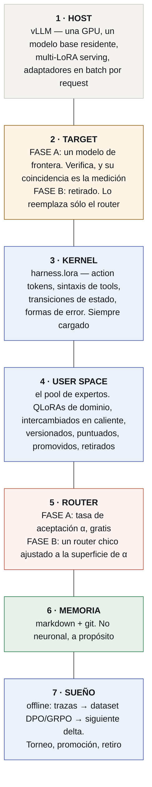

# Arquitectura

> **Especificación.** Nada de acá está construido. Escrito para que se lo discuta
> antes de construirlo, que sale más barato.
>
> *[Read this in English](../ARCHITECTURE.md)*

---

## 1. El stack



**Las capas 3, 4 y 7 producen sólo adaptadores. La capa 6 produce sólo texto. La
capa 1 es el runtime de otro.** Ése es el sistema entero — y la capa 5 está
dibujada como la única caja abierta a propósito, porque llamar "especulativo" al
router antes de que exista la superficie de α sería asumir el resultado.

## 2. Por qué el target tiene que ser de frontera

La decodificación especulativa emite la distribución del *target*. Así que lo que
mide la tasa de aceptación es **la coincidencia con lo que hayas elegido para
verificar**, y esa elección decide qué significa el número:

| target | qué te dice una α alta |
|---|---|
| el modelo base compartido | este experto se alejó menos de la base — *anticorrelacionado con la especialización* |
| **un modelo de frontera** | **este experto ya produce lo que produciría la frontera, acá** |

El segundo es una puntuación de destilación. Ése es el diseño.

Es la única regla que mantiene coherente la arquitectura, y es por eso que la
frontera no es una optimización sino un componente: **sacala en la Fase A y el
router está midiendo otra cosa.**

## 3. El retiro de la frontera

La frontera es andamio con una condición de retiro declarada.

**Fase A.** Los expertos borradorean, la frontera verifica, α se acumula por
experto y por región del problema. El costo es de frontera; la calidad es de
frontera; la medición es gratis.

**Fase B.** Para una región donde la α de un experto cruzó el umbral, se lo
promueve de drafter a generador, se retira la frontera, y el router elige. El
costo colapsa a inferencia local.

**El umbral es una decisión de producto, tomada sobre una superficie medida.**
¿Cuánta coincidencia con la frontera exigís antes de que un experto conteste
solo? Por región. Registrado, revisable y reversible — una región puede volver a
Fase A cuando su puntaje verificado baja.

**El número que decide toda la arquitectura** es la brecha de retiro: el puntaje
verificado de tarea después del retiro, menos el que tenía la frontera. Hacer
chica esa brecha *es* el proyecto.

## 4. Composición — kernel más experto

El kernel y el experto son adaptadores distintos y tienen que seguir siéndolo.

- `harness.lora` es dueño de **cómo actuar**: action tokens, sintaxis de tools,
  estado.
- un adaptador de dominio es dueño de **qué es cierto** en su región.

Fusionarlos obligaría a cada adaptador de dominio a re-aprender el protocolo, que
es justo el costo que este diseño existe para eliminar. Servirlos juntos es una
cuestión de composición multi-adaptador y se trata en
[`TECHNICAL-REFERENCE.md` §5](TECHNICAL-REFERENCE.md).

## 5. El torneo

Por tarea ejecutada:

```
score = w₁ · éxito verificado de la tarea
      + w₂ · α (contra el target de frontera)
      − w₃ · tokens consumidos
```

- **`w₁` tiene que venir de un verificador que el bucle no pueda ver.** Si no, el
  bucle cría adaptadores que adulan a su propio evaluador, y la medición más
  fuerte que tiene esta organización es que el mismo procedimiento fue
  *compensación de interfaz* en un modelo y *ganancia persistente* en otro. **[read]**
- **`w₂` sólo tiene sentido mientras el target sea de frontera.** Después del
  retiro mide coincidencia con un par, y hay que reponderarlo o descartarlo.
- **Offline, siempre.** Un torneo que corre en línea cambia aquello que mide.

Promoción, retiro y cruza son commits: `agentvcs` versiona el adaptador junto con
las trazas y el objetivo que lo produjeron, así que una regresión es diffeable y
reversible.

## 6. Lo que no es neuronal, y por qué eso no es estética

**La memoria es markdown bajo git.** Un delta de pesos no se puede leer, diffear,
citar ni corregir, y no se lo puede señalar en una auditoría. Toda medición que
tiene esta organización sobre memoria dice que el activo durable es la parte que
una persona puede leer.

**La ejecución es un sandbox.** Las herramientas corren como procesos.

**La verificación es un verificador**, nunca la opinión del modelo sobre sí mismo,
y su fuerza — exacta, determinista, estadística, humana, juez — se registra con
cada resultado.

## 7. Orden de trabajo

| | | condiciona |
|---|---|---|
| **E0** | headroom sobre la base sola | todo |
| **E1** | la superficie de α: 2 expertos, 1 target de frontera | E2 |
| **E2** | retiro: promover, sacar la frontera, medir la brecha | el producto |
| **E3** | `harness.lora` contra el baseline de −85% de schema | el kernel |
| **E4** | el torneo, con un verificador retenido | la evolución |

## 8. Deliberadamente sin construir todavía

- **Tree attention entre adaptadores.** El problema del KV cache es la parte cara
  y sólo vale la pena resolverlo cuando E1 diga que las ramas valen la
  comparación.
- **Diez verticales, marketplace de adaptadores, control plane.** Río abajo de E2.
- **Un runtime de inferencia propio.** vLLM es el sustrato. Necesitar uno propio
  sería un hallazgo, no un plan.
