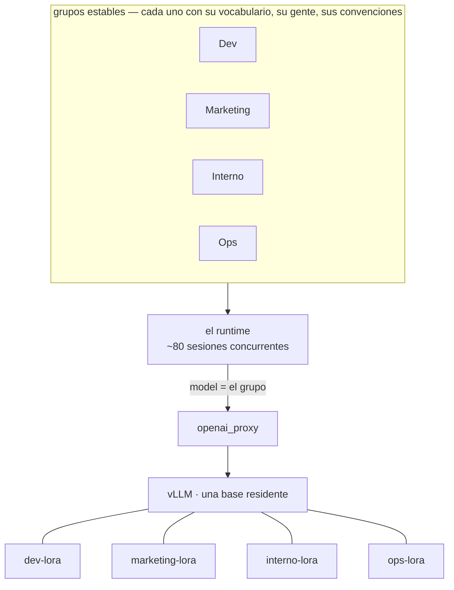
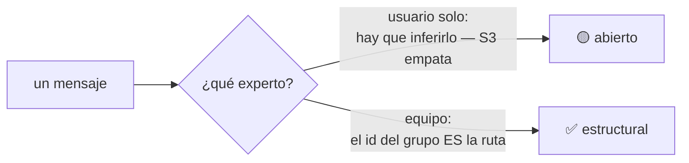
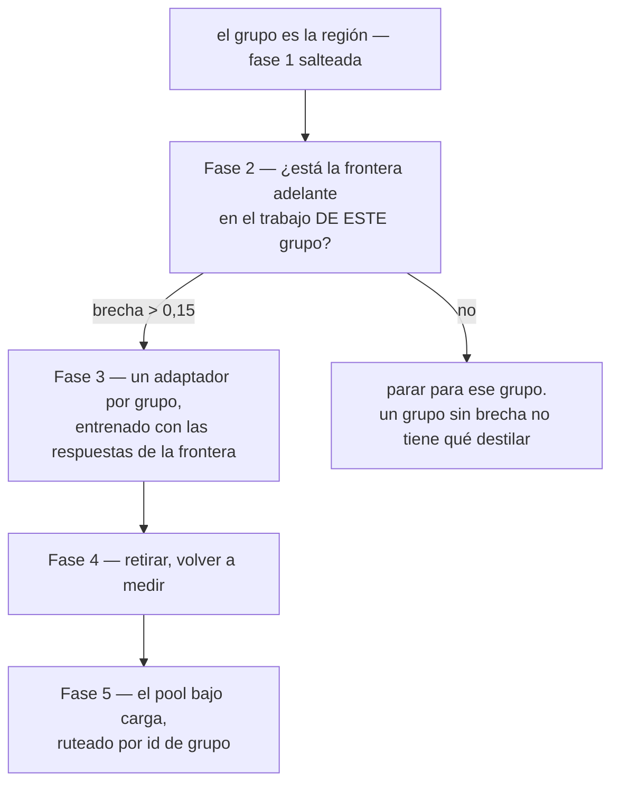

# Un segundo caso: muchos grupos, una GPU, y la región que no hay que buscar

[`CASE-TRIAGE.md`](CASE-TRIAGE.md) toma la tarea repetida de una persona y ejercita el
pool con **un** adaptador por vez. Éste es su complemento: un equipo corriendo un
runtime de agentes en modo multijugador — cada empleado en el chat, varios agentes,
decenas de sesiones concurrentes, y las conversaciones organizadas en grupos estables.

Está escrito a partir de un despliegue descrito públicamente, sin la persona ni la
organización. **Lo que importa acá es la forma, no quién lo corre.**

## Por qué la forma encaja mejor que la de un usuario solo

Un usuario solo haciendo trabajo variado **no tiene región**, y toda la afirmación de
la arquitectura es que un experto chico le gana a un generalista *dentro* de una —
el 0,000 de S5 se midió en región, y ese mismo experto cae **30/30 → 1/20** afuera. Un
grupo estable es una región por construcción: se repite, tiene vocabulario propio, y
su composición es estable.

**Así que la pregunta que `null_arm` existe para contestar ya está contestada por la
estructura.** Para una persona hacen falta dos semanas de tráfico para saber si hay
región. Acá el grupo *es* la región, y la fase 1 del plan de triage se saltea.

## Disuelve el problema que no pudimos resolver

S3 está en ámbar desde que se escribió: **el router empata con una tabla de
búsqueda.** No encontramos material donde inferir el experto correcto le gane a
buscarlo.

En este despliegue eso no es un problema a vencer — **es un problema que no aparece.**
El id del grupo *es* la ruta. No hay nada que inferir, porque el cliente ya sabe en
qué sala está.

Un contexto que elimina un problema abierto vale más que uno que mejora un número.

## Y es el primer caso que ejercita el pool como pool

Todo lo medido hasta ahora sirvió **un** adaptador por vez, o dos en una prueba de
throughput cuyos brazos no hacían el mismo trabajo. Decenas de sesiones concurrentes
ruteadas a expertos distintos es la afirmación económica de la arquitectura siendo
ejercitada en vez de argumentada:

| pregunta | nuestro estado | qué aporta este despliegue |
|---|---|---|
| ¿se puede servir un pool? | **S8 ✅** — cada adaptador su nombre de modelo, verificado | nada hace falta |
| ¿cuánto cuesta un batch mixto? | **sin medir** — dos corridas midieron longitud de salida, no ruteo | tráfico real alternando grupos, con el mismo trabajo de los dos lados |
| ¿escala el swap por request? | **no descalificado**, que es todo lo que podemos decir | ~80 sesiones es la prueba |

**La pregunta del costo del pool se arregla sola acá.** Nuestros dos intentos
compararon un batch sólo-kernel contra uno mixto, y el kernel escribe 476 caracteres
donde el dominio escribe 338 — así que la medición la dominó la longitud de salida
**[ran]** `results/P26-openai-server-20260913/`. Con grupos reales el tráfico es el
mismo tipo de trabajo de los dos lados, y el confound desaparece gratis.

## El orden, y es más corto que el de triage

**La fase 2 es por grupo, no por despliegue.** Algunos grupos van a tener una brecha
que valga destilar y otros no, y un promedio de todo el equipo escondería las dos
cosas. Es la compuerta de S1 — la que falló tres veces antes de encontrar una suite
donde la frontera estuviera genuinamente adelante — aplicada una vez por región en vez
de una vez por proyecto.

## Lo que no tenemos, y sería bloqueante a escala de equipo

| | estado |
|---|---|
| **aislamiento multi-tenant** — una clave, un upstream, sin separación por usuario | no construido |
| **streaming** — rechazado a propósito: una etiqueta recién es llamada cuando cierra | no construido |
| **ciclo de vida del adaptador por grupo** — entrenar, promover, retirar | no construido |
| **privacidad** — `openclaw_traffic` guarda formas, nunca prompts | **construido**, y a escala de equipo importa más, no menos |

## Para qué sirve honestamente este caso

Es la mitad del **modelo** de un despliegue así, no la mitad de la infraestructura.
Ataca *"le pagamos a una API por cada agente de cada empleado"* y *"el agente de
Marketing debería saber cómo habla Marketing"*. **No ataca un websocket que se cae, un
sidebar que se llena de sesiones, ni un gateway detrás de un proxy** — y una lectura de
este documento que sugiera lo contrario es una lectura equivocada.
