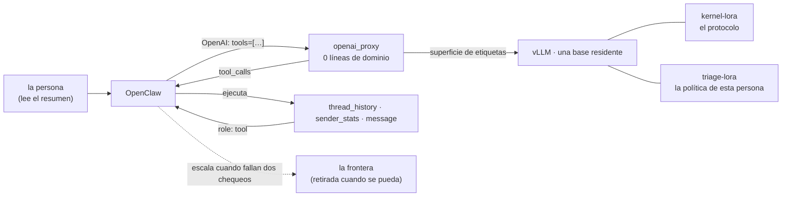
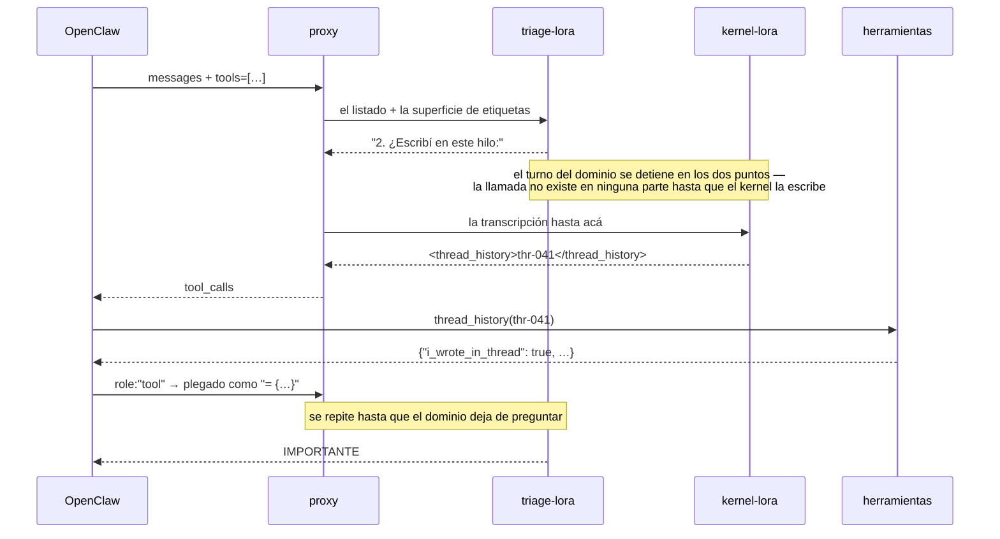
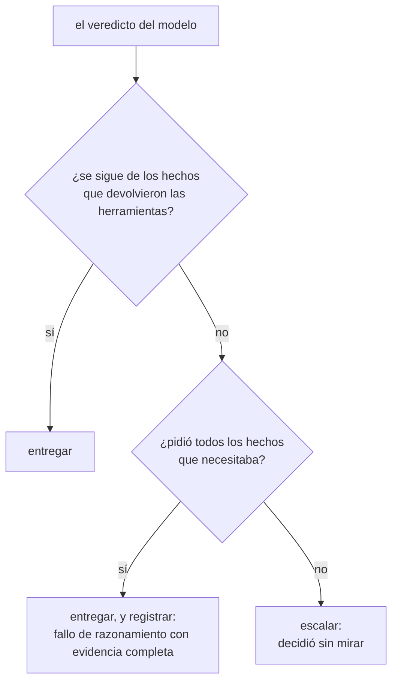
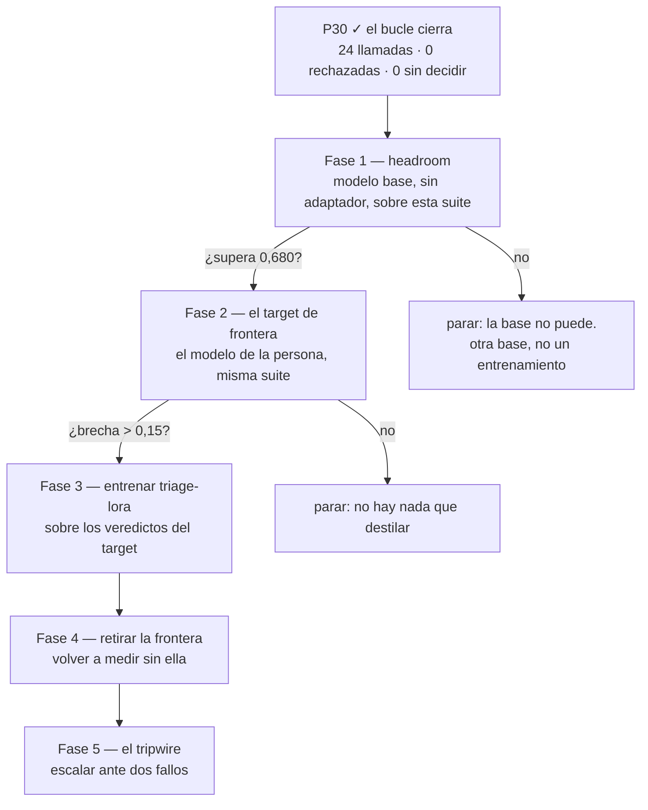

# De punta a punta: el triage matutino como prueba de todo lo que construyó lora-kernel

Esto es un diseño, no un reporte. Toma el triage diario del correo de una persona y
pregunta cuáles de los mecanismos **medidos** de este proyecto ejercita, cuáles no
puede, y en qué orden averiguarlo. Toda afirmación de abajo que lleva un número está
ligada al paso que lo produjo; lo demás es un plan y lo dice.

## Por qué este caso y no una demo

La arquitectura paga sólo donde hay una **región** — una tarea estrecha repetida a
diario. El triage lo es, y agrega algo que la mecánica de fluidos nunca tuvo:

> **la respuesta correcta es verificable mecánicamente.**

`inbox.important()` son cuatro condiciones sobre hechos que devuelven las
herramientas. Dados los hechos, el veredicto es un cálculo. **Eso es un verificador
sin juez**, y es lo que al torneo de S7 le falta desde el día que se escribió.

## La forma

Dos procesos y un pool. El proxy no conoce dominio — **0 de 38 líneas nombran una
herramienta o un tema**, afirmado por un test — y los adaptadores se intercambian con
el campo `model` de una petición HTTP.

## Un mensaje, una conversación

Turnarse es el resultado de P13, no una decisión de diseño: **apilar los dos
adaptadores no funcionó y turnarse sí**, y que el turno del dominio se detenga en los
dos puntos es lo que hace que la llamada sea del kernel y no una copia **[ran]**
`results/P13-sequential-20260910/`.

## Qué ejercita este caso, y qué no puede

| mecanismo | medido en | ¿el triage lo ejercita? | cómo |
|---|---|---|---|
| separación protocolo / dominio | S6 — 94/96 contra 93/96 de una regla | **sí** | la política es el dominio, las llamadas el kernel |
| activación secuencial | P13 — 0,6 → 4,7 llamadas por caso | **sí** | el bucle de arriba |
| valores que no se pueden memorizar | P21 — control sin herramientas 27/30 → 6/30 | **sí, gratis** | un inbox distinto cada día |
| etiquetas → `tool_calls` | P27 — 0 líneas de dominio, 604/604 | **sí** | el proxy, sin cambios |
| la convención de aridad | P28 — rechazos 88 → 17 | **sí** | las tres herramientas toman un parámetro |
| la máscara gramatical | P24 — rechazos 23 → 10, cobertura igual | **sí** | mismo sampler, otras etiquetas |
| una brecha de retiro | S5 — 1,000 contra 0,467 en región | **por medir** | el target es el modelo de frontera de la persona |
| el acuerdo ordena expertos | S2 — 6/6 pares | **por medir** | acuerdo sobre el veredicto, no sobre la prosa |
| un fitness sin oráculo | P20 — conjunción 2/2 | **reemplazado por algo mejor** | el veredicto es computable desde los hechos |
| el tripwire dimensional | P22 — 0 falsas alarmas en región | **no** | acá no hay unidades |
| el repair walk | P7 — 1/30 → 30/30 | **como análogo** | recomputar el veredicto desde los hechos devueltos |
| el router | S3 — empata con una tabla | **no** | un adaptador, elegido por el cliente |

**Dos de los doce no transfieren, y quedan nombrados en vez de descartados en
silencio.** La guardia dimensional es física; el router no tiene qué rutear.

## La escalada, que sí sobrevive al cambio de dominio

El resultado usable de P22 no fue el chequeo dimensional en sí — fue la **forma**:
escalar sólo cuando fallan dos chequeos ciegos en lugares distintos. Acá los dos
están disponibles y uno es exacto:

La rama izquierda es `important()` corrido sobre lo que las herramientas realmente
devolvieron — un **chequeo mecánico**, no un modelo. La derecha es cobertura: ¿llamó a
las herramientas que la definición necesita? **Dos fallos antes de escalar** es la
conjunción de P22, que nunca se disparó dentro de la región —0 de 60— y aun así
atrapaba un tercio del trabajo de afuera **[ran]**.

## Las fases, y la compuerta de cada una

**La fase 1 es el brazo que puede matar y se compra primero.** Si un 3B con
herramientas no supera 0,680 en esta suite, ningún adaptador encima lo va a hacer, y
la respuesta honesta es otra base. Este proyecto ya reportó dos veces un tratamiento
que no podía funcionar porque la línea base estaba en el techo; **el piso cuesta
exactamente lo mismo**.

**La compuerta de la fase 2 es la que S1 falló tres veces.** Una brecha de retiro
necesita de dónde caer: si el modelo de frontera de la persona no está claramente
adelante en su propio correo, no hay nada que destilar y el paso se detiene ahí en vez
de seguir para medir un empate.

## Qué no afirma este diseño

- **Ningún adaptador entrenado corrió sobre esta suite.** P30 probó la plomería con un
  stub; toda fila marcada *por medir* es un plan.
- **La definición de importancia es inventada.** Es una política plausible, no la de
  esta persona. Un despliegue real la reemplaza por la suya — y que sea una sola
  función es lo que hace que eso sea un cambio de una línea.
- **Un inbox simulado no es un inbox.** Se construyó para que el listado no lo pueda
  responder (una regla que sólo lee el listado saca **0,680 contra una barra de
  0,680** **[ran]**), que es la propiedad que lo hace una prueba justa — y el correo
  real puede ser más fácil, más difícil, o simplemente distinto.
