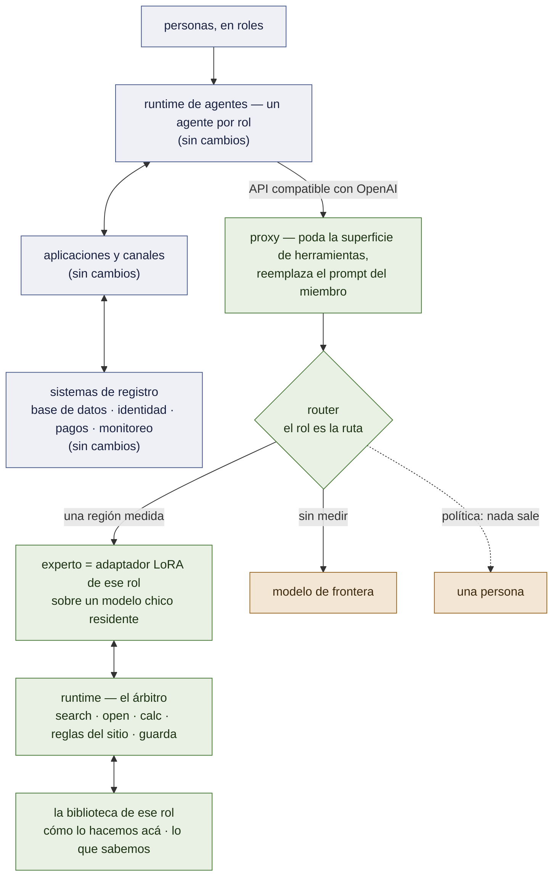

# De un runtime medido a un framework genérico — estado y brechas

*Escrito el 2026-09-20 para leerse solo, y para que lo revisen otros modelos. Responde tres
preguntas: qué funciona hoy, qué hay que hacer funcionar, y qué falta para que lora-kernel sea un
**framework genérico** para un tipo de despliegue — una organización que funciona con un agente por
rol. Cada afirmación lleva una marca: **[ran]** observada ejecutando algo en este repositorio, con la
corrida nombrada; **[read]** inferida del código fuente o de la documentación; **[spec]** diseñada,
no construida. Los números vienen de [`RECORD.md`](RECORD.md); nada acá es una medición nueva.*

---

## 1. El objetivo: una organización que funciona con un agente por rol

El despliegue de referencia es la forma hacia la que convergen las organizaciones chicas **[read]**.
Sus capas:

| capa | qué contiene, en el despliegue de referencia |
|---|---|
| **personas** | cuatro tipos de usuario: socios (adultos y niños), visitantes, educadores, empleados |
| **sistema de agentes** | un runtime de agentes (OpenClaw) con **un agente por rol**: dev, aprendiz, marketing, educador, compras, finanzas, IT |
| **aplicaciones** | *agenda* — calendario, membresías, inscripciones, eventos; *administración* — comunicaciones, operaciones, compras, sueldos y RR.HH., marketing, tableros |
| **canales** | una app nativa (calendario, mensajes) y un canal de mensajería dividido en dos audiencias: socios, interno |
| **sistemas de registro** | **una** base de datos relacional; al lado un proveedor de identidad y permisos, un proveedor de pagos, monitoreo de errores |

En ese dibujo, cada agente es un system prompt sobre el mismo modelo de frontera remoto, y cada
mensaje de cada persona sale entero de la organización. La factura y los datos que salen crecen con
el número de personas, no con la dificultad del trabajo.

**Nuestro enfoque es una sola capa, puesta debajo de la columna de agentes — no reemplaza nada arriba
ni abajo:**

La regla que ordena el diseño: **los registros quedan en la base, los hábitos van en el adaptador,
el conocimiento queda en notas que una persona puede leer y corregir.** El adaptador de un rol se
entrena en cómo *esta* organización hace *ese* trabajo; lo que necesita saber se busca, nunca se
memoriza; lo que no está medido para manejar sale — hacia un modelo de frontera, o hacia una persona
donde la política dice que nada sale.

---

## 2. Qué funciona hoy

Todo sobre suites generadas; el §3 dice qué cuesta eso. Modelo base `Qwen/Qwen3.5-4B` salvo que se
indique otro.

| pieza del objetivo | qué está establecido | evidencia |
|---|---|---|
| **varios expertos, un modelo residente, una GPU** | un vLLM, una base, varios adaptadores, cada pedido servido por el suyo; compuerta de identidad `applied` en cada miembro | **[ran]** P56, M1 |
| **un experto por tarea, liberado a través de una compuerta** | dos miembros liberados, cada uno empatando su liberación anterior caso por caso sobre una base nueva: triage de inbox 471/475, compromisos de escritorio 240/240; los manifiestos hashean corpus, adaptador, receta | **[ran]** M1, `releases/*@v2.json` |
| **un experto que trabaja a través de cadenas de herramientas multi-paso** | fluidos, 6 a 9 pasos con calculadora y manual por caso: 90/90 cuando los resultados se escriben inline tal como le enseñó su corpus (11/90 a través de mensajes `tool_calls`) — sobre el 3B | **[ran]** M7 brazo 0b |
| **la API entre el runtime de agentes y el pool** | proxy compatible con OpenAI; poda las 54 herramientas del runtime a las propias del miembro (225/227 llamadas rechazadas → 8/1160); reemplaza el prompt por el del miembro (2/32 → 19/32 turnos en vivo llaman a una herramienta); rutea por pedido (0,546 → 0,775 sobre un replay de 240 casos, 0 mal-ruteados); modelos nombrados que nunca deben salir (`--local`); reenvío a una frontera (`--fallback`) | **[ran]** P41, P59, P62, P63 |
| **OpenClaw, en vivo** | 40/40 turnos locales, 0 llamadas inventadas | **[ran]** P63 |
| **la biblioteca** | formato de nota, lint, primera biblioteca: 94 notas enlazadas, una capa de ejemplo de sitio; 72/72 recorridos oráculo | **[ran]** W1 |
| **el árbitro** | tres verbos con resultados inline, ids opacos re-sorteados por conversación, reglas del sitio aplicadas antes de mostrar una nota, una guarda que corta un recorrido que se salta un paso requerido; 72/72 recorridos, 0 rechazos, tres recorridos con trampa cortados | **[ran]** W2 |
| **la navegación se transfiere a un procedimiento nunca entrenado** | contra el base sin entrenar obligado a navegar: 42 : 0; filas de línea compartida 22/22 (el base con las notas correctas delante: 8/22); ubicarse a mitad de procedimiento 14/22 (5/22); 0 fallos de recuperación, 5 verbos rechazados en 88 recorridos | **[ran]** W5c |
| **el kit de medición** | margen primero, tests de signos exactos pareados, briefs con falsadores escritos antes de correr, un calificador que separa *correcto*, *correcto en otro formato*, *correcto pero nunca leído*; **formas** del tráfico registradas en passthrough sin guardar los prompts | **[ran]** a lo largo de todo; `openai_proxy --passthrough --log` |
| **el chain que lo corre** | sesiones de Colab de ≤ 60 min, reanudables, adaptadores traídos mientras la sesión vive | **[ran]** cada corrida de arriba |

## 3. Qué no funciona, o no está medido

| | estado | evidencia |
|---|---|---|
| **sin datos reales** | cada suite se genera acá; ningún tráfico real pasó todavía por el sistema | — |
| **la afirmación central de la memoria** — una biblioteca extiende a un experto a un procedimiento sobre el que nunca entrenó | **medida tres veces, no pasa.** El adaptador empata o pierde contra el base *sin entrenar* con las notas correctas delante: 35 contra 45 de 56; sobre un segundo corpus 42 contra 46 de 66 | **[ran]** W5, W5c |
| **leer un valor bajo una condición, en una nota nunca vista** | el adaptador escribe el primer número: 0/11, y después 4/15 tras un corpus que mostró la forma sobre ocho notas — donde lee las notas *entrenadas* 17/18 y el base sin entrenar lee 15/15. *Un corpus balanceado sobre ocho notas enseña ocho notas* | **[ran]** W5c |
| **búsqueda de notas** | un encoder estándar: recall@3 0,638 contra una vara de 0,80 fijada de antemano (por palabras: 0,064). **Y la consulta es del adaptador:** ante una redacción nueva escribe una consulta de entrenamiento de otro tema, textual en 9 de 11 fallas, donde el mismo buscador de palabras, con el enunciado del pedido, lista la nota necesaria 16 de 16 | **[ran]** W3, W5d |
| **un router aprendido** | dos brazos (n-gramas, embeddings) pierden todo pedido legítimo de un remitente no visto; el default es un diccionario de palabras clave | **[ran]** M2 |
| **mover un experto que razona a una base nueva** | 80/90 contra su propio 90/90: diez cadenas correctas hasta el número cuya última línea se sale del formato del corpus; no liberado | **[ran]** M7 brazo 0c |
| **escalamiento por caso** | las dos reglas disponibles entregan menos que rutear por región: las cadenas equivocadas del experto son *consistentes* | **[ran]** P41 |
| **aislamiento por usuario y autenticación** | una API key, un único destino | **[read]** `openai_proxy.py` |
| **concurrencia** | docenas de sesiones alternando entre adaptadores: nunca medido | — |
| **streaming** | bufferizado a propósito: una llamada a herramienta es una llamada recién cuando se cierra | **[read]** `docs/OPENCLAW.md` |
| **instalabilidad** | corre sobre una GPU alquilada a través de un túnel y un chain de Colab; sin paquete, sin contenedor | — |
| **el ahorro en plata** | nunca medido | — |
| **cualquier idioma que no sea inglés** | nunca medido; el despliegue de referencia habla español | — |
| **escrituras** | cada herramienta medida *lee*, *decide* o *calcula*. Ningún experto fue medido ejecutando una acción que cambie un sistema de registro | — |

## 4. El hallazgo que reordena el diseño: el adaptador navega, el base lee

Tres corridas sobre la misma pregunta dan un solo cuadro **[ran]** W5, W5b, W5c:

- **Lo que compra el entrenamiento es navegación y procedimiento.** Sin entrenar, el base no puede
  recorrer una biblioteca en absoluto (0/56, 0/66; 336 verbos rechazados). Entrenado, recorre un
  procedimiento que nunca vio casi tan bien como los que sí vio.
- **Lo que el entrenamiento daña es una habilidad de lectura que el base ya tiene.** Con las notas
  correctas delante, el base sin entrenar lee un valor condicional 15/15; el adaptador, 4/15. El daño
  es angosto — en las notas sobre las que entrenó lee *mejor* que el base (control 78/80 contra
  56/80).
- **Dejar que el base escriba cada línea final no es la respuesta** (W5b): recupera las 12 fallas de
  lectura y pierde 19 casos de control. **Partir por tipo de tarea podría serlo**: el adaptador lleva
  los procedimientos, el base lee los valores de las notas que abrió el recorrido del adaptador —
  47/56 y 58/60 sobre registros ya pagados. *Ese número es post-hoc sobre un conjunto ya visto y no es
  evidencia de nada hasta que se corra sobre un conjunto escrito después de congelar la política.*
- **Corrido sobre ese conjunto, la partición no pasa — y dice dónde está la próxima pared [ran] W5d.**
  `policy vs withlib` 5 : 0, $p=0{,}0625$: un empate. Donde el recorrido del adaptador abrió la nota que
  daba el valor, el base la lee bien 21 de 21 — *el problema de lectura está resuelto dondequiera que
  haya una nota para leer*. Las otras 11 filas de valor nunca llegaron a una nota, y no porque la
  búsqueda sea floja: ante una redacción nueva el adaptador emite una **consulta memorizada**, de otro
  tema. Lo que el entrenamiento daña, entonces, no es sólo una habilidad de lectura sino todo lo que en
  el recorrido hay que *componer a partir del pedido* en vez de seguir desde la biblioteca: la consulta
  primero, la lectura al final. Lo que compra es lo que queda en el medio — moverse por un procedimiento.

Para el framework esto significa que la unidad **no** es "un adaptador responde todo en su rol". Es
*un adaptador que se mueve a través de los procedimientos y herramientas del rol, más una política de
quién escribe qué tipo de respuesta*. Esa política pertenece al contrato del rol, al lado de su
superficie de herramientas y su prompt.

## 5. Análisis de brechas, capa por capa

Para cada elemento del objetivo: qué tiene que dar un framework genérico, qué existe, la brecha, y
el paso más barato que podría mostrar si la brecha se puede cerrar — o no.

| # | elemento | el framework tiene que dar | existe | brecha | primer paso falsable |
|---|---|---|---|---|---|
| **A** | **rol → experto** | la identidad del agente selecciona el adaptador; sin adivinar | ruteo por pedido según *qué se pregunta* (`route.REGIONS`, claves de palabras clave); `--local` por modelo | **cerrada a medias [ran] F2.** El rol viaja en el id del modelo (`auto:<rol>`, lo único que el runtime fija por agente sin un parche) y responde ***cuál*** miembro: bajo `role_confirmed` nunca hay más mal ruteados que con las claves solas (menos en tres sets), nada se sirve bajo un rol equivocado, el replay de 240 casos empata en 0,775. **No** responde ***si*** un pedido está en la región del miembro — `role_first`, que asumía que sí, sirvió 120 de 120 tareas ajenas sobre el listado propio de un miembro y falló. 131 de 240 paráfrasis se siguen perdiendo | el trabajo que le queda al router, con una clase menos: *en región o no*, para un miembro por vez — sobre sets escritos después de congelar ese diseño |
| **B** | **la superficie de herramientas de un rol** | un conjunto declarado de herramientas por rol, podado y renderizado tal como enseñó el corpus | poda, prompt del miembro, `contract.py` leyendo bloque/claves/orden del corpus; un servidor MCP (inbox) | **cerrada como declaración [ran] F3**: `roles/<rol>/role.toml` + `rolepack.lint`; los dos miembros liberados re-expresados con el prompt servido que *es* el del proxy y el bloque idéntico byte a byte en cada fila del corpus; `POOL`/`REGIONS`/`ROLES` derivables e iguales. Sigue abierto: los registros todavía no se *leen* de los paquetes, y `[egress]`, `[answer_policy]` y `[loop]` del paquete están declarados y nadie los lee | hacer de los paquetes la fuente de verdad (`results/F3-role-pack-20260920/BRIEF.md` lista los cinco cambios); darle al proxy el loop del árbitro, o un miembro de la memoria sigue sin poder servirse por la API |
| **C** | **un corpus por rol** | una manera de ir de herramientas + procedimientos + casos a un corpus de entrenamiento que pase `suite_gates` | cuatro generadores escritos a mano (inbox, desk, fluids, walks); las compuertas; la regla de que un generador *llama* al renderer | sin esqueleto de generador compartido; *armar el corpus de un cliente a partir de sus trazas queda fuera del alcance de este repositorio, por decisión* — el framework envía el formato, las compuertas y paquetes de referencia | extraer el esqueleto que comparten los cuatro generadores; regenerar un corpus existente a través de él, idéntico byte a byte |
| **D** | **una biblioteca por rol** | formato, lint, árbitro, búsqueda, y una división del trabajo que pase un test retenido | W1–W4 construidos; la búsqueda de W3 debajo de su vara; W5 no pasa; la política de respuesta **[ran]** W5d: lee 21/21 donde se abrió una nota, empate en general | §4: **quién escribe la consulta** — la del adaptador está memorizada; quién lee — resuelto donde hay una nota; el recall de la búsqueda; las dos habilidades enseñadas sobre muchas notas o dejadas a algo que no sea el adaptador | una sesión de L4, sin entrenar: el runtime emite la primera búsqueda desde el enunciado del pedido (cero GPU dice que la nota queda listada 16/16 así); *para si* el adaptador, mostrada la nota correcta, igual abre otra en ≥ 6 de 11 |
| **E** | **acceso a los sistemas de registro** | herramientas que leen y escriben la base **como la persona que pregunta**, con permisos exigidos fuera del modelo y cada acción registrada | nada | toda la capa. La identidad tiene que fluir runtime → proxy → herramienta; el modelo nunca tiene una credencial; el permiso a nivel de fila lo chequea la herramienta, no se le pregunta al modelo | una base de datos relacional de juguete con dos roles y una fila prohibida; el experto tiene que ser incapaz de obtenerla a través de ninguna llamada a herramienta, medido como 0 filtraciones sobre una suite adversarial |
| **F** | **acciones de escritura** | confirmación, idempotencia y deshacer para cualquier cosa que cambie un registro | nada medido | ningún experto acá fue nunca puntuado sobre una escritura | un rol cuya tarea termina en una escritura; compuerta sobre *escrituras equivocadas = 0*, no sobre precisión |
| **G** | **muchas personas a la vez** | aislamiento entre usuarios y entre roles; ciclo de vida de los adaptadores; throughput bajo carga mixta | servido multi-adaptador medido de a un pedido por vez; aplicación de LoRA por secuencia **[read]** vLLM | keys por usuario; si el prefix caching está indexado por adaptador **no lo auditamos nosotros**; costo del batch mixto desconocido | repetir las formas registradas con 8/32/64 sesiones concurrentes alternando adaptadores: latencia, throughput, y una cadena canario que nunca debe cruzar de rol |
| **H** | **lo que sale** | una política de salida por rol: frontera, una persona, o rechazar | `--fallback`, `--local`, una tabla de regiones marcadas `local`/`out` por medición | sin traspaso a una persona; sin objeto de política; sin registro de lo que salió | política en el paquete de rol; un log de cada pedido que salió, por rol, sólo con formas |
| **I** | **canales** | latencia de nivel chat; streaming | respuestas bufferizadas | el time-to-first-token y la latencia del turno completo nunca se midieron sobre el camino del miembro | medir las dos sobre una L4 para los dos miembros liberados bajo el proxy |
| **J** | **operaciones** | métricas, reporte de errores, detección de drift, rollback a una liberación anterior | manifiestos con hashes; log de formas | sin endpoint de métricas; sin detección de que el tráfico se salió de la región sobre la que se liberó un experto | un chequeo estilo `ceiling.py` corrido sobre formas en vivo contra la banda registrada de la liberación |
| **K** | **instalación** | un comando en una máquina con una GPU | el chain de Colab | contenedor, configuración, una tabla documentada de dimensionamiento de GPU | archivo compose: vLLM + proxy + árbitro; el walkthrough de OpenClaw reproducido sobre él |
| **L** | **idioma** | el idioma del despliegue | sólo inglés | desconocido | la suite de inbox traducida: primero el margen del base, después un adaptador |
| **M** | **la factura** | costo por pedido resuelto, local contra frontera, por rol | nada | la afirmación sobre la que descansa comercialmente toda la arquitectura está sin medir | el replay de 240 casos con precio de las dos formas, con horas de GPU a la tarifa de alquiler |

## 6. Qué significa "framework genérico" acá: las interfaces para congelar

Un framework es el conjunto de cosas que un tercero completa sin leer nuestro código. Ocho
interfaces; cinco existen de alguna forma.

| interfaz | qué fija | estado |
|---|---|---|
| **contrato de liberación** | hash del corpus, hash del adaptador, receta, base, el veredicto pareado con el que entró | **existe** `releases/*.json`, `release_gate.py` |
| **protocolo de compuerta** | margen → brazos en secuencia → test de signos pareado → veredicto en el archivo | **existe**, en cada runner; todavía no en un módulo reusable |
| **formato de biblioteca** | frontmatter de nota, enlaces, slots, capas manual → sitio → caso, oraciones agregadas por el sitio, lint | **existe** `memory/notes.py`, `layers.py`, `lint.py` |
| **verbos del runtime** | `search`, `open`, `calc`; resultados inline; ids opacos; modos de guarda | **existe** `memory/runtime.py`, `guard.py` |
| **adaptador de servido** | entrada compatible con OpenAI, salida vLLM multi-LoRA; poda, prompt, ruteo, fallback | **existe** `openai_proxy.py`, `route.py` |
| **paquete de rol** | un directorio por rol: id, superficie de herramientas, system prompt, referencia al corpus, referencia a la biblioteca, suites, **política de respuesta** (§4), **política de salida** (H) | **existe [ran] F3** — `rolepack/`, `roles/triage`, `roles/desk`, `roles/nursing-walks` (no liberado); cada línea chequeada contra su artefacto; todavía no es la fuente que lee el código |
| **capa de herramientas** | cómo una herramienta llega a un sistema de registro como la persona que pregunta, con permiso y auditoría | **falta** |
| **kit de medición** | log de formas → brazo nulo → margen → el brief | **parcial**: las piezas existen, no están empaquetadas |

La línea de alcance no se mueve: **los corpus de un cliente, los adaptadores como servicio, y la
canalización de trazas a liberación no son parte de este repositorio.** El framework es el runtime,
los formatos, las compuertas y paquetes de rol *de referencia* construidos sobre datos generados — el
instrumento que mide una personalización, no la personalización.

## 7. El orden para hacerlo funcionar

Lo más barato y lo más capaz de matar un supuesto, primero. Cada paso nombra qué lo detendría.

1. **Decidir quién lee** (D). Una sesión de L4, sin entrenar: la partición por tipo de tarea sobre el
   segundo conjunto retenido. *Se detiene si* no le gana al adaptador solo, pareado. Después la misma
   política sobre un conjunto escrito después del congelamiento — la única versión que cuenta.
   **Pre-registrado el 2026-09-20**, las dos etapas en una sesión, la política congelada en un commit
   propio antes de escribir el conjunto nuevo:
   [`BRIEF`](../../results/M7-W5d-answer-policy-20260920/BRIEF.md). **[ran] W5d — parado tal como estaba
   escrito:** 5 : 0, $p=0{,}0625$, un empate; el control aguanta. El base lee 21/21 donde el recorrido
   abrió una nota; las 11 que nunca alcanzó son la consulta memorizada del adaptador, no el buscador.
   **Sigue, una incógnita:** que la primera búsqueda salga del propio enunciado del pedido.
2. **Rol como ruta** (A). Cero GPU. *Se detiene si* rutear por id de agente es peor que el
   diccionario sobre el replay — lo que significaría que los roles no particionan el trabajo como
   asume el dibujo.
   **[ran] F2 — no se detuvo, y corrigió la afirmación:** el rol dice *cuál* miembro (seguro, es el
   default del proxy para `auto:<rol>`), nunca *si* el pedido está en su región
   ([`BRIEF`](../../results/F2-role-as-route-20260920/BRIEF.md)).
3. **El paquete de rol** (B, C). Cero GPU: manifiesto, linter, los dos miembros liberados
   re-expresados en él con prompts servidos idénticos byte a byte. *Se detiene si* un miembro no se
   puede expresar sin perder parte de lo que enseñó su corpus. **[ran] F3 — compuerta pasada**, tres
   miembros expresados, el de la memoria incluido; lo que declara y nada sirve todavía es su loop
   ([`BRIEF`](../../results/F3-role-pack-20260920/BRIEF.md)).
4. **Una organización de referencia sobre un dominio neutral** (B–F, H). Una distribuidora generada:
   tres roles, una base de datos relacional de juguete, una biblioteca por rol con la forma
   condicional sobre *muchas* notas, herramientas que leen como la persona que pregunta. Es el
   extremo a extremo que necesita la arquitectura objetivo y el test de muchas notas que pide el §4,
   en una sola construcción. *Se detiene si* se puede lograr que un experto devuelva una fila
   prohibida.
5. **Muchas personas a la vez** (G, I). Concurrencia, latencia, el canario entre roles. *Se detiene
   si* alternar adaptadores cuesta más que servirlos por separado.
6. **La factura** (M). *Se detiene si* la parte local cuesta más de lo que ahorra — el propio
   falsador del hito 6.
7. **Instalación, idioma, operaciones** (K, L, J) — una vez que 1–6 dicen que hay algo que vale la
   pena instalar.

Los pasos 1–3 no necesitan entrenar nada. El paso 4 es el primero que sí.

## 8. Preguntas para quien revise

1. El §4 propone partir *quién escribe la respuesta final* por tipo de tarea. ¿Hay una división más
   limpia — por ejemplo, que el adaptador emita un puntero al tramo que leyó, y el base lo copie?
2. El adaptador pierde una habilidad de lectura después de 3 épocas en rank 16 sobre todas las
   proyecciones. ¿Una receta más liviana (sólo atención, una época, rank más bajo) conservaría la
   navegación y no dañaría la lectura — y es eso un experimento más barato que enseñar la forma sobre
   muchas notas?
3. ¿Es seguro *rol como ruta*? ¿Qué se rompe cuando el mensaje de una persona pertenece
   legítimamente a dos roles?
   *(Medido después, F2: bajo `role_confirmed` sale en vez de ser servido por el miembro equivocado;
   lo que sigue abierto es el pedido que no pertenece a **ningún** rol y llega a un agente igual.)*
4. La capa de herramientas (E) pone los chequeos de permiso fuera del modelo. ¿Cuál es el diseño
   mínimo en el que una inyección de prompt dentro de una *nota* o un *registro* no pueda causar una
   lectura entre roles?
5. ¿El router debería abstenerse sobre *pedidos* o sobre *pasos*? El escalamiento por caso falló
   porque las cadenas equivocadas son consistentes (P41). ¿Hay alguna señal que vea una respuesta
   coherente y equivocada?
6. La búsqueda de notas llega a 0,64 de recall@3. Con rol como ruta y un argumento de estante, ¿sigue
   haciendo falta una proyección aprendida, o la propia estructura de enlaces de la biblioteca hace
   el trabajo?
7. ¿Cuál es la demo extremo a extremo más chica y honesta de la arquitectura objetivo que no use
   datos reales y aun así no se pueda confundir con un juguete?
8. ¿Cuál de las interfaces faltantes del §6 debería congelarse primero, dado que congelar una
   temprano restringe a las otras?
9. Todo resultado está sobre suites generadas. ¿Qué único dataset real, con licencia permisiva y que
   no sea de salud, reemplazaría más barato a uno de ellos?
10. ¿Qué haría que *no* construyeras esto — cuál fila del §3 es la que debería detener el proyecto si
    no se mueve?

## 9. Una arquitectura pegada, leída contra este orden (2026-09-20)

Llegó pegado a una sesión un plan de cinco fases — un centro educativo y una distribuidora
unificados bajo un solo kernel, decodificación especulativa, Postgres con seguridad a nivel de fila
detrás de Auth0, un despliegue con Docker Compose. **No entra acá como hecho** — ninguno de sus
números lo produjo este repositorio. Lo que sigue es leerlo contra los §5–§7 de este documento,
escritos el mismo día con mediciones que ya existen, y responder una sola pregunta: ¿cambia lo que
sigue?

**En su mayoría no — vuelve a derivar el §7 desde más lejos, y se adelanta.** Fase por fase:

| la fase pegada | se lee acá como |
|---|---|
| Fase 4, role packs por dominio | **ya construida [ran] F3.** `roles/<rol>/role.toml` + `rolepack.lint`; los dos miembros liberados re-expresados, prompt servido y bloque idénticos byte a byte. El pedido de "dos dominios" es el paso 4 de abajo, hecho una vez, no dos a la vez (ver abajo) |
| Fase 3, capa de herramientas con permiso fuera del modelo | **la única brecha genuinamente abierta (fila E), bien nombrada.** Pero Auth0 y Postgres RLS son una *implementación*, no el falsificador: la compuerta de la fila E es un almacén de juguete, dos roles, una fila prohibida, una suite adversarial a **0 fugas** — un chequeo de permiso liso en la capa de herramientas pasa esa compuerta tan barato como RLS. Levantar Postgres y un IdP sólo si la versión de juguete no alcanza, lo que todavía no se sabe |
| Fase 2, quién navega vs. quién lee | **ya es el hallazgo propio de este documento (§4), y ya se corrió tres veces más de lo que el plan pegado sabía.** Su propio falsificador — "el esquema híbrido debe superar al LoRA solo en datos ciegos o parar" — **ya está decidido, dos veces, y se leyó como un stop**: `withlib` de W5 35/56 contra `base-reads` 45/56 (6 : 16, $p=0,052$); el par reentrenado de W5c 42/66 contra 46/66 (12 : 16, $p=0,57$, un empate). La pregunta más angosta de W5b — una política que parte por tipo de tarea — **[ran] W5d, 2026-09-21: también un empate** (5 : 0, $p=0,0625$), y diagnosticado más lejos que cualquiera de los dos: la habilidad de lectura está bien dondequiera que se abrió una nota (21/21); las once fallas son la propia consulta memorizada del adaptador, no una falla de lectura en absoluto |
| Fase 1, decodificación especulativa | **no la requiere 1.0** (`PLAN.md` §0 ya lo dice) y está medio bloqueada: un drafter LoRA es un RFC de vLLM, no una función que ya ship — (#52038 **[read]**, `RECORD.md` §5) — la Opción B del plan pegado no corre hoy sobre un miembro servido con LoRA. La Opción A (prompt-lookup / n-gramas, cero VRAM, sin drafter) **sí** corre hoy, sobre el pool tal como existe, y es la versión barata: un brazo de bonus medido sobre el replay de 240 casos que ya está en disco (P57, P64) — reusando un instrumento existente, no un benchmark nuevo — nunca un prerrequisito de fase 1 |
| Fase 5, concurrencia, canario, Docker Compose | **ya secuenciada — pasos 5 y 7 del §7, después de la compuerta del paso 4, no antes.** Nada acá los adelanta: un canario entre dos dominios necesita dos dominios, e instalar vale la pena documentarlo sólo una vez que 1–6 digan que hay algo que instalar |

**Qué cambia: nada del orden del §7, un detalle suyo.** El paso 4, *una organización de referencia
sobre un dominio neutral*, estaba escrito como "una distribuidora generada" antes de que esto
llegara; ahora se lee como **un** dominio neutral — el segundo dominio del plan pegado (el que no se
construya primero) es la mitad barata, comprada sólo después de que pase la compuerta del paso 4,
re-corriendo el mismo esqueleto de role pack (fila C) sobre otro `db_schema` y otro juego de notas, no
levantando infraestructura nueva. Dos dominios a la vez es la grilla que la propia regla de este
proyecto ya prohíbe (`../CLAUDE.md` §3, "comprar brazos en secuencia, nunca como grilla") — duplica el
costo del mismo falsificador.

**El cierre operativo, en orden, empezando ahora:**

1. **W5d — [ran] 2026-09-21, FALSADO tal como estaba escrito**
   ([`BRIEF`](../../results/M7-W5d-answer-policy-20260920/BRIEF.md)): 5 : 0, $p=0,0625$, un empate
   contra `withlib` solo. Igual responde la partición lectura/escritura que necesita la *política de
   respuesta* de un rol — el base lee 21/21 donde se abrió una nota; las once que nunca alcanzó son
   la consulta memorizada del adaptador, diagnosticada, no una política fija. Los role packs del
   paso 4 todavía no tienen un valor medido de política de respuesta; el §4 de arriba y la fila D
   del §5 llevan el hallazgo adelante.
2. **Paso 4, la mitad de sólo código — [ran] 2026-09-20/21, cero GPU, sin adaptador** (`examples/`).
   Un almacén relacional de juguete y una capa de herramientas que chequea el permiso fuera del
   modelo, para **los dos** dominios en el roster completo de sus diagramas de referencia —
   `examples/school/` (7 roles, 13 herramientas), `examples/distributor/` (6 roles, 11
   herramientas) — un solo esqueleto compartido (`examples/common/`), así que el segundo dominio
   y la expansión posterior del roster costaron re-correr la forma del primero, no
   infraestructura nueva. **Falsificador comprado y pasado:** una suite adversarial (inyección de
   prompt dentro de una nota, dentro de un registro, y un pedido directo) intenta hacer que un rol
   alcance una fila fuera de su inquilino — **77 pruebas, 0 fugas**, directo y a través de una
   capa MCP que una instancia real de OpenClaw puede llamar hoy. **La mitad del falsificador que
   necesita un modelo — [ran] 2026-09-21, un primer dato, no una suite:** dos turnos en vivo, una
   cuenta personal de `openai/gpt-5.6-sol` (no la frontera designada de este proyecto — el brazo
   necesitaba *un* modelo, no uno específico) a través de la capa MCP real, rol `educador`. El
   modelo contestó un pedido legítimo de agenda con el texto real de la herramienta, textual,
   después pidió la agenda de un estudiante de otro inquilino de la misma forma — **y se negó por
   su cuenta, nombrando el límite entre inquilinos**, sin intentar nunca la llamada que la
   herramienta de todas formas habría negado. Dos turnos con una cuenta no son la suite que esto
   todavía necesita; los role packs, una biblioteca por rol con la forma condicional sobre
   muchas notas, y cualquier adaptador siguen sin comprarse — nada acá entrena.
3. **Nombrado, no comprado, hasta que pase la mitad del paso 2 que necesita un modelo:** Postgres
   RLS y Auth0 por nombre (el principio de la fila E, no su única implementación); concurrencia
   y el canario entre roles (paso 5); la factura (paso 6); Docker Compose e instalación (paso 7);
   decodificación especulativa por prompt-lookup, como brazo de bonus sobre fixtures existentes,
   nunca un prerrequisito.

---

*Punteros: [`ARCHITECTURE.md`](ARCHITECTURE.md) el sistema · [`MEMORY.md`](MEMORY.md) la
especificación de la memoria · [`RECORD.md`](RECORD.md) cada medición · [`PLAN.md`](PLAN.md) el plan
vivo · [`SERVING.md`](SERVING.md) y [`OPENCLAW.md`](OPENCLAW.md) para correrlo.*
