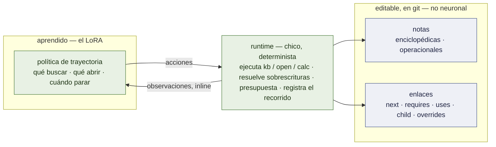

# Trayectorias de conocimiento — una memoria por experto que también es el harness

**Un documento de diseño, escrito para ser discutido.** Es autocontenido a propósito: dárselo a
otro modelo, o a una persona, sin más contexto y pedirle que lo rompa. Todo lo marcado
**[ran]** se midió en este repositorio y nombra su corrida; **[read]** se leyó en el código fuente o en un
paper; **[proposed]** es una decisión de diseño que nadie probó; **[open]** es una pregunta que este documento
no sabe responder. **Nada de lo descrito acá está construido.** Las mediciones que lo formaron
son reales, y el §2 las lista con sus números, porque una revisión de diseño que no las conoce
va a volver a proponer lo que ya falló.

Estado: propuesta, 2026-09-19. Dueño de la idea: el usuario. Entrada en el plan:
[`PLAN.md`](PLAN.md) hito 7. Formalismo: [`FOUNDATIONS.md`](FOUNDATIONS.md) §8.6.

---

## 1. La idea en un párrafo

El sistema es un pool de expertos chicos: un QLoRA por subdominio sobre un modelo chico residente
(`Qwen3.5-4B`), un router que manda un pedido al experto cuyo corpus de entrenamiento se le parece y
a un modelo de frontera en cualquier otro caso. Este documento le agrega al experto su **memoria**. Cada subdominio tiene
su propia **base de conocimiento** de notas cortas en markdown de dos tipos — **enciclopédicas** (qué vale, y
cuándo: conceptos, regímenes, tablas de propiedades) y **operacionales** (cómo se hace un tipo de tarea: pasos
ordenados, el chequeo que tiene que preceder a una acción) — embebidas en un espacio vectorial. El experto no
memoriza las notas. Lo que su LoRA aprende es una **política de trayectoria**: qué buscar primero, qué
enlace seguir, cuándo dejar de leer y calcular. **Los pesos guardan la navegación; la base
guarda el contenido.** Y porque una nota operacional *es* un procedimiento y sus enlaces *son* flujo de
control, una trayectoria por ellas hace lo que hace el harness de un agente — así que el harness deja de ser
un prompt fijo y un loop escrito a mano, y pasa a ser tres cosas separables: contenido editable,
flujo de control editable, y una forma aprendida de recorrerlos.

## 2. Lo que ya está medido, y tiene que restringir el diseño

| # | hallazgo | número | corrida |
|---|---|---|---|
| F1 | **Un modelo chico no sigue un procedimiento que sólo lee.** Base 3B + un documento de procedimiento de 914 tokens en el system prompt | 0 llamadas a herramientas en 351/351 mensajes; 0,601, debajo de la barra de mayoría de 0,655; el experto entrenado le gana 137 : 1 | **[ran]** P61 |
| F2 | **El conocimiento fijo en un corpus de entrenamiento se memoriza, y después no cuesta nada.** Una herramienta de lookup sobre una tabla de propiedades de 14 valores | un control **sin ninguna herramienta** puntuó 27/30 — 600 ejemplos memorizan 14 números. Se corrige con un handbook armado **por caso** (un fluido que existe sólo en este problema) | **[ran]** P15, P21 |
| F3 | **Un especialista se equivoca con confianza un paso afuera de su región** | 30/30 en sus fórmulas adentro; **1/20** en dos familias hermanas que nunca vio; prosa igual de fluida | **[ran]** P14 |
| F4 | **Un corpus con una sola dificultad enseña un piso** | entrenado sólo con cadenas de 6 a 9 pasos, el experto sobre-resuelve 18/18 problemas más cortos; la base pelada le gana en los de 3 pasos | **[ran]** P45 |
| F5 | **Un experto es lo que su corpus le enseñó — el bloque de herramientas, el orden de los argumentos, el system prompt.** Servido bajo otro prompt es otro modelo | 2/32 turnos en vivo llaman a una herramienta bajo el prompt del runtime; 19/32 bajo el suyo propio | **[ran]** P63 |
| F6 | **Importa cómo le llega al experto el resultado de una herramienta.** Resultado inline después del tag de cierre (como se entrenó) contra a través de mensajes `tool_calls` | `email-full` 0,992 contra 0,808 | **[ran]** P55 |
| F7 | **La falla del experto de fluidos es sobre todo no usar lo que le devolvieron sus herramientas** | de 79 fallas, 74 tienen un número que salió de ningún lado y 75 dejan un resultado sin usar (217 de 456 resultados ignorados): busca la densidad, 882,3, y multiplica por 1359,7. *Factor de confusión:* esa corrida usó el camino `tool_calls` de F6; el reservido inline está pendiente | **[ran]** M7 brazo 0; brazo 0b pendiente |
| F8 | **Un modelo léxico de un corpus generado aprende al generador.** Un router de n-gramas entrenado sobre los corpus de los expertos | seguro con texto extranjero (0/128 servido localmente contra 59/128 del diccionario de palabras clave) y pierde **120/120** pedidos legítimos de remitentes nunca vistos — toda dirección generada terminaba en `.com` | **[ran]** M2 |
| F9 | **La estructura le perdió a la recuperación plana dos veces en el trabajo de este autor.** Una jerarquía de memoria contra búsqueda léxica; e indexar *para qué sirve algo* al lado de *qué es* | la jerarquía perdió; el índice dual no cambió nada — acc@1 80 % con cualquier peso de mezcla, n = 10, errores todos **dentro del mismo tema** | benchmark del workspace; `evolving-memory` `benchmarks/RESULTS.md` **[read]** |
| F10 | **La destilación transfiere un procedimiento y no la aritmética** | adaptador + calculadora 40/40; adaptador solo 4/40 (π/4·0,22² escrito como 0,037006) | **[ran]** P5–P7 |

Consecuencias, cada una de las cuales el diseño de abajo obedece:

- F1 ⇒ *seguir lo que lee* tiene que ser lo que el adaptador **entrena**. Pegar notas en
  el prompt de un modelo sin entrenar no es una línea de base que signifique algo a este tamaño.
- F2 ⇒ todo lo que se supone que provee la base tiene que ser **inmemorizable por construcción** durante
  el entrenamiento y la evaluación, o la base no mide nada.
- F3 ⇒ el margen, y la afirmación: notas de una **familia hermana sobre la que el adaptador nunca entrenó**
  extienden su región sin reentrenar.
- F5, F6 ⇒ el vocabulario de acciones, su renderizado y el formato del resultado inline son parte del
  corpus y quedan congelados con el release.
- F7 ⇒ medir **dónde pasa**: si la nota se recuperó, se abrió, se *usó* — no sólo la respuesta.
- F9 ⇒ la jerarquía y la recuperación consciente de la trayectoria son **brazos con una línea de base plana**, nunca supuestos.
- F10 ⇒ la aritmética se queda en una calculadora.

## 3. Las tres partes



| parte | guarda | cambia con | un harness clásico lo guarda en |
|---|---|---|---|
| **notas** | el contenido: hechos, fórmulas, pasos, chequeos | editar markdown | el system prompt |
| **enlaces** | el flujo de control: qué viene después, qué tiene que preceder, qué usa un paso | editar el frontmatter | un loop escrito a mano |
| **política** | cómo recorrer: consultar, abrir, seguir, parar, calcular | entrenar un LoRA | la obediencia del modelo base — que F1 dice que un modelo chico no tiene |

Esa tabla es el sentido en el que esto *es* un harness: las mismas tres responsabilidades, movidas a
donde cada una se puede cambiar a su propio costo. El contenido y el flujo de control cambian con un editor de texto y
un commit de git; sólo la forma de recorrer cuesta una corrida de entrenamiento, y es la parte que debería cambiar
menos.

### 3.1 Notas **[proposed]**

Un archivo por nota, markdown con frontmatter, en `knowledge/<subdomain>/`. Corta — una nota tiene que entrar
en la atención de un 4B con margen de sobra: **objetivo ≤ 150 tokens de cuerpo.**

```markdown
---
id: iv-primary/20-cleanse-cap
kind: step                      # concept | table | procedure | step | check | override
subdomain: nursing-iv
title: Cleanse the catheter cap before attaching tubing
what: Disinfection of the IV port's cap with an alcohol pad or scrub hub.
when: You are about to connect a syringe or tubing to a patient's IV port.
links:
  prev: iv-primary/19-assess-site
  next: iv-primary/21-assess-patency
  requires: [iv-primary/08-safety-steps]
  uses: [asepsis/scrub-the-hub]
source: Nursing Skills (Open RN), ch. 23, CC BY 4.0
---
Vigorously cleanse the catheter cap for at least {{seconds}} seconds and allow it to dry.
```

- **`what` y `when` están las dos embebidas** — qué *es* la nota y para qué *sirve*. Tomado del
  índice dual de `evolving-memory` **[read]**; su propio benchmark no encontró ganancia (F9), así que acá es un
  brazo contra un único embedding, no un dado.
- **Tipos.** Enciclopédico: `concept` (una definición; qué correlación vale en qué régimen),
  `table` (filas de propiedades). Operacional: `procedure` (un esqueleto: sólo títulos de pasos ordenados),
  `step` (una acción, su detalle), `check` (una condición que habilita una acción). `override` es el §3.3.
- **`{{slots}}`** son valores que el runtime completa cuando sirve la nota. Son cómo se satisface F2
  (§5) y cómo se expresa la adaptación de un sitio (§3.3).
- Un **procedimiento es un esqueleto más notas de paso**, no una nota larga: el libro abierto sobre una lista
  de 32 pasos es una tarea distinta de recorrerla, y el diseño necesita medir las dos.

### 3.2 Enlaces **[proposed]**

| enlace | significado | quién lo lee |
|---|---|---|
| `next` / `prev` | secuencia adentro de un procedimiento | la política, para avanzar |
| `requires` | esto se tiene que haber abierto/satisfecho antes | la política — y el **runtime, como guarda** (§3.5) |
| `uses` | un paso depende de un concepto, una tabla o un sub-procedimiento | la política, para descender |
| `child` / `parent` | jerarquía entre notas enciclopédicas | la política, para acotar |
| `overrides` | la nota de un sitio reemplaza un campo de una nota base | sólo el runtime |
| `see_also` | asociación débil | sólo el reponderado de recuperación |

`evolving-memory` escribe esos bordes y **nunca lee uno al momento de recuperar [read]** — su recorrido
es `ORDER BY step_index`. Leerlos es el trabajo nuevo acá.

### 3.3 Capas: libro de texto, sitio, caso **[proposed]**

Una base se resuelve en capas, gana la más cercana: **caso** (valores sorteados para un problema — sólo entrenamiento y
evaluación) → **sitio** (la adaptación de una sala o de un cliente: "acá la tapa se limpia durante 15
segundos") → **libro de texto**. El **runtime las resuelve, no el modelo**: `<open>` devuelve una nota,
ya resuelta, con el campo sobrescrito marcado (`[site]`). Razones: es determinista, es
auditable, y a un modelo al que se le pide recuperar *tanto* la regla como su excepción y reconciliarlas
se le está pidiendo exactamente lo que F7 dice que hace mal. **[open]** si esconder la
reconciliación le cuesta al modelo la capacidad de *explicar* una desviación cuando se le pregunta.

"Expertos locales" es esta capa. También es el contenido inmemorizable de F2 encontrado en el mundo en vez de
fabricado: el número de un sitio no puede estar en los pesos porque cambia por sitio.

### 3.4 Acciones — todo el vocabulario **[proposed]**

Tres verbos, escritos como tags en el propio texto del experto, el resultado inyectado **inline** después del
tag de cierre (F6), la generación se para en cada tag de cierre:

```
<kb>what is asked, in the expert's words</kb>= 3 notes
  [a3f] step · Cleanse the catheter cap before attaching tubing — when: about to connect to an IV port
  [9c1] check · Assess IV site patency — when: before starting any infusion
  [77e] concept · Scrub the hub — when: any access of a needleless connector
<open>a3f</open>= Cleanse the catheter cap … for at least 15 [site] seconds and allow it to dry.
  links: next 9c1 · requires 08b · uses 77e
<calc>500 * 20 / (4 * 60)</calc>= 41.6667
```

- `<kb>` devuelve **sólo títulos y líneas `when`**, nunca cuerpos: recuperar y leer son dos
  decisiones, medidas por separado (§6).
- `<open>` devuelve el cuerpo resuelto y los enlaces salientes de la nota **con su tipo**. Seguir
  un enlace es sólo `<open>` sobre su id — no hay un cuarto verbo.
- **Los ids son opacos y se sortean de nuevo por caso durante el entrenamiento [proposed].** Si los ids fueran estables
  el adaptador aprendería "para el paso 20 abrir `a3f`" — navegación de memoria, que funciona hasta que la base
  cambia y falla en silencio en una familia hermana (F3). Los ids opacos lo obligan a leer lo que devolvió
  `<kb>`. **[open]:** el costo es que la política nunca puede aprender un atajo legítimo.
- Los presupuestos son del runtime: como mucho *k* notas por `<kb>` (3–5), un tope de tokens por nota, un tope de
  aperturas por tarea. Un recorrido que choca con un tope termina como *no contestado* y sale hacia la frontera.

### 3.5 El runtime — lo que se queda no neuronal **[proposed]**

Ejecuta los tres verbos; resuelve las capas; hace cumplir los presupuestos; **registra el recorrido**; y chequea
la **conformidad**: si el experto reporta un paso hecho cuyo target de `requires` nunca abrió, eso
es una violación que el runtime puede ver **sin saber la respuesta correcta** — el mismo tipo de guarda
que el análisis dimensional sobre una cadena de física (P22 **[ran]**: una relación inventada falla en las unidades). Es
un verificador que el loop de entrenamiento nunca ve, que es lo que tiene que ser cualquier señal que se use para
seleccionar o entrenar. Vive en el proxy al lado de las herramientas existentes; la base de un subdominio es unos
cientos de notas, así que el índice es un coseno exhaustivo — un producto de matrices, sin biblioteca ANN, sin servidor.

## 4. Estrategias de trayectoria — qué significa "una estrategia por LoRA"

Una estrategia es una *gramática de recorridos*. El corpus de entrenamiento de un subdominio se genera bajo una, así que la
estrategia termina en los pesos de la misma forma que el bloque de herramientas (F5). Cuál encaja es una propiedad
de las tareas del subdominio — de la **distribución de su corpus** — y esa es la hipótesis:

| # | estrategia | el recorrido | se espera que encaje en |
|---|---|---|---|
| S0 | ninguna | responder desde los pesos | el control; F3 dice 1/20 afuera de la región |
| S1 | plana | un `<kb>` sobre el texto de la tarea → abrir el top-1 → responder | la línea de base RAG que toda otra estrategia tiene que superar |
| S2 | **procedimiento primero** | `<kb>` restringido a `procedure` → abrir el esqueleto → recorrer `next`, descendiendo por `uses` sólo donde un paso necesita un hecho | enfermería; cualquier tarea que *sea* un procedimiento |
| S3 | concepto primero | `<kb>` sobre conceptos → descender por `child` hasta una fórmula o tabla hoja → calcular | tareas tipo diagnóstico; "en qué régimen estoy" |
| S4 | **recuperación condicionada por la trayectoria** | cada consulta se puntúa adentro de la vecindad de la última nota abierta | donde la recuperación plana confunde ítems *dentro* de un tema — que es exactamente donde estaban los errores de F9 |

El puntaje de S4, con $q$ la consulta, $n$ un candidato, $\ell$ la última nota abierta, $N(\ell)$ sus vecinos
enlazados y $e$ el encoder:

$$s(n \mid q, \ell) = \underbrace{\langle e(q), e_{\text{when}}(n)\rangle}_{\text{es para esto}} \;+\; \beta\,\underbrace{\langle e(q), e_{\text{what}}(n)\rangle}_{\text{es esto}} \;+\; \lambda\,\mathbf 1[n \in N(\ell)] \;+\; \mu\,\langle e(\ell), e(n)\rangle ,$$

$\beta = \lambda = \mu = 0$ es la búsqueda plana de S1, así que el brazo es una generalización estricta de su
línea de base y cada sub-puntaje se guarda en el match para decir qué término movió un ranking.

**Un único encoder para el router y la base [proposed].** El próximo brazo del router es un modelo de embeddings
(F8 mató al léxico). Si un subdominio es una región de un espacio — los pedidos ruteados al
miembro caen ahí, y también las líneas `when` de sus notas — entonces "de quién es este corpus" y
"para qué es esta nota" son la misma geometría, construida una sola vez. Candidatos,
los dos chicos y abiertos, los dos **servidos en Colab como todo otro modelo acá — nada corre en la
máquina del usuario**: `embeddinggemma`, y en la familia el modelo de embeddings más chico de Qwen 3 **[read]**.

## 5. El corpus — cómo una trayectoria entra en los pesos

Para cada caso de entrenamiento el **oráculo conoce el recorrido**: qué notas necesita la solución, en qué
orden. El corpus es ese recorrido renderizado como el propio turno del experto, acciones y observaciones inline
juntas, exactamente como se va a servir (F5, F6). Cuatro reglas, cada una de una medición:

1. **Contenido inmemorizable (F2).** Los valores de los slots se sortean por caso: un fluido llamado `TD-78` con una
   densidad que existe sólo en este problema; **y coeficientes del propio procedimiento** — una
   variante de correlación, el tiempo de permanencia de un sitio. El adaptador puede aprender *qué* nota necesita un paso. No
   puede aprender *qué dice la nota*. La corrida afirma que el canal es necesario: ningún valor de slot puede
   aparecer en el enunciado de la tarea.
2. **Ids opacos, distractores y callejones sin salida.** Los resultados de `<kb>` en el corpus contienen notas
   parecidas pero equivocadas; algunos casos **no tienen ninguna nota aplicable**, y el recorrido enseñado termina en *no está en mi base* —
   que el proxy convierte en la frontera. Un experto que no puede abstenerse de su propia base es F3
   con pasos de más.
3. **Cada profundidad que va a servir el experto (F4).** Recorridos de una, dos, cinco aperturas; procedimientos entrados por
   su primer paso y por el medio.
4. **Familias hermanas retenidas (F3).** La prueba que importa es una familia cuyas notas existen en la
   base y cuyos recorridos nunca estuvieron en el corpus.

**[open]** Imitar recorridos oráculo es supervisado y barato. Si la política debería después
mejorarse contra las propias señales del runtime — conformidad (§3.5), *resultado usado río abajo* (F7),
el verificador final — por rejection sampling o entrenamiento de preferencias sobre recorridos, está sin decidir; es
el primer lugar donde este diseño podría empezar a criar recorridos que le halagan a su propio puntuador.

## 6. Cómo se mide

Los brazos del hito 7, en el orden que puede matarlo más rápido ([`PLAN.md`](PLAN.md)):

| # | brazo | decide |
|---|---|---|
| 0 | las fallas grabadas, leídas donde pasan | **hecho [ran]** — F7 |
| 0b | el mismo experto re-servido con resultados inline | si F7 es el modelo o el camino |
| 1 | **trayectoria oráculo**, con y sin la base, sobre una familia hermana retenida | la cota: si las notas exactamente correctas, abiertas, no la levantan de ~1/20, parar |
| 2 | navegación aprendida contra el recorrido oráculo | qué pierde la navegación |
| 3 | sólo enciclopédico · sólo operacional · las dos | qué tipo de conocimiento carga la ganancia |
| 4 | S1 léxico plano · S1 embedding plano · S4 | si una estrategia de trayectoria le gana a una búsqueda plana (F9 dice no asumirlo) |
| 5 | editar una nota después de entrenar | que la respuesta sigue a la base, no a los pesos |

Medido **por paso, no sólo en la respuesta**: *recuperada* (la nota necesaria en la lista de `<kb>`),
*abierta*, *usada* (su valor llega a un paso posterior — el instrumento de F7), *conforme* (§3.5),
*correcta*; más tokens por tarea, porque un recorrido no es gratis. Un lector que tuvo suerte sobre una nota
vacía es un caso que un puntaje final no puede ver.

Dos bancos de prueba con trabajos distintos. **La mecánica de fluidos** es el *instrumento*: un oráculo exacto,
contenido inmemorizable por construcción, cuatro subdominios de dos familias hermanas cada uno. **Los procedimientos
de enfermería** (*Nursing Skills* de Open RN, CC BY 4.0) son la *región*: texto que nadie acá generó,
conocimiento operacional en su forma más pura, y una capa de sitio real. Un resultado que vale en uno y
no en el otro es un hallazgo sobre suites generadas.

## 7. Memoria en el otro sentido — recorridos que se hicieron **[proposed, fase 2]**

El runtime registra cada recorrido. Los recorridos registrados son una **memoria episódica** de la que la base puede crecer:
notas repetidamente abiertas juntas sugieren un enlace `uses`; un recorrido que llegó a la respuesta en tres
aperturas donde el procedimiento lleva siete sugiere una nota de atajo; recorridos que fallaron la conformidad
sugieren un `check` — un *no hacer* al lado de los pasos, que `evolving-memory` llama una restricción
negativa **[read]**. Dos límites. **Una propuesta nunca se aplica sin una compuerta** — un verificador
o una persona — porque una base que se edita a sí misma a partir de su propio tráfico es F8 esperando a
pasar: va a aprender sus propios hábitos. Y **el tooling de consolidación queda afuera de este runtime open source**;
la parte del runtime es registrar el recorrido en una forma que se pueda consolidar. **[open]** si un registro
puede guardar el *contenido* de una nota o sólo sus *formas* — ids, tipos, tipos de enlace — cuando el tráfico es
de un cliente.

## 8. Qué cambia en otras partes

- **El contrato de release** gana el hash de la base, el hash del índice, el id del encoder y la versión de la
  gramática de acciones: un miembro es su corpus, su base y la forma en que se le enseñó a recorrerla.
- **El par especulativo** (un LoRA sobre el modelo chico y uno sobre el grande, mismo corpus): un recorrido es
  sobre todo *tokens de decisión* — qué verbo, qué id — y las dos mitades se entrenan sobre los mismos recorridos,
  así que la aceptación debería ser más alta justo ahí. **[open]**, y medible con el instrumento
  que ya existe.
- **Ruteo:** "sin nota aplicable" es una segunda abstención, adentro de la región, después de la primera del
  router en su borde.

## 9. Lo que este diseño no afirma

Que una jerarquía ayude. Que los embeddings le ganen a la búsqueda léxica adentro de una base de unos cientos de notas.
Que un 4B pueda aprender a seguir lo que lee, siquiera — el brazo 1 existe para averiguarlo, y F1 y F7 son
las dos razones para dudarlo. Que algo medido en una suite generada se transfiera a una real. Que
esto sea más barato que poner el procedimiento en los pesos cuando el procedimiento nunca cambia — para un
procedimiento congelado, F1 dice que ganan los pesos, y la base se gana su lugar sólo donde el contenido **varía**:
por sitio, por caso, por fecha, o por familia.

## 10. Preguntas para quien revise

1. **Granularidad.** ¿Una nota por paso, o por procedimiento con anclas? Lo primero hace los recorridos largos
   (tokens, latencia, más chances de descarrilar); lo segundo hace que leer sea la parte difícil. ¿Hay un
   tamaño con principio detrás?
2. **Ids opacos.** ¿Compran generalización a notas no vistas, o sólo hacen que cada recorrido pague por una
   búsqueda que la política podría haberse salteado? ¿Hay un punto medio — ids estables adentro de una familia entrenada,
   opacos entre familias?
3. **Quién reconcilia una sobrescritura (`override`)** — ¿el runtime (propuesto) o el modelo? ¿Qué se pierde cuando el modelo nunca
   ve el valor del libro de texto del que se está desviando?
4. **Quién escribe la consulta.** ¿La política (propuesto), o una plantilla completada desde el paso actual
   (`step title + task`)? Una plantilla saca un modo de falla y un grado de libertad.
5. **¿S4 vale sus términos?** Con dos precedentes en contra de la estructura (F9), ¿cuál es el experimento más chico
   que mostraría a $\lambda$ o $\mu$ ganándose su lugar — y en qué tipo de base tendrían que hacerlo?
6. **Un único encoder para ruteo y recuperación.** ¿Es sólida la idea de que "un subdominio es una región de un espacio", o
   el texto estilo pedido y el texto estilo nota necesitan espacios separados o una proyección aprendida?
7. **Más allá de la imitación.** ¿Qué señal de entrenamiento para recorridos *no* cría una política que le hace el favor a
   la guarda de conformidad?
8. **Abstención adentro de la región.** ¿Cómo se enseña "sin nota aplicable" sin enseñarle a la política
   a rendirse temprano?
9. **La falla en F7.** Si el re-servido inline muestra que un modelo chico igual ignora lo que acaba de
   leer, ¿la respuesta correcta es un modelo chico más grande, un decoder restringido que *copia* el
   valor observado, o un runtime que sustituye valores para que el modelo nunca tenga que hacerlo?
10. **¿Dónde está mal esto?** En particular: ¿es "trayectoria = harness" una descomposición real, o un
    reetiquetado del uso de herramientas aumentado por recuperación — y si es lo segundo, ¿qué habría tenido
    que predecir la diferencia para ser real?
