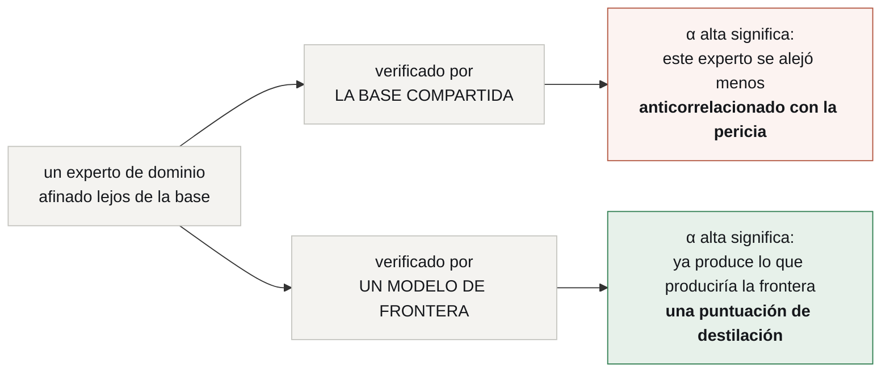

# Referencia técnica

> **Referencia para los mecanismos que existen; especificación para los que no.**
> Toda afirmación sobre un sistema externo va marcada **[read]** y citada. Nada de
> acá se corrió.
>
> *[Read this in English](../TECHNICAL-REFERENCE.md)*

---

## 1. Decodificación especulativa

Un **drafter** propone `k` tokens. El **target** los puntúa en las `k+1`
posiciones en un solo forward pass. El muestreo por rechazo acepta un prefijo y
vuelve a muestrear en el primer rechazo, construido de modo que **los tokens
aceptados se distribuyen exactamente como los habría emitido el target**. Sin
pérdida por diseño. **[read]**

Dos consecuencias definen este proyecto:

1. **La respuesta emitida es la del target.** Durante la Fase A estás obteniendo
   salida de frontera — que es el punto: pagás calidad de frontera y te llevás la
   medición gratis.
2. **α mide coincidencia con el target.** Contra un target de frontera eso es una
   puntuación de destilación; contra una base débil, no. Ver
   [`ARCHITECTURE.md` §2](ARCHITECTURE.md).

### 1.1 Lo que mide α depende enteramente de quién verifica



La rama derecha es la arquitectura. La izquierda es la razón por la que el target
es un componente y no una optimización: cambialo y el router mide otra cosa, en
silencio, mientras todos los números siguen pareciendo correctos.

### 1.2 Tasa de aceptación, definida

Para drafter `d`, target `t`, distribución de prompts `P`, largo de borrador `k`:

```
α(d, t) = E_{x~P} [ tokens_aceptados(x) / k ]
```

**Siempre reportada con su `k`.** α cae a medida que `k` crece, así que un número
sin su largo de borrador no es comparable. La aceleración es función de `α`, `k` y
la razón de costo drafter/target — nunca de `α` sola.

**Siempre reportada al lado del puntaje verificado de tarea** de la misma
configuración, porque la decisión de retiro se toma con las dos.

### 1.3 La superficie de α

α no es un número por experto. Es un número por experto **y por región** del
espacio del problema, y las regiones son la unidad de retiro. Un adaptador
legal-tax puede cruzar el umbral en preguntas de deducciones meses antes de
cruzarlo en procedimiento. Guardá α con la etiqueta de región, o la Fase B
promueve a un experto a territorio que nadie midió.

## 2. Servir múltiples adaptadores en vLLM — estado hoy

| capacidad | estado | fuente |
|---|---|---|
| muchos adaptadores LoRA sobre un **target**, en batch en un mismo flujo de requests | **shippea** | **[read]** |
| verificación de drafts en árbol | **shippea** (familia EAGLE/Medusa) | **[read]** |
| adaptador LoRA como modelo **draft** | **RFC abierto**, 2026-08-12 | [vllm#52038](https://github.com/vllm-project/vllm/issues/52038) **[read]** |
| intento anterior | adaptador aplicado al target, **desactivado en el draft** | [vllm#11966](https://github.com/vllm-project/vllm/pull/11966) **[read]** |

Los números del RFC son por qué ésta es la apuesta correcta: un adaptador **r=64**
es aproximadamente **28× más chico** que el drafter de 0,8B que reemplaza, con
calidad de borrador dentro de un **2%** de un drafter entrenado por dominio.
**[read]** Ésa es la economía de todo el pool de expertos en un solo número.

**Hasta que aterrice**, la Fase A corre de una de dos maneras, y las dos son el
mismo experimento con distinta factura de memoria:

- adaptadores aplicados a modelos drafter fuera del camino especulativo de vLLM; o
- drafters chicos por dominio en vez de adaptadores.

## 3. El KV cache — la parte cara

Las ramas de un mismo drafter comparten una representación cacheable; la tree
attention lo aprovecha y está resuelto. **[read]**

Las ramas de **adaptadores distintos** no. Un LoRA modifica las proyecciones que
producen K y V, así que la rama de cada adaptador tiene su propio estado
clave/valor más allá del prefijo compartido. La paged attention da compartición de
prefijo; no da compartición de ramas entre adaptadores.

Éste es el problema de ingeniería abierto de la arquitectura. Vale la pena
resolverlo después de E1, no antes.

## 4. `harness.lora` — el adaptador kernel

Entrenado sólo en el protocolo de ejecución, nunca en contenido de dominio.

### 4.1 Action tokens

El adaptador emite el protocolo como **tokens**, no como prosa que un parser deba
recuperar:

```
<invoke_tool name="sql">SELECT …</invoke_tool>
<observe>…</observe>
<eval_state>…</eval_state>
```

Mover una garantía de formato de un prompt a los pesos es la parte mecánicamente
más fuerte del diseño. **La comparación honesta es contra constrained decoding**,
que vuelve la sintaxis inválida *imposible* en vez de improbable — y que esta
organización construyó: `token-trie` enmascara logits para que un modelo chico no
pueda emitir sintaxis inválida. Se archivó por una razón que conviene repetir acá:
**ese enmascarado necesita el sampler, y un SDK contra API no te lo da.** Ser
dueño del runtime es lo que hace que cualquiera de los dos enfoques exista.
**[read]**

Los dos son complementarios: el adaptador vuelve probable la llamada *correcta*,
la gramática vuelve *imposible* la malformada. Shippear los dos está permitido.

### 4.2 Qué tiene que batir

No "esquemas JSON grandes en el system prompt" — esa comparación lo adula. El
baseline es **nuestra propia versión anterior**: `gemma4nanoloop` ató tools por
fase y llevó el schema pico de **5.548 a 817 tokens, −85%**, sin entrenar nada.
**[read]**

Tres números, juntos:

- **tokens de protocolo por llamada** — el −85% es la vara
- **tasa de llamadas malformadas** — contra constrained decoding, no contra prosa
- **latencia**, incluido el costo de cambiar de adaptador

Ganar en tokens y perder en llamadas malformadas no es ganar.

## 5. Componer dos adaptadores

El kernel y un experto de dominio tienen que estar los dos activos. Tres opciones,
en costo creciente:

1. **Activación secuencial** — el adaptador de dominio razona, el kernel emite la
   llamada. La más barata, y encaja con la estructura de fases que el bucle ya
   tiene.
2. **Adaptadores apilados** — los dos aplicados; requiere que el stack de servicio
   componga dos deltas sobre la misma base.
3. **Un adaptador fusionado por experto** — entrena el protocolo dentro de cada
   adaptador de dominio, que es el costo que este diseño existe para eliminar.
   Listado para ser rechazado.

La opción 1 es la default hasta que se mida otra cosa.

## 6. La función de fitness

```
score = w₁ · éxito verificado de la tarea
      + w₂ · α (contra el target de frontera)
      − w₃ · tokens consumidos
```

- **`w₁`** viene de un verificador retenido fuera del bucle de entrenamiento. No
  negociable.
- **`w₂`** tiene sentido sólo mientras el target sea de frontera.
- **`w₃`** incluye el costo de cambiar de adaptador, no sólo los tokens generados.

## 7. Lo que no es neuronal

- **Memoria**: markdown bajo git, legible y diffeable por una persona.
- **Ejecución**: el sandbox donde corren las herramientas.
- **Verificación**: un verificador cuya fuerza se declara con cada resultado.
