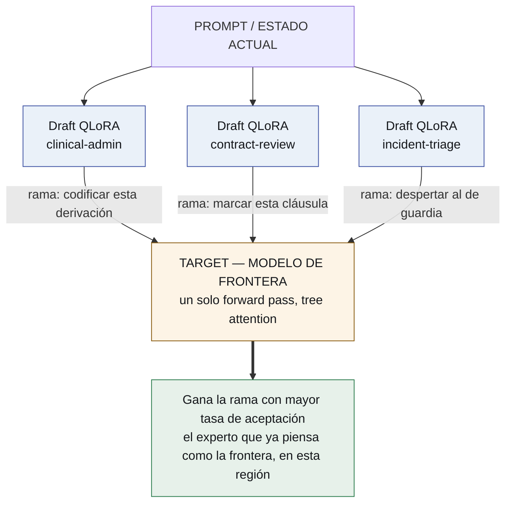
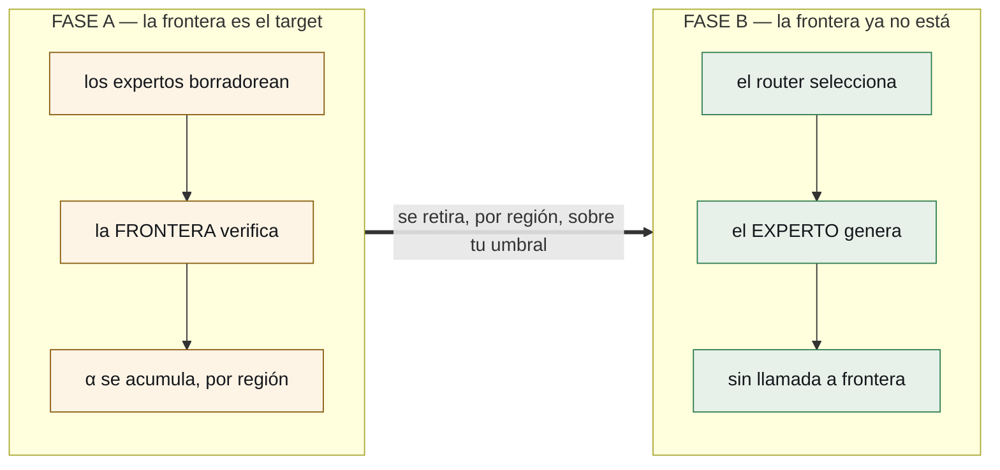

# Borrá el framework. Ponelo en los pesos.

*Un sistema multi-agente hoy es una pila de Python sosteniendo a un modelo con
pinzas. No tiene por qué serlo. Todo —el harness, el router, los expertos— puede
ser un puñado de archivos apoyados sobre un solo modelo, y el mecanismo que te
lleva ahí es un truco de destilación escondido adentro de una optimización de
inferencia.*

*[Read this in English](../delete-the-framework.md)*

---

## Lo que tenés hoy

Abrí el sistema de agentes que estás corriendo ahora mismo y mirá qué hay adentro.

Un **router**, que es una llamada a un modelo cuyo único trabajo es decidir qué
otra llamada hacer. Un **system prompt** cargando un documento JSON que describe
todas las herramientas, la mayoría de las cuales este request no va a usar. Un
**parser** río abajo, adivinando si el modelo quiso llamar algo. **Lógica de
reintentos**, porque a veces adivinó mal. Un **proceso de orquestación** en
Python, sosteniendo estado, haciendo HTTP y esperando.

Cada una de esas cosas es software escrito para compensar que el modelo no sabe
actuar. Y cada una es un lugar donde un request puede salir lento, caro, o mal de
un modo que nadie nota.

Ahora la afirmación:

> **Todo eso puede ser pesos.** Un modelo base residente en una GPU, y una carpeta
> de adaptadores chicos —unos cientos de megabytes cada uno— intercambiados por
> request. El harness es uno de ellos. Cada experto es uno de ellos. El router
> deja de ser una llamada y pasa a ser un subproducto de una aritmética que ya
> estabas pagando.
>
> **El framework multi-agente no se simplifica. Deja de existir.**

## Tres maneras de leer lo que sigue

Porque la misma arquitectura es una cosa distinta según qué tengas en la mano.

**Si firmás la factura.** Hoy pagás precio de frontera en cada request porque un
modelo más chico no es lo bastante confiable en tu dominio. Éste es un camino
donde seguís pagándolo *un tiempo*, a propósito, y ese pago te compra la medición
que te permite dejar de pagarlo.

**Si estás de guardia.** Tus incidentes son errores de formato, un parser que se
topó con una respuesta que no esperaba, y un router que mandó la pregunta al
agente equivocado. Dos de esos tres son problemas con forma de prompt, y esto los
saca del prompt.

**Si entrenás modelos.** Esto es destilación online donde la evaluación es gratis
y continua, el maestro está en producción y no en un notebook, y el criterio de
promoción es un número que elegís vos. Lo novedoso no es la destilación: es de
dónde sale el puntaje.

---

## Lo primero que se vuelve adaptador es el harness

No los expertos. El harness — y es la parte que más vueltas me sigue dando.

¿Qué hace un harness? **Inyecta los esquemas de herramientas en el system
prompt**, así que cada llamada paga un documento que describe funciones que
mayormente no va a usar y la atención del modelo queda repartida. Después
**valida la salida a posteriori**, con un parser que adivina, o con una gramática
que restringe el decodificador.

El protocolo vive en el prompt. Es el lugar más caro y menos confiable donde
ponerlo.

**Entonces entrenalo en los pesos.** Un adaptador —`harness.lora`— en nada más
que el protocolo de ejecución:

- sintaxis de llamada a herramientas, y **action tokens emitidos nativamente**:
  `<invoke_tool name="sql">`, `<observe>`, `<eval_state>`
- cómo se ve un error de API, y qué hacer con él
- transiciones de estado: cuándo terminó un paso, cuándo devolver, cuándo parar

Nunca aprende un dominio. Aprende *cómo actuar*, una vez, y cada experto compone
con él. **El adaptador de dominio piensa; el kernel actúa.** Una flota de veinte
expertos deja de contener veinte copias del mismo protocolo.

Y acá está lo que lo vuelve más que una optimización de tokens.

> **Un harness en pesos es un harness que se puede versionar, puntuar y
> evolucionar.**

Hoy tu harness es código. No podés correr dos baratos contra el mismo tráfico y
quedarte con el mejor: refactorizás, deployás y esperás. Como adaptador entra en
el mismo torneo que todo lo demás, con la misma función de fitness y el mismo
verificador retenido. `harness-v3` pierde contra `harness-v4` en tasa de llamadas
malformadas y queda retirado esa noche.

**La capa de orquestación deja de ser la única parte del sistema que no puede
mejorar sola.**

### La comparación honesta, antes de que alguien se entusiasme

La comparación que adula es "mirá qué chico quedó el system prompt". La que
cuenta es nuestro propio resultado anterior: `gemma4nanoloop` ató las herramientas
*por fase* —el modelo sólo ve las dos o tres que la fase actual puede usar— y
llevó el schema pico de **5.548 tokens a 817, una reducción del 85%, sin entrenar
nada.** Un adaptador de harness tiene que batir eso.

Y en sintaxis el titular no es la prosa: es el **constrained decoding**, que no
vuelve improbable la salida malformada — la vuelve *imposible*. Eso también lo
construimos, en `token-trie`, y lo archivamos por una razón que importa acá:
enmascarar logits necesita el sampler, y una API no te da el sampler.

Lo cual apunta a la resolución y no a una pelea: son complementarios. El adaptador
vuelve probable la llamada *correcta*; la gramática vuelve *imposible* la
malformada. Shippeá los dos — y medí el adaptador en tokens, en tasa de llamadas
malformadas y en latencia incluyendo el cambio. Ganar en la primera y perder en la
segunda no es ganar.

## Los expertos son adaptadores, y uno queda elegido gratis

Ahora el router. Acá una optimización de inferencia resulta ser otra cosa.

La **decodificación especulativa** acelera la generación haciendo que un modelo
chico adivine hacia adelante. Un **drafter** propone un puñado de tokens; un
**target** los chequea todos en un solo forward pass; sobreviven los que
sobreviven. Viene con una garantía que es la razón entera por la que se usa: **los
tokens que salen se distribuyen exactamente como los habría emitido el target.**
El drafter puede hacer que la respuesta llegue antes. No puede hacer que sea otra
respuesta.

Ahora tomá la decisión que define todo: **que los expertos sean los drafters, y
que el target sea un modelo de frontera.**



Mirá lo que significa ahora la tasa de aceptación.

La frontera no está coincidiendo con el adaptador más soso. Coincide con el que
**produjo lo que la frontera misma estaba por producir** — en este dominio, en
este problema, ahora. Eso no es un estadístico de velocidad. Es una puntuación de
destilación por región, y la obtenés dentro de una inferencia que ibas a pagar
igual.

**No estás corriendo una evaluación.** Estás sirviendo tráfico, y el camino de
servicio va llenando un mapa: qué experto chico puede ya reemplazar a la frontera,
y dónde.

El enrutamiento —normalmente una llamada a un clasificador en el que nadie
confía— no cuesta nada. Los tokens ya existían. El pase ya iba a ocurrir. El
ganador es un subproducto.

## Y después el maestro se va

Esto es lo que convierte un truco ingenioso en una arquitectura. **El modelo de
frontera es andamio, y el diseño dice cuándo sacarlo.**



En la **Fase A** pagás precio de frontera y obtenés respuestas de frontera, y el
mapa se llena. En la **Fase B**, para las regiones donde un adaptador cruzó el
umbral que elegiste *vos*, lo promovés de drafter a generador y sacás la frontera.
Lo que la reemplaza no es otro modelo grande: es **un router y nada más**.

|  | Fase A | Fase B |
|---|---|---|
| **costo** | frontera | local |
| **calidad** | frontera | al umbral de α que exigiste |
| **y además** | una destilación gratis | — |

El umbral es tuyo, por región, sobre una superficie medida: ¿cuánta coincidencia
con la frontera exigís antes de que un experto chico conteste solo? Y es
reversible: una región cuyo puntaje verificado baja vuelve a la Fase A.

Hay un número que toda la arquitectura existe para achicar: la **brecha de
retiro** — el puntaje verificado después de que la frontera se va, menos el que
tenía mientras estaba.

## Dos competencias distintas, y no son el mismo mecanismo

"Competir" esconde dos cosas, y separarlas es lo que vuelve manejable a un pool de
adaptadores en vez de caótico.

**Entre subdominios, competir es rutear.** `clinical-admin`, `contract-review` e
`incident-triage` borradorean el mismo request; uno es sencillamente el experto
correcto; la aceptación dice cuál. **Por request**, en el forward pass, gratis.

**Dentro de un subdominio, competir es evolucionar.** `contract-v1`,
`contract-v2` y `contract-v3` no contestan preguntas distintas: son tres intentos
del mismo trabajo. Eso se decide sobre cientos de requests, offline, con fitness
acumulado:

```
score = w₁ · éxito verificado de la tarea
      + w₂ · α (aceptación contra el target de frontera)
      − w₃ · tokens consumidos
```

El peor se retira. Las mejores trayectorias de los ganadores se vuelven un dataset
DPO o GRPO, y `contract-v4` se entrena desde ahí, de noche.

Confundir las dos te da un sistema que re-decide su arquitectura en cada request.
El ruteo es una decisión sobre *este prompt*; la evolución es sobre *el pool*, y va
de noche.

## Lo que deliberadamente sigue siendo texto

Dos cosas nunca se vuelven pesos, y no es estética.

**La memoria es markdown en git.** Un delta de pesos no se puede leer, diffear,
citar ni corregir, y no se lo puede señalar en una auditoría. Toda medición que
tenemos sobre memoria dice que el activo durable es la parte que una persona puede
leer.

**La ejecución es un sandbox.** Las herramientas corren como procesos.

Ése es el sistema entero: una GPU, un modelo base, una carpeta de deltas, un
repositorio de texto y un sandbox.

## Qué es cierto hoy, y qué cuesta

El atractivo de una idea no es lo mismo que su disponibilidad.

**Servir multi-LoRA sobre un target shippea hoy.** La verificación de drafts en
árbol shippea hoy. **LoRA-como-drafter todavía no** — es un RFC abierto de vLLM,
del 12 de agosto de 2026. Hasta que aterrice, la Fase A corre con adaptadores
aplicados a modelos drafter fuera del camino especulativo, o con drafters chicos
por dominio: más memoria, idéntico experimento.

Ese RFC es además el mejor argumento de la economía: un **adaptador r=64 es unas
28× más chico** que el drafter de 0,8B que reemplaza, con calidad dentro de un
**2%**. Esa razón es por qué tener veinte expertos en memoria es razonable.

**La parte difícil es el KV cache.** Las ramas de un mismo drafter comparten una
representación cacheable — eso explota la tree attention. Las de *adaptadores
distintos* no, porque un LoRA cambia las proyecciones que producen K y V. La
compartición de prefijo es estándar; la de ramas entre adaptadores es el problema
abierto, y vale la pena resolverlo sólo cuando la primera superficie de aceptación
diga que las ramas valen la comparación.

**Y dos advertencias de mediciones que no nos fueron amables.** Ser dueño del
runtime es lo que hace que algo de esto exista: las dos mitades del argumento del
harness necesitan el sampler, y una API no te lo da. Y un torneo puede criar
adulación: el mismo procedimiento clasificó una vez como *compensación de
interfaz* en un 4B y como *ganancia persistente* en un 12B. Que un experto sea real
no es propiedad del experto, es propiedad del par. Así que el término de éxito de
tarea tiene que venir de un verificador que el bucle no pueda ver, o el bucle va a
evolucionar con entusiasmo adaptadores que coinciden con su evaluador y no saben
nada.

## Qué se corre primero

Un **chequeo de headroom**, porque un modelo base ya en el techo hace que todos
los expertos empaten, y un empate se lee como éxito.

Después dos adaptadores de dominio y un target de frontera, para producir la
primera superficie de aceptación.

Después el retiro, y el número que decide todo: cuánta calidad verificada se
pierde cuando la frontera se va.

---

*El repositorio es [`lora-kernel`](https://github.com/EvolvingAgentsLabs/lora-kernel).
Todavía no hay nada construido, y lo dice en cada página.*

*Esta línea empezó cuando [Ismael Faro](https://github.com/ismaelfaro) me sugirió
estudiar la decodificación especulativa y ver para qué servía. Resultó servir para
algo distinto de la velocidad.*
