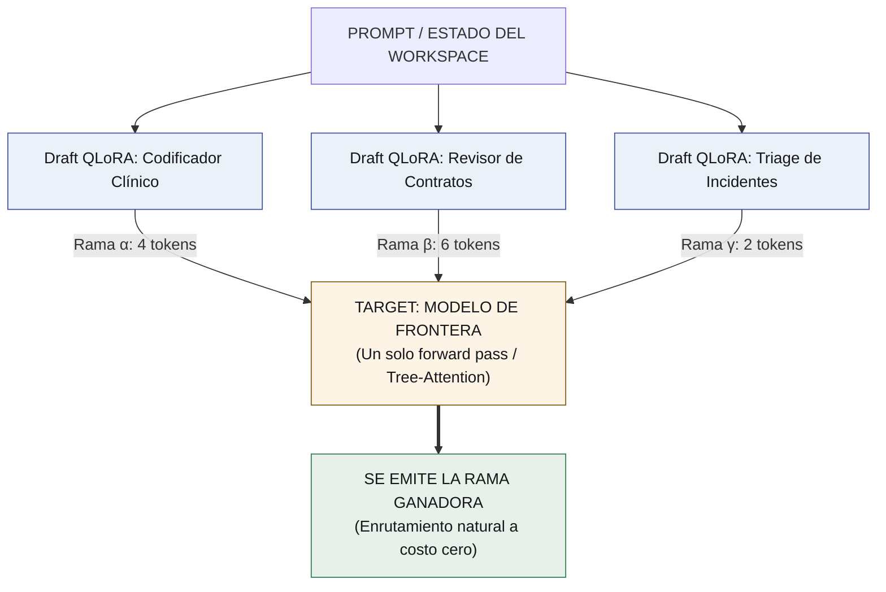
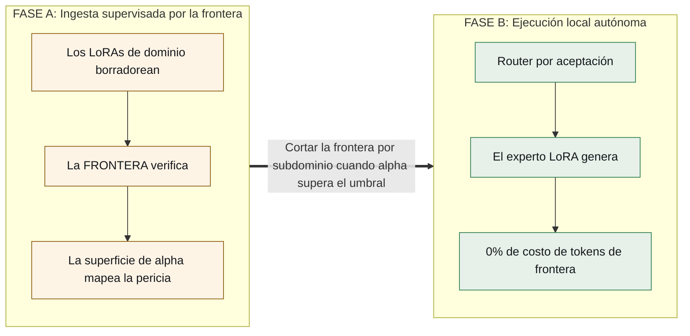

# Todo el stack de agentes son sólo deltas de pesos
### *Cómo la decodificación especulativa convierte los sistemas multi-agente, los harnesses y el enrutamiento zero-shot en un pool de QLoRAs — y vuelve obsoleto al modelo de frontera.*

*[Read this in English](../the-frontier-is-scaffolding.md)*

---

Las arquitecturas multi-agente modernas están construidas sobre el sustrato equivocado.

Estamos pegando orquestadores frágiles en Python, metiendo megabytes de esquemas JSON en los system prompts, y quemando millones en llamadas a APIs sólo para rutear consultas entre modelos.

¿Y si todo el sistema agéntico —el harness de orquestación, los protocolos de herramientas, los expertos de dominio y la lógica de enrutamiento— **no fuera más que un conjunto de adaptadores QLoRA intercambiables en caliente corriendo sobre un único modelo base residente?**

¿Y si el costoso modelo de frontera con el que empezás (Claude, GPT-4) fuera apenas **andamio diseñado para ser retirado sistemáticamente?**

Acá está cómo la decodificación especulativa y el servicio multi-LoRA vuelven esto inevitable.

---

## 1. La colisión: multi-LoRA se encuentra con speculative tree decoding

Dos primitivas ya establecidas, al combinarse, rompen el paradigma agéntico:

1. **Servicio multi-LoRA (vLLM / S-LoRA):** una sola GPU mantiene un modelo base en memoria mientras intercambia y sirve dinámicamente decenas de deltas livianos (QLoRAs) en exactamente el mismo batch.
2. **Decodificación especulativa:** un **drafter** chico propone tokens hacia adelante; un **target** grande los verifica en un único forward pass paralelo. Crucialmente, la distribución de salida está matemáticamente garantizada como idéntica a la del modelo target.

Ahora, el salto arquitectónico: **¿y si tus drafters son LoRAs expertos de dominio, y tu verificador target es un modelo de frontera?**



### La decodificación especulativa ES tu router
Cuando varios adaptadores de dominio borradorean simultáneamente sobre el mismo contexto, el modelo de frontera valida todas las ramas en un único pase de tree-attention.

La rama con mayor tasa de aceptación ($\alpha$) gana y se emite.

Esto lo cambia todo:
* **Enrutamiento a costo cero:** no necesitás un paso de clasificación con LLM ni un router por embeddings. El enrutamiento ocurre naturalmente dentro del forward pass que ya estabas corriendo.
* **Destilación continua y gratuita:** la tasa de aceptación $\alpha$ no es sólo una métrica de latencia; es un mapa de calor orgánico y en tiempo real que muestra **dónde tus expertos chicos ya igualan la calidad de frontera**, sin correr un solo benchmark offline.

---

## 2. La frontera es andamio: retiro orgánico

No construís un foso quedándote enganchado a APIs de frontera propietarias. Usás la frontera para entrenar a sus propios reemplazos durante el tráfico de producción en vivo.



* **Fase A (bootstrap):** pagás precio de frontera. Tres adaptadores borradorean; la frontera verifica. Construís un "mapa de competencia" empírico a través de los clusters de problemas.
* **Fase B (retiro):** una vez que un adaptador alcanza consistentemente un umbral de aceptación predefinido ($\alpha \ge 85\%$) en un subespacio de problemas específico, **descartás el target de frontera por completo**. El experto chico corre nativamente sobre pesos locales.
* **Reversibilidad:** si una tarea cambia de distribución y la confianza local cae, el runtime vuelve a enganchar la frontera de forma transparente para ese cluster de consultas hasta que el experto re-aprende.

---

## 3. El harness pertenece a los pesos, no al prompt

El secreto más sucio de los frameworks de agentes modernos (LangChain, CrewAI, AutoGen) es la **orquestación basada en prompts**.

Hoy los frameworks desperdician miles de tokens de contexto volcando esquemas JSON en el system prompt, y después rezan para que un parser con expresiones regulares o un sampler restringido pueda recuperar llamadas a herramientas malformadas.

**Nosotros ponemos el harness en los pesos.**

Entrenamos un adaptador dedicado —`harness.lora`— cuyo único trabajo es dominar el protocolo de ejecución:
* Emitir **action tokens** nativos (`<invoke_tool name="sql">`, `<eval_state>`, `<yield>`).
* Manejar patrones de recuperación de errores y payloads de API.
* Imponer transiciones de estado deterministas.

```
┌────────────────────────────────────────────────────────────────┐
│                    EL STACK ALL-IS-LoRA                        │
├────────────────────────────────────────────────────────────────┤
│  [ PEDIDO DE TAREA ]                                           │
│         │                                                      │
│         ▼                                                      │
│  [ Domain-LoRA ]   ──► Genera razonamiento / tokens de dominio │
│         │                                                      │
│         ▼                                                      │
│  [ Harness-LoRA ]  ──► Emite tokens nativos de ejecución       │
│         │                                                      │
│         ▼                                                      │
│  [ Sandbox Python] ──► Ejecución determinista de herramientas  │
└────────────────────────────────────────────────────────────────┘
```

**Por qué importa:**
1. **Impuesto de contexto cero:** los esquemas de herramientas se van del prompt por completo.
2. **Infraestructura versionable:** el harness deja de ser código Python rígido y se vuelve un delta de pesos evolucionable. Podés correr `harness-v1` contra `harness-v2` en un torneo y retirar al peor esa misma noche.

---

## 4. Dos competencias: enrutamiento vs. evolución

Para prevenir el caos agéntico, el sistema separa limpiamente dos escalas de tiempo distintas:

| Nivel | Mecanismo | Cuándo ocurre | Objetivo |
| :--- | :--- | :--- | :--- |
| **Inter-dominio** | **Enrutamiento especulativo** | *Por request (online / rápido)* | Selecciona entre `tax-law`, `clinical-triage` y `code-review` vía aceptación en árbol. |
| **Intra-dominio** | **Selección evolutiva** | *Offline / ciclo de sueño (batch)* | Enfrenta a `contract-v1`, `contract-v2` y `contract-v3` entre sí a lo largo de 1.000 corridas. |

Durante el **"ciclo de sueño"** se procesan los logs de trazas versionados en Git. Los adaptadores de dominio más débiles se podan; las mejores trayectorias se compilan en datasets DPO/GRPO para entrenar la generación $N+1$.

---

## 5. La simplificación radical: qué queda no-neuronal

Cuando la orquestación, el enrutamiento, las herramientas y las habilidades de dominio colapsan en deltas LoRA, ¿qué queda?

Sólo dos cosas — y las dos son deliberadamente no-neuronales:

1. **La memoria es Markdown versionado en Git (`agentvcs`):** los pesos neuronales son cajas negras. El conocimiento durable, las definiciones de habilidades, las trazas y la memoria corporativa tienen que ser inspeccionables, diffeables y editables por humanos en texto plano.
2. **La ejecución es un sandbox aislado:** el código, la shell y el SQL corren como procesos nativos del sistema operativo.

**El resultado:** el runtime multi-agente inflado en Python se evapora. Te queda:
$$\text{GPU} + \text{Modelo base residente} + \text{Pool de deltas QLoRA} + \text{Repositorio Git} + \text{Sandbox}$$

---

## 6. Estado actual y fronteras de ingeniería

Seamos precisos sobre qué funciona hoy y qué sigue siendo frontera abierta:

* **Lo que shippea hoy:** servicio multi-LoRA sobre un único modelo base en vLLM; verificación con Tree-Attention.
* **La frontera abierta de vLLM:** *LoRA-como-drafter* nativo dentro de los pipelines de decodificación especulativa (hoy un RFC activo de vLLM). Un adaptador $r=64$ es **~28× más chico** que un modelo drafter dedicado de 0,8B, con pérdida de borrador prácticamente nula (~2%).
* **El desafío del KV Cache:** compartir ramas entre adaptadores es la verdadera pared de ingeniería. Si bien el cacheo de prefijos es estándar, ramificar a través de *proyecciones LoRA distintas* requiere optimización de kernels a medida.

---

## Qué corrimos, y qué dijo

Los tres pasos que nombra este artículo se compraron, y dos volvieron distintos de
como los espera **[ran]** — ver [`OPEN-PROBLEMS.md`](OPEN-PROBLEMS.md) y los
directorios de corrida que cita.

1. **Validación de headroom.** La brecha existe, pero es **+0,533 y no el +0,975
   publicado primero**: la mitad de esa cifra era un prompt que le decía a la línea
   de base que no mostrara el trabajo mientras todos los tratamientos se entrenaban
   para mostrarlo.
2. **El mapa de competencia.** El acuerdo elige al experto correcto 9 de cada 10
   veces — y leer una palabra clave del pedido también. Dos veces, en dos suites
   distintas. Cuánto vale el mapa todavía no se sabe.
3. **La prueba de retiro.** La brecha cierra: un experto con herramienta iguala
   exactamente a la frontera, **dentro de su región**. Afuera, el mismo experto saca
   1 de 20 sonando idéntico, así que el retiro necesita un guardia que este artículo
   no describe.

**Y el mecanismo central del artículo se partió en dos.** El protocolo **sí** se
aprende aparte del experto y viaja a un dominio que nunca vio. Pero aplicar los dos
parches a la vez los hace pelear por cada palabra; componen sólo **turnándose**, lo
que muda la composición de los pesos al runtime — un costo que el diseño no
anticipaba.

---

*El repositorio es [`lora-kernel`](https://github.com/EvolvingAgentsLabs/lora-kernel).*

*Un agradecimiento especial a [Ismael Faro](https://github.com/ismaelfaro) por señalar hacia la decodificación especulativa — que resultó ser la llave que faltaba para la destilación agéntica.*
