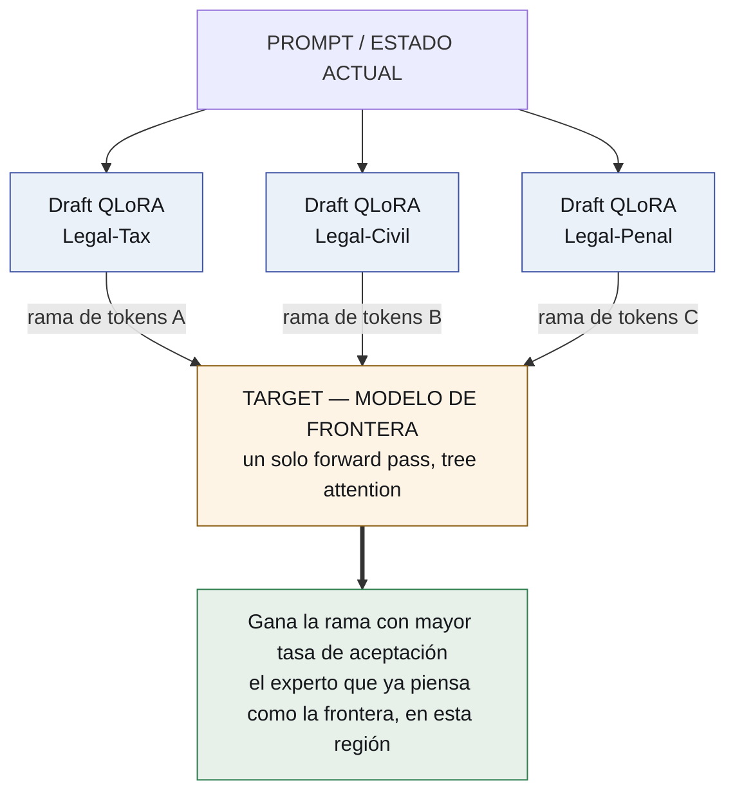
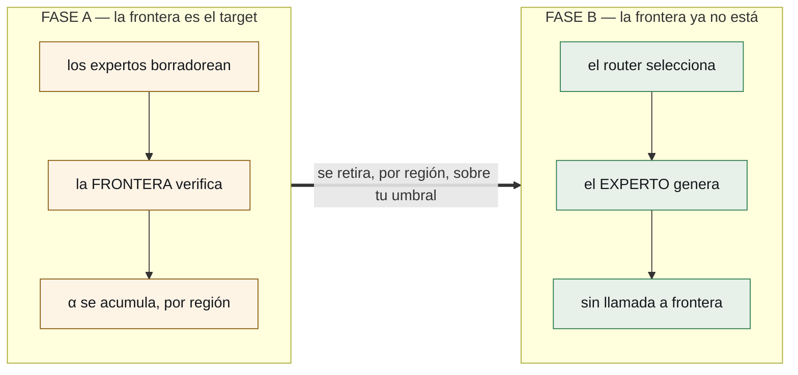

# La frontera es andamio

*Cómo destilar un modelo de frontera en un pool de expertos chicos sin correr
nunca una evaluación — y después sacar la frontera.*

*[Read this in English](../the-frontier-is-scaffolding.md)*

---

Ismael Faro me sugirió que estudiara la decodificación especulativa y viera para
qué podía servir.

La sugerencia fue acertada del modo en que suelen serlo las buenas sugerencias: no
porque el uso obvio funcionara, sino porque estudiarla con cuidado produjo una
pregunta mejor que la que yo tenía al empezar. Esto es lo que encontré, en el
orden en que lo encontré.

## El punto de partida

Dos hechos, ordinarios cada uno por su lado.

**Uno.** vLLM puede sostener muchos adaptadores LoRA sobre un único modelo base
residente y servirlos en el mismo batch. Una base en memoria, muchos deltas
chicos, ningún segundo modelo.

**Dos.** La decodificación especulativa acelera la generación haciendo que un
modelo chico adivine hacia adelante. Un **drafter** propone un puñado de tokens;
un **target** los chequea todos en un solo forward pass; sobreviven los que
sobreviven. Y viene con una garantía que es la razón entera por la que alguien la
usa: **los tokens que salen se distribuyen exactamente como los habría emitido el
target.** El drafter puede hacer que la respuesta llegue antes. No puede hacer que
sea otra respuesta.

Ahora juntá las dos, y tomá una decisión que define todo.

## La decisión: el target es un modelo de frontera

Que los expertos sean los drafters, y que lo que los verifica sea un modelo de
frontera.

Tres o cuatro adaptadores de dominio borradorean en paralelo sobre el mismo
contexto. El modelo de frontera verifica cada rama en un solo forward pass con
tree attention. La rama que más acepta es la que se emite.

Mirá lo que significa ahora la tasa de aceptación.

El modelo de frontera no está coincidiendo con el adaptador más soso. Está
coincidiendo con el adaptador que **produjo lo que la frontera misma estaba por
producir** — en este dominio, en este problema, ahora. Eso no es un estadístico de
velocidad. Es una puntuación de destilación por región, y la obtenés gratis,
dentro de una inferencia que ibas a pagar igual.

No estás corriendo una evaluación. No estás construyendo un benchmark. Estás
sirviendo tráfico, y el camino de servicio va llenando un mapa en silencio: *qué
experto chico puede ya reemplazar a la frontera, y dónde.*

El enrutamiento, que normalmente cuesta la llamada a un clasificador en el que
nadie confía, no cuesta nada. Los tokens ya existían. El pase ya iba a ocurrir. El
ganador es un subproducto.

## Y después sacás la frontera

Ésta es la parte que convierte un truco ingenioso en una arquitectura.

El modelo de frontera es **andamio**, y el diseño dice cuándo sacarlo.

En la **Fase A** pagás precio de frontera y obtenés respuestas de frontera. El
mapa se llena. Para cada región del problema, la tasa de aceptación de un
adaptador sube — la frontera le sigue dando la razón.

En la **Fase B**, para las regiones donde un adaptador cruzó el umbral que
elegiste, lo **promovés de drafter a generador y sacás la frontera**. Lo que la
reemplaza no es otro modelo grande. Es **sólo un router**, ajustado sobre la
superficie de aceptación que la Fase A ya produjo.

El umbral es tuyo, por región, sobre una superficie medida: ¿cuánta coincidencia
con la frontera exigís antes de permitir que un experto chico conteste solo? Y es
reversible — una región cuyo puntaje verificado baja vuelve a la Fase A.

Hay un número que toda esta arquitectura existe para achicar: la **brecha de
retiro**, el puntaje verificado de tarea después de que la frontera se va, menos
el que tenía mientras estaba. Todo lo demás es maquinaria al servicio de ese
número.

## Todo el sistema colapsa en adaptadores

Una vez que el enrutamiento es gratis y el maestro es removible, el resto se cae
solo.

**El harness se vuelve un adaptador.** Hoy un harness es un esquema JSON gigante
en el system prompt más un parser adivinando si el modelo quiso llamar una
herramienta. En cambio, entrenás un `harness.lora` en nada más que el protocolo de
ejecución: sintaxis de tools, transiciones de estado, formas de error, y **action
tokens** — `<invoke_tool name="sql">`, `<eval_state>`, `<observe>` — emitidos
nativamente en vez de recuperados con una expresión regular. El esquema se va del
context window. El adaptador de dominio piensa; el kernel actúa.

**Los agentes se vuelven adaptadores.** Unos cientos de megabytes cada uno,
intercambiados por request.

**El bucle de evolución se vuelve un torneo de adaptadores.** Varios por
subdominio, puntuados por éxito verificado de tarea, aceptación contra la
frontera, y tokens quemados. El peor se descarta; las mejores trayectorias de los
ganadores se vuelven un dataset DPO/GRPO y entrenan el siguiente delta, offline,
en el pase de sueño, sobre trazas que `agentvcs` versionó.

Dos cosas siguen tercamente no neuronales, y es deliberado:

**La memoria es markdown en git.** Un delta de pesos no se puede leer, diffear,
citar ni corregir. Toda medición que tiene esta organización sobre memoria dice
que el activo durable es la parte que una persona puede leer.

**La ejecución es un sandbox.** Las herramientas corren como procesos.

Ése es el sistema. Una GPU, un modelo base, un pool de deltas, un repositorio de
texto y un sandbox. El framework multi-agente — el Python orquestando llamadas a
APIs, el modelo router, la inyección de esquemas, la lógica de reintentos — no
está, porque se convirtió en pesos.

## Qué tiene que ser cierto, y qué cuesta

Quiero ser preciso sobre el estado del terreno, porque el atractivo de una idea no
es lo mismo que su disponibilidad.

**Servir multi-LoRA sobre un target shippea hoy.** La verificación de drafts en
árbol shippea hoy. **LoRA-como-drafter todavía no** — es un RFC abierto de vLLM,
presentado el 12 de agosto de 2026. Hasta que aterrice, la Fase A corre con
adaptadores aplicados a modelos drafter fuera del camino especulativo de vLLM, o
con drafters chicos por dominio: más memoria, idéntico experimento.

El RFC es además el mejor argumento a favor de la economía: un **adaptador r=64 es
unas 28× más chico** que el drafter de 0,8B que reemplaza, con calidad de borrador
dentro de un **2%** de un drafter entrenado por dominio. Esa razón es por qué un
pool de veinte expertos es algo razonable de tener en memoria.

**La parte genuinamente difícil es el KV cache.** Las ramas de un mismo drafter
comparten una representación cacheable — eso es lo que explota la tree attention.
Las ramas de *adaptadores distintos* no, porque un LoRA cambia las proyecciones
que producen K y V. La compartición de prefijo es estándar; la compartición de
ramas entre adaptadores es el problema abierto. Vale la pena resolverlo una vez
que la primera superficie de aceptación diga que las ramas valen la comparación, y
no antes.

## Dos cosas que traigo de mediciones que no fueron amables

**El adaptador de harness tiene un baseline, y es nuestro.** No "esquemas JSON
grandes", que es la comparación que lo adularía. `gemma4nanoloop` ya llevó el
schema pico de 5.548 tokens a 817 — una reducción del 85% — atando tools por fase,
sin entrenar nada. Y en sintaxis el titular es constrained decoding, que no vuelve
improbable la salida malformada sino **imposible**; eso también lo construimos, en
`token-trie`, y lo archivamos por una razón que importa acá: enmascarar logits
necesita el sampler, y una API no te da el sampler. **Ser dueño del runtime es lo
que hace que algo de esto exista.**

**El torneo puede criar adulación.** El mismo procedimiento, el mismo texto, la
misma regla, clasificó una vez como *compensación de interfaz* en un modelo de 4B
y como *ganancia persistente* en uno de 12B. Que un experto sea real no es
propiedad del experto — es propiedad del par. Así que el término de éxito de tarea
de la función de fitness tiene que venir de un verificador que el bucle no pueda
ver, o el bucle va a evolucionar con entusiasmo adaptadores que coinciden con su
evaluador y no saben nada.

## Qué se corre primero

Un chequeo de headroom, porque un modelo base ya en el techo hace que todos los
expertos empaten y un empate se lee como éxito.

Después dos adaptadores de dominio y un target de frontera, para producir la
primera superficie de aceptación — la Fase A en miniatura.

Después el retiro, y el número que decide todo: cuánta calidad verificada se
pierde cuando la frontera se va.

---

*El repositorio es [`lora-kernel`](https://github.com/EvolvingAgentsLabs/lora-kernel).
Todavía no hay nada construido.*

*Gracias a [Ismael Faro](https://github.com/ismaelfaro), que sugirió estudiar
esto, y tenía razón por un motivo que ninguno de los dos tenía en mente.*
