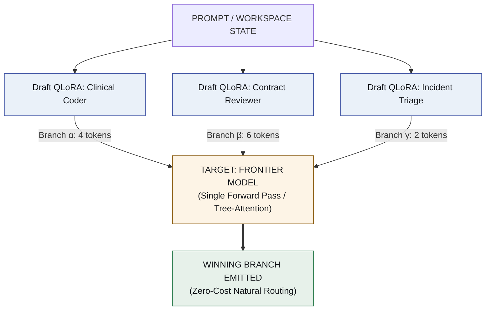
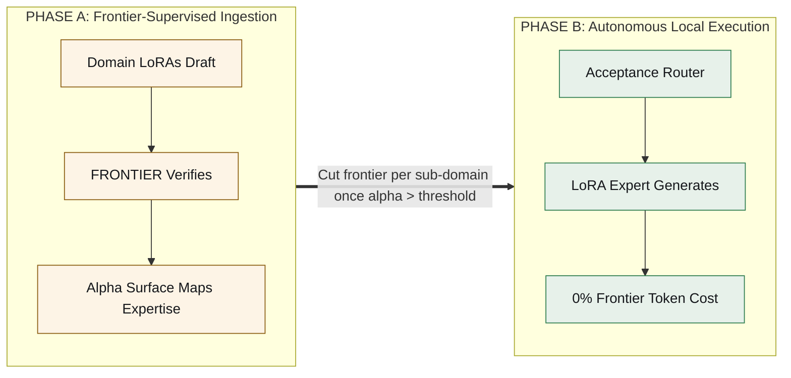

# The Entire Agent Stack is Just Weight Deltas
### *How speculative decoding turns multi-agent systems, harnesses, and zero-shot routing into a pool of QLoRAs — and makes the frontier model obsolete.*

*[Léeme en español](es/the-frontier-is-scaffolding.md)*

---

Modern multi-agent architectures are built on the wrong substrate.

We are gluing together brittle Python orchestrators, stuffing megabytes of JSON schemas into system prompts, and burning millions in API calls just to route user queries between models. 

What if the entire agentic system—the orchestration harness, the tool protocols, the domain experts, and the routing logic—**was nothing more than a set of hot-swappable QLoRA adapters running over a single resident base model?**

And what if the expensive frontier model you start with (Claude, GPT-4) is merely **scaffolding designed to be systematically removed?**

Here is how speculative decoding and multi-LoRA serving make this inevitable.

---

## 1. The Collision: Multi-LoRA Meets Speculative Tree Decoding

Two established primitives, when combined, break the agent paradigm:

1. **Multi-LoRA Serving (vLLM / S-LoRA):** A single GPU keeps one base model in memory while dynamically swapping and serving dozens of lightweight adapter deltas (QLoRAs) in the exact same batch.
2. **Speculative Decoding:** A small **drafter** proposes tokens ahead; a large **target** verifies them in a single parallel forward pass. Crucially, the output distribution is mathematically guaranteed to be identical to the target model's output.

Now, make the architectural leap: **What if your drafters are domain-expert LoRAs, and your target verifier is a Frontier Model?**



### Speculative Decoding IS Your Router
When multiple small domain adapters draft simultaneously on the same context, the frontier model validates all branches in a single tree-attention pass. 

The branch with the highest acceptance rate ($\alpha$) wins and gets emitted.

This changes everything:
* **Zero-cost routing:** You don’t need an LLM classification step or an embedding router. Routing happens naturally inside the forward pass you were already running.
* **Continuous, free distillation:** The acceptance rate $\alpha$ is not just a latency metric; it is an organic, real-time heatmap showing **where your small experts already match frontier quality** without running a single offline benchmark.

---

## 2. The Frontier is Scaffolding: Organic Phase-Out

You do not build a moat by staying hooked to proprietary frontier APIs. You use the frontier to train its own replacements during live production traffic.



* **Phase A (Bootstrap):** You pay frontier prices. Three adapters draft; the frontier verifies. You build an empirical "competence map" across problem clusters.
* **Phase B (Withdrawal):** Once an adapter consistently hits a predefined acceptance threshold ($\alpha \ge 85\%$) in a specific problem subspace, **you drop the frontier target entirely**. The small expert runs natively on local weights.
* **Reversibility:** If a task shifts distribution and local confidence drops, the runtime transparently hooks the frontier back in for that query cluster until the expert re-learns.

---

## 3. The Harness Belongs in the Weights, Not the Prompt

The dirtiest secret in modern agent frameworks (LangChain, CrewAI, AutoGen) is **prompt-based orchestration**. 

Today, frameworks waste thousands of context tokens dumping JSON schemas into the system prompt, and then pray that regex parsers or constrained samplers can recover malformed tool calls.

**We put the harness into the weights.**

We train a dedicated adapter—`harness.lora`—whose sole job is mastering the execution protocol:
* Emitting native **action tokens** (`<invoke_tool name="sql">`, `<eval_state>`, `<yield>`).
* Handling error recovery patterns and API payloads.
* Enforcing deterministic state transitions.

```
┌────────────────────────────────────────────────────────────────┐
│                   THE ALL-IS-LoRA STACK                        │
├────────────────────────────────────────────────────────────────┤
│  [ TASK REQUEST ]                                              │
│         │                                                      │
│         ▼                                                      │
│  [ Domain-LoRA ]   ──► Generates reasoning / domain tokens     │
│         │                                                      │
│         ▼                                                      │
│  [ Harness-LoRA ]  ──► Emits native execution & tool tokens    │
│         │                                                      │
│         ▼                                                      │
│  [ Python Sandbox] ──► Deterministic execution of real tools   │
└────────────────────────────────────────────────────────────────┘
```

**Why this matters:**
1. **Zero context tax:** Tool schemas leave the prompt entirely.
2. **Versionable infrastructure:** The harness stops being rigid Python code and becomes an evolvable weight delta. You can run `harness-v1` vs `harness-v2` in a tournament and retire the worse one overnight.

---

## 4. Two Competitions: Routing vs. Evolution

To prevent agentic chaos, the system cleanly separates two distinct time scales:

| Level | Mechanism | When it happens | Goal |
| :--- | :--- | :--- | :--- |
| **Inter-Domain** | **Speculative Routing** | *Per request (Online / Fast)* | Selects between `tax-law`, `clinical-triage`, and `code-review` via tree acceptance. |
| **Intra-Domain** | **Evolutionary Selection** | *Offline / Sleep Cycle (Batch)* | Pits `contract-v1`, `contract-v2`, and `contract-v3` against each other over 1,000 runs. |

During the **"Sleep Cycle"**, trace logs versioned in Git are processed. The weakest domain adapters are pruned; the best trajectories are compiled into DPO/GRPO datasets to train generation $N+1$.

---

## 5. The Radical Simplification: What Stays Non-Neural

When orchestration, routing, tools, and domain skills collapse into LoRA deltas, what remains?

Only two things—and both are deliberately non-neural:

1. **Memory is Markdown versioned in Git (`agentvcs`):** Neural weights are black boxes. Durable knowledge, skill definitions, traces, and corporate memory must be inspectable, diffable, and editable by humans in plain text.
2. **Execution is an Isolated Sandbox:** Code, shell, and SQL run as native OS processes.

**The result:** The bloated multi-agent Python runtime evaporates. You are left with:
$$\text{GPU} + \text{Resident Base Model} + \text{Pool of QLoRA Deltas} + \text{Git Repository} + \text{Sandbox}$$

---

## 6. Current State & Engineering Frontiers

Let’s be precise about what works today and what remains an open frontier:

* **What ships today:** Multi-LoRA serving over a single base model in vLLM; Tree-Attention verification.
* **The open vLLM frontier:** Native *LoRA-as-drafter* inside speculative decoding pipelines (currently an active vLLM RFC). An $r=64$ adapter is **~28× smaller** than a dedicated 0.8B drafter model with virtually zero drafting loss (~2%).
* **The KV Cache Challenge:** Cross-adapter branch sharing is the real engineering wall. While prefix caching is standard, branching across *different LoRA projections* requires custom kernel optimization.

---

## What We Run First

1. **Headroom validation:** Measuring acceptance surfaces across multiple base model tiers.
2. **A 2-Adapter + 1-Frontier Pilot:** Generating the first live competence map.
3. **The Withdrawal Test:** Measuring the quality delta when the frontier scaffold is unplugged.

---

*The repository is [`lora-kernel`](https://github.com/EvolvingAgentsLabs/lora-kernel).*

*Special thanks to [Ismael Faro](https://github.com/ismaelfaro) for pointing toward speculative decoding—which turned out to be the missing key to agentic distillation.*
