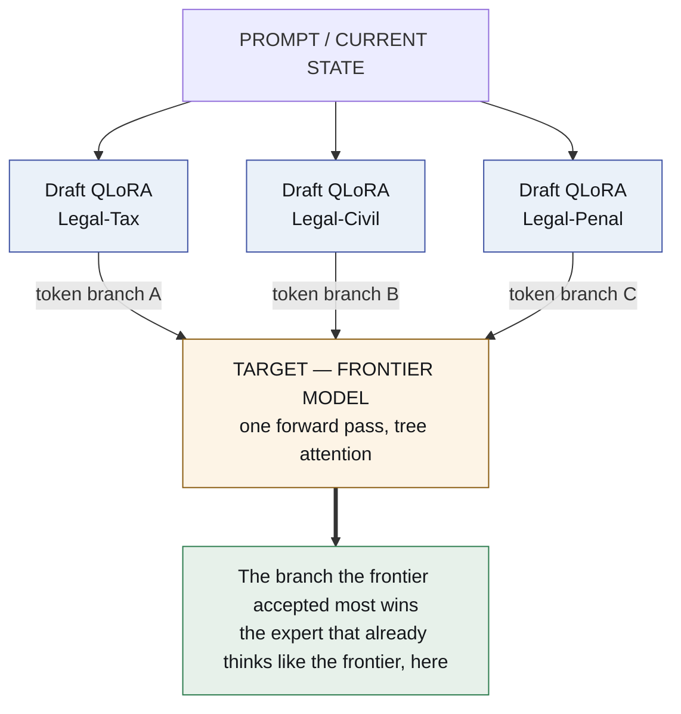
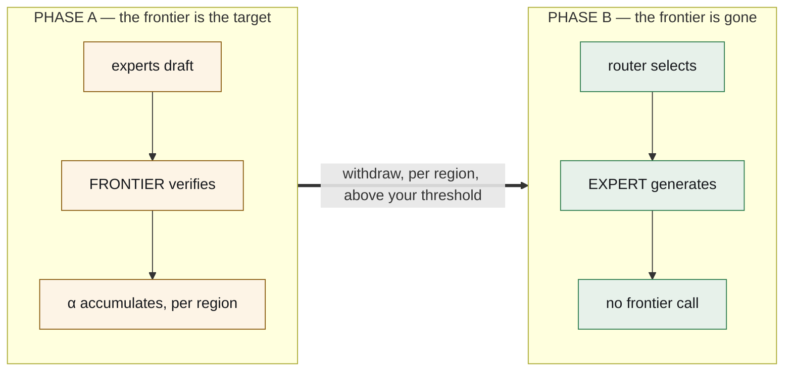

# The frontier is scaffolding

*How to distil a frontier model into a pool of small experts without ever running
an evaluation — and then take the frontier out.*

---

Ismael Faro suggested I go and study speculative decoding, and see what it could
be used for.

What follows is what that study turned into: an architecture in which **the
entire agentic system is a set of QLoRA adapters over one base model**, the
routing between them costs nothing, and the expensive model you start with is
designed to be removed.

## The setup

Two facts, both ordinary on their own.

**One.** vLLM can hold many LoRA adapters over a single resident base model and
serve them in the same batch. One base in memory, many small deltas, no second
model.

**Two.** Speculative decoding makes generation faster by having a small model
guess ahead. A **drafter** proposes a handful of tokens; a **target** checks them
all in one forward pass; the survivors are kept. And it comes with a guarantee
that is the entire reason anyone uses it: **the tokens that come out are
distributed exactly as the target would have emitted them.** The drafter can make
the answer arrive sooner. It cannot make it a different answer.

Now put those together, and make one choice that decides everything.

## The choice: the target is a frontier model

Let the experts be the drafters, and let the thing that verifies them be a
frontier model.

Three or four domain adapters draft in parallel on the same context. The frontier
model verifies every branch in a single forward pass with tree attention. The
branch it accepts most is the one that gets emitted.

Look at what the acceptance rate now means.

The frontier model is not agreeing with the blandest adapter. It is agreeing with
the adapter that **produced what the frontier itself was about to produce** — in
this domain, on this problem, right now. That is not a speed statistic. That is a
per-region distillation score, and you get it for free, inside inference you were
paying for anyway.

You are not running an evaluation. You are not building a benchmark. You are
serving traffic, and the serving path is quietly filling in a map: *which small
expert can already stand in for the frontier, and where.*

Routing, which normally costs a classifier call nobody trusts, costs nothing. The
tokens existed. The pass was happening. The winner is a by-product.

## Then you take the frontier out

This is the part that turns a clever trick into an architecture.

The frontier model is **scaffolding**, and the design says when to remove it.

In **Phase A**, you pay frontier prices and you get frontier answers. The map
fills in. For each region of the problem space, one adapter's acceptance rate
climbs — the frontier keeps agreeing with it.

In **Phase B**, for the regions where an adapter crossed the threshold you chose,
you **promote it from drafter to generator and drop the frontier**. What replaces
the frontier is not another large model. It is **only a router**, fitted to the
acceptance surface Phase A already produced.

|  | Phase A | Phase B |
|---|---|---|
| **cost** | frontier | local |
| **quality** | frontier | at the α threshold you required |
| **what you also get** | a distillation score, free | — |

The threshold is yours to set, per region, on a measured surface: how much
frontier agreement do you demand before a small expert is allowed to answer
alone? And it is reversible — a region whose verified score drops goes back to
Phase A.

There is one number this whole architecture exists to make small: the **withdrawal
gap**, the verified task score after the frontier leaves minus the score it had
while it was there. Everything else is machinery in service of that number.

## The whole system collapses into adapters

Once the routing is free and the teacher is removable, the rest falls over.

**The harness becomes an adapter.** Today a harness is a giant JSON schema in the
system prompt plus a parser guessing whether the model meant to call a tool.
Instead, train one `harness.lora` on nothing but the execution protocol: tool
syntax, state transitions, error shapes, and **action tokens** — `<invoke_tool
name="sql">`, `<eval_state>`, `<observe>` — emitted natively rather than
recovered by regex. The schema leaves the context window. The domain adapter
thinks; the kernel acts.

**The agents become adapters.** A few hundred megabytes each, swapped per
request.

**The evolution loop becomes a tournament over adapters.** Several per
sub-domain, scored on verified task success, acceptance against the frontier, and
tokens burned. The worst is dropped; the winners' best trajectories become a
DPO/GRPO dataset and train the next delta, offline, in the dream pass, over
traces that `agentvcs` versioned.

Two things stay stubbornly non-neural, and that is deliberate:

**Memory is markdown in git.** A weight delta cannot be read, diffed, cited, or
corrected by a person. Everything this organisation has measured about memory
says the durable asset is the part a human can read.

**Execution is a sandbox.** Tools run as processes.

That is the system. A GPU, a base model, a pool of deltas, a text repository, and
a sandbox. The multi-agent framework — the Python orchestrating API calls, the
router model, the schema injection, the retry logic — is gone, because it turned
into weights.

## What has to be true, and what it costs

I want to be precise about the state of the ground, because the appeal of an idea
is not the same as its availability.

**Multi-LoRA serving over one target ships today.** Tree-structured draft
verification ships today. **LoRA-as-drafter does not yet** — it is an open vLLM
RFC, filed on 12 August 2026. Until it lands, Phase A runs with adapters applied
to drafter models outside vLLM's speculative path, or with small per-domain
drafters: more memory, identical experiment.

The RFC is also the best argument for the economics: an **r=64 adapter is about
28× smaller** than the 0.8B drafter it replaces, at drafting quality within
roughly **2%** of a fully-trained per-domain drafter. That ratio is why a pool of
twenty experts is a reasonable thing to hold in memory.

**The genuinely hard part is the KV cache.** Branches from one drafter share a
representation you can cache — that is what tree attention exploits. Branches
from *different adapters* do not, because a LoRA changes the projections that
produce K and V. Prefix sharing is standard; cross-adapter branch sharing is the
open problem. It is worth solving once the first acceptance surface says the
branches are worth comparing, and not before.

## Two things I am carrying in from measurements that were not kind

**The harness adapter has a baseline, and it is ours.** Not "large JSON schemas",
which is the comparison that would flatter it. `gemma4nanoloop` already took peak
schema overhead from 5,548 tokens to 817 — a reduction of 85% — by binding tools
per phase, with no training at all. And on syntax the incumbent is
grammar-constrained decoding, which does not make malformed output unlikely, it
makes it impossible; we built that too, in `token-trie`, and archived it for a
reason that matters here: masking logits needs the sampler, and an API does not
give you the sampler. **Owning the runtime is what makes any of this available.**

**The tournament can breed flattery.** The same procedure, the same text, the
same rule, once classified as *interface compensation* on a 4B model and as
*persistent gain* on a 12B. Whether an expert is real is not a property of the
expert — it is a property of the pair. So the fitness function's task-success
term has to come from a verifier the loop cannot see, or the loop will
enthusiastically evolve adapters that agree with their scorer and know nothing.

## What runs first

A headroom check, because a base model already at the ceiling makes every expert
tie and a tie reads as a success.

Then two domain adapters and one frontier target, to produce the first acceptance
surface — Phase A in miniature.

Then the withdrawal, and the number that decides everything: how much verified
quality is lost when the frontier walks away.

---

*The repository is [`lora-kernel`](https://github.com/EvolvingAgentsLabs/lora-kernel).
Nothing is built yet.*

*Thanks to [Ismael Faro](https://github.com/ismaelfaro), who suggested studying
speculative decoding — and whose suggestion turned out to be about distillation.*
